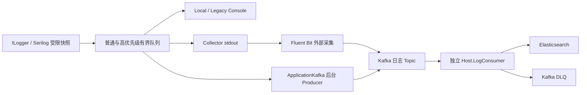

# 日志模块：配置、模式选择与运维知识库

> 更新：2026-10-02；源码基线：`a7a68776`。本文面向开发、部署和运维，描述当前可用配置，不把历史方案示例当作部署接口。后续配置变更以源码、Chart 校验及实际验证为准。

## 1. 从哪里开始

- 想看本机日志：阅读第 3、5 节，使用非生产 `Local`。
- 想集中查看多个实例：阅读第 3、6 节，选择 `Collector`，另外部署采集及存储设施。
- 想省去 stdout 采集环节：阅读第 3、7 节，选择 `ApplicationKafka`，另外部署 Broker 和消费者。
- 想看后台“请求参数 / 返回内容”：阅读第 9 节，配置 B1 受限详情；这与 Kafka 模式无关。
- 想处理积压、丢弃、重启或切换：阅读第 10、11 节。

长期决策见 [ADR-0012](../docs/architecture/adr/ADR-0012-configurable-log-delivery.md)，实现说明见[日志模块运维手册](../docs/operations/logging-module.md)，本期验证见[收尾验收](../docs/verification/2026-10-02-logging-module-closeout.md)。历史计划中的待办不自动代表当前缺口，也不代表所有设想都已实现。

## 2. 日志、审计、Trace 是不同的数据通路

| 通路 | 用途 | 写入和可靠性边界 | 主要查看入口 |
| --- | --- | --- | --- |
| B0 领域审计 | 重要业务状态变更的审计事实 | 按业务事务边界写库，不改成普通日志 | 对应业务/审计功能 |
| B1 HTTP 重要审计 | 操作、异常、出站调用及受限操作详情 | 独立有界微批写审计库；等待写入尝试，默认 fail-open 并告警 | Vue 管理端日志页面 |
| B2 / 运行诊断日志 | 请求摘要、宿主和运行诊断 | `ILogger<T>` → Serilog → 有界后台管道；允许采样、过载丢弃 | stdout、集中日志存储 |
| Trace / Metrics | 调用链、耗时、吞吐与资源指标 | OpenTelemetry 独立出口 | 对应追踪和监控平台 |

Kafka/ES 的开关主要改变 B2 集中投递路线，不替换 B0/B1 数据库。后台操作日志并非从 ES 读取；开启 Kafka 不会自动丰富“请求参数”页签。日志与 Audit 不使用事务 Outbox；可靠业务事件仍走自己的 Outbox/Inbox 通路。

访问日志入库属于单独的 `Auditing:AccessLogCapture` 功能，默认配置与 Development 覆盖可能不同；开启后查询接口自身也可能被记录，不能用全局总数恒定判断是否重复。

## 3. 四种应用入口与适用场景

| 入口 | 适用场景 | 应用行为 | 环境要求与限制 |
| --- | --- | --- | --- |
| `Legacy` | 现有系统暂不迁移，保持兼容 | 不设置新模式时保留既有 Console/旧 ES 行为 | Helm 默认值；旧 ES 默认关闭。不是“保证只在本地”的模式 |
| `Local` | 开发、离线诊断、非生产预览 | 应用内 Console 输出 | Collector 必须排除该流；生产 Chart 拒绝 Local。stdout 被其他平台采集时仍可能外发 |
| `Collector` | Kubernetes 多实例集中采集，应用不持有远程日志凭据 | 应用输出 Compact JSON，外部采集器接管 | 单独部署固定版本采集器、路由、缓冲及目标；允许显式生产入口配置 |
| `ApplicationKafka` | 已有 Kafka 平台，愿意承担宿主客户端和凭据，希望简化采集链 | 后台 Producer 发送普通/优先两个 Topic | 静态适配器、TLS、双 Topic、预算、冻结索引路由、Producer Secret；允许显式生产入口配置 |

`Legacy` 是 Chart 的入口值；应用 `LoggingOptions.DeliveryMode` 的兼容状态是**不设置**，不要向应用写入 `DeliveryMode=Legacy`。显式模式必须同时设置同值 `ExpectedDeliveryMode`。显式模式与旧 `Elasticsearch.Enabled=true` 冲突时启动拒绝。入口及凭据/路由变更通过重新发布和重启生效，不自动热切换。

两种集中路线的选择依据请求 P99、每实例日志**字节**吞吐、CPU、托管/native 内存、丢弃率及故障恢复。现有同负载正反序试验没有稳定性能胜者，不因“Kafka 并发高”或“本地队列快”直接选定路线。见[路线比较](../docs/verification/2026-10-01-logging-route-comparison.md)。

### 拓扑与组件开关



图中不同入口是部署时的选择，不是同时广播。Collector 的采集出口也可以设计为直接存储，但不能把它与已验证 Kafka→独立消费者组合的确认语义混为一谈。

| 部署组合 | Kafka | ES | 说明 |
| --- | --- | --- | --- |
| Local | 不需要 | 不需要 | 非生产；外部采集规则需排除 |
| Collector + 直接存储 | 可不使用 | 按目标选择 | 采集出口另行配置和验证；应用 Chart 不替你创建 ES 或出口 |
| Collector + Kafka + 消费者 | 使用 | 当前消费者使用 | 采集器到 Broker，再由独立消费进程写 ES |
| ApplicationKafka + 消费者 | 使用 | 当前消费者使用 | 应用直发 Broker，采集器排除该应用流 |

Kafka 与 ES 在架构上分别可选，但**当前 `Host.LogConsumer` 必须配置 ES**，不是可任选目标的通用消费者。关闭 ES 而保留 Kafka，必须另外配置有效消费目的地，不能只打开 Producer 后期待日志可查询。

## 4. 组件职责与环境要求

| 组件 | 运行位置 | 必需资源/权限 | 不负责什么 |
| --- | --- | --- | --- |
| API / Worker 的日志管道 | 每个宿主进程 | 独立条数、字节和退出预算；仅直发入口需要 Kafka Producer 凭据 | 不提供默认磁盘 Spool；不确认最终 ES 落库 |
| Fluent Bit | 平台管理 DaemonSet | 容器日志读取、Kubernetes 元数据、缓冲磁盘、出口连接；参考固定镜像 4.1.1 | 应用配置开启不等于 DaemonSet 已安装 |
| Kafka | 独立 Broker 平台 | 日志 Topic、分区、保留、复制/ISR、ACL、TLS、磁盘与配额 | 不自动消费或写 ES；不保住未到 Broker 的应用内存日志 |
| Host.LogConsumer | 独立平台进程 / 独立 Chart | Kafka 读/Group 权限、DLQ 写权限、ES 最小写权限、CA 与资源预算 | 不复用业务 Worker；不执行 B1 详情清理 |
| Elasticsearch | 独立查询存储 | HTTPS、授权、固定索引/保留策略、磁盘、分片及写入预算 | 不是审计数据库；不接收 Restricted 详情 |
| 业务 Worker / Migrator | 原有宿主 | 双库迁移、审计写入及详情清理 | 不自动启动独立日志消费者 |

本地编译遵循[构建与测试指南](build-and-test.md)，真实链路测试需要 Docker。Kubernetes 部署需要可用集群、Helm、对应镜像、Secret 和网络路径；Prometheus Operator CRD 仅在启用消费者 PodMonitor 时需要。Chart 不创建 Broker/ES 集群。

本机 `kind-fullnet-local` 可用于联调；三个节点共用一台 Docker Desktop 主机。按项目批准标准，本地实际测试可作为验收证据，结论必须限定硬件、规模和故障范围，不能据此宣称独立物理故障隔离或 10K 容量已通过。

ApplicationKafka 涉及 Confluent.Kafka/native 依赖，不能仅改配置就让不含静态适配器的自定义宿主具备能力。已有 API/Worker 原生运行证据不自动覆盖其他 OS、RID 或自定义发布产物。运行时关闭也不代表依赖从发布闭包移除；核心 Hosting 仍保留旧 ES Sink 的兼容引用。

## 5. 应用配置：默认值与最小示例

### 公共预算

配置节为 `FullNet:Logging`，见 [LoggingOptions](../src/BuildingBlocks/Full.NET.Hosting/Observability/LoggingOptions.cs)。

| 键 | 默认值 | 含义 |
| --- | ---: | --- |
| `AsyncBufferSize` | 10000 | 普通队列条数 |
| `HighPriorityAsyncBufferSize` | 1000 | Error/Fatal 独立队列条数 |
| `GeneralQueueMaxBytes` | 67108864 | 普通队列与 Sink 在途快照预算，64 MiB |
| `HighPriorityQueueMaxBytes` | 8388608 | 优先队列独立预算，8 MiB |
| `MaxEventBytes` | 16384 | 单条输出 JSON 最大 UTF-8 字节 |
| `BlockWhenFull` | false | true 被拒绝；满载不等待请求线程 |
| `ShutdownFlushTimeout` | `00:00:05` | 两通道共享退出预算；不是成功交付保证 |
| `IndexRouteVersion` / `IndexRetentionDays` | 0 / 0 | 默认未启用；正值必须成对配置，分别 1..9999 / 1..3650 |

非生产本机明确选择 Local 的配置片段：

```json
{
  "FullNet": {
    "Logging": {
      "DeliveryMode": "Local",
      "ExpectedDeliveryMode": "Local",
      "BlockWhenFull": false,
      "Elasticsearch": { "Enabled": false }
    }
  }
}
```

Collector 使用相同片段并把两个模式值改为 `Collector`。若准备接入当前消费者写 ES，再成对设置 `IndexRouteVersion=1`、`IndexRetentionDays=30`，并在消费者使用一致映射。应用启动校验只能核对本地配置，不能证明外部采集设施正常。

应用配置环境变量用双下划线，例如 `FullNet__Logging__DeliveryMode=Collector`。不要把宿主 `Logging:LogLevel`、HTTP 捕获模式和投递模式当成同一个开关。当前 Serilog 管道代码设定最低 Information、Microsoft.AspNetCore 最低 Warning；修改 `Logging:LogLevel` 不能假定覆盖这些值，临时诊断另按受控策略处理，见[默认服务注册](../src/BuildingBlocks/Full.NET.Hosting/Observability/ServiceDefaultsExtensions.cs)。

当前应用双通道使用 `BlockingCollection<LogEnvelope>` / `ConcurrentQueue<LogEnvelope>` 和专属消费线程；B1 微批使用独立有界 Channel。**有界双通道是一种容量隔离结构，System.Threading.Channels 是实现工具**，二者不是互斥路线。不要为统一类型而改变非阻塞与审计等待语义。

## 6. Collector 的部署设置

应用 Chart [values.yaml](../deploy/helm/fullnet/values.yaml) 支持下面的入口片段；它必须与角色、镜像、Provider 和原有安全 values 合并，不是完整安装配置。

```yaml
production: true
dotnetEnvironment: Production
logging:
  ingress: Collector
  indexRouteVersion: 1
  indexRetentionDays: 30
```

Chart 将入口和同值预期模式及 `fullnet.io/log-ingress` 标签放入同一 Pod 发布契约。Collector 应用不注入 Kafka/ES 凭据。固定采集规则仅接收 `collector` 标签的流，元数据缺失失败关闭；Local/ApplicationKafka 日志不能被同一规则重复投递。

[Fluent Bit 参考配置](../deploy/observability/fluent-bit-values.yaml)含 Compact JSON 解析、字段准入、普通/优先分流及 filesystem 缓冲。它并非一个 `logPipeline.enabled` 即可安装的应用 Chart 功能；运维手册中的 `logPipeline.*` 综合拓扑示例是**计划模型，不是当前 Chart 接口**。

参考缓冲使用 `emptyDir`，可能帮助应对出口短时故障，但不能承诺 Pod 重建/节点丢失后重放。filesystem 缓冲、逻辑队列额度和物理磁盘占用不是同一个上限；满盘还可能导致输入写入失败。选择持久卷必须另外核对存储、故障窗口和恢复证据，不因改成 PVC 就承诺零丢失。

## 7. ApplicationKafka 的部署设置

应用 Chart 片段：

```yaml
production: true
dotnetEnvironment: Production
logging:
  ingress: ApplicationKafka
  indexRouteVersion: 1
  indexRetentionDays: 30
  kafka:
    configurationSecretName: fullnet-log-producer
    caSecretName: fullnet-log-producer-ca
```

Producer Secret 固定键：`bootstrapServers`、`generalTopic`、`priorityTopic`、`securityProtocol`；SASL 另需 `saslMechanism`、`saslUsername`、`saslPassword`。CA Secret 固定键 `ca.crt`；使用系统信任根时 CA 引用可为空。两个 Topic 必须不同，示例名称为 `fullnet.logs.general.v1` 和 `fullnet.logs.priority.v1`。这里只给 Secret 名，不在知识库或 values 中填写真实凭据。

Kafka 配置节 `FullNet:Logging:Kafka`，见 [KafkaLogProducerOptions](../src/BuildingBlocks/Full.NET.Logging.Kafka/KafkaLogProducerOptions.cs)：

| 参数 | 默认值 / 要求 |
| --- | --- |
| `SecurityProtocol` | `Ssl`；仅允许 `Ssl` / `SaslSsl` |
| `MaxPendingMessages` / `MaxPendingBytes` | 10000 / 67108864，应用投递终态预算 |
| `QueueBufferingMaxMessages` / `QueueBufferingMaxKbytes` | 10000 / 65536，SDK 队列预算；后者单位 KiB |
| `MessageMaxBytes` | 1048576；不代表允许突破宿主 `MaxEventBytes` |
| `MaxInFlightRequests` | 5，允许 1..5 |
| `MessageTimeoutMs` / `LingerMs` | 30000 / 5 ms |
| `ShutdownFlushTimeoutMs` | 5000 ms，仅停机阶段 |
| Producer 固定语义 | `Acks=All`、幂等 Producer、投递回调；非每条同步 Flush |

应用预算与 SDK 预算分别限制不同阶段，不应简单加总成精确 RSS。普通/优先 Topic 也不能替代宿主队列及 Producer 资源隔离。

应用只获得日志 Topic 最小写权限；消费者、ES 和集群管理凭据不能共享给 API/Worker。日志 Topic 与业务事件的 Topic、Group、ACL 和容量预算分离。`Acks=All` 的可用性与持久效果仍取决于 Broker 复制、ISR 等实际配置，不是全链 Exactly-Once。

## 8. 独立 Kafka→ES 消费进程

源码入口 [Host.LogConsumer](../src/Hosts/Full.NET.Host.LogConsumer/Program.cs)，Chart 位于 [fullnet-log-consumer](../deploy/helm/fullnet-log-consumer/values.yaml)。**应用入口准入与消费者显式实验开关分别管理**；应用选 ApplicationKafka 不会自动启动它。

```yaml
enabled: true
experimental: true
image:
  repository: fullnet-log-consumer
  tag: "your-fixed-release"
configurationSecretName: fullnet-log-consumer
caSecretName: fullnet-log-consumer-ca
batchMaxRecords: 1
environment: Production
podMonitor:
  enabled: false
```

这是与默认 values 合并的片段，镜像必须真实存在且固定发布标签，不使用 `latest`。默认 `enabled=false`、`experimental=false`；资源请求为 100m / 128Mi、限制为 500m / 256Mi，均是模板起点，不能当作生产容量保证。`batchMaxRecords` 范围 1..8，只收集已经可用的消息，不等待凑批。

| 消费者配置 Secret 键 | 内容 |
| --- | --- |
| `bootstrapServers` / `topics` / `groupId` | Broker、逗号分隔输入 Topic、独立 Consumer Group |
| `dlqTopic` | 与所有输入 Topic 不同的隔离 Topic |
| `routes` | 版本→保留天数，例如 `1:30`，须与宿主冻结路由一致 |
| `maxEventBytes` | 消费者允许的事件字节上限，256..65536；与实际宿主输出协调 |
| `esUrl` / `esApiKey` | HTTPS 根地址（无路径前缀、查询或片段）和最小权限 API Key，安全注入 |
| `securityProtocol` | `Ssl` / `SaslSsl` |
| `saslMechanism` / `saslUsername` / `saslPassword` | SaslSsl 时提供 |

消费者 CA Secret 使用 **`kafka-ca.crt`、`es-ca.crt`**，不同于应用 Producer 的 `ca.crt`。Production 使用在线证书吊销检查；网络须能支持证书链及吊销验证，不关闭验证来绕过配置问题。

消费者关闭自动提交和自动 Offset 存储。仅在 ES **单项**确认或可靠 DLQ Broker 确认后推进分区连续 Offset；Bulk HTTP 成功不等于每项成功。可重试失败不直接提交，重平衡/重启可能造成重投。

索引采用固定 UTC 事件日期路由 `fn-logs-{version}-{class}-{UTC 日期}`，同事件 ID 重试写同索引/ID；不使用 rollover/data stream。版本、发生时间、到期时间不匹配或已到期时不得获得新索引名。去重只覆盖该固定路由与保留窗口，不是跨所有索引永久去重。过期处理也不等于 ES 会自动物理删除旧索引；存储清理策略仍需部署管理。

原 Logstash/PQ 组合的 Offset 与安全落盘顺序未满足要求；不能把 `enable_auto_commit=false` 或 `checkpoint.writes=1` 当作替代此消费者的可靠性证明。历史 Vector/Connect 筛查同样不表示已获准替换实现。

## 9. HTTP 采集、受限详情与后台页面

### B2 请求摘要

`Observability:HttpOperation` 默认开启 `Summary`。`CaptureMode` 可为 `Disabled`、`Summary`、`SanitizedPayload`；成功请求按容量档/`SuccessSampleRate` 采样，错误及慢请求按独立规则进入优先流。`CapacityProfile=XL` 是设计参考，不是 10K 实测通过标志。

SanitizedPayload 只处理静态白名单 `PayloadRouteAllowList` 和受控安全投影；未列出的路由退回摘要。请求上限默认 2048 字节，响应上限默认 0；每实例投影预算默认 1000 事件/秒、2097152 字节/秒。它不能通过配置变成任意原始 Body 捕获器。`CaptureThreadId=false` 为默认；线程号仅说明捕获点，异步请求没有固定生命周期线程。

### B1 受限操作详情

下面的配置只授权已有静态路由和既有投影，不为每个 Endpoint 自动生成请求/返回投影：

```json
{
  "Auditing": {
    "DetailsCapture": {
      "Enabled": true,
      "RetentionHours": 24,
      "MaxRequestPayloadBytes": 2048,
      "MaxResponsePayloadBytes": 2048,
      "CaptureRouteAllowList": ["/api/v1/auditing/operation-logs/exports"]
    }
  }
}
```

默认 Enabled=false、白名单为空，响应摘要预算为 0。启用前完成双库迁移并运行 Worker 的独立到期详情清理；API 后台读取共享检查点，请求只检查本地资格快照。默认刷新 30 秒、缓存最长 90 秒、检查点最长 180 秒、清理积压最多 300 秒；未知/失效/异常一律拒绝新详情。详情保留不超过操作摘要保留期；关闭一般 `Auditing:Retention.Enabled` 不关闭独立详情清理。

操作导出路由已有固定请求摘要（时间范围、状态和成功筛选）及可选结果摘要（行数、截断、敏感列标记）。其他白名单路由仍需各自有受控投影实现；单纯加入白名单不能让任意参数或 Body 出现。

| 字段类别 | 获取原则与目的地 |
| --- | --- |
| 路由、方法、状态、耗时、TraceId | 使用实际 Endpoint/请求上下文及安全摘要；关联诊断 |
| 用户/租户/业务标识 | 可信上下文；按目的地策略脱敏，不作为 Metrics 高基数标签 |
| 客户端及服务端 IP/端口 | 当前 B1 版本 1 详情已支持，可用且资格通过时采集；原地址不进入普通集中出口 |
| 协议、浏览器、语言、来源等截图信息 | 当前 B1 版本 1 详情契约没有这些字段，不能仅靠开关采集/展示；是否在 B2 安全模型中存在需分别核对，新增 B1 字段须扩展受控契约 |
| 请求参数 / 返回内容 | 受控投影，有资格、白名单和字节上限；不保存全量原始 Body |
| 控制器、Action、显示名 | Minimal API 使用实际路由/Endpoint 元数据，不能伪造 MVC 信息 |
| Token、Cookie、密码、连接串、SQL 参数 | 不因截图中出现就允许采集；不能复制到 Console/File/Kafka/ES/DLQ |

“有字段尽量采集”以实际模型、可信来源和隐私边界为前提，不保证截图每一行都有值。代理后的客户端地址依赖正确 `TrustedProxy` 设置，不能信任任意 Forwarded Header。

后台日志消息页签读取摘要；请求参数/返回内容共用受限详情按需获取。独立详情 API 为 `GET /api/v1/auditing/operation-logs/{operationLogId}/details`，同时要求 `auditing.operations.read` 与 `auditing.operations.details.read`，服务端保持隔离；已认证但无权限返回 403，历史/到期/不合法详情返回 404。撤权后的新会话已验证，不能把这解释为所有旧会话已打开抽屉立即清空。

B1 微批默认 Capacity=4096、QueueMaxBytes=64 MiB、MaxBatchRows=64、MaxBatchBytes=256 KiB、MaxBatchDelay=20 ms、EnqueueTimeout=100 ms、ShutdownFlushTimeout=5 秒。其预算包含等待、队列及写库在途，不是 B2 快照队列；超限保持既有 fail-open/告警语义，不能悄悄转为 Kafka 审计。

## 10. 故障与性能判断

| 现象 | 排查重点 | 不能作出的推论 |
| --- | --- | --- |
| 普通/优先队列丢弃 | 等级噪声、单事件大小、队列字节、Sink 速度 | 优先队列独立不代表绝不丢弃 |
| Kafka 已接受发送但回调未完成 | 应用 pending、SDK queue、Broker/TLS/ACL、超时 | Accepted 不代表 Broker ACK |
| Kafka Lag 上升 | 分区分配、消费者资源、ES 单项错误、DLQ ACK、保留余量 | 增加分区或副本必然提升所有阶段吞吐 |
| ES 有请求但查不到事件 | 固定索引、事件日期、路由版本、到期、单项结果 | Broker ACK 或 Bulk HTTP 200 等于 ES 最终可查询 |
| B1 详情缺失 | 开关/白名单/投影、Worker 检查点、权限、到期及预算 | Kafka 正常就会产生 B1 详情 |
| 重启后出现缺口 | 未入持久边界的内存、退出预算、emptyDir、Broker 保留 | 内存排空测试证明 SIGKILL 无损 |

有界队列用于保护请求线程和内存，有限故障窗口内有缓冲作用，不能解决持续“生产速率大于消费速率”。快照构造、竞争、stdout、Producer native 内存、磁盘和 ES 分片均可能成为瓶颈。

按字节估算缓冲：`峰值字节/秒 × 目标故障秒数 × 安全余量`，再结合事件大小分布设置条数；同时计入 Kafka SDK、采集器、消费者及驱动费用，不能把队列计费当进程 RSS 上限。Kafka 保留还须覆盖故障及追赶时间。

应用主要指标见[降级处置](../docs/operations/logging-degraded-mode.md)：`fullnet.logging.queue.depth`、`queue.bytes`、`events.dropped` 等，按 general/high_priority 区分。消费者 `/health/live`、`/health/ready` 和可选 PodMonitor 管理的是消费者本身。采集器抓取参考 `/api/v2/metrics/prometheus`；逻辑 chunk 可用容量不是物理磁盘剩余容量，ENOSPC 不能只依赖输出丢弃指标。

至少一次承诺从经验证的持久边界开始；请求日志进入内存时没有跨重启保证，DLQ 也不是零丢失万能保险。生产 Consumer 的显式实验开关、默认 Legacy 及 `Capacity-not-verified` 仍分别有效。

## 11. 发布、切换和验收

1. 选定单一入口、消费目标和有限保留窗口；保留默认 Legacy 直到明确迁移。
2. 按顺序准备网络/TLS/ACL、Topic、ES 路由与消费者；Collector 路线另准备采集器和存储。
3. 合并对应角色安全 values，核对显式模式/ExpectedDeliveryMode、标签、Secret 固定键、旧 ES 开关；用 Chart 渲染检查拒绝条件。
4. 用少量安全事件核对 ID、普通/优先 Topic、ES 文档、DLQ 与连续 Offset。Console 看见事件不足以证明全链成功。
5. 滚动发布时旧 Pod 按旧入口、新 Pod 按新入口；限时排空旧入口并按 ID 对账，不用自动双写/故障切路掩盖缺口。回退也按发布流程执行。
6. 确认丢弃增量、Lag、资源和请求 P99 符合本次范围；记录实际本地硬件、规模、故障及未验证项，再判定验收。

可用命令：

```text
pnpm test:dotnet:unit -- --selection logging-delivery
pnpm test:helm
pnpm test:observability-deploy
pnpm test:logging:route-comparison:live
```

最后一个为真实链路性能实验，需遵循该[实验记录](../docs/verification/2026-10-01-logging-route-comparison.md)的环境和输入，不能当作无需准备的轻量单测。

本期已有日志单测 318/318、Vue 23/23、SQL Server 真实浏览器 4/4、MySQL 8/8，以及局部 TLS/ACL、故障和原生运行证据，具体范围见收尾报告。未测 10K/长时间容量、所有物理故障与所有切流组合不自动升级；归档、旧 ES 兼容依赖移出及专用可信安全事件入口属于后续扩展。

## 12. 代码导航

| 想修改的内容 | 起点 |
| --- | --- |
| 宿主装配、模式/预算校验、Serilog | [Hosting/Observability](../src/BuildingBlocks/Full.NET.Hosting/Observability/) |
| Kafka 后台直发及客户端预算 | [Full.NET.Logging.Kafka](../src/BuildingBlocks/Full.NET.Logging.Kafka/) |
| 消费确认、连续 Offset、ES 单项结果 | [Full.NET.LogConsumer](../src/Platform/Full.NET.LogConsumer/) |
| 独立消费进程与环境变量 | [Host.LogConsumer](../src/Hosts/Full.NET.Host.LogConsumer/) |
| B1 操作/异常/出站与详情清理 | [Auditing 模块](../src/Modules/Full.NET.Modules.Auditing/) |
| Vue 操作日志与详情页签 | [OperationLogsView](../ui/admin/src/views/OperationLogsView.vue) |
| 应用/消费者部署 | [应用 Chart](../deploy/helm/fullnet/) / [消费者 Chart](../deploy/helm/fullnet-log-consumer/) |
| 采集、告警与本地探针 | [deploy/observability](../deploy/observability/) |

本知识库提供阅读路径和当前设置；长期约束以 ADR/规则为准，运行证据以 Verification 为准。新增字段或出口时同步核对敏感级别、先许可后投影、字节预算和静态序列化，不能只修改展示页。
