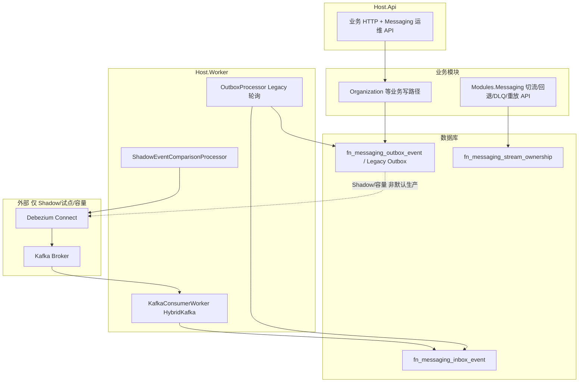

# Messaging 运行时拓扑（当前真实状态）

> 更新时间：2026-08-16。本文是 **Legacy Outbox + Shadow CDC + HybridKafka 试点** 的单一拓扑视图；容量认证与正式切流边界仍以 [`capability-status.md`](../roadmap/capability-status.md) 与 [`ADR-0006`](../architecture/adr/ADR-0006-transactional-outbox-cdc-kafka-event-delivery.md) 为准。

## 生产当前语义（默认）

| 项 | 值 |
| --- | --- |
| Worker 默认模式 | `LegacyPolling` |
| 正式 Kafka Consumer | **关闭**（`HybridKafka` 仅在运维显式启用且流所有权为 `CdcKafka` 时参与 Inbox） |
| 切流开关 | `Messaging:DeliveryCutover:Enabled=false`（默认） |
| CDC/Kafka 能力状态 | `Build-verified / Pilot`，**默认不得正式切流**（`DeliveryCutover:Enabled=false`） |
| 容量 Runner | 工具 `Build-verified`；测量结果 **`Capacity-not-verified`** |

Legacy 轮询语义详见 [`outbox-worker-topology.md`](outbox-worker-topology.md)。试点切流 API 与 Shadow 模式详见 [`cdc-kafka-event-delivery.md`](cdc-kafka-event-delivery.md)。

## 总览

## 组件归属

| 职责 | 位置 | 说明 |
| --- | --- | --- |
| Outbox 写入、租约、重试、死信 | `BuildingBlocks/Full.NET.Data.Dapper/Outbox` | 所有模块经 `IOutboxWriter` / 路由写入 |
| Kafka Producer/Consumer、Envelope、Connect 客户端 | `BuildingBlocks/Full.NET.Messaging.Kafka` | Broker 运行时 |
| Inbox 事务 + Handler 调度 | `BuildingBlocks/Full.NET.Modularity/Messaging` | `IntegrationEventConsumerDispatcher` |
| 流所有权、切流/回退、DLQ、Kafka 重放 API | `Modules/Full.NET.Modules.Messaging` | 运维控制面 + 持久化 SQL |
| 宿主 Messaging DI 门面 | `Composition/MessagingRuntimeServiceCollectionExtensions` | Api 重放 / Worker HybridKafka 统一入口 |
| Legacy 轮询 Worker | `Hosts/Full.NET.Host.Worker/OutboxProcessor.cs` | **当前生产主路径** |
| Shadow 比对 | `Hosts/Full.NET.Host.Worker/ShadowEventComparisonProcessor.cs` | 非切流 |
| HybridKafka Consumer | `Hosts/Full.NET.Host.Worker` + `KafkaConsumerWorker` | 仅 `CdcKafka` 所有权流 |
| Kafka 重放（无常驻 Consumer） | `Host.Api` + Messaging 模块 | 默认关闭 |
| 容量测量 Runner | `benchmarks/Full.NET.Benchmarks/Kafka` | **非生产 DI**；见 [`kafka-capacity-runner.md`](kafka-capacity-runner.md) |
| Connector 模板 / 本地 Compose | `deploy/messaging/` | 开发、Shadow、容量专用 |

| Identity 消费方 Topic 目录 | `Modules/Full.NET.Modules.Identity/IdentityIntegrationEventTopicDefinitions` | Organization 单位变更试点 Topic |

**边界原则：** Broker/Connect/Consumer 运行时归 BuildingBlocks；运维 API 与所有权表归 Messaging 模块；Topic 目录归消费方模块（Identity）。Connect REST 统一使用 `IKafkaConnectAdminClient` / `KafkaConnectAdminClient`。宿主装配使用 [`MessagingRuntimeServiceCollectionExtensions`](../../src/Composition/Full.NET.Composition/MessagingRuntimeServiceCollectionExtensions.cs)。

## 交付模式对照

| 模式 | Outbox 来源 | 到达 Kafka | 进入 Inbox | 生产默认 |
| --- | --- | --- | --- | --- |
| Legacy 轮询 | 业务事务 | 否（Worker 直读 Outbox） | 可选（同进程 Handler） | **是** |
| Shadow CDC | 业务或测试写入 | Debezium 影子 Topic | 否（仅比对） | 试点/验证 |
| HybridKafka | CDC 拥有权的流 | 是 | 是 | **否**（开关关闭） |
| Capacity Runner | 专用 DB + 合成/Outbox | 是（Scope A/B/C） | Scope B/C 是 | **否**（手动/CI） |

## 与 Runner / 切流的常见误读

| 读者可能误解 | 实际边界 |
| --- | --- |
| “Scope B/C 集成测试通过 = 可切流” | 否。Delivery 路径为 `Build-verified / Pilot`，仍禁止默认切流 |
| “Kafka Capacity Runner = Build-verified” | 仅表示 **工具与预检** 可构建运行；不等于 Delivery 或容量 Production-verified |
| “Runner 复用 Inbox 核心 = 生产等价” | Runner 使用精简 `ServiceProvider`、可选 permissive 所有权；**不是** Worker 完整宿主图 |
| “MySQL CDC E2E 通过 = 双库已验收” | SQL Server CDC 在 Testcontainers 上为登记 Inconclusive；见 [`sqlserver-cdc-ci-debt.md`](../verification/sqlserver-cdc-ci-debt.md) 与 [`cdc-debezium-inbox-e2e-2026-08-09.md`](../verification/cdc-debezium-inbox-e2e-2026-08-09.md) |

## 相关文档

- [`outbox-worker-topology.md`](outbox-worker-topology.md) — Legacy Worker 多副本
- [`cdc-kafka-event-delivery.md`](cdc-kafka-event-delivery.md) — 切流/回退 API 与门禁
- [`kafka-capacity-runner.md`](kafka-capacity-runner.md) — Scope A/B/C 工具边界
- [`kafka-consumer-buffer-and-offset-commit.md`](kafka-consumer-buffer-and-offset-commit.md) — Consumer 协议细节
- [`capability-status.md`](../roadmap/capability-status.md) — 能力状态矩阵
