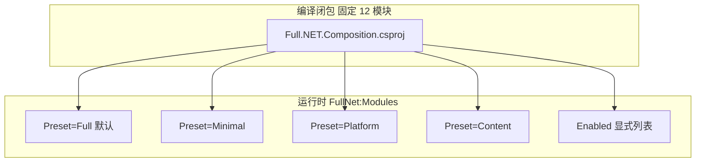

# Full.NET 平台运行时拓扑（当前真实状态）

> 更新时间：2026-08-16。本文是 **Api / Worker / Migrator / Composition** 的单一平台视图；Messaging 细节见 [`messaging-runtime-topology.md`](messaging-runtime-topology.md)。

## 宿主角色

| 宿主 | 职责 | 模块装配 |
| --- | --- | --- |
| `Host.Api` | HTTP API、OpenAPI、SignalR、Kafka 重放运维 | `AddFullNetApplicationModules(Api)` + `AddFullNetMessagingReplayForApi` |
| `Host.Worker` | Legacy Outbox 轮询、Shadow、HybridKafka Consumer | `AddFullNetApplicationModules(Worker)` + 条件 `AddFullNetMessagingWorkerRuntime` |
| `Host.Migrator` | DbUp 迁移与安全 Seed | `AddFullNetApplicationModules(Migrator)` |
| `AppHost` | 本地编排 SQL Server/Redis/Api/Worker/Migrator | 不承载业务模块 |

## 编译闭包 vs 运行时裁剪



- **编译闭包**：始终包含 12 官方模块 `.csproj` 引用（Admin.NET 对标与 Architecture 扫描）。
- **运行时裁剪**：`FullNet:Modules:Preset` 或 `Enabled[]` 控制 DI 注册与 HTTP Endpoint；未启用模块不得暴露 `/api/v1/{module}/*`（Architecture 门禁）。
- **模块依赖 DAG**：见 [`module-dependency-graph.mmd`](module-dependency-graph.mmd)（`pnpm run generate:module-dependency-graph` 同步）。

## 请求链（Api）

```text
TrustedProxy → Localization → RequestLogging → ExceptionHandler
  → CORS → RateLimit → ModuleMiddleware(BeforeAuthentication)
  → Authentication → ModuleMiddleware(BeforeAuthorization)
  → Authorization → ModuleMiddleware(BeforeEndpoints)
  → Module Endpoints (/api/v1/...)
```

Tenancy 解析在 Identity 认证前后由模块中间件与 `ICurrentTenant` 协作完成；详见 [`code-wiki/architecture-overview.md`](../../code-wiki/architecture-overview.md)。

## 缓存与实时

| 组件 | 位置 | 说明 |
| --- | --- | --- |
| FusionCache L1/L2 | `Full.NET.Caching.Fusion` | 写路径提交后本实例删除 + Redis Backplane |
| SignalR Hub | `Host.Api` + Redis Backplane | 通知推送；Worker 使用 `IRealtimePublisher` |
| 缓存策略注册表 | 模块 `ICachePolicyRegistry` | Architecture allowlist 为零 |

## 数据访问三入口

权威说明见 [`code-wiki/dapper-sql-sources.md`](../../code-wiki/dapper-sql-sources.md)：

1. 模块手写 `*Sql.cs`（默认）
2. [`global-sql-statements.json`](../../contracts/architecture/global-sql-statements.json)（Global 语句）
3. CodeGeneration `*Sql.g.cs`（CRUD 导入）

## 相关文档

- [`messaging-runtime-topology.md`](messaging-runtime-topology.md) — Outbox / CDC / Kafka
- [`module-dependency-graph.mmd`](module-dependency-graph.mmd) — 模块 DAG
- [`hosts-and-deployment.md`](../../code-wiki/hosts-and-deployment.md) — K8s/Helm
- [`ADR-0002`](../architecture/adr/ADR-0002-modular-monolith-evolution.md) — 编译闭包与 Preset
