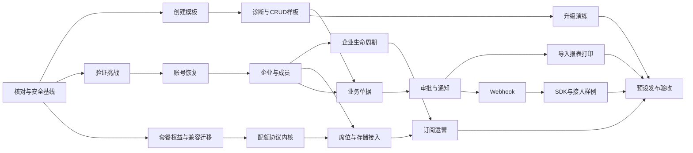

# Full.NET 企业应用与 SaaS 底座完善开发计划

> 执行方式：按仓库 AGENTS.md 逐切片推进，不自动创建工作树、派发代理、提交或推送。本文件负责新增能力和跨专项依赖；已有专项的实现步骤与进度继续在原计划维护。

**Goal：** 将现有模块组合为可创建项目、可由企业自主使用、可运营 SaaS、可升级恢复的开发底座。

**Architecture：** 保持强化型模块化单体、API/Worker/Migrator 分离、Dapper 双库和 Host.Api Native AOT。复用 Identity、Tenancy、Organization、Payments 等数据所有者，不复制账号库，不为目录完整度增加业务项目。

**Tech Stack：** .NET 10、Dapper、自有事务/SQL 边界、SQL Server/MySQL、Vue、OpenAPI 客户端生成、Jobs、Files、Notifications、Outbox、Kubernetes/Helm；新增外部依赖必须在对应切片核对许可、维护状态与原生可行性。

## 1. 授权、状态与计划所有权

- 日期：2026-09-16；用户要求将八项补齐能力和已有模块收口重点写入文档并制定详细计划。
- 审查修订：补齐未注册受邀者入驻、存量权益迁移、F05/F08 无环依赖及版本化源码分发；仅完善计划，不改变实施状态。
- 设计依据：[总体规格 §24.1](../specs/2026-07-17-fullnet-architecture-design.md#241-企业应用与-saas-底座完善2026-09-16)、[产品能力队列](../../roadmap/adminnet-feature-parity.md#8-企业应用与-saas-底座完善队列2026-09-16)。
- 文档核对基线：`main` / `ccd12944d0a77d295d062bfccf7f985fcb7b1362`。按用户要求，工作区其他改动不作为本计划实施证据；开工时重新核对实际提交和相关实现。
- 状态：规划已形成；本文件 F00—F16 尚无执行证据。已有模块保持原验证级别，不因列入本计划降级为未开发，也不因本次批准升级为 Verified。
- 本次交付仅修改文档，不安装依赖、不改代码/数据库、不运行生产操作。未来生产启用、真实收费、批量通知、不可逆删除仍遵循对应授权与发布流程。
- 本文件是“底座完善”唯一活动总计划。OIDC、AI、现有安全修复等专项不被替代；只在其完成后消费证据。新增切片在本文展开，确需独立专项时先登记任务转移及唯一所有者，不能双处维护勾选状态。

## 2. 能力、顺序与范围

| 能力 | 优先级 | 本计划任务 | 最小交付 | 不纳入首切片 |
| --- | --- | --- | --- | --- |
| B01 项目创建与升级工具链 | P0 | F01、F02、F15 | 空目录创建、模块预设、诊断、示例、版本升级演练 | 云端在线 IDE、插件市场、自动覆盖人工代码 |
| B02 企业开通与成员生命周期 | P0 | F05、F06 | 开通流程、邀请、成员管理、所有者交接、退出与停用 | 跨公司复杂 HR、通用组织主数据平台 |
| B03 套餐权益与统一配额 | P0 | F07、F08 | 套餐绑定、功能权益、席位/存储配额、原子预留和对账 | 全局计费引擎、按任意 SQL 动态定义权益 |
| B04 账号自助与恢复 | P0 | F03、F04 | 可配置注册、邮箱验证、密码/MFA 恢复、会话撤销 | 默认匿名开放企业注册、同时铺开所有短信渠道 |
| B05 SaaS 订阅运营 | P1 | F12 | 试用、续期、取消、到期策略、支付对账驱动权益 | 自动税务、复杂账务总账、任意币种自动换算 |
| B06 开放集成与 Webhook | P1 | F13、F14 | 注册事件、签名、投递重试/重放、接收样例、SDK | ESB、任意脚本集成、运行时扫描插件 |
| B07 业务接入标准样板 | P1 | F09、F10、F11 | 业务单据贯通附件、权限、审批、通知和数据交付 | 完整 ERP/CRM 产品、第二套审批引擎 |
| B08 发布升级恢复交付包 | P1，发布必需 | F15、F16 | 支持矩阵、发布清单、备份恢复、升级回退演练 | 未经证据承诺所有部署拓扑和容量 |

执行按依赖推进，不把 P0/P1 当成可绕过前置条件的排序。建议首次取一条纵向主线：F00 → F01 → F02；其后 F03 → F04 → F05 → F06。配额分为 F07 → F08a 协议内核，以及 F05 + F08a → F08b 业务接入，F08 仅在两部分均通过后关闭。F05 可在明确未启用配额的基础预设验收，限额/SaaS 预设必须等 F08b；不允许运行时故障降级为无限额。已有安全问题在每条受影响链路交付前收口。八项扩展不全部成为核心 1.0 阻塞项；SaaS 预设必须达到其自己的完整验收。



## 3. 数据、契约与跨模块边界

1. Identity 拥有账号、验证挑战、认证会话、企业成员的登录/授权绑定；Organization 拥有部门、职位和组织隶属；Tenancy 拥有租户生命周期、套餐、权益与配额。F00 必须先映射现有表/Port，扩展原关系，不另造平行成员事实源。
2. Tenancy 拥有开通与订阅编排记录；Payments 继续拥有支付、退款和渠道事实。支付成功不直接修改另一模块表；可信业务事件推动订阅状态，按版本去重，失败可重放与对账。
3. 企业所有者表示租户内受保护职责，不是 Host 超级管理员；最后一名可管理成员和所有者交接使用 Identity 内原子校验，不绕过会话、租户和操作权限。
4. 功能权益决定租户可用功能，RBAC 决定当前人可执行操作，配额决定剩余使用量。有效调用须分别通过对应检查。业务权益不存入通用 Settings ConfigEntry；Settings 只承接展示偏好或明确的平台配置。
5. TenantMembership、Entitlement、QuotaReservation 等是本计划的领域概念，不承诺现有类同名。F00 在本文登记实际表、内部类型、消费者及方法签名后才开始相应编码；外部稳定契约先冻结，再生成客户端。
6. 配额预留与业务写入分属不同所有者时，不承诺一个本地事务原子完成。以稳定 OperationId、预留凭据、确认/释放和恢复对账组成协议；未知执行结果保留占用，不能到期直接释放并允许重复消耗。
7. 会话、成员状态、付费权益和硬配额的拒绝判断使用权威状态或已批准的强一致策略，不能依赖可能陈旧的 L1 授权。跨模块读取走最小 Port，写入走可靠事件/幂等工作流，事务内不调用其他模块 Port。
8. Vue 为唯一后台主线。普通业务 API 用 ProblemDetails；OIDC 端点沿用 ADR-0011 的协议例外。后台任务、导出、通知、Webhook 与 AI 均保留租户及数据权限边界。
9. 模块按真实消费者编译期装配，沿用现有 Composition 预设。新增可选模块只创建一个主项目；Contracts 拆分需要真实消费者证据，不为框架完整度预建空层。
10. 首版应用模板使用固定提交、带版本与内容摘要的源码分发包。生成应用在 `framework/fullnet/` 保存受管框架源码，在 `src/`、`ui/` 保存应用拥有的宿主/业务/界面；框架与应用所有权由 manifest 区分。现阶段不以尚未发布的 Full.NET NuGet/npm 包为前提，也不访问开发者原始仓库或任意最新分支。
11. 邀请制允许没有账号和会话的受邀者验证邀请并注册。邀请授权、目标邮箱验证、账号认证和成员激活是不同步骤；原有账号必须完成其原认证/MFA，不能通过邀请重置密码或绕过 MFA。账号/挑战/邀请/成员均由 Identity 原子维护，企业状态等跨模块约束仍走受控协作。
12. 权益强制执行前必须完成存量兼容清单、回填与切换门禁。既有部署默认保持明确的兼容阶段，新 SaaS 预设使用强制阶段并要求有效套餐；无绑定、状态读取失败与未知权益不能在强制阶段回退为兼容。

## 4. 文件与验证地图

以下新路径是实施目标，不表示文件已存在。实现任务按当时库存选择成对迁移编号，禁止预占或改写已应用迁移。测试类可按实际夹具收敛，但必须在本文记录最终入口，不能只有无调用者的断言辅助类。

| 任务 | 主要修改/新增位置 | 测试目标 |
| --- | --- | --- |
| F00 | 本计划；`docs/roadmap/capability-status.md`；既有专项执行记录 | 核对证据与实际入口，不新建形式化空测试 |
| F01–F02 | 新增 `templates/fullnet-app/.template.config/template.json`、模板内容与 `scripts/templates/verify-created-app.mjs`；复用 `src/Tools/Full.NET.CodeGeneration.Cli/`、`src/Composition/` | 新增 `tests/templates/created-app.test.mjs`、`tests/templates/template-options.test.mjs` |
| F01/F15 | 新增 `scripts/templates/build-source-bundle.mjs`、`templates/fullnet-app/framework-manifest.schema.json`；分发包内包含锁定来源、项目/包依赖及迁移清单，生成应用保存 `framework/fullnet/` 和 `framework-manifest.json` | 新增 `tests/templates/source-bundle.test.mjs`、`tests/templates/source-bundle-upgrade.test.mjs`，包含摘要损坏、外部路径、离线来源与人工冲突 |
| F03–F04 | 复用 `src/Modules/Full.NET.Modules.Notifications/Features/VerifyRecipientEndpoints/`；扩展 Identity 的 `Features/ManageRegistrationPolicy/`、新增 `Features/RegisterAccount/`、`Features/RecoverAccount/` | `tests/Full.NET.UnitTests/Identity/AccountRecoveryTests.cs`、`tests/Full.NET.IntegrationTests/Identity/AccountLifecycleAssertions.cs` |
| F03–F05 | Identity 新增 `Features/RegistrationInvitations/`，F04 提供一次性邀请/注册领域能力，F05 接管理与入驻入口；Notifications 新增 `Features/SendIdentityChallenge/` 的内部受控投递适配，复用现有邮件 Provider | `tests/Full.NET.IntegrationTests/Identity/InvitedRegistrationAssertions.cs`；覆盖无账号/无会话、已存在账号、撤销竞争及未入租户的收件人 |
| F05–F06 | Tenancy `Features/ProvisionTenant/`；Identity 新增 `Features/ManageTenantMembers/`、`Features/AcceptTenantInvitation/`；Organization 成员适配；Vue 新增 `TenantMembersView.vue`、`TenantOnboardingView.vue` | `tests/Full.NET.UnitTests/Identity/TenantMembershipTests.cs`、`tests/Full.NET.IntegrationTests/Identity/TenantMembershipAssertions.cs`、`tests/Full.NET.IntegrationTests/Api/TenantLifecycleAssertions.cs` |
| F07–F08 | Tenancy `Features/ManageHostTenantPackages/`；新增 `Features/ManageTenantEntitlements/`、`Features/ReserveTenantQuota/`；首个 Identity/Files 消费者 | `tests/Full.NET.UnitTests/Tenancy/TenantEntitlementTests.cs`、`TenantQuotaTests.cs`；`tests/Full.NET.IntegrationTests/Api/TenantEntitlementAssertions.cs`、`TenantQuotaAssertions.cs` |
| F09–F11 | 新增 `samples/enterprise-request/`；复用 Workflow、Files、Notifications、ImportExport、Reporting、Printing 模块及生成器 | `samples/enterprise-request/tests/`；`tests/e2e/admin-real-stack/tests/enterprise-request.spec.mjs` |
| F12 | Tenancy 新增 `Features/ManageTenantSubscriptions/`；Payments `Features/ManageOrders/`、`ManageRefunds/`、`ReceiveWeChatNotify/`；Vue 新增 `TenantSubscriptionView.vue` | `tests/Full.NET.UnitTests/Tenancy/TenantSubscriptionTests.cs`、`tests/Full.NET.IntegrationTests/Api/TenantSubscriptionAssertions.cs` |
| F13–F14 | 首个消费者出现时新增 `src/Modules/Full.NET.Modules.Webhooks/`；复用 Identity OpenAccess、Auditing、Outbox；新增 `samples/webhook-consumer/`；`packages/client-contracts/` | `tests/Full.NET.UnitTests/Webhooks/WebhookDeliveryTests.cs`、`tests/Full.NET.IntegrationTests/Api/WebhookDeliveryAssertions.cs`、样例契约测试 |
| F15–F16 | `deploy/helm/fullnet/`、`docs/operations/`、`docs/development/onboarding.md`、发布工作流；新增 `docs/operations/application-upgrade.md`、`docs/operations/application-recovery.md` | `tests/deployment/`；模板旧版本升级夹具；现有 Native API 与 Worker 外部进程夹具 |

数据任务共同涉及 `src/BuildingBlocks/Full.NET.Migrations.DbUp/Migrations/SqlServer/` 与 `MySql/`、模块 SQL/JSON/AOT 登记、`contracts/database/object-comments.json`、`contracts/architecture/global-sql-statements.json`。增加测试时同步 `eng/testing/test-matrix.json`；普通管理前端复用 `packages/client-contracts/` 的 OpenAPI 生成，不手写第二套 DTO。

## 5. 新能力实施任务

每项清单均为未执行。任务完成须记录提交、实际验证命令/结果、未验证项；实现与发布状态分开。后续执行单步按“失败场景 → 最小实现 → 聚焦验证 → 消费方接线 → 切片验收”推进。

### F00：冻结现状、已有计划分工和第一条交付基线

**依赖：** 无。**产出：** 可追踪的模块/入口/证据清单和首批实际接口签名。

- [ ] 核对八项能力在当前提交中的 Endpoint、表、Vue、测试和专项；对已实现内容只记录缺口，禁止重建。特别核对 Registration/OAuth/OIDC、通知验证码、ImportExport/Reporting 与 Payments。
- [ ] 将 §6 的 C01—C07 映射到原计划的具体未关闭任务及证据；文档冲突时记录“实现存在、验收待核”，不凭标题直接改为完成。
- [ ] 在本计划追加第一批切片的契约登记：所有者、调用方、请求/结果字段、错误码、精确权限、幂等键、并发版本及数据兼容策略。跨模块先证明现有 Port 不足再扩契约。
- [ ] 选择最小可发布预设及其真实验证范围；带已知安全/隔离问题的链路先修复，未选入的可选模块不使核心预设假通过。

**验收：** 每个新能力可定位到现有资产、增量和任务所有者；每个当前发布阻塞有关闭条件，未产生代码能力通过声明。

### F01：从空目录创建独立应用

**依赖：** F00。**消费：** Naming Profile、Composition 预设。**提供：** 基础管理、企业应用、SaaS 的可选择模板；未满足能力门禁的预设标为实验性且不默认启用。

- [ ] 先实现版本化源码包构建：固定源提交，登记每个受管文件摘要、框架版本、模块闭包、中央包版本、构建 props/targets、源生成器、迁移资源、CLI 与前端 workspace 依赖及锁文件。包不含 bin/obj、秘密、本机缓存、绝对路径或指向原仓库的链接；摘要不符拒绝实例化。
- [ ] 从现有静态注册清单产生所选预设的 Composition 投影及项目引用闭包，不把当前引用所有模块的 Composition 原样复制后仅关闭运行开关。登记哪些迁移/种子属于所选闭包及其历史依赖，禁止按名称过滤后静默跳过必要迁移。
- [ ] 建立模板参数负例：非法/保留 OwnerKey、未知模块、缺硬依赖、输出目录冲突均拒绝且零覆盖。
- [ ] 定义项目名、OwnerKey、SQL Server/MySQL、模块预设、前端和端口选项；冻结输出 manifest，秘密只生成占位配置。
- [ ] 模板包随附受管框架源码，以应用内部相对 ProjectReference 和 workspace 引用完成接线；初始化时复制的宿主/业务/界面骨架之后属于应用，不被框架升级器直接覆盖。NuGet/npm 第三方依赖仅从配置的源按锁定版本还原，Full.NET 自有代码与前端共享包来自分发包。
- [ ] 在不能访问原仓库、没有自有包缓存的干净环境，仅凭版本化模板包与声明的第三方依赖源创建两种数据库应用，执行还原/构建、迁移/引导、登录和一个管理读取；重复创建不覆盖用户文件。原生构建验证包内 analyzers/generators/迁移资源齐全；额外无网络还原只有在依赖预缓存条件明确时才要求。

**验收：** 新应用不依赖原仓库绝对路径；未选择模块没有意外运行依赖；首次运行说明与实际步骤一致。后续计划命令示例：`dotnet new fullnet-app --name Demo --owner-key demo --database mysql`，模板未登记前不可报告该命令可用。

### F02：环境诊断与生成一个真实 CRUD

**依赖：** F01。**提供：** 可复用的应用开发起点及受控诊断结果。

- [ ] 对缺 SDK、错误数据库配置、遗漏模块依赖、未配置密钥建立诊断断言；输出机器码和修复指引，不泄露凭据。
- [ ] 在现有 CLI 内扩展诊断入口，先只读检查，用户显式要求后才执行初始化；区分本地开发和生产配置。
- [ ] 用现有生成器在新应用生成一个租户 CRUD，贯通数据库、后端、OpenAPI、Vue 和精确权限；开发者修改业务实现后再生成，证明人工文件不会丢失。
- [ ] 完成从创建到首个 CRUD 的教程并实走；记录耗时与失败原因，性能目标由实测基线后制定，不虚称固定分钟数。

**验收：** 新应用的真实新增/编辑/查询和跨租户拒绝通过；生成器只更新其持有的产物。

### F03：复用通知平台完成账号验证挑战

**依赖：** F00、C04 通知安全收口。**提供：** Identity 账号操作挑战及 Notifications 投递衔接。

- [ ] 核对现有收件端点验证与验证码能力，区分“拥有邮箱地址”和“获准恢复账号”；不得把通用收件端点 verified 直接当作密码重置授权。
- [ ] 建立挑战用途/账号/目标地址绑定、过期、尝试上限、一次消费、并发重放与重发替换测试；未知账号不通过响应差异泄露存在性。
- [ ] Identity 保存其操作挑战的不可逆凭据摘要，通过稳定投递意图请求 Notifications；外部发送事务外进行，失败/未知送达状态可追踪且不消费成功凭据。
- [ ] 提供仅供受信 Identity 调用的挑战投递 Port：绑定用途、ChallengeId/InvitationId、规范化目标邮箱、有效期、发起操作及可选账号/目标租户，不要求接收人已有 UserId、已加入租户或 verified RecipientEndpoint。公开请求不能自行选择模板、渠道配置、任意内容或批量地址；按地址/来源/用途限流，原普通通知用户目录与 verified 校验保持不变。
- [ ] 邀请/注册凭据若需异步投递，原值只能在受限、加密且限期清理的投递载荷中存在，身份校验侧仍只保存摘要；过期/撤销挑战不得继续重发。跨模块交付通过幂等投递身份与状态对账恢复，不让“创建挑战成功”被当成“已送达”。
- [ ] 选择一个邮件测试渠道验证真实投递和消费，日志与界面不回显验证码；测试环境受控收件箱证据与生产渠道认证分别记录。

**验收：** 两个并发消费最多一个成功；未送达不被标记为已验证；不能跨用途复用挑战。未注册且未加入任何租户的邮箱可通过受控挑战渠道收信，但不能借该渠道调用普通通知 API 或发送任意邮件。

### F04：注册、密码恢复与 MFA 恢复

**依赖：** F03；新旧会话撤销消费 C01。**提供：** Identity 的完整账号自助流程。

- [ ] 以现有注册政策为入口，明确 Disabled/InvitationOnly/Open：Disabled 拒绝所有新账号，InvitationOnly 仅接受有效一次性邀请，Open 才允许无邀请注册；默认 InvitationOnly。F04 在 Identity 内实现邀请校验与注册领域原语，由受控测试夹具创建邀请验证闭环，F05 再交付正式签发/撤销管理入口，因此 F04 不依赖 F05。
- [ ] 无会话受邀者先校验邀请，再以独立邮箱挑战证明目标地址控制权，设置密码后建立账号与可重试的入驻状态；不要求先登录不存在的账号。邀请、邮箱挑战、账号创建与幂等注册结果在 Identity 内原子提交；账户可建立时不得提前获得尚未激活的企业权限。既有账号进入其原登录/MFA 流程，不因邮箱文本相同自动绑定、重置或合并。
- [ ] 区分邀请未使用、已绑定账号待入驻、已激活和已撤销状态：注册完成后原凭据不能创建第二个账号，只允许经该账号认证恢复同一入驻记录；待入驻期间仍可被撤销，激活与撤销竞争由 Identity 原子状态转换决定。
- [ ] 实现注册与账号验证，维持统一账号目录和密码/锁定策略；现有管理员重置密码保持独立权限，不挪作公开接口。
- [ ] 实现密码恢复，消费挑战与变更凭据在 Identity 事务内完成；撤销适用旧/新会话和刷新族，旧中心 Cookie 不得重新获取有效授权。
- [ ] 实现 MFA 恢复码生成/摘要保存/一次消费；无恢复码的人工恢复使用独立权限、审核和审计，不以邮箱验证自动清除 TOTP。
- [ ] Vue 完成成功、过期、错误和限流流程，检查 CSRF、Origin、日志去敏及无账号枚举。
- [ ] 建立无账号/无会话的邀请注册测试，覆盖邀请目标替换、过期/撤销与注册竞争、同邮箱并发创建、已存在账号登录绑定、重试返回同一注册结果，以及撤销邀请后待入驻记录不能激活。

**验收：** 双库和浏览器验证正常恢复、重放拒绝与旧会话失效；公开注册仍受部署政策控制。

### F05：企业开通、邀请与租户成员管理

**依赖：** F04。**提供：** 可恢复开通流程、正式邀请入口及不依赖配额的成员基础能力。仅在明确未启用配额的基础预设验收；F08b 再接席位限制，限额/SaaS 预设在 F08b 完成前不得启用。不设置 F05 → F08 的前置依赖。

- [ ] 冻结统一账号与租户成员关系的映射，已有账号接受邀请时仅新增合法成员关系，不复制账号；同账号跨企业的角色/部门独立。
- [ ] 将 ProvisionTenant 扩展为持久化步骤：申请、资源建立、所有者绑定、初始化、激活；跨模块写入用幂等命令/事件，各步骤失败可重试或补偿，未完成不对外宣称可用。
- [ ] 接通 F04 的邀请签发/撤销与注册原语，邀请绑定租户、目标邮箱、可选已有账号、角色范围、有效期及一次消费凭据。新用户经邀请注册后继续入驻，已有用户经原认证/MFA 且身份匹配后接受；不允许邀请发起者授予其无权授予的角色。激活成员前重新检查邀请/待入驻状态、发起者授权和企业状态，撤销后不继续激活。
- [ ] 实现成员分页、启停、角色/组织关系管理与邀请撤销；使用受信 Tenant 上下文和各操作独立权限，提供 Vue 页面。
- [ ] 双库覆盖从未注册邮箱到成员激活的全流程、重复接受、邀请撤销与接受竞争、账号已创建但成员未激活时中断恢复、已存在账号加入、跨企业越权和只剩最后一名管理成员。基础模式无配额与强制模式不允许绕过的验收分别留证；后一组由 F08b 关闭。

**验收：** 企业可由其管理员完成成员入驻；开通失败不会形成可登录但未初始化的企业，跨模块不使用共享本地事务。

### F06：所有者交接、成员退出与企业停用

**依赖：** F05、C01/C05。**提供：** 企业生命周期状态和各消费者的撤销行为。

- [ ] 冻结 Active/Suspended/Closing/Closed 状态以及允许的恢复转换；首版停用与逻辑关闭，物理清除需要单独保留政策和执行授权。
- [ ] 所有者交接绑定明确接收人并做强认证、最后一名保护和并发版本校验；验证两个并发交接不会产生零管理者。
- [ ] 成员退出/移除只撤销目标企业授权，不禁用其全局账号或其他企业成员关系；梳理待办改派、后台执行、文件访问、API 凭据和实时连接处理。
- [ ] 企业停用后阻断新业务写入、异步副作用及新授权；定义恢复入口、只读/导出策略和通知，按各模块 Port/事件收敛并提供对账状态。

**验收：** 退出 A 不影响 B；停用后下一次受保护操作拒绝；未完成的跨模块清理可见且不可误报全部完成。

### F07：套餐绑定与功能权益

**依赖：** F00。**提供：** Tenancy 拥有的版本化套餐/租户权益及最小读取 Port。

- [ ] 冻结权益目录、类型、套餐版本与租户绑定生效时间；未知权益一律拒绝，强制模式下缺绑定/无授权默认拒绝。运营人员仅能配置代码登记的权益，不借通用配置创建任意授权表达式。
- [ ] 在 Tenancy 持久化 Compatibility/Shadow/Enforced 阶段及版本：旧部署升级默认 Compatibility，仅已登记的历史功能保持原权限判断；Shadow 比较将来权益决策但不切断原有功能；新 SaaS 预设创建时直接 Enforced，租户在绑定有效套餐前不得激活。阶段由部署/受控管理决定，不能由请求头或数据库异常推导。
- [ ] 在启用前按旧部署实际可用功能生成存量兼容清单，dry-run 展示受影响租户、未绑定项及差异；经运营确认后使用幂等迁移/回填记录建立显式兼容套餐或租户授权，不授予新增功能、不修改用户 RBAC。覆盖回填中断重入及回填期间新增租户，切换前以一致的版本/受控写入门禁确保无遗漏。
- [ ] 只有所有在用租户均有有效绑定、差异已处置且所有 API/Worker 实例支持权益检查后，才能切为 Enforced。混合旧实例期间维持兼容/影子模式；切换后读状态失败拒绝，不能退回 Compatibility。回退默认保留强制策略并前向修复；会绕过权益的旧版本不得直接重新上线。
- [ ] 建立“有 RBAC 无权益”“有权益无 RBAC”“未知权益”“另一实例命中旧值”的失败断言。
- [ ] 实现套餐绑定、升级/降级预览、定时生效和明确租户特例；权限校验独立执行，返回原因可区分未购买、无权限与配额不足。
- [ ] 选择 Workflow 启用作为首个业务消费者，覆盖页面、API、后台启动三个入口；停用权益不删除已有业务数据，存量实例处置按冻结政策执行。
- [ ] 从未绑定套餐的真实旧版本数据升级，验证已有 Workflow/API/后台操作在兼容阶段保持原结果；执行 dry-run、回填、Shadow、Enforced，再验证取消授权、未绑定新租户、状态库故障与旧实例切换拒绝。此双库升级用例在 F07 关闭，F15 复用并扩展为整应用升级。

**验收：** 单改 UI 或角色不能绕过权益；套餐切换有版本和审计，同场景双库及多实例拒绝成立。旧项目升级不意外停用已有功能，强制阶段缺绑定/状态故障不放行，兼容模式不扩张为永久的付费功能旁路。

### F08：席位、存储与调用额度的统一配额协议

**依赖：** 分两部分验收：F08a 只依赖 F07；F08b 依赖 F08a、F05 和 C02。**提供：** 配额协议内核及真实成员/文件消费者；两部分均通过才关闭 F08，协议单测通过不能代替业务接入。

**F08a：协议内核，独立双库验收。** 使用受控消费者夹具，先验证预留/确认/释放/未知结果，不要求成员功能已完成。

- [ ] 用席位和存储定义首批度量：单位、计数范围、周期、上限、预留期限及幂等 OperationId；API/AI 计量作为后续消费者，保留已有 AI 账本所有权，不能双扣。
- [ ] 建立剩余 1 额度的并发竞争、重试重复预留、业务失败释放、成功后确认丢失、超时未知结果、跨周期结算和套餐降级测试。
- [ ] 在 Tenancy 内原子校验并预留；消费者凭据不可跨租户/用途使用。提交业务后确认，失败释放；对未知结果先权威对账，不能简单 TTL 退款。
- [ ] 配额减少到当前用量以下时保留历史数据并拒绝新增；实现用量查询、差异对账、精确权限的修复与审计。

**F08b：真实消费者接入，独立入口验收。** F05 的基础行为保持，限额模式在本切片接通后才能上线。

- [ ] 成员激活前预留席位，成功激活后确认，失败释放；邀请待接受阶段不计活动席位。以同一入驻 OperationId 重试，避免账号创建成功后反复扣席位。企业首次所有者按冻结套餐规则计数，试用/SaaS 开通同样经过该入口。
- [ ] 将文件上传/发布/删除接入存储额度凭据，冻结临时文件与活动文件占用口径；Worker 中断后按文件权威状态对账，不因租约到期直接释放已使用空间。
- [ ] 在切换为限额模式前建立既有活动成员/文件用量基线并处理并发增量，证明无漏计/双计；Mode 与版本由服务端固定，错误/超时不能切到无限额。
- [ ] 用真实邀请接受/成员激活和文件入口执行“余量 1、两个并发操作”、消费后确认失败、重试、移除/删除及套餐降级；分别验证基础预设无配额与 SaaS 强制配额，未知模式拒绝。

**验收：** F08a 证明协议并发不超卖、重复不双扣；F08b 证明真实业务没有遗漏入口，宕机后能够解释每份占用且两个数据库结果一致。限额/SaaS 预设只有 F08b 通过后才可启用，F05 无须等待本任务才能关闭其基础切片。

### F09：业务单据基础样板

**依赖：** F02、F05、C05；先完成样板基础，不等待全量 SaaS 运营。**提供：** 示例所有者 `demo` 的企业申请单。

- [ ] 在新应用样板内定义主表/明细、申请人、组织归属、金额/数量、状态和版本；通过命名内核生成固定 `demo_*` 表，不写进框架 `fn_*` 业务表。
- [ ] 使用生成器建立列表、详情、编辑、附件与权限；样板依赖官方模块稳定 Port，不反向成为框架必选依赖。
- [ ] 建立 A/B 租户、本人/部门/全租户数据范围、敏感字段、越权附件和并发编辑断言。

**验收：** 开发者可从模板运行完整单据 CRUD，权限与附件所有权贯通列表和详情。

### F10：业务审批、状态回写与通知

**依赖：** F09、C03/C04。**提供：** 单据提交到审批结果的端到端样板。

- [ ] 通过 Workflow 稳定接入契约启动实例，固定业务键、定义版本和提交版本；重复提交只创建一个逻辑流程。
- [ ] 审批结果经可靠事件回写单据，按事件身份与版本去重；乱序、撤销竞争、实例失败和重复完成有明确状态转换。
- [ ] 复用 Notifications 内核产生待办/完成提醒；提醒失败不回滚已提交审批，补投与主业务状态分别展示。
- [ ] 执行 Vue 发起、审批、驳回、改派与通知查看；人工完成页面验收前保持对应待验收标记。

**验收：** 一个真实申请从创建到完成可追踪；停止 Worker 后恢复不会重复产生业务副作用。

### F11：导入、报表与打印接入样板

**依赖：** F09、C02/C05。**提供：** 现有三个模块的受控业务接入范例。

- [ ] 复用 ImportExport 的静态 Schema/任务机制，提供模板、预校验、逐行错误与幂等写入策略；禁止导入绕过单据领域校验。
- [ ] 复用 Reporting/Printing 生成有权限的数据报表和打印视图；查询与结果下载分别验证租户、会话、数据范围和字段权限。
- [ ] 测试排队后撤权、取消、租约失效、Worker 崩溃、结果文件上传后提交失败和重试；限制输入文件、解压、结果大小及执行预算。
- [ ] Vue 展示进度、部分失败、错误文件、取消和结果过期；打印内容按现有净化与隔离策略执行，服务端生成文本遵循语言偏好。

**验收：** 导入/导出/打印不会扩大列表权限；任务恢复和文件清理可证明，未跑真实 Worker 不称恢复通过。

### F12：订阅、试用与支付驱动权益

**依赖：** F06、F08、现有 Payments 安全修复/渠道验收。**提供：** Tenancy 订阅生命周期；Payments 仍拥有资金事实。

- [ ] 冻结 Trial/Active/PastDue/Cancelled/Expired 状态、期限与宽限；取消默认期末生效，首版升级/降级使用明确生效日，不引入自动按比例复杂计费。
- [ ] 先实现测试付款或人工登记的受审计订阅闭环，再接已有支付 Provider；真实自动扣款只在选定渠道能力、用户授权和回调验收完成后启用。
- [ ] 订阅消费已验证支付结果，绑定租户、订单、金额/币种和套餐版本；建立重复/乱序回调、跨商户回调、退款、超时未知结果与对账测试。
- [ ] 支付成功但权益更新失败时保持待履约、可靠重试和对账；不把租户全局禁用作为所有欠费情况的默认处理，按冻结政策限制新增并保留必要恢复入口。
- [ ] Vue 提供试用期限、当前套餐、变更预览、续期/取消及失败解释；到期任务多实例只产生一次逻辑状态转换。

**验收：** 订阅、资金事实和权益可逐笔对应；本地成功不能替代真实渠道认证，不自动承诺发票/税务能力。

### F13：首个可靠 Webhook 事件

**依赖：** F00、F10、C05；选择申请完成事件作为首个消费者。**提供：** 可选 Webhooks 模块及可审计投递。

- [ ] 登记固定事件类型、版本和最小载荷，业务所有者发布集成事件；Webhooks 拥有订阅、投递/尝试/回执，不读取业务模块表。
- [ ] 注册精确目标地址与签名密钥引用，执行 DNS/重定向/目标网络限制、出站超时和响应大小限制；密钥不回显，轮换有受控过渡。
- [ ] 以稳定 EventId/DeliveryId、时间戳、KeyId 对原始请求体签名；接收样例验证签名、时间窗及重复投递，兼容重试/重放时的稳定业务身份。
- [ ] Worker 使用租约、退避、最大尝试和人工重放，网络调用位于事务外；“已接收”与“业务已处理”不混称，超时未知结果允许重复投递但要求消费者幂等。

**验收：** 双库/双实例并发、SSRF、签名篡改、撤销订阅和重复消费场景通过；不得用生产客户地址进行测试发送。

### F14：开放 API 与 SDK 接入包

**依赖：** F13、C01/C05。**提供：** 外部应用可复现的认证、调用和事件接入样例。

- [ ] 复用 API Key/OpenAccess/OIDC，按交互用户与机器调用选择明确认证方式；限制客户端允许的 API 范围、租户与操作，不能把 Host 全权限默认授给外部应用。
- [ ] 用 OpenAPI 生成 TypeScript 接入包，冻结版本、分页、ProblemDetails、文件/流和重试语义；仅幂等或有业务幂等键的操作允许自动重试。
- [ ] 提供凭据配置/轮换、限流响应、错误定位、Webhook 验签和幂等接收教程；样例使用环境秘密引用。
- [ ] 在干净消费项目安装本地打包产物，验证合法请求、凭据撤销、跨租户拒绝与一条事件；公共包发布只在单独授权后执行。

**验收：** 样例无需读取 Full.NET 内部实现即可接入，已发布契约变更可检测。

### F15：应用版本升级与恢复演练

**依赖：** F02、C07；先覆盖基础预设，再覆盖企业/SaaS 增量。**提供：** 应用开发者可执行的升级路径。

- [ ] 定义支持的起始/目标框架版本、数据库版本、模块组合与兼容窗口；以真实已发布或带固定提交的候选基线创建升级夹具，不虚构历史发行版。
- [ ] 沿用 F01 的版本化源码包，以旧 manifest 为共同基线比较本地内容与新分发包：未改的受管文件可计划更新，框架本地定制或应用拥有文件只生成合并建议与冲突报告；先预览/校验再提交受管更新，失败不留下半更新状态。同步框架依赖锁文件、迁移/资源和工具兼容矩阵，不静默升级到最新版本。
- [ ] 夹具包含人工定制代码、旧数据、活动会话、排队任务与文件；升级只改受管资产，冲突生成报告，禁止自动覆盖人工实现。
- [ ] 演练 Expand/Migrate/Contract、混合版本运行、迁移中断重入；破坏性收缩前满足旧消费者退役门禁。数据库不可逆变化使用前向修复或备份恢复，不宣称简单降版本可回滚。
- [ ] 复用 F07 的存量权益回填/强制切换用例及 F08b 的用量基线演练；恢复必须保留或重建正确的权益阶段/版本，不能把 Enforced 租户恢复成兼容模式绕过订阅。
- [ ] 写明数据库、对象文件、Data Protection/签名密钥、运行状态的备份恢复顺序和秘密保护；在隔离环境实际恢复，测量数据丢失与恢复时间并对照冻结 RPO/RTO。

**验收：** 双库升级与恢复证据可定位到版本/产物；回退后权限、会话与任务不被意外复活。

### F16：按预设完成发布验收

**依赖：** 基础预设需 F01/F02/F15 和所含模块 C 门禁；企业预设追加 F03—F06/F09—F11/C01；SaaS 预设追加 F07/F08/F12；开放集成作为选装需 F13/F14。AI 选装另需 C06。

- [ ] 固定预设及依赖闭包，生成发布清单、版本、许可、配置说明与已知限制；默认关闭未验收外部渠道和高风险运维入口。
- [ ] 在 GitHub Actions 对对应提交运行双库、Linux Native、真实栈和受影响治理门禁；人工验收企业核心流程、可访问性和错误恢复。
- [ ] 按现有 Helm 基线验证 API/Worker/Migrator 顺序、多实例、密钥共享、排空、升级、故障接管和恢复；容量按独立容量计划验证。
- [ ] 只有全部适用门禁具备证据才提升该预设状态；文档、构建、运行、生产认证分别报告，不把一个预设的成功外推到所有模块组合。

**验收：** 发布候选可以从干净环境复现，未验证容量继续标 `Capacity-not-verified`；不存在以精简预设名义隐藏必选模块的失败。

## 6. 已有模块的收口队列

本节只管理交付依赖和验收，不复制原计划的实现勾选。F00 将实际未关闭项补入对应原计划；原任务已完成时直接引用证据。

| 编号 | 所有者与既有执行入口 | 必须收口的重点 | 对本计划的门禁 |
| --- | --- | --- | --- |
| C01 OIDC/SSO | [OIDC 唯一计划](2026-09-13-identity-oidc-sso-evolution.md) | 两客户端、新旧会话、管理入口强制下线、切租户保留授权、工具/后台消费者、双库 Native 与 Vue；逐项执行 V01—V24 | F04/F06/F14 消费适用会话能力；企业 SSO 发布必须全链路通过 |
| C02 导入/报表/打印/文件 | [全项目修复计划](2026-09-07-full-project-review-fixes.md) R02/R03/R07/R16/R17 | SQL 租户谓词、结果文件所有权、输出预算、打印净化、取消/租约与崩溃恢复；真实 Worker 与下载再授权 | F11 与含数据交付的预设不得仅凭 Unit 通过关闭 |
| C03 Workflow | [首切片](2026-08-20-workflow-first-vertical-slice.md)、[提醒投影](2026-09-05-workflow-notifications-event-projection.md)、[设计器/跨端计划](2026-08-30-workflow-designer-form-runtime.md) | 业务键/版本关联、结果幂等回写、待办权限、Recovery Worker、通知投影、并发与恢复、Vue 人工验收 | F10 消费稳定业务接入契约；不新增第二套流程引擎 |
| C04 Notifications | [平台扩展](2026-08-30-notifications-platform-extension.md)、[SMTP](2026-08-31-notifications-smtp-provider.md)、[收件端点](2026-09-01-notifications-recipient-endpoint-management.md)、全项目修复 R08 | 收件端点验证、验证码用途/并发消费、渠道认证、租约、重试和回执；逐渠道真实投递与多语言 | F03/F05/F10 的通知不可用时不伪报发送；先收口一个邮件渠道 |
| C05 权限全链路 | [全项目修复](2026-09-07-full-project-review-fixes.md)、[字段投影计划](2026-08-01-field-projection-authorization.md)、OIDC T02/T03 | 同一身份跨列表/详情/导出/报表/附件/后台/AI 的数据与字段权限；排队后撤权、切租户、停用及未知绑定拒绝 | 所有新能力共同门禁；F00 登记真实入口矩阵，各切片补回归 |
| C06 AI/Agent | [AI 唯一计划](2026-09-08-ai-agentic-web-alignment.md) | 当前会话授权、预算/未知费用、审批意图绑定、Checkpoint/副作用幂等、取消/恢复、协议互操作和 Native | AI 为选装；先交付一个已授权业务助手，不阻塞无 AI 核心预设，不重复建设全局配额账本 |
| C07 生产运行 | [多实例实施计划](2026-08-01-fullnet-high-concurrency-multi-instance-implementation.md)、[Worker 原生计划](2026-08-29-worker-native-aot-phase0.md)及后续 Phase、现有运维文档 | 双库运行、所选模块原生闭包、滚动升级、密钥/对象存储共享、备份恢复、告警和故障接管；容量独立认证 | F15/F16；先冻结故障/RPO/RTO 目标再测量，未达标不反向放宽 |

## 7. 验证执行、阶段出口与记录格式

执行位置和风险分层唯一依据是[开发质量 §11](../../../rules/development-quality.md#11-测试与验证)。每次实施先读取相关规则/Skill；中高风险行为建立真正可失败的测试，数据库场景双库成对，公共契约和源生成路径覆盖 Native AOT。

```powershell
git branch --show-current
git status --short
git rev-parse HEAD
pnpm test:task:start -- foundation-f01
pnpm test:integration:affected:plan -- --snapshot foundation-f01 --phase inner
```

上例 `foundation-f01` 是 F01 的建议任务 ID，其余任务使用自己的稳定 ID；文档任务不创建代码快照。先审查影响集，再运行该集的实际命令。新增选择器要先登记矩阵并证明非零发现，不能把本计划里的测试目标当成已经存在的命令。

可用入口按变更选择：`pnpm test:naming`、`pnpm test:sql-safety`、`pnpm test:governance`、`pnpm test:openapi`、`pnpm test:clients`、`pnpm test:integration:partitions`、`pnpm test:aot:analyzers`。双库、真实浏览器和 Linux 发布/原生运行默认在获准推送后的 Actions 执行；未授权推送时完成本地可用验证并记录待 CI，不擅自提交或推送。

| 阶段 | 完成出口 | 不允许替代的证据 |
| --- | --- | --- |
| W0 基线 | F00，受影响已有安全修复无未解释阻塞 | 目录存在、文档状态、历史测试 |
| W1 快速建项目 | F01/F02，空目录到真实 CRUD | 仅原仓库 build |
| W2 企业使用 | F03—F06，注册/恢复/邀请/交接/退出，C01 所需会话链路 | 仅管理员后台维护数据 |
| W3 权益与业务 | F07—F11，配额并发、单据审批通知及数据交付 | 仅按钮隐藏、模拟付款、Mock UI |
| W4 SaaS/集成 | F12—F14，支付履约对账和外部接入 | 仅收到 HTTP 200 或模拟渠道成功 |
| W5 发布 | F15/F16，按选定预设升级恢复与运行验收 | Unit/JIT 替代原生、工具替代生产容量 |

每个任务记录：`任务 ID / 实际提交 / 产物与契约 / 测试入口及结果 / 双库与原生证据 / 页面验收 / 未验证项 / 下一消费者`。不预估虚假的统一人天；F00 核对增量后按纵向切片给出估算，每个切片遵循仓库 slice 节奏，失败则先缩小范围或修复，不降低安全门禁。

停止当前切片的条件：数据所有权冲突、发现权限/租户绕过、双库行为不一致、原生闭包不可支持、依赖许可不满足、恢复路径无法保留数据。保持原入口可用，记录决策与修复，不通过扩大全局豁免继续。无此阻塞时按已批准范围推进，不为例行实现选择重复请求确认。
