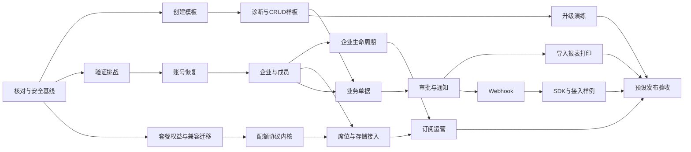

# Full.NET 企业应用与 SaaS 底座完善开发计划

> 执行方式：按仓库 AGENTS.md 逐切片推进，不自动创建工作树、派发代理、提交或推送。本文件负责新增能力和跨专项依赖；已有专项的实现步骤与进度继续在原计划维护。

**Goal：** 将现有模块组合为可创建项目、可由企业自主使用、可运营 SaaS、可升级恢复的开发底座。

**Architecture：** 保持强化型模块化单体、API/Worker/Migrator 分离、Dapper 双库和 Host.Api Native AOT。复用 Identity、Tenancy、Organization、Payments 等数据所有者，不复制账号库，不为目录完整度增加业务项目。

**Tech Stack：** .NET 10、Dapper、自有事务/SQL 边界、SQL Server/MySQL、Vue、OpenAPI 客户端生成、Jobs、Files、Notifications、Outbox、Kubernetes/Helm；新增外部依赖必须在对应切片核对许可、维护状态与原生可行性。

## 1. 授权、状态与计划所有权

- 日期：2026-09-16；用户要求将八项补齐能力和已有模块收口重点写入文档并制定详细计划。
- 审查修订：补齐未注册受邀者入驻、存量权益迁移、F05/F08 无环依赖及版本化源码分发；仅完善计划，不改变实施状态。
- 设计依据：[总体规格 §24.1](../specs/2026-07-17-fullnet-architecture-design.md#241-企业应用与-saas-底座完善2026-09-16)、[产品能力队列](../../roadmap/adminnet-feature-parity.md#8-企业应用与-saas-底座完善队列2026-09-16)。
- 文档核对基线：`main` / `ccd12944d0a77d295d062bfccf7f985fcb7b1362`。按用户要求，工作区其他改动不作为本计划实施证据；开工时重新核对实际提交和相关实现。
- 状态（2026-09-22 核对）：F00 已有[基线核对](../../verification/2026-09-17-foundation-productization-f00-baseline.md)；F01—F16 已有部分模板、领域、API、Vue 和测试资产，企业与 SaaS 子集见[企业预设](../../verification/2026-09-17-enterprise-preset-closeout.md)、[业务接入](../../verification/2026-09-17-enterprise-business-integration-closeout.md)、[SaaS 预设](../../verification/2026-09-17-saas-preset-closeout.md)。F08b 席位编排与 `module-local-transaction-debt` 清债见 [F08b 收口](../../verification/2026-09-22-f08b-foundation-closeout.md)（`da77e74e` 及以后提交）。下方未勾选项表示整项验收未关闭，不代表没有实现。不得根据局部收口标题直接升级 Verified 或 SaaS Production-verified。
- 初版交付仅修改文档；2026-09-19 用户已授权按审查顺序继续实施：当前命名门禁 → 当前提交 CI/SSO 验收 → 安全修复清单 → 企业/SaaS 缺口 → 生产认证。生产启用、真实收费、批量通知、不可逆删除仍遵循对应授权与发布流程。
- 本文件是“底座完善”唯一活动总计划。OIDC、AI、现有安全修复等专项不被替代；只在其完成后消费证据。新增切片在本文展开，确需独立专项时先登记任务转移及唯一所有者，不能双处维护勾选状态。

### 2026-09-26 自主检查与首轮验收

- 授权：用户允许按本总计划自主检查、修改、补测试、本地快速验证、开发分支提交/推送及修复 GitHub Actions；合并与发布另行约定。
- 基线：`120d767ca3e70b68f95923fefcb0ad6378bcd0fb`，工作区干净；开发分支 `codex/foundation-acceptance-20260926`。远端 main 的历史结果不作为本基线通过证据。
- 首轮范围：F00 核对既有增量；优先关闭 F01/F15 的应用创建、升级安全与开发分支验收入口；用双库基础生命周期及企业样例验证已有能力。暂不改变产品政策、生产启用和真实支付渠道。
- 执行步骤：先为升级包摘要、路径、预设闭包、预览后修改与失败恢复建立可失败回归；再修复 `scripts/templates/upgrade-framework.mjs` 及必要辅助工具，同步模板打包；补齐 PR 的创建应用真实栈与受影响双库门禁；执行相关 Template/Contract/Governance 快速检查，独立只读复审后提交推送；按精确 SHA 等待 CI 终态并处理失败。
- 首轮远端反馈：`37ca424c` 的 API/Worker Native Actions 成功，主 CI 失败，尚不能关闭里程碑。失败暴露精简应用可选契约识别、并行模板构建初始化、租户履约服务生命周期及 MFA 迁移目录问题；分别补运行回归、串行模板验收、作用域装配检查与双库迁移重入测试。复审另发现 Workflow 三条变更路径在事务内读取租户权益，已移至事务前并用六个先失败的用例验证允许/拒绝路径，未新增事务债务豁免。
- 后续反馈：固定预设的历史共享迁移 203/206/207 在已核对全文摘要下按建表清单适配，未选表已存在时拒绝漂移，所选表缺失仍失败；完整闭包与无清单运行保持历史正文。代表性浏览器 CRUD 又发现首次 Development 播种早于本地租户创建，现补 Development 专属成员贡献者并覆盖首次与重跑。客户端保留数字模型、规范整数字符串转为安全整数，超出安全范围拒绝；申请单创建使用可信组织上下文头。上述修复在当前提交取得远端双库/浏览器证据前不关闭里程碑。
- `f1e23ee6` 的双库迁移 472 项全通过；受影响基础模块 290 项有 8 项失败。核对为精简测试宿主缺 Files 用量端口、MFA 校验错误状态码预期过时、商业重新激活用例漏开启已有策略。已补装配快速回归、稳定错误码断言与场景专属配置；未改变生产商业策略或去掉宿主依赖校验。
- `8894fb73` 的企业样例双库浏览器及客户端门禁通过，独立 Minimal 应用迁移后启动暴露产品装配缺陷：头像、租户 Logo 和文件配额服务强制依赖可选 Files Port。修正为带默认值的可选依赖；无 Files 时，媒体操作及文件用量对账在数据库/文件副作用前返回既有受控错误，席位对账保持可用，不能把缺失用量视为零。新增 16 项无数据库回归先全部因 DI 失败，修复后通过；保留完整 DI 验证。另隔离钉钉回执测试的环境变量，解决 Linux MethodLevel 并行清理造成的偶发失败。当前修复的独立应用真实栈与完整 CI 仍需按精确提交取得证据。
- `f2692b90` 完整迁移恢复在 90 分钟超时（467 通过、1 失败、未完成其余用例），失败指向 093 的同批次补列后回填编译。SQL Server 执行前仅在固定全文摘要下延迟编译两个回填语句，不改写历史 SQL 资源；MySQL 保持原路径，双库旧数据恢复继续必验。四项快速边界测试先 1 失败/3 通过，修复后连同前序兼容用例 22 项全通过。PR 将模块/Smoke 与两个互补双库迁移组并行执行，发现阶段验证迁移 UID 无遗漏/重叠；main 原完整迁移组按实际耗时保留 120 分钟预算。失败、跳过与未发现不能视为通过。
- `122cff25` 企业双库浏览器与客户端再次通过；独立应用越过 Files 装配后，发现当前会话授权缺 `IHttpContextAccessor`。认证入口现自行补齐该单例依赖，保留宿主覆盖与重复注册幂等；两场景先 1 失败/1 通过，修复后通过。PR 的原 `build-test` 检查名保留为汇总门禁，等待模块及两个迁移分组全部成功；失败、取消、跳过或缺失的迁移结果不得被独立模块成功掩盖。
- `93ef282f` 的独立应用 70 项、企业双库浏览器各 2 项、客户端、API/Worker Linux Native 均通过；双库迁移恢复 250/244 两组共 494 项全部通过，无跳过。Unit 3038、Compatibility 12、Architecture 230 项全部通过；受影响 Integration 295 项为 293 通过、2 失败。失败均为 Development 播种精确清单漏了开工基线已有的 `tenancy.entitlement_catalog_baseline`，实际 8 项、期望 7 项；Test Overlay 的旧清单也漏了同项。现共享显式 Baseline 清单，Overlay 仅追加自身条目，保留精确集合与 Succeeded 状态校验，并增加 Production 仅 Baseline 的审计断言。未改变运行时播种策略；修复后双库生命周期及其后置企业 API 验收仍待当前提交 CI。
- `2c10a5d2` 最终验收：主 CI、API Native、Worker Native 均为成功终态；播种双库生命周期、受影响模块、企业 API、四预设构建、Minimal 独立应用双库真实 CRUD、双库浏览器及迁移恢复门禁通过。首轮“创建应用、源码升级安全与代表性样例”切片关闭，证据与未验证项见[本轮交付报告](../../verification/2026-09-26-f01-created-app-real-stack-closeout.md)。后续文档提交仅同步事实，不改变已验收实现；F01/F15/F16 整项及 W1 不因此关闭。下一切片按 F02 核对既有诊断与生成器在新应用的真实业务 CRUD、跨租户拒绝和再生成保护。
- 验收：应用拥有的源码不被覆盖；损坏包、未知路径和本地定制拒绝写入；升级保留既定预设及成对迁移闭包；失败不丢原框架且恢复材料可定位；创建应用双库和受影响基础模块/样例有真实执行证据。
- 停止条件：需要新的业务政策、外部认证或发布决定，或恢复不能保留人工内容。未执行、跳过及生产等价验证继续保留未验证状态，不降低门禁。

### 2026-09-19 首批阻塞收口

- 基线：`main / 4ad8f0393ae0b0064fb55a63a4496cfe9b9141d2`；任务快照 `unfinished-closeout-20260919`。本节记录该基线上的未提交增量，不代表全计划完成。
- 命名：补齐 224/225/228 表列中文说明和目录覆盖，224/225 双库说明对齐；SQL Server 注释移出建表条件，支持表已创建但脚本未记账时补齐。228 索引使用两库一致的确定性压缩名称；223 固定动态 DDL 逐文件登记审查理由。迁移均首次进入本地基线提交，未执行已记账数据库升级；真实双库恢复仍待 CI。
- C01：修复 OIDC 关闭时旧会话切租户、Host 强撤服务无法装配。协议签发依赖保持按开关注册，OIDC 分支在任何数据库访问前检查完整依赖；历史授权撤销服务始终可用。关闭场景两项回归先失败，修复后通过，另补启用但依赖缺失时零数据库访问的失败关闭断言。
- F05/F08：邀请接受与配额预留/确认/释放改用 `ExecuteResultAsync`，修复后续 CAS 或确认失败仍提交前一条写入。五项真实事务协调器回归先复现提交错误，再验证回滚；不把此局部修复等同于跨模块事务拆分。
- 验证：聚焦 Unit 34/34、命名 32/32、SQL safety 5/5、OpenAPI 172/172、provisioner 37/37、AOT Architecture 73/73；API AOT analyzers 与 Integration Release 构建均为 0 警告/0 错误。集成分片按当前源码重新发现并验证无遗漏/重复后更新矩阵；发现数不是数据库执行通过数。
- 治理仍为 53/54：`module-local-transaction-debt.json` 的 RegisterAccount 与 AcceptTenantInvitation 两条债务尚未消除。第二条理由已纠正为实际的“事务内跨模块写入”，保持失败，不降低门禁。
- 远端核对：`a6d3d02e` 的 [Worker Native](https://github.com/yan041108/Full.NET/actions/runs/35164362025) 成功；[主 CI](https://github.com/yan041108/Full.NET/actions/runs/35164362020) 与 [API Native](https://github.com/yan041108/Full.NET/actions/runs/35164362019) 失败。当前基线及本轮增量没有远端通过证据。旧 E2E 编码错误已有修复与发现证据，仍需真实浏览器重跑。

### 2026-09-19 注册事务边界后续收口

- F04：Tenancy 活动租户权威读取移至 Identity 事务之前；事务内重新解析并核对政策版本/模式、注册方式版本/租户与邀请快照，目标变化时在消费挑战前拒绝。挑战消费和账号写入仍由 `ExecuteResultAsync` 统一提交或回滚。注册命令没有外层事务标记。
- 六项回归在旧实现全部失败；修复后连同邀请正常注册、租户变化、撤销共 9/9 通过。该切片只消除跨模块本地事务调用，不承诺租户在账号提交时仍处于活动状态的分布式原子保证。
- `module-local-transaction-debt.json` 已删除 RegisterAccount 条目，保留 AcceptTenantInvitation 席位写入债务；治理仍为 53/54，不降低门禁。
- 本轮验证：聚焦 Unit 43/43（含首批修复）、事务边界 Architecture 4/4、API Native AOT Architecture 73/73、命名 32/32、SQL safety 5/5；API AOT analyzers 0 警告/0 错误。单元发现数门槛随新增九例同步增加，不代表已执行完整单元套件。独立只读复审未发现新增阻断问题。
- 用户授权由代理决定是否提交：本切片与首批修复整理为本地提交；未推送，本提交的双库、浏览器和 Linux 原生执行仍待 GitHub Actions。

### 2026-09-19 配额恢复前置：安全重放

- F08a：先修正配额预留/确认/释放的重放语义，再建设跨模块恢复编排。相同完成终态重放只读返回当前用量，不重复改动计数；操作键绑定首次金额，Released、Expired 及过期 Reserved 不可作为新额度凭证；Confirmed 同金额预留可返回已有结果。
- 回归：首轮 11 例在旧实现 5 失败/6 通过，确认重复确认、重复释放、金额冲突、已释放和过期预留误成功。另补显式 Expired 的三种操作拒绝、Confirmed 金额冲突四例；双库共用 API 验证扩展原有测试，覆盖响应丢失后顺序重放与用量不重复变化。
- 发现恢复前置缺口：预留记录没有保存实际 MetricId/PeriodKey，完成时重新查 default 或当前月份；过期补偿可能指向错误周期，因此本轮仍拒绝过期未完成操作，不把安全重放等同于可恢复编排。
- 后续顺序：先持久化配额记录归属并处理历史预留回填/歧义，统一跨指标 OperationId 的寻址约束；再开放准确的过期释放；随后以 Identity 持久化操作状态及可靠事件/后台重试驱动席位预留、成员写入、确认、补偿和对账。必须覆盖跨月、重复投递、确认响应丢失、进程中断与邀请撤销竞争。
- 本轮验证：聚焦 Unit 22/22（新增重放 15 例及既有回滚/校验 7 例）、API Native AOT Architecture 73/73、SQL safety 5/5、Integration tooling 46/46；更新后的 Integration Release 构建与 API AOT analyzers 均为 0 警告/0 错误。独立只读审查未发现新增阻断问题。
- 本切片不移除 AcceptTenantInvitation 架构债务，治理保持 53/54，不提升 F08 或 SaaS 预设状态；双库实际执行待 CI。影响计划指向 integration-matrix、smoke、Tenancy；按用户授权整理本地提交，未推送。

### 2026-09-19 配额记录绑定与过期释放

- F08a：新增双库 229 前向迁移，为预留增加可空 MetricId；新预留在同一 Tenancy 事务记录实际配额度量标识。确认、释放和同向终态重放只查询 Id + TenantId + MetricCode 对应记录，不再随 default 或当前月份重新选取配额；Native AOT 映射同步增加可空 UUID 列。
- 兼容与历史数据：迁移不猜测回填旧记录、不更改用量，重复运行保留已绑定值。旧 NULL 记录不能复用或完成，保留计数等待权威业务事实对账；没有可靠归属证据时不得自动绑定或直接释放。绑定缺失或指向已不存在的记录时失败关闭。
- 已绑定且仍为 Reserved 的过期预留允许释放回原始配额记录；过期确认继续拒绝，Confirmed/Released 不允许反向转换。取消/并发失败仍使用结果感知事务，保持计数与预留终态一起回滚。
- 回归：旧实现三例全部失败，修复后扩展跨月、default 变化、终态重放和绑定记录缺失。双库共用 API 验证预留后新增 default 仍完成到原月记录；新增两库迁移恢复测试验证缺列重建、历史 NULL 保留、已有绑定保留及再次执行无迁移。
- 部署约束：先暂停配额及成员变更并排空旧 API/Worker，再运行迁移并统一切换新二进制；不能混跑仍按当前周期完成操作的旧版本。回退只保留新列/新数据且维持写入暂停，不能用旧代码继续确认/释放已绑定操作；历史归属修复需另行提供可审计工具和双库证据。
- 验证：聚焦 Unit 32/32（本切片新增 10 例）、API Native AOT Architecture 73/73、命名 32/32、SQL safety 5/5；API AOT analyzers 与 Integration Release 构建均为 0 警告/0 错误。Integration 分片发现 api-sqlserver 153、api-mysql 153、migrations 470、infrastructure 176、messaging-heavy 57，合计 1009，无遗漏/重复；这是发现证据，不是数据库运行证据。独立只读复审未发现新增阻断问题。
- 当前切片未实现后台扫描、跨指标操作键唯一性或 Identity 持久化编排，AcceptTenantInvitation 债务继续保留，治理仍为 53/54；未获得双库运行及 Linux 原生执行证据前不提升 F08/SaaS 状态。已按用户授权准备本地提交，未推送；CI 影响集为 integration-matrix、migrations、smoke、Tenancy。

### 2026-09-19 跨指标操作键精确寻址

- F08a：确认/释放请求新增可选 MetricCode，保持原单参数构造与 Deconstruct；现有 source-generated JSON 上下文自动覆盖新属性。提供指标时按 TenantId + MetricCode + OperationId 唯一查询，不存在时不回退。空白或超长指标在查询前拒绝。
- 旧调用兼容：省略或传 null 时，仅返回同租户操作键唯一的预留；自关联 NOT EXISTS 排除歧义行，返回既有 quota reservation not found 404，避免 QuerySingle 多行异常或任意选取。同操作键的其他租户不构成歧义。席位适配器固定传 identity.seats，减少对旧协议的依赖。
- 数据兼容：不改变数据库唯一键，不重写历史 OperationId，不新增迁移。精确寻址复用现有三列唯一索引，完成仍以已绑定的 MetricId 定位实际用量。旧请求查询时点后的并发新增不构成跨模块原子保证。
- 测试：首轮两条 sourcegen JSON/精确寻址回归在旧实现均失败；另补无效指标、无回退、席位适配器用例，共新增 12 例。双库共用 API 增加两个指标共用操作键、旧调用拒绝、精确确认/释放及同向重放。现有客户端导出 manifest 不含这些 quota 端点，本轮不扩大导出集合。
- 验证：聚焦 Unit 44/44、API Native AOT Architecture 73/73、OpenAPI 172/172、命名 32/32、SQL safety 5/5；AOT analyzers 与更新后 Integration Release 构建均为 0 警告/0 错误。独立只读复审未发现新增阻断问题；真实双库和 Linux 原生执行仍待 CI。
- 工具链补漏：本轮发现上一切片 229 未登记 migrationSelections，导致工具链 45/46；补上双库筛选并将参数化迁移测试拆为具名 SqlServer/MySql 入口后恢复 46/46，测试数量不变。
- 剩余：历史 NULL 绑定仍需有权威证据的对账与修复工具，未建设 Identity 持久化编排及后台补偿；AcceptTenantInvitation 债务继续保留，治理仍为 53/54，不提升 F08/SaaS 状态。按用户授权整理本地提交，未推送。

**下一切片（2026-09-19 记录，已由 2026-09-22 切片部分兑现）：** 完成历史归属对账，再消除 F05/F08 席位跨模块写事务；以持久化操作身份、业务权威状态、补偿和对账覆盖确认丢失/进程中断，不能仅把调用移出事务或删除债务条目。随后按当前提交执行双库恢复、OIDC/legacy 真实栈和 Linux 原生门禁。治理与环境证据未齐时，不提升企业/SaaS 预设状态。

### 2026-09-22 F08b 席位编排与 F08a 对账工具

- 基线：`main` / `da77e74e`（Wave 1 Lane C）；Spec [`2026-09-22-f08b-tenant-invitation-seat-orchestration.md`](../specs/2026-09-22-f08b-tenant-invitation-seat-orchestration.md)。
- F08b：`AcceptTenantInvitationService` 与 `TenantMemberProvisionService` 将 Tenancy 席位预留/确认/释放移出 Identity 本地事务；确认失败执行成员/邀请补偿；`module-local-transaction-debt.json` **entries: []**，治理 `capability-debt-sync` 与债务目录一致。
- F08a：历史 NULL `MetricId` 预留对账 API `POST /api/v1/tenancy/quota/reservations/reconcile-metric-ids`（`dryRun` 默认 true）；权限 `tenancy.tenant_quota.reconcile_metric_ids`。
- 验证：Unit `TenantInvitationRollbackTests`、Architecture 模块边界；双库 Integration 对账端点、邀请接受 real-stack 与 SaaS 预设升档仍属 Wave 2–3 门禁，本切片不单独提升 F08/SaaS 为 Verified。
- **下一切片（2026-09-22）：** F05 企业成员全链路双库/real-stack 验收；F12 SaaS 预设在席位编排与配额对账证据齐全后的门禁；持久化操作身份与 Outbox/Jobs 补偿仍按 §F08 正文未勾选项推进。

## 2. 能力、顺序与范围

### 2026-09-25 认证事件日志专项

新增[认证事件日志开发计划 AE01—AE06](2026-09-25-authentication-event-logs.md)，作为 Identity/安全运维收口项。复用现有 `fn_identity_auth_audit`，顺序为事件覆盖与契约 → 兼容迁移/可靠写入 → 认证及 SSO 采集 → 查询 API → Vue 页面 → 保留/导出与验收。F04 的密码/MFA 恢复事件与 SSO 专项共同提供事件来源；本专项负责统一展示及覆盖闭环。首条纵向切片已落地，状态为 Partial；完整事件矩阵与故障验证仍待完成。

| 能力 | 优先级 | 本计划任务 | 最小交付 | 不纳入首切片 |
| --- | --- | --- | --- | --- |
| B01 项目创建与升级工具链 | P0 | F01、F02、F15 | 空目录创建、模块预设、诊断、示例、版本升级演练 | 云端在线 IDE、插件市场、自动覆盖人工代码 |
| B02 企业开通与成员生命周期 | P0 | F05、F06 | 开通流程、邀请、成员管理、所有者交接、退出与停用 | 跨公司复杂 HR、通用组织主数据平台 |
| B03 套餐权益与统一配额 | P0 | F07、F08 | 套餐绑定、功能权益、席位/存储配额、原子预留和对账 | 全局计费引擎、按任意 SQL 动态定义权益 |
| B04 账号自助与恢复 | P0 | F03、F04 | 可配置注册、邮箱验证、密码/MFA 恢复、会话撤销 | 默认匿名开放企业注册、同时铺开所有短信渠道 |
| B05 SaaS 订阅运营 | P1 | F12 | 试用、续期、取消、到期策略、支付对账驱动权益 | 自动税务、复杂账务总账、任意币种自动换算 |
| B06 开放集成与 Webhook | P1 | F13、F14 | 注册事件、签名、投递重试/重放、接收样例、SDK | ESB、任意脚本集成、运行时扫描插件 |
| B07 业务接入标准样板 | P1 | F09、F10、F11 | 业务单据贯通附件、权限、审批、通知和数据交付 | 完整 ERP/CRM 产品、第二套审批引擎 |
| B08 发布升级恢复交付包 | P1，发布必需 | F15、F16 | 支持矩阵、发布清单、备份恢复、升级回退演练 | 未经证据承诺所有部署拓扑和容量 |

执行按依赖推进，不把 P0/P1 当成可绕过前置条件的排序。建议首次取一条纵向主线：F00 → F01 → F02；其后 F03 → F04 → F05 → F06。配额分为 F07 → F08a 协议内核，以及 F05 + F08a → F08b 业务接入，F08 仅在两部分均通过后关闭。F05 可在明确未启用配额的基础预设验收，限额/SaaS 预设必须等 F08b；不允许运行时故障降级为无限额。已有安全问题在每条受影响链路交付前收口。八项扩展不全部成为核心 1.0 阻塞项；SaaS 预设必须达到其自己的完整验收。



## 3. 数据、契约与跨模块边界

1. Identity 拥有账号、验证挑战、认证会话、企业成员的登录/授权绑定；Organization 拥有部门、职位和组织隶属；Tenancy 拥有租户生命周期、套餐、权益与配额。F00 必须先映射现有表/Port，扩展原关系，不另造平行成员事实源。
2. Tenancy 拥有开通与订阅编排记录；Payments 继续拥有支付、退款和渠道事实。支付成功不直接修改另一模块表；可信业务事件推动订阅状态，按版本去重，失败可重放与对账。
3. 企业所有者表示租户内受保护职责，不是 Host 超级管理员；最后一名可管理成员和所有者交接使用 Identity 内原子校验，不绕过会话、租户和操作权限。
4. 功能权益决定租户可用功能，RBAC 决定当前人可执行操作，配额决定剩余使用量。有效调用须分别通过对应检查。业务权益不存入通用 Settings ConfigEntry；Settings 只承接展示偏好或明确的平台配置。
5. TenantMembership、Entitlement、QuotaReservation 等是本计划的领域概念，不承诺现有类同名。F00 在本文登记实际表、内部类型、消费者及方法签名后才开始相应编码；外部稳定契约先冻结，再生成客户端。
6. 配额预留与业务写入分属不同所有者时，不承诺一个本地事务原子完成。以稳定 OperationId、预留凭据、确认/释放和恢复对账组成协议；未知执行结果保留占用，不能到期直接释放并允许重复消耗。
7. 会话、成员状态、付费权益和硬配额的拒绝判断使用权威状态或已批准的强一致策略，不能依赖可能陈旧的 L1 授权。跨模块读取走最小 Port，写入走可靠事件/幂等工作流，事务内不调用其他模块 Port。
8. Vue 为唯一后台主线。普通业务 API 用 ProblemDetails；OIDC 端点沿用 ADR-0011 的协议例外。后台任务、导出、通知、Webhook 与 AI 均保留租户及数据权限边界。
9. 模块按真实消费者编译期装配，沿用现有 Composition 预设。新增可选模块只创建一个主项目；Contracts 拆分需要真实消费者证据，不为框架完整度预建空层。
10. 首版应用模板使用固定提交、带版本与内容摘要的源码分发包。生成应用在 `framework/fullnet/` 保存受管框架源码，在 `src/`、`ui/` 保存应用拥有的宿主/业务/界面；框架与应用所有权由 manifest 区分。现阶段不以尚未发布的 Full.NET NuGet/npm 包为前提，也不访问开发者原始仓库或任意最新分支。
11. 邀请制允许没有账号和会话的受邀者验证邀请并注册。邀请授权、目标邮箱验证、账号认证和成员激活是不同步骤；原有账号必须完成其原认证/MFA，不能通过邀请重置密码或绕过 MFA。账号/挑战/邀请/成员均由 Identity 原子维护，企业状态等跨模块约束仍走受控协作。
12. 权益强制执行前必须完成存量兼容清单、回填与切换门禁。既有部署默认保持明确的兼容阶段，新 SaaS 预设使用强制阶段并要求有效套餐；无绑定、状态读取失败与未知权益不能在强制阶段回退为兼容。

## 4. 文件与验证地图

以下新路径是实施目标，不表示文件已存在。实现任务按当时库存选择成对迁移编号，禁止预占或改写已应用迁移。测试类可按实际夹具收敛，但必须在本文记录最终入口，不能只有无调用者的断言辅助类。

| 任务 | 主要修改/新增位置 | 测试目标 |
| --- | --- | --- |
| F00 | 本计划；`docs/roadmap/capability-status.md`；既有专项执行记录 | 核对证据与实际入口，不新建形式化空测试 |
| F01–F02 | 新增 `templates/fullnet-app/.template.config/template.json`、模板内容与 `scripts/templates/verify-created-app.mjs`；复用 `src/Tools/Full.NET.CodeGeneration.Cli/`、`src/Composition/` | 新增 `tests/templates/created-app.test.mjs`、`tests/templates/template-options.test.mjs` |
| F01/F15 | 新增 `scripts/templates/build-source-bundle.mjs`、`templates/fullnet-app/framework-manifest.schema.json`；分发包内包含锁定来源、项目/包依赖及迁移清单，生成应用保存 `framework/fullnet/` 和 `framework-manifest.json` | 新增 `tests/templates/source-bundle.test.mjs`、`tests/templates/source-bundle-upgrade.test.mjs`，包含摘要损坏、外部路径、离线来源与人工冲突 |
| F03–F04 | 复用 `src/Modules/Full.NET.Modules.Notifications/Features/VerifyRecipientEndpoints/`；扩展 Identity 的 `Features/ManageRegistrationPolicy/`、新增 `Features/RegisterAccount/`、`Features/RecoverAccount/` | `tests/Full.NET.UnitTests/Identity/AccountRecoveryTests.cs`、`tests/Full.NET.IntegrationTests/Identity/AccountLifecycleAssertions.cs` |
| F03–F05 | Identity 新增 `Features/RegistrationInvitations/`，F04 提供一次性邀请/注册领域能力，F05 接管理与入驻入口；Notifications 新增 `Features/SendIdentityChallenge/` 的内部受控投递适配，复用现有邮件 Provider | `tests/Full.NET.IntegrationTests/Identity/InvitedRegistrationAssertions.cs`；覆盖无账号/无会话、已存在账号、撤销竞争及未入租户的收件人 |
| F05–F06 | Tenancy `Features/ProvisionTenant/`；Identity 新增 `Features/ManageTenantMembers/`、`Features/AcceptTenantInvitation/`；Organization 成员适配；Vue 新增 `TenantMembersView.vue`、`TenantOnboardingView.vue` | `tests/Full.NET.UnitTests/Identity/TenantMembershipTests.cs`、`tests/Full.NET.IntegrationTests/Identity/TenantMembershipAssertions.cs`、`tests/Full.NET.IntegrationTests/Api/TenantLifecycleAssertions.cs` |
| F07–F08 | Tenancy `Features/ManageHostTenantPackages/`；新增 `Features/ManageTenantEntitlements/`、`Features/ReserveTenantQuota/`；首个 Identity/Files 消费者 | `tests/Full.NET.UnitTests/Tenancy/TenantEntitlementTests.cs`、`TenantQuotaTests.cs`；`tests/Full.NET.IntegrationTests/Api/TenantEntitlementAssertions.cs`、`TenantQuotaAssertions.cs` |
| F09–F11 | 新增 `samples/enterprise-request/`；复用 Workflow、Files、Notifications、ImportExport、Reporting、Printing 模块及生成器 | `samples/enterprise-request/tests/`；`tests/e2e/admin-real-stack/tests/enterprise-request.spec.mjs` |
| F12 | Tenancy 新增 `Features/ManageTenantSubscriptions/`；Payments `Features/ManageOrders/`、`ManageRefunds/`、`ReceiveWeChatNotify/`；Vue 新增 `TenantSubscriptionView.vue` | `tests/Full.NET.UnitTests/Tenancy/TenantSubscriptionTests.cs`、`tests/Full.NET.IntegrationTests/Api/TenantSubscriptionAssertions.cs` |
| F13–F14 | 首个消费者出现时新增 `src/Modules/Full.NET.Modules.Webhooks/`；复用 Identity OpenAccess、Auditing、Outbox；新增 `samples/webhook-consumer/`；`packages/client-contracts/` | `tests/Full.NET.UnitTests/Webhooks/WebhookDeliveryTests.cs`、`tests/Full.NET.IntegrationTests/Api/WebhookDeliveryAssertions.cs`、样例契约测试 |
| F15–F16 | `deploy/helm/fullnet/`、`docs/operations/`、`docs/development/onboarding.md`、发布工作流；新增 `docs/operations/application-upgrade.md`、`docs/operations/application-recovery.md` | `tests/deployment/`；模板旧版本升级夹具；现有 Native API 与 Worker 外部进程夹具 |

数据任务共同涉及 `src/BuildingBlocks/Full.NET.Migrations.DbUp/Migrations/SqlServer/` 与 `MySql/`、模块 SQL/JSON/AOT 登记、`contracts/database/object-comments.json`、`contracts/architecture/global-sql-statements.json`。增加测试时同步 `eng/testing/test-matrix.json`；普通管理前端复用 `packages/client-contracts/` 的 OpenAPI 生成，不手写第二套 DTO。

## 5. 新能力实施任务

每项清单均为未执行。任务完成须记录提交、实际验证命令/结果、未验证项；实现与发布状态分开。后续执行单步按“失败场景 → 最小实现 → 聚焦验证 → 消费方接线 → 切片验收”推进。

### F00：冻结现状、已有计划分工和第一条交付基线

**依赖：** 无。**产出：** 可追踪的模块/入口/证据清单和首批实际接口签名。

- [ ] 核对八项能力在当前提交中的 Endpoint、表、Vue、测试和专项；对已实现内容只记录缺口，禁止重建。特别核对 Registration/OAuth/OIDC、通知验证码、ImportExport/Reporting 与 Payments。
- [ ] 将 §6 的 C01—C07 映射到原计划的具体未关闭任务及证据；文档冲突时记录“实现存在、验收待核”，不凭标题直接改为完成。
- [ ] 在本计划追加第一批切片的契约登记：所有者、调用方、请求/结果字段、错误码、精确权限、幂等键、并发版本及数据兼容策略。跨模块先证明现有 Port 不足再扩契约。
- [ ] 选择最小可发布预设及其真实验证范围；带已知安全/隔离问题的链路先修复，未选入的可选模块不使核心预设假通过。

**验收：** 每个新能力可定位到现有资产、增量和任务所有者；每个当前发布阻塞有关闭条件，未产生代码能力通过声明。

### F01：从空目录创建独立应用

**依赖：** F00。**消费：** Naming Profile、Composition 预设。**提供：** 基础管理、企业应用、SaaS 的可选择模板；未满足能力门禁的预设标为实验性且不默认启用。

- [ ] 先实现版本化源码包构建：固定源提交，登记每个受管文件摘要、框架版本、模块闭包、中央包版本、构建 props/targets、源生成器、迁移资源、CLI 与前端 workspace 依赖及锁文件。包不含 bin/obj、秘密、本机缓存、绝对路径或指向原仓库的链接；摘要不符拒绝实例化。
- [ ] 从现有静态注册清单产生所选预设的 Composition 投影及项目引用闭包，不把当前引用所有模块的 Composition 原样复制后仅关闭运行开关。登记哪些迁移/种子属于所选闭包及其历史依赖，禁止按名称过滤后静默跳过必要迁移。
- [ ] 建立模板参数负例：非法/保留 OwnerKey、未知模块、缺硬依赖、输出目录冲突均拒绝且零覆盖。
- [ ] 定义项目名、OwnerKey、SQL Server/MySQL、模块预设、前端和端口选项；冻结输出 manifest，秘密只生成占位配置。
- [ ] 模板包随附受管框架源码，以应用内部相对 ProjectReference 和 workspace 引用完成接线；初始化时复制的宿主/业务/界面骨架之后属于应用，不被框架升级器直接覆盖。NuGet/npm 第三方依赖仅从配置的源按锁定版本还原，Full.NET 自有代码与前端共享包来自分发包。
- [ ] 在不能访问原仓库、没有自有包缓存的干净环境，仅凭版本化模板包与声明的第三方依赖源创建两种数据库应用，执行还原/构建、迁移/引导、登录和一个管理读取；重复创建不覆盖用户文件。原生构建验证包内 analyzers/generators/迁移资源齐全；额外无网络还原只有在依赖预缓存条件明确时才要求。

**验收：** 新应用不依赖原仓库绝对路径；未选择模块没有意外运行依赖；首次运行说明与实际步骤一致。后续计划命令示例：`dotnet new fullnet-app --name Demo --owner-key demo --database mysql`，模板未登记前不可报告该命令可用。

### F02：环境诊断与生成一个真实 CRUD

**依赖：** F01。**提供：** 可复用的应用开发起点及受控诊断结果。

- [ ] 对缺 SDK、错误数据库配置、遗漏模块依赖、未配置密钥建立诊断断言；输出机器码和修复指引，不泄露凭据。
- [ ] 在现有 CLI 内扩展诊断入口，先只读检查，用户显式要求后才执行初始化；区分本地开发和生产配置。
- [ ] 用现有生成器在新应用生成一个租户 CRUD，贯通数据库、后端、OpenAPI、Vue 和精确权限；开发者修改业务实现后再生成，证明人工文件不会丢失。
- [ ] 完成从创建到首个 CRUD 的教程并实走；记录耗时与失败原因，性能目标由实测基线后制定，不虚称固定分钟数。

**验收：** 新应用的真实新增/编辑/查询和跨租户拒绝通过；生成器只更新其持有的产物。

2026-09-26 执行顺序（用户已授权自主检查与升级；基线 `264ea40d`，干净工作区）：

1. 诊断收口：以 `tests/Full.NET.UnitTests/CodeGeneration/DiagnoseCommandTests.cs` 复现未知 Profile、配置类型错误与目标工作区 SDK 选择缺口；修改 `src/Tools/Full.NET.CodeGeneration.Cli/CodeGenerationCli.cs` 与 `DiagnoseCommand.cs`，保持只读、脱敏、稳定机器码及非零失败语义。执行聚焦 Unit 与治理，更新 `docs/development/create-first-crud.md` 的真实入口和限制。
2. 生成接入：复用现有 Schema、工作区所有权与模块接入工具，在 `tests/templates/support/created-app-real-stack.mjs` 中增加独立应用生成路径；先检查宿主、Migrator、OpenAPI 和 Vue 的实际接入点，不复制官方模块或改写受管框架作为业务实现。
3. 真实验收：在双库新应用验证生成业务的新增/编辑/查询、精确权限、跨租户拒绝；保留人工业务文件及人工修改的受管文件冲突拒绝，二次生成不得损坏内容。重型验证由 GitHub Actions 执行，失败先定位再修复。
4. 教程与关闭：修正 `docs/development/create-first-crud.md` 与 `first-crud-from-template.md` 中仓库布局和独立应用布局混用的命令；只依据实际执行证据记录耗时与结果。诊断子集通过不代表整个 F02 关闭；SDK 缺失时不能承诺依靠尚未启动的 .NET CLI 自救。

停止条件：需要新的业务政策或发布决定、再生成不能保留人工内容、跨租户或权限拒绝缺失；不得放宽双库、冻结的 Layui 边界或 Native AOT 门禁。

诊断第一增量：合法 `--profile` 曾因默认值被当作已传参而全部返回 64；修复为解析后再应用默认值，并拒绝未知 Profile。SDK 检查改用目标工作区，类型错误输出脱敏 `DIAG_APPSETTINGS_INVALID`，取消继续传播，环境连接占位符不得视为已配置。回归先 11 项中 10 失败；入口修复后 10 通过、1 失败，精确复现生产环境变量占位符误报。审查追加 6 条回归，其中 inline 空白、ConnectionStrings 非对象及 Redis 秘密 bool/number 4 项先失败，再统一为空白/占位符拒绝与严格字符串类型。最终 CLI 聚焦 66 项、CodeGeneration/Realtime 414 项、治理 55 项通过，无跳过，Release 构建 0 警告/0 错误。Integration 1075 项仅为分片发现证据；独立 Minimal 双库应用现必验应用自带 CLI 的 SDK/工作区/预设/模块闭包及配置只读性，实际执行与远端门禁待此增量推送后验证。完整配置覆盖、SDK 版本兼容矩阵、UserSecrets 内容与独立生成业务链路仍待后续增量，不关闭 F02。

生成接入第一增量（基线 `0702cc54`）：内部模型已支持省略 Layui 路由，但 CLI JSON 读取器仍把路由与控制器字段标为 required，且同命名空间旧实现遮蔽共享路由接入器。读取器回归先 5 项中 4 失败；实际 CLI 回归先 3 项全部因空引用失败。三个字段改为可选并移除旧实现后，实际 CLI 3 项通过，覆盖 Vue 路由写入、重复执行幂等、无 Layui 输出或目录，以及缺少前提或聚合桥所有权时拒绝写盘。CodeGeneration/Realtime 422 项、治理 55 项全部通过，无跳过，Release 构建 0 警告/0 错误。未知字段拒绝及显式 Layui 控制器配对校验保留；未修改冻结客户端。诊断提交 `0702cc54` 的模板真实栈作业已成功，包含独立 Minimal 双库应用自带 CLI 与配置只读性检查；其余门禁与生成接入增量按精确 SHA 继续核对，不替代完整生成 CRUD 验收。

2026-09-26 授权接入修复计划（基线 `ee3461da`）：现有 `AuthorizationContributorIntegrationEditor` 把集合元素追加到类型外，且只凭一个权限标记跳过整条接入。先在 `tests/Full.NET.UnitTests/CodeGeneration/AuthorizationContributorIntegrationEditorTests.cs` 复现三个集合插入、重复幂等、部分标记与人工漂移、注释/字符串伪装及非标准集合拒绝；复用既有轻量 C# 词法分析确认唯一标准集合位置，保持手写元素并逐集合验证完整生成块，任何歧义保持原文返回失败。生成文件以独立小项目做实际编译实验，执行聚焦 Unit、治理及影响集规划后独立审查、提交推送。此增量不新增 CLI 命令、不改变权限作用域政策或数据库结构，不代表完整生成业务验收。

授权结构接入结果：首批 Unit 8 项先 7 失败/1 通过，修复集合内插入后通过；追加边界回归复现非标准重复声明，独立复审又复现“完整块藏入被丢弃的嵌套集合”伪幂等，现已要求生成块开始和结束均处于直属元素边界。新增 15 项回归覆盖标准插入、手写元素保留、两实体依次接入与各自幂等、CRLF、部分/重复/越界/人工漂移、字符串伪标记与不明确形态拒绝。旧追加方式的独立结构编译实验报 11 错误，实际编辑结果编译为 0 警告/0 错误；该实验使用最小类型定义，不替代实际授权目录或应用运行。

本地新鲜证据：`pnpm test:dotnet:unit -- --selection code-generation-realtime` 437 项通过，`pnpm test:aot:analyzers` 0 警告/0 错误，`pnpm test:dotnet:architecture -- --selection api-native-aot` 73 项通过，`pnpm test:governance` 55 项通过，均无跳过；`pnpm test:integration:partitions` 发现 1075 项，无遗漏或重复，不计为完整 Integration 通过。影响集规划基线为 `ee3461da`，目标 CodeGeneration。首次分析构建曾与测试构建争用 DLL 而失败，串行复验已通过；不将第一次失败计为成功。独立复审无剩余阻断，远端按新提交 SHA 核对。生成片段的权限作用域政策、CLI 授权接入、应用 Migrator、完整生成业务与宿主整条接入的并发/恢复仍未验收，不关闭 F02。

授权作用域增量（基线 `34ab3bcc`）：片段生成器原来对租户 CRUD 固定输出 Host 权限，违背 `TenantRequired` 数据上下文。新增 7 项 Unit；纠正测试样例中显式能力禁止的审计列后，正确 RED 为 3 失败/4 通过，覆盖两种实体能力格式的租户映射及旧 Host 块不允许静默改写。现六条权限共用 `TenantRequired → Tenant` 映射，`HostOnly/Global → Host` 保留现有最小授权范围，未改变精确权限码或官方模块贡献者。租户 CatalogProduct golden 仅两处作用域随实际输出更新；CodeGeneration/Realtime 444 项、治理 55 项通过，无跳过，独立复审无阻断。实际授权运行、CLI 贡献者接入和独立应用 CRUD 仍待 F02 全链验收。

作用域增量补充验证：`pnpm test:aot:analyzers` 0 警告/0 错误，`pnpm test:dotnet:architecture -- --selection api-native-aot` 73 项通过、无跳过；`pnpm test:integration:partitions` 发现 1075 项，无遗漏或重复，不作为完整 Integration 通过。影响集按基线 `34ab3bcc` 规划为 CodeGeneration 与 integration-matrix，重型双库及 Native 运行门禁交由新提交的 GitHub Actions，未取得终态前不升级 Verified。

### F03：复用通知平台完成账号验证挑战

**依赖：** F00、C04 通知安全收口。**提供：** Identity 账号操作挑战及 Notifications 投递衔接。

- [ ] 核对现有收件端点验证与验证码能力，区分“拥有邮箱地址”和“获准恢复账号”；不得把通用收件端点 verified 直接当作密码重置授权。
- [ ] 建立挑战用途/账号/目标地址绑定、过期、尝试上限、一次消费、并发重放与重发替换测试；未知账号不通过响应差异泄露存在性。
- [ ] Identity 保存其操作挑战的不可逆凭据摘要，通过稳定投递意图请求 Notifications；外部发送事务外进行，失败/未知送达状态可追踪且不消费成功凭据。
- [ ] 提供仅供受信 Identity 调用的挑战投递 Port：绑定用途、ChallengeId/InvitationId、规范化目标邮箱、有效期、发起操作及可选账号/目标租户，不要求接收人已有 UserId、已加入租户或 verified RecipientEndpoint。公开请求不能自行选择模板、渠道配置、任意内容或批量地址；按地址/来源/用途限流，原普通通知用户目录与 verified 校验保持不变。
- [ ] 邀请/注册凭据若需异步投递，原值只能在受限、加密且限期清理的投递载荷中存在，身份校验侧仍只保存摘要；过期/撤销挑战不得继续重发。跨模块交付通过幂等投递身份与状态对账恢复，不让“创建挑战成功”被当成“已送达”。
- [ ] 选择一个邮件测试渠道验证真实投递和消费，日志与界面不回显验证码；测试环境受控收件箱证据与生产渠道认证分别记录。

**验收：** 两个并发消费最多一个成功；未送达不被标记为已验证；不能跨用途复用挑战。未注册且未加入任何租户的邮箱可通过受控挑战渠道收信，但不能借该渠道调用普通通知 API 或发送任意邮件。

### F04：注册、密码恢复与 MFA 恢复

**依赖：** F03；新旧会话撤销消费 C01。**提供：** Identity 的完整账号自助流程。

- [ ] 以现有注册政策为入口，明确 Disabled/InvitationOnly/Open：Disabled 拒绝所有新账号，InvitationOnly 仅接受有效一次性邀请，Open 才允许无邀请注册；默认 InvitationOnly。F04 在 Identity 内实现邀请校验与注册领域原语，由受控测试夹具创建邀请验证闭环，F05 再交付正式签发/撤销管理入口，因此 F04 不依赖 F05。
- [ ] 无会话受邀者先校验邀请，再以独立邮箱挑战证明目标地址控制权，设置密码后建立账号与可重试的入驻状态；不要求先登录不存在的账号。邀请、邮箱挑战、账号创建与幂等注册结果在 Identity 内原子提交；账户可建立时不得提前获得尚未激活的企业权限。既有账号进入其原登录/MFA 流程，不因邮箱文本相同自动绑定、重置或合并。
- [ ] 区分邀请未使用、已绑定账号待入驻、已激活和已撤销状态：注册完成后原凭据不能创建第二个账号，只允许经该账号认证恢复同一入驻记录；待入驻期间仍可被撤销，激活与撤销竞争由 Identity 原子状态转换决定。
- [ ] 实现注册与账号验证，维持统一账号目录和密码/锁定策略；现有管理员重置密码保持独立权限，不挪作公开接口。
- [ ] 实现密码恢复，消费挑战与变更凭据在 Identity 事务内完成；撤销适用旧/新会话和刷新族，旧中心 Cookie 不得重新获取有效授权。
- [ ] 实现 MFA 恢复码生成/摘要保存/一次消费；无恢复码的人工恢复使用独立权限、审核和审计，不以邮箱验证自动清除 TOTP。
- [ ] Vue 完成成功、过期、错误和限流流程，检查 CSRF、Origin、日志去敏及无账号枚举。
- [ ] 建立无账号/无会话的邀请注册测试，覆盖邀请目标替换、过期/撤销与注册竞争、同邮箱并发创建、已存在账号登录绑定、重试返回同一注册结果，以及撤销邀请后待入驻记录不能激活。

**验收：** 双库和浏览器验证正常恢复、重放拒绝与旧会话失效；公开注册仍受部署政策控制。

### F05：企业开通、邀请与租户成员管理

**依赖：** F04。**提供：** 可恢复开通流程、正式邀请入口及不依赖配额的成员基础能力。仅在明确未启用配额的基础预设验收；F08b 再接席位限制，限额/SaaS 预设在 F08b 完成前不得启用。不设置 F05 → F08 的前置依赖。

- [ ] 冻结统一账号与租户成员关系的映射，已有账号接受邀请时仅新增合法成员关系，不复制账号；同账号跨企业的角色/部门独立。
- [ ] 将 ProvisionTenant 扩展为持久化步骤：申请、资源建立、所有者绑定、初始化、激活；跨模块写入用幂等命令/事件，各步骤失败可重试或补偿，未完成不对外宣称可用。
- [ ] 接通 F04 的邀请签发/撤销与注册原语，邀请绑定租户、目标邮箱、可选已有账号、角色范围、有效期及一次消费凭据。新用户经邀请注册后继续入驻，已有用户经原认证/MFA 且身份匹配后接受；不允许邀请发起者授予其无权授予的角色。激活成员前重新检查邀请/待入驻状态、发起者授权和企业状态，撤销后不继续激活。
- [ ] 实现成员分页、启停、角色/组织关系管理与邀请撤销；使用受信 Tenant 上下文和各操作独立权限，提供 Vue 页面。
- [ ] 双库覆盖从未注册邮箱到成员激活的全流程、重复接受、邀请撤销与接受竞争、账号已创建但成员未激活时中断恢复、已存在账号加入、跨企业越权和只剩最后一名管理成员。基础模式无配额与强制模式不允许绕过的验收分别留证；后一组由 F08b 关闭。

**验收：** 企业可由其管理员完成成员入驻；开通失败不会形成可登录但未初始化的企业，跨模块不使用共享本地事务。

### F06：所有者交接、成员退出与企业停用

**依赖：** F05、C01/C05。**提供：** 企业生命周期状态和各消费者的撤销行为。

- [ ] 冻结 Active/Suspended/Closing/Closed 状态以及允许的恢复转换；首版停用与逻辑关闭，物理清除需要单独保留政策和执行授权。
- [ ] 所有者交接绑定明确接收人并做强认证、最后一名保护和并发版本校验；验证两个并发交接不会产生零管理者。
- [ ] 成员退出/移除只撤销目标企业授权，不禁用其全局账号或其他企业成员关系；梳理待办改派、后台执行、文件访问、API 凭据和实时连接处理。
- [ ] 企业停用后阻断新业务写入、异步副作用及新授权；定义恢复入口、只读/导出策略和通知，按各模块 Port/事件收敛并提供对账状态。

**验收：** 退出 A 不影响 B；停用后下一次受保护操作拒绝；未完成的跨模块清理可见且不可误报全部完成。

### F07：套餐绑定与功能权益

**依赖：** F00。**提供：** Tenancy 拥有的版本化套餐/租户权益及最小读取 Port。

- [ ] 冻结权益目录、类型、套餐版本与租户绑定生效时间；未知权益一律拒绝，强制模式下缺绑定/无授权默认拒绝。运营人员仅能配置代码登记的权益，不借通用配置创建任意授权表达式。
- [ ] 在 Tenancy 持久化 Compatibility/Shadow/Enforced 阶段及版本：旧部署升级默认 Compatibility，仅已登记的历史功能保持原权限判断；Shadow 比较将来权益决策但不切断原有功能；新 SaaS 预设创建时直接 Enforced，租户在绑定有效套餐前不得激活。阶段由部署/受控管理决定，不能由请求头或数据库异常推导。
- [ ] 在启用前按旧部署实际可用功能生成存量兼容清单，dry-run 展示受影响租户、未绑定项及差异；经运营确认后使用幂等迁移/回填记录建立显式兼容套餐或租户授权，不授予新增功能、不修改用户 RBAC。覆盖回填中断重入及回填期间新增租户，切换前以一致的版本/受控写入门禁确保无遗漏。
- [ ] 只有所有在用租户均有有效绑定、差异已处置且所有 API/Worker 实例支持权益检查后，才能切为 Enforced。混合旧实例期间维持兼容/影子模式；切换后读状态失败拒绝，不能退回 Compatibility。回退默认保留强制策略并前向修复；会绕过权益的旧版本不得直接重新上线。
- [ ] 建立“有 RBAC 无权益”“有权益无 RBAC”“未知权益”“另一实例命中旧值”的失败断言。
- [ ] 实现套餐绑定、升级/降级预览、定时生效和明确租户特例；权限校验独立执行，返回原因可区分未购买、无权限与配额不足。
- [ ] 选择 Workflow 启用作为首个业务消费者，覆盖页面、API、后台启动三个入口；停用权益不删除已有业务数据，存量实例处置按冻结政策执行。
- [ ] 从未绑定套餐的真实旧版本数据升级，验证已有 Workflow/API/后台操作在兼容阶段保持原结果；执行 dry-run、回填、Shadow、Enforced，再验证取消授权、未绑定新租户、状态库故障与旧实例切换拒绝。此双库升级用例在 F07 关闭，F15 复用并扩展为整应用升级。

**验收：** 单改 UI 或角色不能绕过权益；套餐切换有版本和审计，同场景双库及多实例拒绝成立。旧项目升级不意外停用已有功能，强制阶段缺绑定/状态故障不放行，兼容模式不扩张为永久的付费功能旁路。

### F08：席位、存储与调用额度的统一配额协议

**依赖：** 分两部分验收：F08a 只依赖 F07；F08b 依赖 F08a、F05 和 C02。**提供：** 配额协议内核及真实成员/文件消费者；两部分均通过才关闭 F08，协议单测通过不能代替业务接入。

**F08a：协议内核，独立双库验收。** 使用受控消费者夹具，先验证预留/确认/释放/未知结果，不要求成员功能已完成。

- [ ] 用席位和存储定义首批度量：单位、计数范围、周期、上限、预留期限及幂等 OperationId；API/AI 计量作为后续消费者，保留已有 AI 账本所有权，不能双扣。
- [ ] 建立剩余 1 额度的并发竞争、重试重复预留、业务失败释放、成功后确认丢失、超时未知结果、跨周期结算和套餐降级测试。
- [ ] 在 Tenancy 内原子校验并预留；消费者凭据不可跨租户/用途使用。提交业务后确认，失败释放；对未知结果先权威对账，不能简单 TTL 退款。
- [ ] 配额减少到当前用量以下时保留历史数据并拒绝新增；实现用量查询、差异对账、精确权限的修复与审计。

**F08b：真实消费者接入，独立入口验收。** F05 的基础行为保持，限额模式在本切片接通后才能上线。

- [ ] 成员激活前预留席位，成功激活后确认，失败释放；邀请待接受阶段不计活动席位。以同一入驻 OperationId 重试，避免账号创建成功后反复扣席位。企业首次所有者按冻结套餐规则计数，试用/SaaS 开通同样经过该入口。
- [ ] 将文件上传/发布/删除接入存储额度凭据，冻结临时文件与活动文件占用口径；Worker 中断后按文件权威状态对账，不因租约到期直接释放已使用空间。
- [ ] 在切换为限额模式前建立既有活动成员/文件用量基线并处理并发增量，证明无漏计/双计；Mode 与版本由服务端固定，错误/超时不能切到无限额。
- [ ] 用真实邀请接受/成员激活和文件入口执行“余量 1、两个并发操作”、消费后确认失败、重试、移除/删除及套餐降级；分别验证基础预设无配额与 SaaS 强制配额，未知模式拒绝。

**验收：** F08a 证明协议并发不超卖、重复不双扣；F08b 证明真实业务没有遗漏入口，宕机后能够解释每份占用且两个数据库结果一致。限额/SaaS 预设只有 F08b 通过后才可启用，F05 无须等待本任务才能关闭其基础切片。

### F09：业务单据基础样板

**依赖：** F02、F05、C05；先完成样板基础，不等待全量 SaaS 运营。**提供：** 示例所有者 `demo` 的企业申请单。

- [ ] 在新应用样板内定义主表/明细、申请人、组织归属、金额/数量、状态和版本；通过命名内核生成固定 `demo_*` 表，不写进框架 `fn_*` 业务表。
- [ ] 使用生成器建立列表、详情、编辑、附件与权限；样板依赖官方模块稳定 Port，不反向成为框架必选依赖。
- [ ] 建立 A/B 租户、本人/部门/全租户数据范围、敏感字段、越权附件和并发编辑断言。

**验收：** 开发者可从模板运行完整单据 CRUD，权限与附件所有权贯通列表和详情。

### F10：业务审批、状态回写与通知

**依赖：** F09、C03/C04。**提供：** 单据提交到审批结果的端到端样板。

- [ ] 通过 Workflow 稳定接入契约启动实例，固定业务键、定义版本和提交版本；重复提交只创建一个逻辑流程。
- [ ] 审批结果经可靠事件回写单据，按事件身份与版本去重；乱序、撤销竞争、实例失败和重复完成有明确状态转换。
- [ ] 复用 Notifications 内核产生待办/完成提醒；提醒失败不回滚已提交审批，补投与主业务状态分别展示。
- [ ] 执行 Vue 发起、审批、驳回、改派与通知查看；人工完成页面验收前保持对应待验收标记。

**验收：** 一个真实申请从创建到完成可追踪；停止 Worker 后恢复不会重复产生业务副作用。

### F11：导入、报表与打印接入样板

**依赖：** F09、C02/C05。**提供：** 现有三个模块的受控业务接入范例。

- [ ] 复用 ImportExport 的静态 Schema/任务机制，提供模板、预校验、逐行错误与幂等写入策略；禁止导入绕过单据领域校验。
- [ ] 复用 Reporting/Printing 生成有权限的数据报表和打印视图；查询与结果下载分别验证租户、会话、数据范围和字段权限。
- [ ] 测试排队后撤权、取消、租约失效、Worker 崩溃、结果文件上传后提交失败和重试；限制输入文件、解压、结果大小及执行预算。
- [ ] Vue 展示进度、部分失败、错误文件、取消和结果过期；打印内容按现有净化与隔离策略执行，服务端生成文本遵循语言偏好。

**验收：** 导入/导出/打印不会扩大列表权限；任务恢复和文件清理可证明，未跑真实 Worker 不称恢复通过。

### F12：订阅、试用与支付驱动权益

**依赖：** F06、F08、现有 Payments 安全修复/渠道验收。**提供：** Tenancy 订阅生命周期；Payments 仍拥有资金事实。

- [ ] 冻结 Trial/Active/PastDue/Cancelled/Expired 状态、期限与宽限；取消默认期末生效，首版升级/降级使用明确生效日，不引入自动按比例复杂计费。
- [ ] 先实现测试付款或人工登记的受审计订阅闭环，再接已有支付 Provider；真实自动扣款只在选定渠道能力、用户授权和回调验收完成后启用。
- [ ] 订阅消费已验证支付结果，绑定租户、订单、金额/币种和套餐版本；建立重复/乱序回调、跨商户回调、退款、超时未知结果与对账测试。
- [ ] 支付成功但权益更新失败时保持待履约、可靠重试和对账；不把租户全局禁用作为所有欠费情况的默认处理，按冻结政策限制新增并保留必要恢复入口。
- [ ] Vue 提供试用期限、当前套餐、变更预览、续期/取消及失败解释；到期任务多实例只产生一次逻辑状态转换。

**验收：** 订阅、资金事实和权益可逐笔对应；本地成功不能替代真实渠道认证，不自动承诺发票/税务能力。

### F13：首个可靠 Webhook 事件

**依赖：** F00、F10、C05；选择申请完成事件作为首个消费者。**提供：** 可选 Webhooks 模块及可审计投递。

- [ ] 登记固定事件类型、版本和最小载荷，业务所有者发布集成事件；Webhooks 拥有订阅、投递/尝试/回执，不读取业务模块表。
- [ ] 注册精确目标地址与签名密钥引用，执行 DNS/重定向/目标网络限制、出站超时和响应大小限制；密钥不回显，轮换有受控过渡。
- [ ] 以稳定 EventId/DeliveryId、时间戳、KeyId 对原始请求体签名；接收样例验证签名、时间窗及重复投递，兼容重试/重放时的稳定业务身份。
- [ ] Worker 使用租约、退避、最大尝试和人工重放，网络调用位于事务外；“已接收”与“业务已处理”不混称，超时未知结果允许重复投递但要求消费者幂等。

**验收：** 双库/双实例并发、SSRF、签名篡改、撤销订阅和重复消费场景通过；不得用生产客户地址进行测试发送。

### F14：开放 API 与 SDK 接入包

**依赖：** F13、C01/C05。**提供：** 外部应用可复现的认证、调用和事件接入样例。

- [ ] 复用 API Key/OpenAccess/OIDC，按交互用户与机器调用选择明确认证方式；限制客户端允许的 API 范围、租户与操作，不能把 Host 全权限默认授给外部应用。
- [ ] 用 OpenAPI 生成 TypeScript 接入包，冻结版本、分页、ProblemDetails、文件/流和重试语义；仅幂等或有业务幂等键的操作允许自动重试。
- [ ] 提供凭据配置/轮换、限流响应、错误定位、Webhook 验签和幂等接收教程；样例使用环境秘密引用。
- [ ] 在干净消费项目安装本地打包产物，验证合法请求、凭据撤销、跨租户拒绝与一条事件；公共包发布只在单独授权后执行。

**验收：** 样例无需读取 Full.NET 内部实现即可接入，已发布契约变更可检测。

### F15：应用版本升级与恢复演练

**依赖：** F02、C07；先覆盖基础预设，再覆盖企业/SaaS 增量。**提供：** 应用开发者可执行的升级路径。

- [ ] 定义支持的起始/目标框架版本、数据库版本、模块组合与兼容窗口；以真实已发布或带固定提交的候选基线创建升级夹具，不虚构历史发行版。
- [ ] 沿用 F01 的版本化源码包，以旧 manifest 为共同基线比较本地内容与新分发包：未改的受管文件可计划更新，框架本地定制或应用拥有文件只生成合并建议与冲突报告；先预览/校验再提交受管更新，失败不留下半更新状态。同步框架依赖锁文件、迁移/资源和工具兼容矩阵，不静默升级到最新版本。
- [ ] 夹具包含人工定制代码、旧数据、活动会话、排队任务与文件；升级只改受管资产，冲突生成报告，禁止自动覆盖人工实现。
- [ ] 演练 Expand/Migrate/Contract、混合版本运行、迁移中断重入；破坏性收缩前满足旧消费者退役门禁。数据库不可逆变化使用前向修复或备份恢复，不宣称简单降版本可回滚。
- [ ] 复用 F07 的存量权益回填/强制切换用例及 F08b 的用量基线演练；恢复必须保留或重建正确的权益阶段/版本，不能把 Enforced 租户恢复成兼容模式绕过订阅。
- [ ] 写明数据库、对象文件、Data Protection/签名密钥、运行状态的备份恢复顺序和秘密保护；在隔离环境实际恢复，测量数据丢失与恢复时间并对照冻结 RPO/RTO。

**验收：** 双库升级与恢复证据可定位到版本/产物；回退后权限、会话与任务不被意外复活。

### F16：按预设完成发布验收

**依赖：** 基础预设需 F01/F02/F15 和所含模块 C 门禁；企业预设追加 F03—F06/F09—F11/C01；SaaS 预设追加 F07/F08/F12；开放集成作为选装需 F13/F14。AI 选装另需 C06。

- [ ] 固定预设及依赖闭包，生成发布清单、版本、许可、配置说明与已知限制；默认关闭未验收外部渠道和高风险运维入口。
- [ ] 在 GitHub Actions 对对应提交运行双库、Linux Native、真实栈和受影响治理门禁；人工验收企业核心流程、可访问性和错误恢复。
- [ ] 按现有 Helm 基线验证 API/Worker/Migrator 顺序、多实例、密钥共享、排空、升级、故障接管和恢复；容量按独立容量计划验证。
- [ ] 只有全部适用门禁具备证据才提升该预设状态；文档、构建、运行、生产认证分别报告，不把一个预设的成功外推到所有模块组合。

**验收：** 发布候选可以从干净环境复现，未验证容量继续标 `Capacity-not-verified`；不存在以精简预设名义隐藏必选模块的失败。

## 6. 已有模块的收口队列

本节只管理交付依赖和验收，不复制原计划的实现勾选。F00 将实际未关闭项补入对应原计划；原任务已完成时直接引用证据。

| 编号 | 所有者与既有执行入口 | 必须收口的重点 | 对本计划的门禁 |
| --- | --- | --- | --- |
| C01 OIDC/SSO | [OIDC 唯一计划](2026-09-13-identity-oidc-sso-evolution.md) | 两客户端、新旧会话、管理入口强制下线、切租户保留授权、工具/后台消费者、双库 Native 与 Vue；逐项执行 V01—V24 | F04/F06/F14 消费适用会话能力；企业 SSO 发布必须全链路通过 |
| C02 导入/报表/打印/文件 | [全项目修复计划](2026-09-07-full-project-review-fixes.md) R02/R03/R07/R16/R17 | SQL 租户谓词、结果文件所有权、输出预算、打印净化、取消/租约与崩溃恢复；真实 Worker 与下载再授权 | F11 与含数据交付的预设不得仅凭 Unit 通过关闭 |
| C03 Workflow | [首切片](2026-08-20-workflow-first-vertical-slice.md)、[提醒投影](2026-09-05-workflow-notifications-event-projection.md)、[设计器/跨端计划](2026-08-30-workflow-designer-form-runtime.md) | 业务键/版本关联、结果幂等回写、待办权限、Recovery Worker、通知投影、并发与恢复、Vue 人工验收 | F10 消费稳定业务接入契约；不新增第二套流程引擎 |
| C04 Notifications | [平台扩展](2026-08-30-notifications-platform-extension.md)、[SMTP](2026-08-31-notifications-smtp-provider.md)、[收件端点](2026-09-01-notifications-recipient-endpoint-management.md)、全项目修复 R08 | 收件端点验证、验证码用途/并发消费、渠道认证、租约、重试和回执；逐渠道真实投递与多语言 | F03/F05/F10 的通知不可用时不伪报发送；先收口一个邮件渠道 |
| C05 权限全链路 | [全项目修复](2026-09-07-full-project-review-fixes.md)、[字段投影计划](2026-08-01-field-projection-authorization.md)、OIDC T02/T03 | 同一身份跨列表/详情/导出/报表/附件/后台/AI 的数据与字段权限；排队后撤权、切租户、停用及未知绑定拒绝 | 所有新能力共同门禁；F00 登记真实入口矩阵，各切片补回归 |
| C06 AI/Agent | [AI 唯一计划](2026-09-08-ai-agentic-web-alignment.md) | 当前会话授权、预算/未知费用、审批意图绑定、Checkpoint/副作用幂等、取消/恢复、协议互操作和 Native | AI 为选装；先交付一个已授权业务助手，不阻塞无 AI 核心预设，不重复建设全局配额账本 |
| C07 生产运行 | [多实例实施计划](2026-08-01-fullnet-high-concurrency-multi-instance-implementation.md)、[Worker 原生计划](2026-08-29-worker-native-aot-phase0.md)及后续 Phase、现有运维文档 | 双库运行、所选模块原生闭包、滚动升级、密钥/对象存储共享、备份恢复、告警和故障接管；容量独立认证 | F15/F16；先冻结故障/RPO/RTO 目标再测量，未达标不反向放宽 |

## 7. 验证执行、阶段出口与记录格式

执行位置和风险分层唯一依据是[开发质量 §11](../../../rules/development-quality.md#11-测试与验证)。每次实施先读取相关规则/Skill；中高风险行为建立真正可失败的测试，数据库场景双库成对，公共契约和源生成路径覆盖 Native AOT。

```powershell
git branch --show-current
git status --short
git rev-parse HEAD
pnpm test:task:start -- foundation-f01
pnpm test:integration:affected:plan -- --snapshot foundation-f01 --phase inner
```

上例 `foundation-f01` 是 F01 的建议任务 ID，其余任务使用自己的稳定 ID；文档任务不创建代码快照。先审查影响集，再运行该集的实际命令。新增选择器要先登记矩阵并证明非零发现，不能把本计划里的测试目标当成已经存在的命令。

可用入口按变更选择：`pnpm test:naming`、`pnpm test:sql-safety`、`pnpm test:governance`、`pnpm test:openapi`、`pnpm test:clients`、`pnpm test:integration:partitions`、`pnpm test:aot:analyzers`。双库、真实浏览器和 Linux 发布/原生运行默认在获准推送后的 Actions 执行；未授权推送时完成本地可用验证并记录待 CI，不擅自提交或推送。

| 阶段 | 完成出口 | 不允许替代的证据 |
| --- | --- | --- |
| W0 基线 | F00，受影响已有安全修复无未解释阻塞 | 目录存在、文档状态、历史测试 |
| W1 快速建项目 | F01/F02，空目录到真实 CRUD | 仅原仓库 build |
| W2 企业使用 | F03—F06，注册/恢复/邀请/交接/退出，C01 所需会话链路 | 仅管理员后台维护数据 |
| W3 权益与业务 | F07—F11，配额并发、单据审批通知及数据交付 | 仅按钮隐藏、模拟付款、Mock UI |
| W4 SaaS/集成 | F12—F14，支付履约对账和外部接入 | 仅收到 HTTP 200 或模拟渠道成功 |
| W5 发布 | F15/F16，按选定预设升级恢复与运行验收 | Unit/JIT 替代原生、工具替代生产容量 |

每个任务记录：`任务 ID / 实际提交 / 产物与契约 / 测试入口及结果 / 双库与原生证据 / 页面验收 / 未验证项 / 下一消费者`。不预估虚假的统一人天；F00 核对增量后按纵向切片给出估算，每个切片遵循仓库 slice 节奏，失败则先缩小范围或修复，不降低安全门禁。

停止当前切片的条件：数据所有权冲突、发现权限/租户绕过、双库行为不一致、原生闭包不可支持、依赖许可不满足、恢复路径无法保留数据。保持原入口可用，记录决策与修复，不通过扩大全局豁免继续。无此阻塞时按已批准范围推进，不为例行实现选择重复请求确认。

Vue 再生成所有权保护增量（基线 `4fc046e7`）：Host 原先直接覆盖页面、页面模型和客户端，绕过生成清单。执行顺序为三类人工文件失败回归→复用 GenerationWorkspaceStore 捕获/规划/写入→验证受管升级与其他产物保留→本地聚焦验证与独立复审。新增 12 项回归；修改前 9 项为 8 失败/1 通过，修复后纠正测试夹具必须存在工作区根目录，最终 CodeGeneration/Realtime 456 项通过、无跳过。现在人工未受管文件或已拥有文件的漂移会拒绝写入，保持其他实体和生成器的清单条目及其摘要，不允许意外删除或重新接管漂移。Host 将受控冲突返回失败，取消继续传播。

独立复审发现工作区通用写盘器逐文件提交后的 Create/Update 尚无完整中途失败恢复；本增量仅收口所有权及写入前冲突保护，不声称 Vue 批次或整条 Host 接入原子。后续必须使用 ApplyForTestingAsync 的 afterArtifactCommit 注入建立失败回归，覆盖第一文件提交后 I/O 故障、后续目标并发修改和清单提交失败，再补齐恢复证据。完整 F02 不关闭。

本地新鲜验证：`pnpm test:dotnet:unit -- --selection code-generation-realtime` 456/456，`pnpm test:aot:analyzers` 0 警告/0 错误，`pnpm test:dotnet:architecture -- --selection api-native-aot` 73/73，`pnpm test:governance` 55/55，均无跳过。`pnpm test:integration:partitions` 仅发现并校验 1075 项，无遗漏/重复，不能算完整 Integration 通过；影响集规划目标为 CodeGeneration、integration-matrix。独立复审在所有权/前置冲突范围无其他阻断，明确保留上述恢复缺口。远端双库与 Native 状态须绑定此增量提交 SHA。

写盘恢复增量执行计划（基线 `b0501004`）：复用现有故障注入入口，先覆盖 Create/Update 在首个提交后、清单前失败，以及后续目标/已提交目标人工并发修改。实现范围为 GenerationWorkspaceStore 的写入提交与恢复边界，使用同卷无覆盖声明、旧内容备份和落盘阶段证据；失败逆序恢复，已变更目标不覆盖，无法恢复保留证据并阻断 Capture/Apply。清单一旦提交不回退；未完成或进程中断只失败关闭等待审查，不自动恢复或宣称全 Host 原子。补充成功清理、重试、取消和既有删除/清单回归，随后串行聚焦 Unit、AOT、架构、治理、分片与独立审查；双库/Native 重验证进入绑定提交的 Actions。

恢复实现与证据：Create/Update 先落盘 pending（动作、路径、旧/新摘要），Update 同卷无覆盖声明旧文件并复验摘要；新文件只进入空目录项。清单提交前故障逆序恢复写入，并继续恢复其他写入及删除；人工并发改动、活跃写句柄或非法 UTF-8 无覆盖移回原位，旧备份/阶段证据保留，Capture/CapturePaths/ReadManifestOrEmpty/Apply 拒绝未完成恢复。备份清理通过无覆盖声明与持有拒绝写入的读取句柄校验，清单提交后只清理，不回退已提交状态。

新增 23 项恢复回归；首次根目录文件夹具触发已有 EnsureParentDirectory 根路径拒绝，修正为 backend 目录后正确 RED 为 10 项中 9 失败/1 通过。审查追加的备份清理/清单入口三项先失败；活跃句柄及非法编码原位恢复四项先全部失败。最终 CodeGeneration/Realtime 479/479、0 跳过。此前根目录产物路径误拒绝另列 F02 后续缺陷，本增量不扩张修复。进程终止仅留下证据并失败关闭，尚无自动恢复或杀进程验收；整条 Host 仍分阶段，完整 F02 不关闭。

最终本地命令：`pnpm test:dotnet:unit -- --selection code-generation-realtime` 479/479，`pnpm test:aot:analyzers` 0 警告/0 错误，`pnpm test:dotnet:architecture -- --selection api-native-aot` 73/73，`pnpm test:governance` 55/55，无跳过；`pnpm test:integration:partitions` 校验 1075 项无遗漏/重复，仅为发现和分片证据。独立复审三项问题经失败回归与修复后无剩余阻断，工作区/提交门禁按当前 SHA 校验，远端双库与 Native 尚待推送后验收。

根目录产物修复增量（基线 `732a719f`）：此前测试夹具揭示 EnsureParentDirectory 对根目录文件误把合法父目录 fullRoot 判为逃逸。新增 9 项回归，正确 RED 为 3 失败/6 通过；现只在合法单段产物的父目录检查允许 fullRoot，并再次拒绝根 reparse，实际文件 Resolve/EnsureContained 与嵌套目录规则未放宽。真实 Store 验证根文件创建、更新、重复幂等、清单前故障恢复与重试，同时覆盖未受管人工文件、四种非法路径及真实根链接拒绝。CodeGeneration/Realtime 488/488、0 跳过；独立复审无阻断。该根路径缺陷子项已修复，完整 F02 仍需独立生成业务全链与进程中断验收。

本地新鲜验证：`pnpm test:dotnet:unit -- --selection code-generation-realtime` 488/488，`pnpm test:aot:analyzers` 0 警告/0 错误，`pnpm test:dotnet:architecture -- --selection api-native-aot` 73/73，`pnpm test:governance` 55/55，无跳过；`pnpm test:integration:partitions` 发现并校验 1075 项无遗漏/重复，不算完整 Integration 通过。影响集为 CodeGeneration 与 integration-matrix；远端验收须绑定此增量新 SHA。

CLI 接入实现收口计划（基线 `ec00c868`）：CLI 仍存在九份共享后端/模块入口/Composition 编辑、编译与投影副本，现有 Unit 直接引用 CLI 副本。对比确认七份除命名空间、可见性与注释外主体一致；模块投影另有共享编译探针可见性/说明属性差异，入口编辑器共享词法器另供授权标记复用。先运行既有 CLI/生成基线，再移除九份内部副本，让 CLI 命令绑定现有共享公共实现；迁移四个既有编辑/投影测试文件引用，测试数和公共命令不扩张。通过既有聚焦 Unit、编译、治理、分片及独立复审核对实际消费者，不把纯合并伪装为新行为修复。完整独立应用与真实编译 Integration 仍交由绑定提交的 Actions 验收。

CLI 收口结果：九份内部副本已移除（约 2,900 行），四组既有测试改为验证共享实现，CLI 保持原命令解析与结果输出。`pnpm test:dotnet:unit -- --selection code-generation-realtime --no-build` 基线 488/488；收口后 `pnpm test:dotnet:unit -- --selection code-generation-realtime` 488/488，Release 构建 0 警告/0 错误，`pnpm test:dotnet:architecture -- --selection api-native-aot` 73/73，`pnpm test:governance` 55/55，均无跳过。`pnpm test:integration:partitions` 1075 项仅为发现与分片校验，无遗漏/重复；影响集目标 CodeGeneration。未改变共享 API/Worker 可达实现，本轮未重跑本地 AOT 分析；真实候选编译、双库独立应用、代表性样例和 Native 验收等待新提交 Actions，不关闭 F02。

独立复审无阻断：删除后 CLI 绑定共享公共类型，未发现遗漏消费者；七份主体相同，另两份的共享差异不会改变默认命令语义；四份测试只迁移引用、未削弱断言。需在新 SHA 的 CodeGeneration affected Integration 验证 ModuleIntegrationBackendApplyTests 三种 CLI apply 的候选编译、幂等与冲突，以及 ModuleIntegrationCompilationTests 和独立应用模板门禁。未用本地聚焦通过替代这些运行证据。

CLI 只读规划路径边界增量（基线 `97ae07ee`）：检查授权接入前置链时发现 ModuleIntegrationPlanCommand 用 Path.Combine/File.Exists 直接读取目标，未复用工作区的路径保护。新增六项真实 CLI 回归（仓库根/父目录/文件/悬空链接、大小写别名、目录占用）及一项所有目标缺失时的直接命令取消回归；RED 7 项全部失败。现使用既有友元可访问的 GenerationWorkspacePath.NormalizeRoot/Resolve，目录占用返回受控冲突，开始及逐路径检查取消；未增加公共 API，UTF-8/BOM、合法缺失目标的 Blocked 规划语义与只读性保留。CodeGeneration/Realtime 495/495、无跳过；授权 CLI 提交、应用 Migrator 与真实独立生成业务链仍未验收，不关闭 F02。

本增量交付核验：Release 构建 0 警告/错误；API Native AOT 架构选择 73/73、治理 55/55，均无跳过；Integration 分片发现 1075 项无遗漏/重复（不是完整集成测试通过），影响计划命中 CodeGeneration 与 integration-matrix。独立复审无阻断，git diff --check 通过。另确认后端 Apply 与模块入口/Composition 的部分路径解析仍使用 Path.Combine，需要下一增量按真实写入链建立失败验证并收口；本次只读规划修复不代表整条接入链路径安全或原子性。

接入命令静态路径边界增量（基线 2ed32ff5）：沿后端 Apply、模块入口、Composition 与模块编译调用链确认 Path.Combine/GetFullPath 只保证字符串路径，不能拒绝原仓库根/父目录/文件链接、悬空链接、大小写别名或目录占用。计划为同一切片先建立真实 CLI 失败回归，再复用 GenerationWorkspacePath.NormalizeRoot/Resolve 的现有边界，并以内部 ResolveFile 保留普通缺失目标的原有前置失败、拒绝目录占用；最后执行相关 Unit、AOT 分析、Architecture、治理、分片及独立复审，提交推送交由 Actions 执行重型验收。四个入口新增 24 项目标项目回归，模块入口/Composition 项目/Catalog 新增 12 项手写目标回归；RED 42 项中新增 36 项全部失败、已有规划 6 项通过，无跳过（其中后端旧实现进入临时项目 MSBuild）。修复后相关 Unit 531/531，Release 0 警告/错误，治理 55/55，Integration 分片发现 1075 项无遗漏/重复，影响计划命中 CodeGeneration 与 integration-matrix。此增量只保护静态入口目标，不证明编译后路径替换、锁文件链接、MSBuild 传递引用或整链原子性；这些边界及完整 F02 验收仍需后续收口。

本增量最终核验：pnpm test:aot:analyzers 退出 0、0 警告/错误；API Native AOT 架构选择 73/73、无跳过。独立复审确认静态目标在读取/编译前受控拒绝、普通缺失前置语义保留，内部辅助方法未扩大公共 API，无阻断。git diff --check 通过；Linux Native 与真实独立应用/代表性样例重型验收仍交由新提交的 Actions，不使用本地选择器结果代替远端通过。

候选编译后提交检查点增量（基线 1022120c）：确认模块入口与 Composition 提交沿用缓存绝对路径并直接打开锁文件，内容相同的链接替换可越过旧内容复核。按缺陷定位、测试驱动和计划技能组织为单一切片：直接测试真实提交阶段（通过既有友元访问 internal 方法，无反射、不启动 MSBuild、不增加公共 API），复用原仓库路径保护，再执行 Unit/AOT/Architecture/治理及独立复审、提交推送触发远端验收。新增 37 项：16 项候选编译后的目标文件/父目录链接、别名、目录替换，12 项三个锁位置的文件链接/悬空链接/别名/目录占用，3 项持锁冲突、4 项手写内容漂移、2 项正常提交及暂存清理。有效 RED 为 28 失败/9 通过，无跳过；首轮正常用例对未使用的 Composition 锁删除断言错误，修正后重新确认 RED，不将该测试错误计作缺陷。修复后相关 Unit 568/568，Release 0 警告/错误。两个提交函数改为 internal，模块入口保留原 repositoryRoot；RevalidateFile 将缓存绝对路径重新约束到原根，提交开始/锁内读取/提交 Move 前复核目标，锁先安全解析再创建父目录并重新解析；Composition 回滚 Move 也先复核项目路径。仅证明这些检查点，不宣称所有 await 间 TOCTOU 已消除、操作系统原子读写、MSBuild 传递引用或整条 Host 原子性，完整 F02 与突然进程终止恢复仍未关闭。

本增量最终核验：pnpm test:aot:analyzers 退出 0、0 警告/错误；API Native AOT 架构选择 73/73、治理 55/55，均无跳过；Integration 分片发现 1075 项无遗漏/重复（不是完整集成通过），影响计划命中 CodeGeneration 与 integration-matrix。独立复审无阻断；新增回滚复核仍进入既有 IOException 恢复处理并保留恢复副本，但本轮仅通过源码审查确认该分支，37 项测试未注入首次项目 Move 后的 Catalog 失败/回滚路径替换，因此不能作为整链故障恢复证据。git diff --check 通过，远端重型验收等待新 SHA 的 Actions。

Composition 首次写入后故障恢复增量（基线 4ea8a1aa）：上一提交主 CI 36249084881、API Native 36249084779、Worker Native 36249084804 均成功，仅作为前置实现证据。根据上轮复审的动态验收边界，给 internal CommitAsync 增加默认空的首次项目 Move 后故障注入；公共 Apply 不传递该回调，无新增公共 API/反射。新增 9 项真实提交阶段测试：普通故障与 Catalog 目录占用能恢复原项目；人工项目内容/删除/非法 UTF-8/链接、恢复副本漂移/链接须保留材料；项目首次写入后的人工 Catalog 内容不得覆盖。有效 RED 6 失败/3 通过，无跳过，确认旧回滚虽复核路径却无内容所有权检查，且漂移恢复副本仍会被 Move 覆盖使用。现 Catalog Move 前再核对原内容；回滚先核对目标仍为本次 desired、恢复副本仍为 original，非法编码纳入恢复冲突处理并保留材料。相关 Unit 577/577、无跳过，Release 0 警告/错误。仅关闭这些确定性故障注入场景；检查与 Move 之间 TOCTOU、恢复材料自动登记/阻断重试、恢复副本删除/父目录置换、进程中断与整条 Host 原子性仍未验收，不关闭完整 F02。

本增量最终核验：pnpm test:aot:analyzers 退出 0、0 警告/错误；API Native AOT 架构选择 73/73、治理 55/55，均无跳过；Integration 分片发现 1075 项无遗漏/重复（不是完整集成通过），影响计划命中 CodeGeneration 与 integration-matrix。独立复审无阻断，确认首次项目 Move 后真实执行恢复分支、CancellationToken.None 防止取消打断提交补偿，恢复材料不进入 finally 删除；检查点以外仍未认证。git diff --check 通过；上一基线的三条 Actions 成功不替代新 SHA 的远端验收。

Composition 恢复登记与重试阻断增量（基线 `915d08e0b5b7aa19ea90ca3daaa1fff66765d0fe`）：先建立恢复登记及遗留材料的失败回归，再补内部登记/入口保护和登记失败组合验证，最后串行 Unit、AOT、Architecture 与独立复审。恢复失败写入工作区根 `.fullnet/codegeneration-composition-recovery.pending`，内部 v1 文本记录项目、Catalog、恢复副本的根内相对路径与可信原内容摘要；不读取或信任已漂移的恢复副本，不增加公共 DTO/API。公共 Apply 在前置读取前、内部提交开始及持锁后拒绝待审查登记；未知、残缺或非法编码登记同样阻断。项目/Catalog 两个目标目录的旧 `.fullnet-composition-*.tmp` 条目也阻断重试，涵盖大小写别名、目录、链接及悬空链接，不读取其内容。旧副本被删除或变为悬空链接仍进入恢复失败登记；登记 I/O 失败时同时保留尚存 Catalog 候选作为阻断材料，不自动恢复或删除。

新增 23 项测试，涵盖六种登记占用、两个独立目标目录的十二种遗留材料、真实 CLI 在缺少前置条件时优先阻断、旧副本删除/悬空及登记失败组合。有效 RED 28 项全部失败（包含六项既有恢复场景的新登记断言）；追加的“旧副本删除且登记创建前失败”回归 1 项先失败，修复后确认恢复正常 Catalog 目标仍被遗留候选阻断，避免目录占用造成假通过。曾纠正 Windows 悬空链接 File.Exists 断言；临时还原源码验证 RED 后，复制保留旧时间戳导致 MSBuild 复用旧 DLL，核对恢复源码并更新时间戳后重新构建，未把缓存结果计作通过。最终相关 Unit 600/600、0 失败/跳过，Release 0 警告/错误；AOT 分析退出 0、0 警告/错误；治理 55/55；分片发现校验 1075 项，无遗漏/重复，影响集 CodeGeneration 与 integration-matrix。独立复审无阻断。没有 Catalog 候选、材料被外部全部删除、恢复父目录置换、检查与 Move 间 TOCTOU、进程终止及自动恢复仍未验收，完整 F02 不关闭；新 SHA 双库/独立应用/Native 仍需 Actions 证据。

本增量架构最终检查：pnpm test:dotnet:architecture -- --selection api-native-aot 73/73、0 失败/跳过，构建 0 警告/错误；git diff --check 通过。

Host 整链恢复前置门禁增量（基线 `e2ff03256f83807e31b742ed7c6b6e097152a0a2`）：沿调用顺序确认 Composition 的待审查检查位于 Backend/Entry 之后，已有恢复现场仍可能先进入前两阶段。执行计划为建立失败回归→复用已有检查提前阻断→相关 Unit/AOT/Architecture/治理与独立复审。新增三项真实公共 Host Apply 回归，覆盖根登记、项目目录及独立 Catalog 目录遗留材料；故意缺失模块项目，使旧实现返回后端前置错误，RED 3 项全部失败，无跳过。现官方模块拒绝规则后、Backend 前 NormalizeRoot 并调用 RejectPending，受控路径/恢复冲突转换为 Host Failure；公共参数、DTO 与后续 Composition 锁内复核不变。回归确认返回待审查且文件集合/内容不变，不触发 MSBuild。相关 Unit 603/603、0 失败/跳过，Release 0 警告/错误；治理 55/55；分片发现校验 1075 项无遗漏/重复，影响集 CodeGeneration 与 integration-matrix。此增量只证明调用时已有现场会先阻断，不证明整链原子性或前置检查后并发产生现场，也不收口授权贡献者写盘、Migrator 或完整 F02。

本增量最终核验：pnpm test:aot:analyzers 退出 0、0 警告/错误；pnpm test:dotnet:architecture -- --selection api-native-aot 73/73、0 失败/跳过，构建 0 警告/错误；独立复审无阻断，git diff --check 通过。远端真实应用/双库样例/Native 仍须绑定新 SHA，前置提交运行结果不替代当前验收。

Host 授权目标静态路径增量执行计划（基线 `43772a39353303fb851f3f4d38cce35e56f7b3a5`）：基线主 CI 36253597612、API Native 36253597672、Worker Native 36253597721 全部成功，独立生成应用真实栈与双库代表性样例成功；未运行的条件作业不计为通过，不替代新提交。授权贡献者阶段仍使用普通 Path.Combine/File.ReadAllText/File.WriteAllText，且直到后端/入口/Composition/Vue 之后才发现显式目标不存在。先用真实 Host 的六种不安全或缺失目标建立失败证据，再复用工作区路径保护，于首步前验证、授权读写检查点再次解析；最后相关 Unit/AOT/Architecture/治理及独立复审。此切片不开放 CLI 尚未支持的授权目标字段，不证明授权写盘锁、内容并发保护、失败恢复、检查点之间 TOCTOU 或完整 F02。

本增量失败/通过证据：六项真实 Host 回归 RED 全部因旧实现优先返回“模块项目不存在”失败，0 通过/跳过；修复后相关 Unit 609/609、0 失败/跳过，Release 0 警告/错误。授权目标静态错误在 Backend 前转换为既有 Host Failure，读取前与写入前复用 ResolveFile/存在性检查；不新增公共 API/DTO，不吞掉取消或一般 I/O 异常。测试直接验证首步静态目标拒绝、外部文件摘要与手写 Entry/Project/Catalog 保持不变；最终授权阶段检查点目前为源码审查，不当作首次读写后并发替换或失败恢复的动态证据。治理 55/55；分片发现校验 1075 项无遗漏/重复，影响集 CodeGeneration 与 integration-matrix。

本增量最终核验：pnpm test:aot:analyzers 退出 0、0 警告/错误；pnpm test:dotnet:architecture -- --selection api-native-aot 73/73、0 失败/跳过，构建 0 警告/错误；独立复审无阻断，git diff --check 通过。当前新增行为的远端双库/独立应用/Native 验收等待新 SHA。

授权贡献者单文件提交增量计划（基线 `e70db66ab952a1ca04a1f5e37c08c45ccc0e1025`，任务快照 `f02-authorization-commit`）：开工发现两份 Markdown 治理脚本/测试无关改动，保留且不纳入本提交。将原授权写入机械提取为 internal 提交阶段（公共 Host 默认不传故障回调），用真实提交测试覆盖读取后人工漂移、暂存后漂移、四种锁占用/链接、持锁、暂存失败及成功清理；建立失败证据后加入独立授权排他锁、原内容字节复核、同目录 CreateNew/Flush 暂存与 Move 前复核，避免直接截断写入。只处理单文件提交，不扩大为全 Host 事务、自动进程恢复或新 CLI 授权契约。串行相关 Unit/AOT/Architecture，治理/分片/快照影响集与独立复审，完成后仅提交本任务文件，远端绑定新 SHA。

本增量实现与证据：新增 12 项真实单文件提交测试。机械提取后的原直接写入基线 RED 9 项为 7 失败/2 通过；审查追加暂存漂移的提交/故障清理两项 RED 全部失败，写句柄清理回归 RED 1 项失败。修复后最终相关 Unit 621/621、0 失败/跳过，Release 0 警告/错误。授权锁保持排他生命周期；原内容在锁内和暂存后按 UTF-8 字节复核，暂存 CreateNew/Flush 完成后经路径/内容复核再 Move。清理仅删除仍匹配本次内容的材料；漂移或清理 I/O 失败保留材料，受控冲突保留原提交与清理异常。未完成暂存保留且传播原 I/O/取消，不将半成品误报人工漂移；部分写入取消尚无动态故障注入，不能报告为通过。暂存副本/清理的检查与 Move/Delete 间 TOCTOU、读取租约、残留材料自动登记/重试门禁和进程终止恢复仍未关闭，完整 F02 不关闭。治理 55/55；分片发现校验 1075 项无遗漏/重复，快照影响集命中 CodeGeneration 与 integration-matrix。

执行期间，其他窗口将 Markdown 治理改动提交为 `88bb482b2f8d7ae4fa6f65ddd784da710a06c850`，本任务保留该提交，仅修改和提交本任务四文件。首次清理回归误与 AOT 重叠启动后已中止，不计为验证证据；最终 RED 与后续验证串行完成。

本增量最终核验：最终源码 pnpm test:aot:analyzers 退出 0、0 警告/错误；pnpm test:dotnet:architecture -- --selection api-native-aot 73/73、0 失败/跳过，构建 0 警告/错误。独立复审确认已知两项 P2 收口，无新增阻断；git diff --check 通过。只将新 SHA 的远端证据计为本轮真实应用/双库样例/Native 验收。

授权暂存残留重试门禁计划（基线 `b3d532b34e8c9a836ec3a6dd37546f0f0d07288b`）：先新增真实 Host/直接提交入口的六类残留条目失败回归，以及实际暂存漂移后的重试；随后只在授权目标父目录枚举 `.fullnet-authorization-*.tmp` 条目，大小写不敏感、不读取或跟随残留链接，存在即待人工审查。Host 首步、直接提交开始与持锁后检查，避免扫描自身本次暂存；现有成功与干净故障清理语义保留。相关 Unit/AOT/Architecture、治理/分片/影响集及独立复审后提交推送。本轮不新增登记协议或自动恢复，不证明材料全部被外部删除、检查之后并发现场、OS TOCTOU 或进程终止恢复，完整 F02 保持未关闭。

本增量实现与证据：新增 13 项回归 RED 全部失败，0 通过/跳过；修复后相关 Unit 634/634、0 失败/跳过，Release 0 警告/错误。授权目标父目录六类 plain/文件链接/悬空链接/大小写别名/目录/非法 UTF-8 残留分别在真实 Host 与直接 Commit 入口受控拒绝；Host 故意缺失模块项目，确认待审查优先于后端错误。真实暂存漂移失败后再次 Commit 同样待审查，原 Contributor 与人工暂存内容保留。目录只枚举名称，大小写不敏感，不读取或跟随残留；检查位于本次暂存创建之前，不误扫自己。治理 55/55；分片发现校验 1075 项无遗漏/重复，影响集 CodeGeneration 与 integration-matrix；独立复审无阻断。只证明检查时指定父目录仍存在材料，不能推及材料全部被外部删除、其他目录、检查后并发现场、自动恢复或实际杀进程验收；完整 F02 不关闭。

本增量最终核验：pnpm test:aot:analyzers 退出 0、0 警告/错误；pnpm test:dotnet:architecture -- --selection api-native-aot 73/73、0 失败/跳过，构建 0 警告/错误；独立复审无阻断，git diff --check 通过。远端独立应用/双库样例/Native 待绑定新 SHA，不以先前提交或本地选择器代替。

完整 Host CLI 接入计划（基线 `2a7d0eb2f85720e01e7bf74bc6f738c2009d6e31`，开工干净）：CLI 目前只暴露逐阶段命令，已有共享 Host 编排与授权写入保护缺少实际 CLI 消费者。先建立新命令要求显式授权目标、共享前置门禁及旧命令拒绝授权字段的失败/兼容回归；随后新增 `apply-host-integration` 模式，复用共享编排，不复制阶段实现，目标 JSON 只在该模式允许且要求非空 authorizationContributorPath，其他六命令拒绝该字段。补现有真实候选编译夹具中的完整 CLI 编排、Vue-only、授权片段及幂等验收，重型测试进入 Actions；本地只跑相关快速 Unit、构建、治理/分片/影响集与独立复审。更新教程，明确共享编排分阶段、授权候选独立编译门禁/实际权限注册/应用 Migrator/双库运行链仍须后续验收，不据此关闭 F02 或宣称完整原子接入。

本增量快速证据：新增 19 项 CLI Unit（初始 13 项 RED 为 7 失败/6 旧命令兼容通过，随后追加六项显式 null 拒绝），相关选择 653/653、0 失败/跳过，Release 0 警告/错误。新完整编排模式只调用已有 Host；授权字段按 JSON 属性存在性拒绝旧模式，Host 非空且沿既有相对路径模型验证。新增 1 项真实编译 Integration，准备独立临时模块/Composition、手写 Contributor 接口与 DI 注册，使用新 Vue-only 视图，不修改已有人工视图或冻结 Layui，重复执行比对全部仓库文件，最后实际编译已接入授权的模块。生成 Tenant 权限断言仅检查生成块（两条 Tenant、无 Host），避免手写 Tenant 权限造成假通过。该重型场景本地未运行，编译/发现不能报告为运行通过。

首次分片发现读取旧测试程序集为 1075，与 canonical 1076 不符，未计作通过；相关 Unit 结束后串行 dotnet build Integration Release 0 警告/错误，再发现并校验 1076 项无遗漏/重复。治理 55/55；API Native 架构选择 73/73、无跳过；影响集 CodeGeneration 与 integration-matrix。随后独立复审发现共享 Host 的 Entry/Composition 失败诊断可能为空，进入追加回归与修复；前述架构结果不替代修复后的最终验证。新 CLI 不改变 Native 发布状态，仍等待新 SHA 三条 Actions。本轮已补实际 CLI 入口，不认证授权预写候选编译、Vue 类型/浏览器、运行时权限与跨租户拒绝、应用 Migrator、整链原子性或完整 F02。

审查追加诊断修复：新增两项 Failure 工厂空/空白诊断回归，RED 2/2 全部失败；Entry/Composition 在自身诊断为空时转发 Compilation.Diagnostics，Failure 工厂滤掉空白并提供非空兜底。新增两项真实 CLI 后续阶段失败 Integration，断言错误原因可见及先前 Backend 清单已提交，明确不是全链零写入。首次手写 Unit 过滤运行 644 项均通过，但未达最低 655 而退出 9，不计为通过；改用 canonical code-generation-realtime 后 655/655、0 失败/跳过，Release 0 警告/错误。最终 Integration Release 构建 0 警告/错误，分片发现 1078 项无遗漏/重复，其中 Infrastructure 181；三个新增重型场景只编译/发现，实际运行待 Actions。治理 55/55；影响计划命中 CodeGeneration 与 integration-matrix。

最终源码 pnpm test:aot:analyzers 退出 0、0 警告/错误；pnpm test:dotnet:architecture -- --selection api-native-aot 73/73、0 失败/跳过，Release 0 警告/错误。新增 Host CLI 与共享诊断修复的远端独立应用、代表样例双库及 Native 验收仅绑定新 SHA，不使用之前提交的成功代替。

独立复审确认 Entry/Composition 空诊断 P2 已关闭，无剩余阻断；具体阶段错误与前序清单断言避免前置失败造成假通过。git diff --check 通过。仅提交本任务十文件，保持 Draft，不合并或发布。

授权候选编译增量计划（基线 6b27e89ea10e69c339680563bd45dd87eb25fb68，开工干净）：现有 Host 授权阶段只编辑并提交，没有与模块入口一致的候选编译门禁。先机械提取 internal 授权阶段，保持公共 Apply 契约与成功/失败语义；用内部编译委托建立失败、取消、成功及编译期间人工漂移回归。随后复用现有 Compile Remove/Include 与隔离构建，候选只替换显式 Contributor，失败不提交授权文件，前序阶段保持已提交；不新增公共测试缝、不引入 Roslyn 或扫描注册。真实不可编译候选及现有成功整链场景在 Actions 执行，Unit 不启动 MSBuild。串行快速 Unit、Integration 构建/发现、AOT/Architecture、治理及复审后提交推送，不关闭完整 F02。

失败证据与追加定位：五项授权门禁 Unit 在机械提取旧阶段后 RED 5/5 全部失败；初次接线出现方法插入位置错误造成编译失败（7 个错误），修正后相关 Unit 657 通过/3 失败，不能计作通过。两例为 Windows 测试路径未规范化；修正后聚焦 4 通过/1 失败，成功重试用例再次 RED 1/1，输出证明手写末项紧贴 ] 时逗号与块插入点相同、原稳定排序把逗号推到生成块之后。编辑器改为同位置按编辑序号倒序插入，精确断言手写末项逗号，避免依赖生成末项尾逗号。真实 CLI 缺少 Generated using 场景要求 CS0103 且 Contributor 原文不变，前序 Vue 已提交；Unit 只证明门禁顺序与提交边界，真正候选编译待远端。

最终相关 Unit 660/660、0 失败/跳过，Release 0 警告/错误；随后仅将手写逗号断言去除换行依赖以兼容 CRLF/LF，待最终验证核对。Integration Release 编译 0 警告/错误，分片发现 1079 项无遗漏/重复（Infrastructure 182）；治理 55/55。影响计划命中 CodeGeneration 与 integration-matrix，独立复审确认同位置排序修复、默认真实编译路径和固定候选名称无剩余阻断，不放宽生成块边界。真实编译场景仅编译/发现，尚未本地运行，不计作通过。

最终验证：新增默认真实编译器缺少模块项目拒绝用例（不注入委托、不启动 MSBuild），本轮合计六项快速回归；最终 pnpm test:dotnet:unit -- --selection code-generation-realtime 661/661、0 失败/跳过，Release 0 警告/错误。pnpm test:aot:analyzers 退出 0、0 警告/错误；pnpm test:dotnet:architecture -- --selection api-native-aot 73/73、0 失败/跳过，Release 0 警告/错误；最终治理 55/55。提交前 diff --check 通过，基线 Worker Native 36275971995 已成功，主 CI 36275972000/API Native 36275972004 仍执行中，仅作前置证据。本增量只提交八个任务文件，授权候选实际编译和新 SHA 真实栈/双库/Native 等待远端，不关闭完整 F02。

应用自有组合根增量计划（基线 a4c76d3ee64eaf6b279e0257775de99db428ad0c，开工干净）：模板 API 仅引用受管官方 Composition，无法向实际模块注册表与目录快照声明应用业务模块；现有 CLI 编辑器需要应用自有标准 CreateModules 清单。先为显式模块列表重载建立角色分离、依赖拓扑、目录来源及重复/缺失依赖/循环/官方键冲突的失败回归。保持三参数入口，新增四参数静态模块实例列表；先校验组合依赖图，再按 Api/Worker/Migrator 调用相应入口，API 在全部注册完成后一次物化目录，应用来源显式区分。模板新增应用自有 Composition 项目与标准 CreateModules() => []，Host 改为消费此组合根，不改变受管框架清单，不新增业务模块项目。Unit/模板结构 RED 后实现，串行快速 Unit/AOT/Architecture，模板结构/投影/治理与独立复审；独立应用实际构建与双库真实栈由 Actions 验证。应用自有 Migrator/生成业务数据库/OpenAPI/Vue/实际权限和跨租户拒绝仍后续，不关闭完整 F02。

本增量证据：新增 15 项模块组合回归 RED 全部失败；模板入口回归 RED 1 失败/5 通过。实现后最终 `pnpm test:dotnet:unit -- --filter 'FullyQualifiedName~Full.NET.UnitTests.Modularity' --minimum-expected-tests 15` 58/58、0 失败/跳过，Release 0 警告/错误。复审发现预设投影裁剪可用官方名称后，不能用它保护未安装的官方名称；新增实际 minimal 源码投影回归 RED 1 失败/3 通过，再以完整 ContractModuleNames 提供 internal 保留键判断，保持实现闭包裁剪。最终 created-app/project-preset-composition/template-options 三组 Node 结构检查 11/11、0 跳过；此处只验证投影源码、列表和接线，未执行投影后的 .NET 注册。packaged-app 新增生成应用自有 Composition 存在与命名断言，仅本地语法检查，真实创建/编译仍待新 SHA 的 Actions。

最终串行快速验证：`pnpm test:aot:analyzers` 退出 0、0 警告/错误；`pnpm test:dotnet:architecture -- --filter 'FullyQualifiedName~NativeAot|FullyQualifiedName~MemoryPackControlledProtocol|FullyQualifiedName~HostModuleProfile|FullyQualifiedName~ModuleDependency' --minimum-expected-tests 73` 76/76、0 失败/跳过，Release 0 警告/错误。Integration Release --no-restore 构建 0 警告/错误；治理 55/55。独立复审确认名称保留 P2 已收口、无新增阻断；影响计划命中 integration-matrix 与 smoke。应用模板此次只交付 API 消费自有清单，Worker/Migrator 仍需应用自行建设宿主；完整 F02 与 Capacity-not-verified 状态不变，不将结构、发现、旧提交远端成功当作新提交真实栈/双库/Native 验收。

分片核对：pnpm test:integration:partitions 退出 0，发现 1079 项无遗漏/重复（Infrastructure 182）；本地未执行数据库集成测试。

应用组合根运行时验收增量计划（基线 aecc278dc848049bf2b02ac0e2c846aa0068ff78，开工干净）：扩展已有 packaged-app 真实创建路径，在独立 Minimal 应用中新建一个验收专用业务模块项目，经应用自有 Composition 的项目引用和标准清单接入；使用独立控制台验收项目实际调用应用入口，检查三个 Profile 的唯一对应注册、API 依赖顺序与 Application/Official 目录来源。对每种角色执行未安装 Workflow/Payments 保留键拒绝及重复/缺依赖/循环的无服务污染断言。快速 Node 测试先证明编排器缺失会失败，再验证构建失败停止、运行失败停止、结果不完整拒绝及成功接线；实际临时 .NET 构建/运行仅交给现有 Actions，不将模拟子进程结果作运行时证据。日志放入已有 template-real-stack 上传目录；不新增生产模块、迁移、数据库行为或业务完整验收结论。

本增量快速证据：四项 Node 编排回归在空实现上 RED 0 通过/4 失败；实现后单独 4/4、与 created-app/project-preset-composition/template-options 联合最终 15/15，均 0 失败/跳过。构建失败不进入执行，执行失败和不完整报告拒绝，成功只证明注入 runner 的编排接线。node --check 覆盖 packaged-app 与新 helper；治理 55/55，影响计划不命中 Integration，不重复无受影响的 .NET/AOT 验证。独立复审确认 C# 夹具、项目路径与失败关闭无阻断；真实新 SHA 的编译/exec 尚待现有 template-created-app-real-stack Actions。接入前后均按真实生成清单逐文件复核受管框架摘要；日志保存 build/run 退出码、参数和输出，由已有 always artifact 上传。运行时设计 3 项角色、6 项保留键、9 项非法图，不将这些计划执行数计作已通过测试。未认证 Endpoint、整体 DI ValidateOnBuild、业务数据库、权限、应用迁移或 Native 发布，完整 F02 不关闭。
