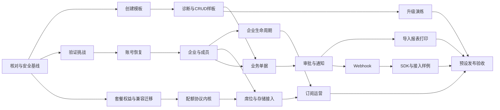

# Full.NET 企业应用与 SaaS 底座完善开发计划

> 执行方式：按仓库 AGENTS.md 逐切片推进，不自动创建工作树、派发代理、提交或推送。本文件负责新增能力和跨专项依赖；已有专项的实现步骤与进度继续在原计划维护。

### 2026-10-09 自有测试资源与迁移模板复用批次

- 本批基线 `42812adbe5280ba57464b5e63b6218b4bf13bd71`，任务快照 `owned-test-database-cleanup-20261009`，工作区 `Full.NET-printing-20261008-recovery`，分支 `codex/foundation-acceptance-20261003`。其他窗口的生成应用清理与样例文档改动不纳入本批；不修改生产代码、公共契约或发布策略。
- 临时库以本次运行成功建库的登记取得所有权，初始化后的授权失败/取消仍保留登记；复用容器只删除自有库及对应 MySQL 库级授权，保留其他运行、固定模板与全局复制授权。失败继续清理其余资源并聚合报告，成功项不重复删除。不扫描库名前缀接管历史资源，不声称能够回收进程崩溃后的未知库。
- 空库判定覆盖 SQL Server 用户对象、类型、schema、用户和 XML 等元数据，以及 MySQL 表、视图、routine 与 event，避免覆盖没有 journal 的历史库。MySQL 克隆改用真实建表 DDL，保留外键，复制数据后安装触发器并将视图引用绑定目标库；真实约束回归已获得 1/1 聚焦成功证据 `.tmp/owned-db-mysql-clone-fixed.log`，不外推为最终批次认证。
- 82 个标准全量恢复测试文件的 298 处初始化调用接入模板复用；损坏、目标迁移重放与原断言保留。首次安装、历史前缀和定制 Runner 不接入，不能以克隆代替被测迁移执行。共享夹具影响集包含完整 migrations 与双库 Smoke；Data 使用完整命名空间，避免 metadata 名称误选 Native AOT 与迁移类。
- 首轮合并会话错误采用迁移分片的 120 分钟上限，而且私有容器逐库删除后再销毁，造成重复清理。该轮实际中止：586 成功、2 个误选的 Linux Native 用例跳过、0 失败，退出码 3；589 项发现范围未完整完成，不能计整批通过。自有容器已正常移除，未清理其他窗口容器。证据 `.tmp/owned-db-final-concentrated.log`。
- 私有容器模式改为先关闭启动入口、等待在途建库/配置，再移除容器，全部成功才清空登记；失败保留登记且继续其他容器，启动锁防止移除期间重新启动。四项回归有效 RED 为 10 成功/4 失败，GREEN 为 14/14、零失败/跳过；最新 Release 构建零警告/错误。证据 `.tmp/owned-db-retirement-red.log`、`.tmp/owned-db-retirement-green.log`；最终源码只读复审未发现 P1/P2。
- 最新 `pnpm test:integration:tooling` 91/91（含工作区其他任务测试）及 `pnpm test:governance` 59/59，均零失败/跳过。此前工具套件中的其他任务生成应用用例因等待重型锁超过其 30 秒子进程预算失败，本轮在锁释放后复验成功，不把失败轮次计通过。证据 `.tmp/owned-db-tooling-retirement-final.log`、`.tmp/owned-db-governance-retirement-final.log`。
- 最终集中验收已经冻结源码：按快照推导 slice，将全量 migrations 覆盖的编号选择去重，实际 Data 39、migrations 516、Smoke 8，按 UID 合并为 561 项；分片总发现 1218，无遗漏/重复，仅为发现证据。使用正式资源锁、构建登记和输入校验，私有 SQL Server/MySQL 容器，保留发现数门禁，总执行预算 180 分钟。实际 `FULLNET_TESTCONTAINERS_REUSE=0 node .tmp/owned-db-final.mjs`，重启恢复后的日志 `.tmp/owned-db-final-after-reboot.log`；该会话于 22:13:18 主机再次重启时中断，没有最终 TRX、退出码或清理认证，不计通过。
- 22:12:31 RuntimeBroker 代表本机用户发起重启，22:13:18 开机；21:11 的验收、数据库交付助手及审批进度接续助手均丢失，原状态仅保存为 interrupted。恢复 Docker 后核对本任务 SQL Server/MySQL 两容器的精确 ID、会话标签与退出 255（OOMKilled=false），仅移除这两容器及 PID 21104/token 匹配的两锁，保留其他窗口资源。最终采用 `.tmp/owned-db-checkpoint.mjs` 分段集中执行同一冻结构建：Data/Smoke 47 项、迁移六段各 80 项及一段 34 项，八段按 UID 不重不漏覆盖 561。原生 UID 发现预检成功、Release 构建 13.13 秒零警告/错误，不计实际测试通过。每段须实际 exit 0、精确新鲜 TRX 全 Passed、输入/程序集一致与自有容器清理后才保存检查点；中断只重做未认证段，不伪造单轮 561 项通过。证据 `.tmp/owned-db-checkpoints/manifest.json` 与 `.tmp/owned-db-checkpoint-run.log`；八个执行段共 561 个不同用例全部通过，各段零失败/跳过且 exit 0，协调进程 exit 0；每段真实 TRX 的 UID 与计划精确相等，并集与正式重新发现的 561 个 UID 完全一致。累计测试时间 02:08:04.6750948，不含排队，不声称单轮 561/561。各段关联到实际测试 PID 的自有容器会话均已移除。冻结输入与 Release 产物交付前再次核对一致，证据为 .tmp/owned-db-checkpoints/manifest.json、各段 TRX、.tmp/owned-db-checkpoint-accepted.json 与 .tmp/owned-db-delivery.log。
- 2026-10-10 00:28 +08:00，首个迁移段实际 80/80、零失败/跳过、测试进程 exit 0，TRX 用时 20 分 45.586 秒；协调器因立即检查 Ryuk 尚未退出而 exit 1，不把该协调失败计为整批通过。Docker 事件确认两数据库先移除，Ryuk 于 00:28:49 移除，晚于检查约 4 秒。仅为忽略目录内的协调器增加最长 60 秒自有会话清理等待，持续残留或 Docker 查询失败仍拒绝；五项合成守卫 RED 2 失败/3 成功、GREEN 5/5，不加入真实 561 项。用冻结输入/程序集、实际新鲜 TRX 精确 UID、原进程资源回执与当前会话为空复核已完成段，恢复时累计 127 个不同用例、两段通过，避免重跑 80 项；其余范围继续执行。证据 .tmp/owned-db-checkpoint-recover.log、.tmp/owned-db-resource-settle-red.log、.tmp/owned-db-resource-settle-green.log 与原段 TRX，先前停止日志保留。
- 环境为 Windows、i7-12700H（14 核/20 线程）、Docker 20 CPU/约 19.3 GiB、MTP 两个 worker。本批没有完整前后计时对照，不承诺全套提速比例；不重复独立生成应用或 Native AOT 验收，F10 故障矩阵、补投状态与人工页面验收继续待完成，`Capacity-not-verified` 保持。本批本地验收通过后提交并推送指定开发分支；提交/推送与工作流快照见 .tmp/owned-db-delivery-result.json，不把运行中的 CI 计为成功。未合并、未发布。
- 18:00:35 主机重启，17:14 启动的 561 项会话及其交付助手均被中断，未生成最终 TRX，不能计通过；21:05 恢复时 Docker 未启动。恢复 Docker 后按精确容器 ID 与原 Testcontainers 会话标签核对并移除本任务两只已退出数据库容器，仅清理原 PID 41336、匹配 token 的工作区锁和重型锁，保留其他工作区锁与容器。旧日志和构建绑定备份保留；重新运行相同 561 项冻结范围，并在启动测试前固定构建记录 identity/output/digest，交付仅推送精确验收提交 SHA。

**Goal：** 将现有模块组合为可创建项目、可由企业自主使用、可运营 SaaS、可升级恢复的开发底座。

**Architecture：** 保持强化型模块化单体、API/Worker/Migrator 分离、Dapper 双库和 Host.Api Native AOT。复用 Identity、Tenancy、Organization、Payments 等数据所有者，不复制账号库，不为目录完整度增加业务项目。

**Tech Stack：** .NET 10、Dapper、自有事务/SQL 边界、SQL Server/MySQL、Vue、OpenAPI 客户端生成、Jobs、Files、Notifications、Outbox、Kubernetes/Helm；新增外部依赖必须在对应切片核对许可、维护状态与原生可行性。

## 1. 授权、状态与计划所有权

- 日期：2026-09-16；用户要求将八项补齐能力和已有模块收口重点写入文档并制定详细计划。
- 审查修订：补齐未注册受邀者入驻、存量权益迁移、F05/F08 无环依赖及版本化源码分发；仅完善计划，不改变实施状态。
- 设计依据：[总体规格 §24.1](../specs/2026-07-17-fullnet-architecture-design.md#241-企业应用与-saas-底座完善2026-09-16)、[产品能力队列](../../roadmap/adminnet-feature-parity.md#8-企业应用与-saas-底座完善队列2026-09-16)。
- 文档核对基线：`main` / `ccd12944d0a77d295d062bfccf7f985fcb7b1362`。按用户要求，工作区其他改动不作为本计划实施证据；开工时重新核对实际提交和相关实现。
- 状态（2026-09-22 核对）：F00 已有[基线核对](../../verification/2026-09-17-foundation-productization-f00-baseline.md)；F01—F16 已有部分模板、领域、API、Vue 和测试资产，企业与 SaaS 子集见[企业预设](../../verification/2026-09-17-enterprise-preset-closeout.md)、[业务接入](../../verification/2026-09-17-enterprise-business-integration-closeout.md)、[SaaS 预设](../../verification/2026-09-17-saas-preset-closeout.md)。F08b 席位编排与 `module-local-transaction-debt` 清债见 [F08b 收口](../../verification/2026-09-22-f08b-foundation-closeout.md)（`da77e74e` 及以后提交）。下方未勾选项表示整项验收未关闭，不代表没有实现。不得根据局部收口标题直接升级 Verified 或 SaaS Production-verified。
- 初版交付仅修改文档；2026-09-19 用户已授权按审查顺序继续实施：当前命名门禁 → 当前提交 CI/SSO 验收 → 安全修复清单 → 企业/SaaS 缺口 → 生产认证。生产启用、真实收费、批量通知、不可逆删除仍遵循对应授权与发布流程。
- 本文件是“底座完善”唯一活动总计划。OIDC、AI、现有安全修复等专项不被替代；只在其完成后消费证据。新增切片在本文展开，确需独立专项时先登记任务转移及唯一所有者，不能双处维护勾选状态。

### 2026-09-26 自主检查与首轮验收

- 授权：用户允许按本总计划自主检查、修改、补测试、本地快速验证、开发分支提交/推送及修复 GitHub Actions；合并与发布另行约定。
- 基线：`120d767ca3e70b68f95923fefcb0ad6378bcd0fb`，工作区干净；开发分支 `codex/foundation-acceptance-20260926`。远端 main 的历史结果不作为本基线通过证据。
- 首轮范围：F00 核对既有增量；优先关闭 F01/F15 的应用创建、升级安全与开发分支验收入口；用双库基础生命周期及企业样例验证已有能力。暂不改变产品政策、生产启用和真实支付渠道。
- 执行步骤：先为升级包摘要、路径、预设闭包、预览后修改与失败恢复建立可失败回归；再修复 `scripts/templates/upgrade-framework.mjs` 及必要辅助工具，同步模板打包；补齐 PR 的创建应用真实栈与受影响双库门禁；执行相关 Template/Contract/Governance 快速检查，独立只读复审后提交推送；按精确 SHA 等待 CI 终态并处理失败。
- 首轮远端反馈：`37ca424c` 的 API/Worker Native Actions 成功，主 CI 失败，尚不能关闭里程碑。失败暴露精简应用可选契约识别、并行模板构建初始化、租户履约服务生命周期及 MFA 迁移目录问题；分别补运行回归、串行模板验收、作用域装配检查与双库迁移重入测试。复审另发现 Workflow 三条变更路径在事务内读取租户权益，已移至事务前并用六个先失败的用例验证允许/拒绝路径，未新增事务债务豁免。
- 后续反馈：固定预设的历史共享迁移 203/206/207 在已核对全文摘要下按建表清单适配，未选表已存在时拒绝漂移，所选表缺失仍失败；完整闭包与无清单运行保持历史正文。代表性浏览器 CRUD 又发现首次 Development 播种早于本地租户创建，现补 Development 专属成员贡献者并覆盖首次与重跑。客户端保留数字模型、规范整数字符串转为安全整数，超出安全范围拒绝；申请单创建使用可信组织上下文头。上述修复在当前提交取得远端双库/浏览器证据前不关闭里程碑。
- `f1e23ee6` 的双库迁移 472 项全通过；受影响基础模块 290 项有 8 项失败。核对为精简测试宿主缺 Files 用量端口、MFA 校验错误状态码预期过时、商业重新激活用例漏开启已有策略。已补装配快速回归、稳定错误码断言与场景专属配置；未改变生产商业策略或去掉宿主依赖校验。
- `8894fb73` 的企业样例双库浏览器及客户端门禁通过，独立 Minimal 应用迁移后启动暴露产品装配缺陷：头像、租户 Logo 和文件配额服务强制依赖可选 Files Port。修正为带默认值的可选依赖；无 Files 时，媒体操作及文件用量对账在数据库/文件副作用前返回既有受控错误，席位对账保持可用，不能把缺失用量视为零。新增 16 项无数据库回归先全部因 DI 失败，修复后通过；保留完整 DI 验证。另隔离钉钉回执测试的环境变量，解决 Linux MethodLevel 并行清理造成的偶发失败。当前修复的独立应用真实栈与完整 CI 仍需按精确提交取得证据。
- `f2692b90` 完整迁移恢复在 90 分钟超时（467 通过、1 失败、未完成其余用例），失败指向 093 的同批次补列后回填编译。SQL Server 执行前仅在固定全文摘要下延迟编译两个回填语句，不改写历史 SQL 资源；MySQL 保持原路径，双库旧数据恢复继续必验。四项快速边界测试先 1 失败/3 通过，修复后连同前序兼容用例 22 项全通过。PR 将模块/Smoke 与两个互补双库迁移组并行执行，发现阶段验证迁移 UID 无遗漏/重叠；main 原完整迁移组按实际耗时保留 120 分钟预算。失败、跳过与未发现不能视为通过。
- `122cff25` 企业双库浏览器与客户端再次通过；独立应用越过 Files 装配后，发现当前会话授权缺 `IHttpContextAccessor`。认证入口现自行补齐该单例依赖，保留宿主覆盖与重复注册幂等；两场景先 1 失败/1 通过，修复后通过。PR 的原 `build-test` 检查名保留为汇总门禁，等待模块及两个迁移分组全部成功；失败、取消、跳过或缺失的迁移结果不得被独立模块成功掩盖。
- `93ef282f` 的独立应用 70 项、企业双库浏览器各 2 项、客户端、API/Worker Linux Native 均通过；双库迁移恢复 250/244 两组共 494 项全部通过，无跳过。Unit 3038、Compatibility 12、Architecture 230 项全部通过；受影响 Integration 295 项为 293 通过、2 失败。失败均为 Development 播种精确清单漏了开工基线已有的 `tenancy.entitlement_catalog_baseline`，实际 8 项、期望 7 项；Test Overlay 的旧清单也漏了同项。现共享显式 Baseline 清单，Overlay 仅追加自身条目，保留精确集合与 Succeeded 状态校验，并增加 Production 仅 Baseline 的审计断言。未改变运行时播种策略；修复后双库生命周期及其后置企业 API 验收仍待当前提交 CI。
- `2c10a5d2` 最终验收：主 CI、API Native、Worker Native 均为成功终态；播种双库生命周期、受影响模块、企业 API、四预设构建、Minimal 独立应用双库真实 CRUD、双库浏览器及迁移恢复门禁通过。首轮“创建应用、源码升级安全与代表性样例”切片关闭，证据与未验证项见[本轮交付报告](../../verification/2026-09-26-f01-created-app-real-stack-closeout.md)。后续文档提交仅同步事实，不改变已验收实现；F01/F15/F16 整项及 W1 不因此关闭。下一切片按 F02 核对既有诊断与生成器在新应用的真实业务 CRUD、跨租户拒绝和再生成保护。
- 验收：应用拥有的源码不被覆盖；损坏包、未知路径和本地定制拒绝写入；升级保留既定预设及成对迁移闭包；失败不丢原框架且恢复材料可定位；创建应用双库和受影响基础模块/样例有真实执行证据。
- 停止条件：需要新的业务政策、外部认证或发布决定，或恢复不能保留人工内容。未执行、跳过及生产等价验证继续保留未验证状态，不降低门禁。

### 2026-09-19 首批阻塞收口

- 基线：`main / 4ad8f0393ae0b0064fb55a63a4496cfe9b9141d2`；任务快照 `unfinished-closeout-20260919`。本节记录该基线上的未提交增量，不代表全计划完成。
- 命名：补齐 224/225/228 表列中文说明和目录覆盖，224/225 双库说明对齐；SQL Server 注释移出建表条件，支持表已创建但脚本未记账时补齐。228 索引使用两库一致的确定性压缩名称；223 固定动态 DDL 逐文件登记审查理由。迁移均首次进入本地基线提交，未执行已记账数据库升级；真实双库恢复仍待 CI。
- C01：修复 OIDC 关闭时旧会话切租户、Host 强撤服务无法装配。协议签发依赖保持按开关注册，OIDC 分支在任何数据库访问前检查完整依赖；历史授权撤销服务始终可用。关闭场景两项回归先失败，修复后通过，另补启用但依赖缺失时零数据库访问的失败关闭断言。
- F05/F08：邀请接受与配额预留/确认/释放改用 `ExecuteResultAsync`，修复后续 CAS 或确认失败仍提交前一条写入。五项真实事务协调器回归先复现提交错误，再验证回滚；不把此局部修复等同于跨模块事务拆分。
- 验证：聚焦 Unit 34/34、命名 32/32、SQL safety 5/5、OpenAPI 172/172、provisioner 37/37、AOT Architecture 73/73；API AOT analyzers 与 Integration Release 构建均为 0 警告/0 错误。集成分片按当前源码重新发现并验证无遗漏/重复后更新矩阵；发现数不是数据库执行通过数。
- 治理仍为 53/54：`module-local-transaction-debt.json` 的 RegisterAccount 与 AcceptTenantInvitation 两条债务尚未消除。第二条理由已纠正为实际的“事务内跨模块写入”，保持失败，不降低门禁。
- 远端核对：`a6d3d02e` 的 [Worker Native](https://github.com/yan041108/Full.NET/actions/runs/35164362025) 成功；[主 CI](https://github.com/yan041108/Full.NET/actions/runs/35164362020) 与 [API Native](https://github.com/yan041108/Full.NET/actions/runs/35164362019) 失败。当前基线及本轮增量没有远端通过证据。旧 E2E 编码错误已有修复与发现证据，仍需真实浏览器重跑。

### 2026-09-19 注册事务边界后续收口

- F04：Tenancy 活动租户权威读取移至 Identity 事务之前；事务内重新解析并核对政策版本/模式、注册方式版本/租户与邀请快照，目标变化时在消费挑战前拒绝。挑战消费和账号写入仍由 `ExecuteResultAsync` 统一提交或回滚。注册命令没有外层事务标记。
- 六项回归在旧实现全部失败；修复后连同邀请正常注册、租户变化、撤销共 9/9 通过。该切片只消除跨模块本地事务调用，不承诺租户在账号提交时仍处于活动状态的分布式原子保证。
- `module-local-transaction-debt.json` 已删除 RegisterAccount 条目，保留 AcceptTenantInvitation 席位写入债务；治理仍为 53/54，不降低门禁。
- 本轮验证：聚焦 Unit 43/43（含首批修复）、事务边界 Architecture 4/4、API Native AOT Architecture 73/73、命名 32/32、SQL safety 5/5；API AOT analyzers 0 警告/0 错误。单元发现数门槛随新增九例同步增加，不代表已执行完整单元套件。独立只读复审未发现新增阻断问题。
- 用户授权由代理决定是否提交：本切片与首批修复整理为本地提交；未推送，本提交的双库、浏览器和 Linux 原生执行仍待 GitHub Actions。

### 2026-09-19 配额恢复前置：安全重放

- F08a：先修正配额预留/确认/释放的重放语义，再建设跨模块恢复编排。相同完成终态重放只读返回当前用量，不重复改动计数；操作键绑定首次金额，Released、Expired 及过期 Reserved 不可作为新额度凭证；Confirmed 同金额预留可返回已有结果。
- 回归：首轮 11 例在旧实现 5 失败/6 通过，确认重复确认、重复释放、金额冲突、已释放和过期预留误成功。另补显式 Expired 的三种操作拒绝、Confirmed 金额冲突四例；双库共用 API 验证扩展原有测试，覆盖响应丢失后顺序重放与用量不重复变化。
- 发现恢复前置缺口：预留记录没有保存实际 MetricId/PeriodKey，完成时重新查 default 或当前月份；过期补偿可能指向错误周期，因此本轮仍拒绝过期未完成操作，不把安全重放等同于可恢复编排。
- 后续顺序：先持久化配额记录归属并处理历史预留回填/歧义，统一跨指标 OperationId 的寻址约束；再开放准确的过期释放；随后以 Identity 持久化操作状态及可靠事件/后台重试驱动席位预留、成员写入、确认、补偿和对账。必须覆盖跨月、重复投递、确认响应丢失、进程中断与邀请撤销竞争。
- 本轮验证：聚焦 Unit 22/22（新增重放 15 例及既有回滚/校验 7 例）、API Native AOT Architecture 73/73、SQL safety 5/5、Integration tooling 46/46；更新后的 Integration Release 构建与 API AOT analyzers 均为 0 警告/0 错误。独立只读审查未发现新增阻断问题。
- 本切片不移除 AcceptTenantInvitation 架构债务，治理保持 53/54，不提升 F08 或 SaaS 预设状态；双库实际执行待 CI。影响计划指向 integration-matrix、smoke、Tenancy；按用户授权整理本地提交，未推送。

### 2026-09-19 配额记录绑定与过期释放

- F08a：新增双库 229 前向迁移，为预留增加可空 MetricId；新预留在同一 Tenancy 事务记录实际配额度量标识。确认、释放和同向终态重放只查询 Id + TenantId + MetricCode 对应记录，不再随 default 或当前月份重新选取配额；Native AOT 映射同步增加可空 UUID 列。
- 兼容与历史数据：迁移不猜测回填旧记录、不更改用量，重复运行保留已绑定值。旧 NULL 记录不能复用或完成，保留计数等待权威业务事实对账；没有可靠归属证据时不得自动绑定或直接释放。绑定缺失或指向已不存在的记录时失败关闭。
- 已绑定且仍为 Reserved 的过期预留允许释放回原始配额记录；过期确认继续拒绝，Confirmed/Released 不允许反向转换。取消/并发失败仍使用结果感知事务，保持计数与预留终态一起回滚。
- 回归：旧实现三例全部失败，修复后扩展跨月、default 变化、终态重放和绑定记录缺失。双库共用 API 验证预留后新增 default 仍完成到原月记录；新增两库迁移恢复测试验证缺列重建、历史 NULL 保留、已有绑定保留及再次执行无迁移。
- 部署约束：先暂停配额及成员变更并排空旧 API/Worker，再运行迁移并统一切换新二进制；不能混跑仍按当前周期完成操作的旧版本。回退只保留新列/新数据且维持写入暂停，不能用旧代码继续确认/释放已绑定操作；历史归属修复需另行提供可审计工具和双库证据。
- 验证：聚焦 Unit 32/32（本切片新增 10 例）、API Native AOT Architecture 73/73、命名 32/32、SQL safety 5/5；API AOT analyzers 与 Integration Release 构建均为 0 警告/0 错误。Integration 分片发现 api-sqlserver 153、api-mysql 153、migrations 470、infrastructure 176、messaging-heavy 57，合计 1009，无遗漏/重复；这是发现证据，不是数据库运行证据。独立只读复审未发现新增阻断问题。
- 当前切片未实现后台扫描、跨指标操作键唯一性或 Identity 持久化编排，AcceptTenantInvitation 债务继续保留，治理仍为 53/54；未获得双库运行及 Linux 原生执行证据前不提升 F08/SaaS 状态。已按用户授权准备本地提交，未推送；CI 影响集为 integration-matrix、migrations、smoke、Tenancy。

### 2026-09-19 跨指标操作键精确寻址

- F08a：确认/释放请求新增可选 MetricCode，保持原单参数构造与 Deconstruct；现有 source-generated JSON 上下文自动覆盖新属性。提供指标时按 TenantId + MetricCode + OperationId 唯一查询，不存在时不回退。空白或超长指标在查询前拒绝。
- 旧调用兼容：省略或传 null 时，仅返回同租户操作键唯一的预留；自关联 NOT EXISTS 排除歧义行，返回既有 quota reservation not found 404，避免 QuerySingle 多行异常或任意选取。同操作键的其他租户不构成歧义。席位适配器固定传 identity.seats，减少对旧协议的依赖。
- 数据兼容：不改变数据库唯一键，不重写历史 OperationId，不新增迁移。精确寻址复用现有三列唯一索引，完成仍以已绑定的 MetricId 定位实际用量。旧请求查询时点后的并发新增不构成跨模块原子保证。
- 测试：首轮两条 sourcegen JSON/精确寻址回归在旧实现均失败；另补无效指标、无回退、席位适配器用例，共新增 12 例。双库共用 API 增加两个指标共用操作键、旧调用拒绝、精确确认/释放及同向重放。现有客户端导出 manifest 不含这些 quota 端点，本轮不扩大导出集合。
- 验证：聚焦 Unit 44/44、API Native AOT Architecture 73/73、OpenAPI 172/172、命名 32/32、SQL safety 5/5；AOT analyzers 与更新后 Integration Release 构建均为 0 警告/0 错误。独立只读复审未发现新增阻断问题；真实双库和 Linux 原生执行仍待 CI。
- 工具链补漏：本轮发现上一切片 229 未登记 migrationSelections，导致工具链 45/46；补上双库筛选并将参数化迁移测试拆为具名 SqlServer/MySql 入口后恢复 46/46，测试数量不变。
- 剩余：历史 NULL 绑定仍需有权威证据的对账与修复工具，未建设 Identity 持久化编排及后台补偿；AcceptTenantInvitation 债务继续保留，治理仍为 53/54，不提升 F08/SaaS 状态。按用户授权整理本地提交，未推送。

**下一切片（2026-09-19 记录，已由 2026-09-22 切片部分兑现）：** 完成历史归属对账，再消除 F05/F08 席位跨模块写事务；以持久化操作身份、业务权威状态、补偿和对账覆盖确认丢失/进程中断，不能仅把调用移出事务或删除债务条目。随后按当前提交执行双库恢复、OIDC/legacy 真实栈和 Linux 原生门禁。治理与环境证据未齐时，不提升企业/SaaS 预设状态。

### 2026-09-22 F08b 席位编排与 F08a 对账工具

- 基线：`main` / `da77e74e`（Wave 1 Lane C）；Spec [`2026-09-22-f08b-tenant-invitation-seat-orchestration.md`](../specs/2026-09-22-f08b-tenant-invitation-seat-orchestration.md)。
- F08b：`AcceptTenantInvitationService` 与 `TenantMemberProvisionService` 将 Tenancy 席位预留/确认/释放移出 Identity 本地事务；确认失败执行成员/邀请补偿；`module-local-transaction-debt.json` **entries: []**，治理 `capability-debt-sync` 与债务目录一致。
- F08a：历史 NULL `MetricId` 预留对账 API `POST /api/v1/tenancy/quota/reservations/reconcile-metric-ids`（`dryRun` 默认 true）；权限 `tenancy.tenant_quota.reconcile_metric_ids`。
- 验证：Unit `TenantInvitationRollbackTests`、Architecture 模块边界；双库 Integration 对账端点、邀请接受 real-stack 与 SaaS 预设升档仍属 Wave 2–3 门禁，本切片不单独提升 F08/SaaS 为 Verified。
- **下一切片（2026-09-22）：** F05 企业成员全链路双库/real-stack 验收；F12 SaaS 预设在席位编排与配额对账证据齐全后的门禁；持久化操作身份与 Outbox/Jobs 补偿仍按 §F08 正文未勾选项推进。

## 2. 能力、顺序与范围

### 2026-09-25 认证事件日志专项

新增[认证事件日志开发计划 AE01—AE06](2026-09-25-authentication-event-logs.md)，作为 Identity/安全运维收口项。复用现有 `fn_identity_auth_audit`，顺序为事件覆盖与契约 → 兼容迁移/可靠写入 → 认证及 SSO 采集 → 查询 API → Vue 页面 → 保留/导出与验收。F04 的密码/MFA 恢复事件与 SSO 专项共同提供事件来源；本专项负责统一展示及覆盖闭环。首条纵向切片已落地，状态为 Partial；完整事件矩阵与故障验证仍待完成。

| 能力 | 优先级 | 本计划任务 | 最小交付 | 不纳入首切片 |
| --- | --- | --- | --- | --- |
| B01 项目创建与升级工具链 | P0 | F01、F02、F15 | 空目录创建、模块预设、诊断、示例、版本升级演练 | 云端在线 IDE、插件市场、自动覆盖人工代码 |
| B02 企业开通与成员生命周期 | P0 | F05、F06 | 开通流程、邀请、成员管理、所有者交接、退出与停用 | 跨公司复杂 HR、通用组织主数据平台 |
| B03 套餐权益与统一配额 | P0 | F07、F08 | 套餐绑定、功能权益、席位/存储配额、原子预留和对账 | 全局计费引擎、按任意 SQL 动态定义权益 |
| B04 账号自助与恢复 | P0 | F03、F04 | 可配置注册、邮箱验证、密码/MFA 恢复、会话撤销 | 默认匿名开放企业注册、同时铺开所有短信渠道 |
| B05 SaaS 订阅运营 | P1 | F12 | 试用、续期、取消、到期策略、支付对账驱动权益 | 自动税务、复杂账务总账、任意币种自动换算 |
| B06 开放集成与 Webhook | P1 | F13、F14 | 注册事件、签名、投递重试/重放、接收样例、SDK | ESB、任意脚本集成、运行时扫描插件 |
| B07 业务接入标准样板 | P1 | F09、F10、F11 | 业务单据贯通附件、权限、审批、通知和数据交付 | 完整 ERP/CRM 产品、第二套审批引擎 |
| B08 发布升级恢复交付包 | P1，发布必需 | F15、F16 | 支持矩阵、发布清单、备份恢复、升级回退演练 | 未经证据承诺所有部署拓扑和容量 |

执行按依赖推进，不把 P0/P1 当成可绕过前置条件的排序。建议首次取一条纵向主线：F00 → F01 → F02；其后 F03 → F04 → F05 → F06。配额分为 F07 → F08a 协议内核，以及 F05 + F08a → F08b 业务接入，F08 仅在两部分均通过后关闭。F05 可在明确未启用配额的基础预设验收，限额/SaaS 预设必须等 F08b；不允许运行时故障降级为无限额。已有安全问题在每条受影响链路交付前收口。八项扩展不全部成为核心 1.0 阻塞项；SaaS 预设必须达到其自己的完整验收。


```mermaid
flowchart LR
  F00[核对与安全基线] --> F01[创建模板] --> F02[诊断与CRUD样板]
  F00 --> F03[验证挑战] --> F04[账号恢复]
  F04 --> F05[企业与成员] --> F06[企业生命周期]
  F00 --> F07[套餐权益与兼容迁移] --> F08a[配额协议内核]
  F08a --> F08b[席位与存储接入]
  F05 --> F08b
  F02 --> F09[业务单据]
  F05 --> F09
  F09 --> F10[审批与通知] --> F11[导入报表打印]
  F06 --> F12[订阅运营]
  F08b --> F12
  F10 --> F13[Webhook] --> F14[SDK与接入样例]
  F02 --> F15[升级演练]
  F11 --> F16[预设发布验收]
  F12 --> F16
  F14 --> F16
  F15 --> F16
```

## 3. 数据、契约与跨模块边界

1. Identity 拥有账号、验证挑战、认证会话、企业成员的登录/授权绑定；Organization 拥有部门、职位和组织隶属；Tenancy 拥有租户生命周期、套餐、权益与配额。F00 必须先映射现有表/Port，扩展原关系，不另造平行成员事实源。
2. Tenancy 拥有开通与订阅编排记录；Payments 继续拥有支付、退款和渠道事实。支付成功不直接修改另一模块表；可信业务事件推动订阅状态，按版本去重，失败可重放与对账。
3. 企业所有者表示租户内受保护职责，不是 Host 超级管理员；最后一名可管理成员和所有者交接使用 Identity 内原子校验，不绕过会话、租户和操作权限。
4. 功能权益决定租户可用功能，RBAC 决定当前人可执行操作，配额决定剩余使用量。有效调用须分别通过对应检查。业务权益不存入通用 Settings ConfigEntry；Settings 只承接展示偏好或明确的平台配置。
5. TenantMembership、Entitlement、QuotaReservation 等是本计划的领域概念，不承诺现有类同名。F00 在本文登记实际表、内部类型、消费者及方法签名后才开始相应编码；外部稳定契约先冻结，再生成客户端。
6. 配额预留与业务写入分属不同所有者时，不承诺一个本地事务原子完成。以稳定 OperationId、预留凭据、确认/释放和恢复对账组成协议；未知执行结果保留占用，不能到期直接释放并允许重复消耗。
7. 会话、成员状态、付费权益和硬配额的拒绝判断使用权威状态或已批准的强一致策略，不能依赖可能陈旧的 L1 授权。跨模块读取走最小 Port，写入走可靠事件/幂等工作流，事务内不调用其他模块 Port。
8. Vue 为唯一后台主线。普通业务 API 用 ProblemDetails；OIDC 端点沿用 ADR-0011 的协议例外。后台任务、导出、通知、Webhook 与 AI 均保留租户及数据权限边界。
9. 模块按真实消费者编译期装配，沿用现有 Composition 预设。新增可选模块只创建一个主项目；Contracts 拆分需要真实消费者证据，不为框架完整度预建空层。
10. 首版应用模板使用固定提交、带版本与内容摘要的源码分发包。生成应用在 `framework/fullnet/` 保存受管框架源码，在 `src/`、`ui/` 保存应用拥有的宿主/业务/界面；框架与应用所有权由 manifest 区分。现阶段不以尚未发布的 Full.NET NuGet/npm 包为前提，也不访问开发者原始仓库或任意最新分支。
11. 邀请制允许没有账号和会话的受邀者验证邀请并注册。邀请授权、目标邮箱验证、账号认证和成员激活是不同步骤；原有账号必须完成其原认证/MFA，不能通过邀请重置密码或绕过 MFA。账号/挑战/邀请/成员均由 Identity 原子维护，企业状态等跨模块约束仍走受控协作。
12. 权益强制执行前必须完成存量兼容清单、回填与切换门禁。既有部署默认保持明确的兼容阶段，新 SaaS 预设使用强制阶段并要求有效套餐；无绑定、状态读取失败与未知权益不能在强制阶段回退为兼容。

## 4. 文件与验证地图

以下新路径是实施目标，不表示文件已存在。实现任务按当时库存选择成对迁移编号，禁止预占或改写已应用迁移。测试类可按实际夹具收敛，但必须在本文记录最终入口，不能只有无调用者的断言辅助类。

| 任务 | 主要修改/新增位置 | 测试目标 |
| --- | --- | --- |
| F00 | 本计划；`docs/roadmap/capability-status.md`；既有专项执行记录 | 核对证据与实际入口，不新建形式化空测试 |
| F01–F02 | 新增 `templates/fullnet-app/.template.config/template.json`、模板内容与 `scripts/templates/verify-created-app.mjs`；复用 `src/Tools/Full.NET.CodeGeneration.Cli/`、`src/Composition/` | 新增 `tests/templates/created-app.test.mjs`、`tests/templates/template-options.test.mjs` |
| F01/F15 | 新增 `scripts/templates/build-source-bundle.mjs`、`templates/fullnet-app/framework-manifest.schema.json`；分发包内包含锁定来源、项目/包依赖及迁移清单，生成应用保存 `framework/fullnet/` 和 `framework-manifest.json` | 新增 `tests/templates/source-bundle.test.mjs`、`tests/templates/source-bundle-upgrade.test.mjs`，包含摘要损坏、外部路径、离线来源与人工冲突 |
| F03–F04 | 复用 `src/Modules/Full.NET.Modules.Notifications/Features/VerifyRecipientEndpoints/`；扩展 Identity 的 `Features/ManageRegistrationPolicy/`、新增 `Features/RegisterAccount/`、`Features/RecoverAccount/` | `tests/Full.NET.UnitTests/Identity/AccountRecoveryTests.cs`、`tests/Full.NET.IntegrationTests/Identity/AccountLifecycleAssertions.cs` |
| F03–F05 | Identity 新增 `Features/RegistrationInvitations/`，F04 提供一次性邀请/注册领域能力，F05 接管理与入驻入口；Notifications 新增 `Features/SendIdentityChallenge/` 的内部受控投递适配，复用现有邮件 Provider | `tests/Full.NET.IntegrationTests/Identity/InvitedRegistrationAssertions.cs`；覆盖无账号/无会话、已存在账号、撤销竞争及未入租户的收件人 |
| F05–F06 | Tenancy `Features/ProvisionTenant/`；Identity 新增 `Features/ManageTenantMembers/`、`Features/AcceptTenantInvitation/`；Organization 成员适配；Vue 新增 `TenantMembersView.vue`、`TenantOnboardingView.vue` | `tests/Full.NET.UnitTests/Identity/TenantMembershipTests.cs`、`tests/Full.NET.IntegrationTests/Identity/TenantMembershipAssertions.cs`、`tests/Full.NET.IntegrationTests/Api/TenantLifecycleAssertions.cs` |
| F07–F08 | Tenancy `Features/ManageHostTenantPackages/`；新增 `Features/ManageTenantEntitlements/`、`Features/ReserveTenantQuota/`；首个 Identity/Files 消费者 | `tests/Full.NET.UnitTests/Tenancy/TenantEntitlementTests.cs`、`TenantQuotaTests.cs`；`tests/Full.NET.IntegrationTests/Api/TenantEntitlementAssertions.cs`、`TenantQuotaAssertions.cs` |
| F09–F11 | 新增 `samples/enterprise-request/`；复用 Workflow、Files、Notifications、ImportExport、Reporting、Printing 模块及生成器 | `samples/enterprise-request/tests/`；`tests/e2e/admin-real-stack/tests/enterprise-request.spec.mjs` |
| F12 | Tenancy 新增 `Features/ManageTenantSubscriptions/`；Payments `Features/ManageOrders/`、`ManageRefunds/`、`ReceiveWeChatNotify/`；Vue 新增 `TenantSubscriptionView.vue` | `tests/Full.NET.UnitTests/Tenancy/TenantSubscriptionTests.cs`、`tests/Full.NET.IntegrationTests/Api/TenantSubscriptionAssertions.cs` |
| F13–F14 | 首个消费者出现时新增 `src/Modules/Full.NET.Modules.Webhooks/`；复用 Identity OpenAccess、Auditing、Outbox；新增 `samples/webhook-consumer/`；`packages/client-contracts/` | `tests/Full.NET.UnitTests/Webhooks/WebhookDeliveryTests.cs`、`tests/Full.NET.IntegrationTests/Api/WebhookDeliveryAssertions.cs`、样例契约测试 |
| F15–F16 | `deploy/helm/fullnet/`、`docs/operations/`、`docs/development/onboarding.md`、发布工作流；新增 `docs/operations/application-upgrade.md`、`docs/operations/application-recovery.md` | `tests/deployment/`；模板旧版本升级夹具；现有 Native API 与 Worker 外部进程夹具 |

数据任务共同涉及 `src/BuildingBlocks/Full.NET.Migrations.DbUp/Migrations/SqlServer/` 与 `MySql/`、模块 SQL/JSON/AOT 登记、`contracts/database/object-comments.json`、`contracts/architecture/global-sql-statements.json`。增加测试时同步 `eng/testing/test-matrix.json`；普通管理前端复用 `packages/client-contracts/` 的 OpenAPI 生成，不手写第二套 DTO。

## 5. 新能力实施任务

每项清单均为未执行。任务完成须记录提交、实际验证命令/结果、未验证项；实现与发布状态分开。后续执行单步按“失败场景 → 最小实现 → 聚焦验证 → 消费方接线 → 切片验收”推进。

### F00：冻结现状、已有计划分工和第一条交付基线

**依赖：** 无。**产出：** 可追踪的模块/入口/证据清单和首批实际接口签名。

- [ ] 核对八项能力在当前提交中的 Endpoint、表、Vue、测试和专项；对已实现内容只记录缺口，禁止重建。特别核对 Registration/OAuth/OIDC、通知验证码、ImportExport/Reporting 与 Payments。
- [ ] 将 §6 的 C01—C07 映射到原计划的具体未关闭任务及证据；文档冲突时记录“实现存在、验收待核”，不凭标题直接改为完成。
- [ ] 在本计划追加第一批切片的契约登记：所有者、调用方、请求/结果字段、错误码、精确权限、幂等键、并发版本及数据兼容策略。跨模块先证明现有 Port 不足再扩契约。
- [ ] 选择最小可发布预设及其真实验证范围；带已知安全/隔离问题的链路先修复，未选入的可选模块不使核心预设假通过。

**验收：** 每个新能力可定位到现有资产、增量和任务所有者；每个当前发布阻塞有关闭条件，未产生代码能力通过声明。

### F01：从空目录创建独立应用

**依赖：** F00。**消费：** Naming Profile、Composition 预设。**提供：** 基础管理、企业应用、SaaS 的可选择模板；未满足能力门禁的预设标为实验性且不默认启用。

- [ ] 先实现版本化源码包构建：固定源提交，登记每个受管文件摘要、框架版本、模块闭包、中央包版本、构建 props/targets、源生成器、迁移资源、CLI 与前端 workspace 依赖及锁文件。包不含 bin/obj、秘密、本机缓存、绝对路径或指向原仓库的链接；摘要不符拒绝实例化。
- [ ] 从现有静态注册清单产生所选预设的 Composition 投影及项目引用闭包，不把当前引用所有模块的 Composition 原样复制后仅关闭运行开关。登记哪些迁移/种子属于所选闭包及其历史依赖，禁止按名称过滤后静默跳过必要迁移。
- [ ] 建立模板参数负例：非法/保留 OwnerKey、未知模块、缺硬依赖、输出目录冲突均拒绝且零覆盖。
- [ ] 定义项目名、OwnerKey、SQL Server/MySQL、模块预设、前端和端口选项；冻结输出 manifest，秘密只生成占位配置。
- [ ] 模板包随附受管框架源码，以应用内部相对 ProjectReference 和 workspace 引用完成接线；初始化时复制的宿主/业务/界面骨架之后属于应用，不被框架升级器直接覆盖。NuGet/npm 第三方依赖仅从配置的源按锁定版本还原，Full.NET 自有代码与前端共享包来自分发包。
- [ ] 在不能访问原仓库、没有自有包缓存的干净环境，仅凭版本化模板包与声明的第三方依赖源创建两种数据库应用，执行还原/构建、迁移/引导、登录和一个管理读取；重复创建不覆盖用户文件。原生构建验证包内 analyzers/generators/迁移资源齐全；额外无网络还原只有在依赖预缓存条件明确时才要求。

**验收：** 新应用不依赖原仓库绝对路径；未选择模块没有意外运行依赖；首次运行说明与实际步骤一致。后续计划命令示例：`dotnet new fullnet-app --name Demo --owner-key demo --database mysql`，模板未登记前不可报告该命令可用。

### F02：环境诊断与生成一个真实 CRUD

**依赖：** F01。**提供：** 可复用的应用开发起点及受控诊断结果。

- [x] 对缺 SDK、错误数据库配置、遗漏模块依赖、未配置密钥建立诊断断言；输出机器码和修复指引，不泄露凭据。
- [x] 在现有 CLI 内扩展诊断入口，先只读检查，用户显式要求后才执行初始化；区分本地开发和生产配置。
- [x] 用现有生成器在新应用生成一个租户 CRUD，贯通数据库、后端、OpenAPI、Vue 和精确权限；开发者修改业务实现后再生成，证明人工文件不会丢失。
- [x] 完成从创建到首个 CRUD 的教程并实走；记录耗时与失败原因，性能目标由实测基线后制定，不虚称固定分钟数。

**验收：** 新应用的真实新增/编辑/查询和跨租户拒绝通过；生成器只更新其持有的产物。

2026-09-26 执行顺序（用户已授权自主检查与升级；基线 `264ea40d`，干净工作区）：

1. 诊断收口：以 `tests/Full.NET.UnitTests/CodeGeneration/DiagnoseCommandTests.cs` 复现未知 Profile、配置类型错误与目标工作区 SDK 选择缺口；修改 `src/Tools/Full.NET.CodeGeneration.Cli/CodeGenerationCli.cs` 与 `DiagnoseCommand.cs`，保持只读、脱敏、稳定机器码及非零失败语义。执行聚焦 Unit 与治理，更新 `docs/development/create-first-crud.md` 的真实入口和限制。
2. 生成接入：复用现有 Schema、工作区所有权与模块接入工具，在 `tests/templates/support/created-app-real-stack.mjs` 中增加独立应用生成路径；先检查宿主、Migrator、OpenAPI 和 Vue 的实际接入点，不复制官方模块或改写受管框架作为业务实现。
3. 真实验收：在双库新应用验证生成业务的新增/编辑/查询、精确权限、跨租户拒绝；保留人工业务文件及人工修改的受管文件冲突拒绝，二次生成不得损坏内容。重型验证由 GitHub Actions 执行，失败先定位再修复。
4. 教程与关闭：修正 `docs/development/create-first-crud.md` 与 `first-crud-from-template.md` 中仓库布局和独立应用布局混用的命令；只依据实际执行证据记录耗时与结果。诊断子集通过不代表整个 F02 关闭；SDK 缺失时不能承诺依靠尚未启动的 .NET CLI 自救。

停止条件：需要新的业务政策或发布决定、再生成不能保留人工内容、跨租户或权限拒绝缺失；不得放宽双库、冻结的 Layui 边界或 Native AOT 门禁。

诊断第一增量：合法 `--profile` 曾因默认值被当作已传参而全部返回 64；修复为解析后再应用默认值，并拒绝未知 Profile。SDK 检查改用目标工作区，类型错误输出脱敏 `DIAG_APPSETTINGS_INVALID`，取消继续传播，环境连接占位符不得视为已配置。回归先 11 项中 10 失败；入口修复后 10 通过、1 失败，精确复现生产环境变量占位符误报。审查追加 6 条回归，其中 inline 空白、ConnectionStrings 非对象及 Redis 秘密 bool/number 4 项先失败，再统一为空白/占位符拒绝与严格字符串类型。最终 CLI 聚焦 66 项、CodeGeneration/Realtime 414 项、治理 55 项通过，无跳过，Release 构建 0 警告/0 错误。Integration 1075 项仅为分片发现证据；独立 Minimal 双库应用现必验应用自带 CLI 的 SDK/工作区/预设/模块闭包及配置只读性，实际执行与远端门禁待此增量推送后验证。完整配置覆盖、SDK 版本兼容矩阵、UserSecrets 内容与独立生成业务链路仍待后续增量，不关闭 F02。

生成接入第一增量（基线 `0702cc54`）：内部模型已支持省略 Layui 路由，但 CLI JSON 读取器仍把路由与控制器字段标为 required，且同命名空间旧实现遮蔽共享路由接入器。读取器回归先 5 项中 4 失败；实际 CLI 回归先 3 项全部因空引用失败。三个字段改为可选并移除旧实现后，实际 CLI 3 项通过，覆盖 Vue 路由写入、重复执行幂等、无 Layui 输出或目录，以及缺少前提或聚合桥所有权时拒绝写盘。CodeGeneration/Realtime 422 项、治理 55 项全部通过，无跳过，Release 构建 0 警告/0 错误。未知字段拒绝及显式 Layui 控制器配对校验保留；未修改冻结客户端。诊断提交 `0702cc54` 的模板真实栈作业已成功，包含独立 Minimal 双库应用自带 CLI 与配置只读性检查；其余门禁与生成接入增量按精确 SHA 继续核对，不替代完整生成 CRUD 验收。

2026-09-26 授权接入修复计划（基线 `ee3461da`）：现有 `AuthorizationContributorIntegrationEditor` 把集合元素追加到类型外，且只凭一个权限标记跳过整条接入。先在 `tests/Full.NET.UnitTests/CodeGeneration/AuthorizationContributorIntegrationEditorTests.cs` 复现三个集合插入、重复幂等、部分标记与人工漂移、注释/字符串伪装及非标准集合拒绝；复用既有轻量 C# 词法分析确认唯一标准集合位置，保持手写元素并逐集合验证完整生成块，任何歧义保持原文返回失败。生成文件以独立小项目做实际编译实验，执行聚焦 Unit、治理及影响集规划后独立审查、提交推送。此增量不新增 CLI 命令、不改变权限作用域政策或数据库结构，不代表完整生成业务验收。

授权结构接入结果：首批 Unit 8 项先 7 失败/1 通过，修复集合内插入后通过；追加边界回归复现非标准重复声明，独立复审又复现“完整块藏入被丢弃的嵌套集合”伪幂等，现已要求生成块开始和结束均处于直属元素边界。新增 15 项回归覆盖标准插入、手写元素保留、两实体依次接入与各自幂等、CRLF、部分/重复/越界/人工漂移、字符串伪标记与不明确形态拒绝。旧追加方式的独立结构编译实验报 11 错误，实际编辑结果编译为 0 警告/0 错误；该实验使用最小类型定义，不替代实际授权目录或应用运行。

本地新鲜证据：`pnpm test:dotnet:unit -- --selection code-generation-realtime` 437 项通过，`pnpm test:aot:analyzers` 0 警告/0 错误，`pnpm test:dotnet:architecture -- --selection api-native-aot` 73 项通过，`pnpm test:governance` 55 项通过，均无跳过；`pnpm test:integration:partitions` 发现 1075 项，无遗漏或重复，不计为完整 Integration 通过。影响集规划基线为 `ee3461da`，目标 CodeGeneration。首次分析构建曾与测试构建争用 DLL 而失败，串行复验已通过；不将第一次失败计为成功。独立复审无剩余阻断，远端按新提交 SHA 核对。生成片段的权限作用域政策、CLI 授权接入、应用 Migrator、完整生成业务与宿主整条接入的并发/恢复仍未验收，不关闭 F02。

授权作用域增量（基线 `34ab3bcc`）：片段生成器原来对租户 CRUD 固定输出 Host 权限，违背 `TenantRequired` 数据上下文。新增 7 项 Unit；纠正测试样例中显式能力禁止的审计列后，正确 RED 为 3 失败/4 通过，覆盖两种实体能力格式的租户映射及旧 Host 块不允许静默改写。现六条权限共用 `TenantRequired → Tenant` 映射，`HostOnly/Global → Host` 保留现有最小授权范围，未改变精确权限码或官方模块贡献者。租户 CatalogProduct golden 仅两处作用域随实际输出更新；CodeGeneration/Realtime 444 项、治理 55 项通过，无跳过，独立复审无阻断。实际授权运行、CLI 贡献者接入和独立应用 CRUD 仍待 F02 全链验收。

作用域增量补充验证：`pnpm test:aot:analyzers` 0 警告/0 错误，`pnpm test:dotnet:architecture -- --selection api-native-aot` 73 项通过、无跳过；`pnpm test:integration:partitions` 发现 1075 项，无遗漏或重复，不作为完整 Integration 通过。影响集按基线 `34ab3bcc` 规划为 CodeGeneration 与 integration-matrix，重型双库及 Native 运行门禁交由新提交的 GitHub Actions，未取得终态前不升级 Verified。

2026-10-04 诊断环境文件增量（基线 `11941c21`）：数据库连接名、连接字符串和三个常见秘密键加入所选 API 配置目录的 `appsettings.Development.json` / `appsettings.Production.json` 覆盖；优先级为环境变量、Development User Secrets、环境 JSON、基础 JSON。显式空值或空集合叶键阻止基础凭据回退，父级空对象不删除较低优先级的子键；环境文件的 JSON、重复扁平键错误独立失败且不回显内容。首轮诊断 61 项中 11 失败，修复并扩展边界、处理独立复核发现的连接名大小写、空属性路径与连接名误填凭据回显问题后，73 项通过（复核新增 5 项均先失败）；Windows 全量 Unit 3920 通过、1 项 Linux FIFO 回归跳过，无失败。本地受影响 CodeGeneration MySQL Integration 13 项、治理 57 项与测试工具链 54 项通过，Release 构建 0 警告/0 错误；Integration 分片发现 1118 项无遗漏或重复，仅为发现证据。独立生成应用验收补充 API 同目录环境文件、错误根目录文件不误读、占位符拒绝、只读及脱敏断言。冻结预设检查保持基础配置；SDK 兼容矩阵与完整运行时配置诊断仍待收口，F02 不关闭。

2026-10-04 SDK 诊断增量（基线 `cd6dc447`）：实际目标工作区锁定本机 SDK 9.0.307 时，旧诊断输出 `DIAG_SDK_OK` 且退出 0；现增加稳定错误码 `DIAG_SDK_INCOMPATIBLE`，按当前分发包 `10.0.100 + latestFeature` 基线接受更高的 10.0 功能带，其他主/次版本与无效版本格式不自动认证为兼容。SDK 选择及预览版准入仍由目标工作区和父目录的 `global.json` 交给 .NET 解析；成功结果仅回显数字版本和预览状态，不回显任意后缀。首轮诊断矩阵 93 项中 15 失败，扩展到 95 项后全部通过；CodeGeneration/Realtime 781 项通过、无跳过，真实 SDK 9 场景已退出 1；受影响 MySQL Integration 13 项、治理 57 项与测试工具链 54 项通过，Release 构建 0 警告/0 错误，分片发现 1118 项无遗漏或重复，仅计发现证据。正常诊断测试工作区锁定当前 .NET 10 基线，只读断言比较执行前后的全部文件清单与内容。独立生成应用新增缺 SDK、旧 SDK 失败和配置只读断言；旧 SDK 场景仅在本机确已安装旧版时执行，本次本机具备 9.0.307。该检查不替代工作负载、实际构建及 Native AOT 工具链验收；完整运行时配置诊断仍待收口，F02 不关闭。

2026-10-04 数据库 Provider 诊断增量（基线 `359a7bf4`）：以真实 `AddFullNetDapper` 的 Options 绑定和校验对照 CLI，复现无效名称、未定义数字、布尔值与空字符串导致宿主拒绝但诊断退出 0 的缺口。新增 `DIAG_DATABASE_PROVIDER_INVALID`，按环境变量、Development User Secrets、所选环境 JSON、基础 JSON 取最终标量值；名称忽略大小写，数字 `0/1` 与运行时一致，缺省或 `null` 保留 SqlServer 默认值。工具不新增运行时数据依赖，不回显字段值；非空集合结构、Guid 存储模式、超时与完整 Options 启动验证仍保留待办。首轮诊断 114 项中 10 失败，修复后 114 项通过，再补 7 项数字字符串、枚举组合、空集合和数字边界；CodeGeneration/Realtime 最终 807 项通过、无跳过，Release 构建 0 警告/0 错误。本地受影响 MySQL Integration 13 项、治理 57 项、测试工具链 54 项与命名检查 33 项通过；分片发现 1118 项无遗漏或重复，仅为发现证据。独立生成应用新增错误 Provider 名称与未定义数字拒绝、合法数字接受、只读和脱敏断言；F02 不关闭。

2026-10-04 数据库超时与 Guid 模式诊断增量（基线 `a23d194c`）：对照真实 Dapper Options 绑定及启动校验，补齐 `CommandTimeoutSeconds` 正整数门禁、`MySqlGuidStorageMode` 枚举值与 Production 准入，新增 `DIAG_DATABASE_TIMEOUT_INVALID`、`DIAG_DATABASE_GUID_STORAGE_INVALID`。三项数据库标量配置共享环境变量、Development User Secrets、所选环境 JSON、基础 JSON 覆盖；Production 两库均需显式非 null 模式，MySQL 需 Binary16，SQL Server 显式 LegacyChar36 保持既有允许行为。运行时对照确认超时显式 null/空对象绑定为 0，只有缺省保留 30 秒；保留整数转换支持的三种十六进制前缀。校正此预期后新增 47 项中 26 项先失败；实施后新增测试全部通过，原有 5 项正常生产样例补齐显式模式，未放宽断言。最终 CodeGeneration/Realtime 854 项通过、无跳过，Release 构建 0 警告/0 错误；受影响 MySQL Integration 13 项、治理 57 项、工具链 54 项和命名 33 项通过，分片发现 1118 项无遗漏或重复，仅为发现证据。独立生成应用加入零超时、生产 MySQL 旧模式及环境 JSON 空值拒绝、合法十六进制超时与两库模式接受、配置只读断言。数据库运行时、默认值与迁移不变；连接串直配、非空集合结构和完整运行时配置诊断仍待收口，F02 不关闭。

2026-10-04 数据库连接直配诊断增量（基线 `96f4858b`）：对照真实 Dapper Options 的 PostConfigure，修正 CLI 忽略 `Database:ConnectionString` 的取值差异。直配先按环境变量、Development User Secrets、所选环境 JSON、基础 JSON 取最终值；只有 null、空串或空白才回退到命名连接，非空占位直配不能被有效命名连接掩盖。有效直配不再要求未使用的连接名；Production 仍忽略开发秘密，无效秘密文件保持独立错误。新增 34 项回归中 11 项先失败，修复后全部通过；最终 CodeGeneration/Realtime 888 项通过、无跳过，Release 构建 0 警告/0 错误，工具链 54 项、命名 33 项通过。独立生成应用加入 API 环境文件直配、未使用的空连接名、占位直配拒绝、环境直配覆盖及空白/null 回退、只读和脱敏断言。仅修改诊断，不改变数据库运行时或迁移；非空集合结构和完整运行时配置诊断仍待收口，F02 不关闭。

2026-10-04 数据库结构与连接名绑定诊断增量（基线 `1f5a533e`）：以真实 Dapper Options 对照五个数据库字段的非空对象、数组、显式 null 与子键共存，以及覆盖后的标量取值。非空结构只提供子键，不会覆盖同路径标量；未出现连接名标量时保留宿主默认名 fullnet，显式 null、空串或空白不恢复默认名。连接名改用与其他数据库字段一致的展平读取，保留宿主数字/布尔标量的字符串转换。运行时对照确认显式 null 即使存在子键也仍清空超时或连接名，未新增一律拒绝对象/数组的规则。校正测试前提并去除重复扁平键夹具错误后，44 项回归中 13 项先失败；修复后 44 项全部通过，最终 CodeGeneration/Realtime 932 项通过、无跳过，Release 构建 0 警告/0 错误，工具链 54 项、命名 33 项通过。独立应用新增五字段结构覆盖不抹除基础标量、基础连接名只有子键时使用默认名、显式 null 及 null 与子键共存拒绝、合法环境覆盖和数字连接名接受，并核对只读与脱敏。数据库运行时和迁移不变；这项验收限定于上述字段及已支持来源，完整宿主配置诊断和其余 F02 能力仍待收口，F02 不关闭。

2026-10-04 基础配置 JSON 诊断增量（基线 `61bea8f8`，快照 `f02-base-json-20261004`）：复用所选环境配置的 JSON 语法和展平路径校验，基础 appsettings 及独立应用根、API、已声明 Worker/Migrator 配置接受宿主支持的注释与尾逗号，按不区分大小写的展平路径拒绝冲突，包括扁平/嵌套键、数组索引及空属性名。坏基础文件不能由有效环境值掩盖，冻结应用及框架清单保持严格 JSON。新增 36 项回归以真实 .NET JSON 配置提供程序作对照；含既有相关样例的 44 项先有 31 项因诊断误拒绝/误放行失败，修复后 44 项全部通过。最终 CodeGeneration/Realtime 968 项通过、无跳过，Release 构建 0 警告/0 错误，工具链 54 项、命名 33 项通过。独立生成应用新增四处基础配置的语法接受、重复路径拒绝、只读与脱敏断言；冻结源码打包验收按提交运行并在交付报告记录。此增量不证明任意配置形态或完整宿主加载能力，不改变数据库运行时、迁移或冻结清单格式；F02 与 Capacity-not-verified 保持未关闭。

2026-10-04 基础命名连接展平诊断增量（基线 `9c020615`，快照 `f02-base-named-connection-20261004`）：基础命名连接改用数据库选项已有的展平读取，补齐扁平键、大小写路径、嵌套连接名、数组索引及合法空属性名子路径；根空属性名不映射到正常路径。按实际 JSON 配置顺序处理标量后空对象/数组覆盖，非空子键不抹除同路径标量。环境变量、Development User Secrets、所选环境文件优先级不变；JSON null/空白阻止基础凭据回退，移除环境变量恢复基础值，Production 不读取开发秘密。保留已有基础凭据字段类型检查，数字/布尔命名凭据不计为已配置。新增 29 项回归先有 13 项因 CLI 漏读或错误保留基础值失败，真实配置提供程序/Dapper Options 对照均符合预期；修复后 29 项全部通过，最终 CodeGeneration/Realtime 997 项通过、无跳过，Release 构建 0 警告/0 错误，工具链 54 项、命名 33 项通过。独立生成应用新增基础扁平/大小写/嵌套路径读取、空集合清空后环境覆盖、环境 JSON 显式 null 拒绝及只读/脱敏断言；冻结源码包验收按提交执行并在交付报告记录。未改变数据库运行时或迁移；诊断仍限定于已支持字段和配置形态，不认证任意结构、地址可达或连接串语法，F02 与 Capacity-not-verified 保持未关闭。

2026-10-04 基础秘密展平诊断增量（基线 `5c1aedbf`，快照 `f02-base-secret-paths-20261004`）：三个常见 Redis/SM2 秘密键改用既有展平读取，补齐基础扁平键和大小写变体；未声明键不强制存在，显式 null、空白及标量后空集合覆盖按占位处理，非空子键不抹除标量。保留已有嵌套基础秘密字段类型校验，扁平非文本值不能计为有效凭据；高优先级覆盖与 Production 不读开发秘密的边界不变。新增 33 项回归以真实 JSON 配置提供程序的路径存在性、值及覆盖作对照，分别核对三个键与诊断计数；先修正测试变量命名触发的 MSTest 分析器错误，再确认旧 CLI 15 项因漏报失败，修复后 33 项全部通过。最终 CodeGeneration/Realtime 1030 项通过、无跳过，Release 构建 0 警告/0 错误，工具链 54 项、命名 33 项通过。独立生成应用新增基础扁平占位/有效值/null、空集合覆盖、环境修复和只读/脱敏断言；冻结源码包按提交验收并在交付报告记录。此增量不修改缓存、实时或密码学运行时，不验证 Redis 可达性和 SM2 密钥格式，完整宿主配置诊断、其他 F02 能力及 Capacity-not-verified 保持待办。

2026-10-04 独立应用基础档案展平增量（基线 `db4c2713`，快照 `f02-standalone-profile-paths-20261004`）：根、API、已声明 Worker/Migrator 的基础预设与 Provider 检查，以及 Worker 健康端口检查，原来只按固定大小写的嵌套路径读取；合法扁平或大小写别名会被误拒绝，标量后空集合覆盖则可能漏报漂移。复用既有展平读取，保留嵌套字符串类型校验、只读和脱敏；冻结档案仍只核对基础配置，不以环境覆盖修复漂移。新增 54 项回归与真实 JSON 配置提供程序取值对照，旧实现 31 项失败，修复后 54 项全部通过；受影响 CodeGeneration/Realtime 1084 项、工具链 54 项、命名 33 项通过，均无跳过，Release 构建 0 警告/0 错误。独立生成应用新增四处基础文件的扁平/大小写路径与空集合漂移断言，按冻结提交执行，并在交付报告记录实际集成、治理与整包结果。本增量不改变宿主运行时、生成文件所有权或双库迁移，完整配置诊断、F02 其余验收与 Capacity-not-verified 保持待办。

2026-10-04 分段对象配置增量（基线 `b8309522`，快照 `f02-repeated-json-sections-20261004`）：基础配置及独立应用基础档案诊断原来将 JSON 转为 JsonNode，无法表示同名对象声明不同子键的合法配置。改为直接读取 JsonDocument，保留原始片段和声明顺序；按原有精确嵌套路径逐段执行类型约束，最终字段取值仍使用展平读取。冻结清单继续严格解析，真实重复标量路径、扁平/嵌套与数组索引冲突仍拒绝。新增 36 项回归以实际 JSON 配置提供程序及 Dapper Options 对照；先修正新增测试的字符串写法和一处夹具路径冲突，再确认旧实现 29 项行为失败，修复后 36 项全部通过。最终 CodeGeneration/Realtime 1120 项、工具链 54 项、命名 33 项通过，均无跳过，Release 构建 0 警告/0 错误；本轮集成、治理及冻结生成应用结果在交付报告记录。独立应用新增四处基础文件的分段对象、空集合、只读和脱敏断言，不改变宿主加载、模块选择、生成所有权或双库迁移。完整配置诊断、F02 其余验收和 Capacity-not-verified 保持待办。

2026-10-04 模块配置声明提示增量（基线 `02be5ee5`，快照 `f02-module-presence-paths-20261004`）：`CheckModulesSection` 原先只看精确嵌套路径，遗漏合法扁平键和大小写别名，空集合覆盖 Preset 后仍保留旧提示，重复 Enabled 的空父节点则错误掩盖已声明子键。保留原有嵌套字段类型检查，声明提示改按原始配置叶键与最终 Preset 标量判断；不修改宿主模块选择、Options、依赖闭包或环境覆盖。新增 27 项回归使用真实 JSON 配置提供程序对照，旧实现 16 项行为失败；修复后首次 25 项通过、2 项因 SDK 子进程检测失败，原样复跑 27 项全部通过、零跳过。最终 CodeGeneration/Realtime 1147 项、工具链 54 项、命名 33 项均通过且零跳过，Release 构建 0 警告/0 错误；本轮集成、治理及冻结生成应用结果在交付报告记录。独立应用追加 API 扁平/大小写模块提示和空 Preset 覆盖的断言，核对文件只读与输出脱敏。`DIAG_MODULES_OK` 仅表示基础配置有声明，不认证合法模块、完整依赖闭包或宿主启动。F02 其余验收及 Capacity-not-verified 保持待办。

2026-10-04 接入编译退出码诊断增量（基线 `4de32fca`，快照 `f02-build-exit-diagnostics-20261004`）：上一轮独立应用首次人工文件编译失败只留下通用提示，原样复跑通过但具体原因仍未定位。检查发现模块与 Composition 编译把非零构建退出码丢弃，且非编译器输出不能直接公开。保留真实进程执行、取消、候选编译、临时目录清理和已有编译诊断，只在没有编译诊断时附加区域设置无关的数字退出码；不新增重试或把失败视为成功。18 项确定性回归先确认 10 项因缺少退出码失败、8 项控制用例通过，修复后 18 项全部通过、零跳过；最终 CodeGeneration/Realtime 1165 项、相关 Node 门禁 35 项、工具链 54 项、命名 33 项均通过且零跳过，Release 构建 0 警告/0 错误。独立应用在模块入口接线之后用缺失 SDK 对照真实构建退出码，验证模块与 Composition 两条命令的固定诊断、文件保留与 SDK 配置恢复；实际集成、治理及冻结应用验收在交付报告记录。此增量补齐可观测证据，不宣称修复上一轮未重现的进程故障，完整配置诊断、F02 其余验收与 Capacity-not-verified 保持待办。

2026-10-04 SDK 探测取消清理增量（基线 `a662d71c`，快照 `f02-sdk-probe-cancellation-20261004`）：SDK 探测在输出读取或等待退出被取消后直接抛出，释放 Process 对象不会终止其进程。先提取保持原行为的实际探测读取边界，用本测试启动的真实系统进程复现；4 项回归中立即取消和等待中取消两项都因进程仍存活失败，正常退出与非零退出两项通过。修复只在调用方取消时终止本次拥有的进程树、等待退出，保留原始取消异常与令牌；目标工作区 SDK 选择、版本判断、固定脱敏提示和退出码不变。修复后 4 项全部通过，CodeGeneration/Realtime 1169 项、工具链 54 项、命名 33 项均通过且零跳过，Release 构建 0 警告/0 错误。受影响集成、治理及最新冻结生成应用验收结果在交付报告记录；冻结应用验证正常探测与生成链路，取消清理由真实进程 Unit 证明，不把它扩展为终端信号处理、SDK 超时或所有平台的实测证据。F02 其余验收、前轮未定位的构建稳定性及 Capacity-not-verified 保持待办。

2026-10-04 命名连接环境前缀增量（基线 `49a40079`，快照 `f02-connection-env-prefix-20261004`）：诊断仅替换环境键中的双下划线，遗漏默认配置提供程序的 `MYSQLCONNSTR_`、`SQLCONNSTR_`、`SQLAZURECONNSTR_`、`CUSTOMCONNSTR_` 特殊映射，导致有效环境连接被漏认，或高优先级占位值被低优先级 JSON/User Secrets 掩盖。以真实环境提供程序和 Dapper Options 绑定对照，首轮 24 项中 20 项失败、4 项直配控制用例通过；加入自动 ProviderName 元数据及多别名保护后，32 项中 27 项失败、5 项通过。修复在既有环境读取处识别四种前缀、规范化名称并保持默认元数据；不改变 Database:Provider、非空直配优先、脱敏或任一环境占位别名拒绝放行的边界。修复后 32 项全部通过，最终 CodeGeneration/Realtime 1201 项、工具链 54 项、命名 33 项均通过且零跳过，Release 构建 0 警告/0 错误。独立包验收增加四种前缀的有效值、占位值、多别名及直配优先场景，过滤本机对应环境变量后对照文件字节；受影响集成、治理及新冻结应用结果在交付报告记录。不认证连接串语法、网络可达或数据库行为，F02 其余验收、前轮未定位构建故障与 Capacity-not-verified 保持待办。

2026-10-04 SDK 探测等待上限增量（基线 `f1f58b22`，快照 `f02-sdk-probe-timeout-20261004`）：未传入取消令牌时，卡住的 `dotnet --version` 原来可无限阻塞诊断。增加启动后 30 秒等待上限，覆盖退出与两个输出管道；超时取消读取、回收仍存活的本次探测进程树，返回固定脱敏错误码 `code_generation.sdk.probe_timeout`，调用方取消继续优先并保留原始令牌。清理耗时另计，父进程已退出时不保证回收已脱离的子进程，不改变 SDK 选择、版本基线或终端信号处理。初始 10 项回归中 4 项因缺少超时失败、6 项控制用例通过；首次修复后 10 项通过。复核再用父进程已退出、有限四秒子进程持有管道的实际夹具确认收尾等待仍耗时约 4.048 秒，补充取消读取后最终 11 项全部通过、零跳过，Release 构建 0 警告/0 错误；最终 CodeGeneration/Realtime 1208 项、工具链 54 项、命名 33 项全部通过且零跳过。首轮新增夹具曾因与测试集并行构建锁住 DLL、以及 Windows 嵌套引号无效而未形成有效行为证据，已改为串行构建与无嵌套引号夹具并清理自有进程。相关测试集、集成、治理与新冻结应用结果在交付报告记录；独立应用覆盖正常 SDK 与生成链路，受控进程回归覆盖短上限的阻塞/部分输出/取消边界，不宣称冻结应用实测卡住 SDK 的完整 30 秒。完整配置诊断、F02 其余验收、前轮未定位构建故障和 Capacity-not-verified 保持待办。

2026-10-04 模块引用大小写诊断增量（基线 `d13b906d`，快照 `f02-module-reference-case-20261004`）：独立应用静态闭包检查总是使用忽略大小写的路径集合，Linux 的错误目录/文件名引用及大小写不同的另一项目会被误认成所选模块。五项真实文件与 CLI 回归在 Windows 旧实现全部通过；Linux 旧实现三项行为失败、两个正常斜杠/反斜杠控制用例通过。比较改为 Windows 忽略大小写、其他平台精确大小写，项目存在性、路径规范化及固定机器码保持原行为。修复后 Windows/Linux 专项各五项全部通过，相关 CodeGeneration/Realtime 1213 项、工具链 54 项、命名 33 项均通过且零跳过，Release 构建 0 警告/0 错误。冻结生成应用追加正常引用及目录/文件名大小写变体的实际 CLI 断言，检查配置只读、脱敏与引用恢复后的受管文件摘要；集成、治理及新冻结应用结果在交付报告记录。不宣称处理 MSBuild 条件、任意文件系统大小写设置或完整运行时依赖闭包；F02 其余验收、前轮未定位构建故障、Node shell 调用警告及 Capacity-not-verified 保持待办。

2026-10-04 独立应用 pnpm 启动增量（基线 `5f7bd3e5`，快照 `f02-pnpm-process-20261004`）：打包应用与 Vue 验收在 Windows 使用 `shell:true` 加参数数组，Node 24.12 的 `--throw-deprecation` 实际触发 `DEP0190` 并退出 1。集中固定 pnpm 参数的启动边界：Windows 先拒绝空白、展开及 shell 控制语法，再使用无参数数组的完整命令；Unix 继续无 shell 的参数数组调用。不屏蔽弃用警告、不改变 pnpm 命令、锁文件策略与退出码。真实子进程覆盖本机 pnpm、四组验收参数、带空格工作目录及失败退出；Node 24.21 Linux 容器补充四组参数边界。相关契约、治理及新冻结应用结果在交付报告记录。本轮仅收口这两处验收入口的调用方式，不宣称仓库其他 shell 调用已迁移；F02 其余验收、前轮未定位构建故障及 Capacity-not-verified 保持待办。

2026-10-04 生成页面租户切换同步增量（基线 `e7027466`，快照 `f02-browser-route-race-20261004`）：Windows 本地真实栈首轮 SQL Server 用例通过、MySQL 用例在仅创建权限账号点击产品菜单后停留首页，整组 1/2、零跳过，不能计为双库通过。新鲜报告确认登录、租户上下文与导航响应均为 200；切换页在发布上下文后才跳转首页，原验收仅等待标签，产品导航可能被迟到的首页跳转覆盖。受控 Chromium 回归先 2 项失败、1 项控制用例通过；补充首页落地等待后三项全部通过，错误路由仍拒绝，不直接跳转产品页、不放宽产品路由和权限断言。该修改仅同步验收脚本，双库真实链路需按修复后的提交重新取得本地证据，再决定生成 CRUD 子项关闭；F02 整项、前轮未定位构建故障与 Capacity-not-verified 保持待办。

修复提交 `10a9c78a` 的后续本地重跑使用 `DOTNET_PROCESSOR_COUNT=2`、串行双库及弃用警告失败模式，整体 0/2、零跳过、退出 1：SQL Server 在 Migrator 播种阶段抛出 `OutOfMemoryException`，MySQL 在模块构建的 `GenerateDepsFile` 阶段抛出相同异常，未进入本轮浏览器终验。此前 Git 也曾报告 1 MiB 分配失败；Windows 虚拟内存提交余量约 1–2 GiB，测试自有进程与容器已正常清理。保留原始两轮结果，不反复在资源不足时重跑，不据受控三项通过或此前 SQL Server 通过关闭双库生成 CRUD 子项。教程已提供当前本地入口并明确禁止使用旧报告补齐失败阶段；资源恢复后继续按同一源码范围实测。

2026-10-04 生成 CRUD 子项本地验收收口（源码 `d976a1d59ce25154c49a7ad4e74e9a5b150f9a89`，代码修复 `10a9c78a`；二者仅有三份文档差异）：资源恢复后的首次启动在测试文件级退出，未进入双库；TAP 诊断重跑发现 Docker 引擎已停止，两库均在容器启动阶段失败，整体 0/2、零跳过、退出 1。Docker CLI 确认管道不存在，使用 `docker desktop start --timeout 45` 启动本地引擎后，Testcontainers 连接探针通过。仅在环境状态确实恢复后重跑，不修改测试或降低门禁。

最终在 Windows x64、Node 24.12.0、.NET 10.0.401、SQL Server 2022 CU14、MySQL 8.4 与 Redis 7.4 上设置 `FULLNET_RUN_TEMPLATE_REAL_STACK=1`、`DOTNET_PROCESSOR_COUNT=2`，执行 `node --throw-deprecation --test --test-concurrency=1 --test-reporter=tap tests/templates/created-app-real-stack.test.mjs`，2/2 通过、零失败、零跳过、退出 0，总耗时 1267051.2854 ms；SQL Server 715501.3215 ms、MySQL 549625.2024 ms。两份冻结清单确认同一源码；每库五类普通账号浏览器报告均为本次新结果且 completed=true，贯通生成 CRUD、精确权限、跨租户拒绝、运行时 OpenAPI 与 Vue。模块人工扩展、六受管产物冲突拒绝及 Vue 再生成保护通过；真实数据库升级、重复迁移、部分 DDL 状态恢复、旧数据保留和新旧请求兼容通过。每库留存 77 份本次 JSON 报告，完整日志及冻结清单位于 `.tmp/f02-browser-route-race-docker-restored*`；测试自有进程、容器和临时应用已清理。同一源码的主 CI、API Native AOT 与 Worker Native AOT 均成功，CI 作为补充回归证据。依本地验收规则关闭上述生成 CRUD 子项；诊断完整覆盖及教程逐步实走仍待收口，F02 整项、历史未定位编译故障和 Capacity-not-verified 保持待办。此次计时仅为该双库功能验收，不是容量或产品开发耗时承诺。

2026-10-04 教程入口实走增量（基线 `70d8a163`，修复 `0957ee6232cd4ccebf3f90847d77955675baa4d3`）：新建应用实际执行教程的 `pnpm run diagnose:development` 返回 `ERR_PNPM_NO_SCRIPT`；模板虽声明脚本，组包复制冻结工作区 `package.json` 时覆盖了声明。不能直接改写包内前端骨架，否则创建器摘要门禁正确拒绝。现于包完整性验证后、应用发布前，在应用暂存目录叠加两个固定诊断入口；包、受管框架、工作区配置及锁文件保持，已有应用须显式采纳自有脚本。真实组包与验证创建器回归先因新应用缺入口失败，修复后相关四组 25/25、零跳过；另有根脚本篡改拒绝用例，不放宽摘要检查。新冻结 SQL Server / Minimal 应用实走开发与生产诊断、预览、生成、重复和冲突六条 CLI：退出码依次 0/1/0/0/0/2，14 产物、人工文件、配置与框架摘要均符合预期，合计 40.214 秒，仅为六条命令范围。教程补齐可复制的应用创建参数与 Schema，并统一独立应用 CLI 路径；完整诊断、第五步后的接入/迁移/运行教程、F02 整项及 Capacity-not-verified 继续待办。原始新应用及结果保留 `.tmp/f02-tutorial-walk-0957ee62/`，首次失败与回归日志保留 `.tmp/f02-tutorial-*.log`。

2026-10-05 教程后端接入实走增量（基线 `ddded109531d98d85a17bc759a43586d40a3b9dd`，快照 `f02-tutorial-host-20261005`）：续用源码 `0957ee62` 的独立 SQL Server / Minimal 应用，补齐教程自有 Catalog 项目、模块入口、逐阶段目标、静态授权贡献者与完整 Host 目标，直接从本文代码块创建文件并执行。初次验收脚本误假定 Worker 有自有 Program.cs，读取失败且未执行命令；按实际链接入口更正后，规划退出 0，但旧教程 `Missing/Ready` 状态断言失败。源码枚举与真实输出一致为 `ChangeRequired/Satisfied/ManualReview/Blocked`，据此修正文档，不改 CLI 或放宽门禁。最终六条文档命令加一次人工注释保护复跑全部退出 0，实走和文件核对 128.338 秒：规划不写盘，六模块产物生成，模块/API Release 编译各 0 警告/0 错误，Composition 单次引用/注册，贡献者四项 Tenant 权限、一导航、三操作与人工权限保持。重复接入及人工注释复跑保持源码字节，应用配置、根生成草稿与全部受管框架摘要不变。结果保留 `.tmp/f02-tutorial-host-0957ee62-run3/`，先前失败日志保留，不将其计为通过。本轮仅三份文档及忽略目录中的教程演练材料；未启动该应用数据库、API 监听、Worker 或浏览器，未验证 HTTP 或 Native AOT。教程 Vue、显式业务迁移与运行、完整配置诊断及 F02 整项继续待办；生成 CRUD 子项状态不变，Capacity-not-verified 保持，未合并/发布。

2026-10-05 教程 Vue 接入实走增量（基线 `d8844e3ba578ea3f592512cf8ca386a0f919e447`，快照 `f02-tutorial-vue-20261005`）：续用源码 `0957ee62` 的独立应用，在已接后端的基础上补齐静态业务 OpenAPI 的专属客户端输出与空公开操作清单、共享包导出、三 Vue 文件安全采纳、本地导航三元组和不带授权 Contributor 字段的逐阶段路由目标。直接从文档代码块创建文件与执行，七条生成/接入/依赖/构建命令全部退出 0；连同 PowerShell 采纳与额外保护复核共 13 次进程，已有目标拒绝退出 1、生成源冲突退出 2、其余退出 0，均符合预期，实走与文件核对 69.813 秒。四客户端文件/五操作、三 Vue 文件、路由重复不漂移、客户端零漂移、共享包编译、Vue 类型检查与生产构建通过。编译后的导航目录接受正确三元组，组件键/路由名/路径分别错误均拒绝；14 根生成产物重复保持，人工页面注释、后端与配置、锁文件及全部受管框架摘要保持。随包导航测试 3/3，Vue 导航与路由守卫测试 8/8，均零失败/跳过、退出 0，单独计时 1.04 秒与 33.70 秒。安装沿用既有脚本审批策略，未修改依赖/锁文件或审批脚本。本轮仅三份文档和忽略目录中的演练应用，不改生成器或框架行为；结果保留 `.tmp/f02-tutorial-vue-0957ee62/`，测试日志保留 `.tmp/f02-tutorial-vue-*-navigation-tests.log`。尚未启动此应用数据库、API 监听、Worker 或浏览器，静态 OpenAPI 未与当前运行 API 比较，不能把构建/导航测试标为页面 Verified。显式业务迁移与运行教程、完整诊断及 F02 整项继续待办；生成 CRUD 子项状态不变，Capacity-not-verified 保持，未合并/发布。

2026-10-05 教程业务迁移实走增量（基线 `49d86a9846bb5607040854d8464b2920ad2043ae`，快照 `f02-tutorial-migration-20261005`）：续用源码 `0957ee62` 的独立应用，补齐第六步的双库草稿安全采纳、固定资源与记账名称、应用自有迁移包装器、DI 注册及进程配置恢复脚本。仅连接与 Development 环境会被 Identity 签名启动校验阻断；启用开发临时密钥后，双库仍在 009 维护门禁退出 1，框架已记账 8 条、业务表和管理员行均为零。按真实约束补齐可销毁空库所需配置，不改框架门禁或生成 SQL。首次采纳退出 0，重复目标拒绝退出 1且字节保持，应用 Migrator Release 编译 0 警告/0 错误。首轮探针因 SQL Server 元数据排序规则冲突失败，第二轮因 MySQL DISTINCT 的排序列限制失败；仅修正验证查询，失败材料保留，不计通过。

最终 Windows x64、Node 24.12.0、.NET SDK 10.0.401/运行时 10.0.12、DOTNET_PROCESSOR_COUNT=2，串行 SQL Server 2022 CU14 与 MySQL 8.4 自有临时库完整实走退出 0：26 次进程核对，两个不存在数据库的路径各按预期退出 1、其余退出 0；每库首次框架 99/业务 1，重复 0/0，六列与两个索引符合草稿、默认不播种。业务记账撤销后，SQL Server 补回索引、MySQL 保持原子 DDL，恢复各为 0/1，再复跑 0/0；一条样本的名称和版本 7保持。成功与失败均恢复 15 项进程配置，失败不改写原数据库，源码/配置/草稿与受管框架摘要保持，自有容器已清理。完整双库耗时 156.387 秒，SQL Server 65.692 秒、MySQL 87.677 秒，含容器启动/清理、不含采纳/编译和先前失败；结果 `.tmp/f02-tutorial-migration-0957ee62-run3/`、采纳 `.tmp/f02-tutorial-migration-0957ee62/`。本轮仅三份文档及忽略目录中的演练材料；未验证此教程应用的 Development 播种、API 监听/运行 OpenAPI、Worker、账号或浏览器，未报告完整迁移分片、全量 Unit/Integration、生成应用 Native AOT 或容量通过。教程运行和完整诊断继续待办，F02 仅生成 CRUD 子项关闭，Capacity-not-verified 保持，未合并/发布。

2026-10-05 教程运行与子项收口（基线 `762182ca75d5e2343ca36fc7f625347862a01a31`，快照 `f02-tutorial-runtime-20261005`）：第七步补齐 Development 的显式播种、应用 API 构建、仅进程级启动配置及 Vue 入口。API 子进程前清除 Bootstrap 密码和迁移维护标识，恢复调用进程 28 项配置，拒绝覆盖已有日志。首轮 SQL Server 已播种且 API 已监听，但调用进程退出后验证器仍被继承的输出管道阻塞；停止已登记 API 后调用返回，随后 readiness 失败。本轮失败保留，不将其计通过；仅将启动调用输出改为独立文件，不改 API 或绕过 readiness。

最终 `node --throw-deprecation .tmp/f02-tutorial-runtime-walk.mjs` 完整双库退出 0，Windows x64、Node 24.12.0、.NET SDK 10.0.401/运行时 10.0.12、DOTNET_PROCESSOR_COUNT=2，SQL Server 2022 CU14、MySQL 8.4、Redis 7.4串行实走：Development 首次/重复、一名管理员与一个 local 租户、重复 Bootstrap 不重置已有密码通过；API live/ready 均 200，五操作运行 OpenAPI 子集匹配。两库各五种普通账号真实 Vue 登录、租户切换、导航/路由/按钮精确权限、创建/更新/删除及持久化、删除键盘取消/确认与生成页/弹窗自动无障碍审计通过；十份浏览器报告 completed=true。每库十条匿名/Host 拒绝、11 条租户业务请求及两次版本冲突、20 条跨租户业务请求及六次外租户未找到通过，样本保持并清理。应用源码、配置与框架摘要保持，仅清理本次自有进程/容器，端口释放通过。完整运行 307.201 秒（SQL Server 119.143、MySQL 151.797 秒，另含端口/摘要核对），API Release 编译另计 35.70 秒、0 警告/0 错误；不含先前失败。结果 `.tmp/f02-tutorial-runtime-0957ee62-run2/`，首轮失败 `.tmp/f02-tutorial-runtime-0957ee62/`。

同一源码 `0957ee62` 的保留应用已完成前四步、后端/Vue 接线与人工再生成保护、双库迁移恢复及本轮运行；逐阶段实际命令与范围见教程，组合证据 `.tmp/f02-tutorial-composite-0957ee62.json`。依此关闭教程子项；不是同一临时数据库或单次从空目录连续全量重跑，不承诺固定分钟数。MySQL 仅为同一 SQL Server 档案应用的进程覆盖实走；此前生成 CRUD 子项的独立双库档案验收保持。完整配置诊断的两项仍待办，F02 整项未关闭；教程应用 Worker、Native AOT、完整 Unit/Integration、容量未据此通过，Capacity-not-verified 保持，未合并/发布。

2026-10-05 Identity 签名配置诊断（基线 `805b49c730cfa290df8015c307910e39383180b2`，快照 `f02-identity-signing-diagnose-20261005`，行为提交 `00086ce936aae47765777300e4355526fcf785b0`）：对照真实 `IdentityOptionsValidator` 发现 CLI 未检查活动签名配置，独立应用可在 Development 诊断退出 0 后因缺签名密钥无法启动。补齐缺失/占位活动 KeyId、公私钥、KeyId 精确大小写、Development 临时密钥提示与 Production 禁用；两个开关不能绑定为布尔值时明确报错。仍只读、不生成密钥、不回显 KeyId 或凭据，不引入 Identity 运行时依赖；配置项齐全不认证 PEM 格式、密钥配对或完整 Identity Options。

新回归先以正确最低发现门槛得到 27/27 有效 RED；首轮门槛误填 28 的结果另保留，不计通过。扩展至 36 项后，显式 JSON null/空对象布尔绑定两项 RED、其余 34 通过；区分缺键与显式 null 后收口。最终 Windows x64、Node 24.12.0、pnpm 10.26.0、.NET SDK 10.0.401/运行时 10.0.12、DOTNET_PROCESSOR_COUNT=2，`pnpm test:dotnet:unit -- --selection code-generation-realtime` 1249/1249、零失败/跳过、退出 0，Release 构建 31.59 秒、0 警告/0 错误，测试 137.808 秒。覆盖基础/环境 JSON、Development User Secrets 与环境变量、空父节点不抹除子键、生产不读取开发秘密、拼写覆盖、只读与脱敏；已有数据库诊断测试显式关闭无关令牌端点，签名准入由独立真实 Options 对照集覆盖。

影响集选择 CodeGeneration，未缩小范围。首轮复用历史 SQL Server 容器恢复大量历史测试库时 OOMKilled=true、exit137，随后握手失败；停止已失效的自有测试进程，保留失败日志，不计通过。改用 `FULLNET_TESTCONTAINERS_REUSE=0 pnpm test:slice -- --snapshot f02-identity-signing-diagnose-20261005`，新 SQL Server 2022 CU14/MySQL 8.0.46 临时容器完整运行 CodeGeneration 41/41、零失败/跳过、退出 0；Release 构建 12.08 秒、0 警告/0 错误，测试 547.121 秒。新容器由测试生命周期清理；未删除历史数据库或修改运行时/SQL。日志及独立保存的 TRX 为 `.tmp/f02-identity-signing-integration-fresh.log`、`.tmp/f02-identity-signing-integration-fresh.trx`，首轮 `.tmp/f02-identity-signing-integration.log`。

从行为提交冻结源码包，各新建 SQL Server 与 MySQL 独立档案应用。`node --throw-deprecation .tmp/f02-signing-created-apps.mjs` 完整退出 0、233.989 秒，两应用各七次随包 `pnpm run diagnose:<profile>` 的预期退出码均通过：开发缺密钥 warning/临时密钥 warning、生产缺密钥 error/临时密钥即使关闭令牌端点仍 error、合成完整配置 ok/空私钥 error/关闭端点 ok。两份档案 Provider 已核对，源码/配置及受管框架摘要保持，输出无合成 KeyId/凭据；未连接数据库、启动 API 或以合成 PEM 认证密码学有效性。结果 `.tmp/f02-signing-apps-00086ce9/result.json`，原七步教程应用继续冻结 `0957ee62`，未替换其受管框架。治理 57/57、零失败/跳过、退出 0；完成前核对任务 diff、分支及干净提交工作区。仅关闭本轮签名配置前提切片，F02 前两项与整项继续待办；未报告全量 Unit/Integration、生成应用 Worker/Native AOT 或容量通过，Capacity-not-verified 保持，未合并/发布。

2026-10-05 OIDC 签名前提与标量绑定诊断（基线 `79ed168cc8f4b5feba64a1b4ae9a57f2c9fac93a`，快照 `f02-identity-signing-structure-20261005`，行为提交 `71a5897198ca98a23c5811c4a8cedd3ebc89744d`）：OIDC 默认关闭，启用后使用独立活动签名配置，JWT 密钥与临时签名不能替代；补齐开发缺失 warning、生产缺失 error、独立临时签名准入、KeyId 精确拼写、公私钥完整性及布尔绑定错误诊断。仍只读、不生成或回显密钥，不认证 PEM、Issuer、客户端、加密选项或完整 OIDC 启动；没有改变 Identity 运行时、授权或数据库行为。

先前把 JSON 空签名字典/空条目等同于手工构造 Options=null 的假设被真实 ConfigurationBuilder 与 Validator 否定，纠正预期后保留 16 个绑定对照；这轮初始 12 个失败不计为产品缺陷 RED。OIDC 有效 RED 为 65 项中 13 失败/52 通过，失败均为缺少诊断项。继续核对标量 KeyId 时另建 8 项：真实配置提供程序把 JSON 布尔值转换为 `True/False`，CLI 使用小写原文，导致大小写敏感匹配与运行时相反；真实绑定断言通过、8 项诊断断言全部失败。将标量文本转换改为与配置提供程序一致后 8/8 通过。最终该签名测试类共 85 项，涵盖四层来源、拼写覆盖、生产忽略开发秘密、关闭边界、null 集合、只读与脱敏。

Windows x64、Node 24.12.0、pnpm 10.26.0、.NET SDK 10.0.401/运行时 10.0.12、DOTNET_PROCESSOR_COUNT=2：`pnpm test:dotnet:unit -- --selection code-generation-realtime` 1298/1298、零失败/跳过、退出 0，Release 构建 14.95 秒、0 警告/0 错误，测试 189.067 秒；日志 `.tmp/f02-oidc-signing-unit-final.log`。不替代全量 Unit。

上一 SHA `79ed168c` 的 ci/template-created-app-real-stack 为 456 项中 455 通过/1 失败，失败在模板打包用例预期 Production 诊断返回 0，却只配置数据库与常见秘密、遗漏签名准入；同 SHA 的 API/Worker Native 工作流成功。本地以已冻结应用复现签发启用且缺密钥退出 1、关闭签发退出 0。打包测试现清除继承的 Identity 环境覆盖，显式关闭此连接/秘密矩阵无关的 JWT/OIDC；另验证重新启用 JWT 后缺密钥仍退出 1，不放宽产品检查。行为提交冻结包执行 `node --throw-deprecation --test --test-concurrency=1 --test-reporter=tap tests/templates/packaged-app.test.mjs`，完整用例 1/1、零失败/跳过、退出 0，总计 935.756 秒，包含 Minimal 诊断、CRUD/客户端/Vue 接线与构建、其他三个预设 API/Worker/Migrator 构建。失败原始日志 `.tmp/f02-79ed-ci-failed.log`，本地打包日志 `.tmp/f02-oidc-packaged-app.log`；不把本地 1 项外推为当前 SHA 全部 Actions 已通过。

从同一行为提交各新建 SQL Server/MySQL 独立 Minimal 档案应用，`node --throw-deprecation .tmp/f02-oidc-created-apps.mjs` 退出 0、547.902 秒。每份随包 CLI 11 次，共 22 次预期退出码通过：开发/生产缺签名、JWT 临时签名不能替代、开发/生产 OIDC 临时签名、合成完整配置、活动 KeyId 大小写、关闭 OIDC、非法布尔开关，以及环境 JSON 的布尔 KeyId 正反例。每次诊断源码/配置摘要不变，受管框架摘要保持，输出无合成 KeyId/凭据；结果 `.tmp/f02-oidc-apps-71a58971/result.json`。未连接数据库、启动 API 或认证合成 PEM 的密码学有效性，旧七步教程应用继续冻结 `0957ee62`。

最终标量修正后的双库影响集仍为完整 CodeGeneration 41 项。与模板编译并行的一轮 37 通过/4 失败，失败全部在 `ModuleIntegrationCompilationTests` 扫描全局临时目录 `fullnet-codegen-module-build-*` 的清理断言，受到另一进程创建/删除目录影响；编译与其余断言通过。失败日志/TRX 保留 `.tmp/f02-oidc-signing-integration-concurrent.*`，不计通过。改用本进程独立 TEMP/TMP 目录、`FULLNET_TESTCONTAINERS_REUSE=0 pnpm test:slice -- --snapshot f02-identity-signing-structure-20261005`，新 SQL Server 2022 CU14/MySQL 8.0.46 临时容器完整 41/41、零失败/跳过、退出 0，TRX 同样确认 41 executed/passed、0 failed/notExecuted；Release 构建 69.79 秒、0 警告/0 错误，测试 550.272 秒。日志/独立 TRX 为 `.tmp/f02-oidc-signing-integration-isolated.*`；未删改目录断言、未缩小影响集。治理 57/57、零失败/跳过、退出 0；交付前核对任务 diff、分支与工作区。

仅收口本轮 OIDC 签名前提与标量一致性切片；完整运行时配置与只读诊断前两项继续待办，F02 整项未关闭。生成应用 Worker 运行、Native AOT、全量 Unit/Integration 与容量未据此通过，Capacity-not-verified 保持，未合并/发布。

2026-10-05 OIDC Issuer/加密配置诊断（基线 `b860a6986de72a0926e363901db99298c877102a`，快照 `f02-oidc-options-diagnose-20261005`，行为提交 `f495e28e19e3c9747f67011ffb89aa0a539d7e71`）：以真实 `IdentityOidcOptionsValidator` 对照，签名配置齐全时无效 Issuer 或非空错误加密配置仍被 CLI 放行。启用 OIDC 后，补齐无用户凭据的 HTTP(S) 绝对地址检查，以及可选 `EncryptionKeyBase64` 的 Base64 格式和恰好 32 字节长度检查；缺失/无效 Issuer、非空无效加密配置在两 Profile 均 error。空加密配置和关闭 OIDC 的既有语义保留，不增加必填策略。检查不访问 Issuer、不生成/回显密钥，解码使用固定大小缓冲区并在结束时清除；未改变 Identity 运行时、注册客户端、授权或数据库。

首轮有效 RED：签名类共 106 项中新增 21 项诊断断言失败、旧 85 项通过，真实配置绑定与 Validator 对照全部符合预期；修复后 106/106。再扩展 26 项四层配置来源、空值遮蔽较低层、关闭边界与生产忽略开发秘密，共新增 47 项、该类 132 项。最终 Windows x64、Node 24.12.0、pnpm 10.26.0、.NET SDK 10.0.401/运行时 10.0.12、DOTNET_PROCESSOR_COUNT=2，`pnpm test:dotnet:unit -- --selection code-generation-realtime` 1345/1345、零失败/跳过、退出 0，Release 构建 27.79 秒、0 警告/0 错误，测试 193.062 秒；覆盖 null/空白/string/bool/number、URI 协议及 userinfo、31/32/33 字节、Base64 内部空白、来源覆盖、只读与明文/编码秘密脱敏。原始日志 `.tmp/f02-oidc-options-red.log`、`.tmp/f02-oidc-options-green.log` 和 `.tmp/f02-oidc-options-unit.log`。

同一行为提交冻结包各新建 SQL Server/MySQL Minimal 档案，`node --throw-deprecation .tmp/f02-oidc-options-created-apps.mjs` 退出 0、402.737 秒，两份随包 CLI 各 10 次、共 20 次退出码符合预期：合法地址与可选空加密、开发缺 Issuer、生产地址含凭据、不支持协议、Base64 格式/长度错误、32 字节正确配置、关闭边界，以及 API 环境 JSON 配置和空 Issuer 覆盖。每次诊断源码/配置摘要不变，受管框架摘要保持，输出无合成凭据或编码密钥；结果 `.tmp/f02-oidc-options-apps-f495e28e/result.json`。未连接数据库、启动 API、验证真实 PEM 或完整协议密码学；旧教程应用继续冻结 `0957ee62`，未替换受管框架。

影响集为完整 CodeGeneration 41 项，独立 TEMP/TMP、新 SQL Server 2022 CU14/MySQL 8.0.46 临时容器执行 `FULLNET_TESTCONTAINERS_REUSE=0 pnpm test:slice -- --snapshot f02-oidc-options-diagnose-20261005`，41/41、零失败/跳过、退出 0，独立 TRX 确认 41 executed/passed、0 failed/notExecuted；Release 构建 69.64 秒、0 警告/0 错误，测试 502.933 秒。日志/TRX 为 `.tmp/f02-oidc-options-integration.*`；未缩小影响集。治理 57/57、零失败/跳过、退出 0，交付前核对任务 diff、分支与工作区。上一 SHA `b860a698` 的 ci（37228691781，包括先前失败的 template-created-app-real-stack）与 Worker Native 工作流已成功，API Native 最后核对仍在运行，不能外推为新 SHA 结果。

Issuer/加密配置 ok 仅表示格式与长度符合现有 Validator，不认证地址可达性、密钥强度/共享、客户端注册、实际 PEM 或完整协议启动。仅收口本轮配置前提切片，F02 前两项与整项仍待办；本轮未重跑完整打包、全量 Unit/Integration、生成应用 Worker 运行/Native AOT 或容量，Capacity-not-verified 保持，未合并/发布。

2026-10-05 OIDC 客户端诊断增量（基线 `60a3ac87f338f025e2da0ebed815dcb9715bf0c4`，快照 `f02-oidc-clients-diagnose-20261005`，行为源码 `f9468aa6db59e0b7a92a92e58cc5f896398daa46`）：已启用 OIDC 的 CLI 原来只检查签名、Issuer 与可选加密配置，遗漏宿主已有的客户端注册前提。新增 `DIAG_OIDC_CLIENTS_INVALID` / `DIAG_OIDC_CLIENTS_CONFIGURED`，只读检查客户端非空标识、Ordinal 唯一性、必填授权回调与可选退出回调；使用现有 HTTP(S)、无通配符/用户凭据/片段、Ordinal URI 比较和尾斜线去重规则，仍允许查询参数。四层来源逐叶覆盖、空父节点保留低层子键、关闭 OIDC 与生产忽略开发秘密保持；输出不回显 ClientId、URI 或 ClientSecret，不联系地址，不改变认证运行时或依赖。

真实配置 Binder 与 `IdentityOidcOptionsValidator` 对照的首轮 RED 为 167 项中 35 失败/132 通过，失败均为缺失客户端诊断，修复后 167/167。追加 24 条来源、空父/叶覆盖、关闭边界、null/标量/对象数组与可选布尔绑定回归后，59 项中 2 失败/57 通过，定位到字符串数组忽略不可构造对象、可选布尔转换失败会使整个客户端被忽略；修正后回归均纳入最终通过集。本轮新增 59 项，该类最终 191 项；`pnpm test:dotnet:unit -- --selection code-generation-realtime` 1404/1404、零失败/跳过、退出 0，Release 构建 0 警告/0 错误，构建 13.73 秒、测试 178.420 秒，日志 `.tmp/f02-oidc-clients-{red,green,boundaries,unit}.log`。矩阵登记新增测试并将 CodeGeneration/Realtime 下限收口为当前实际发现数，不外推全量 Unit。

两份全新 Minimal SQL Server/MySQL 应用冻结上述行为提交，以实际随包 `pnpm run diagnose:<profile>` 各执行 14 场景，共 28 次符合预期退出码，运行器退出 0、545.942 秒。覆盖缺客户端、完整环境配置、空/重复 ClientId、Ordinal 大小写、通配符/凭据/片段、尾斜线重复、HTTP 查询参数、退出回调、关闭 OIDC，以及 API 同目录环境 JSON 扁平/大小写配置和空标识覆盖。每次诊断前后源码/配置摘要一致，全部受管框架摘要保持，输出地址、标识与秘密脱敏；结果 `.tmp/f02-oidc-clients-apps-f9468aa6/result.json`、运行器 `.tmp/f02-oidc-clients-created-apps.mjs`、日志 `.tmp/f02-oidc-clients-created-apps.log`。仅验证声明的双 Provider 应用及 CLI，没有连接其数据库或启动协议宿主。

`FULLNET_TESTCONTAINERS_REUSE=0 pnpm test:slice -- --snapshot f02-oidc-clients-diagnose-20261005` 按完整影响集执行 CodeGeneration 与 integration-matrix：SQL Server 2022 CU14/MySQL 8.0.46 新临时容器，独立 TEMP/TMP；41/41、零失败/跳过、退出 0，Release 构建 0 警告/0 错误，构建 109.06 秒、测试 495.180 秒。独立读取复制 TRX 确认 total/executed/passed 均 41，failed/notExecuted 为 0，日志与 TRX `.tmp/f02-oidc-clients-integration.*`。分片发现 1118 项无遗漏或重复，仅计发现核对；`pnpm test:integration:tooling` 54/54、治理 57/57 均零失败/跳过、退出 0。最终记录变更再经治理与 diff 检查后交付，没有缩小双库影响集。

远端基线 `60a3ac87` 的主 CI `37230951674` 与 Worker Native `37230951691` 在本轮读取时均终态 success，API Native `37230951673` 仍 in_progress，不把基线结果外推为本轮提交。客户端诊断仅认证已覆盖的配置前提，不认证客户端秘密、其他选项、地址可达性、真实 PEM、完整协议或多实例共享；完整运行时模块选择与依赖诊断仍待收口，F02 前两项及整项保持待办，既有 CRUD/教程子项保持。本轮没有重跑完整打包、全量 Unit/Integration、应用 Worker 运行、Native AOT 或容量验证，`Capacity-not-verified` 保持；未合并、未发布。

2026-10-05 模块预设诊断增量（基线 `b1794056b68fe0e8930516deaec9c805499c3a0a`，快照 `f02-module-preset-diagnose-20261005`，行为源码 `4da79c92080739d41e9b5297520c7a5f2e6e204d`）：在保留的 `f9468aa6` 独立应用上，未知环境 Preset 仍被旧 CLI 以 `DIAG_MODULES_OK` 和退出 0 放行，源码/配置摘要保持且输出脱敏；复现结果 `.tmp/f02-module-preset-repro-result.json`。新增 `DIAG_MODULE_PRESET_INVALID` / `DIAG_MODULE_PRESET_CONFIGURED`，按真实最终配置检查 Full、Minimal、Platform、Content、Saas、Enterprise 名称；忽略大小写但不忽略空白。只有缺键保留 Full 默认值，显式 null/空白/空集合不恢复默认；环境变量、Development User Secrets、API 同目录环境 JSON、基础 JSON 逐叶覆盖，Production 不读取开发秘密。显式 Enabled 覆盖 Preset，空父节点不删除既有低层子键；不新增 CLI 对 Composition 的生产依赖，不回显配置值或修改宿主解析。

真实 Binder 与 `FullNetModuleSelection.ResolveEnabledNames` 对照首轮 RED 38 项中 34 失败/4 显式列表控制通过，失败为缺失新增预设诊断，修复后 38/38。补来源优先级、空 Enabled 父节点及全部运行时预设常量约束至 45 项，源码 `c5f8d0d6` 的 Unit 1449/1449 通过。最终核对追加五种 Enabled 标量形状，11 条列表对照中 4 失败/7 通过：非空字符串、空白、布尔和数字不能绑定数组，旧判断错误跳过仍生效的 Preset；仅子键或空字符串数组标记可以绑定列表。按 Binder 修正后共新增 50 项。扩展后的首轮完整 Unit 1453 通过/1 失败、零跳过，已有数据库模式正例因 SDK 探测返回 DIAG_SDK_MISSING 失败，预设检查通过；保留 `unit-sdk-failure.log`，不计通过。源码/断言未改，以处理器计数 1（Unit Workers=1）重新执行 `pnpm test:dotnet:unit -- --selection code-generation-realtime`：1454/1454、零失败/跳过、退出 0，Release 构建 0 警告/0 错误，构建 00:00:33.80、测试 4m 23s 757ms；日志 `.tmp/f02-module-preset-{red,green,scalar-red,unit}.log`，首版 Unit 留存 `unit-c5f8d0d6.log`。既有 27 条声明测试仅按独立预设错误调整退出状态，声明机器码保持；矩阵下限登记新增项，不外推全量 Unit。

两份全新 Minimal SQL Server/MySQL 应用冻结上述最终行为提交，以实际随包 `pnpm run diagnose:<profile>` 各执行 14 场景，共 28 次符合预期退出码，运行器退出 0、425.593 秒。覆盖基础 Minimal、环境未知/空白/空值、混合大小写、Platform/Content 名称、API 同目录环境 JSON null/布尔/空值、有效环境覆盖无效文件、显式核心 Enabled 列表覆盖未知 Preset，以及非空 Enabled 标量与空字符串数组标记；Platform/Content 场景只核对名称，不认证该 Minimal 应用具备相应模块。每次调用源码/配置摘要一致，全部受管框架摘要保持，输出脱敏；结果 `.tmp/mp-4da79c92/result.json`、运行器 `.tmp/f02-module-preset-created-apps.mjs`、日志 `.tmp/f02-module-preset-created-apps.log`。首版 `c5f8d0d6` 应用的 24 次调用留存于 `.tmp/mp-c5f8d0d6/result.json`。早期两轮分别因运行器误假定 Production JSON 已存在（ENOENT）及本机 Windows 可执行路径过长停止，修正可选文件恢复并改用短目录重建；保留 `created-apps-initial.log`、`created-apps-longpath.log`，失败轮不计通过。仅运行诊断，没有连接应用数据库或启动宿主。

`FULLNET_TESTCONTAINERS_REUSE=0 pnpm test:slice -- --snapshot f02-module-preset-diagnose-20261005` 按完整 CodeGeneration 与 integration-matrix 影响集执行，SQL Server 2022 CU14/MySQL 8.0.46 新临时容器，独立 TEMP/TMP。首版 `c5f8d0d6` 与应用诊断并行时 40/41、零跳过，Composition 编译负例子构建退出 -1073741502，未产生预期诊断；保留 `integration-initial.log/.trx`，不计通过。应用结束后相同首版代码以 `DOTNET_PROCESSOR_COUNT=1` 完整重跑 41/41、零失败/跳过、退出 0，留存 `integration-c5f8d0d6.log/.trx`。Enabled 标量修正后对最终行为源码再次运行完整 41 项，处理器计数 1，MSTest 原有 Workers=2 和编译测试类不可并行标记保持：41/41、零失败/跳过、退出 0，Release 构建 0 警告/0 错误，构建 00:02:15.34、测试 10m 08s 594ms；不放宽范围或断言，受限处理器验收不证明高并发进程稳定性。复制最终 TRX 核对 total/executed/passed 均 41、failed/notExecuted 为 0，日志/TRX/counters `.tmp/f02-module-preset-integration.*`、`integration-counters.json`。最终 Unit 与新应用使用处理器计数 1；分片发现 1118 项仅计发现核对。工具链 54/54、命名 33/33、治理 57/57 均零失败/跳过、退出 0。最终验收记录再经治理与任务 diff 核对后提交。

已核对远端基线 `b1794056` 主 CI `37233159303`、API Native `37233159379`、Worker Native `37233159450` 均终态 success，不将其外推为本轮提交。预设成功仅认证最终名称；显式 Enabled 的空集/名称/重复项、实际模块可用性和依赖闭包仍待收口，F02 前两项及整项保持待办，既有 CRUD/教程子项保持。本轮未重跑完整打包、全量 Unit/Integration、应用 Worker 运行、Native AOT 或容量验证，`Capacity-not-verified` 保持；未合并、未发布。

2026-10-05 Enabled 名称诊断增量（基线 `1d4879a450d6cc09db4b5876540fdab4a35e0e36`，快照 `f02-module-enabled-diagnose-20261005`，行为源码 `b7d10ddae060e09d169b91a5da850fb914c139f5`）：在保留的 `4da79c92` 独立 SQL Server 应用上，空 Enabled 字符串数组标记、未知名称、重复 Identity 三种配置均被旧 CLI 以退出 0 放行；源码/配置摘要保持、输出脱敏，复现结果 `.tmp/f02-module-enabled-repro-result.json`。宿主真实 Binder 将显式列表优先于预设，`FullNetModuleSelection.ResolveEnabledNames` 拒绝空集、空名、未知名、重复项和缺少 Identity。新增 `DIAG_MODULE_ENABLED_INVALID` 返回错误与退出 1，`DIAG_MODULE_ENABLED_CONFIGURED` 仅认证非空、精确大小写官方名称、无重复且包含 Identity；不回显名称或配置值，不引入 CLI 对 Composition 的生产依赖。官方稳定键全集逐项与真实宿主对照，名单不代表裁剪应用实际安装了实现。

新增 33 项回归，连同既有预设覆盖共 83 项，使用真实 Configuration Binder 与名称解析为判定器；修复前 RED 83 项中 44 失败/39 通过、零跳过、包装器退出 1，失败为缺少 Enabled 诊断；修复后 83/83、零失败/跳过、退出 0。覆盖大小写/空白、未知/重复/缺失 Identity、null/空数组/布尔/数字、命名和非连续索引子键、不可构造字符串的对象项跳过及仅对象项导致空集。环境变量、Development User Secrets、API 同目录环境 JSON 和基础 JSON 逐叶合并，空父节点不删除低层子键，Production 不读取开发秘密；非空 Enabled 标量不能绑定数组，仍检查 Preset，具有子键的标量则绑定列表。既有 27 条声明测试保留声明机器码，仅按独立选择错误调整退出状态。矩阵登记实际新增数量。

Windows x64、.NET SDK 10.0.401/运行时 10.0.12、Node 24.12.0、pnpm 10.26.0，本轮 Unit/新应用/Integration 使用 `DOTNET_PROCESSOR_COUNT=1`。聚焦 Release 构建 0 警告/0 错误、00:00:50.16，随后相同源码执行 `pnpm test:dotnet:unit -- --selection code-generation-realtime --no-build`：1487/1487、零失败/跳过、退出 0，Unit Workers=1、测试 4m 01s 729ms；日志 `.tmp/f02-module-enabled-{red,green,unit}.log`。治理 57/57、工具链 54/54、命名 33/33 均零失败/跳过、退出 0。命名首轮 31 通过/2 测试文件进程失败、没有具体断言输出，保留 `naming-initial.log`；构建结束后未改源码与命令重跑 33/33，不推断未证实的失败根因。影响集首次默认 Git 索引预加载在 `git diff` 遇到 calloc 内存分配失败，保留 `impact.log`；仅该命令进程设 `core.preloadIndex=false` 后规划成功，仍为 CodeGeneration 与 integration-matrix，未缩小范围或修改全局设置。

从最终行为提交冻结两份全新 Minimal SQL Server/MySQL 应用，运行真实随包 `pnpm run diagnose:<profile>` 各 19 场景，共 38 次符合预期退出码，运行器退出 0、538.356 秒。包括基础预设、显式核心列表覆盖未知预设、环境空标记/文件空数组、空白/未知/大小写/重复/缺 Identity、null 父节点、命名子键、对象项跳过、仅对象项空集、多来源子键有效覆盖与合并成重复、非空标量与标量带子键。Minimal 应用中的 Identity + Payments 官方名称场景明确只验证名称，未认证 Payments 实现可用性或依赖；每次源码/配置摘要保持，所有受管框架摘要一致、输出脱敏且 SDK 检查正常。结果 `.tmp/me-b7d10dda/result.json`，运行器 `.tmp/f02-module-enabled-created-apps.mjs`、日志 `created-apps.log`。仅运行诊断，未连接应用数据库、未启动宿主。

新应用结束后串行执行 `FULLNET_TESTCONTAINERS_REUSE=0 pnpm test:slice -- --snapshot f02-module-enabled-diagnose-20261005`。首轮 39/41、2 失败、零跳过、退出 1，两个生成模块编译正例因 NuGet 漏洞数据源 api.nuget.org 索引无法访问而触发 NU1900，没有 Enabled 断言失败；保留 `integration-initial.log/.trx` 和 `integration-initial-environment.json`，不计通过。连接检查随后索引返回 HTTP 200，保持 NuGetAudit=true/all 和警告即错误，以 `dotnet restore tests/Full.NET.IntegrationTests/Full.NET.IntegrationTests.csproj --force-evaluate -warnaserror` 恢复成功，日志 `restore-audit.log`；相同源码、范围和断言使用新临时目录完整重跑：CodeGeneration 双库影响集 41/41、零失败/跳过、退出 0，SQL Server 2022 CU14/MySQL 8.0.46 新临时容器，独立 TEMP/TMP，Integration 原有 Workers=2 与编译测试类不可并行标记保持。Release 构建 0 警告/0 错误、00:00:18.75，测试 8m 55s 203ms；独立复制 TRX 核对 total/executed/passed 均 41、failed/notExecuted 为 0，日志/TRX/counters `.tmp/f02-module-enabled-integration.*`、`integration-counters.json`。`pnpm test:integration:partitions` 的 1118 项只计分片发现核对，不计完整 Integration 执行。已核对基线 `1d4879a4` 主 CI `37245360865`、Worker Native `37245360864`、API Native `37245360830` 全部终态 success，不外推本轮提交。最终验收文档再经治理与任务 diff 核对后提交。Enabled 名称/空集/重复项已收口，但实际实现可用性与依赖闭包、完整配置诊断仍待办，F02 前两项及整项保持待办，既有 CRUD/教程子项保持；本轮未重跑全量 Unit/Integration、完整打包、应用 Worker 运行、Native AOT 或容量验证，`Capacity-not-verified` 保持，未合并、未发布。

Docker 可用性复核：恢复依赖后的中间一轮因本机 Docker Desktop 已停止、Linux 引擎管道缺失而触发 DockerUnavailableException，发现前提失败后中止该轮，未核对终态计数且不计通过；保留 `.tmp/f02-module-enabled-integration-docker-unavailable.log/.json`，不复用旧 TRX 证明该轮。以隐藏窗口启动本地 Docker Desktop 后，默认上下文与 Testcontainers 的 docker_engine 管道均返回引擎版本 29.6.2，MySQL 镜像环境确认 8.0.46；本段最终 41/41 来自启动后新测试进程和 `.tmp/me-it3-b7d10dda` 新临时目录，源码与验证断言保持。

2026-10-05 运行模块安装范围诊断增量（基线 `302954e27ebf634f4346360f90666ffa1844e3c6`，快照 `f02-module-availability-diagnose-20261005`，行为源码 `24fc987e6dc591e2db8dcdad6a2cd3a018c8d1a3`）：独立应用投影器将官方可启用名单裁剪为冻结预设，但旧 CLI 只检查官方名称和冻结预设的项目/Composition 引用，未对照最终配置。保留的 `b7d10dda` Minimal SQL Server 应用对 Identity + Payments、Platform、Content 均错误退出 0，Full 对照正确退出 0；四次源码/配置摘要保持且输出脱敏，证据 `.tmp/f02-module-availability-repro-result.json`。新增 `DIAG_RUNTIME_MODULES_AVAILABLE` / `DIAG_RUNTIME_MODULES_UNAVAILABLE` / `DIAG_RUNTIME_MODULES_METADATA_INVALID`，依据应用与框架冻结档案检查最终 Preset/Enabled 是否落在安装范围；Full 使用投影后的冻结集合，Content 按运行时 Platform + Document 定义。有效名称与既有项目引用闭包是前提；多余项目或引用不能扩展冻结安装范围。档案成员须是非空、无重复、包含 Identity 的官方稳定键，读取失败不回显档案值或异常文本。CLI 保持私有实现，不新增 Composition 生产依赖，不改宿主选择行为。

新增 39 项回归，使用真实 Configuration Binder 与 `FullNetModuleSelection.ResolveEnabledNames` 对照，按实际投影规则单独处理 Full；覆盖预设、显式子集、额外项目引用、Development 秘密/环境/文件逐叶合并、Production 忽略开发秘密、空父节点保留低层项、标量/对象绑定、无效名称不生成安装范围成功以及档案成员不可读。测试夹具编译问题修正后 RED 35 失败/4 原有错误控制通过、零跳过、退出非零；修复后 39/39、退出 0。Windows x64、Intel i7-12700H（14 核/20 逻辑处理器，物理内存约 63.75 GiB）、.NET SDK 10.0.401/运行时 10.0.12、Node 24.12.0、pnpm 10.26.0，`DOTNET_PROCESSOR_COUNT=1`；聚焦 Release 构建零警告/错误、00:00:34.52。相同源码执行 `pnpm test:dotnet:unit -- --selection code-generation-realtime --no-build`：1526/1526、零失败/跳过、退出 0，Unit Workers=1、测试 3m 18s 551ms。日志 `.tmp/f02-module-availability-{red,green,unit}.log`，矩阵登记新增数量，不外推全量 Unit。治理 57/57、工具链（含 Integration 反馈治理）65/65、命名/UUID 门禁 33/33，均零失败/跳过、退出 0。

从行为提交创建全新 Minimal SQL Server/MySQL 应用，实际随包 `pnpm run diagnose:<profile>` 各 20 场景、共 40 次退出码均符合预期，运行器退出 0、186.233 秒。覆盖 Minimal/大小写/Full 安装集成功、Platform/Content/Saas/Enterprise 越界失败、完整与 Identity 单项显式集、Payments/Files 越界、显式列表覆盖错误预设、环境覆盖/保留文件子键、命名子键、对象项跳过、空集/未知名控制与非空标量使用 Full。每次 SDK 正常，诊断前后全部源码/配置摘要一致，全部受管框架摘要保持、输出脱敏；结果 `.tmp/ma-24fc987e/result.json`、运行器 `.tmp/f02-module-availability-created-apps.mjs`。另在两份应用外创建临时探针，引用各自投影后的真实 Composition 调用名称解析，默认 Full/显式 Full/Minimal 均精确为四个安装模块，四个扩大预设与 Payments 失败，已安装显式集成功，各 10 项、共 20 项对照通过；结果 `runtime-probe-result.json`，应用源码/配置保持。探针只验证真实名称解析，不调用依赖 DAG 或启动宿主；这些应用未连接数据库。

新应用与名称探针结束后串行运行 `FULLNET_TESTCONTAINERS_REUSE=0 pnpm test:slice -- --snapshot f02-module-availability-diagnose-20261005`，Docker 默认上下文和 Testcontainers 管道均确认 29.6.2、NuGet 索引 HTTP 200 后开始；完整 CodeGeneration + integration-matrix 影响集 41/41、零失败/跳过、退出 0，SQL Server 2022 CU14/MySQL 8.0.46 新临时容器、独立短 TEMP/TMP，Integration 原有 Workers=2 与编译类不可并行标记保持。Release 构建零警告/错误、00:02:24.67，测试 7m 34s 635ms。复制当前 TRX 后独立核对 total/executed/passed 均 41、failed/notExecuted 为 0；日志/TRX/counters `.tmp/f02-module-availability-integration.*`、`integration-counters.json`；1118 项仅计分片发现核对，不计全量 Integration 执行。

本轮关闭的是冻结档案与运行模块选择的安装范围一致性；成功文本明确不认证依赖图、编译或宿主启动，Identity + Organization 安装范围有效也不等同于依赖闭包有效。模块依赖 DAG、其他运行配置前提与完整 F02 仍待办，前两项及整项不勾选，既有 CRUD/教程子项保持；本轮没有重跑全量 Unit/Integration、完整打包、应用 Worker、Native AOT 或容量验证，`Capacity-not-verified` 保持，未合并、未发布。

2026-10-05 官方模块静态依赖诊断增量（基线 `60b32beff25995a59bbda36d707c8b859de6afff`，快照 `f02-module-dependencies-diagnose-20261005`，行为代码 `151f93aaae72b3c3bde5da45726c108f36799931`，分发源码冻结 `44a974795070c0509e91e9aeaf203c0c8be045f4`）：已安装的 Identity + Organization 缺少 Tenancy，真实模块选择会拒绝，但保留的 `24fc987e` Minimal 应用旧诊断仍退出 0；另三个闭合/可选生产者缺席控制也退出 0，源码/配置摘要保持、输出脱敏，证据 `.tmp/f02-module-dependencies-repro-result.json`。新增 `DIAG_RUNTIME_MODULE_DEPENDENCIES_CLOSED` / `DIAG_RUNTIME_MODULE_DEPENDENCIES_INVALID` / `DIAG_RUNTIME_MODULE_DEPENDENCIES_UNVERIFIED`。名称与安装范围成功后，只读解析所选官方模块源码中的固定 Name、Dependencies、OptionalContractDependencies，检查稳定键、必需依赖无重复且启用、可选官方契约与必需集不重叠，以及静态图无循环；可选生产者可未启用。禁用模块不参与当前图。动态表达式、条件元数据、部分类、语法错误或缺/不可读源码给出 warn，退出 0 但不生成图闭合成功，明确不计图认证；不加载/执行模块代码，不改变宿主装配或公共 API。

CLI 使用中央已有 Roslyn 5.0.0 语法读取器，未添加 Composition 生产依赖；NuGet 官方包页及本地 nuspec 核对维护来源、目标框架、依赖和 MIT 许可，THIRD-PARTY-NOTICES 补充 Roslyn。CSharp/Common 两个 net9.0 核心 DLL 合计 9,898,608 字节（仅核心库，非总分发体积）。`dotnet list src/Tools/Full.NET.CodeGeneration.Cli/Full.NET.CodeGeneration.Cli.csproj package --vulnerable --include-transitive --format json --no-restore` 成功，结构化清单核对 27 个直接/传递包、无漏洞条目；API 运行依赖清单不含 Roslyn。证据 `.tmp/f02-module-dependencies-package-{audit,inventory,review}.json`；没有外推当前 Native AOT 发布通过。官方生产声明含方法体 AOT 条件，解析仅拒绝影响元数据的条件位置。

新增 57 项回归：全部 30 个官方模块的实际源码与真实组合根模块实例、名称/依赖解析及注册图对照；另覆盖缺失必需依赖、空/未知/大小写/重复键、名称不一致、自环/双节点环、可选非法/重叠、动态/展开/访问器/缺字段/缺源码/语法/条件/部分类、禁用模块和前置错误控制。首轮夹具缺冻结 Preset 触发已有档案错误，修正后 RED 55 失败/2 错误控制通过、零跳过；首轮实现 49 通过/8 失败，八项为断言误写 warning，实际协议是 warn，修正断言后 57/57。失败轮分别保留 `fixture-initial.log`、`warn-assertion-initial.log`，不计通过；生产判定未因此放宽。相同生产源码执行 `pnpm test:dotnet:unit -- --selection code-generation-realtime --no-build`：1583/1583、零失败/跳过、退出 0，Windows x64、i7-12700H（14 核/20 逻辑处理器，约 63.75 GiB 内存）、.NET SDK 10.0.401/运行时 10.0.12、Node 24.12.0、pnpm 10.26.0，DOTNET_PROCESSOR_COUNT=1、Unit Workers=1，聚焦 Release 构建零警告/错误、00:00:41.55，完整 Unit 测试 4m 37s 226ms。提交检查补清理测试文件 EOF 空行，分发冻结提交与行为提交仅差这一个空行，生产源码不变；最终任务 diff 检查通过。治理 57/57、工具链含反馈治理 65/65、命名/UUID 门禁 33/33，均零失败/跳过、退出 0，矩阵只登记真实新增项。

两份全新 Minimal SQL Server/MySQL 应用冻结分发源码，真实随包 `pnpm run diagnose:<profile>` 各 15 场景、共 30 次退出码符合预期，运行器退出 0、250.724 秒。覆盖默认集/Full、Identity/Tenancy 可选生产者缺席、Organization 缺 Tenancy 与完整集、Settings、显式覆盖错误预设、文件缺依赖、环境补充/覆盖成缺依赖、未安装/未知前置控制，以及临时动态声明 warn 和源码循环 error。每次 SDK 正常，诊断前后源码/配置摘要保持且输出脱敏，受控源码负例执行后恢复原始字节并核对所有受管框架摘要。结果 `.tmp/dg-44a97479/result.json`。另引用各应用投影后的真实 Composition，调用实际模块选择和 FullNetModuleRegistry，各 10 项、共 20 项对照通过；默认/显式 Full、Minimal 精确为四模块，闭合集与可选生产者缺席成功，缺 Tenancy 及 Payments 失败；应用源码/配置保持，结果 `runtime-probe-result.json`。探针仅执行模块选择与图排序，没有服务注册、DI、数据库连接或宿主启动。

应用和探针结束后串行执行 `FULLNET_TESTCONTAINERS_REUSE=0 pnpm test:slice -- --snapshot f02-module-dependencies-diagnose-20261005`：完整 CodeGeneration + integration-matrix 影响集 41/41、零失败/跳过、退出 0，SQL Server 2022 CU14/MySQL 8.0.46 新临时容器、独立短 TEMP/TMP，处理器计数 1、Integration 原有 Workers=2 与编译类不可并行标记保持。开始前 Docker 引擎 29.6.2、NuGet 索引 HTTP 200；Release 构建零警告/错误、00:02:33.74，测试 8m 40s 070ms。独立复制本轮 TRX，时间不早于本次进程，并核对 total/executed/passed 均 41、failed/notExecuted 为 0；日志/TRX/counters `.tmp/f02-module-dependencies-integration.*`、`integration-counters.json`。1118 项仅计分片发现无遗漏/重复，不计完整 Integration 执行。

本轮关闭的是已安装官方启用集的固定源码静态依赖图；未认证动态声明、应用自有模块及其组合图、源码编译/DI/宿主启动，也不把 warn 当作闭合成功。其他运行配置前提与完整 F02 仍待办，前两项及整项不勾选，既有 CRUD/教程子项保持。本轮未重跑全量 Unit/Integration、完整打包、应用 Worker、Native AOT 或容量验证，Capacity-not-verified 保持，未合并、未发布。

2026-10-05 Identity 数值配置诊断增量（基线 `47c9443a91635404a1cc3fdc9d174d057406874a`，快照 `f02-identity-numeric-diagnose-20261005`，行为及分发源码冻结 `e1f8a2decd4a69cd1fac3a41bb5c522a923e89fa`）：真实 `IdentityOptionsValidator` 无条件校验令牌有效期、锁定、限流与密码到期天数，关闭令牌端点仍会拒绝越界值；CLI 原先未检查这七项数值配置，保留的 `44a97479` SQL Server 独立应用在 AccessTokenMinutes=61/60 时均退出 0。复现两次 SDK、档案及官方静态依赖检查正常、文件摘要保持、输出脱敏，证据 `.tmp/f02-identity-numeric-repro-result.json`。新增 `DIAG_IDENTITY_NUMERIC_OPTIONS_INVALID` / `DIAG_IDENTITY_NUMERIC_OPTIONS_CONFIGURED`，只读按最终叶值检查 AccessTokenMinutes 1–60、RefreshTokenDays 1–90、LockoutThreshold 1–20、LockoutMinutes 1–1440、两个每分钟限流至少 1、PasswordExpirationDays 至少 0；不改变认证、授权、数据库或宿主装配。

59 项真实配置 Binder/Validator 对照先得到有效 RED 59 失败，失败全部为 CLI 缺少预期机器码，运行时预期均成立；实现后 59/59、零失败/跳过。覆盖七项边界、Int32 最大值/溢出、空白与三种十六进制前缀、布尔/小数/空字符串、null/空对象/空数组、非空复合节点、缺键默认值、四层配置逐叶覆盖和 Production 忽略开发秘密。显式 null/空节点得到零值，缺键保留 Options 默认值；非空对象/数组只形成子键，不覆盖整数叶节点。共用既有数据库超时的整数转换，数据库超时仍独立要求正值，完整受影响 Unit 同时约束既有行为。所有诊断输出不回显输入值，不导入或生成密钥，没有新增运行依赖。

Windows x64、i7-12700H（14 核/20 逻辑处理器、约 63.75 GiB 内存）、.NET SDK 10.0.401/运行时 10.0.12、Node v24.12.0/pnpm 10.26.0、DOTNET_PROCESSOR_COUNT=1、Unit Workers=1：`pnpm test:dotnet:unit -- --selection code-generation-realtime --no-build` 1642/1642、零失败/跳过、退出 0，测试 4m 34s 947ms；聚焦 Release 构建 00:00:40.91、零警告/错误。治理 57/57、工具链与两组反馈检查 66/66、命名/UUID 33/33，均零失败/跳过、退出 0；矩阵只增加实际发现的 59 项。日志 `.tmp/f02-identity-numeric-{red,green,unit,governance,tooling,naming}.log`，环境 `.tmp/f02-identity-numeric-machine.json`。

相同提交冻结源码包各新建 Minimal SQL Server/MySQL 独立应用，运行真实随包 `pnpm run diagnose:<profile>` 各 17 场景、共 34 次预期退出码通过，运行器退出 0、239.089 秒。覆盖开发/生产默认值、七项非法边界、全部合法边界、十六进制、环境 JSON 错误、环境变量修复较低层错误、null 令牌时长拒绝/null 密码天数允许、空父节点不删除叶值、非法文本脱敏。每次 SDK/档案/官方静态依赖闭包正常，源码/配置摘要保持，受管框架摘要最终一致；结果 `.tmp/in-e1f8a2de/result.json`。仅执行诊断，没有数据库连接、服务注册、DI 或宿主启动，真实 Options 对照来自 Unit，不把该工具结果外推为完整 Identity 或认证运行通过。

应用结束后串行执行 `FULLNET_TESTCONTAINERS_REUSE=0 pnpm test:slice -- --snapshot f02-identity-numeric-diagnose-20261005`：完整 CodeGeneration + integration-matrix 影响集 41/41、零失败/跳过、退出 0，新 SQL Server 2022 CU14/MySQL 8.0.46 临时容器、独立短 TEMP/TMP，Integration 原有 Workers=2 保持。开始前 Docker 引擎 29.6.2、NuGet 索引 HTTP 200；Release 构建 00:00:11.82、零警告/错误，测试 7m 52s 653ms。独立 TRX 时间不早于本轮进程，total/executed/passed 均 41、failed/notExecuted 为 0；日志/TRX/counters `.tmp/f02-identity-numeric-integration.*`、`integration-counters.json`。1118 项只计分片发现核对，没有计为全量执行。

初次前置探测的旧 docker_engine 管道不可达，未开始构建或测试；当前 desktop-linux 引擎可用。随后把 Docker CLI 的四斜线地址直接传给 .NET 客户端，完整 41 项得到 15 通过/26 失败、零跳过，数据库用例失败均在 Docker.DotNet.Enhanced.NPipe 4.3.3 初始化。对照[固定版本客户端源码](https://github.com/testcontainers/Docker.DotNet/blob/1e4015a84fa48cbcfe9002ecc4e2cf14177edc2d/src/Docker.DotNet.NPipe/DockerHandlerFactory.cs)及本机 Uri.Segments，客户端要求三个段，CLI 地址实际四段；仅在测试进程改用 DOCKER_HOST=npipe://./pipe/dockerDesktopLinuxEngine 后完整重跑，没有修改全局 Docker 或产品/测试判定。失败日志/TRX/环境 `.tmp/f02-identity-numeric-integration-uri-failed.*`、前置证据 `docker-preflight.json` 保留，不计通过。本轮仅收口 Identity 七项数值配置前提；其他 Identity Options、运行配置、应用自有模块组合图及完整 F02 仍待办，前两项与整项不勾选，已有 CRUD/教程子项保持。未重跑全量 Unit/Integration、完整打包、应用 Worker、Native AOT 或容量验收，Capacity-not-verified 保持，未合并、未发布。

2026-10-05 Identity 标识与会话策略诊断增量（基线 `2b43c536eb55718c0049eb635d9be120950afb89`，快照 `f02-identity-protocol-diagnose-20261005`，行为及分发源码冻结 `698fc68ee990e946dc7df759fbcc718b78b3e4b6`）：真实 Identity Options 无条件要求 Issuer、Audience、ClientId 非空及 SessionLoginPolicy 为已定义枚举，关闭 JWT/OIDC 端点仍须满足；旧 CLI 没有这两组准入。在保留的 `e1f8a2de` SQL Server 独立应用实际执行五次生产诊断，默认控制及三个空/空白标识、策略 3 全部退出 0；SDK/档案/官方静态依赖正常，源码/配置摘要保持、输出脱敏。复现 `.tmp/f02-identity-protocol-repro-result.json`。新增 DIAG_IDENTITY_IDENTIFIERS_INVALID / CONFIGURED、DIAG_IDENTITY_SESSION_POLICY_INVALID / CONFIGURED，只读取最终叶值，不改变认证、会话、数据库、公共契约或宿主装配，不增加依赖；JWT Issuer 不套用 OIDC 的 URL 要求，所有配置值不回显。

100 项新增测试与真实 Configuration Binder、IdentityOptionsValidator 及公共 IdentitySessionLoginPolicy 对照，覆盖字符串/数字/布尔、null/空对象/空数组、非空复合节点、缺键默认、名称大小写/空白/数字/溢出/名称组合、四层配置逐叶覆盖和 Production 忽略开发秘密。首次 RED 中 99 项为缺少诊断，1 项是测试误认为空数组可绑定枚举；首次 Green 为 99 通过/1 失败。空数组实际被 JSON Provider 转为空字符串，枚举绑定失败；只修正测试预期，未放宽实现，暂时撤回新增实现得到有效 RED 100 失败且全为缺少机器码，再恢复后 100/100、零失败/跳过。原始失败日志保留 `.tmp/f02-identity-protocol-{red-initial,green-initial}.log`，不计通过；有效 RED/Green 留存 `{red,green}.log`。null/空对象只按最终校验是否通过对照，不认证实际选中的策略值。

远端基线主 CI `37311388352` 的 Architecture 231 通过/1 失败，触发原动态 C# 禁令的唯一源码是此前静态依赖诊断中的 CSharpSyntaxTree。读取远端日志并在本地复现单项失败后，将仅需要语法根节点的读取改为 SyntaxFactory.ParseCompilationUnit；没有修改架构禁令或添加豁免，不构建 Compilation、不生成/加载程序集、不执行被诊断源码。完整模块声明与配置回归在最终源码重跑；远端原失败日志 `.tmp/f02-identity-protocol-baseline-ci-failed.log`、本地 RED `architecture-red.log` 保留，当前远端是否通过以推送后的精确 HEAD 为准。

Windows x64、12th Gen Intel(R) Core(TM) i7-12700H（14 核/20 逻辑处理器、约 63.75 GiB 内存）、.NET SDK 10.0.401、Node v24.12.0/pnpm 10.26.0；DOTNET_PROCESSOR_COUNT=1、Unit Workers=1、Integration 原有 Workers=2：`pnpm test:dotnet:unit -- --selection code-generation-realtime` 最终源码 1742/1742、零失败/跳过，Release 构建 00:00:20.54、零警告/错误，测试 5m 04s 549ms；`pnpm test:dotnet:architecture -- --no-build` 232/232、零失败/跳过，测试 6m 37s 444ms。治理 57/57、工具链及两组反馈检查 66/66、命名/UUID 33/33，均退出 0；矩阵只登记新增 100 项。日志 `.tmp/f02-identity-protocol-{unit,architecture,governance,tooling,naming}.log`，机器记录 `machine.json`。

相同提交源码包各新建 Minimal SQL Server/MySQL 独立应用，实际随包 `pnpm run diagnose:<profile>` 各 20 场景、共 40 次预期退出码通过，运行器退出 0、272.621 秒。覆盖开发/生产默认、三个非法标识、数字/未知会话策略、非 URL JWT 标识、数字/布尔标识、合法数字/混合大小写/名称组合与非法组合、环境 JSON 错误及高层环境修复、null 标识拒绝/null 策略允许、空数组策略拒绝、复合子节点和空父节点不删除叶值、输出脱敏；每次 SDK/档案/官方静态依赖正常、源码/配置摘要保持，全部受管摘要最终一致。结果 `.tmp/ip-698fc68e/result.json`。只运行 CLI，没有连接应用数据库、注册 DI 或启动宿主，不将局部 Options 对照外推为完整 Identity 启动认证。

应用结束后串行执行 `FULLNET_TESTCONTAINERS_REUSE=0 pnpm test:slice -- --snapshot f02-identity-protocol-diagnose-20261005`：完整 CodeGeneration + integration-matrix 影响集 41/41、零失败/跳过、退出 0，Release 构建 00:02:11.41、零警告/错误，测试 8m 58s 944ms。新 SQL Server 2022 CU14/MySQL 8.0 临时容器、独立短 TEMP/TMP；Docker 29.6.2、NuGet 索引 HTTP 200 前置可达，沿用已定位的进程级 .NET 客户端管道地址 npipe://./pipe/dockerDesktopLinuxEngine，不改全局 Docker。独立复制 TRX 的开始时间不早于本轮进程，total/executed/passed=41、failed/notExecuted=0，日志/TRX/counters `.tmp/f02-identity-protocol-integration.*`、`integration-counters.json`；1118 项只计分片发现核对，不计全量执行。

本轮只收口上述两组 Identity 配置准入和实际 CI 架构失败；其他 Identity Options、运行配置、应用自有模块图与完整 F02 仍待办，F02 前两项及整项不勾选，既有 CRUD/教程子项保持。没有重跑全量 Unit/Integration、完整打包、应用 Worker、Native AOT 或容量验收，Capacity-not-verified 保持；未合并、未发布。

2026-10-05 Identity 安全开关诊断增量（基线 `5748b29de7fb3b2c886a022a55dc9e9a6f17a449`，快照 `f02-identity-security-diagnose-20261005`，行为及分发源码冻结 `9eda9da9dc9c568a8840cbc4f44216401b747dc2`）：宿主绑定 RequireSecureCookies、EnableRemoteSuperAdministratorManagement、EnableTotpStrongReauthentication 三个布尔属性，并要求 Production 开启远程超管管理时同时开启 TOTP；关闭 JWT/OIDC 端点也不能跳过。CLI 原先没有这两组准入，保留的 `698fc68e` SQL Server 独立应用生产诊断五次：默认控制、三个非法布尔值及远程管理 true/TOTP false 均退出 0；SDK/档案/官方静态依赖正常，源码/配置摘要保持、输出脱敏，结果 `.tmp/f02-identity-security-repro-result.json`。新增 DIAG_IDENTITY_SECURITY_OPTIONS_INVALID / CONFIGURED、DIAG_IDENTITY_REMOTE_ADMIN_REAUTH_REQUIRED，仅检查当前环境最终叶值；不改变认证、超管授权、TOTP Provider、Cookie、数据库或宿主注册，不增加依赖。

新增 99 项与真实 Configuration Binder、IdentityOptionsValidator 对照：有效 RED 99 失败均为缺少诊断机器码，运行时预期全部成立；实现后 99/99、零失败/跳过。覆盖三项开关的 true/false、大小写与空白、null/空对象/空数组、非空复合节点、数字/小数/空/未知字符串，四层配置逐叶覆盖、合法高层修复和 Production 忽略开发秘密；开发/生产完整开关组合、null 远程管理与 null TOTP、较高层启闭远程管理/TOTP 及空父节点保留低层叶值。RequireSecureCookies=false 仅按宿主现有绑定规则准入，没有发明新的 Cookie 策略；成功代码不认证实际 Cookie、TOTP、授权或完整 Options/启动。所有输出不回显配置值。日志 `.tmp/f02-identity-security-{red,green}.log`。

Windows x64、12th Gen Intel(R) Core(TM) i7-12700H（14 核/20 逻辑处理器、约 63.75 GiB 内存）、.NET SDK 10.0.401、Node v24.12.0/pnpm 10.26.0，DOTNET_PROCESSOR_COUNT=1、Unit Workers=1、Integration 原有 Workers=2：`pnpm test:dotnet:unit -- --selection code-generation-realtime --no-build` 1841/1841、零失败/跳过、测试 7m 26s 098ms；相同最终源码聚焦 Release 构建 00:01:10.58、零警告/错误。`pnpm test:dotnet:architecture -- --no-build --filter FullyQualifiedName~Production_source_rejects_runtime_dynamic_csharp_and_application_part_mutation --minimum-expected-tests 1` 1/1，约束新增工具源码；没有重跑完整 Architecture。治理 57/57、工具链及两组反馈 66/66、命名/UUID 33/33，均零失败/跳过、退出 0；矩阵只登记实际新增 99 项。日志 `.tmp/f02-identity-security-{unit,architecture,governance,tooling,naming}.log`，机器证据 `machine.json`。

相同提交源码包各新建 Minimal SQL Server/MySQL 独立应用，以实际随包 `pnpm run diagnose:<profile>` 各执行 20 场景、共 40 次预期退出码通过，运行器退出 0、276.719 秒。覆盖开发/生产默认、三种非法布尔值、生产远程管理缺 TOTP 拒绝/开发允许、同时开启 TOTP 的配置控制、关闭远程管理、Cookie false 的绑定控制、大小写/空白、环境 JSON 错误、高层环境修复、null 远程管理允许/null TOTP 触发约束、空数组布尔拒绝、非空复合子节点和空父节点保留叶值、输出脱敏。每次 SDK/档案/官方静态依赖正常、源码/配置摘要保持，全部受管框架摘要最终一致，结果 `.tmp/sc-9eda9da9/result.json`。只执行 CLI，没有连接应用数据库、注册 Provider/DI 或启动宿主；真实配置对照来自 Unit，不外推为 TOTP 真实运行或远程授权验收。

应用结束后串行执行 `FULLNET_TESTCONTAINERS_REUSE=0 pnpm test:slice -- --snapshot f02-identity-security-diagnose-20261005`：完整 CodeGeneration + integration-matrix 影响集 41/41、零失败/跳过、退出 0，Release 构建 00:01:43.34、零警告/错误，测试 10m 41s 514ms。新 SQL Server 2022 CU14/MySQL 8.0 临时容器、独立短 TEMP/TMP；Docker 29.6.2、NuGet 索引 HTTP 200 前置可达，沿用进程级 .NET 客户端管道地址 npipe://./pipe/dockerDesktopLinuxEngine，未修改全局 Docker。独立复制 TRX 起始时间不早于本轮进程，total/executed/passed=41、failed/notExecuted=0；日志/TRX/counters `.tmp/f02-identity-security-integration.*`、`integration-counters.json`。1118 项只计分片发现核对，不计全量执行。

读取精确基线 `5748b29d` 主 CI `37318231692` 与 Worker Native `37318231667` 均终态 success，上一轮静态解析的架构修复得到远端确认；状态证据 `.tmp/f02-identity-security-baseline-actions.json`。基线结果不外推到本轮源码。本轮收口上述三个安全开关的绑定及 Production 远程管理配置前提，其他 Identity Options、Provider、运行配置、应用自有模块图与完整 F02 仍待办；F02 前两项及整项不勾选，既有 CRUD/教程子项保持。没有重跑全量 Unit/Integration/Architecture、完整打包、应用 Worker、Native AOT、完整登录/远程授权/TOTP 或容量验收，Capacity-not-verified 保持；未合并、未发布。

2026-10-05 Identity 来源集合绑定检查（基线 `af33a8845cd173fd13753967ff6ee579ae03d761`，快照 `f02-identity-origins-diagnose-20261005`，回归及分发源码冻结 `9ec6f759b78e29be049ad92e5fb0133572699d15`）：沿 IdentityOptionsValidator 的 AllowedOrigins 非 null 条件检查配置与后续 CORS、AllowedOriginValidator、OAuthReturnUrlValidator。真实 Configuration Binder 对照推翻“JSON null/空对象会令初始化数组为 null”的初始假设：本轮全部形状保留有效集合，空父节点保留低层子项；CORS 会过滤空白项，来源校验忽略不能规范化的项。没有复现生产缺陷，因此没有增加错误诊断、URL 准入、CORS 策略或生产行为变化。最初探索运行 23 项失败均因期待未实现的拟议机器码，并非宿主校验失败；保留探索日志 `red.log`，不计为缺陷 RED 或修复证据。

保留 23 项真实 Binder/IdentityOptionsValidator 与实际 CLI 的不误拒绝回归：缺省、JSON null/空对象/空数组、空/非空标量、布尔/数字、null 数组项、正常字符串项、命名子键及对象数组项，环境 JSON/Development User Secrets/环境变量覆盖，空父节点保留低层集合及环境子键补充空节点、Production 开发秘密不误报。原有 DIAG_IDENTITY_TOKEN_ENDPOINTS_DISABLED 及退出 0 保持；数组形状与保留/补充子项另核对实际绑定内容，输出不回显标识/秘密，每次配置字节保持。最终 `pnpm test:dotnet:unit -- --filter FullyQualifiedName~Identity_origins_ --minimum-expected-tests 23` 23/23、零失败/跳过，Release 00:00:53.31、零警告/错误，测试 5s 041ms。本轮只有该回归文件及对应矩阵最低发现数变化，未改 CLI 或任何生产源码。

Windows x64、12th Gen Intel(R) Core(TM) i7-12700H（14 核/20 逻辑处理器、约 63.75 GiB 内存）、SDK 10.0.401、Node v24.12.0/pnpm 10.26.0；DOTNET_PROCESSOR_COUNT=1、Unit Workers=1。`pnpm test:dotnet:unit -- --selection code-generation-realtime --no-build` 1864/1864、零失败/跳过、测试 5m 23s 293ms。矩阵按实际新增 23 项同步；`pnpm test:slice -- --snapshot f02-identity-origins-diagnose-20261005` 规划并执行 integration-matrix，工具链 65/65、治理 57/57，零失败/跳过；1118 项只为分片发现核对、无遗漏重复，不计双库业务执行。本轮未要求或执行双库业务集、Docker、完整 Unit/Integration/Architecture、Native AOT 或真实 CORS/登录/授权；既有双库 41 项保留上一轮证据，不作为本轮执行。

冻结同一回归提交的源码包各新建 Minimal SQL Server/MySQL 独立应用，实际随包 `pnpm run diagnose:<profile>` 各 10 场景、共 20 次预期退出 0，运行器退出 0、156.850 秒。覆盖开发/生产默认、null/空对象/空数组集合、标量、null 与对象数组项、命名子键和环境子项补充；SDK/档案/官方静态依赖正常，源码/配置每次 SHA256 保持、全部受管文件摘要最终一致，输出脱敏；结果 `.tmp/ao-9ec6f759/result.json`。只运行 CLI，没有连接应用数据库、启动 API/Worker、请求来源地址或验收实际 CORS。其他运行配置与完整 F02 仍待办，前两项及整项不勾选，既有 CRUD/教程子项保持；Capacity-not-verified 保持，未合并、未发布。日志 `.tmp/f02-identity-origins-{final-green,unit,slice}.log`、`machine.json`。

读取精确基线 Actions：api-native-aot-linux `37323461103` in_progress；ci `37323461068` completed / success；worker-native-aot-linux `37323461041` completed / success；证据 `.tmp/f02-identity-origins-baseline-actions.json`，仅对应基线提交，不外推为当前源码的 CI 结论。

2026-10-05 Identity CORS 凭据诊断增量（基线 `a64734b217ba128e42a69b3b32c8e637acaec8a2`，快照 `f02-identity-cors-diagnose-20261005`，行为及分发源码冻结 `f8e0d28faaf3542b0089a348254cf7d20d81ab9b`）：上一轮只覆盖来源集合的形状与绑定，本轮沿实际 IdentityCorsOptionsConfigurator 深入策略构建，复现 AllowedOrigins 数组包含单独 `*` 时 IdentityOptionsValidator 仍允许，但固定 AllowCredentials 的真实 CORS 构建器抛出 InvalidOperationException。旧 `9ec6f759` SQL Server 生成应用实际随包生产诊断三次：默认、单独星号子项与普通来源控制均退出 0；SDK/档案/静态依赖正常、配置和源码摘要保持、输出脱敏，证据 `.tmp/f02-identity-cors-repro-result.json`。新增 DIAG_IDENTITY_CORS_CREDENTIALS_INVALID / CONFIGURED，按最终直接子项值检查凭据与任意来源冲突；缺陷场景改为退出 1，不更改宿主 CORS、认证、来源策略、数据库、DI 或依赖。

40 项回归均对照真实 Binder、IdentityOptionsValidator 与 IdentityCorsOptionsConfigurator：有效 RED 40 失败均因缺少机器码，18 项策略构建失败和 22 项合法控制的运行时预期全部成立；Green 40/40、零失败/跳过，Release 00:00:47.96、零警告/错误，测试 8s 858ms。覆盖 Development/Production、四层逐叶覆盖与高层修复、命名子键、单独星号与正常来源、空父节点保留低层星号、空子项覆盖、对象项忽略与对象子节点保留低层叶值、Production 忽略开发秘密；单独标量星号、带空白星号、子域星号按实际策略构建控制允许，不人为 trim 或添加 URL 规则。成功代码仅证明未发现这一冲突，不认证实际 CORS 请求、来源匹配、完整 Options/启动。所有诊断不回显来源值。日志 `.tmp/f02-identity-cors-{red,green}.log`。

Windows x64、12th Gen Intel(R) Core(TM) i7-12700H（14 核/20 逻辑处理器、约 63.75 GiB 内存）、SDK 10.0.401、Node v24.12.0/pnpm 10.26.0；DOTNET_PROCESSOR_COUNT=1、Unit Workers=1、Integration 原有 Workers=2，重型验证串行。`pnpm test:dotnet:unit -- --selection code-generation-realtime --no-build` 1904/1904、零失败/跳过、测试 4m 38s 099ms；动态 C#/ApplicationPart 原架构源码门禁聚焦 1/1，约束新私有 CLI 文件，未重跑完整 Architecture。矩阵只同步实际新增 40 项；治理 57/57，零失败/跳过。日志 `.tmp/f02-identity-cors-{unit,architecture,governance}.log`、`machine.json`。

同一冻结提交源码包各新建 Minimal SQL Server/MySQL 独立应用，实际随包 `pnpm run diagnose:<profile>` 各 16 场景、共 32 次预期退出码，运行器退出 0、217.001 秒。覆盖开发/生产默认与星号拒绝、普通来源、环境 JSON/命名子键、环境修复、null/空对象/空数组父节点保留星号、标量星号、null 和对象数组项、空白与子域星号控制；SDK/档案/官方静态依赖正常，每次源码/配置 SHA256 保持、全部受管摘要最终一致、输出脱敏；结果 `.tmp/cc-f8e0d28f/result.json`。仅 CLI 调用，没有连接应用数据库、启动 API/Worker 或执行真实 CORS 请求；实际策略构建对照来自 Unit，不外推为完整宿主验收。

应用结束后串行执行 `FULLNET_TESTCONTAINERS_REUSE=0 pnpm test:slice -- --snapshot f02-identity-cors-diagnose-20261005`：完整 CodeGeneration + integration-matrix 影响集 41/41、零失败/跳过、退出 0，Release 00:02:37.18、零警告/错误，测试 9m 23s 542ms。新 SQL Server 2022 CU14/MySQL 8.0 临时容器与独立短 TEMP/TMP；Docker 29.6.2、NuGet HTTP 200 前置正常，沿用进程级 .NET 管道地址 npipe://./pipe/dockerDesktopLinuxEngine，未改全局 Docker。独立复制 TRX 起始时间不早于本轮进程，total/executed/passed=41、failed/notExecuted=0，日志/TRX/counters `.tmp/f02-identity-cors-integration.*`、`integration-counters.json`。工具链 65/65、治理 57/57，零失败/跳过；1118 项仅分片发现核对，不计全量执行。

读取精确基线 Actions：ci `37327077549` completed / success；worker-native-aot-linux `37327077477` completed / success；api-native-aot-linux `37327077737` completed / success，状态证据 `.tmp/f02-identity-cors-baseline-actions.json`，不外推为当前源码 CI 结论。本轮只收口固定官方 CORS 凭据策略中的单独星号配置冲突；其他运行配置、Provider、应用自有模块图及完整 F02 仍待办，前两项及整项不勾选，既有 CRUD/教程子项保持。未重跑全量 Unit/Integration/Architecture、完整打包、应用 Worker、Native AOT、完整登录/TOTP/授权/真实 CORS 或容量验收，Capacity-not-verified 保持，未合并、未发布。

2026-10-05 SDK 启动前入口增量（基线 `5e036b6b`，行为与分发源码冻结 `69e53f27`，快照 `f02-diagnose-sdk-entry-20261005`）：在此前真实 SQL Server 独立应用中直接执行 `pnpm run diagnose:development`，目标工作区缺少 99.0.100 时退出 2147516571，选择已安装 9.0.307 时退出 1，两者均未进入 CLR 诊断、没有稳定 SDK 机器码。先前通过已构建程序集的 `dotnet exec ... diagnose` 只能认证 CLI 已启动后的 SDK 检查，不能证明新应用脚本可报告启动前失败。复现后恢复应用 SDK 文件，未安装或移除机器上的 SDK。

新建应用的两个诊断脚本改为应用自带 Node 前置入口；仍由目标工作区的 `dotnet --version` 决定实际 SDK 选择与预览准入，按现有 CLI 的 10.0.100+、主次版本与 Int32/版本格式边界检查。缺失、不可解析或版本不兼容时分别输出固定脱敏错误、退出 1，不回显原始进程输出、路径或版本后缀；参数非法退出 64。SDK 可用后继续运行原 .NET CLI，保留配置拒绝和退出码，不将前置成功当成应用配置通过。模板增加精确 copyOnly 来源，确保只把该入口原字节复制进应用；包内冻结工作区、升级/创建工具排除与手工脚本保护保持。已有应用脚本不会自动替换。

新增入口首批 27 项因入口尚不存在而失败；补充 9 项进程边界测试先失败后通过，最终入口 36/36。20 个版本格式/基线控制、两个 Profile 的真实无命令/缺选定 SDK、非法参数，以及受控超时、缓冲区失败、进程失败/信号与 CLI 退出传递均有回归。进程结果替身仅用于不能在 CI 卸载 SDK 或等待真实卡死的边界，不冒充真实进程树回收。相关 Node 集合 56/56、最终入口清理调整后复验 36/36，真实冻结包诊断入口测试 1/1，均零失败/跳过；脚本语法检查通过。

冻结源码重新生成 Minimal SQL Server/MySQL 应用，各执行 12 场景共 24 次调用（20 次实际 pnpm 脚本、4 次实际 Node 无 PATH 入口）：正常开发/生产各退出 0；缺选定 SDK、真实旧版 SDK、含秘密探针的坏 global.json、找不到 dotnet 各退出 1；SDK 可用后的真实 CLI CORS 拒绝仍退出 1。输出脱敏、每次执行前后全部源码/配置 SHA256 一致，最终受管框架摘要一致；两份随包 CLI Release 构建均退出 0、0 警告/0 错误。总耗时 154.911 秒，Windows x64、.NET 10.0.401/旧版 9.0.307、Node 24.12.0、pnpm 10.26.0、DOTNET_PROCESSOR_COUNT=1，重型验证串行；此处没有启动 API、数据库或迁移。

`pnpm test:slice -- --snapshot f02-diagnose-sdk-entry-20261005` 按最终矩阵执行 integration-matrix：工具链 65/65、治理 57/57，零失败/跳过；Release 生成 0 警告/0 错误，1118 项仅计分片发现，无遗漏/重复，没有执行数据库 Integration。未重跑全量 Unit/Integration/Architecture、完整模板真实栈或 Native AOT；认证、CORS 运行时、SQL 与依赖未改变。证据保留 `.tmp/f02-diagnose-sdk-entry-{repro,red,process-red,green,final-entry,packaged,slice}` 日志/JSON 与 `.tmp/se-69e53f27/result.json`、逐场景结果和两份 Release 构建输出。

此增量关闭新应用诊断的 SDK 启动前报告缺口；Node 探测等待上限为 30 秒，清理和完整 CLI 耗时另计，不承诺派生进程树回收。教程同步真实入口、旧应用/直接 .NET 命令前提和错误处理；总计划前两项及完整 F02 不勾选，其他运行配置与应用自有模块图仍有边界。Capacity-not-verified、Draft PR、另行约定合并/发布保持。

2026-10-06 SDK 入口完整打包回归（基线与冻结框架源码 `fcba01c1`，快照 `f02-sdk-package-regression-20261005`）：继续核对发现 `packaged-app.test.mjs` 的完整打包用例仍把应用 `.fullnet-tools` 目录固定断言为仅有 openapi。上一轮 SDK 入口专项 1 项与双库 24 次调用通过，但未执行这条完整用例；本次真实打包先失败 1 项，实际目录含已授权新增的 diagnose-app.mjs，属于验收清单未同步，不能沿用上一轮专项通过作为完整模板通过。

目录清单现精确允许 diagnose-app.mjs 与 openapi，保留创建/升级工具缺席断言，并追加诊断入口与仓库原始脚本逐字节一致的断言。清单仅纳入已授权的新入口，其他根级工具仍不得随应用交付；模板与运行时实现保持。新用例使用已提交的框架源码与本次测试差异，修改不在分发源码输入内。

完整命令 `node --test --test-concurrency=1 --test-name-pattern="application template package includes framework sources and root manifest" tests/templates/packaged-app.test.mjs` 复验 1/1，零失败/跳过，耗时 924.214 秒。这是一条包含后续全部断言的真实打包用例：Minimal MySQL 应用 API/Migrator/Worker Release 构建、开发/生产与 SDK/连接/秘密/静态模块闭包诊断、生成 CRUD 的模块/宿主/权限接入、运行时装配和策略授权、OpenAPI/Vue 生成与前端构建、Schema 来源升级、已有输出拒绝，以及 platform/saas/enterprise 的三个宿主 Release 构建和实施模块资产清单均走完。它不启动业务数据库、API 监听或真实浏览器，不等同于双库业务 CRUD/Worker 运行或全量模板套件。

运行时探针在本次生成的应用实际执行 48 次策略授权（12 允许/36 拒绝），注册模块、两个 scoped 服务、五条受保护路由、JSON round-trip 与四条权限策略均符合断言。构建/运行/结果文件核对晚于本次启动时间且指向本次应用路径后，单独保存 `.tmp/f02-sdk-package-regression-runtime/` 与 freshness.json；不把旧的共享报告文件计为新证据。这仍不认证真实 JWT、会话或数据库权限链。

Windows x64、.NET SDK 10.0.401、Node v24.12.0/pnpm 10.26.0；测试进程明确设置 DOTNET_PROCESSOR_COUNT=1，重型构建串行。`pnpm test:governance` 57/57，零失败/跳过；`pnpm test:slice -- --snapshot f02-sdk-package-regression-20261005` 影响集为 none，没有执行数据库 Integration 或分片发现。证据保留 `.tmp/f02-sdk-package-regression-{red,green,governance,slice,environment}` 日志/JSON。F02、Capacity-not-verified 与 Draft 状态保持，未合并、未发布。

2026-10-06 开发签名回退诊断增量（基线 `c5aa3307dbe0cd9509b07db63052a2f5b630b1a7`，快照 `f02-signing-fallback-diagnose-20261006`，行为及分发源码冻结 `abba85e7e2fbbc4d844a3e5fd351bd8abe354f80`）：沿现有 JWT/OIDC 签名诊断进入实际 RsaSigningKeyRing / IdentityOidcSigningKeyRing 消费者，发现 CLI 见开发临时签名开关就提前报告 EPHEMERAL，而真实密钥环仅在合并后的 SigningKeys.Count=0 时回退；有条目时仍使用持久环并可能构造失败。先以实际 Binder/Options/密钥环完成两种实现各 10 个形状的 20 项只读实验：空/null 父节点 count=0 并使用临时密钥；null/空/未知字段条目 count=1 且失败；完整/仅活动私钥正常使用持久密钥；错误大小写或缺少活动项失败。密钥仅实验进程生成、不输出。纠正现有测试注释与教程“空条目被跳过”的错误解释，保留历史 Options-only 结果的真实边界。日志 `.tmp/f02-signing-fallback-probe.log`。

新增 54 项真实 Binder、Options validator 与两种 RSA 密钥环对照回归，全部运行时断言成立：有效 RED 50 项失败均为原 CLI 缺少 SIGNING_REQUIRED / CONFIGURED 结果，4 项空父节点控制通过；Green 54/54、零失败/跳过，Release 00:01:00.76、零警告/错误，测试 14s 498ms。覆盖 13 个基础形状、活动项精确大小写、profile/Development User Secrets/环境逐叶覆盖及修复、JSON null/空对象与空环境父节点保留低层配置、私钥叶值清空、活动仅私钥、非活动公钥/私钥/空项。JWT 非活动项必须有公钥；OIDC 非活动项优先非空私钥，否则用公钥。未改变宿主签名、认证、DI、密码学、依赖或数据库行为；仅修正私有只读 CLI 的开发回退分支，沿用既有机器码、占位值拒绝与脱敏。Production 禁止临时签名和 OIDC 关闭语义保持；未启用回退的既有签名检查未扩展。日志 `.tmp/f02-signing-fallback-{red,green}.log`。

Windows x64、i7-12700H（14 核/20 逻辑处理器、约 63.75 GiB 内存）、SDK 10.0.401、Node 24.12.0/pnpm 10.26.0；DOTNET_PROCESSOR_COUNT=1、Unit Workers=1、Integration 原有 Workers=2，重型验证串行。`pnpm test:dotnet:unit -- --selection code-generation-realtime --no-build` 1958/1958、零失败/跳过，测试 4m 59s 095ms；动态 C#/ApplicationPart 原架构源码门禁聚焦 1/1、零失败/跳过，未重跑完整 Architecture。矩阵最低数量只同步新增 54 项（4775 / 1958）；教程同步实际绑定与回退边界，治理 57/57、零失败/跳过。日志 `.tmp/f02-signing-fallback-{unit,architecture,governance}.log`。

同一冻结提交源码包各新建 Minimal SQL Server/MySQL 独立应用，实际随包 `pnpm run diagnose:<profile>` 各 28 场景、共 56 次预期退出码，运行器退出 0、418.483 秒。覆盖 JWT/OIDC 的空/null 环、null/空条目、公钥缺私钥、活动仅私钥与完整环、错误大小写、两种非活动字段差异、profile 修复、环境清空私钥、空 profile 父节点保留低层条目及 Production 禁止临时签名。每次 SDK/档案/静态依赖正常，源码/配置 SHA256 不变，全部受管摘要最终一致，无 KeyId/私钥/探针值泄漏；结果 `.tmp/sf-abba85e7/result.json`。应用只执行 CLI，没有连接其数据库、启动 API/Worker 或签发真实令牌；实际密钥环构造对照来自 Unit，不外推为完整宿主、认证协议或 PEM 有效性验收。

应用结束后串行执行 `FULLNET_TESTCONTAINERS_REUSE=0 pnpm test:slice -- --snapshot f02-signing-fallback-diagnose-20261006`：完整 CodeGeneration + integration-matrix 影响集 41/41、零失败/跳过、退出 0，Release 00:03:03.38、零警告/错误，测试 9m 12s 566ms。新 SQL Server 2022 CU14/MySQL 8.0 临时容器与独立短 TEMP/TMP，Docker 29.6.2、NuGet HTTP 200；沿用进程级 .NET Docker 管道地址 npipe://./pipe/dockerDesktopLinuxEngine，未改全局设置。复制的本轮 TRX 起始时间不早于进程，total/executed/passed=41、failed/notExecuted=0；工具链 65/65、治理 57/57、零失败/跳过，1118 项仅分片发现核对。证据 `.tmp/f02-signing-fallback-integration.log` / `.trx`、`integration-environment.json`、`integration-counters.json`。

精确基线 Actions 三项已完成成功：ci `37338300918`；worker-native-aot-linux `37338300996`；api-native-aot-linux `37338300949`，证据 `.tmp/f02-signing-fallback-baseline-actions.json`，不外推为本轮 CI 结论。本轮只收口开启开发回退时已有签名条目的配置前提；CONFIGURED 不导入 PEM、不验证配对或强度，不等于完整 Options、启动、登录或令牌协议通过。完整 F02 及前两项保持待办，未重跑全量 Unit/Integration/Architecture、完整打包、应用 Worker、Native AOT、登录/TOTP/授权/容量验收；Capacity-not-verified 保持，未合并、未发布。

2026-10-06 数据库连接离线解析增量（基线 `80277cc4a226da0620552d2eea84b793a9dfab36`，快照 `f02-connection-syntax-diagnose-20261006`，行为及分发源码冻结 `c6a8d713a9820105eb7d02e68417b9acf2a4721c`）：原 CLI 仅检查最终所选连接非空/非占位，会把未知连接键、未闭合引号、非法连接池值或纯文本报告为已配置。旧 `abba85e7` 双库独立应用各 6 场景共 12 次实际随包开发诊断均退出 0；其中 8 次是驱动拒绝的错误配置，4 次为普通连接和带分号密码的合法控制，源码/配置摘要保持，输出脱敏。离线探针在两种驱动各 10 个组合中同时对照 builder 与未打开连接构造：SQL Server builder 对重复键的中间非法值更严格，而真实 SqlConnection 采用最终值；MySqlConnection 构造本身延迟解析，真实工厂先使用 MySqlConnectionStringPolicy 中的 builder。依实际消费路径选择 SQL Server 未打开构造并释放、MySQL builder，新增固定 DIAG_CONNECTION_INVALID error，不引入依赖、不打开连接、不输出原始驱动异常；不变更数据工厂、数据库或宿主策略。证据 `.tmp/f02-connection-syntax-{probe,repro}.log`、`repro-result.json`。

新增 88 项真实 Dapper 配置选择与 IDbConnectionFactory.Create 对照，合法项只创建并释放 Closed 连接，不调用 Open；坏项确认工厂实际抛出解析错误后核对 CLI。有效 RED 为 54 项缺少 DIAG_CONNECTION_INVALID、34 项合法控制通过，所有工厂断言成立；Green 88/88、零失败/跳过，Release 00:01:10.61、零警告/错误，测试 20s 633ms。覆盖两 Provider、开发/生产、常见键/引号/类型错误、引号分号、重复键差异、驱动专属/错误驱动选项、直配/命名连接、profile/开发秘密/环境覆盖与修复、Production 忽略开发秘密、空父节点保留低层字段、直配优先及未选中连接忽略、最终 Provider 选择。矩阵仅增加实际 88 项；已有配置覆盖的纯文本“凭据”夹具改为合法测试连接串，继续检查脱敏。

相关 Unit 选集首轮 2046 项为 2043 成功/3 失败、零跳过：三个旧特殊环境前缀用例将自动生成的 ProviderName 元数据文本误选为连接串，此前仅对照绑定后字符串，仍期待 CONFIGURED。保留真实环境提供程序与 Dapper 的映射断言，补实际工厂 ArgumentException 断言并改为期待 INVALID，未改生产解析实现。重新构建并执行 `pnpm test:dotnet:unit -- --selection code-generation-realtime` 最终 2046/2046、零失败/跳过，Release 00:01:00.60、零警告/错误，测试 6m 13s 462ms；动态 C#/ApplicationPart 原架构源码门禁聚焦 1/1，治理 57/57、零失败/跳过。日志 `.tmp/f02-connection-syntax-{red,green,unit-before,unit,architecture,governance}.log`，教程同步错误码及解析限制；未重跑完整 Architecture。

Windows x64、i7-12700H（14 核/20 逻辑处理器、约 63.75 GiB 内存）、SDK 10.0.401、Node 24.12.0/pnpm 10.26.0；DOTNET_PROCESSOR_COUNT=1、Unit Workers=1、Integration 原有 Workers=2，重型验证串行。同一冻结源码包各新建 Minimal SQL Server/MySQL 应用，实际随包 `pnpm run diagnose:<profile>` 各 24 场景、共 48 次预期退出码，运行器退出 0、350.155 秒。两环境各 10 个形状，加 profile 修复、特殊环境命名连接拒绝、未选中命名连接忽略及数值 Provider 控制；SDK/档案/静态依赖正常，每次源码/配置 SHA256 不变、受管摘要最终一致、输出脱敏。首次辅助验收在 SQL 第 22 场景错误假设命名连接名为 fullnet，实际新应用名为 app；21 场景通过后由辅助断言退出 1。改为读取实际 ConnectionName，在新目录重做全部 48 场景；不将首次辅助断言计为产品故障或通过证据。证据 `.tmp/cs-c6a8d713-retry/result.json`、`.tmp/f02-connection-syntax-created-apps-before.log`。仅 CLI 调用，没有打开生成应用的数据库连接或启动 API/Worker；未据此认证地址、密码、连接池容量或整个宿主。

独立应用之后串行执行 `FULLNET_TESTCONTAINERS_REUSE=0 pnpm test:slice -- --snapshot f02-connection-syntax-diagnose-20261006`：完整 CodeGeneration + integration-matrix 影响集 41/41、零失败/跳过、退出 0；Release 00:01:43.15、零警告/错误，测试 8m 42s 445ms。新 SQL Server 2022 CU14/MySQL 8.0 临时容器、独立短 TEMP/TMP、Docker 29.6.2、NuGet HTTP 200，进程级 .NET Docker 管道沿用 npipe://./pipe/dockerDesktopLinuxEngine；未改全局配置或缩小影响集。本轮复制 TRX 的时间不早于进程，total/executed/passed=41、failed/notExecuted=0；工具链 65/65、治理 57/57，零失败/跳过，1118 项仅分片发现核对。日志/TRX `.tmp/f02-connection-syntax-integration.*`、`integration-environment.json` / `integration-counters.json`。

精确基线 Actions：ci `37344649401` completed / success；worker-native-aot-linux `37344649243` completed / failure；api-native-aot-linux `37344649552` completed / success，证据 `.tmp/f02-connection-syntax-baseline-actions.json`，不外推为本轮 CI 结论。当前成功仅表示选中连接非占位且通过所选 Provider 的离线解析，UUID 映射、数据库认证/可达性、连接池预算及完整启动不在本轮范围；无效 Provider 仍由既有 PROVIDER_INVALID 负责，缺连接/占位语义保持。F02 及前两项保持待办，未重跑全量 Unit/Integration/Architecture、完整打包、应用 Worker、Native AOT、完整登录/TOTP/授权或容量验收，Capacity-not-verified 保持，未合并、未发布。

2026-10-06 Worker 积压采样停机取消修复（任务基线 `57402085cb6748d4d8bc8bd6a43c165865296474`，快照 `f02-worker-backlog-cancellation-20261006`，行为源码冻结 `6cab69951adab2c4d7a426243ff4ab2d7d53d81d`）：原基线 `80277cc4` 的 Worker Native AOT Actions `37344649243` 实际 17 项为 16 成功/1 失败、零跳过；SQL Server 本地文件恢复测试在停机时出现 forbidden backlog sampling failed。已下载真实 runtime 日志，积压查询 SqlException（DatabaseErrorCode=0）后紧接心跳 OperationCanceledException；内层只传播 OperationCanceledException，把驱动包装异常提前记为告警，外层已有停机过滤无法撤回。只将内层过滤改为当前 cancellationToken 已取消时传播所有原始异常，与外层停止语义一致；正常故障仍告警并采样节流，未降低日志门禁、未修改 SQL/批次/租约/重试/事务或 AOT suppression。

新增两 Provider × 普通/包装取消 4 项，扩展现有运行故障控制为普通失败/其他已取消令牌 2 项，检查原异常身份、没有后续心跳、Host Context 清理及真故障一次 Warning/两轮领取。RED 为 8 项中 2 包装取消失败/6 成功、零跳过；最小修复后 8/8、690ms，完整 Jobs Unit 106/106、6s 772ms，零失败/跳过。矩阵仅增加实际 5 项。完整 Jobs + integration-matrix 影响集两 Provider 2/2、2m 51s 849ms、零失败/跳过；新容器、Reuse=0、独立 TEMP/TMP、Docker 29.6.2、NuGet HTTP 200，TRX 时间不早于本轮进程、total/executed/passed=2、failed/notExecuted=0。工具链 65/65、治理 57/57；1118 项仅分片发现核对。

同一冻结源码的 Worker AOT/Trim analyzer 与恢复 JIT 重建均零警告/错误、退出 0；api-native-aot 架构选集 73/73、14s 939ms、零失败/跳过。Windows 验证沿用 i7-12700H/约 63.75 GiB、SDK 10.0.401、Node 24.12.0/pnpm 10.26.0，重型测试串行、DOTNET_PROCESSOR_COUNT=1、Unit Workers=1、Integration 原有 Workers=2。本地通过原有 publish 脚本发布 Worker linux-x64 Native AOT，仅用忽略的 Node preload 给 SDK Docker run 加 1 核配额及 DOTNET_PROCESSOR_COUNT=1，不改发布契约、编译属性或告警检查；Linux SDK 10.0.400、耗时 1090.488 秒、ELF 86382136 字节、原门禁 15 条允许告警，无未批准告警。

在该本地产物上实际执行现有 NativeWorker 全集 17/17、零失败/跳过，包含原失败 SQL Server 文件恢复、MySQL 对照和 Kafka 受限日志生产；源码和可执行文件 SHA256 前后保持。Linux SDK 容器隔离 bin/obj 在 `.tmp/wc-linux-6cab6995/artifacts`，沿原机器矩阵 filter/required types 核对 17 项发现并以 17 为实际执行下限；通过 Docker socket + host.docker.internal 访问新双库/Kafka 容器，Reuse=0、SDK 容器 1 核、独立 TMPDIR；未使用 Windows skip 或旧 CI binary 替代。Linux 构建与 E2E 合计 3007.937 秒，TRX total/executed/passed=17、failed/notExecuted=0、开始时间不早于本轮进程。证据 `.tmp/f02-worker-cancellation-{red,green,unit,integration,analyzers,architecture,publish,native}.log`、integration/publish environment/manifest/counters 与 `.tmp/wc-linux-6cab6995-verified/result.json` / `results/worker-cancellation.trx`；原 CI 证据 `.tmp/f02-worker-backlog-ci-audit-80277cc4`。

本地原生验收辅助流程另保留两次人工中断（退出 137），分别排查默认构建缓存混用及时间比较脚本误判，不计为通过。最终运行使用独立 Linux 输出；PATH 包装未拦截重复项目求值，后在该一次性 SDK 容器内转接到预构建 Migrator DLL，保留原 migrate/seed 参数、环境和项目目录，Worker 始终运行冻结的原生文件。此入口调整不修改源码或全局 SDK/镜像。完成后重新在 Windows 构建并执行 Jobs 106/106（8s 853ms）和架构 73/73（19s 126ms），零失败/跳过；两次构建均零警告/错误，确认缓存恢复。实际原生入口：`node .tmp/f02-worker-cancellation-native.mjs 6cab69951adab2c4d7a426243ff4ab2d7d53d81d verified`；Windows 恢复命令：`pnpm test:dotnet:unit -- --filter FullyQualifiedName~Full.NET.UnitTests.Jobs. --minimum-expected-tests 106` 与 `pnpm test:dotnet:architecture -- --selection api-native-aot`，日志分别为 `.tmp/f02-worker-cancellation-unit-restored.log` / `.tmp/f02-worker-cancellation-architecture-restored.log`。

读取时上轮连接诊断交付 `57402085` 的三个 Actions 均 completed/success：worker-native-aot-linux `37351468412`；ci `37351468588`；api-native-aot-linux `37351468224`。该源码尚无 Jobs 修复，表明停机竞态在这次 CI 未触发，不替代确定性 RED 或当前原生证据。本轮证明 Jobs 停机取消边界与当前 Worker 原生双库 E2E；未重跑全量 Unit/Integration/Architecture、生成应用 Worker、Host.Api Native AOT、完整浏览器/登录/TOTP 或容量验收。F02 及前两项保持待办，Capacity-not-verified 保持，PR 仍 Draft，未合并、未发布；CI 仅报告精确交付 HEAD 的真实读取状态。

2026-10-06 Worker 健康地址诊断收口（基线 `53f3fc64b907af97edd9885ecef982518e2be37b`，快照 `f02-worker-endpoint-diagnose-20261006`，行为源码冻结 `0c7362d58c118a58b7269fb04735e1bef31d35a9`）：同名 Worker 的基础健康地址先前只用普通 Uri 与档案端口比较；会拒绝 Kestrel 支持的 `+` / `*` 通配监听，同时接受 FTP、非根路径及被 Uri 规范化的 `/./`。先运行独立最小 Kestrel 的 11 种地址对照，确认 HTTP、通配、根斜线和方案大小写成功启动，FTP/非根路径在启动时抛 InvalidOperationException；没有斜线的查询/片段使实际绑定解析退回 80，探针因该端口的 SocketException 失败，不将这两项当作协议拒绝证据。

新增 24 项回归，按三种展平/大小写布局覆盖五种错误与三个合法控制，以公共 BindingAddress 解析结果核对端口/方案/PathBase，保持源文件逐字节与脱敏断言。RED 36 项中 21 失败/15 成功，零跳过；首轮辅助编辑因 CRLF 匹配失败未接入调用点，已保留其仍为 21/15 的失败结果。修正编辑后 Green 36/36、7s 501ms，Release 零警告/错误；完整 `pnpm test:dotnet:unit -- --no-build --selection code-generation-realtime` 为 2070/2070、5m 40s 099ms，零失败/跳过；动态 C# / ApplicationPart 源码架构聚焦 1/1、656ms。矩阵仅增加实际 24 项。

最小修复仅在 CLI 中验证 HTTP/HTTPS、原始根路径及档案端口；通配主机映射到只用于 Uri 解析的本地主机文本，不做真实监听或 DNS。查询/片段拒绝，输出仍为固定脱敏 DIAG_APP_PROFILE_MISMATCH 并说明修复指引；普通 Uri 的规范化不能消除原始非根路径。CLI runtimeconfig 仍仅依赖 Microsoft.NETCore.App，未增加 ASP.NET 运行框架、包或运行宿主依赖。只检查已声明 Worker 的基础配置；TLS 证书、端口占用、网络可达性及环境覆盖后完整宿主启动仍未认证，未改变 Worker、API、SQL、租约、权限或事务代码。

从冻结源码新建 Minimal SQL Server/MySQL 应用，实际执行各 16 次随包 `pnpm run diagnose:development` / `diagnose:production`，总计 32 次、224.399 秒，预期退出码全部一致；SDK、选中连接离线解析与静态模块依赖闭合均正常，输出未泄露地址探针或连接凭据，配置与源文件摘要前后保持，受管框架逐项匹配 manifest。包含嵌套、扁平及大小写路径；HTTPS IPv6 控制只证明离线档案检查，不代替 TLS 启动。入口 `node .tmp/f02-worker-endpoint-created-apps.mjs 0c7362d58c118a58b7269fb04735e1bef31d35a9`；证据 `.tmp/ep-0c7362d5/result.json` 及各场景原始进程结果。

按任务快照规划并运行 `FULLNET_TESTCONTAINERS_REUSE=0 pnpm test:slice -- --snapshot f02-worker-endpoint-diagnose-20261006`，完整 CodeGeneration + integration-matrix 影响集双库 41/41、10m 14s 260ms，零失败/跳过；源码 0c7362d58c118a58b7269fb04735e1bef31d35a9、Docker 29.6.2、NuGet HTTP 200、CPU 1、独立 TEMP/TMP、Reuse=0，新容器。TRX start 不早于本轮启动，total/executed/passed=41、failed/notExecuted=0；工具链 65/65、治理 57/57，1118 仅分片发现核对。沿用 Windows x64 / i7-12700H / 约 63.75 GiB / SDK 10.0.401 / Node 24.12.0 / pnpm 10.26.0，重型验证串行。证据 `.tmp/f02-worker-endpoint-{runtime-probe,red,green-before,green,unit,architecture,created-apps,integration}.log`、integration environment/TRX/counters 与任务规划记录。

上轮交付 `53f3fc64` 的 Worker Actions `37366256418` attempt 1 为基础设施失败：job runner_id=0、steps 为空，检查注释为 hosted runner 多次未获取；没有执行编译或测试。已用 `gh run rerun 37366256418` 重跑同一提交 attempt 2，随后再次因相同 hosted runner 调度问题失败，job `111958948154` 仍 runner_id=0、零步骤；两次均未执行编译或测试，原始 jobs/annotations 已保留，未因此宣称代码或 CI 通过。当前门禁只依据本地真实通过；后续 CI 仅报告精确交付 HEAD 的读取状态。F02 及诊断前两项保持待办，未重跑全量 Unit/Integration/Architecture、应用 Worker/Native AOT、完整浏览器或容量；Capacity-not-verified 保持，PR 仍 Draft，未合并、未发布。

2026-10-06 MySQL UUID 连接选项诊断收口（基线 `375cb1a3ae50b6d10059f2c41eb92cb64c86ed1b`，快照 `f02-mysql-guid-diagnose-20261006`，行为源码冻结 `620954be3ef58da6ca4b9550d4552bdadcab1de9`）：对照真实未打开的 Dapper 连接工厂，确认仅用驱动 Builder 解析会将冲突 GuidFormat 或显式 Old Guids 放行，但底座的 MySqlConnectionStringPolicy 会拒绝。CLI 新增对现有 Full.NET.Data.MySql 的项目引用并直接复用策略，按最终生效的 MySqlGuidStorageMode 校验，保留独立枚举配置诊断、SQL Server 解析语义、未使用命名连接忽略及固定脱敏 `DIAG_CONNECTION_INVALID`；不复制策略、不保存规范化结果、不打开连接。教程同步区分连接选项通过与数据库实际 UUID 列类型、认证和宿主启动。未修改数据库策略、SQL、迁移、Worker/API 或授权；CLI runtimeconfig 仍只要求 Microsoft.NETCore.App。

新增 44 项回归包含 Development LegacyChar36/Binary16、Production Binary16、GuidFormat 合法和冲突选项、Old Guids 两种布尔值/别名、直配/命名连接、环境 JSON/User Secrets/环境变量的最终模式覆盖，以及 Production 忽略 Development Secrets。每项先由真实未打开工厂核对，再核验 CLI 退出码、机器码、脱敏和文件字节只读。首次聚焦命令误将 88+44 的发现数填写为 134，实际 132、32 失败/100 通过，最低数门禁也报错；原始日志保留，不计为通过。使用正确132重新执行 `pnpm test:dotnet:unit -- --no-build --filter FullyQualifiedName~DiagnoseConnectionSyntaxTests --minimum-expected-tests 132`，仍 RED 32/100、零跳过；实施后重建并执行同一聚焦，132/132、30s 630ms，Release 零警告/错误。正式矩阵仅按新增44上调；`pnpm test:dotnet:unit -- --no-build --selection code-generation-realtime` 全集 2114/2114、6m 01s 768ms，动态 C# / ApplicationPart 源架构聚焦 1/1，均零失败/跳过。

从冻结源码新建 Minimal SQL Server/MySQL 应用，实际执行随包 `pnpm run diagnose:development` / `diagnose:production`，SQL Server8次、MySQL24次，总计32次、271.143秒；所有预期退出码一致。两库均有正常控制及非法选项拒绝，MySQL覆盖格式冲突、Old Guids、未定义格式和敏感值探针，轮换直配/命名连接与模式名称/数字。SDK、冻结档案与静态模块闭合正常；输出脱敏，源配置摘要前后保持，受管框架逐项匹配 manifest。入口 `node .tmp/f02-mysql-guid-created-apps.mjs 620954be3ef58da6ca4b9550d4552bdadcab1de9`；证据 `.tmp/mg-620954be/result.json` 与每个场景原始进程结果。该验收只证明随包离线诊断，不代表真实数据库认证或完整宿主启动。

按任务快照规划并运行 `FULLNET_TESTCONTAINERS_REUSE=0 pnpm test:slice -- --snapshot f02-mysql-guid-diagnose-20261006`，完整 CodeGeneration + integration-matrix 影响集双库41/41、9m 12s 333ms，零失败/跳过；源码 `620954be3ef58da6ca4b9550d4552bdadcab1de9`、Docker 29.6.2、NuGet HTTP 200、CPU1、独立 TEMP/TMP、Reuse=0。TRX start 不早于本轮启动，total/executed/passed=41、failed/notExecuted=0；工具链65/65、治理57/57，1118仅分片发现核对。Windows x64 / i7-12700H /63.75GiB /SDK10.0.401 /Node24.12.0 /pnpm10.26.0，重型验证串行。证据 `.tmp/f02-mysql-guid-{red-initial-minimum,red,green,unit,architecture,created-apps,integration}.log`、integration environment/TRX/counters 及任务规划。

上轮交付 `375cb1a3` 的 Worker Actions `37370518588` attempt1再次未获取 hosted runner：job `111966215008` runner_id=0、steps为空，原始jobs/annotations已保存；没有编译或测试，不计为代码失败或CI通过。同一提交主CI `37370518586` 终态failure：14个作业中2个实际success，6个未获取runner且零步骤，6个依赖作业skipped；逐项注释确认6项均为同类runner调度问题，不把整个CI判为通过，也不声称所有作业未执行。此前同类重跑也失败，未重复重跑或削弱工作流。本轮按本地实际结果验收，后续CI只报告精确交付HEAD的读取状态。F02及诊断前两项保持待办，未重跑全量Unit/Integration/Architecture、完整生成CRUD/浏览器、Worker/API Native AOT或容量；Capacity-not-verified保持，PR仍Draft，未合并、未发布。

2026-10-06 数据库连接预算诊断与架构门禁收口（基线 `006e071428de36a21c34cec873f7e175eede92c1`，快照 `f02-database-budget-diagnose-20261006`，行为源码冻结 `4b0db492c259ad39df670e3d0a0ed87025ce09a3`）：真实 Dapper 宿主已校验 DatabaseCapacity，而 diagnose 对启用预算的绑定错误、连接池不匹配或集群超预算仍能返回成功。CLI 对已声明预算沿用有效配置逐叶合并及特殊连接环境前缀，再通过现有 AddFullNetDapper / IOptions<DatabaseCapacityOptions> 绑定与校验；仅解析 Options，不解析连接工厂、会话或打开连接。未声明预算保持原有诊断范围；数据库前置配置错误保留原专属结果，不误报为预算失败。新增稳定机器码 `code_generation.database_capacity.configured` / `disabled` / `invalid`，错误固定脱敏，不回显配置或异常。CLI 新增现有 Data.Dapper 项目引用，未增加全局包版本或 ASP.NET 共享运行时要求，runtimeconfig 仍仅 Microsoft.NETCore.App；未修改运行时预算策略、SQL、迁移、宿主或业务授权。

新增52项用真实 Options 作为对照，覆盖 SQL Server/MySQL 开关/角色/数值绑定、队列/等待界限、池启用和实际/角色上限匹配、许可及保留量溢出、集群副本总量、禁用范围值通过但非法字段类型仍失败；环境JSON/User Secrets/环境变量可修复或破坏预算，Production忽略Development秘密，直配/命名连接及数据库前置错误归属。每次诊断检查退出码、机器码、无敏感探针与源配置字节只读。首次测试夹具CS0819与首次实现缺JSON配置扩展CS1061均为构建失败，没有执行行为用例，日志分别保留，不计为RED或通过。修复夹具后实际聚焦RED52项为32失败/20通过、零跳过；实现后 `pnpm test:dotnet:unit -- --filter FullyQualifiedName~DiagnoseDatabaseCapacityTests --minimum-expected-tests 52` 52/52、12s 237ms，Release零警告/错误。配置绑定使用现有叶合并及内存配置，不扩大共享依赖。矩阵仅按新增52项更新，`pnpm test:dotnet:unit -- --no-build --selection code-generation-realtime` 完整2166/2166、6m 20s 544ms，零失败/跳过。

上一交付006e0714的Worker Native AOT `37374298801`和API Native AOT `37374298870`均已终态success。主CI `37374298778`实际执行Architecture232项，230通过/2失败：CLI复用策略但未登记为MySQL消费方、诊断冲突GuidFormat测试未登记负例。本地原样聚焦先RED2/2，随后只登记精确CLI/夹具路径，并在既有门禁增加诊断入口必须复用策略且不得创建/打开MySQL连接的断言；不修改扫描逻辑、生产扫描范围或最小发现数。`pnpm test:dotnet:architecture` 重建并执行完整232/232、8m 35s 802ms，零失败/跳过、零警告/错误。另两迁移作业 `111978850653` / `111978850675` runner_id=0、steps为空，逐项注释确认未获得hosted runner；属于调度未执行，与架构代码失败分开，不计为通过，未削弱工作流或重复重跑。

从冻结源码新建Minimal SQL Server/MySQL应用，实际执行随包 `pnpm run diagnose:development` / `diagnose:production`，每库12次、合计24次、251.679秒，预期退出码及新预算机器码一致。覆盖API/Worker合法预算、禁用范围值、池不匹配、集群超预算、禁用非法类型；轮换直配/命名连接，合法Worker使用SQLCONNSTR/MYSQLCONNSTR特殊前缀。SDK、冻结档案、模块闭合正常，输出无连接串/预算探针；源配置摘要及受管框架manifest摘要保持。入口 `node .tmp/f02-database-budget-created-apps.mjs 4b0db492c259ad39df670e3d0a0ed87025ce09a3`；证据 `.tmp/db-4b0db492/result.json` 与各场景原始进程结果。该证据仅证明随包离线诊断，不证明数据库连接可用、吞吐或完整宿主启动。

按快照规划并运行 `FULLNET_TESTCONTAINERS_REUSE=0 pnpm test:slice -- --snapshot f02-database-budget-diagnose-20261006`，完整影响 CodeGeneration + integration-matrix 双库41/41、9m 56s 450ms，零失败/跳过；源码 `4b0db492c259ad39df670e3d0a0ed87025ce09a3`、Docker 29.6.2、NuGet HTTP 200、CPU1、独立TEMP/TMP、Reuse=0。TRX start不早于本轮启动，total/executed/passed=41、failed/notExecuted=0；工具链65/65、治理57/57，1118仅分片发现核对。Windows x64 / i7-12700H /63.75GiB /SDK10.0.401 /Node24.12.0 /pnpm10.26.0，重型验收串行。证据 `.tmp/f02-database-budget-{red-compile,red,green-compile,green,full-unit,architecture-red,architecture,created-apps,integration}.log`、machine/任务规划、integration environment/TRX/counters。

F02及诊断前两项保持待办。静态预算通过不证明10K容量、生产SLO、完整生成CRUD/浏览器、全量Unit/Integration或API/Worker本地Native AOT；Capacity-not-verified保持。行为冻结后仅补总计划，精确交付HEAD的Actions状态在PR记录；PR仍Draft，未合并、未发布。

2026-10-06 缓存静态配置诊断收口（基线 `b5aa25e2a895f568a38ab534c4774a05a805638b`，快照 `f02-cache-configuration-diagnose-20261006`，行为源码冻结 `759ec386f5c8bb6b1b3bee9b69ab1799c8867692`）：真实缓存注册会拒绝非法 TTL、抖动、Redis 参数、条目策略及部分共用配置，而原 diagnose 只检查 Redis 秘密占位符，可能返回成功。本轮对已声明 Cache 使用既有逐叶有效配置合并，并直接调用现有 AddFullNetCaching 注册校验；不构建 ServiceProvider，不解析缓存、连接或 Backplane，不启动 HostedService。固定脱敏机器码 `code_generation.cache.configuration.configured` / `code_generation.cache.configuration.invalid`，非法配置退出1；未声明 Cache 保持既有范围，无效秘密来源保留原专属错误。数据库预算的同算法内存配置抽为私有帮助方法，原52项回归保留。新增现有 Caching.Fusion 项目引用，无新增包版本，CLI runtimeconfig 仍仅 Microsoft.NETCore.App；未修改运行时缓存策略、SQL、迁移、Host.Api AOT路径或业务授权。

新增34项真实注册对照覆盖 Development/Production、缺省与合法 TTL/零抖动、非正或非法 TTL/负值或非法抖动、Redis 参数格式、相同连接与开发显式共用开关、未知条目策略；环境JSON/User Secrets/环境变量可修复或破坏，Production忽略开发秘密，原JSON字段类型错误保持归属。每次检查退出码、脱敏探针及源配置字节只读。首次夹具 CS1674 为构建失败，没有执行用例，不计RED或通过；修复后实际RED34项为21失败/13通过、零跳过；实现后缓存及预算组合86/86、37s 690ms。首次完整套件2200项为17失败/2183通过：旧通用秘密样例配置相同 Cache/Realtime 连接，真实缓存注册也拒绝。保留全部秘密计数、覆盖优先级、类型、脱敏与只读断言，只增加独立真实注册对照以确定总退出码和缓存错误；聚焦原诊断+缓存+预算487/487、2m 46s 110ms，重建零警告/错误。

`pnpm test:dotnet:unit -- --no-build --selection code-generation-realtime`完整2200/2200、7m 47s 187ms；`pnpm test:dotnet:architecture`完整232/232、6m 18s 613ms，零失败/跳过，架构重建零警告/错误。最小发现数仅按新增34项更新（Unit5022、CodeGeneration2200），未变更筛选器或降低门禁。

从冻结源码新建 Minimal SQL Server/MySQL 独立应用，实际随包执行 `pnpm run diagnose:development` / `diagnose:production`，每库12次、合计24次、267.621秒。覆盖合法缓存、零TTL、非法Redis参数、开发可共用但Production拒绝、未知策略、零抖动；同时启用合法数据库预算，轮换直配/命名连接及SQLCONNSTR/MYSQLCONNSTR。所有退出码、缓存机器码、预算通过、SDK/冻结档案/模块闭合符合预期；无连接串/缓存探针，源配置及受管manifest摘要不变，两应用CLI runtimeconfig均仅Microsoft.NETCore.App。入口 `node .tmp/f02-cache-configuration-created-apps.mjs 759ec386f5c8bb6b1b3bee9b69ab1799c8867692`，证据 `.tmp/cc-759ec386/result.json`及原始进程结果。

按快照规划并运行 `FULLNET_TESTCONTAINERS_REUSE=0 pnpm test:slice -- --snapshot f02-cache-configuration-diagnose-20261006`，完整影响 CodeGeneration + integration-matrix 双库41/41、9m 44s 407ms，零失败/跳过；TRX start不早于本轮启动，total/executed/passed=41、failed/notExecuted=0。工具链65/65、治理57/57；1118仅分片发现核对。独立TEMP/TMP、新容器Reuse=0、CPU1、Docker 29.6.2、NuGet HTTP 200；Microsoft Windows NT 10.0.19045.0 / 12th Gen Intel(R) Core(TM) i7-12700H / 63.75GiB / SDK10.0.401 / Nodev24.12.0 / pnpm10.26.0，重型验证串行。证据 `.tmp/f02-cache-configuration-{red-compile,red,green,full-unit-red,legacy-green,full-unit,architecture,created-apps,integration}.log`、machine/plan-final、integration environment/TRX/counters。

上一交付 b5aa25e2 的精确HEAD Actions读取时：ci `37380659131` completed / success；worker-native-aot-linux `37380659159` completed / success；api-native-aot-linux `37380659140` completed / success。主CI、API AOT与Worker AOT均已终态success；无失败工作流需要修复，未改工作流或重跑。当前交付精确HEAD状态随后写入PR。

F02及诊断前两项保持待办，Capacity-not-verified保持。既有 Redis 共用校验仅比较连接字符串，静态通过不证明物理隔离、Redis可用性、缓存行为或失效传播；本轮未重验全量Unit/Integration、完整生成CRUD/浏览器、API/Worker本地Native AOT、吞吐/10K容量或生产SLO。行为冻结后仅补总计划，PR仍Draft，未合并、未发布。

2026-10-06 Realtime 传输配置诊断收口（基线 `b0e54c59f942c65666027cbbea190760a6dfeeec`，快照 `f02-realtime-transport-diagnose-20261006`，行为源码冻结 `c6ed00d44341485d9250b859e6fc60d66f32f5ed`）：原 diagnose 缺少 Realtime 专属的字段绑定、Hub 路径和传输/亲和组合检查，相关非法配置可能通过。新增私有诊断适配器，按现有 API 注册的绑定顺序、默认值、Hub 路径与传输组合返回 `code_generation.realtime.transport.configured` / `disabled` / `invalid`；非法配置退出1。Enabled=false仍先绑定字段，仅跳过路径与组合约束；数值枚举及名称组合保持宿主现有语义，不隐式收紧运行时策略。复用既有逐叶有效配置合并，异常只输出固定脱敏提示，不回显路径或配置。CLI不引用SignalR项目或ASP.NET运行时、不构建宿主或连接；私有适配由真实AddFullNetRealtimeSignalR注册对照验证。无HTTP或公共.NET API、SQL、迁移、授权、Host.Api AOT路径或依赖版本变更。

新增64项实际RED：40失败/24通过、零跳过，均在真实API注册对照后验证CLI退出码；实现后Realtime+Cache+数据库预算组合150/150、37s 193ms，重建零警告/错误。覆盖Development/Production、缺省、合法/非法Hub路径、布尔与枚举、传输/协商/亲和组合、关闭后的路径与字段类型区别、环境JSON/User Secrets/环境变量修复与破坏、混合大小写扁平键、Production忽略开发秘密、原JSON类型错误归属；每次脱敏及源配置字节只读。

`pnpm test:dotnet:unit -- --no-build --selection code-generation-realtime`完整2264/2264、7m 26s 376ms；`pnpm test:dotnet:architecture`完整232/232、6m 35s 087ms，零失败/跳过，架构重建零警告/错误。最小发现数仅增加64（Unit5086、CodeGeneration2264），筛选器不变。

上一交付 b0e54c59 的主CI `37387163516` 实际失败于 `template-created-app-real-stack` 的 `pnpm test:templates`：492项中491通过/1失败，打包诊断“有效秘密”正例把Cache与Realtime连接设为相同值，Production缓存注册拒绝，CLI按约退出1。旧冻结独立应用本地精确复现：相同值退出1/cache.invalid，不同值退出0/cache.configured。修正正例与环境修复使用不同虚构Redis地址，保留秘密计数、占位符、总退出码、脱敏与只读断言，增加cache.configured正例断言；未修改产品缓存规则、CI工作流或跳过门禁。

首轮本地全模板因把TEMP/TMP设在深层工作树，Windows apphost启动报文件名或扩展名太长；实际493项490通过/3失败、零跳过，均在生成CLI进程启动处失败；保留templates-path-failure日志与环境，不计为通过。改用独立短TEMP/TMP后，从清洁冻结源码重新执行同一 `pnpm test:templates`，显式 `FULLNET_RUN_TEMPLATE_REAL_STACK=1`、DOTNET_PROCESSOR_COUNT=1、独立TEMP/TMP、新容器Reuse=0：完整493/493、零失败/跳过（Windows额外执行一项pnpm.cmd回归；Ubuntu CI为492项），总计1993.611秒。实际执行两库Minimal独立应用、随包CLI、代表性CRUD/客户端/权限/租户隔离/浏览器可访问性、Worker业务Outbox投影及在线schema升级/重放/恢复；两库新鲜live-upgrade结果databaseMigrationApplied=true，业务Outbox IsProcessed=1/IsDeadLettered=0，五类浏览器报告均本轮生成。此前固定目录证据先归档，本轮复制到 `.tmp/rt-template-accept-c6ed00d4/template-real-stack`；总日志与环境证明本轮源码/启动时间/零跳过。

另从该冻结源码新建Minimal SQL Server/MySQL应用实际运行开发/生产随包诊断24次、275.735秒。每库覆盖合法缺省、非法Hub、非法亲和、合法WebSocketsOnly+跳协商+关闭亲和、关闭后非法路径/组合通过、关闭后非法绑定失败；合法Cache和数据库预算同时通过，轮换直配/命名连接及SQLCONNSTR/MYSQLCONNSTR，SDK/冻结档案/模块闭合正常，无探针回显，源配置及受管摘要不变；两CLI runtimeconfig均仅Microsoft.NETCore.App。证据 `.tmp/rt-c6ed00d4/result.json`及原始进程结果。

`FULLNET_TESTCONTAINERS_REUSE=0 pnpm test:slice -- --snapshot f02-realtime-transport-diagnose-20261006`完整影响CodeGeneration + integration-matrix双库41/41、9m 42s 867ms，零失败/跳过；fresh TRX total/executed/passed=41、failed/notExecuted=0，start不早于本轮启动。工具链65/65、治理57/57；1118仅分片发现核对。Microsoft Windows NT 10.0.19045.0 / 12th Gen Intel(R) Core(TM) i7-12700H / 63.75GiB / SDK10.0.401 / Nodev24.12.0 / pnpm10.26.0，DOTNET_PROCESSOR_COUNT=1、Docker29.6.2、NuGet HTTP200，Integration沿用既有Workers=2，重型验证串行。原始证据 `.tmp/f02-realtime-transport-{red,green,full-unit,architecture,templates,created-apps,integration}.log`、machine/plan、模板及Integration environment、TRX/counters、template-live-evidence。

上一b0e54c59精确HEAD Actions终态：api-native-aot-linux `37387163247` completed / success；worker-native-aot-linux `37387163184` completed / success；ci `37387163516` completed / failure。主CI已知模板正例失败按上述本地完整套件验收修正，API/Worker AOT基线成功只归属上一HEAD。

F02及诊断前两项保持待办，Capacity-not-verified保持。静态Realtime结果不验证Redis可用性、物理隔离、Worker Backplane要求、Ingress亲和部署、Hub授权、实际通信或完整宿主启动。本轮未重验全量Unit/Integration、API/Worker本地Native AOT、吞吐/10K容量或生产SLO；本轮全模板/双库样例通过属于规定范围本地验收，远端精确HEAD Actions状态另写PR，不冒充远端终态成功。行为冻结后仅补总计划，PR仍Draft，未合并、未发布。

2026-10-06 F02 统一验收与里程碑收口（核对基线 `c06e36eb680c29159c1649c7fd4c6feacc70ac5d`，行为源码 `c6ed00d44341485d9250b859e6fc60d66f32f5ed`）：按上方四条原始验收项核对代码、测试与独立应用，诊断两项在本轮关闭，CRUD 与教程两项继续使用已验收事实。此前各增量“F02/诊断仍待办”的阶段状态由本节替代；历史失败与各自未验证项保留。此处收口范围是已列 SDK、数据库配置、官方模块安装/静态依赖、常见秘密与签名前提、开发/生产来源和只读边界，不要求将所有业务模块 Options 变成 CLI 诊断，也不把静态结果当作完整宿主启动或生产认证。

从干净核对基线新打包并创建 Minimal SQL Server/MySQL 两个独立应用，实际执行 `pnpm run diagnose:development` / `diagnose:production` 及参数拒绝场景，共28次预期退出码全部一致，耗时 217.990 秒。每库每环境验证：正常配置0；非法数据库Provider1；Identity + Organization 漏 Tenancy 必需依赖1；显式空密钥开发warning/0、生产error/1；未知Profile与 `--initialize` 均64；global.json锁定缺失SDK时由随包Node入口在CLR前返回1。SDK/配置失败及密钥警告含稳定机器码与固定修复指引，非法参数输出Usage并退出64；配置/人工文件秘密探针与SDK原始版本无回显，应用源码/配置及受管框架摘要不变，两CLI runtimeconfig仅Microsoft.NETCore.App。原始进程结果和摘要留在 `.tmp/f02-closeout-created-apps-result.json` 指向的独立短临时目录，验收脚本为 `.tmp/f02-closeout-created-apps.mjs`。

首轮统一实验因夹具使用未被当前规则识别的自造占位文本，在开发密钥断言失败；保留 `.tmp/f02-closeout-created-apps-fixture-failure.log` 与对应临时目录，不计为验收通过。核对现有占位规则后使用明确的空密钥场景，从新的包和应用重新执行上述完整28次；未修改产品规则、测试矩阵或退出码门禁。

本轮 `node --test --test-concurrency=1 tests/templates/diagnose-app.test.mjs tests/templates/packaged-diagnose-scripts.test.mjs` 实际37/37、零失败/跳过/取消，耗时 34.236 秒；包含真实缺dotnet/缺SDK入口、参数拒绝、SDK前置基线与进程边界、随包脚本/冻结workspace配置及两Profile的pnpm入口。使用Windows x64、SDK10.0.401、Node24.12.0、pnpm10.26.0、DOTNET_PROCESSOR_COUNT=1及独立短TEMP/TMP，日志与环境留在 `.tmp/f02-closeout-template-checks.log` 与 `.tmp/f02-closeout-template-checks-environment.json`。三份文档同步后 `pnpm test:governance` 实际57/57、零失败/跳过，`git diff --check`通过。

验收证据复用条件已实际核对：行为源码 c6ed00d44341485d9250b859e6fc60d66f32f5ed 到本轮核对基线的唯一差异是总计划18行，无代码、模板、客户端、迁移或测试输入变化。沿用该冻结源码的完整CodeGeneration/Realtime2264/2264、Architecture232/232、全模板493/493（1993.611秒、双库真实栈开启）、受影响双库Integration41/41，均零失败/跳过。再次核对其两库真实生成CRUD、五类普通账号权限浏览器与零可访问性违规报告、Worker业务Outbox、在线schema升级/旧数据与旧请求兼容/重放恢复原始结果及生成时间；未以发现数或构建代替真实执行。教程Demo/acme七步按此前分段实走记录验收，本轮未宣称重新执行教程。

“只读”限应用源文件、配置与业务数据；pnpm入口委托dotnet run可能生成bin/obj，不认证整个文件系统零写入。diagnose不执行初始化、迁移、播种或数据库连接，初始化由教程第六/七步的显式命令完成。未覆盖的任意模块Options、实际PEM/密码学有效性、Redis可用性/物理隔离、Worker Backplane与部署亲和由各自专项验收；Capacity-not-verified保持，未重跑全量Unit/Integration或本地Linux Native AOT、未验证10K与生产SLO。B01总体状态不因F02关闭自动升级，F01/F15/F16及F03—F14仍按各自清单推进。后续按F03及C04核对通知挑战安全与投递闭环；本轮只同步总计划、教程和路线图，PR保持Draft，未合并、未发布。

### F03：复用通知平台完成账号验证挑战

**依赖：** F00、C04 通知安全收口。**提供：** Identity 账号操作挑战及 Notifications 投递衔接。

- [ ] 核对现有收件端点验证与验证码能力，区分“拥有邮箱地址”和“获准恢复账号”；不得把通用收件端点 verified 直接当作密码重置授权。
- [ ] 建立挑战用途/账号/目标地址绑定、过期、尝试上限、一次消费、并发重放与重发替换测试；未知账号不通过响应差异泄露存在性。
- [ ] Identity 保存其操作挑战的不可逆凭据摘要，通过稳定投递意图请求 Notifications；外部发送事务外进行，失败/未知送达状态可追踪且不消费成功凭据。
- [ ] 提供仅供受信 Identity 调用的挑战投递 Port：绑定用途、ChallengeId/InvitationId、规范化目标邮箱、有效期、发起操作及可选账号/目标租户，不要求接收人已有 UserId、已加入租户或 verified RecipientEndpoint。公开请求不能自行选择模板、渠道配置、任意内容或批量地址；按地址/来源/用途限流，原普通通知用户目录与 verified 校验保持不变。
- [ ] 邀请/注册凭据若需异步投递，原值只能在受限、加密且限期清理的投递载荷中存在，身份校验侧仍只保存摘要；过期/撤销挑战不得继续重发。跨模块交付通过幂等投递身份与状态对账恢复，不让“创建挑战成功”被当成“已送达”。
- [ ] 选择一个邮件测试渠道验证真实投递和消费，日志与界面不回显验证码；测试环境受控收件箱证据与生产渠道认证分别记录。

**验收：** 两个并发消费最多一个成功；未送达不被标记为已验证；不能跨用途复用挑战。未注册且未加入任何租户的邮箱可通过受控挑战渠道收信，但不能借该渠道调用普通通知 API 或发送任意邮件。

**2026-10-06 F03 投递失败补偿的并发收口（局部完成，F03 六项保持未关闭）。**

从开发分支基线 `9fbf1b98080957150cf29f7f7d1982a4c3b3632d` 创建任务快照 `f03-challenge-delivery-compensation-20261006`。发现旧挑战已提交、外部投递暂停时，同邮箱/用途可成功重发新挑战；旧投递迟到失败使用用途和邮箱撤销所有活跃挑战，误撤销新挑战。补偿改为仅按当前请求生成的 ChallengeId 更新未消费且未过期的记录；正常重发仍在 Identity 本地事务内撤销旧挑战并插入新摘要，外部投递位于提交之后。双库共用显式 SQL，并精确登记 Global SQL；公共契约和 schema 沿用现有定义。

新增12个单元回归先在旧实现实际9失败/3成功，修复后12/12；覆盖注册、密码恢复、邀请验证三种用途，迟到失败、补偿零/一行、成功投递与事务外投递。完整 Identity 单元集 `pnpm test:dotnet:unit -- --filter FullyQualifiedName~Full.NET.UnitTests.Identity. --minimum-expected-tests 439` 实际439/439，零失败/跳过。

`pnpm test:slice -- --snapshot f03-challenge-delivery-compensation-20261006` 实际执行 Identity 双 Provider 167/167，零失败/跳过；新增 SQL Server/MySQL 两个用例分别覆盖三种用途，控制旧投递暂停、新挑战成功提交及投递、旧失败释放的顺序，查询真实记录并验证新挑战活跃且版本未变、旧挑战失效、跨用途拒绝、一次消费和重放拒绝；另验证无重发时失败挑战真实撤销并增加版本，凭据无法消费。投递 Port 使用受控测试替身，本段不证明真实 SMTP。工具链65/65、治理57/57；分片发现1120项无遗漏/重复，发现数不算完整 Integration 执行数。矩阵只增加对应实际新增用例数量。

首轮复用容器恢复数百个历史测试数据库后 SQL Server 被 OOM 终止（OOMKilled=true、exit137），造成迁移传输错误；中断该轮并保留 `.tmp/f03-slice.log` 和 `.tmp/f03-slice-reused-sqlserver-state.json`，不计为通过。改用仓库已有 `FULLNET_TESTCONTAINERS_REUSE=0` 从新容器完整重跑同一影响集，原始通过日志为 `.tmp/f03-slice-fresh.log`。未调整过滤器、并发或通过门槛。

`pnpm test:dotnet:architecture` 实际232/232、零失败/跳过，包含 API Native AOT 架构集与 Global SQL 边界；`pnpm test:aot:analyzers` 实际退出0。`pnpm test:aot:native:e2e` 在 Windows 发现27项、全部27项跳过、实际成功0，不计为原生运行通过；本轮未升级 Aot-published 或原生 Provider 状态。只读安全审查未发现范围内阻断问题，补充的一行补偿路径已复核并进入双库实际验收。

本地环境：Windows 10.0.19045 x64、12th Gen Intel(R) Core(TM) i7-12700H、63.75GiB、SDK10.0.401、Nodev24.12.0、pnpm10.26.0、Docker29.6.2；DOTNET_PROCESSOR_COUNT=1、Integration Workers=2、最终容器复用关闭。源码差异逐文件摘要、命令/退出码、日志摘要及环境保存在 `.tmp/f03-evidence.json` / `.tmp/f03-post-slice-result.json` / `.tmp/f03-environment.json`，发布前可按本轮提交与该记录核对。

下一切片继续核对用途/账号绑定、并发尝试与消费、匿名入口及无账号枚举、送达失败/未知状态追踪、受限载荷与真实邮件渠道；F03 六项条件未整体验收。本轮未执行全量 Unit/Integration、独立生成应用新一轮全套或本地 Linux 原生运行；容量保持 Capacity-not-verified。
**2026-10-06 客户端新公告依赖修复（共性 CI 缺陷收口）。**

基线 `c5daa0c8e4f2aa59974289e1994cd3cf986722ac`，快照 `foundation-source-map-security-20261006`，独立于同轮尚在验收的Identity改动，后者源码保持独立且不进入本项提交。该基线提交API/Worker Linux Native工作流成功，常规CI的client-build-test在依赖审计被GHSA-68fv-2mgg-jv7q阻断，作业112078585378、运行37404390074；本地原依赖 `pnpm audit:clients` 同样实际失败。官方npm审计随后检出proxy-addr严重、Vue SSR高危及Tinypool两条严重公告；没有通过新增例外消除阻断。

只更新根覆盖、pnpm生成的锁文件、精确覆盖契约和THIRD-PARTY-NOTICES：source-map-js 1.2.2（BSD-3-Clause），express@4.20.0限定proxy-addr 2.0.8（MIT），@vue/server-renderer 3.5.42（MIT），vitest@3.2.6限定Tinypool 2.1.2（MIT）。[source-map-js公告](https://github.com/advisories/GHSA-68fv-2mgg-jv7q)、[proxy-addr公告](https://github.com/advisories/GHSA-jqcg-44mw-7w3h)、[Vue SSR公告](https://github.com/advisories/GHSA-g2v6-rqmx-r4w6)、[Tinypool构造公告](https://github.com/advisories/GHSA-5gmw-xhrv-c9v3)、[Tinypool运行公告](https://github.com/advisories/GHSA-85c8-ppgw-ccpr)。保留Vue主运行时及DCloud/Vitest既有版本；新Vue/Babel包属于SSR官方闭包，其传递peer变化和平台libc/弃用元数据由pnpm刷新，不伪称只替换四个lock节点。Tinypool2移除Node18，本仓库/CI固定Node24。

`pnpm install --frozen-lockfile`、`pnpm audit:clients`、全/生产许可证清单、`pnpm test:workspace`、审计策略9/9及独立Integration工具链54/54实际通过；当前npm报告critical0，high2仅为既有Vite/braces限时精确路径例外，策略文件字节未改，不称依赖零漏洞。四条依赖路径均解析至修复版本，许可证与官方来源已核对，只读复审无剩余代码阻断。

`pnpm test:clients` 完整集合实际1245/1245：Vue887、uni-app144、共享协议194、admin-i18n8、form-designer8、Flutter契约4。首轮默认并行8项Vue测试实际5秒超时，879项通过，原日志保留；以官方VITEST_MAX_WORKERS/VITEST_MAX_THREADS/VITEST_MAX_FORKS固定2重新执行同一完整集合后通过，未修改过滤器、测试超时或门槛。

`pnpm --filter @fullnet/uniapp typecheck`、`pnpm build:clients`（Vue生产构建与uni-app H5/微信/支付宝三目标）、`pnpm test:bundle-budgets` 均退出0；`pnpm test:e2e:uniapp` 实际7/7通过。独立SSR样例证明旧3.4.21/3.5.40含回车属性名断言2项失败，修复后两种既有Vue主运行时渲染、合法属性转义和恶意属性拒绝共6项实际通过。此处Flutter仅Node契约检查，不冒充Flutter/Dart原生构建。

独立快照只触发Integration工具链，不扩大为业务数据/迁移改动；同轮Identity源码逐文件摘要保持。证据为 `.tmp/f03-client-security-source.json`、`.tmp/f03-source-map-verify.json`、`.tmp/f03-client-security-evidence.json`，失败日志 `.tmp/f03-client-security-clients-default-failed.log` 与双SSR RED样例均保留。此轮未重跑全模板/独立生成应用、全部业务样例或当前SHA的Linux原生运行，历史证据不冒充当前完整回归。F03六项仍未关闭，Capacity-not-verified保持；修复提交的远端工作流需另按真实SHA读取结果，保持Draft、不合并/发布。
**2026-10-06 F03 并发尝试与注册计数事务边界（局部完成，F03 六项保持未关闭）。**

基线 `c5daa0c8e4f2aa59974289e1994cd3cf986722ac`，快照 `f03-challenge-attempt-concurrency-20261006`。真实双库 RED 证明8个错误请求读到同一版本时只累计1次（预期达到上限5）；错误尝试改为按当前数据库记录原子累加，保留未消费和次数上限条件，每次实际更新同时增加 Version。正确消费继续执行版本、摘要、过期和次数校验；没有新增 schema、迁移或公共契约。Global SQL 目录按原声明精确强化。

独立审查进一步发现注册/邀请注册用 ExecuteResultAsync 返回 Failure 时会回滚错误尝试。新增5个单元回归实际5/5失败；真实 HTTP 双库各一次错误后计数仍0（预期1），两个用例实际失败。修复将不消费挑战的凭据校验放在注册事务前，错误计数独立提交；重复邮箱仍按既有错误顺序检查且事务内复查。正确挑战在原业务事务内重新读取、验证和消费，与账号/邀请写入保持原子性，不信任预校验快照。

`pnpm test:dotnet:unit -- --filter FullyQualifiedName~Full.NET.UnitTests.Identity. --minimum-expected-tests 444` 实际444/444、零失败/跳过，包含新增5项的事务外错误计数和消费前被消费/耗尽/过期拒绝。双库聚焦4/4实际通过；三用途覆盖同版本并发错误上限、计数不越界、耗尽后正确凭据拒绝、并发正确消费最多一次、迟到正确请求不能绕过耗尽、迟到错误请求不修改已消费记录。邀请和开放注册真实 HTTP 覆盖5次错误持久化、耗尽拒绝、未创建账号、邀请仍 Pending、重发新挑战、弱密码业务失败回滚挑战消费、随后正确注册成功。

首次4项聚焦中2项并发回归通过，2项入口测试在测试夹具切换开放注册时缺少 Host 上下文而失败；作用域守卫正确拒绝。失败日志/TRX保存于 `.tmp/f03-attempt-focused-fixture-failed.*`，仅补测试专用可信上下文并在 finally 清理，生产守卫未修改；完整同一聚焦集重跑4/4。上述夹具失败不算行为 RED 或验收通过。

`pnpm test:slice -- --snapshot f03-challenge-attempt-concurrency-20261006` 按选择器原样执行 Identity 与 integration-matrix：真实双库169/169、零失败/跳过；工具链65/65、治理57/57；互斥分片发现1122项无遗漏/重复，发现数不算全量 Integration 执行数。矩阵仅增加实际新增的5个Unit及SQL Server/MySQL各1个Integration用例，没有缩小过滤器或降低门槛。

`pnpm test:dotnet:architecture -- --selection api-native-aot` 实际73/73；`pnpm test:dotnet:architecture -- --no-build --filter "FullyQualifiedName~GlobalSqlStatementCatalogTests|FullyQualifiedName~SqlDataScopeRulesTests" --minimum-expected-tests 4` 实际4/4，均零失败/跳过。`pnpm test:aot:analyzers` 实际退出0；`pnpm test:aot:native:e2e` 在Windows发现27项、全部跳过、成功0，不计为原生运行通过。本轮只运行受影响架构集，不将上轮完整232项结果冒充本轮重跑。

复审发现的计数回滚缺口和清理断言问题均已处理，只读复审未发现剩余阻断。源码逐文件摘要、命令/退出码、原始日志摘要与TRX在 `.tmp/f03-attempt-source.json`、`.tmp/f03-attempt-verify.json`、`.tmp/f03-attempt-evidence.json` 和 `.tmp/f03-attempt-identity.trx`。本地Windows x64 / i7-12700H /63.75GiB /SDK10.0.401 /Node24.12.0 /pnpm10.26.0 /Docker29.6.2；DOTNET_PROCESSOR_COUNT=1、Integration Workers=2、容器复用关闭，.NET/模板/容器构建及验收命令串行；独立客户端Node验证允许同时执行。

本轮投递仍使用受控 Port 替身；真实邮件渠道、失败/未知送达状态、完整账号绑定与匿名入口无枚举等条件继续按F03/C04推进。未执行全量Unit/Integration、全套独立生成应用或本地Linux原生运行，未升级Aot-published/Provider状态；Capacity-not-verified保持。

验收期间独立客户端安全修复先提交 `3a57dbf6b2846e2512fc551472aeeda067a04001`，只包含根依赖、锁文件、契约、许可证及报告，上述10项Identity源码摘要未变。该安全提交的[常规CI](https://github.com/yan041108/Full.NET/actions/runs/37410157639)、[API Linux Native](https://github.com/yan041108/Full.NET/actions/runs/37410157635)、[Worker Linux Native](https://github.com/yan041108/Full.NET/actions/runs/37410157670)三条均已完成并成功；Identity随后独立提交，不能将前一安全提交的远端结果当成其后新SHA通过。

**2026-10-06 F03 注册匿名入口用途边界（局部完成，F03 六项保持未关闭）。**

基线 `86593b863344bab32f539c216c5493ba888a9a35`，快照 `f03-registration-challenge-purpose-20261006`。调用链核对发现注册邮件挑战直接使用请求Purpose，只对注册/邀请用途执行政策分支，PasswordRecovery及未定义byte值可绕过。真实双库RED2/2失败、零跳过：InvitationOnly / purpose=2的注册HTTP请求返回200，预期400；日志/TRX保留，未修改生产源码前完成复现。

注册Endpoint现于读取政策之前显式限定RegistrationEmailVerification / InvitationEmailVerification，其余返回既有400 / validation.failed。合法注册继续按原政策，合法邀请继续校验凭据和目标邮箱；密码恢复仍走独立入口，受信AccountChallengeService保持三用途能力。契约仅同步Purpose中文XML说明；无schema、迁移、路由、DTO线格式或新错误码变化。

双库聚焦新增拒绝和既有Invited_registration_follows_contract完整4/4通过、零失败/跳过，Release零警告/错误。每库新增回归验证两政策×PasswordRecovery/0/4/255×有无邀请参数共16次拒绝，逐次核对投递次数、同邮箱记录总数及三用途既有完整record保持；保留合法Open成功、InvitationOnly拒绝开放挑战、缺邀请凭据拒绝，并由原真实邀请注册回归验证有效邀请和最终注册成功。每个新夹具共20次HTTP请求，原30/min限流保持；投递Port受控替身，不称真实SMTP验收。

`pnpm test:dotnet:unit -- --filter FullyQualifiedName~Full.NET.UnitTests.Identity. --minimum-expected-tests 444`实际444/444；`pnpm test:dotnet:architecture -- --selection api-native-aot`实际73/73，均零失败/跳过。`pnpm test:aot:analyzers`退出0；`pnpm test:aot:native:e2e`在Windows发现27项全部跳过、成功0，不计原生运行通过。

`pnpm test:slice -- --snapshot f03-registration-challenge-purpose-20261006`原样执行选择器命中的Identity与integration-matrix：真实双库171/171，零失败/跳过，测试用时1h 04m 35s 614ms；工具链65/65、治理57/57；互斥分片发现1124项无遗漏/重复，发现数不算全量Integration执行。矩阵仅按实际每库新增1项调整，不减少筛选集或降低门槛；Unit没有新增。

首次完整slice因工具连接中断而未取得终态，恢复核对确认原进程已停止，仅有107条通过中间记录，不计完整验收通过。原日志、进度和结果流保存在`.tmp/f03-purpose-interrupted/`；随后保持原171项选择、DOTNET_PROCESSOR_COUNT=1和Workers=2完整重跑，以新鲜TRX和实际退出码作为最终证据。前四项已完成验证期间源码摘要保持一致。

按requesting-code-review执行独立只读安全复审，无Critical/Important/Minor阻断；复审不计为构建/测试证据。源码6项逐文件摘要、命令/时间/退出码、日志摘要与新鲜TRX在`.tmp/f03-purpose-source.json`、`.tmp/f03-purpose-verify.json`、`.tmp/f03-purpose-evidence.json`及`.tmp/f03-purpose-identity.trx`。Windows x64 / i7-12700H /63.75GiB /SDK10.0.401 /Node24.12.0 /pnpm10.26.0 /Docker29.6.2；DOTNET_PROCESSOR_COUNT=1、Integration Workers=2、容器复用关闭，.NET/模板/容器验证串行。

前序提交`86593b863344bab32f539c216c5493ba888a9a35`的[常规CI](https://github.com/yan041108/Full.NET/actions/runs/37413929439)、[API Linux Native](https://github.com/yan041108/Full.NET/actions/runs/37413929464)、[Worker Linux Native](https://github.com/yan041108/Full.NET/actions/runs/37413929484)三条均已终态success；精确SHA与终态读取保存在`.tmp/f03-purpose-prior-actions.json`。这些结果不算本轮随后新提交的CI或原生运行通过。

验收等待期间另作只读调用链核对：RecoverAccount.RequestHandler对未知/非活动账号及投递失败返回Guid.Empty与当前时间，对成功创建返回真实ChallengeId与15分钟窗口，响应形态不同。该观察没有执行新的行为测试或修改恢复路径，下一切片须先以实际HTTP对照复现，再修复响应差异；本轮用途拒绝不算匿名恢复无枚举通过。

F03完整账号绑定、匿名账号无枚举、失败/未知送达状态及真实邮件渠道等剩余条件保持待办；没有执行全量Unit/Integration、当前源码独立生成应用全链路或本地Linux原生运行，不升级Aot-published/Provider状态。Capacity-not-verified保持；PR继续Draft，未合并、未发布。

**2026-10-06 F03 密码恢复响应正文边界（局部完成，六项里程碑条件继续待办）。**

基线 `12706c3ee4e5c5bd346047fa386c9a993828788a`，快照 `f03-recovery-response-shape-20261006`。真实调用链确认 RecoverAccount.RequestHandler 的未知/停用账号、非法邮箱与投递 Result 失败返回 Guid.Empty 和当前时间，而正常挑战返回 UUID v7 与15分钟窗口。先补实际 Handler Unit：五项中四个占位分支均因空GUID失败，成功分支通过；双库 HTTP RED2/2同因空GUID失败，零跳过，所有账号准备、正常响应、未知/停用无行/投递及真实失败行补偿均在失败断言之前执行。源码未修复前复现，日志及双库RED TRX保留。

占位受理改为 AccountChallengeService.CreateAcceptedPlaceholder：复用已有 IIdGenerator、IClock 与 DefaultLifetime，不生成凭据、不查询或写入数据库、不执行事务或投递。四个失败分支共用这一内部方法；成功路径仍返回真实 ChallengeId/ExpiresAtUtc，原核销、重发和投递失败补偿保持。契约只更新中文XML说明，受理结果不保证账号存在或邮件送达；没有路由、字段、线格式、schema、迁移、错误码、限流或客户端逻辑变化。

`pnpm test:dotnet:unit -- --filter FullyQualifiedName~PasswordRecoveryResponseTests --minimum-expected-tests 5`最终5/5；`pnpm test:dotnet:unit -- --no-build --filter FullyQualifiedName~Full.NET.UnitTests.Identity. --minimum-expected-tests 449`实际449/449。新增四个占位分支及一个成功分支均直接调用真实Handler与挑战服务，只替换SQL/事务/投递依赖；检查统一15分钟窗口、UUIDv7、无凭据写入或真实失败行补偿。

最终双库聚焦4/4：新恢复正文回归和原 Account_recovery_follows_contract 均通过，零失败/跳过。新用例经真实管理员HTTP创建、停用账号，再以无 Authorization 的恢复请求覆盖正常、未知、停用、非法邮箱与投递 Result 失败，响应只含challengeId/expiresAtUtc、标识非空UUIDv7、同15分钟窗口且各不相同；未知/停用/非法邮箱没有行或投递，投递失败真实行撤销，四个占位标识均无真实行且确认400/identity.account_challenge.invalid。固定IClock仅用于窗口比较，投递为受控Port替身；原30/min限流与Workers=2保持。原恢复契约继续确认成功重置、重放拒绝和认证审计。

`pnpm test:dotnet:architecture -- --selection api-native-aot`73/73、零失败/跳过；`pnpm test:aot:analyzers`退出0。`pnpm test:aot:native:e2e`Windows发现27项全部跳过、成功0，不计原生运行通过。

`pnpm test:slice -- --snapshot f03-recovery-response-shape-20261006`按选择器原样运行Identity与integration-matrix：双库173/173、零失败/跳过，工具链65/65、治理57/57；完整互斥分片仅发现1126项无遗漏/重复，不称全量Integration执行。矩阵只登记实际新增5个Unit及每库1个API测试，保持原分片和筛选范围。

独立只读安全复审最初指出非法邮箱缺少HTTP回归，补入后复审确认无剩余阻断；复审未运行构建、测试或数据库。最终九项源码摘要、六步命令/时间/退出码、日志摘要及新鲜TRX保存在`.tmp/f03-recovery-source.json`、`.tmp/f03-recovery-verify.json`、`.tmp/f03-recovery-evidence.json`及`.tmp/f03-recovery-identity.trx`。Windows x64 / i7-12700H /63.75GiB /SDK10.0.401 /Node24.12.0 /pnpm10.26.0 /Docker29.6.2；DOTNET_PROCESSOR_COUNT=1、Integration Workers=2、容器复用关闭，.NET/模板/容器构建与测试串行。

本轮只关闭已复现的响应正文差异。账号存在与否、同步投递的响应耗时以及异常而非Result失败路径仍须单独验证，未声称完整匿名账号防枚举。[OWASP恢复密码指引](https://cheatsheetseries.owasp.org/cheatsheets/Forgot_Password_Cheat_Sheet.html)分别要求一致消息与一致耗时；本轮没有采用任意睡眠冒充时间侧信道修复。真实SMTP、完整账号绑定、失败/未知送达状态等F03条件保持待办，六个checkbox不关闭。

没有执行全量Unit/Integration、当前源码独立生成应用全链路或本地Linux原生运行，不升级Aot-published/Provider状态。当前提交CI按推送后精确SHA单独读取，不把前序成功外推；PR保持Draft，未合并、未发布，Capacity-not-verified保持。

**2026-10-06 F03 密码恢复的稳定账号绑定（局部完成，六项里程碑条件继续待办）。**

基线 `4d7a2078064c6b3da3593883f2308728f60672df`，快照 `f03-recovery-account-binding-20261006`。原恢复申请按邮箱选择账号，挑战摘要只含 ChallengeId/验证码，确认再按邮箱查询当前账号，没有绑定发起时的 UserId。真实 Handler 串联首次 3 项为 2 失败/1 通过；补缺失上下文与空 ID 后 5 项为 4 失败/1 通过，零跳过。双库 HTTP 通过管理员移动原账号邮箱，再创建占用旧邮箱的另一账号，两库旧挑战确认均实际 204、预期 400，RED 2/2 失败、零跳过。首轮测试夹具缺引用的编译失败、Docker URI 初始化失败分别保留，不计行为 RED。

恢复用途增加内部 recoveryUserId 上下文：创建与共享校验在任何 SQL 前拒绝缺失/空 ID；RequestHandler 和 ConfirmHandler 均传权威查询的 user.Id，HTTP 无法指定绑定目标。恢复摘要以固定 password-recovery:v1 域、ChallengeId、UserId 和验证码计算 SHA256，仍为 64 字符并仅保存不可逆摘要。生产 SQL、schema、迁移、HTTP/DTO/序列化、限流和依赖没有变化；注册/邀请沿用原摘要，消费 CAS、有效期、次数、版本、事务及补偿保护保持。

兼容边界：未绑定的旧恢复码无法证明发起时账号，不采用旧摘要回退，升级后须重新申请。新码在邮箱换到另一 UserId 后拒绝消费，同账号仍可用；注册/邀请凭据格式保持兼容。安全验收以全部 API 实例使用新代码为前提，本轮没有执行生产切流或发布。

`pnpm test:dotnet:unit -- --filter FullyQualifiedName~PasswordRecoveryAccountBindingTests --minimum-expected-tests 5` 实际 5/5；`pnpm test:dotnet:unit -- --no-build --filter FullyQualifiedName~Full.NET.UnitTests.Identity. --minimum-expected-tests 454` 实际 454/454，零失败/跳过。新增 Unit 调用真实 Request/Confirm/挑战服务，只替换持久化、事务和投递边界，覆盖同账号、邮箱重新分配、旧摘要、缺失上下文及空 ID。

最终双库聚焦 12/12，零失败/跳过：新账号绑定、原恢复正文/恢复契约、迟到失败补偿、并发尝试、用途入口六组各两库。新 HTTP 确认旧码 400/identity.account_challenge.invalid、两个账号 PasswordHash/SecurityStamp/Version 不变、旧挑战未消费；新账号重新申请的新码只更新新账号密码及 SecurityStamp，原账号保持，重放 400。三用途夹具仅补稳定恢复 ID，全部既有断言保留。投递仍为受控 Port 替身，不证明真实 SMTP。

`pnpm test:dotnet:architecture -- --selection api-native-aot` 73/73，零失败/跳过；`pnpm test:aot:analyzers` 退出 0；`pnpm test:aot:native:e2e` Windows 发现 27 项全部跳过、成功 0，不计原生运行通过。

`pnpm test:slice -- --snapshot f03-recovery-account-binding-20261006` 按原选择器完整执行 Identity 与 integration-matrix：双库 175/175，零失败/跳过；工具 65/65、治理 57/57。1128 仅完整互斥分片发现无遗漏/重复，不称全量 Integration 执行。矩阵只增加实际 5 个 Unit 和每库 1 个 API，未调整筛选范围或降低门槛。

完整 slice 首次因验收脚本拼接了错误快照名而在规划启动时退出，尚未运行测试；原日志与元数据保存在 .tmp/f03-account-binding-slice-plan-failed.log / .tmp/f03-account-binding-verify-plan-failed.json。修正参数后重新审查同一 Identity + integration-matrix 范围，14项冻结源码摘要未变，前五步通过证据保留，最终完整 slice 单独记录真实启动和退出。

独立只读安全复审未发现 Critical/Important/Minor 阻断，读取实际 RED，但没有执行测试。最终 14 项源码摘要、六步命令/启动时间/退出码、原日志摘要及新鲜 TRX 保存在 `.tmp/f03-account-binding-source.json`、`.tmp/f03-account-binding-verify.json`、`.tmp/f03-account-binding-evidence.json`、`.tmp/f03-account-binding-identity.trx`。Windows x64 / i7-12700H / 63.75GiB / SDK10.0.401 / Node24.12.0 / pnpm10.26.0 / Docker29.6.2；DOTNET_PROCESSOR_COUNT=1、Integration Workers=2、容器复用关闭，.NET/模板/容器构建与测试串行。

[OWASP 恢复密码指引](https://cheatsheetseries.owasp.org/cheatsheets/Forgot_Password_Cheat_Sheet.html)要求恢复凭据关联单独用户。本轮仅关闭已复现的跨账号消费边界；响应耗时、异常投递、失败/未知送达追踪、真实邮件渠道及 F03 其他条件仍待办。没有执行当前源码独立生成应用全链路、全量 Unit/Integration 或本地 Linux 原生运行，不升级完整防枚举/Aot-published/Provider/容量结论。六个 checkbox 保持未关闭，Capacity-not-verified 保持；当前提交 CI 推送后按精确 SHA 单独读取，PR 保持 Draft，未合并、未发布。

**2026-10-06 F03 挑战投递异常与未受理结果（局部完成，六项里程碑条件继续待办）。**

基线 281a336e23197e856967cdefea0d2a1648075b38，快照 f03-challenge-delivery-faults-20261006。旧挑战服务仅判断投递 Result.IsSuccess，适配器抛异常绕过补偿，Success(false) 也返回真实挑战。Unit 35 项实际 RED 15 失败/20 通过，零跳过；两库共用既有恢复正文与迟到补偿用例，实际 RED 4/4 失败、零跳过，匿名 HTTP 两库均返回 500、预期 200。RED 运行使用已编译的基线生产代码，源码与程序集摘要在运行结束前核对保留，没有将环境失败计为行为 RED。

只在事务提交后的 SendAsync 边界接住非调用方取消异常，内部超时 OCE 同样按未受理处理；只有成功且明确 true 才接受。上述路径返回既有稳定 delivery_failed，并通过已有 InvalidateById 补偿本次挑战；匿名恢复复用占位受理。调用方令牌取消时异常继续向上传播，不自动重试邮件，不把异常推断为确定未发送。生产 SQL/schema/迁移、HTTP/DTO/序列化、依赖、账号摘要绑定、凭据消费事务与限流保持。LoggerMessage 4531 只记录 ChallengeId/Purpose，不传原始异常、凭据或邮箱；生产 DI 注入闭合 ILogger，旧内部直接构造保持兼容。

pnpm test:dotnet:unit -- --filter "FullyQualifiedName~AccountChallengeDeliveryCompensationTests|FullyQualifiedName~PasswordRecoveryResponseTests" --minimum-expected-tests 35 实际 GREEN 35/35；完整 Identity Unit 使用 --no-build 和 FullyQualifiedName~Full.NET.UnitTests.Identity.，最低 472，实际 472/472，零失败/跳过。新增 18 个 DataRow 覆盖三用途异常/内部超时/false、迟到异常、真实调用方 OCE 及恢复占位；日志校验精确正文和字段集合，不让随机验证码与安全 UUID 的偶然子串重合造成误判。矩阵 Unit 仅增加对应 18 项。

双库聚焦 12/12，零失败/跳过：恢复账号绑定、恢复响应/契约、迟到投递补偿、并发次数及用途入口共六组各两库。扩展既有双库用例，不新增 Integration 发现数：三用途分别验证明确失败、异常、内部超时、false，迟到失败不能撤销新挑战，无重发则旧挑战真实失效并增版本；保留新挑战一次消费、跨用途及重放拒绝全部原断言。匿名 HTTP 的三种新增故障均返回既有两字段受理形态，placeholder 不对应真实行，失败真实凭据 400/identity.account_challenge.invalid。Port 为受控替身，不证明真实 SMTP。

pnpm test:dotnet:architecture -- --selection api-native-aot 实际 73/73，零失败/跳过；pnpm test:aot:analyzers 退出 0。pnpm test:aot:native:e2e 在 Windows 发现 27 项全部跳过、成功 0，不计原生运行通过。

pnpm test:slice -- --snapshot f03-challenge-delivery-faults-20261006 按原影响集完整执行 Identity 与 integration-matrix：双库 175/175，工具 65/65、治理 57/57，均零失败/跳过。1128 仅完整互斥 Integration 分片发现，不称全量执行；未改选择器、并发或降低门槛。最终六项源码摘要、六步命令/时间/退出码、原日志摘要及新鲜 TRX 见 .tmp/f03-delivery-faults-source.json、.tmp/f03-delivery-faults-verify.json、.tmp/f03-delivery-faults-evidence.json、.tmp/f03-delivery-faults-identity.trx。

独立只读安全复审未发现 Critical/Important/Minor 阻断，未运行测试。环境保持 Windows x64 / i7-12700H / 63.75GiB / SDK10.0.401 / Node24.12.0 / pnpm10.26.0 / Docker29.6.2，DOTNET_PROCESSOR_COUNT=1、Integration Workers=2、容器复用关闭，.NET/模板/容器构建与测试串行。

本轮仅关闭已复现的非请求取消投递异常和 false 误受理。调用方取消后补偿、补偿数据库失败、持久化送达/未知状态与对账、响应耗时及真实邮件渠道仍待办；安全标识日志不能替代投递状态闭环。没有执行当前源码独立生成应用全链路、全量 Unit/Integration 或本地 Linux 原生运行，不升级 F03、完整防枚举、Aot-published/Provider/容量结论。六项 checkbox 继续未关闭，Capacity-not-verified 保持；当前提交 CI 推送后按精确 SHA 读取，PR 保持 Draft，未合并、未发布。

父提交 281a336e23197e856967cdefea0d2a1648075b38 的三项 Actions 于 2026-10-06T14:05:23.129Z 核对均 completed/success：[worker-native-aot-linux](https://github.com/yan041108/Full.NET/actions/runs/37471158777)、[api-native-aot-linux](https://github.com/yan041108/Full.NET/actions/runs/37471158692)、[ci](https://github.com/yan041108/Full.NET/actions/runs/37471158737)。该证据范围为父提交；本次投递故障源码的 CI 在推送后按自身 SHA 单独读取。

**2026-10-07 F03 挑战取消后的撤销边界（局部完成，六项里程碑条件继续待办）。**

基线 315b316e605eb969177735d5ca13d2d4d39ddcd2，快照 f03-challenge-cancellation-20261006。挑战已提交后，调用方取消原先直接逃逸；投递失败/false 的撤销又复用已取消令牌，真实数据库中的凭据可继续保持活跃。Unit 原47项实际 RED 17失败/30通过，补充取消竞态6/6失败；真实 SQL Server/MySQL 原迟到补偿用例2/2失败，均因单独取消挑战 ConsumedAtUtc 为空。RED 使用基线生产程序集，源码及程序集摘要在测试结束时核对未变，零跳过。

撤销改为独立五秒取消令牌，只影响本次 ChallengeId；调用方 OCE 先尝试撤销，再保持原异常对象及令牌。普通投递异常与取消竞态先安全映射失败，失败/false 也先撤销再传播调用方取消；明确成功 true 不因迟到取消撤销。补偿失败仅新增4532安全日志，字段只含挑战标识和用途，不传原始异常、邮箱或明文凭据；无调用方取消时数据库异常继续传播，不能伪报受理或撤销成功。未新增 SMTP 重试、迁移、HTTP/DTO字段、依赖、消费CAS或后台状态机。

当前定向 Unit 53/53、Identity Unit 498/498、API AOT架构73/73，零失败/跳过；AOT分析器零警告/错误。Windows Native 27项全部跳过，成功0/失败0，不属于原生运行证据。重建当前 JIT Integration 后定向12/12通过；按原影响选择器执行 pnpm test:slice -- --snapshot f03-challenge-cancellation-20261006，双库完整175/175，零失败/跳过；工具65/65、治理57/57。1128只代表完整互斥分片发现，不是全量Integration执行。矩阵仅增加实际26个Unit，最低门槛5131至5157，未改变Integration范围或降低门槛。

双库每种用途验证无重发的实际撤销行、旧凭据失效、迟到取消/失败仅影响旧挑战、新挑战仍可消费一次且重放失败。新增单测覆盖调用方OCE、取消后失败/false、异常竞态、明确受理、独立期限、补偿失败、事务前取消及安全诊断。独立只读安全复审没有剩余阻断；已修正 finally 中验收断言可能覆盖原始失败的诊断问题，复审未运行测试。

完整slice首轮在65项中间记录后失去执行会话，没有终态退出码或TRX，不计为完整通过；原日志、元数据及中断流已保留，四项冻结摘要核对不变。仅重跑完整slice，前五步已完成的通过证据保留。后台重启器首个启动检查因PowerShell 5数组读取兼容差异退出，尚未执行测试；修正读取后实际重跑的启动、退出及新鲜TRX单独核对。中断与启动失败记录在 .tmp/f03-cancellation-interruption.json、.tmp/f03-cancellation-slice-interrupted.log、.tmp/f03-cancellation-verify-interrupted.json、.tmp/f03-cancellation-resume-bootstrap-failed-error.log。

四项冻结源码/测试/矩阵摘要、六步实际命令和退出码、原日志及本轮新鲜TRX保存在 .tmp/f03-cancellation-source.json、.tmp/f03-cancellation-verify.json、.tmp/f03-cancellation-evidence.json、.tmp/f03-cancellation-identity.trx。Windows x64 / i7-12700H / 63.75GiB / SDK10.0.401 / Node24.12.0 / pnpm10.26.0 / Docker29.6.2；DOTNET_PROCESSOR_COUNT=1、Integration Workers=2、容器复用关闭，.NET/模板/容器构建与测试串行。

五秒期限依赖数据库驱动遵守取消，数据库不可用时仍可能无法撤销；持久化失败/未知送达状态、对账及真实SMTP仍未闭环。不宣称完整防枚举、F03完成、当前独立生成应用全链路、全量Unit/Integration、本地Linux原生运行或容量达标。六项checkbox及Capacity-not-verified保持；本次CI推送后按精确SHA核对，PR保持Draft，未合并、未发布。

父提交 315b316e605eb969177735d5ca13d2d4d39ddcd2 的三项 Actions 于 2026-10-06T15:34:59.095Z 核对均 completed/success：[worker-native-aot-linux](https://github.com/yan041108/Full.NET/actions/runs/37482529283)、[ci](https://github.com/yan041108/Full.NET/actions/runs/37482529347)、[api-native-aot-linux](https://github.com/yan041108/Full.NET/actions/runs/37482529277)。证据只属于父提交；本轮源码按推送后的自身 SHA 单独核对。

**2026-10-07 F03 改密并发覆盖保护（局部完成，六项里程碑条件继续待办）。**

基线 8b11ea11f8ff7f4487146c818c2c38121cfee2c8，快照 f03-password-write-race-20261007。密码恢复与登录后自助改密共用的账号更新 SQL 原先只按 Id、ScopeKey 和活跃状态写入；读取与写入之间另一个请求已经提交新密码或账号版本时，旧快照仍可能覆盖新状态。两个调用方现在传入权威读取的 Version，共用 SQL 以 Version 等值条件原子更新，保留现有版本递增。恢复冲突继续使用既有异常触发整笔事务回滚，自助改密冲突继续返回 SessionNotActive，尚未撤销或轮换会话；未新增迁移、依赖、HTTP/DTO字段或错误码。

新增两项 Unit 和双库同场景 Integration。Unit 在基线实际 RED 2/2失败，原因是未传版本；修正真实数据库夹具 Host 上下文后，双库 RED 2/2因旧处理器仍成功写入而失败，均零跳过。早期夹具因缺少 Host 上下文误触发回滚的通过结果和随后失败不计为保护证据；最终断言核对精确业务异常。双库夹具在恢复读取后暂停，由独立连接提交新密码、SecurityStamp和版本，再验证旧请求不覆盖已提交状态、挑战消费回滚、无成功审计；重新读取后的合法请求仍可消费一次且拒绝重放。

当前 Identity Unit 500/500、双库定向6/6、API AOT架构73/73，零失败/跳过；AOT分析器零警告/错误。Windows Native27项全部跳过，成功0/失败0，不属于原生运行证据。完整影响集仍为Identity与integration-matrix，177个唯一UID；原 pnpm test:slice -- --snapshot f03-password-write-race-20261007 终态exit1，TRX原始178行，147通过/31失败，其中30个唯一失败UID含一次重复清理失败。仅补跑这30个失败UID，实际30/30、exit0、零失败/跳过；按UID严格核对147个原有效通过与30个补跑通过的并集恰好为原177项，没有遗漏或额外项。这是未变输入上的完整覆盖证据复用，不宣称单次完整slice全绿。工具65/65、治理57/57；1130仅完整互斥Integration分片发现，不是全量执行。矩阵增加实际2个Unit和2个Integration，未降低门槛或缩小影响选择器。

首轮slice发生系统虚拟内存不足，Windows事件2004和OutOfMemoryException相符；只核实并停止本任务的失败测试进程，未结束无关服务。源码和产物不变时原失败认证事件双库2/2重新通过。完整重跑后半Docker Linux Engine管道消失，导致剩余SQL Server OIDC及夹具连接失败；恢复本地Docker Desktop，保留原失败exit和TRX。首次补跑临时DOCKER_HOST写法被.NET驱动拒绝，30项仅初始化失败，不计为业务证据；移除覆盖、原desktop-linux管道恢复并确认Linux29.6.2后重新执行。未用业务代码修改掩盖环境失败，未清理容器卷或更改全局Docker上下文。

九项测试执行时的冻结源码/测试/矩阵摘要和三项运行程序集摘要核对未变；验收后仅恢复矩阵原有键顺序，JSON全部值深度相等，原执行摘要和最终摘要另存，未改过滤器或门槛；补跑终态精确绑定最新启动、command/args/log和新鲜TRX，再验证全部UID。证据见 .tmp/f03-password-race-frozen-source.json、-verify.json、-unit-result.json、-retry-manifest.json、-evidence.json、-docker-failed.trx、-failed-uids-retry-accepted.trx，中断及错误npipe记录另行保留。独立只读安全复审无剩余阻断；验收汇总复审要求并已补强最新运行绑定，复审未改代码或执行测试。文档与矩阵机械收口后另行复核治理、工具及分片发现。

Windows x64 / i7-12700H /63.75GiB /SDK10.0.401 /Node24.12.0 /pnpm10.26.0 /Docker29.6.2；DOTNET_PROCESSOR_COUNT=1、Integration Workers=2、容器复用关闭，.NET/模板/容器构建与测试串行。当前恢复码仍遵守既有重新读取后可重试规则，本轮不将凭据额外绑定签发时SecurityStamp；更广的凭据/账号生命周期、持久化失败或未知送达状态与对账、真实SMTP和完整耗时防枚举仍待办。没有执行当前独立生成应用全链路、全量Unit/Integration或本地Linux原生运行；F03六项、F04及Capacity-not-verified保持，PR保持Draft，未合并、未发布。

父提交8b11ea11f8ff7f4487146c818c2c38121cfee2c8的三项Actions于2026-10-06T18:05:15.744Z核对均completed/success：[worker-native-aot-linux](https://github.com/yan041108/Full.NET/actions/runs/37503877419)、[api-native-aot-linux](https://github.com/yan041108/Full.NET/actions/runs/37503877329)、[ci](https://github.com/yan041108/Full.NET/actions/runs/37503877360)。证据只属于父提交；本轮按推送后的自身SHA单独读取。

**2026-10-07 F03 账号挑战生命周期批量收口（局部完成，六项里程碑条件继续待办）。**

基线f79fdc86b95baf39907091137dfb9bbc235502bd，快照f03-account-lifecycle-batch-20261007。按同一能力链一次实现三项：改密/安全戳轮换后旧恢复码失效，禁用再启用不复活旧码，挑战只接受规范化的单个邮箱地址。恢复摘要升级v2，同时绑定ChallengeId、权威UserId及带长度前缀的签发安全戳；Request/Confirm使用同次权威账号读取，不接受客户端提供绑定。缺失安全戳不创建真实凭据，匿名请求保持占位受理；旧无绑定或仅账号绑定的恢复码均须重新申请，不回退。原版本CAS继续保护读取后的并发变更。注册/邀请摘要保持原格式；没有迁移、公开DTO字段、错误码或依赖变化。

邮箱先拒绝控制字符，再以MailAddress.TryCreate解析并精确比较裸Address，拒绝显示名、注释及多收件人；保留合法地址的小写和外部空格规范化。新增19项Unit：有效基线RED实际17失败/2合法控制通过、零跳过，生产源码摘要与基线一致。首次新测试缺命名空间引用的编译失败另行保留，不计为RED。完整Identity首轮509通过/10失败，原因是旧取消夹具的位置参数遗漏可信安全戳；补齐全部命名/位置调用后，生产实现未改变，完整519/519、零失败/跳过、Release零警告/错误。

双库各新增一个批量入口，每个通过真实管理员重置、自助改密、禁用/启用三个业务接口，验证旧码返回既有无效错误、账号安全状态不变、未成功消费、错误次数持久化、新码消费一次与重放拒绝。自助改密直接登录并显式附加Origin、Cookie及CSRF，避免登录辅助暗中改密；独立只读复审发现并关闭该夹具问题，未改文件或执行测试。原并发验收同时核对回滚及旧戳凭据不能因重新读取复活，重新申请才可继续。

实际批量验收：pnpm test:dotnet:unit -- --filter FullyQualifiedName~Full.NET.UnitTests.Identity. --minimum-expected-tests 519 为519/519；pnpm test:dotnet:architecture -- --selection api-native-aot 为73/73；pnpm test:aot:analyzers 零警告/错误。pnpm test:slice -- --snapshot f03-account-lifecycle-batch-20261007 按原Identity及integration-matrix选择179唯一UID，但Docker/WSL引擎崩溃使其终态exit1，原始180记录128通过/52失败（51唯一失败及1重复清理失败）。日志报ERROR_NETNAME_DELETED，正常启动/重启卡在退出阶段；仅在引擎stopped且Quit RPC已确认时按已核实路径、PID与创建时间清理故障Desktop进程，引擎恢复running，项目进程未停止。冻结16源码及Integration/Identity/Host.Api程序集摘要保持；直接运行同一DLL，补验原51唯一失败UID实际51/51、exit0、零失败/跳过。128原有效通过与51补验通过按UID恰好覆盖原179，无遗漏/重复，不声称单次完整slice全绿。工具65/65、治理57/57。1132仅完整互斥Integration分片发现，不称全量执行。矩阵只增加实际19个Unit及2个Integration，四处最低发现数对应增加，未改选择器、超时或降低门槛。未重复运行定向Integration或Windows全跳过的Native套件，不将省略项当作通过。

冻结16项源码/测试/矩阵摘要、实际命令/退出码、日志摘要与新鲜TRX按UID和启动时间核对，见.tmp/f03-lifecycle-source.json、-red-verified.json、-unit-verified.json、-verify.json、-evidence.json、-identity-docker-failed.trx、-retry-accepted.trx、-retry-manifest.json、-review.json；red-bootstrap-failed、unit-fixture-failed及slice-docker-failed原记录/日志摘要与明确归档路径均保留。Windows x64/i7-12700H/63.75GiB/SDK10.0.401/Node24.12.0/pnpm10.26.0/Docker29.6.2；本批有效RED及Green采用进程级DOTNET_PROCESSOR_COUNT=2、Unit/Architecture/Integration Workers=2，套件串行、容器复用关闭，未改全局配置。首轮仅编译失败使用原单核预算，不作为行为证据。

本批解决凭据随账号安全状态变化失效及单收件人输入边界；持久化失败/未知送达与对账、受控真实SMTP和完整耗时防枚举仍待办。没有执行当前独立生成应用全链路、全量Unit/Integration或本地Linux原生运行；F03六项、F04、AOT/Provider整体结论与Capacity-not-verified保持。PR仍Draft，未合并、未发布。父提交f79fdc86的主CI37522878797、API Native37522878657、Worker Native37522878646均终态success（.tmp/f03-lifecycle-parent-actions.json）；本轮推送后按自身精确SHA读取，不相互替代。

**2026-10-07 F03 挑战投递边界与真实 TLS 批量收口（局部完成，六项里程碑条件继续待办）。**

基线f195072771296cefee04c66ad690203564813b06，快照f03-delivery-boundary-batch-20261007。本批一起收口四个相关边界：投递方在读取配置前拒绝未知用途、空挑战标识、非法裸单邮箱及空白/控制字符凭据或投递键；使用模块已有IClock，在查询前及进入SMTP适配器前两次检查有效期，查询期间到期也不开始投递；投递意图ToString仅保留挑战标识与用途，凭据、邮箱及投递键不进入诊断文本；补齐MailKit SslHandshakeException的稳定Connect/Transient分类，保持取消传播、AUTH分类及服务器已接受DATA后的处理。已开始的适配器调用不因到期强行取消；不声称可以撤回已经外发的邮件。公共字段和顺序、错误码、静态SQL、数据库结构及依赖不变。契约同时澄清稳定Message-Id不保证SMTP服务器去重，重发由调用方决定。

新增27项Unit，覆盖非法输入在查询/外发前失败、初始到期和查询期间到期、取消、诊断脱敏，以及三种用途×双Provider的合法请求。有效基线RED实际21失败/6合法控制通过、零跳过，源码摘要与基线一致；CLI参数和新测试API引用的初始启动/编译失败另行归档，不计为RED。真实MailKit本机受控TLS新增两个用例，分别验证SSL-on-connect与STARTTLS；自签证书包含正确localhost/loopback目标，客户端默认校验，断言实际收到同一证书且在AUTH、DATA和挑战正文前停止，再断言稳定异常类型、Connect阶段及Transient分类。Windows受控证书通过PFX重载提供可用私钥句柄，不安装根证书、不改信任库、不绕过生产证书校验。普通连接失败或未收到证书的EOF不能满足测试。

首轮Integration因X509Certificate API引用编译失败，无实际测试；修正后原18项运行终态14通过/2 TLS失败/2外部凭据专项跳过，exit1，不计为完整通过。初始TLS握手EOF不足以证明证书拒绝；修正受控夹具后在生产传输仍未改的情况下，真实两种TLS模式均通过证书与协议断言，最后因raw SslHandshakeException未归一化而失败，有效RED为2失败/0通过/0跳过。随后只补齐生产catch，冻结最终源码重新完整运行影响集，未用原14通过代替新代码验收。

默认Notifications聚焦集原先纳入ExternalSmtp/ExternalAliyunSms，导致无外部凭据时跳过；与正式full/infrastructure既有分类保持一致，默认聚焦排除两个外部专项，仍覆盖Notifications API、模块及本机受控TLS。外部专项保留显式执行能力。新增选择器回归先RED1失败，再Green1通过；没有删除正式必测用例、降低门槛或缩短超时。矩阵只按实际新增27 Unit和2 Integration增加对应数量。

最终源码实际统一验收：pnpm test:dotnet:unit -- --filter FullyQualifiedName~Full.NET.UnitTests.Notifications. --minimum-expected-tests 27 为178/178；pnpm test:dotnet:compatibility 为12/12；pnpm test:dotnet:architecture -- --selection api-native-aot 为73/73；pnpm test:aot:analyzers exit0。pnpm test:slice -- --snapshot f03-delivery-boundary-batch-20261007 发现Notifications双库及真实TLS 16唯一UID，终态15通过/1失败/0跳过、exit1，TLS2均真实通过。唯一MySQL实时通知失败时发现隔离临时目录的25个干净基线文件缺失，包括定位所需Full.NET.slnx；缺失来源未知，仅从HEAD恢复该隔离目录中仍缺失的明确跟踪路径，没有覆盖存在文件或触碰原用户工作区。8源码及Integration/Notifications/Contracts三程序集摘要保持一致；同一DLL以原失败FQN补验1/1、exit0、零跳过，新鲜TRX的唯一Passed UID恰好等于原失败UID，15+1并集准确覆盖原16，无遗漏/重复，不声称单次slice全部通过。工具66/66、治理57/57；1134为完整互斥Integration分片发现，未执行全量。Release受影响构建零警告/错误。独立只读安全审查核对最终8源码摘要、TLS有效RED及异常分类，没有剩余阻断；最终结果按原始TRX唯一标识、启动时间和源码/程序集摘要核对。

Windows10.0.19045 x64/i7-12700H/63.75GiB/SDK10.0.401/Node24.12.0/pnpm10.26.0/Docker29.6.2 Linux；进程级DOTNET_PROCESSOR_COUNT=2、Integration Workers=2，套件串行、容器复用关闭。最终8源码摘要、实际命令/退出码、日志摘要、程序集摘要及新鲜TRX保存在.tmp/f03-delivery-final-source.json、-final-verify.json、-final-evidence.json、-final-slice-root-failed.trx、-root-retry-result.json、-root-retry-accepted.trx、-root-failed-manifest.json、-external-deletion.json、-tls-red-verified.json；原Unit RED、工具RED、初始编译失败及18项失败/跳过运行原记录均保留。

本批验证了投递预检、诊断去敏和真实TLS拒绝边界；持久化失败/未知送达与对账、受控邮箱成功收件并消费及完整耗时防枚举仍待办。没有执行当前独立生成应用全链路、全量Unit/Integration或本地Linux原生运行；F03六项、F04、整体AOT/Provider状态与Capacity-not-verified保持，PR仍Draft，未合并、未发布。基线f1950727的[主CI](https://github.com/yan041108/Full.NET/actions/runs/37535692003)、[API Native AOT](https://github.com/yan041108/Full.NET/actions/runs/37535691992)、[Worker Native AOT](https://github.com/yan041108/Full.NET/actions/runs/37535691988)均已completed/success（.tmp/f03-delivery-parent-actions.json），仅证明基线；本批推送后按自身SHA单独核对。

#### 2026-10-07：SMTP 未知结果停放、有效租约保护与真实协议验收

基线85c26e17，沿用隔离临时工作区和codex/foundation-acceptance-20261003，任务快照f03-smtp-reliability-batch-20261007。本批同时修复SMTP发送阶段断线分类、Worker外发前持久化停放、双库自动领取与人工重试的租约保护，并新增25个测试场景（11 Unit、14 Integration）。未改变公共DTO、表结构或迁移。

真实DATA阶段IO/Socket/协议断线归unknown；明确451/550拒收继续保留Transient/Permanent。Worker在外部调用前独立提交带owner/generation/revision/未过期条件的unknown标记，清空下一次执行时间并更新本地revision。SMTP未知结果、内部超时、宿主取消或崩溃保留停放，不自动重发。SQL Server/MySQL仅允许已显式安排时间的unknown被自动领取，人工重试不能抢占有效租约；已知瞬时失败及其他提供程序的有界重试兼容。标记等待也消耗租约，外发前检查实际剩余时间，超时限于剩余预算80%；异常日志仅保留类型。人工unknown重试仍须先核对外部结果，SMTP Message-ID不是服务端幂等承诺，不能据此保证恰好一次。

有效RED证据：SMTP分类3项中发送阶段失败1、控制通过2；SQL Server领取/人工重试2项均失败，分别实际重领unknown、更新有效租约行；租约预算188项中187通过，marker_expired唯一失败（预期外发0、实际1）。测试代理内部泛型集合与参数袋类型错误的两轮夹具失败均排除，原始日志保留，不冒充行为RED。

受控本机SMTP在两种正式TLS模式分别覆盖接受、DATA确认丢失、接受后QUIT断线、451明确临时拒收、535认证拒绝，共10项；实际验证认证、收件人、标题、正文和Message-ID。测试专用内部client工厂使用局部CustomRootTrust、证书链与主机名校验及叶证书指纹，不安装根证书，不增加生产信任配置，默认生产工厂仍完整校验证书。既有不受信任证书拒绝2项继续真实验收。双库新4项同时验证发送前CAS、陈旧owner/revision拒绝、未知结果停放、有效租约下人工重试拒绝，以及过期后的显式重试和其他提供程序已安排unknown的兼容领取。

最终冻结11源码/矩阵文件验收：pnpm test:dotnet:unit -- --filter FullyQualifiedName~Full.NET.UnitTests.Notifications. --minimum-expected-tests 189 为189/189；pnpm test:dotnet:compatibility 为12/12；pnpm test:dotnet:architecture -- --selection api-native-aot 为73/73；pnpm test:aot:analyzers exit0。首轮切片编译失败仅涉及新Integration测试的MIME空值守卫，修正后其余10文件摘要不变，按§11.5保留前四项有效检查，只重跑切片。pnpm test:slice -- --snapshot f03-smtp-reliability-batch-20261007 为30/30、零跳过、exit0，包含双库与真实SMTP；TRX的30唯一UID与当前DLL正式过滤器发现完全相等，源码与四程序集SHA核对一致。工具66/66、治理57/57；Unit全量发现5561、Integration完整互斥分片发现1148，无遗漏/重复，只是发现，未执行全量。独立只读审查发现的STARTTLS夹具拼写与标记等待预算问题均修复并复核关闭，无剩余阻断。

环境Windows10.0.19045 x64/i7-12700H/63.75GiB、SDK10.0.401、Node24.12.0、pnpm10.26.0、Docker29.6.2 Linux。DOTNET_PROCESSOR_COUNT=2、Integration Workers=2、.NET/Docker套件串行、容器复用关闭。修正夹具后的首次发现遭遇Windows页面文件不足0x800705AF，宿主提交量97,378,181,120/99,540,348,928字节；只对本轮切片和发现的每个.NET进程采用1GiB GC堆预算DOTNET_GCHeapHardLimit=0x40000000（[Microsoft配置说明](https://learn.microsoft.com/en-us/dotnet/core/runtime-config/garbage-collector)），不修改机器或产品配置、不终止其他进程。该发现失败保留exit1，不能计为行为RED或通过。证据保存在.tmp/f03-smtp-final-source.json、-source-before-fixture-fix.json、-final-verify.json、-first-verify.json、-final-current.json、-final-evidence.json、-final-accepted.trx、-runtime-budget.json及-red-unit.log、-sql-red.log、-budget-red.log、-slice-compile-failed.log、-discovery-failed-verify.json、-discovery-commit-failed.log，保留实际命令、退出码、启动时间、日志与程序集摘要。

本批只闭合Notifications投递可靠性与受控协议场景；Identity挑战独立持久化投递日记/对账、受控收件后通过公开流程一次消费、完整耗时防枚举仍待办。未执行本批独立生成应用全链路、全量Unit/Integration、本地Linux原生SMTP运行或容量实测；F03六项、F04、整体AOT/Provider状态及Capacity-not-verified保持，PR仍Draft，未合并、未发布。基线85c26e17的[主CI](https://github.com/yan041108/Full.NET/actions/runs/37544030933)、[API Native AOT](https://github.com/yan041108/Full.NET/actions/runs/37544030943)、[Worker Native AOT](https://github.com/yan041108/Full.NET/actions/runs/37544030966)均已completed/success（.tmp/f03-smtp-parent-actions.json），仅证明基线；本批推送后按自身SHA单独核对。

#### 2026-10-07：三类账号流程的真实邮件消费与 SQL 目录门禁修复

基线a5c6417c13f08753ea0eb8befec5186a1aa4802a，隔离工作区与开发分支沿用，快照f03-public-smtp-batch-20261007。本批同时扩展注册、邀请注册、密码恢复的受控真实SMTP验收，并修复上一提交主CI发现的全局SQL目录登记遗漏。没有修改生产实现、SQL、迁移、公共契约或依赖。

新增4个双库/双TLS用例，每例验证3种用途×接受、接受后QUIT断线、DATA确认丢失、535认证拒绝四种结果，共48个真实协议与账号流程场景。通过实际后台HTTP创建、发布并启用SMTP配置，使用正式IdentityChallengeDeliveryPort、适配器与公开签发/消费入口；验证码只从实际收到的MIME正文提取。接受及QUIT断线后可一次消费；确认丢失时实际记录撤销、收到的码也不能消费；认证失败不能创建账号、修改密码/安全戳或消费邀请。匿名恢复失败仍返回200占位响应，响应标识与被撤销记录不同且无对应挑战；注册投递失败遵守既有422及稳定机器码。成功恢复验证旧密码登录失败、新密码成功，成功邀请核对实际账号绑定和待入驻状态。用途隔离用同邮箱调用真实挑战服务核对精确错误码，消费后重放同时覆盖公开入口与权威账号绑定的服务验证，避免前置拒绝造成假阳性。

提取共享ControlledSmtpInbox，保留两种真实TLS和局部CustomRootTrust/证书链/目标名/指纹校验，不安装根证书、不改变默认生产信任；增加未连接监听的异步清理回归，取消并观察全部会话。日志夹具包装原singleton ILoggerFactory并完整转发，以同类DI Logger的正向探针证明真实接通，检查已收到验证码和SMTP认证秘密不进入实际启用的Microsoft ILogger调用文本/异常，公开响应也不回显验证码；不把此结果扩大为所有生产日志sink或浏览器验收。

上一提交[主CI37549696713](https://github.com/yan041108/Full.NET/actions/runs/37549696713)终态failure，Architecture231/232，唯一失败为notifications.platform.delivery.mark_smtp_inflight未登记。现精确登记声明、源路径和owner/generation/revision/未过期租约等必要SQL片段，未降低门槛或增加通配例外。pnpm test:dotnet:architecture完整232/232、零跳过、exit0，实际测试5m06.321s；当前Integration Release构建零警告/错误。

首轮pnpm test:slice -- --snapshot f03-public-smtp-batch-20261007为31通过/4失败/0跳过，实际测试19m27.968s，wrapper exit1、MTP exit2保留。四个新增用例均因测试预期400、实际既有映射422失败，不计生产行为RED。四例结束后才修正新增class的预期及日志捕获；原共享夹具、旧31测试、矩阵及当时执行DLL不变，原源码/DLL/TRX归档并核对摘要。随后重建当前DLL，用FullyQualifiedName~Full.NET.IntegrationTests.Notifications.IdentityChallengeSmtpConsumptionTests和minimum4重跑4/4、零跳过、exit0，实际测试3m56.422s。按§11.5复用输入未变的31项，31+4的唯一UID并集准确覆盖当前正式Notifications35项，无遗漏/重复，不声称单次35项切片全部通过。工具66/66、治理57/57；1153是完整互斥Integration分片发现（infrastructure205），未执行全量。独立只读复核无剩余阻断。

Windows10.0.19045 x64/i7-12700H/63.75GiB、SDK10.0.401、Node24.12.0、pnpm10.26.0、Docker29.6.2 Linux；DOTNET_PROCESSOR_COUNT=2、Architecture/Integration Workers=2、.NET及容器套件串行、容器复用关闭，每个.NET进程沿用1GiB GC堆预算0x40000000，不改变机器或产品配置。证据见.tmp/f03-public-smtp-source.json、-final-source.json、-runtime.json、-initial-consumption.cs、-first-runtime.dll、-first.trx、-first-result.json、-followup-results.json、-retry.trx、-retry-result.json、-final-evidence.json及原主CI失败日志，保留实际命令、退出码、时间和日志/源码/程序集摘要。

本批闭合受控真实收件后的公开消费子链；Identity挑战独立持久化投递日记/对账与完整耗时防枚举仍待办。未执行本批独立生成应用全链路、全量Unit/Integration、浏览器、本地Linux原生SMTP或容量实测，F03六项和F04整体未关闭，Capacity-not-verified保持，PR仍Draft，未合并、未发布。父提交a5的[API Native AOT](https://github.com/yan041108/Full.NET/actions/runs/37549696734)与[Worker Native AOT](https://github.com/yan041108/Full.NET/actions/runs/37549696821)均completed/success，仅证明父提交；本批推送后按自身精确SHA独立核对Actions。


#### 2026-10-07：挑战投递状态、消费保护与本地对账联合升级

基线d1efde568be10069fd30554d2e07d2546a02fc97，沿用隔离工作区、开发分支和Draft PR #3，快照f03-challenge-journal-batch-20261007。本批将投递结果、消费防线、失败对账与双库增量恢复合并实施验收。

在Identity既有挑战行追加DeliveryStateKey、DeliveryCompletedAtUtc、DeliveryReconciledAtUtc，以不可复用的ChallengeId保存单次签发的独立投递记录；不复制凭据、邮件或载荷，也不新增跨模块事务。unknown与挑战同事务提交，提交后仅外发一次，明确结果以有界独立期限和一次CAS持久化。Notifications增加可选Accepted/Rejected/Unknown outcome Port，原bool Port签名保持兼容；旧bool失败与未知枚举保守处理为unknown。确认写入异常或零行不能返回真实受理成功，服务校验与消费SQL均要求accepted，旧null仅按原过期、尝试次数、摘要与版本规则兼容。消费SQL再次核对投递状态，防止校验后竞态。

未确认结果按当前ChallengeId补偿；即使补偿写入失败，也不能消费unknown。按需及显式按标识对账仅撤销已完成或到期的unknown/rejected，不撤销有效在途发送、不重发SMTP、不改变accepted或旧null、重复为无操作，也不会撤销同邮箱的新挑战。对账在过期拒绝前处理，迟到受理不能重开已对账记录。此能力是本地按标识修复，尚无全库历史批量扫描或管理入口。

双库增量迁移243逐列探测，可恢复半完成DDL、缺失SQL Server列元数据和未记账重放；旧记录保持null、原摘要、版本与有效期，不回填为accepted、不续期。MySQL固定条件DDL按命名规则10.6登记精确文件级dynamic_sql与M1.0退出里程碑，未增加通配例外。安全保障要求全部签发及消费实例升级；旧签发代码仍可能创建null，旧消费代码也不检查新状态。混跑旧代码或回退前必须停发并排空有效新挑战，不能将此改动宣称为支持无门禁的混版滚动升级。

实际TDD：先对尚无投递状态的基线执行3个行为用例，3失败、零跳过，确认能力缺失；实现后3/3。首轮扩大Unit为130项、115通过/15失败，均为既有夹具写入次数预期未包含新增确认写入，保留原失败日志，仅调整相关预期并加入accepted事实断言。当前pnpm test:dotnet:unit -- --filter 'FullyQualifiedName~AccountChallenge|FullyQualifiedName~PasswordRecovery|FullyQualifiedName~RegistrationTransactionBoundary|FullyQualifiedName~IdentityChallengeDeliveryPort' --minimum-expected-tests 143通过143/143、零跳过、exit0。新增16项覆盖发送前已持久化、确认CAS失败/零行、非法枚举、消费状态与精确传输结果。当前Unit与Integration所用三份模块/契约程序集摘要一致。

正式pnpm test:slice -- --snapshot f03-challenge-journal-batch-20261007首轮因新增测试缺少ICommandTransaction命名空间编译失败，未计为行为RED；补齐后Release零警告/错误。第二轮旧启动过滤器发现216项，执行至大型OIDC用例时1GiB堆预算耗尽，清理也失败，wrapper exit1、dotnet exit3762504530，未产生可复用本轮TRX，不复用任何通过项。验收期间发现默认Identity过滤器遗漏新增journal class，以可失败工具断言确认并精确扩展默认目标。

随后按当前正式三个目标重新发现全部218项，保持同一冻结DLL，以4GiB测试进程堆预算、双Worker、串行执行39/64/64/51四个互斥UID批次，逐批最低发现数和精确UID筛选均校验。四批全部通过、零跳过、exit0，实际测试分别21.126/32.512/22.277/10.906分钟；唯一UID并集精确覆盖当前正式218项，无遗漏/重复，不宣称单次218项全绿，也不把崩溃轮次记为通过。第三批首次执行曾在SQL Server模板克隆的DropSqlServerDatabaseAsync超过既有180秒，随后执行进程消失，未生成完整TRX、无最终退出码，未复用该轮任何通过项。保留原日志，先用同一冻结DLL独立复现该用例，单例1/1通过；没有据此修改产品或增加超时。前两批103项经源码、运行程序集、日志摘要和精确UID复核后复用，第三、第四批完整执行。后台验证进程脱离当前会话工具的中断边界，避免重复“继续”输入终止未完成验收。单例复现不计入正式218项。包含完整默认Notifications35项、Identity当前181项和迁移243双库恢复2项。新增journal双库用例覆盖3用途×5场景共30条流程：补偿失败、确认异常、确认零行、在途/到期/迟到受理及旧null兼容；真实SMTP四个双库/双TLS用例的48条公开流程现同时断言accepted/rejected/unknown及完成/对账时间。

最终验证包装脚本曾因WindowsPowerShell环境缺少Get-FileHash而失败，保留原兼容性输出但不作为最终验收；改用本机PowerShell7.6.5完整重跑三个步骤，实际退出码、耗时与日志摘要均已记录。pnpm test:dotnet:compatibility为12/12，pnpm test:dotnet:architecture完整232/232，零跳过、exit0；pnpm test:aot:analyzers为exit0。pnpm test:naming为33/33，SQL安全5/5，正式工具与反馈治理合计68/68；完整互斥Integration分片发现1157（migrations504、infrastructure207），仅发现门禁，不是全量执行。矩阵Unit最低数5232仅反映新增16项，不宣称全量Unit已运行。命名登记缺失和过滤器遗漏的原失败日志均保留，未降低发现门槛。

Windows10.0.19045 x64/i7-12700H/63.75GiB、SDK10.0.401、Node24.12.0、pnpm10.26.0、Docker29.6.2 Linux；DOTNET_PROCESSOR_COUNT=2、Architecture/Integration Workers=2、.NET及容器套件串行、容器复用关闭。Unit/Architecture/构建沿用1GiB进程堆预算；集成崩溃后确认当时可用物理内存约16GiB，仅本次集成子进程调整为4GiB并每批不超过64项，不修改机器、产品或Kubernetes配置，不作为生产内存/容量结论。证据包括.tmp/f03-journal-frozen.json、-slice-runtime.dll、-unit-final-runtime.dll、-red-original.log、-unit-first.log、-slice.log、-slice-retry.log、-selector-red.log、-batch-plan.json、-batch-results.json、四份-batch-*.trx、-final-verify.json、-final-evidence.json，保存失败记录、实际命令、退出码、时间、源码/运行程序集/日志摘要和完整测试UID。模板迁移归属与预设清单3/3仅为结构验收，不扩大为生成应用运行验收。

同时修正规划器的明显低估：此前本机Identity169～175项实测约56～67分钟，Notifications30～35项约17～20分钟，但两者均误用默认120秒。先以工具用例确认120与预期3900秒不符，再在矩阵分别登记3900和1200秒预算，当前工具与反馈治理68/68；计划由约7分钟校准为约88分钟，仍为本机历史粗估，不是SLO或保证。预算校准仅改变耗时提示，未改变超时或筛选范围；默认Identity过滤器的补齐作为另一项缺陷修复单独验证。修改前后五份运行程序集摘要完全一致。父提交d1的主CI37553790095、API Native AOT37553790015、Worker Native AOT37553790016均completed/success，只证明父提交。

提交前暂存区检查发现两份新增迁移末尾各多一个LF，机械删除各一个字节。原冻结SQL已归档，逐字节证明其余SQL完全一致，五份已验收运行程序集保持原摘要；未把重新格式化后的原始摘要冒充编译时输入。最终证据分别保存冻结输入与提交输入，通过新鲜命名、SQL安全、模板迁移归属与治理结构检查确认该机械差异。

本批闭合新挑战投递记录、双层消费防线和按标识本地对账。完整耗时防枚举、全库历史对账及F03/F04整体验收仍待办；未执行本批独立生成应用全链路、全量Unit/Integration、浏览器、本地Linux原生SMTP或容量实测。F03/F04整体、整体AOT/Provider状态与Capacity-not-verified保持，未合并、未发布。推送后按本批精确SHA核对所需工作流，不用父提交状态替代。


**2026-10-07 F03 历史挑战巡检、恢复入口与验证码页面批量收口（局部完成，F03/F04 整体保持待办）。**

基线75ab38f78fce6888eb3d2b54141f0eededd00d5f，开发分支codex/foundation-acceptance-20261003，任务快照f03-challenge-sweep-batch-20261007。合并交付后端三项和前端三项：Worker 专属历史 unknown/rejected 巡检、挑战摘要固定时间比较、匿名密码恢复的取消语义统一；Vue 注册/恢复请求状态与迟到响应处理、匿名挑战响应运行时守卫、两页中英本地化及输入语义。

巡检默认关闭，Worker 配置 Identity:AccountChallenges:Reconciliation:Enabled 后启用；API 不装配巡检循环。BatchSize 默认100、范围1～500，PollSeconds 默认60秒、范围30～3600秒，启动校验与热更新校验使用静态绑定。每轮一页，按数据库自身主键顺序查询并推进游标，结束或重启从头幂等扫描；只在整页成功后推进，异常保持原游标。读取和写入数量有限，不宣称SQL物理IO或全表收敛时间固定。只对已完成或到期的unknown/rejected执行既有按标识CAS，accepted、旧null和有效在途不变；不访问其他模块或重发邮件，多实例可幂等竞争。可信Host上下文在作用域finally清理；4533仅记录数量，4534为无原始异常的固定失败诊断。启用方式及升级约束同步[应用恢复](../../operations/application-recovery.md)。

恢复请求在入口、账号读取后及投递返回后三处检查调用方取消，避免无账号、非法地址或依赖忽略取消时返回受理成功；已经明确受理的投递事实仍按原独立期限持久化，不因响应取消撤销该事实。摘要比较改用CryptographicOperations.FixedTimeEquals比较原字符串的UTF-16字节，保留原签发格式、大小写敏感与旧数据语义；此改动不能证明整个HTTP流程耗时防枚举。

行为RED四项全部失败（缺少Worker注册、三类已取消请求继续受理），修复后聚焦129/129。补充实际启用Worker的失败页、Host清理、停止及诊断去敏场景后，首次夹具因NSubstitute Returns重载二义性编译失败，明确返回Task.FromException修复；最终pnpm test:dotnet:unit -- --filter 'FullyQualifiedName~AccountChallenge|FullyQualifiedName~PasswordRecovery|FullyQualifiedName~IdentityModuleRegistrationTests' --minimum-expected-tests 130实际130/130，零失败/跳过，exit0。固定时间原语结构检查先失败后通过；既有正确/错误凭据行为由聚焦集回归。

新增双库巡检测试第一轮2/2因样本摘要长度11违反已有64字符CHECK失败，未进入巡检行为；保留原日志、TRX及冻结清单，不作为产品失败或通过证据。样本改用现有摘要生成器后重建Release，0警告/0错误，重新冻结16项输入及运行程序集；最终全新四个互斥批次2、64、64、59共189个唯一UID全部通过、零跳过、各exit0，严格等于正式merge阶段Identity183与Smoke8去重后的集合。两例新增真实SQL Server/MySQL场景覆盖每页最多3条、未知完成/过期/拒收、已消费版本不重复增加、accepted/旧null/有效在途保持、读取与CAS之间并发受理、重复遍历以及游标之后完成的未知状态在下一轮收敛。Worker启用后的循环/作用域/停止由替身执行器单测验证；双库用例直接运行相同分页执行器，没有宣称双库Worker进程长时间实测。

首轮完整架构232项中231通过，新增Worker上下文写入者未登记精确白名单导致1项失败；只补已复核的具体文件路径及中文约束注释，不放宽匹配。16项原输入和运行程序集均未变，补充第17项架构测试文件冻结摘要。修正后pnpm test:dotnet:architecture完整232/232，零失败/跳过，exit0；pnpm test:aot:analyzers exit0。工具链57/57、治理57/57、命名33/33、SQL安全5/5。pnpm test:integration:partitions发现1159（infrastructure209），只证明分片互斥完整发现，不是全量执行；Unit矩阵增加26项至5258，不宣称全量Unit运行。原SQL安全入口误写test:sql:safety未执行测试，改用真实test:sql-safety后5/5；保留命令失败输出。

Vue注册和恢复页统一请求/提交互斥、挑战目标修改后清除凭据、发送失败允许重试、空恢复字段不调用确认API及卸载后忽略响应。每次邮箱输入变化同步增加代次，A→B→A亦阻断旧成功/失败响应；四项回归先RED4/4再通过。匿名挑战成功响应以unknown进入Guid/日期守卫，只返回已校验字段。两页新增22项中英文本与输入name/aria-label/autocomplete，统一showSuccess/showWarning/showProblem；受理提示不保证邮件送达。邀请失败分支遗漏迁移曾引发ReferenceError，stored invitation拒绝用例复现后修复；不隐藏原失败。最终聚焦页面/API/契约/反馈31/31。

Vue首轮全量因命令中的字面--使maxWorkers失效，904项中903通过、既有App路由例超时，exit1；原日志保留。限定并发单跑App4/4通过，未修改产品、断言或超时阈值。修复邀请分支前的限定并发中途运行仅停止本任务进程树并归档，不作为通过证据。最终冻结六项UI输入，pnpm --filter @fullnet/admin exec vitest run --maxWorkers=2实际909/909，pnpm --filter @fullnet/admin-i18n exec vitest run --maxWorkers=2实际8/8，两包生产构建均exit0（Vue含vue-tsc）；前端六文件单独提交1bf29b970a6844bda94cc6ff6825f63833fc1d09，后端冻结源码与运行程序集未变。客户端audit:clients exit0，沿用已审查的两项其他客户端例外，未新增未审查的高危/严重告警。本轮未跑页面浏览器真实栈，不提升页面Verified状态。

全部使用Windows x64、.NET SDK10.0.401、DOTNET_PROCESSOR_COUNT=2；集成进程独立4GiB堆预算、每批最多64项、串行执行，后续检查1GiB，FULLNET_TESTCONTAINERS_REUSE=0。机器为i7-12700H/63.75GiB内存，SQL Server2022 CU14/MySQL8.4本地测试容器；范围为功能与恢复样本，Capacity-not-verified保持。新鲜证据、原失败、冻结摘要和每批TRX位于.tmp/f03-sweep-*。第一次后台运行中断后无后续退出记录，保留完成66项；恢复时Docker未启动，18项连接失败并触发64最低发现门槛（exit13），不计通过。保留原失败及TRX，启动Docker后只重验剩余64和59项，未重复构建或重跑已完成66项。

本批独立只读复核发现并复核关闭邮箱往返旧响应与邀请反馈遗漏，最终未发现剩余明确Critical/Important问题。失败页游标保留由赋值位置复核，未用真实第二轮轮询计时专门证明。没有执行本批独立生成应用全链路、浏览器、全量Unit/Integration或Linux原生发布运行；仅报告AOT分析，不提升整体AOT/Provider状态。历史未确认记录的自动巡检已提供，完整耗时防枚举及F03/F04整体验收仍待办；PR保持Draft，未合并、未发布。推送后按本批精确SHA读取工作流，不用父提交结果替代。

**2026-10-07 F03 SMTP验收日志与任务快照命令收口（局部完成）。**

基线03df1abf53f155e0fd22b1ba210827fac9ff3301，沿用开发分支codex/foundation-acceptance-20261003，快照f03-smtp-log-capture-ci-20261007。父提交75ab38f的主CI实际失败（run37573416062，build-and-module-test264/265）来自MySQL STARTTLS真实账号消费用例的DI日志正向探针未捕获；父API/Worker原生工作流成功不替代新提交结果。正式捕获器原先让IsEnabled和入队依赖下游日志器。多个测试Host共享Serilog全局生命周期可使某个下游为SilentLogger；精确CI并行时序未在本地重演，禁用下游导致丢日志已在原私有捕获器的正式回归复现。

仅修改测试捕获器：非None级别固定启用并收集，仍向原日志器转发。正式DI正向哨兵、真实MIME读码、三种用途的公开消费、验证码和SMTP协议密码泄漏断言均保留；生产日志配置没有改动，也不宣称测试捕获证明最终日志Sink全部内容。新增用例就在拥有私有捕获器的Integration夹具中，以NullLoggerFactory验证Information、Warning、None及LoggerMessage.Define的IsEnabled短路；该回归自身无数据库依赖，未为私有测试工具另建生产API。正式RED1/1失败、exit2；最后GREEN1/1通过、零跳过、exit0。首次GREEN复制保留旧LastWriteTime，增量构建跳过CoreCompile，仍执行RED程序集而失败；原日志/TRX及详细编译跳过诊断已归档，只更新时间戳后重建，源码字节不变，重新执行通过，不冒充首次即通过。

同时修复任务快照CLI真实缺陷：pnpm test:task:start -- <id>保留分隔符，原脚本误按两参数拒绝，首次启动exit1且未修改源码；保留该输出。脚本只剥离首项--，原ID校验、重复快照拒绝和独占写入不变。新测试以真实子进程和临时Git仓库验证带分隔符与直接ID两条路径，并确认多ID仍exit1；先RED1后GREEN1。

实际执行pnpm test:integration:affected:plan -- --phase merge --snapshot f03-smtp-log-capture-ci-20261007，正式执行同参数的test:integration:affected。四项变化精确选择integration-matrix、integration-tooling、Notifications和追加Smoke；最终44个唯一UID全部Passed，零失败/跳过、exit0，含SQL Server/MySQL × 明文/STARTTLS四条真实SMTP用途消费流程。工具链与反馈治理合计69/69（含工具链58项）、治理57/57通过；Release构建零警告/错误。新增一项私有捕获器回归使infrastructure209→210、完整Integration1159→1160，pnpm test:integration:partitions确认1160项互斥完整发现，仅发现不宣称全量执行。四项输入及测试/Identity/Notifications运行程序集冻结摘要核对，新证据位于.tmp/f03-smtp-capture-*；该批运行程序集与前批分别记录，不合并宣称同一DLL全量通过。

独立只读复核未发现Critical/Important，复核的是最终GREEN捕获器及CLI代码；Windows/.NET/双库环境和4GiB集成堆预算同前批。完整HTTP耗时防枚举、浏览器、独立生成应用新一轮全链路、全量Unit/Integration、Linux原生运行及容量仍未执行，F03/F04整体待办、Capacity-not-verified保持。PR继续Draft，未合并、未发布；精确新SHA工作流状态在推送后单独核对。

### F04：注册、密码恢复与 MFA 恢复

**依赖：** F03；新旧会话撤销消费 C01。**提供：** Identity 的完整账号自助流程。

- [x] 以现有注册政策为入口，明确 Disabled/InvitationOnly/Open：Disabled 拒绝所有新账号，InvitationOnly 仅接受有效一次性邀请，Open 才允许无邀请注册；默认 InvitationOnly。F04 在 Identity 内实现邀请校验与注册领域原语，由受控测试夹具创建邀请验证闭环，F05 再交付正式签发/撤销管理入口，因此 F04 不依赖 F05。
- [ ] 无会话受邀者先校验邀请，再以独立邮箱挑战证明目标地址控制权，设置密码后建立账号与可重试的入驻状态；不要求先登录不存在的账号。邀请、邮箱挑战、账号创建与幂等注册结果在 Identity 内原子提交；账户可建立时不得提前获得尚未激活的企业权限。既有账号进入其原登录/MFA 流程，不因邮箱文本相同自动绑定、重置或合并。
- [ ] 区分邀请未使用、已绑定账号待入驻、已激活和已撤销状态：注册完成后原凭据不能创建第二个账号，只允许经该账号认证恢复同一入驻记录；待入驻期间仍可被撤销，激活与撤销竞争由 Identity 原子状态转换决定。
- [ ] 实现注册与账号验证，维持统一账号目录和密码/锁定策略；现有管理员重置密码保持独立权限，不挪作公开接口。
- [ ] 实现密码恢复，消费挑战与变更凭据在 Identity 事务内完成；撤销适用旧/新会话和刷新族，旧中心 Cookie 不得重新获取有效授权。
- [ ] 实现 MFA 恢复码生成/摘要保存/一次消费；无恢复码的人工恢复使用独立权限、审核和审计，不以邮箱验证自动清除 TOTP。
- [ ] Vue 完成成功、过期、错误和限流流程，检查 CSRF、Origin、日志去敏及无账号枚举。
- [ ] 建立无账号/无会话的邀请注册测试，覆盖邀请目标替换、过期/撤销与注册竞争、同邮箱并发创建、已存在账号登录绑定、重试返回同一注册结果，以及撤销邀请后待入驻记录不能激活。

**验收：** 双库和浏览器验证正常恢复、重放拒绝与旧会话失效；公开注册仍受部署政策控制。

**进展（2026-10-07，账号自助页面与代表性浏览器批量收口）：**

本批在独立临时 checkout、开发分支 `codex/foundation-acceptance-20261003` 上从 `b7892d465167e430feec4bd2c42548af7331c876` 开始，任务快照为 `f04-self-service-ui-batch-20261007`，没有修改另一任务正在使用的原工作区。一次收口三组能力：邀请响应以 unknown 校验 Guid、邮箱和有效期，并绑定请求 invitationId；畸形邀请缓存安全清理，校验中或拒绝后禁止发送/提交，已验证邮箱只读。注册/恢复改为原生 Enter 表单，接入语言选择及共享密码策略，公开请求 Accept-Language 与页面语言一致，密码按服务端 UTF-16 char 的 Unicode 分类保持一致。安全设置的密码修改/恢复码再生成互斥，卸载、KeepAlive 离开和身份变化清理敏感结果；控制器与 Vue Store 返回本次改密的布尔确认，使正常 sessionId 轮换仍能提示成功并完成强制改密跳转，失效会话或刷新失败不冒报成功。恢复码支持主动隐藏，文案明确其为当前认证账号的管理原语，匿名 MFA 登录恢复仍未接通。

新行为先有失败验证；独立只读复核发现的正常改密会话轮换、Store 透传、KeepAlive、语言请求头及 Unicode 策略问题均补测后修正，最终无重要残留。最终前端输入摘要在 `.tmp/f04-final-inputs.json` 冻结并复核未变；原失败记录保留，不计通过。

- `pnpm --filter @fullnet/admin exec vitest run --maxWorkers=4`：Vue 全量944/944，260文件，零失败/跳过，最终冻结轮378.41秒。
- `pnpm --filter @fullnet/client-contracts exec vitest run --maxWorkers=2`：197/197；`pnpm --filter @fullnet/uniapp exec vitest run --maxWorkers=2`：144/144；`pnpm --filter @fullnet/admin-i18n test`：8/8。
- Vue生产构建（含vue-tsc）、共享契约构建、uni-app H5构建及 `pnpm test:bundle-budgets` 均退出0；治理、语言契约与工作区检查65/65，diff检查通过。
- 新增Parity浏览器7/7：Enter成功提交/弱密码拦截、语言切换保留输入且请求头同步、两公共表单WCAG扫描、邀请凭据清理/校验等待/readonly邮箱/用途绑定、错配响应拒绝及畸形缓存清理。此套件使用受控HTTP夹具，不冒充真实邮件投递。
- 新增真实SQL Server栈浏览器3/3：无账号恢复请求中性200且错误码不能改密；认证账号页面生成恢复码、一次消费、再生成使旧码失效、路由离开后不保留显示；独立账号真实自助改密轮换会话后仍反馈成功。经正式API创建独立随机账号与角色，finally禁用专用账号并撤销会话，不改共享管理员/查看者的密码和恢复码。真实套件无route mock，API、Worker与Migrator独立运行；本地独占端口54159/25373，运行后清理本栈。

首轮真实浏览器2/3通过，恢复请求夹具误写202而正式契约为200，修正后整组重跑。第二轮在历史迁移104遇到SQL命令30秒超时，未进入用例，不计通过；保留失败证据后只把该次本地测试的 `Database__CommandTimeoutSeconds` 设为120，第三轮3/3通过（含启动约3.3分钟），生产配置与迁移均未修改。早期Vue轮在输入迭代中遇到预期失败，过时轮已终止；最终冻结输入全量通过。环境Windows x64、20逻辑处理器、约63.75GiB内存、系统Edge，.NET宿主构建单并发、处理器数2/堆预算1GiB；Vue最终并发4、浏览器真实栈并发1。

当前批未执行MySQL浏览器、真实SMTP成功注册/密码恢复全链路、匿名MFA登录、完整HTTP耗时防枚举、新的独立生成应用全链路、全量.NET Unit/Integration及Linux原生运行或容量实测。F03/F04整体仍待办，Capacity-not-verified保持；上述局部通过不提升完整里程碑。保持Draft PR，不合并、不发布。验证日志与复核记录保存在本地忽略目录 `.tmp/f04-*`，推送后按精确SHA读取Actions。

**进展（2026-10-07，三态注册策略与验收栈批量收口）：**

基线 `767dc2f1d2a713ac200fa3cccf64a8cb33bfec14`，开发分支和独立临时 checkout 沿用，任务快照 `f04-policy-stack-batch-20261007`。本批同时完成注册策略服务、共享契约、Vue 管理页和真实验收栈四组相关工作，并利用双库等待时间收口报表两页的同类接入缺陷。

注册政策不再把 Disabled=0 当作旧布尔配置回退为邀请或公开注册；迁移222已经完成旧值回填。更新入口在访问时钟/数据库前拒绝未知模式和非正版本，读取历史未知模式时安全拒绝；保留旧布尔更新请求兼容。共享客户端强制校验三态、对应布尔值、时间戳和正安全整数版本。管理页显示当前模式，使用三态选择器，保留精确更新权限；失败允许重试，加载注册方式与加载策略互不阻塞，重复提交、会话变更、卸载和 KeepAlive 迟到响应均有回归。

真实栈按实际取得顺序登记本次所有资源，启动中途失败也逆序释放，单项失败不阻止其他清理；成功释放后才删除匹配随机实例ID的状态文件，失败保留归属信息和原错误。复用必须匹配 checkout、API端口、数据库、profile、两个存活进程及临时目录；不覆盖其他存活实例的状态。真实浏览器还发现两项共性接入缺陷：表格分页标签函数误把 ElCard 组件引用当成 DOM；注册方式页创建按钮接入了表头不存在的插槽。均先复现，再通过真实组件回归修复，并补齐页面可访问标题。沿插槽问题排查，又恢复报表数据源/定义的精确权限创建入口、数据源查询栏及实际筛选重置；真实组件测试覆盖授权创建弹窗与查询/重置重新请求，未修改Reporting服务端。

最终代码/测试28项输入摘要为 `.tmp/policy-frozen-inputs-v7.json`；v4→v7仅修改/新增六项Vue页面与测试输入，正式后端运行程序集未变。最终只读审查没有重要残留。各轮原失败保留，不计通过。

- `pnpm test:dotnet:unit -- --no-build --filter "FullyQualifiedName~Full.NET.UnitTests.Identity" --minimum-expected-tests 569`：569/569，零失败/跳过；程序集已按当前后端源码构建。新增策略12项使Unit矩阵最低门槛5258→5270；完整Unit发现5615仅为发现，不宣称全量运行。
- `pnpm test:integration:affected:plan -- --phase merge --snapshot f04-policy-stack-batch-20261007` 选择Identity、integration-matrix和追加Smoke。正式过滤器去重189个UID，以已通过的邀请注册2项和47/47/47/46四个互斥批次执行，逐项核对TRX UID，无遗漏或重叠：189/189，零失败/跳过，四批总墙钟26分9秒，exit0。双库覆盖有效邀请/验证码在Disabled下拒绝注册及重发、finally恢复策略后继续邀请与Open注册。四批使用独立随机Testcontainers，不复用共享命名容器，结果见 `.tmp/policy-partition-results.json`。
- `pnpm --filter @fullnet/admin exec vitest run --maxWorkers=4`：v5冻结全量974/974（263文件，479.38秒），随后v7仅变两报表页及测试，最终受影响四文件18/18（22.73秒），新增三例；未重新宣称v7单轮全量977项；共享契约214/214（60文件）、uni-app144/144（23文件）、i18n8/8。Vue含vue-tsc的生产构建、共享契约构建、API AOT分析器构建零警告/错误、包体预算均通过。
- `pnpm --filter @fullnet/admin-real-stack-e2e test:provisioner`：57/57；治理/语言/工作区/OpenAPI合计266/266，Integration工具与反馈治理69/69，1160项Integration分片互斥完整发现；最终报告同步后治理/语言/工作区65/65。发现不替代执行。
- 真实SQL Server栈浏览器2/2（含启动4.7分钟），无route mock：默认InvitationOnly、公开入口拒绝、管理页0→2→1保存/反馈、非法255模式400、恢复原策略、创建按钮可见且无pageerror。API、Worker、Migrator独立运行，独占端口54159/25373，结束后确认本次API/Worker、两个临时目录、SQL/Redis容器与状态文件均已移除。

环境失败与用例修正如实保留：默认Docker管道连接失败；AOT/普通构建并发引发条件NuGet图冲突，改为串行恢复并重建；.NET Docker.DotNet与Node Testcontainers所需管道URI格式不同；共享SQL容器exit137且OOMKilled，未重启或修改共享容器，改用本次独立容器。双库新断言最初仍强制400，但正式Disabled返回403，修正测试后重验。报表新增创建测试起初未供给必需分组，仅修改fixture补齐；查询重置回归先失败再修复。浏览器旧默认值/机器码、额外API登录干扰浏览器会话、点击被覆盖的内部input逐项定位修正，之后实际浏览器暴露的DOM/插槽产品缺陷也补回归。仅本地验收命令使用SQL超时120秒，生产超时和迁移未修改。

硬件Windows x64/i7-12700H、20逻辑处理器、约63.75GiB内存，Docker VM约24.94GiB；每个集成进程2个测试worker、4GiB托管堆预算，四批并行；Vue并发4，浏览器并发1。三态政策子项可关闭，F03/F04整体仍待办；正式邀请管理/企业入驻、匿名MFA登录、报表两页真实浏览器、MySQL浏览器、真实SMTP成功注册/恢复全链路、完整HTTP耗时防枚举、新一轮独立生成应用全链路、全量.NET Unit/Integration和Linux原生容量未在本批验收。保持 `Capacity-not-verified`，PR为Draft，未合并、未发布；新SHA Actions推送后另行核对，父提交成功不替代本批结果。


**进展（2026-10-07，TOTP 开通与账号绑定管理批量收口）：**

基线 `4dc5e0b844170314f1b1d1be5bd64f5dd2b1c1b1`，沿用独立临时 checkout 和开发分支，任务快照 `f04-totp-settings-batch-20261007`。一次完成三组相关工作：已启用 TOTP 不允许重新开通覆盖；待确认凭据按版本更新，首次插入竞争返回稳定 409，失败不返回新密钥、不写成功审计，审计自身失败仍传播并回滚。Vue Host 安全设置接通状态、开通和确认，密钥仅保存在组件内存，可主动隐藏，确认、会话切换、卸载和 KeepAlive 停用时清除；409 后重新读取权威状态。OAuth 列表和解绑增加请求代次、取消、错误重试和操作互斥，迟到响应不能写入新会话。共享契约校验 Base32、otpauth 参数和状态一致性，新增机器码及中英文本。

行为回归先失败再修复；独立只读复核未发现重要残留。最终验证：Identity Unit 575/575、Localization Unit 39/39；正式 merge 影响集 Identity+Smoke 的 189 个唯一 UID 分为 48/47/47/47 四批并行，逐项核对 TRX，189/189、零失败/跳过，总墙钟 34 分 27 秒。SQL Server/MySQL 均覆盖待确认版本竞争、已启用凭据保护及原密钥继续强认证。冻结服务端源码和运行程序集在执行前后核对未变，结果见 `.tmp/totp-partition-results.json`。

共享契约 221/221、i18n 8/8、OpenAPI 201/201、治理 57/57、Integration 工具 58/58；Vue 含 vue-tsc 的生产构建和 API AOT 分析器通过。Vue 全量首轮 999 项中 998 通过，既有 App 强制改密路由因冷加载超过原 5 秒失败；仅在测试计时前预加载真实安全设置模块，保留原断言和超时，最终 App 4/4，通过组合覆盖 999 个唯一用例，不宣称单轮全量全绿。重复全量已知超时运行只取消本任务进程，保留原日志。Unit 5621、Integration 1160 为完整发现，不替代全量执行。

SQL Server 真实栈浏览器 4/4、零跳过、无 route mock，覆盖恢复请求、恢复码一次消费、改密会话轮换，以及 TOTP 隐藏/重开、错误码拒绝、正确确认、启用后 API 409 和页面重入；确认后页面不再保留密钥。本次状态文件清理、API/Worker 已退出，端口停止服务。两个提供程序的实际运行时 OpenAPI 导出各 1/1，规范化结果字节一致；客户端快照仅增加 Begin/Confirm 两个标准 ProblemDetails 409，正式生成器执行后 TypeScript 无内容变化，兼容性 94 契约及离线快照检查通过。默认快照命令先因 MySQL 的五分钟预算超时失败，改为独立导出后验证，不把原失败计为通过。

Windows x64/i7-12700H、20 逻辑处理器、约 63.75GiB 内存，Docker VM 约 24.94GiB；集成每进程 2 worker、4GiB 堆预算、随机独立 Testcontainers，浏览器并发 1，未修改共享容器。原失败、命令、冻结摘要和 TRX 保留在 `.tmp/totp-*`。匿名 MFA 登录及恢复编排、正式邀请管理/企业入驻、真实 SMTP 成功注册/恢复全链路、完整 HTTP 耗时防枚举、新一轮独立生成应用全链路、MySQL 浏览器、全量 .NET 和 Linux 原生运行仍未在本批验收。F03/F04 整体待办，`Capacity-not-verified` 保持；PR 保持 Draft，不合并、不发布，推送后单独核对新 SHA 的 Actions。

**进展（2026-10-07，登录与外部身份回调批量收口）：**

基线 `38b182c1fb30bb2f20f2805a9a4f974038e7b000`，沿用独立临时 checkout 和开发分支，快照 `f04-auth-flow-batch-20261007`。一次收口四组相关能力：登录请求可取消且失败/离开清除密码；OAuth/OIDC 回调仅在实际认证后提示成功，App 跨认证状态保持回调实例并在路由就绪前识别精确 hash，避免重复恢复或兑换；OIDC 旧刷新成功/失败只能操作所属凭据代次，PKCE 生成及 finally 不覆盖新请求，缺少新 refresh 时不沿用旧账号凭据；共享会话在完整快照通过校验后提交权限和语言，并在认证、恢复及租户切换最后提交前再次核对代次。成功通知前解除取消监听，正常路由卸载保留已确认会话。

回归先复现再修复。独立只读复核揭示并关闭 App 分支切换导致回调重挂、快照返回后的微任务注销，以及 refresh 凭据写入与页面接收之间的归属交接窗口；同步 handoff 记录代次，接入前再次验证，不重新认领后来凭据。真实 App+路由+会话控制器两例先失败后通过。最终冻结 16 项代码/测试输入，摘要核对未变，证据见 `.tmp/auth-flow-final-evidence.json`。

- `pnpm --filter @fullnet/admin exec vitest run --maxWorkers=4`：完整 1028/1028，零失败/跳过；共享契约完整 229/229、uni-app 144/144。Vue 含 vue-tsc 的生产构建、共享契约构建及 `pnpm test:bundle-budgets` 通过。
- 真实 Edge 浏览器配受控 HTTP 4/4：匿名回调不误报成功、成功回调仅恢复一次并实际进入壳层、失败清理密码后 Enter 重试、离开登录页后迟到错误不干扰恢复页。未连接实际外部 OAuth 提供程序、SMTP 或数据库，不冒充双库或端到端身份提供程序验收；独占本地端口25413，结束后停止服务。
- 正式 `pnpm test:integration:affected:plan -- --snapshot f04-auth-flow-batch-20261007 --phase merge` 为 none。本批没有改动服务端、迁移、依赖或 HTTP 协议，不额外重跑 .NET、双库或原生发布。

原失败保留在 `.tmp/auth-flow-*`：首轮类型构建把生成 TokenResponse 的 string 当作手写 Bearer 类型，改为 unknown 并保留严格守卫；首轮浏览器发现首帧重复恢复，另一例按钮文案不匹配；switch 夹具初次缺 identifier，修正后两例真实微任务注销 RED。开发中全量遇到随后修复的提交窗口，只取消已核对归属的本任务进程树，不计通过；最终冻结完整运行另行验收。Windows x64/i7-12700H、约63.75GiB内存，Vue并发4、浏览器并发1。F03/F04整体及匿名 MFA 登录/恢复编排等待办保持，`Capacity-not-verified`，PR保持Draft，不合并、不发布，新SHA Actions推送后另行核对。

**进展（2026-10-07，会话恢复与跨标签协调联合收口）：**

基线 `9145dbda37f77a8205d2d431d8a02480155d4429`，快照 `f04-session-coordination-batch-20261007`，沿用独立 checkout 和开发分支。一次修复四组共性问题：同一认证代次的恢复请求共用任务，先登记再通知以支持同步重入，失败后可重新恢复；跨标签完成通知引起的跟随恢复保留 Web Locks/共享存储互斥而关闭完成广播，阻断反复刷新；等待锁的旧任务取得锁后重新核对代次，注销后不得再外发 Cookie 刷新；共享会话及 Vue 精确权限门在恢复中或匿名时失败关闭。新代次可以独立恢复，旧结果不能覆盖新凭据。

新增六项行为回归先 RED 后修复，另补恢复重入/失败重试、新旧代次并行及 PermissionGate 残留权限两例。两轮独立只读复核无重要问题。最终冻结 53 项代码/测试，原七项输入保持；证据及逐文件/用例核对保存在 `.tmp/coordination-final-evidence.json`。

- `pnpm --filter @fullnet/admin exec vitest run --maxWorkers=4` 首轮为 892/1036、144 失败，46 个文件失败。根因为旧正向夹具只填用户未标记认证，统一补齐认证状态，未放松权限、撤权、API 或迟到响应断言。完整复验 46 文件 213/213，含新增两例；复用 220 个源码未变的通过文件 825 项，按文件组合覆盖 1038 个唯一用例，非单轮全量全绿。原失败和审计详情夹具连带 hook 超时保留，不计通过。
- 共享契约完整 236/236、uni-app 144/144，零失败/跳过；Vue 含 vue-tsc 的生产构建、契约构建、包体预算通过。真实 Edge 浏览器 5/5，新增双标签各刷新一次、无回传完成广播及退出同步；使用真实 Web Locks/BroadcastChannel 配受控 HTTP，未连接实际数据库或外部 IdP。
- 正式 merge 影响计划为 none，没有新增服务端/SQL/HTTP 协议变更，不额外重跑 .NET 或双库。浏览器独占端口 25413 已结束。Windows x64/i7-12700H、约63.75GiB内存，Vue并发4、浏览器并发1；治理与 diff 门禁在交付前核对。

上一 SHA 的双库样例、客户端与迁移 Actions 已成功，其他作业当时仍运行，跳过项不计通过。F03/F04整体、匿名 MFA 登录/恢复编排及正式邀请管理等保持待办，`Capacity-not-verified`；保持 Draft，不合并、不发布，新 SHA Actions 单独读取。

### F05：企业开通、邀请与租户成员管理

**依赖：** F04。**提供：** 可恢复开通流程、正式邀请入口及不依赖配额的成员基础能力。仅在明确未启用配额的基础预设验收；F08b 再接席位限制，限额/SaaS 预设在 F08b 完成前不得启用。不设置 F05 → F08 的前置依赖。

- [ ] 冻结统一账号与租户成员关系的映射，已有账号接受邀请时仅新增合法成员关系，不复制账号；同账号跨企业的角色/部门独立。
- [ ] 将 ProvisionTenant 扩展为持久化步骤：申请、资源建立、所有者绑定、初始化、激活；跨模块写入用幂等命令/事件，各步骤失败可重试或补偿，未完成不对外宣称可用。
- [ ] 接通 F04 的邀请签发/撤销与注册原语，邀请绑定租户、目标邮箱、可选已有账号、角色范围、有效期及一次消费凭据。新用户经邀请注册后继续入驻，已有用户经原认证/MFA 且身份匹配后接受；不允许邀请发起者授予其无权授予的角色。激活成员前重新检查邀请/待入驻状态、发起者授权和企业状态，撤销后不继续激活。
- [ ] 实现成员分页、启停、角色/组织关系管理与邀请撤销；使用受信 Tenant 上下文和各操作独立权限，提供 Vue 页面。
- [ ] 双库覆盖从未注册邮箱到成员激活的全流程、重复接受、邀请撤销与接受竞争、账号已创建但成员未激活时中断恢复、已存在账号加入、跨企业越权和只剩最后一名管理成员。基础模式无配额与强制模式不允许绕过的验收分别留证；后一组由 F08b 关闭。

**验收：** 企业可由其管理员完成成员入驻；开通失败不会形成可登录但未初始化的企业，跨模块不使用共享本地事务。

### F06：所有者交接、成员退出与企业停用

**依赖：** F05、C01/C05。**提供：** 企业生命周期状态和各消费者的撤销行为。

- [ ] 冻结 Active/Suspended/Closing/Closed 状态以及允许的恢复转换；首版停用与逻辑关闭，物理清除需要单独保留政策和执行授权。
- [ ] 所有者交接绑定明确接收人并做强认证、最后一名保护和并发版本校验；验证两个并发交接不会产生零管理者。
- [ ] 成员退出/移除只撤销目标企业授权，不禁用其全局账号或其他企业成员关系；梳理待办改派、后台执行、文件访问、API 凭据和实时连接处理。
- [ ] 企业停用后阻断新业务写入、异步副作用及新授权；定义恢复入口、只读/导出策略和通知，按各模块 Port/事件收敛并提供对账状态。

**验收：** 退出 A 不影响 B；停用后下一次受保护操作拒绝；未完成的跨模块清理可见且不可误报全部完成。

### F07：套餐绑定与功能权益

**依赖：** F00。**提供：** Tenancy 拥有的版本化套餐/租户权益及最小读取 Port。

- [ ] 冻结权益目录、类型、套餐版本与租户绑定生效时间；未知权益一律拒绝，强制模式下缺绑定/无授权默认拒绝。运营人员仅能配置代码登记的权益，不借通用配置创建任意授权表达式。
- [ ] 在 Tenancy 持久化 Compatibility/Shadow/Enforced 阶段及版本：旧部署升级默认 Compatibility，仅已登记的历史功能保持原权限判断；Shadow 比较将来权益决策但不切断原有功能；新 SaaS 预设创建时直接 Enforced，租户在绑定有效套餐前不得激活。阶段由部署/受控管理决定，不能由请求头或数据库异常推导。
- [ ] 在启用前按旧部署实际可用功能生成存量兼容清单，dry-run 展示受影响租户、未绑定项及差异；经运营确认后使用幂等迁移/回填记录建立显式兼容套餐或租户授权，不授予新增功能、不修改用户 RBAC。覆盖回填中断重入及回填期间新增租户，切换前以一致的版本/受控写入门禁确保无遗漏。
- [ ] 只有所有在用租户均有有效绑定、差异已处置且所有 API/Worker 实例支持权益检查后，才能切为 Enforced。混合旧实例期间维持兼容/影子模式；切换后读状态失败拒绝，不能退回 Compatibility。回退默认保留强制策略并前向修复；会绕过权益的旧版本不得直接重新上线。
- [ ] 建立“有 RBAC 无权益”“有权益无 RBAC”“未知权益”“另一实例命中旧值”的失败断言。
- [ ] 实现套餐绑定、升级/降级预览、定时生效和明确租户特例；权限校验独立执行，返回原因可区分未购买、无权限与配额不足。
- [ ] 选择 Workflow 启用作为首个业务消费者，覆盖页面、API、后台启动三个入口；停用权益不删除已有业务数据，存量实例处置按冻结政策执行。
- [ ] 从未绑定套餐的真实旧版本数据升级，验证已有 Workflow/API/后台操作在兼容阶段保持原结果；执行 dry-run、回填、Shadow、Enforced，再验证取消授权、未绑定新租户、状态库故障与旧实例切换拒绝。此双库升级用例在 F07 关闭，F15 复用并扩展为整应用升级。

**验收：** 单改 UI 或角色不能绕过权益；套餐切换有版本和审计，同场景双库及多实例拒绝成立。旧项目升级不意外停用已有功能，强制阶段缺绑定/状态故障不放行，兼容模式不扩张为永久的付费功能旁路。

### F08：席位、存储与调用额度的统一配额协议

**依赖：** 分两部分验收：F08a 只依赖 F07；F08b 依赖 F08a、F05 和 C02。**提供：** 配额协议内核及真实成员/文件消费者；两部分均通过才关闭 F08，协议单测通过不能代替业务接入。

**F08a：协议内核，独立双库验收。** 使用受控消费者夹具，先验证预留/确认/释放/未知结果，不要求成员功能已完成。

- [ ] 用席位和存储定义首批度量：单位、计数范围、周期、上限、预留期限及幂等 OperationId；API/AI 计量作为后续消费者，保留已有 AI 账本所有权，不能双扣。
- [ ] 建立剩余 1 额度的并发竞争、重试重复预留、业务失败释放、成功后确认丢失、超时未知结果、跨周期结算和套餐降级测试。
- [ ] 在 Tenancy 内原子校验并预留；消费者凭据不可跨租户/用途使用。提交业务后确认，失败释放；对未知结果先权威对账，不能简单 TTL 退款。
- [ ] 配额减少到当前用量以下时保留历史数据并拒绝新增；实现用量查询、差异对账、精确权限的修复与审计。

**F08b：真实消费者接入，独立入口验收。** F05 的基础行为保持，限额模式在本切片接通后才能上线。

- [ ] 成员激活前预留席位，成功激活后确认，失败释放；邀请待接受阶段不计活动席位。以同一入驻 OperationId 重试，避免账号创建成功后反复扣席位。企业首次所有者按冻结套餐规则计数，试用/SaaS 开通同样经过该入口。
- [ ] 将文件上传/发布/删除接入存储额度凭据，冻结临时文件与活动文件占用口径；Worker 中断后按文件权威状态对账，不因租约到期直接释放已使用空间。
- [ ] 在切换为限额模式前建立既有活动成员/文件用量基线并处理并发增量，证明无漏计/双计；Mode 与版本由服务端固定，错误/超时不能切到无限额。
- [ ] 用真实邀请接受/成员激活和文件入口执行“余量 1、两个并发操作”、消费后确认失败、重试、移除/删除及套餐降级；分别验证基础预设无配额与 SaaS 强制配额，未知模式拒绝。

**验收：** F08a 证明协议并发不超卖、重复不双扣；F08b 证明真实业务没有遗漏入口，宕机后能够解释每份占用且两个数据库结果一致。限额/SaaS 预设只有 F08b 通过后才可启用，F05 无须等待本任务才能关闭其基础切片。

### F09：业务单据基础样板

**依赖：** F02、F05、C05；先完成样板基础，不等待全量 SaaS 运营。**提供：** 示例所有者 `demo` 的企业申请单。

- [x] 在新应用样板内定义主表/明细、申请人、组织归属、金额/数量、状态和版本；通过命名内核生成固定 `demo_*` 表，不写进框架 `fn_*` 业务表。
- [x] 使用生成器建立列表、详情、编辑、附件与权限；样板依赖官方模块稳定 Port，不反向成为框架必选依赖。
- [x] 建立 A/B 租户、本人/部门/全租户数据范围、敏感字段、越权附件和并发编辑断言。

**验收：** 开发者可从模板运行完整单据 CRUD，权限与附件所有权贯通列表和详情。

#### 2026-10-09 申请明细聚合批次

基线 `ee77a07128dc0273c5b3c8c214346db515150a5e`，快照 `enterprise-lines-20261009`。本批集中实现既有 `demo_enterprise_request_enterprise_request_line` 的读取、整组替换、主表金额保护、生成 SDK 与 Vue 明细编辑，不增加数据库迁移或模块依赖。GET/PUT `/api/v1/enterprise_request/enterprise-requests/{id}/lines` 分别复用精确 Read/Update 权限；读取先遵守主表组织范围，写入使用记录原机构授权，事务之外调用组织 Port。事务内先以 Draft、机构与主表版本 CAS 更新总额/版本，再清空旧行并插入新行；任一步失败回滚整个聚合。明细身份和行号由服务端产生，整组保存重新生成行身份，尚无对外稳定明细身份消费者。

最多 200 行，项目说明不超过 200 字符；数量、单价分别符合 `decimal(18,4)`、`decimal(18,2)`。每行以 `AwayFromZero` 舍入两位再相加，行金额与合计均受 `decimal(18,2)` 上限保护。无明细的历史申请兼容手填总额，有明细时主表编辑不得改变合计，整组清空保存后总额归零。Vue 绑定读取版本、精确字符串和取消作用域；409 保留输入，取消编辑后可刷新最新快照，关闭/换单据/租户或撤权丢弃迟到响应。共享客户端先验证线格式，再以整数运算核对金额与身份，允许不改变数值的尾零。

新增场景复用现有双库 CRUD、状态和授权 fixture，包含真实 INSERT 之后注入故障，核对主表版本、金额和原明细身份完整恢复；不为每个边界重新创建数据库。真实浏览器场景已追加明细编辑/金额回读步骤，留在申请模块批次集中验收。F09/F10 整体仍未关闭，附件、通知、可靠审批和当前源码的独立应用完整闭环仍待完成；保持 `Build-verified` 与 `Capacity-not-verified`，不合并、不发布。

本地最终证据：申请 Unit **132/132**（`pnpm test:dotnet:unit -- --filter FullyQualifiedName~EnterpriseRequest --minimum-expected-tests 132 --reuse-build`）；Vue 明细/详情/进度、API、作用域、双语、导航和路由 **129/129**（`pnpm --filter @fullnet/admin test -- src/views/EnterpriseRequestsView.test.ts src/views/enterprise-requests src/api/enterprise-requests.test.ts src/composables/useAuthorizedViewScope.test.ts src/i18n src/navigation/catalog.test.ts src/router/index.auth-guard.test.ts src/router/index.performance.test.ts --maxWorkers=2`）。`FULLNET_TESTCONTAINERS_REUSE=0` 下执行 `pnpm test:integration:affected -- --snapshot enterprise-lines-20261009 --phase slice --reuse-build`，双库 **12/12**、零失败/跳过，**230.599 秒**；修正夹具后的 Release 构建 **17.51 秒**、零警告/错误，同次 tooling **99/99**、governance **59/59**，发现 **1188** 项且分片互斥无遗漏，后者只证明发现集合。

共享客户端 **261/261**、词典 **8/8**、本地化 **7/7**、OpenAPI **206/206**；两库运行时 OpenAPI 各 **1/1**，规范一致，SDK `--check` 零漂移、离线快照校验及 `--base-ref ee77a07128dc0273c5b3c8c214346db515150a5e` 的 **94** 组契约兼容检查通过。Vue 类型与生产构建、命名 **33/33**、SQL 安全 **5/5** 通过。原包体预算未提高：首屏静态 JS minified **1,436,106 B**、gzip **383,911 B**，相对原预算基线 **+4.97%/+4.12%**，Chart/VForm3 预算也通过。AOT 分析在工作区锁内顺序运行，**54.00 秒**、零警告/错误并恢复默认 JIT 图；随后相关授权/Native/协议/事务/跨模块/领域所有权 Architecture **113/113**。只读复审无剩余 P1/P2；真实浏览器 spec 仅语法检查通过，未执行浏览器、独立应用、完整 .NET、当前业务 Linux 原生运行或容量实测。

RED 已证明明细路由/页面入口缺失，以及主表可破坏明细合计。开发中一次编译缺少 Messaging using；单测首次 **18** 项因代理库无法构造内部集合失败，改为手写查询夹具；双库首次 **10/12** 因故障注入误接到授权 fixture 失败，接线修正后上述 **12/12** 通过。小数尾零协议不一致经只读审查发现并加入成功回归，不扩大生产类型可见性。原始结果保留 `.tmp/enterprise-lines-*` 与 `tests/Full.NET.IntegrationTests/bin/Release/net10.0/TestResults/Full.NET.IntegrationTests-affected-enterpriserequest.trx`。

#### 2026-10-09 申请附件与文件清理批次

基线 `6035e992c1e373496b53293e0154e84b66848847`，快照 `enterprise-attachments-20261009`。集中实现附件上传、列表、认证下载与移除，新增双库迁移 248 的 `demo_enterprise_request_request_attachment`。申请只拥有附件引用，实际对象由 Files Port 管理，不访问 Files 表或建立跨模块外键。读取复用主表数据范围并在文件 I/O 后复核权限快照；写入在事务外验证原机构授权，事务内以草稿、原机构与版本 CAS 更新主表，再绑定或删除精确附件。旧版本、提交后的申请和越权资源不能写入；回滚不留下已绑定引用或递增版本。

上传先验证实际流长度，最多 20 个已绑定附件、每个 1 字节至 10 MiB，下载名去除路径并拒绝控制字符。所有下载通过认证客户端获取字节，服务端强制 `application/octet-stream`、`attachment`、`nosniff` 与 `no-store`，不公开存储路径。Vue 使用独立附件弹窗、当前版本、移除确认与取消作用域；上传冲突保留选择，刷新后才重试，关闭/切换申请/租户或撤权丢弃迟到响应。

Files 增加可选上传 owner 契约，原消费者保持兼容。对象上传前由申请模块持久化精确文件的 uploading 意图；前台绑定与 Worker 过期撤销竞争同一条记录的 CAS，避免后台清理先成功后前台仍绑定已删除对象。未绑定意图不进入列表或下载。慢上传对象尚未落盘时，Worker 先咨询 owner 再清理 pending；迟到对象对应的 pending 已消失时，Files 先恢复不可下载的 released 墓碑，再进行可能失败的独立清理。删除异常或取消保留墓碑供后轮回收。

集中验收证据：

- `node scripts/testing/run-dotnet-test-suite.mjs unit --filter 'FullyQualifiedName~EnterpriseRequest|FullyQualifiedName~TenantResourceFileStoreTests|FullyQualifiedName~PendingTenantResourceFileReconciliationTests' --minimum-expected-tests 171 --reuse-build`：最终生产源码 171/171，零失败/跳过，测试 1.044 秒，Release 构建 21.98 秒。覆盖授权、版本、绑定失败、慢上传，以及 pending 消失后删除异常、取消、配额释放异常和 Worker 后轮回收。
- `node scripts/testing/run-dotnet-test-suite.mjs architecture --reuse-build`：完整 232/232，零失败/跳过，测试 141.053 秒，Release 构建 11.65 秒。旧 HEAD 的 CI run `37817145826` 曾因明细 SQL 的运行时声明辅助方法失败；明细与附件 SQL 均改为直接静态声明，保留原 SQL、租户声明和并发条件。首次完整本地检查还发现 5 个异步私有方法缺少 `Async` 后缀，修正后完整复验通过。
- `FULLNET_TESTCONTAINERS_REUSE=0 node scripts/testing/run-affected-integration.mjs --snapshot enterprise-attachments-20261009 --phase slice --reuse-build`：最终双库 25/25，零失败/跳过，执行 489.909 秒，Integration Release 构建 53.83 秒；同次 tooling 99/99、governance 59/59。实际覆盖附件读取/上传/下载/移除、错父资源/越权与过期版本、真实父表更新后失败回滚、真实绑定后异常回滚、上传租期过期与绑定竞争、Files 所有权及 released 墓碑 SQL、迁移 248 重执行和 SQL Server 索引恢复。分片发现 1190 项，互斥无遗漏，仅为发现证据，未执行全量集合。首次 22/25，三项失败来自 Files 夹具未主动注册生产 UTC 时间处理器（MySQL 不可变记录构造匹配失败），以及两库附件夹具同步释放仅支持异步释放的 DbSession。夹具改为生产 Dapper 注册、核对 UTC Offset，附件使用 `CreateAsyncScope`；未更改生产记录类型、时间语义或 SQL。
- `pnpm --filter @fullnet/admin test -- src/views/EnterpriseRequestsView.test.ts src/views/enterprise-requests src/api/enterprise-requests.test.ts src/composables/useAuthorizedViewScope.test.ts src/i18n src/navigation/catalog.test.ts src/router/index.auth-guard.test.ts src/router/index.performance.test.ts --maxWorkers=2`：146/146；`pnpm --filter @fullnet/client-contracts test`：261/261；词典与本地化测试分别 8/8、7/7。`pnpm --filter @fullnet/admin build` 包含类型检查与生产构建，均通过。只读安全复审及数值守卫复审无剩余 P1/P2。
- `node --test tests/openapi/*.test.mjs`：207/207；`node scripts/openapi/generate-fullnet-client.mjs --check` 与 `node scripts/openapi/snapshot-client-openapi.mjs --check --offline` 零漂移/离线校验通过；`node scripts/openapi/check-openapi-breaking-changes.mjs --base-ref 6035e992c1e373496b53293e0154e84b66848847`：94 组冻结契约兼容。两库运行时 OpenAPI 各 1/1，规范一致，生成 manifest 共 578 操作；下载成功响应补齐二进制元数据。初轮归一化检查的旧操作数量断言已同步为 578，并明确验证新增四操作、上传 multipart 与下载二进制响应。
- `node scripts/testing/run-api-aot-analyzers.mjs`：分析构建零警告/错误，65.80 秒，默认 JIT 图恢复通过；其后仅修改附件服务私有方法名，完整 Architecture 与 Unit 已按最终源码重建。`pnpm test:naming`、`pnpm test:sql-safety`、`pnpm test:governance` 分别 33/33、5/5、59/59；迁移归属 4/4，双库对象注释校验通过。
- `pnpm test:bundle-budgets`：首屏初轮 minified 1,440,602 B 超出现有 5% 预算。定位生成守卫重复的数值类型判断后，生成器使用不强转类型的 `Number.isSafeInteger` / `Number.isFinite`，新增可执行回归覆盖边界和非数值输入，未改变 wire 整数规范化。Node v24.12.0 下，相同生产构建配置最终首屏 minified/gzip/Brotli 为 1,428,925/384,100/319,949 B，初轮为 1,440,602/384,657/320,295 B；全部 JS 最终为 3,959,731/1,183,729/1,025,299 B，初轮为 3,971,408/1,184,238/1,025,571 B。首屏相对原预算基线 +4.45%/+4.17%，Chart/VForm3 同样通过，未提高阈值或改变加载时机；这些是静态产物证据，不推导请求延迟或容量。

独立生成应用与真实浏览器保留到申请模块约定范围全部实现后集中执行；本批未执行完整 Linux 业务 Native 运行、容量实测或完整 .NET 集合。F09/F10 整体未关闭，保持 `Build-verified` 与 `Capacity-not-verified`，不合并、不发布。

### F10：业务审批、状态回写与通知

**依赖：** F09、C03/C04。**提供：** 单据提交到审批结果的端到端样板。

- [x] 通过 Workflow 稳定接入契约启动实例，固定业务键、定义版本和提交版本；重复提交只创建一个逻辑流程。
- [x] 审批结果经可靠事件回写单据，按事件身份与版本去重；乱序、撤销竞争、实例失败和重复完成有明确状态转换。
- [x] 复用 Notifications 内核产生待办/完成提醒；提醒失败不回滚已提交审批，补投与主业务状态分别展示。
- [ ] 执行 Vue 发起、审批、驳回、改派与通知查看；人工完成页面验收前保持对应待验收标记。

**验收：** 一个真实申请从创建到完成可追踪；停止 Worker 后恢复不会重复产生业务副作用。

#### 2026-10-10 Worker 异常退出与审批通知集中验收

基线 65450b69735e5f971f670825933d07d3f1226361，快照 f10-worker-crash-20261010。功能与验收脚本全部冻结在 1e7a23a8140a0d087aeb0875f42be517a762bdd2 后，通过提交的隔离副本集中执行 SQL Server/MySQL 企业预设独立应用；源包与生成应用清单绑定同一 sourceCommit，未打包其他对话的未提交改动。每库只生成一次应用，API、Worker、Migrator 各构建一次，后续四个 Worker 进程复用该套宿主产物；迁移与 Development 播种后重复执行 Migrator。

每库用实际 Vue 创建申请、编辑、精度明细、附件上传下载、详情和删除、授权提交、改派及归还、批准、驳回、取消、站内信查看和终态通知进度。四份申请分别完成批准、驳回和两次取消。首份启动回执落库后强制终止自有 Worker，停机期间新增提交并确认仍为 queued；新进程恢复固定流程。终态及通知落库后再次 SIGKILL，再启动进程，通过页面切回 Host 读取消息所有者的权威积压，待处理、到期重试、活动租约和死信全部归零后，再切回原租户核对流程唯一、全量站内信标识、申请版本和通知意图身份不变。保留默认 SingleSessionPerClient 策略，页面、Host 查询与租户断言各使用上下文切换后新签发的有效令牌。此处没有精确控制提交与确认之间的指令级强杀时点，不将它描述为精确 crash-before-ack。

首轮真实浏览器新增进度弹窗检查发现字段标签 color-contrast 失败，改用正式正文颜色令牌后两库 Axe 均零违规。审查同时纠正旧的2.5秒稳定等待和失效/互斥会话造成的验收误判，改以权威排空为门禁。Windows 独立应用安装发生过 ERR_PNPM_EBUSY：仅对明确非零目录占用重试一次，两次原始结果分别保留；普通失败、进程终止及再次占用仍报告失败，不扩大重试或改变依赖锁。前两轮失败和清理证据保留，没有计为通过。

本地最终双库独立应用2/2通过（Node父/子测试4/4，零失败/跳过），SQL Server执行217.8秒、MySQL278.2秒，包含各自构建、迁移、页面与恢复，不含排队；两库各注入两次强制退出并完成资源清理。快速工具行为19/19、审批进度Vue44/44、治理59/59通过。硬件为Windows、i7-12700H（14核/20逻辑处理器）、63.7GiB内存与Docker Desktop，SDK10.0.401、Node24.12.0；容量保持Capacity-not-verified。C#、SQL和公开契约没有本批变更，未重复上批Unit/Architecture/完整Integration，不把历史通过计成本批新执行。运行命令、退出码、两库结果、截图及所有权清理保留在.tmp/f10-worker-crash-delivery-result.json和.tmp/f10-worker-crash-acceptance-verified/。

F10通知子项完成本次集中收口；自动Vue闭环已通过，人工页面确认仍待完成。结果回写总项继续待验收：Workflow运行任务失败/耗尽可使实例suspended，尚须把该状态与真实企业申请绑定，验证申请版本、回执以及后续恢复/取消；已有启动端口异常不替代运行中实例失败。完整业务Native、精准强杀窗口及容量不由本批外推。仅提交推送指定开发分支，合并与发布另行约定。

#### 2026-10-10 运行故障暂停与无待办取消

基线 `e1b8149495a897a26bfa54cbdd6535edcf8654a5`，快照 `f10-bound-runtime-failure-20261010`。真实 Recovery Worker 在活动待办缺失且重试耗尽后把已绑定申请的实例置为 suspended。原取消服务仍要求活动待办，导致这种故障状态无法受控退出；原取消日志还把 suspended 前态写成 active。回归测试先复现两项失败，再保留活动实例缺待办时的拒绝行为，仅允许暂停实例以可信租户实例及修订号的 CAS 为取消锚点。

有活动待办时沿用原个人待办、审批席位和步骤的修订保护；无待办时不创建替代待办或步骤。实例取消成功后在同一原事务中关闭全部未决席位、活动步骤、待办和等待汇合，保留已提交投票；动作及日志允许空步骤/待办引用，取消日志使用真实前态。可靠取消事件仍与终态同事务发布，公开权限、请求幂等及旧版本冲突保持原边界。新增子表 SQL 已在精确全局清单登记可信租户实例 CAS 的前置条件，未扩大 Global 语句作用域。

新增双库夹具先真实启动申请，再在独占库构造待办完成后未推进的故障及未决/已决席位残留，由实际 Recovery HostedProcessor 耗尽重试产生暂停。核对申请仍为 Submitted、版本/绑定/启动回执不变、三个终态事件为零、终态通知为空；缺待办的公开恢复返回409，旧版本取消返回409。相同取消请求重放两次，真实 Enterprise/Notifications 终态 fanout 重投三次，要求业务仅加一个版本、只有一份意图与站内信、未决席位全部关闭且原投票不变。席位遗漏经只读复审发现、补失败回归后修复。

同批优化 SQL 清单架构测试：同一轮检查内按声明类型复用源码文件定位，每轮重新创建缓存，保留源码歧义、全局语句及清单完整性检查。完整 Architecture 232项在本机前后两次运行均零失败/跳过，耗时由142.174秒降至70.870秒；这是单轮本地比较，不是容量结论，证据分别为 `.tmp/f10-runtime-bound-architecture-before-lookup-cache.log` 与 `.tmp/f10-runtime-bound-architecture-after-lookup-cache.log`。最终夹具修正后的完整复验232/232，73.509秒。

最终相关 Unit 827/827、完整 Architecture 232/232、API AOT/Trim 分析零警告/错误、矩阵选择器工具59/59、最终文档治理59/59通过。Unit入口为 `node scripts/testing/run-dotnet-test-suite.mjs unit --filter 'FullyQualifiedName~Full.NET.UnitTests.Notifications.|FullyQualifiedName~Full.NET.UnitTests.Workflow.|FullyQualifiedName~Full.NET.UnitTests.EnterpriseRequest.' --minimum-expected-tests 827 --reuse-build`；Architecture入口为 `node scripts/testing/run-dotnet-test-suite.mjs architecture --reuse-build`。AOT分析完成后仅修改架构测试辅助代码、集成夹具和文档，生产源码保持一致，复用该分析证据；不宣称完成原生运行。分片发现1220项无遗漏/重复，仅为发现证据。

双库首轮16项为14通过、2失败、零跳过，实际执行424.389秒；之前约18分钟为同机资源排队，单独计时。两项新用例已成功取消，但终态仍为Started：夹具错误地从API作用域取消费者，漏掉仅在Worker注册的Enterprise结果Sink。修正为真实Recovery Worker停止后、宿主尚未释放的新异步作用域，核对Enterprise/Notifications各一个Sink，使用实际注册的唯一终态Handler，并核对其Host租户上下文恢复；不扩大API后台消费者注册。只读复审无剩余P1/P2。

夹具修正后的两项新场景及两库既有Workflow生命周期用例集中复验4/4，零失败/跳过，162.217秒。已有14项的测试与共享实现输入未变，通过精确补丁反向摘要及原始TRX/UID核对复用；合并覆盖18个不同用例（申请16、共享生命周期2），不是单轮18项。原失败结果未删改，两次自有数据库、Redis与Ryuk会话均已核对清理。数据库执行使用当前Release Integration DLL，先 `--list-tests json` 冻结发现UID，再 `--filter-uid` 执行并生成TRX；实际完整命令、分组UID及计数在 `.tmp/f10-runtime-bound-receipt.json`，原始结果为 `.tmp/f10-runtime-bound-terminal-red.log` 与 `.tmp/f10-runtime-bound-tests.log`，复用证据为 `.tmp/f10-runtime-bound-reuse-evidence.json`，最终输入为 `.tmp/f10-runtime-bound-frozen-input.json`。首次Architecture因新增语句未登记清单失败，保留失败日志并补精确声明后完整复验通过，没有降低门槛。

F10 仍待集中关闭：合法活动待办的绑定申请恢复后继续审批、人工页面确认和完整业务原生运行尚未由本批证明。基线提交的 API/Worker Native 工作流因 Docker Hub 未认证拉取限流失败，未进入相应业务断言，不能计为原生通过；基线主 CI 的428项影响集为418通过、10失败、零跳过，失败均发生于镜像准备（4项限流、6项registry认证请求超时），不作为本批验收证据。镜像拉取路径修复列入后续基础设施批次，失败日志保留 `.tmp/f10-prior-ci-37988856315.log` 和 `.tmp/f10-prior-native-*.log`。容量保持 `Capacity-not-verified`，合并与发布另行约定。

#### 2026-10-10 启动故障矩阵与停止边界

基线 0c03d768f3704ddbc9d1d51185275b5cfc874132，快照 f10-start-fault-matrix-20261010。本批先完成审批启动、启动回执及事件租户恢复的关联回归，再集中验证。启动处理器和有效终态消费者现在在读取、建立租户作用域或写成功回执前检查停止令牌；不能依赖后续 Port/数据适配器才响应取消。修改前两项前置取消测试均因为没有抛出取消异常而失败；修复后保留原取消令牌，可靠消息仍可由新投递重放。事件格式、公开 API、SQL、数据库结构及跨模块事务边界不变。

新增28项正式 Unit：启动解析租户、读提交、读申请、机构授权、启动端口、写启动回执和竞争后读回执7个失败点分别覆盖异常/取消，并使用同一消息的新投递令牌重放；核对固定实例、已发布定义、业务键、提交幂等键、原提交人和回执身份没有漂移。失败/空启动结果不得记录成功，启动回执 CAS 只接受同一提交及实例的完成赢家。真实 CurrentTenantAccessor 验证 Host、其他原租户和未解析上下文在成功/异常后完整恢复；前置取消不触发上下文切换、查询、启动或事务。本地 Unit 的调用身份断言不替代真实持久化唯一性证据。

本地相关 Unit 824/824、完整 Architecture 232/232和完整 Enterprise 双库影响集14/14通过，均零失败/跳过。SQL Server/MySQL各7项包含申请 CRUD、安全与并发版本矩阵、普通状态/级联回滚、授权提交与工作簿导入；审批场景保留真实事务提交后启动回执丢失、终态先到、终态回执失败回滚、通知失败独立重试与双消费者竞争。Git基线工具链83/83、治理59/59和Integration分片检查通过；另一窗口未跟踪工具测试不作为本批交付证据。Unit测试耗时2.2秒，架构151.7秒，双库业务273.2秒，不含构建或资源排队，不据此承诺全项目固定提速。

集中测试绑定冻结源码、分支和基线，官方prepareTestBuild负责各项目构建与完整产物复核；阶段间核验输入及他人5个文件，未手改构建记录。停止检查进入已有静态可达路径；本批未重新执行Native发布，也未把上一提交或静态架构通过外推为本批Native认证。前端、SDK、OpenAPI和独立生成应用不因这一服务端批次重复执行。命令、退出码、逐UID/TRX和清理证据保留在.tmp/f10-start-fault-delivery-result.json与对应日志。

F10整批独立应用、完整Worker故障/重启矩阵、人工页面及容量继续待验收，Enterprise保持Build-verified、Capacity-not-verified；本批不关闭完整F10。仅提交推送指定开发分支，合并与发布另行约定。

#### 2026-10-10 终态通知投递进度与集中验证

基线 `bfcbe8a64ca8f8a13c04621d012db6dae5138134`，快照 `f10-notification-concentrated-20261010`。Notifications 提供固定生产者/可靠事件幂等键的只读 Contract Port，在可信 Host 或租户作用域按自身表聚合外部投递；Enterprise 先校验单据授权及终态回执，再读取同一可靠结果事件的通知摘要。响应不公开收件人、地址、模板或参数；未受理、等待发送/重试、发送/送达/已读、持久化、抑制、失败、重试耗尽和未知/其他状态分别表达，受理及发送均不等于用户已读。SQL Server/MySQL 使用相同语义查询，JIT Dapper 兼容两库 COUNT 数值和 UTC 时间，静态 AOT 物化路径同步登记。

Vue 在审批结果旁独立展示终态通知；尚未受理或仍有计划投递时沿用串行刷新，后台、关闭、撤权及租户切换保护保持不变，零待投递停止轮询。旧服务缺少可选字段时明确显示能力尚未提供；通知失败不改变已回写的审批结果。新增字段、兼容默认计数、静态 JSON、官方 OpenAPI 和生成 SDK 同步收口。

本地候选后端 71/71（新增正式 Unit 49 项）、前端 165/165、SDK 261/261及受控 Chrome 检查通过；变异实验能识别丢失所有者调用或作用域守卫。正式 Unit 796/796、完整 Architecture 232/232、前端 165/165、SDK 261/261、OpenAPI 工具 207/207、治理 59/59通过，均无失败/跳过；类型、生产构建及三项包体门禁通过。首次包体超过允许上限约61字节，精简三条英文提示并同步提示断言后通过，未提高预算；最终初始静态 JavaScript为1,436,442字节，gzip为385,563字节。文案修订后仅重跑受影响客户端验证；官方重新准备三项目构建、整个 CLR 产物摘要不变、逐 UID 原始 TRX复核及未变SDK源码证据支持复用后端/SDK结果，不手改构建记录。

首轮业务集中验收发现真实 Host 访问器的 IsAvailable=true 与新增查询假设不符；修正模拟并添加真实访问器 Host/Tenant 回归，修复前25项中23通过、2项Host失败。查询改为使用显式 Host 标记及空租户身份，Tenant/清空上下文拒绝保持完整；正式 Unit 增至796项，架构与双库 Runtime/业务均重新验证变化的CLR产物，未复用旧后端通过结论。客户端源码未变，固定原始165/261完整结果与哈希后复用。

正式 Runtime OpenAPI 原入口执行真实数据库初始化和 Host 启动，SQL Server、MySQL各1/1通过，规范化快照完全一致；先行隔离文档 Host 候选仅用于提前核对形状，不能替代提供程序启动验收。正式SDK零漂移、94份基线契约兼容性检查通过。两库通知所有者及申请CRUD/可靠审批影响集6/6通过：Host与实际Tenant同生产者/幂等键并存隔离、11种投递状态、待尝试最早时间、空意图、外来租户拒绝，以及申请进度读取和既有通知失败/重放边界均通过。双库阶段与快速阶段最终源码/产物一致；具体命令、退出码、UID/TRX、回执和作用域核对保留在.tmp/f10-notification-delivery-result.json、.tmp/f10-notification-host-scope-quick-receipt.json及对应日志。

本批不重复生成应用，不提升完整F10或Native发布认证；完整故障矩阵、独立应用整批集中验收、人工页面及容量仍待完成，Enterprise保持`Build-verified`、`Capacity-not-verified`。仅提交推送指定开发分支，合并与发布另行约定。

#### 2026-10-10 审批进度刷新与结果故障回归

基线 `2b18bdd61d7ee30cf35ab56ff633b5ac6860e779`，快照 `f10-approval-concentrated-20261010`。复用现有五秒串行刷新，仅 queued/started 自动读取；终态、历史恢复、页面隐藏/停用、关闭、撤权与恢复草稿均停止或暂停。每次响应同时校验授权作用域和刷新代次，迟到响应不能覆盖新租户、新单据或恢复输入；自动读取失败清空快照并停止，手动成功后恢复。自动读取、手动刷新与恢复写入互斥，不改变服务端审批或通知重试。

候选初始 RED 为 9 失败/26 通过，初始 GREEN 35/35；追加租户切换与 KeepAlive 组合后，原工作区七个相关文件 106/106、零失败/跳过，vue-tsc、Vite 生产构建与包体预算均 exit 0。Chrome/ElementPlus 受控模拟接口验证自动阶段更新、终态停止、恢复草稿、失败/手动恢复与撤权；375px 视口无水平溢出。首次浏览器检查因夹具文案预期不符失败，修正后完整复验；不称双库业务或人工验收。生产组件只读复审无 P1/P2。命令、退出码、日志、输入摘要与交付状态见 .tmp/f10-progress-delivery-result.json；候选浏览器原始证据在 .tmp/f10-progress-candidate-20261009。

另新增 12 项结果故障回归：提交日志读取、申请读取、终态 CAS、回执写入分别失败或真实取消时不得提交；回滚使用 CancellationToken.None，取消与异常保持原样、租户作用域恢复；CAS 失败但缺少同一提交/实例的获胜回执仍保留重试错误。隔离候选 31/31，取消传递变异 8 项中 4 失败/4 通过，错误提交变异 7 项全部失败（4 新增、3 原有）；所有变异只在忽略目录，恢复后复验通过。原工作区 Notifications/Workflow/Enterprise 745/745、零失败/跳过，Unit 构建和冻结输入/产物核对通过；最低总门槛增加 12，并登记 31 项故障选择。候选及 TRX 见 .tmp/f10-outcome-matrix-20261010，正式证据见本批交付日志。

本批不重复生成应用；F10 完整故障矩阵、通知补投显示及人工页面验收继续待完成，Enterprise 保持 Build-verified、Capacity-not-verified。只提交推送指定开发分支，不合并、不发布。

#### 2026-10-09 申请通知快照重放与终态竞争加固

基线 `0f28363c64724f84e7d89bc0d63ec61bbe50899f`，任务快照 `enterprise-outcome-delivery-20261009`。本批沿 F10 集中完善通知重放及结果回写的故障回归；F10 剩余清单仍保持待办，Enterprise 保持 `Build-verified`。

修复 Workflow 通知入口在历史重投前强制检查当前模板的问题。通知意图先按可信作用域、Producer 和幂等键读取原受理快照；只有首次受理才在独立本地事务中准备内建模板。当前发布指针失效时，已受理消息仍按原模板版本、参数和收件人快照回放；相同幂等键的不同负载仍返回冲突。首次准备失败或取消不进入 Intent 写事务，取消令牌保持原样。

完成、驳回、取消均补齐提交版本与消息身份断言，以及 CAS 失败后保留已绑定实例获胜回执的 Unit 回归。双库既有申请恢复场景增加真实竞争：两个独立 DI scope、租户对象、数据库会话和事务先读取同一未完成提交，在 SQL CAS 前经有界 gate 同步；仅一次真实状态更新成功，申请版本只增加一次，回执与业务状态原子提交。后续通知重投即使当前模板未发布，仍仅有一个 Intent 和一个站内信。通知失败独立消费、回执写失败回滚、启动回执迟到等既有断言同时执行。只读审查未发现 P1/P2。

本地最终证据：

- 行为 RED：`NotificationIntentReplayTests` **8 项，6 失败 / 2 通过**；新增 Host/租户三类终态重投均准确失败于 `notifications.template_not_published`。首次 GREEN 的 33 项虽零断言失败，但最低发现数误填 34，入口退出 9；此轮不计为成功命令，修正并扩大范围后取得下列最终结果。
- `pnpm test:dotnet:unit -- --reuse-build --filter 'FullyQualifiedName~Full.NET.UnitTests.Notifications.|FullyQualifiedName~Full.NET.UnitTests.Workflow.|FullyQualifiedName~Full.NET.UnitTests.EnterpriseRequest.' --minimum-expected-tests 733`：**733/733**，零失败/跳过，测试 **2.792 秒**，构建 **24.07 秒**、零警告/错误。新增 **21** 项 Unit，机器最低门槛同步增加；不同范围和重跑结果不累加。
- `pnpm test:governance` **59/59**，`pnpm test:integration:tooling` **89/89**；API / Worker AOT 分析均零警告/错误，Worker 恢复 JIT 构建通过；`pnpm test:dotnet:architecture -- --reuse-build --selection api-native-aot` **73/73**。
- `pnpm test:integration:affected:plan -- --snapshot enterprise-outcome-delivery-20261009 --phase slice` 选中 EnterpriseRequest、Notifications 和矩阵 tooling。自有集中 runner `.tmp/enterprise-outcome-integration.mjs` 复用官方任务边界、影响选择器、Release 指纹、UID 合并、双库检查与资源锁；工具证据单独执行，Release 在申请重型资源前准备，取得锁后再次验证冻结输入。
- `FULLNET_TESTCONTAINERS_REUSE=0 node .tmp/enterprise-outcome-integration.mjs`：完整服务端影响集 **50/50**（Enterprise **14**、Notifications **36**），零失败/跳过，测试 **18 分 18.272 秒**，构建 **24.90 秒**、零警告/错误。TRX 核对两库 `Tenant_submit_for_approval_when_definition_published` 均通过，覆盖真实终态竞争与模板发布指针失效后的重投；分片发现 **1192** 项、无遗漏/重复，只作为发现证据。临时 SQL Server、MySQL、Redis 容器已清理。

排队和失败单独保留：首次自有排队在 **11 分 14 秒**后主动取消，尚未构建或执行双库测试；先完成轻量验证再排队。随后默认复用的 `fullnet-it-mssql` 容器在迁移/握手阶段退出，Docker 明确报告 `OOMKilled=true`、退出码 **137**，恢复日志出现 DbId 超过 **700** 的历史测试库。该次 50 项批次未完成并因环境故障中止，不计为通过；最终以关闭复用的临时容器完整重跑结果验收。未停止其他窗口任务、删除历史共享库或修改生产代码掩盖环境故障。原日志、取消元数据及最终 TRX 保存在本工作区 `.tmp/enterprise-outcome-*` 与 Integration `TestResults`。

由实际故障确认后续测试优化优先项：复用夹具当前保留容器，但未按运行所有权回收本轮创建的测试库。应补齐可验证的自有数据库登记与清理，保留容器启动收益，限制历史库累积；既有未知所有权数据库不自动删除。

本批属于 F10 建设期集中故障回归。独立生成应用在约定模块范围全部实现后集中执行；此前冻结 `4d342de` 的应用证据不外推为本次新代码验收。完整实例失败/撤销故障矩阵、补投与业务状态分别展示、人工页面验收、完整业务 Native 运行与容量实测仍待完成；不合并、不发布。

#### 2026-10-08 企业申请提交审批授权批次

基线 `5bb263787dfd2e18d155c4fac035906aaa7c4e2e`，快照 `enterprise-submit-security-20261008`。本批补齐提交 Endpoint、业务服务与 Vue 的授权边界，并修复影响选择器遗漏样例目录的问题；F10 四项仍待办，Enterprise 样板保持 `Build-verified`。

审批提交使用独立权限 `enterprise_request.enterprise_requests.submit`，在授权目录、操作目录、Endpoint 和 Vue 中一致声明。仅有编辑权限不能调用提交接口；既有受限角色需要显式授予新权限，不自动扩大其权限。服务在 CAS 写状态及 Workflow 启动之前校验可信租户、非空操作者、记录身份/租户/删除状态，并用记录原机构执行组织写授权；请求头不能替代组织授权。拒绝后状态、版本和更新时间不变。Vue 单独撤销提交权限会取消在途请求并忽略迟到结果；客户端取消不承诺撤销已经发生的服务端写入。

回归先复现缺陷再实现修复。真实 API 验证区分“仅编辑权限”与“有提交权限但无原机构写授权”，避免错误拒绝路径遮蔽问题；复用既有双库 API fixture。样例源码、Schema 和集成测试路径现在选中 canonical `enterprise-sample`，不再遗漏真实业务验证。独立只读安全审查未发现本批新增的重要问题。

本地验证结果（均零失败/跳过，命令退出 0）：

- `pnpm test:dotnet:unit -- --reuse-build --filter FullyQualifiedName~Full.NET.UnitTests.EnterpriseRequest --minimum-expected-tests 36`：**36/36**，含新增 **13** 项提交授权与 CAS 回归。
- `pnpm --filter @fullnet/admin test -- src/views/EnterpriseRequestsView.test.ts src/views/enterprise-requests/enterprise-requests-page.test.ts src/api/enterprise-requests.test.ts --maxWorkers=2`：**23/23**；`pnpm --filter @fullnet/admin build` 类型检查与生产构建通过。
- `FULLNET_TESTCONTAINERS_REUSE=0` 下执行 `pnpm test:integration:affected -- --snapshot enterprise-submit-security-20261008 --phase slice --reuse-build`：SQL Server/MySQL **10/10**，包括既有 CRUD、发布定义后正常提交、工作簿导入及新增四项拒绝场景，测试执行 **216.659 秒**。同次 tooling **99/99**、governance **59/59**；首次编译因新 fixture 缺少 Identity Contracts using 失败，补齐后重跑通过，不把该编译失败记为行为 RED。
- `pnpm test:integration:partitions -- --no-build`：发现 **1184** 项，分片互斥且无遗漏；此项仅证明发现集合，没有执行全量 Integration。
- `pnpm test:dotnet:architecture -- --reuse-build --filter 'FullyQualifiedName~EndpointAuthorizationTests|FullyQualifiedName~NativeAot|FullyQualifiedName~MemoryPackControlledProtocol' --minimum-expected-tests 37`：**101/101**；`pnpm test:aot:analyzers` 通过，不等于 Linux 原生运行验收。
- `pnpm test:openapi` **204/204**；`pnpm test:naming` **33/33**。日志保留 `.tmp/enterprise-submit-*`。

该批结束时，普通生成 CRUD 仍可写任意 Status，尚未阻止审批状态绕写；服务先落 Submitted 后同步启动 Workflow，启动失败或取消可能留下无流程的 Submitted 单据。需要服务端业务状态写入约束、本模块事务 Outbox、幂等启动/恢复及可靠结果回写，不能用跨模块本地事务代替。明细、附件和通知链路也未由本批关闭。按既定批量策略，F10 或约定业务批次实现完整后集中执行独立生成应用验收；本批没有重跑独立应用、完整浏览器、全量 .NET、Linux 原生或容量实测。`Capacity-not-verified` 保持；不合并、不发布。

#### 2026-10-08 企业申请状态写入与级联回滚批次

基线 `61e7c4df1fa2443652ef33e90cf8ac2d0673ecc1`，快照 `enterprise-state-write-20261008`。本批收口普通状态写入、领域扩展点、并发版本绑定与级联回滚，不扩大到可靠提交的持久化和跨模块事件设计；F10 四项继续待办，Enterprise 样板保持 `Build-verified`。

显式能力生成服务改为 partial，提供创建、异步更新读取及删除前的可选领域校验；无手写实现时编译器移除调用。Enterprise 独立手写文件限制创建为 Draft，更新输入及当前行均须 Draft，删除当前行须 Draft；API 与导入共用管理服务。更新/删除还要求请求版本匹配本次领域读取快照，再由现有 SQL CAS 拒绝读取之后的并发提交，防止调用方猜测未来版本覆盖 Submitted。生成删除改用 `ExecuteResultAsync`，父行 CAS 失败会回滚先前的明细删除。Vue 的状态输入只读，非草稿不提供编辑/删除，并在页面状态层重复约束。

状态绕写、级联失败提交及未来版本预测均先复现失败。独立只读复核发现并发版本预测绕过后，新增六项回归模拟真实 CAS 条件，修复并复核，无新增必须修复问题。样例后端由 CLI 实际生成，重复生成的 14 个产物全部 Unchanged，正式样例与临时生成后端 SHA-256 一致。旧数据若使用小写 `draft` 或其他非规范状态，将被拒绝普通写入；本批不自动迁移既有业务数据。

本地已确认的验证：

- `pnpm test:dotnet:unit -- --reuse-build --filter 'FullyQualifiedName~Full.NET.UnitTests.EnterpriseRequest|FullyQualifiedName~CrudArtifactGeneratorTests' --minimum-expected-tests 105`：**105/105**，新增 24 项状态/事务回归和 2 项生成器回归，零失败/跳过。
- `pnpm --filter @fullnet/admin test -- src/views/EnterpriseRequestsView.test.ts src/views/enterprise-requests/enterprise-requests-page.test.ts src/api/enterprise-requests.test.ts --maxWorkers=2`：**32/32**；Vue 类型检查和生产构建通过。
- `pnpm test:openapi` **204/204**、`pnpm test:naming` **33/33**、`pnpm test:sql-safety` **5/5**，零失败/跳过；`pnpm test:aot:analyzers` 构建及默认还原图恢复通过，零警告/错误，不等于 Linux 原生运行。
- `FULLNET_TESTCONTAINERS_REUSE=0` 下执行 `pnpm test:integration:affected -- --snapshot enterprise-state-write-20261008 --phase slice --reuse-build`：**53/53**，含 CodeGeneration **41/41** 与 Enterprise 双库 API **12/12**，零失败/跳过，测试执行 **497.664 秒**。使用 Windows 本地 Docker 的 SQL Server 2022 CU14 / MySQL 8.0；合法领域快照和版本通过后，仅在父行 SQL 注入 CAS 冲突，验证真实明细删除被事务回滚。同次 tooling **99/99**、governance **59/59**。首轮两项新增 API 测试误用 DELETE 路由返回 405，修正为 POST `/{id}/delete`；另外 12 项生成编译因官方 NuGet 服务 TLS 故障被 NU1900 阻断。最终在测试进程中显式使用本机既有代理重跑完整相同影响集通过，证书校验、漏洞审计及断言均未关闭，原失败日志保留。
- `pnpm test:integration:partitions -- --no-build`：发现 **1186** 项，互斥且无遗漏；此项只证明发现集合，没有执行全量 Integration。
- `pnpm test:dotnet:architecture -- --reuse-build --filter 'FullyQualifiedName~EndpointAuthorizationTests|FullyQualifiedName~NativeAot|FullyQualifiedName~MemoryPackControlledProtocol' --minimum-expected-tests 37`：**101/101**，零失败/跳过；最终文档同步后的 `pnpm test:governance` **59/59**。TRX 确认本次两个数据库容器已删除。

证据保留 `.tmp/enterprise-state-*`。提交启动失败恢复、本模块事务 Outbox、幂等流程启动、实例与提交身份绑定及可靠结果回写仍需下一批集中完成；明细直接写入、附件与通知也未由本批关闭。独立生成应用和完整浏览器在约定模块批次实现完毕后集中执行，本批不重复运行；没有全量 .NET、Linux 原生或容量实测结论。`Capacity-not-verified` 保持，开发分支交付，不合并、不发布。

#### 2026-10-08 企业申请可靠提交与终态回写批次

基线 `cd23bb4e45fce96800963d0151faa469874b612f`，快照 `enterprise-reliable-approval-20261008`。本批集中完成事务提交、流程幂等恢复、实例/提交版本绑定及终态回写；通知、附件、完整页面与独立应用链路尚未验收，F10 四项保持待办，Enterprise 样板保持 `Build-verified`。

API 在本模块同一事务内 CAS 更新 Submitted、写入不可变提交日志及事务 Outbox；失败整组回滚。日志预分配 UUID v7 流程实例，固定定义版本、申请人、机构、标题和提交版本。Worker 在事务外通过稳定 Workflow Port 启动该实例，回执丢失时重放同一实例；活动、挂起、完成、驳回及取消均可返回已有实例，身份或幂等回执不一致拒绝。终态事件只回写日志绑定的实例与版本，在本模块事务内更新单据和封存日志，重复/竞争回执不产生第二次状态写入。SQL Server/MySQL 的 247 迁移、静态 AOT 物化与模板迁移归属同时落地；未新增跨模块事务、外键或 CDC 切流。

提交权限与会话以 API 提交事务为授权点，之后撤权不自动撤销已提交业务；Worker 仍复核活动租户及当前原机构资源授权。历史 Submitted 无日志不能推断流程绑定，明确以 `enterprise_request.legacy_binding_required` 进入重试/死信处理，待人工或后续受控对账补绑定。本批不自动迁移既有业务状态。

先执行可失败验证：固定实例重放、回执身份冲突及可靠排队共 **10/10 失败**，实现后相同语义通过；新增 32 项单测及双库迁移 2 项。独立只读审查提出历史缺失绑定静默确认和真实事务回滚证据不足，已补显式失败及真实数据库故障注入。验证命令与结果（最终均零失败/跳过、退出 0）：

- `pnpm test:dotnet:unit -- --reuse-build --filter 'FullyQualifiedName~Full.NET.UnitTests.EnterpriseRequest|FullyQualifiedName~Full.NET.UnitTests.Workflow' --minimum-expected-tests 102`：**372/372**，执行 **6.844 秒**。
- `FULLNET_TESTCONTAINERS_REUSE=0` 下执行 `pnpm test:integration:affected -- --snapshot enterprise-reliable-approval-20261008 --phase slice --reuse-build`：**28/28**，含 Enterprise 双库 API **12**、Workflow **14**、迁移 247 **2**，执行 **458.354 秒**。真实断言覆盖 Submit Outbox 抛错整组回滚、终态第二次写入失败整组回滚、实际流程创建/取消后启动回执恢复、错误实例拒绝、重复回写及迁移重入/索引恢复；同次 tooling **99/99**、governance **59/59**。
- `pnpm test:dotnet:architecture -- --reuse-build`：**232/232**，执行 **144.189 秒**，构建零警告/错误。
- `pnpm test:aot:analyzers`、`pnpm test:aot:worker:analyzers` 均通过，默认 JIT 还原图恢复通过，零警告/错误；不等于 Linux 原生运行验收。
- `pnpm test:integration:partitions -- --no-build`：发现 **1188** 项，分片互斥且无遗漏；仅验证发现集合，没有执行全量 Integration。
- `pnpm test:naming` **33/33**、`pnpm test:sql-safety` **5/5**、`node --test tests/templates/migration-script-modules.test.mjs` **4/4**；迁移归属测试先复现 247 未登记，再补齐归属。数据库中文注释目录与双库迁移一致，`node scripts/database/validate-sql-comments.mjs` 通过；文档同步后 `pnpm test:governance` **59/59**。

首次集成运行复用的 SQL Server 容器在恢复数百个历史测试库时 OOM（4 GiB 内存限制），导致连接失败；该轮不计通过。停止本任务测试进程后，用已有入口的临时容器模式重跑完整相同影响集通过，未删除其他任务数据库/容器或降低断言。本机 Windows Docker、SQL Server 2022 CU14/MySQL 8.0；NuGet 仅在本任务进程使用既有本机代理，保持证书校验、漏洞审计和警告门禁。日志保留 `.tmp/enterprise-reliable-*`。

最终独立只读复核核对两组故障注入仍执行真实 Dapper/事务及双 Provider 通过证据，无剩余阻断项。独立生成应用、完整浏览器、通知/附件及历史绑定对账继续待办；同模块与约定批次完成后集中执行验收。本批没有全量 .NET、Linux 原生或容量实测结论，`Capacity-not-verified` 保持。开发分支及 Draft PR 交付，合并与发布另行约定。

#### 2026-10-08 企业申请审批进度批次

基线 `fba732cb2c6ded88bc895dd4afacdc3c591628cb`，快照 `enterprise-approval-progress-20261008`。本批集中提供提交/启动回执/终态回写进度 API、OpenAPI 生成客户端和 Vue 进度弹窗；不新增表、迁移、权限或流程引擎。F10 整体及样板 `Build-verified` 状态保持，完整页面、附件、通知和独立应用验收在约定批次完成后集中执行。

进度 GET 复用稳定 Read 权限，先按单据组织数据范围读取，再查询本模块租户日志。阶段使用稳定机器值 `not_submitted`、`queued`、`started`、`finalized`、`recovery_required`；版本按现有字符串 Int64 线协议输出。绑定身份或两次读取的版本/终态不一致返回可重试冲突，不拼接错误快照。终态先于启动回执仍可显示已回写，历史无日志明确提示受控恢复；这些阶段不代表 Workflow 当前节点或通知投递成功。

Vue 使用生成操作和完整响应守卫，再检查单据身份、版本、阶段与时间的一致性。弹窗在关闭、单据切换、租户/账号/权限变更和卸载时同步清空资料并取消请求，迟到成功、错误和 finally 不覆盖新查询。刷新互斥且失败可重试，读取权限撤销后刷新按钮不进入 DOM；中文/英文仅改变显示文本，不改变绑定标识或阶段。

先执行可失败验证：服务端进度场景 **15 失败/3 通过**，页面缺少进度入口 **2 失败/11 通过**，无 Read 时刷新仍渲染 **1 失败**；对应实现修复后纳入最终回归。SDK 尚未生成时整组前端测试的缺少导出函数错误只记录为生成步骤未完成，不计业务失败证据。

真实双提供程序 OpenAPI 导出 **2/2**（SQL Server 53.780 秒、MySQL 124.417 秒），规范一致。发现运行时字符串枚举可只输出 `enum`；SDK 生成器此前因缺少 `type` 拒绝生成。新增回归先复现失败，修复仅为非空全字符串枚举推导字符串类型，继续生成闭合联合和成员守卫；空、非字符串、混合枚举仍拒绝，引用与可空分支验证通过。新进度操作和 571 项 manifest/快照计数同步；SDK 完全由规范生成，未手改产物。

本地已确认（最终客户端验证于 2026-10-09）：

- `pnpm --filter @fullnet/admin test -- src/views/EnterpriseRequestsView.test.ts src/views/enterprise-requests/EnterpriseRequestApprovalProgressDialog.test.ts src/views/enterprise-requests/enterprise-requests-page.test.ts src/api/enterprise-requests.test.ts --maxWorkers=2`：**58/58**；`pnpm --filter @fullnet/client-contracts test --maxWorkers=2`：**261/261**，零失败/跳过。
- `pnpm --filter @fullnet/admin build`：Vue 类型检查与生产构建通过；`pnpm test:bundle-budgets` 通过，首屏静态图 minified **1,435,888 B** / gzip **382,390 B**（相对既有预算基线 +4.96% / +3.71%，不是本批单独增幅）。`node .tmp/enterprise-progress-brotli.mjs` 补充 Brotli quality 4：首屏静态图 **381,816 B**，EnterpriseRequestsView 延迟 JS minified **16,198 B** / gzip **4,835 B** / Brotli **4,838 B**；仅报告实际压缩设置和包体，不形成运行性能结论。
- `pnpm test:openapi` **206/206**；`node scripts/openapi/generate-fullnet-client.mjs --check` 零漂移，`node scripts/openapi/snapshot-client-openapi.mjs --check --offline` 通过；`pnpm test:openapi:breaking -- --base-ref fba732cb2c6ded88bc895dd4afacdc3c591628cb`：94 组契约兼容检查通过。
- `pnpm test:dotnet:unit -- --reuse-build --filter 'FullyQualifiedName~Full.NET.UnitTests.EnterpriseRequest' --minimum-expected-tests 102`：**102/102**，1.144 秒；`pnpm test:aot:analyzers` 分析构建、默认 JIT 还原图恢复通过且零警告/错误；`pnpm test:dotnet:architecture -- --reuse-build --filter 'FullyQualifiedName~EndpointAuthorizationTests|FullyQualifiedName~NativeAot|FullyQualifiedName~MemoryPackControlledProtocol' --minimum-expected-tests 37`：**101/101**，16.353 秒；命名 **33/33**、SQL 安全 **5/5**、多语言 **8/8**、直接测试工具 **88/88**、治理 **59/59**、样板 schema **1/1**。

`FULLNET_TESTCONTAINERS_REUSE=0` 下执行 `pnpm test:integration:affected -- --snapshot enterprise-approval-progress-20261008 --phase slice --reuse-build`：最终 **12/12**，零失败/跳过，执行 **229.480 秒**。新断言复用已有双库 CRUD/恢复夹具，覆盖匿名 401、缺权 403、Host 与组织范围外 404、伪造上下文请求头无效、排队进度和终态先于启动回执的真实 HTTP/JSON。首轮 **10 通过/2 失败** 是新增夹具直接写入错误数据范围码 `self`，触发原有投影的 ArgumentException；改用 `RoleDataScopeKinds.Self` 参数化写入后重跑同样 12 项，授权实现与 404 断言未放宽。工具与矩阵门禁 **99/99**、治理 **59/59**；发现 **1188** 项互斥且无遗漏，只验证发现集合，不代表执行全量 Integration。Integration Release 构建零警告/错误，本机 Windows Docker、SQL Server 2022 CU14 / MySQL 8.0，临时容器模式不复用历史测试库。

服务端、Vue 和最终 SDK 的独立只读复核无剩余阻断项；本批通过约定范围的本地验证。上一提交 `fba732c` 的 CI、Linux API/Worker Native AOT 工作流成功，仅对应上一批源码；本批原生运行结论不由其替代。开发分支与 Draft PR 交付，合并与发布另行约定。

OpenAPI 提速实验中，SQL Server 文档可在不可连接地址下运行，MySQL 则由 `MySqlSchemaModeStartupValidator` 在启动时拒绝；实验已恢复原夹具，保留 schema 模式门禁。本次只将快速编译与数据库资源排队分开，没有降低测试断言或删除其他任务的进程、数据库、容器或资源锁。证据保留 `.tmp/enterprise-progress-*`；尚未执行全量 .NET、Linux 原生及容量实测，不形成相应通过结论，`Capacity-not-verified` 保持。

#### 2026-10-09 企业申请详情、提交确认与 SDK 收口批次

基线 `6159d07423324861627c3639a287111da66121e9`，快照 `enterprise-detail-client-20261009`。申请头详情复用生成 GET 与 Read 权限，隔绝旧上下文响应；提交增加确认并接入生成 POST，补齐实际 400/401/403/404/409 元数据。页面字段、状态及操作中英文收口，精确金额字符串保真；不改 SQL、迁移、事务或权限实现。manifest/规范快照为 572 项，双库运行时 OpenAPI 一致。

受影响 Vue 与语言/导航/权限回归 107/107，共享契约 261/261，多语言 8/8，OpenAPI 206/206，生产构建及 AOT 分析通过。最终 `pnpm test:integration:affected -- --snapshot enterprise-detail-client-20261009 --phase slice --reuse-build` 在临时容器模式下通过双库申请 12/12，零失败/跳过，221.974 秒；命名 33/33、治理 59/59。初次首屏包体超预算，复用通用文案字面量后恢复门禁；两语言各 4,410 个旧键/文案保持不变，预算未提高，gzip 的略增如实记录。详细证据与未验证范围见[批次报告](../../verification/2026-10-09-enterprise-detail-client.md)。F09/F10 整体不关闭，明细、附件、通知与完整独立应用验收继续按约定集中推进。

#### 2026-10-09 申请通知与终态隔离批次

基线 `d7ae1a1380fd8c893f902c66af9f321cdb983265`，快照 `enterprise-notifications-20261009`。本批集中完善申请通知、Workflow 终态独立消费和受保护的业务入口，不新增业务表、迁移或 HTTP 契约。F09/F10 整体不关闭，Enterprise 保持 `Build-verified`；历史绑定恢复/对账及完整独立应用链路仍待完成。

Workflow 完成、驳回、取消事件按顺序尝试全部独立 Sink；通知异常不阻断后续业务回写，但最终仍抛出原异常或包含全部失败的聚合异常，让消息进入重试。请求取消立即停止后续消费，最后一个 Sink 返回时也复核取消，不能把取消后的消息确认成功。共用作用域数据库会话不并行使用；各 Sink 继续按同一消息身份幂等。

真实双库夹具暴露通知仍沿用旧角色目录、无法找到规范租户成员的问题。新增加法式 `ITenantMemberBatchSelectionDirectory`，既有单成员接口不变；Identity 内一次查询活动成员及活动 Host 用户，可信租户由执行器绑定，拒绝 Host、其他租户及停用成员/用户。API 与 Worker 最小注册均包含新 Port。后台通知投影按可信 Outbox Envelope 临时安装租户，模板补齐与 Intent 受理退出时恢复原 Host、租户或未解析上下文；不依赖 HTTP 作用域，不改变共享 Outbox 处理器。

待办、实例和抄送页面使用业务类型白名单与精确读取权限进入申请详情；深链接直接读取目标申请，不依赖当前列表是否包含记录。无效/数组标识拒绝，租户切换清空详情，旧结果不能覆盖新请求；无关查询参数变化不能重新打开旧租户链接，关闭详情只消费匹配的 requestId，保留其他参数。审批进度弹窗提供精确 Inbox 权限控制的站内信入口；进度仍仅表示业务提交/回写，不据此声称通知送达或展示 Workflow 当前节点。

可失败验证先复现终态扇出 **12 失败/6 通过**、深链接 **2 失败/25 通过**，只读审查再复现无关查询参数导致旧链接重开的 **1 失败/27 通过**。首轮真实双库 **24/26** 因成员目录返回 `notifications.inbox_recipient_not_found` 失败；修复后扩大关联验证。审查提出 Worker 最小 DI 缺新目录及 Host 投递缺可信租户两个阻断项，已补实现与回归；最终复审无剩余阻断项。

已确认本地证据：

- `node scripts/testing/run-dotnet-test-suite.mjs unit --filter 'FullyQualifiedName~WorkflowTerminalEventFanoutTests|FullyQualifiedName~Full.NET.UnitTests.EnterpriseRequest|FullyQualifiedName~Full.NET.UnitTests.Notifications|FullyQualifiedName~HostUserDirectoryTests|FullyQualifiedName~IdentityModuleRegistrationTests' --minimum-expected-tests 380 --reuse-build`：**380/380**，零失败/跳过，执行 **3.433 秒**，构建零警告/错误。
- `pnpm --filter @fullnet/admin test src/views/EnterpriseRequestsView.test.ts src/views/enterprise-requests src/api/enterprise-requests.test.ts src/workflow/workflowBusinessDetail.test.ts src/views/WorkflowTodosView.test.ts src/views/WorkflowInstancesView.test.ts src/views/WorkflowCcView.test.ts src/composables/useAuthorizedViewScope.test.ts src/i18n src/navigation/catalog.test.ts src/router/index.auth-guard.test.ts src/router/index.performance.test.ts --maxWorkers=2`：**178/178**；最后深链接修正后原页面 **28/28**，零失败/跳过。初次默认 Vue 全套与编译同时开启 18 个 Worker，出现 UsersView 两项超时，已停止本任务进程；该轮不计通过，UsersView 单独 **25/25**。相关集中回归使用两个 Worker，未提高超时或降低断言。
- `pnpm --filter @fullnet/admin build` 类型检查及生产构建通过；`pnpm test:bundle-budgets` 首屏 minified **1,429,021 B** / gzip **384,105 B**，Chart/VForm3 门禁通过，预算未提高。
- `node --test tests/localization-contract.test.mjs tests/governance/*.test.mjs` **66/66**；命名/UUID/SQL 结构 **33/33**；`node --test tests/sql/*.test.mjs` SQL 安全 **5/5**，零失败/跳过。

`FULLNET_TESTCONTAINERS_REUSE=0 node .tmp/enterprise-notifications-integration-final.mjs`：最终集中双库 **28/28**，零失败/跳过，执行 **473.317 秒**。申请 **12**、Workflow API **14**、Notifications API **2**；真实取消 Outbox 消息首次通知失败时业务终态提交，重放两次只形成一个 Intent/Inbox，投递从 Host 发起并恢复 Host，原提交版本只推进一次。原申请夹具复用成员查询、跨租户不可见、成员停用与账号停用断言；Notifications API 覆盖现有公告、收件箱、模板/Intent 与 Worker 管道。Windows 本地 Docker、SQL Server 2022 CU14/MySQL 8.0，临时容器模式，TRX 全部项目为 passed，未执行及不确定计数均零。自动影响集因共享 Identity 目录扩展到约 89 分钟的宽范围；本批按开发质量 §11.1 聚焦直接调用链，使用官方资源锁、构建指纹、双 Provider 发现核对及 TRX 入口，不创建额外数据库夹具。宽范围身份模块回归未执行，不报告其通过。

最终 `node .tmp/enterprise-notifications-aot.mjs` 顺序执行 API/Worker 分析，两者通过、零警告/错误；默认 JIT 还原图和 Worker 强制重建均成功（35.57 秒），不等于原生运行。随后 `node scripts/testing/run-dotnet-test-suite.mjs architecture --reuse-build` 完整运行 **231 通过/1 失败**，141.418 秒；唯一失败为新增通知投影及租户作用域未登记精确上下文写入边界。复审确认全部调用仅来自可信 `IntegrationEventContext.TenantId`，无普通 HTTP 入口；只在精确文件目录中加入这两个路径及中文理由，保留全量扫描相等断言。生产代码未再变化，`node scripts/testing/run-dotnet-test-suite.mjs architecture --reuse-build --filter FullyQualifiedName~TenantContextMutationBoundaryTests --minimum-expected-tests 2` **2/2**、零失败/跳过，420 毫秒，构建零警告/错误；复用同一生产源码已通过的其余 231 项，不报告完整重跑 232 项。文档同步后治理/本地化 **66/66**。

证据保留 `.tmp/enterprise-notifications-*` 与 `.tmp/enterprise-deeplink-review-*`。成员/Worker 扩展前完整 Unit **5905 通过/1 Linux FIFO 跳过**，不替代最终源码的关联 380 项；不声称最终全量 .NET 通过。完整独立应用与浏览器按约定在申请模块批次结束后集中执行；本批未执行完整 Linux 业务 Native 或容量实测，`Capacity-not-verified` 保持。合并与发布另行约定。

### 2026-10-09 企业申请受控审批恢复与对账批次

基线 `62b80d3e6da59837aa7139932f593b507db2daa8`，快照 `enterprise-recovery-20261009`。集中提供历史 Submitted 补绑定、已有绑定补启动回执与权威终态对账，以及 SDK、Vue 入口和双库迁移 249。恢复须同时具备 Read 与独立 `enterprise_request.enterprise_requests.repair_approval` 权限，并通过申请数据范围及原机构写授权；现有角色不隐式获得恢复权限。

Workflow 最小只读 Port 在可信租户内验证实例、定义、业务键、原表单快照、原启动幂等键及原操作者回执。跨模块读取位于申请事务外；证据不足、版本不符或不同绑定均拒绝。业务事务以 SQL Server 更新锁/MySQL `FOR UPDATE` 串行化父行，锁内复查后原子保存绑定、启动回执、终态和操作者/原因记录；不重启流程、不补发通知、不将恢复 UUID 伪装成原 Workflow 事件。历史补绑定的提交记录时间为本次记录时间，不推定原提交时间；原启动时间从 Workflow 权威摘要取得。已经终态且无可靠绑定的历史单据不自动修复。

审查复现已有绑定补启动回执会占用后续终态对账唯一键，以及并发补绑定会追加多余记录：新增两条回归 **2/2 失败**。最终 `binding / start_receipt / reconcile` 分离记录身份，父行锁内已补启动时无操作成功，不改变业务元数据或原恢复原因。服务最初行为 RED 为 **5 失败/8 通过**，Port RED 为 **1 失败/7 通过**；编译错误不计作行为 RED。后端与前端只读复审均无剩余阻断项，复审本身不冒充运行验收。

已确认快速证据：

- `node scripts/testing/run-dotnet-test-suite.mjs unit --filter 'FullyQualifiedName~Full.NET.UnitTests.EnterpriseRequest|FullyQualifiedName~Full.NET.UnitTests.Workflow' --minimum-expected-tests 493 --reuse-build`：最终 **493/493**、零失败/跳过，执行 **4.106 秒**，构建零警告/错误。
- 完整 Architecture 首轮 **231 通过/1 失败**，**150.490 秒**；唯一失败是 `ReadBinding` 缺少异步后缀。仅改为 `ReadBindingAsync`，命名检查新鲜构建复测 **1/1**、零失败/跳过，**1.327 秒**。其余 231 项复用未受影响证据，不报告完整重跑 232 项。
- Vue 六文件集中 **108/108**；最后仅修正测试类型后进度弹窗 **23/23**。`pnpm --filter @fullnet/client-contracts test` **261/261**。`pnpm --filter @fullnet/admin build` 类型检查和生产构建通过；`pnpm test:bundle-budgets` 首屏 minified **1,430,626 B** / gzip **384,511 B**，Chart/VForm3 门禁通过，未提高预算。
- `node --test tests/openapi/*.test.mjs tests/naming/*.test.mjs tests/database/uuid-storage-contract.test.mjs tests/sql/*.test.mjs tests/templates/migration-script-modules.test.mjs tests/testing/*.test.mjs tests/governance/*.test.mjs tests/localization-contract.test.mjs` **403/403**、零失败/跳过。MySQL 固定条件索引 DDL 按命名规则 §10.6 精确登记动态 SQL 解析债务，退出里程碑 M1.0；不放宽扫描器、不引入运行时动态标识符。
- 两库运行时 OpenAPI 各 **1/1**，规范结果一致；SqlServer **54.026 秒**、MySQL **101.503 秒**，SDK 生成零漂移，离线快照与 94 组基线契约兼容检查通过。首轮复用 SQL Server 容器 OOM、迁移断连，仅记失败；核实 `OOMKilled=true` 后改为一次性容器，不清理共享历史库。
- 最终 API/Worker AOT 分析均零警告/错误，默认 JIT 还原图与 Worker 强制重建成功；不等于原生运行。Integration 分片发现 **1190** 项，无遗漏/重复；249 恢复断言复用既有双库申请夹具，未增加数据库测试夹具。影响计划选择 EnterpriseRequest、Workflow、迁移 249 与矩阵，不将计划当作测试执行。

- `FULLNET_TESTCONTAINERS_REUSE=0 node .tmp/enterprise-recovery-integration.mjs`：冻结生产代码 `e498e8b770e6edb76acf12738d2c9fe0da2261b4` 的最终集中双库 **26/26**、零失败/跳过，测试 **406.858 秒**，Integration Release 构建 **94.00 秒**、零警告/错误。TRX 核对 SQL Server/MySQL 各 **13** 项（EnterpriseRequest 各 6、Workflow 各 7），覆盖真实并发补绑定、响应丢失重放、补启动回执后再终态对账、审计插入失败整组回滚、249 索引丢失/未记账重入与唯一性恢复。使用官方发现、双 Provider 核对、构建复用及聚焦参数；父进程退出 0，本任务工作区锁已释放。排队独立计时，不计入实际测试时间。日志 `.tmp/enterprise-recovery-integration-final.log`，TRX `tests/Full.NET.IntegrationTests/bin/Release/net10.0/TestResults/Full.NET.IntegrationTests-affected-enterprise-recovery.trx`。

本批数据库验收已关闭。环境为 Windows x64、i7-12700H（14 核/20 逻辑处理器）、主机 68,450,914,304 B 内存、Docker Linux 20,718,342,144 B 内存、.NET SDK 10.0.401、Node 24.12.0，MSTest Workers=2；不认证容量。2026-10-09 05:56 +08:00 核对上述生产 SHA：Worker Native AOT `37847789823` 终态 success；主 CI `37847789817` 的客户端及两组迁移恢复作业 success，后端作业与 API Native AOT `37847789804` 仍运行中，不报告整体通过。

证据保留 `.tmp/enterprise-recovery-*`。下一批按冻结源码集中验收申请明细/附件、提交、Worker 停启、审批终态、通知及真实浏览器，不按每个功能重复生成应用。完整申请/可靠审批独立生成应用及浏览器闭环尚未完成，F09/F10 整体不关闭，Enterprise 维持 `Build-verified`、`Capacity-not-verified`；完整 Linux 业务 Native 与容量仍未验收，合并与发布另行约定。

#### 2026-10-09 实例改派入口与会话隔离批次

基线 `48492426b841f05dc9a2740c0376ae233182a5de`，快照 `enterprise-application-acceptance-20261009`。集中验收前核对 F10 页面发现已有改派 API/SDK 尚无 Vue 入口，实例列表、详情和确认动作也缺少一致的会话/租户代次保护。本批复用 `workflow.instances.read` 与独立 `workflow.instances.recover`，新增活动待办改派弹窗；目标 UUID、可选原因、原修订号、新幂等键和确认后授权复核贯通。实例页统一使用已有 `useAuthorizedViewScope`，分别管理列表、详情和动作，阻止撤权、租户/账号切换、查询目标变化、停用/卸载后的迟到响应及 finally 回填。不新增权限、HTTP、表或迁移。

行为验证先复现四项失败，再修复并补充旧列表成功/错误、新动作仍执行时旧 rejection/finally、同实例修订/待办变化等组合。`pnpm --filter @fullnet/admin test src/views/WorkflowInstancesView.test.ts src/views/workflow/WorkflowInstanceReassignDialog.test.ts src/views/WorkflowTodosView.test.ts src/api/workflow-instances.test.ts src/composables/useAuthorizedViewScope.test.ts --maxWorkers=2` 最终 **57/57**、5 文件、11.62 秒、零失败/跳过；`pnpm --filter @fullnet/admin build` 类型检查及生产构建通过，`pnpm test:bundle-budgets` 通过，语言包 **8/8**、多语言契约 **7/7**、治理 **59/59**。两轮只读复审无可确认阻断缺陷，不把静态审查代替测试。证据 `.tmp/enterprise-workflow-*`。

新增 `created-enterprise-approval.test.mjs` 集中入口，使用官方工作区/同机重型锁与独立执行预算，每种数据库的一份生成应用统一验证创建/编辑、明细精度、附件上传下载、无 Worker 排队及提交重放、改派、审批/驳回/取消、Worker 停启终态回写和通知。从临时干净副本冻结 `9c1181ea55fa830a38d39e97ba18fd0b502d1890` 的首轮，两库均完成三 Host 构建、Development 迁移及重复迁移、真实 Vue 创建/编辑/明细/附件、无 Worker 提交与幂等重放，均在改派返回 `workflow.todo.assignee_not_found` 时失败。SqlServer 实际执行 233.704 秒（另排队约 339 秒），MySQL 212.606 秒；两份应用、进程及容器均清理成功。首轮不算通过，日志与截图保留在干净副本 `.tmp/template-real-stack/enterprise-approval/`。

根因是 Tenant 改派仍读取旧租户角色用户目录，遗漏经现代成员 Provision 创建的活动成员，且可能保留已撤销成员的旧角色资格。先建立两项真实 DI 回归，确认 **2/2 预期失败**，再将 Tenant 分支切到现有 `ITenantMemberBatchSelectionDirectory` 权威 Port：读取仍在 Workflow 本地事务外，Host 分支不变，不新增 SQL、迁移或注册。`pnpm test:dotnet:unit -- --filter 'FullyQualifiedName~Full.NET.UnitTests.Workflow|FullyQualifiedName~TenantMemberSelectionDirectory' --minimum-expected-tests 10`：**316/316**、零失败/跳过，测试 2.825 秒，构建 21.53 秒、零警告/错误；`pnpm test:aot:analyzers` 零警告/错误，默认 JIT 还原成功；`pnpm test:dotnet:architecture -- --selection api-native-aot`：**73/73**、零失败/跳过，测试 5.216 秒、构建 30.31 秒。治理 **59/59**，矩阵结构 **7/7**，Integration 分片发现 **1190** 项、无遗漏/重复。证据 `.tmp/workflow-member-reassign-*`；分析与架构不等于原生运行。

冻结修复后集中重跑两库应用，并加入真实详情、取消删除确认及删除后的 404 验证；重跑尚未完成，不报告闭环通过。其他窗口的样例 README 与验收工具未提交改动保留，不以脏源码冒充固定 SHA。F09/F10 整体与 Enterprise 状态仍保持待验收及 `Build-verified`、`Capacity-not-verified`；不合并、不发布。

#### 2026-10-09 工作流成员资格共性收口批次

在等待独立应用重型资源期间沿同根因追踪，把定义审批/抄送发布校验、指定办理人/角色/机构负责人解析、预览、候选列表和加签统一切到现有可信活动成员 Batch/Paged Port，保留旧角色目录的历史契约。发布期角色/机构负责人也复核活动成员及人数上限，防止成员已撤销而旧关系残留导致发布成功、运行时拒绝。Worker 最小 Identity 目录补充分页 Port，避免其既有候选服务闭包缺少依赖；不引入完整 Identity HTTP 栈，不新增 SQL、迁移或权限。

四项冲突目录 DI 回归先 **4/4 预期失败**；角色/机构及后台解析第二组 **2 通过、3 预期失败**。修复后 `pnpm test:dotnet:unit -- --filter 'FullyQualifiedName~Full.NET.UnitTests.Workflow|FullyQualifiedName~TenantMemberSelectionDirectory|FullyQualifiedName~Identity_background_services_register_scope_aware_notification_recipient_directories' --minimum-expected-tests 325`：**325/325**、零失败/跳过，测试 **2.807 秒**，构建 **21.03 秒**、零警告/错误。最终 API AOT 分析 **39.78 秒**、零警告/错误、默认 JIT 还原成功；`api-native-aot` Architecture **73/73**、零失败/跳过，测试 **4.902 秒**、构建 **33.42 秒**。矩阵/治理 **66/66**；Unit 最低发现数随新增八例同步，不降低门槛。证据 `.tmp/workflow-membership-*`。

生成应用新增真实成员候选/预览断言，主审批显式绑定活动成员，避免默认发起人特例掩盖目录缺陷。既有两库 Native Workflow 外部进程用例补现代成员候选、预览、显式发布/启动、A→B 改派及撤销 B 后拒绝；拒绝核对机器码，避免相同办理人的另一种 400 造成假绿。`pnpm test:aot:native:e2e` 在本机完成新鲜 Integration 构建 **18.30 秒**、零警告/错误、发现 **27** 项，但 Windows 下 **27 跳过、0 实际成功**，只记编译/发现，不记原生运行通过。Integration 分片发现 **1190** 项、无遗漏/重复；最终只读复核确认上述三项阻断已消除。

最终冻结前的 `97c1fde` 应用队列尚未取得重型锁、未创建应用或子进程，因这组关联缺陷扩大修复而停止，仅清理核实 token 的本任务工作区锁；其他窗口的重型锁和进程完整保留。该队列不计作执行失败或通过。最终两库应用和本次新增 Linux 原生路径仍待执行，不提前关闭 F09/F10、Native 或容量状态。

生产与应用验收冻结 `48fd9fb89088ffa196d19fd6c76695a372bec7ad` 后，检查既有 Workflow 双库租户 API 夹具发现它仍把旧直属账号/旧角色当作正向成员。仅调整测试：正向用户经正式 Provision 入口创建，旧直属账号、活动旧角色但无成员关系、停用角色及其他租户关系全部保留为拒绝断言；不修改已冻结生产代码或应用副本。新鲜 Integration 编译 **66.47 秒**、零警告/错误，Windows 原生门禁仍为 **27 跳过、0 实际成功**，双库实际 API 用例另行执行，不能以编译结果关闭。

#### 2026-10-09 申请与可靠审批双库集中应用验收

生产实现冻结 `48fd9fb89088ffa196d19fd6c76695a372bec7ad`，最终独立应用从干净 `258d61cf0f435d4444ac75991c0287a7851fd363` 生成；两者之间只调整验收夹具及总计划，不修改生产实现。继续使用本任务 recovery 工作区与独立短路径副本，保护其他窗口未提交文件。主审批夹具原将单个办理人配为多人 any 模式，与既有至少两人规则冲突；`48fd9fb` 两库均在 fixtures 阶段失败，不能计通过。SQL Server 实际执行 142.853 秒、外层 1526.546 秒，其中约 1383.694 秒为其他窗口重型锁排队；MySQL 执行 198.332 秒。仅去掉不合法的多人策略，保留显式活动成员办理人，不放宽生产校验。验收器新增安全诊断，仅记录路径、HTTP 状态和规范机器码，不保存认证数据或原始错误正文。

最终命令 `FULLNET_RUN_TEMPLATE_REAL_STACK=1 FULLNET_TESTCONTAINERS_REUSE=0 node --test --test-concurrency=1 tests/templates/created-enterprise-approval.test.mjs` 两库 **2/2 应用通过**、零失败/跳过；Node 同时计入两个内层子测试，摘要为 4/4，不重复计为四个应用。SQL Server 执行 **200.893 秒**、外层 **200.911 秒**，MySQL 执行 **182.330 秒**、外层 **182.337 秒**，完整命令 **387.459 秒**。证据位于干净副本 `G:/fn-ea-20261009-43f76e7/.tmp/enterprise-approval-acceptance-valid-fixture.log`，报告分别为 `enterprise-approval/sqlserver/run-bVE8n6` 与 `enterprise-approval/mysql/run-aZhakc`（均在该副本 `.tmp/template-real-stack/` 下）。两份 result.json 的 sourceCommit 精确一致，completed、三宿主构建、重复迁移、浏览器验收、应用目录删除及所有资源清理均 true。

每种数据库的一份独立应用使用自己的 Vue、API、Worker、Migrator、随机端口和容器，一次覆盖真实创建/版本编辑、详情、取消删除与确认删除/404、明细精确合计、附件上传和内容下载、正式 Provision 新成员候选/预览、三单提交及重复提交身份/版本稳定。Worker 未运行时保留排队，启动后创建三个实例；停 Worker 后完成改派到新成员再改回、审批通过/驳回/取消，业务仍保持待回写；重启后分别成为 Approved/Rejected/Cancelled，并只产生各一条终态通知。真实通知详情可见，第二次重启后消息身份、业务版本和实例数量不变。附件与两次改派表面 axe 均零违规，不外推全站无障碍认证；截图纸面核对不代替明确要求的人工页面验收。

额外验证 `pnpm test:dotnet:unit -- --reuse-build --filter 'FullyQualifiedName~IdentityModuleRegistrationTests' --minimum-expected-tests 1` 为 **8/8**、零失败/跳过，测试 2.749 秒；构建证明失效后自动重建 91.88 秒、零警告/错误，不冒充复用成功。与此前 325 项有重叠，不累计为 333 个独立用例。正式双库租户资格 API 聚焦两项已进入同机重型资源队列，尚未执行，不计通过；日志 `.tmp/workflow-membership-integration-final.log`。

2026-10-09 07:46 +08:00 核对：`86d401c` 的 API Native `37858158615` 外部进程 E2E 步骤 success，包含本批现代成员及撤销成员的两库 Workflow 路径；其余 API Provider 步骤仍执行中。Worker Native `37858158540` 已终态 success。主 CI `37858158526` 客户端及两类迁移作业 success，受影响 Integration 仍在执行；标签门控的应用作业 skipped，不计通过。Windows 本机 27 项 Native 跳过结论不变，也不声称 Enterprise 完整业务 Native 或容量验收。

本轮关闭 F09 的样板聚合、生成 CRUD/附件及 F10 的可靠单实例启动三项已证明的清单项；F09 全范围隔离/敏感字段/越权附件/并发矩阵，F10 故障竞争与通知补投显示的完整范围及人工页面验收继续保留待办，不据正常链路和重启通过关闭整项。同步总计划与能力状态后 `pnpm test:governance` **59/59**、零失败/跳过（`.tmp/enterprise-approval-milestone-governance.log`）；本任务文档 `git diff --check` 退出 0。环境为 Windows x64、i7-12700H（14 核/20 线程）、约 63.75 GiB 内存、Docker Linux、.NET SDK 10.0.401、Node 24.12.0、Edge，双库串行执行。Enterprise 保持 `Build-verified`、`Capacity-not-verified`；只交付指定开发分支与 Draft PR，不合并、不发布。

#### 2026-10-09 申请数据范围与双库安全矩阵

基线 `29dee20a4225c7213517bb00482d1ef13c4f59e5`，快照 `enterprise-security-matrix-20261009`。沿调用链发现申请读取直接沿用机构目录的 self（本人关联机构），因此同机构同事记录也可见；申请单现以可信 `CreatedById` 定义本人读取，允许代填的申请人不能提升范围。生成查询服务提供可被编译器移除的静态 partial 扩展，样例在独立手写文件细化本人范围；部门等其他角色仍经权威 Port 取并集，外层租户条件保持。机构写授权仍要求记录原机构及活动隶属，本批不重定义该写策略。另修复 Windows CRLF 与生成器 LF 多行 SQL 锚点不匹配导致受限列表抛错，使用稳定的单行租户谓词锚点；不新增表、迁移、HTTP 契约或动态反射。

行为 RED 为 11 项中的 10 失败、1 通过：包含真实 CRLF 锚点异常、本人/混合范围断言和 partial 生成断言。修复后同组 **11/11**；扩大申请与生成产物回归 **235/235**，最终 `pnpm test:dotnet:unit -- --reuse-build --filter 'FullyQualifiedName~CodeGeneration|FullyQualifiedName~Full.NET.UnitTests.EnterpriseRequest' --minimum-expected-tests 235` **2382/2382**、零失败/跳过，实际测试 5m23.721s、构建 14.14s。`pnpm test:aot:analyzers` 退出 0、零警告/错误，分析构建 72.65s 且默认 JIT 图恢复通过；`pnpm test:dotnet:architecture -- --reuse-build --selection api-native-aot` **73/73**（4.380s）。SQL 安全 **5/5**、命名 **33/33**、工具 **89/89**、治理 **59/59**。只读安全复审未发现剩余 P1/P2。这些聚焦结果不等同全量 .NET 或完整业务 Native 验收。

新增两库真实 API 矩阵复用每库一个 fixture，通过正式成员 Provision、角色权限/范围和机构隶属建立本人、部门、全部与无读权限用户；覆盖 A/B 租户、受保护输入字段、详情/明细/附件/内容/审批进度，以及同版本实际并发写入。首轮完整影响集 **55/57**、零跳过（10m36.357s），新矩阵两库失败均为 B 租户 Host 管理员未被正式加入活动成员即尝试机构绑定，生产目录正确返回 `organization.user_units.tenant_member_required`。夹具改为 B 租户通过正式 Provision 建立活动成员及机构隶属，由其创建 B 单据；跨租户探测仍由 B 上下文超级管理员发起。仅重测新矩阵 **2/2**、零失败/跳过（4m30.427s、重建 17.44s），每库复用一套范围用户和资源。两轮 TRX 按 testId 精确核对失败集与重测集一致，覆盖 **57 个不同用例**，不写成单轮 57/57。代码生成 41、原申请 12、上轮成员资格 2 项通过证据复用，生产源码未再变化；新增矩阵证明本人/部门/全部读取、无权 403、受限/跨租户 404、原机构越权写 403、审计/租户/机构输入不可覆盖、并发恰好一赢一冲突、过期删除不改版本和附件内容保留。

上一轮未启动的成员资格 API 队列已取消，仅清理核实 token 的本任务工作区锁，保留其他窗口锁与进程；两项回归合入本批完整 slice 影响集。Integration 新鲜 Release 构建 89.00s、零警告/错误；分片发现 **1192** 项无遗漏/重复，仅为发现证据。代码生成 41、申请 14、成员资格 2 项按 UID 去重后实际选择 **57** 项；排队时间不计入执行时间。

主 CI `86d401c` / `37858158526` 最终失败：实际测试 **387 成功、27 Native 缺产物跳过、0 失败**，MTP 退出码 9，不能报告为 CI 通过。定位为普通 modules 作业混入原生外部进程用例；修复 `9b60feb57fa9b5590a567d98c75933a0b02fd2a7` 仅让 modules 分组排除精确 Native 目标，完整 all 本地选择仍保留，API/Worker 专用发布验收继续执行。回归先 1/1 失败，修复后选择器 **50/50**，只读复审无 P1/P2。该历史提交 API Native `37858158615` 与 Worker Native `37858158540` 已完整 success，范围包含此前成员资格路径，不外推本批尚未提交的申请范围变更。

证据为本任务 `.tmp/enterprise-security-*` 与 `.tmp/enterprise-ci-86-failed.log`；硬件沿用上一集中验收批次。生产与测试冻结并推送 `4d342de6e7c32cd3cbc49cfe99d26c36ca0ea7d9`；本任务干净独立副本已切换精确 SHA，SQL Server/MySQL 应用按约定集中验收。首轮 SQL Server 应用通过（实际 177.862s、外层 177.877s）；MySQL 在 pnpm 安装时因 Windows 软链接 `ERR_PNPM_EBUSY` 失败，实际 137.060s、外层 137.070s，不计应用通过，应用目录和资源清理均成功。仅从同一固定源码重试 MySQL 后通过（实际 **321.100s**、外层 **321.113s**，命令总时长 322.213s）；不重复 SQL Server，不修改依赖图或放宽安装门禁。两轮覆盖 **2 个独立 Provider 应用**，不是首轮双库命令 2/2；初轮 Node 摘要包含内层子测试，重试 Node 2/2 也只代表一个 MySQL 应用。两份 result.json 的 sourceCommit、completed、三宿主、重复迁移、浏览器全部关键标志、目录删除与资源清理均核对成功；三单审批/驳回/取消、停 Worker 后可靠回写及通知再次重启不重复，附件与改派表面 axe 零违规。证据分别为干净副本 `G:/fn-ea-20261009-43f76e7/.tmp/template-real-stack/enterprise-approval/sqlserver/run-NCenlD` 与 `mysql/run-sLg3qj`，初次失败为 `mysql/run-Nm8vz0`；日志 `.tmp/enterprise-security-app-acceptance.log` 与 `.tmp/enterprise-security-app-mysql-retry.log`。本批关闭 F09 第三项已建立并通过的矩阵清单，不外推完整故障、人工页面、业务 Native 或容量；F10 剩余矩阵与人工项继续保留待办，不合并、不发布。

最终文档同步后治理 **59/59**、零失败/跳过，证据 `.tmp/enterprise-security-final-governance.log`；本任务 diff 检查通过。2026-10-09 08:56 +0800 核对实现提交 `4d342de`：Worker Native `37865911151` 完整 success，API Native `37865911124` 与主 CI `37865911062` 仍在运行，不计通过；上述本地矩阵与独立应用已满足本批规定验收范围，不等待 CI 才交付。

### F11：导入、报表与打印接入样板

**依赖：** F09、C02/C05。**提供：** 现有三个模块的受控业务接入范例。

- [ ] 复用 ImportExport 的静态 Schema/任务机制，提供模板、预校验、逐行错误与幂等写入策略；禁止导入绕过单据领域校验。
- [ ] 复用 Reporting/Printing 生成有权限的数据报表和打印视图；查询与结果下载分别验证租户、会话、数据范围和字段权限。
- [ ] 测试排队后撤权、取消、租约失效、Worker 崩溃、结果文件上传后提交失败和重试；限制输入文件、解压、结果大小及执行预算。
- [ ] Vue 展示进度、部分失败、错误文件、取消和结果过期；打印内容按现有净化与隔离策略执行，服务端生成文本遵循语言偏好。

**验收：** 导入/导出/打印不会扩大列表权限；任务恢复和文件清理可证明，未跑真实 Worker 不称恢复通过。

**进展（2026-10-07，C02 数据输出页面批量收口，F11 整体仍待办）：**

基线 `c4517ee5b38a2e21fc537666a8b2ad9f42ec1990`，沿用独立临时 checkout 和开发分支，快照 `c02-data-output-client-batch-20261007`。一次完善 PrintingPreview、ReportingExecute、ReportingExportTasks 三页：预览、执行及弹窗提交采用精确响应式权限门；创建/预览/执行/下载互斥，失败可重试；只读导出列表不再加载创建专用定义目录，创建模板仅在具备对应权限时继续发布或预览。三个真实消费者共用授权页面范围，账号、会话、租户、权限或 KeepAlive 状态变化同步清空敏感内容并取消请求，迟到结果、错误和 finally 不覆盖新页面。下载只在授权范围仍有效时触发，正常和浏览器触发失败均释放文件 URL；本地取消不承诺撤销已发生的服务端写入。

原缺陷先用失败回归复现。独立只读审查发现 KeepAlive 激活与同轮租户/会话更新可能重复恢复，新增回归先失败，再统一挂载、激活和微任务的代次去重，复核确认消除该竞态，无新重要问题。

- 相关 Vue 组件、权限门及导航 12 文件 **45/45**，零失败/跳过，包含三页与范围工具的 **29 项**；执行 `pnpm --filter @fullnet/admin exec vitest run <相关测试文件> --maxWorkers=3`，实际文件清单及 JSON 结果保留在 `.tmp/output-client-affected-*`。本批未声称全量 Vue 或跨客户端测试通过。
- 真实 Edge 浏览器与受控 HTTP **4/4**：只读打印无预览/创建入口；切换模板或报表丢弃旧请求；真实 DOM 净化；导出下载文件名和字节一致且不加载创建目录。执行 `pnpm --filter @fullnet/admin-parity-e2e exec playwright test --config ../../../.tmp/playwright-output-client.config.mjs`，独占端口 25413，结束后监听已退出；受控字节不是 Worker 生成的 Excel。
- `pnpm --filter @fullnet/admin build`（含 vue-tsc）、`pnpm test:bundle-budgets`、`pnpm test:governance`（**57/57**）通过；`pnpm test:integration:affected:plan -- --snapshot c02-data-output-client-batch-20261007 --phase merge` 判定 **none**。未修改后端、SQL 或公共契约，本批不新增双库、.NET 或原生 AOT 验收结论。

证据保留在 `.tmp/output-client-*`。真实 Worker 崩溃恢复、下载再次授权、独立生成应用业务样板及 F11 其余项继续待办，C02/F11 不凭客户端测试关闭；`Capacity-not-verified` 保持。开发分支交付，PR 保持 Draft，合并与发布另行约定。

**进展（2026-10-07，C02 导入操作与文档预览联合收口，F11 整体仍待办）：**

基线 `2b89b9efc14a9ddf2e42980aba1c4c49aee979b4`，独立临时 checkout，快照 `c02-import-preview-lifecycle-20261007`。导入任务列表及详情只接入最后请求；关闭抽屉、重新选择任务或授权上下文变化立即取消旧请求并清空详情。执行、检查点恢复、重试和错误回执共用互斥，分别复核任务状态与既有精确权限，捕获任务 ID 后传递取消信号，迟到完成不覆盖新详情或通知成功；回执触发异常仍释放对象 URL。文档预览列表先检查读取权限并替换旧筛选请求，创建防重复，撤权后不继续成功通知/刷新；PDF 下载返回后、实际打开前再次检查取消信号。两页复用现有授权页面范围，不新增服务端权限、契约、SQL 或任务引擎；本地取消不承诺回滚服务端写入。

- 新增行为回归与 PDF 最终打开边界检查，独立只读审查未发现重要问题。联合上一批报表/打印及相关文档 API、权限门、导航，`pnpm --filter @fullnet/admin exec vitest run <相关测试文件> --maxWorkers=3`：**18 文件 66/66**，零失败/跳过，文件清单和 JSON 结果在 `.tmp/import-preview-affected-*`。本批未声称全量客户端通过。
- `pnpm --filter @fullnet/admin-parity-e2e exec playwright test --config ../../../.tmp/playwright-output-client.config.mjs`：真实 Edge + 受控 HTTP **7/7**，包括前批四例和新增抽屉关闭/重开丢弃旧执行、错误回执文件名/字节、离开预览页不打开迟到 PDF。首轮 **6/7** 的失败来自定位器匹配三个抽屉；收窄到精确命名的任务详情后完整复验，原失败日志保留。端口 25413 独占且结束后无监听；不把受控字节当作有效 Excel/PDF 转换或真实 Worker 验收。
- `pnpm --filter @fullnet/admin build`（含 vue-tsc）、`pnpm test:bundle-budgets`、`pnpm test:governance`（**57/57**）通过；`pnpm test:integration:affected:plan -- --snapshot c02-import-preview-lifecycle-20261007 --phase merge` 判定 **none**。本批没有新增双库、.NET 或 Linux 原生验收结论。

源码/测试摘要和原始结果保留在 `.tmp/import-preview-*`。真实 Worker 恢复、结果文件再次授权及独立生成应用业务样板仍待办，C02/F11 不关闭；`Capacity-not-verified` 保持。推送开发分支并更新 Draft PR，合并与发布另行约定。

**进展（2026-10-07，导入创建、模板及逐行预校验功能批量接通）：**

基线 `91109e519bf6e09ed9eccd7418a7addab65fc764`，沿用独立临时 checkout，快照 `c02-import-create-template-preview-20261007`。启用原先一直禁用的提交导入入口：按静态目录选择 Schema/工作表、显示列、下载模板、上传非空且不超过 1MiB 的 xlsx 创建预校验任务，并展示返回的逐行有效状态、错误码和说明。执行保持独立精确权限操作，不自动执行业务写入。入口同时要求 Create、StaticSchemasRead 和可信 tenant 上下文，目录再按 Schema scope 与业务 requiredPermission 过滤；关闭/撤权/切换上下文取消请求及清理文件，创建与模板下载互斥，失败可重试，模板 URL 在触发异常时仍释放。新增表单标签及反馈中英文成对；工作簿结构、解压和最终资源/权限预算仍由服务端验证。

新增入口六项回归先失败，再完成实现及九项安全/重试验证。浏览器首轮 **7/8** 揭示真实通用缺陷：multipart 请求字段位于 OpenAPI `allOf`，生成器只读直接 properties，导入 SDK 发出了空 FormData。用真实快照及根引用建立失败回归后，在生成器请求描述阶段展开 multipart 对象、合并必填项，拒绝引用循环或冲突；正式执行 `pnpm openapi:client:generate`，产物仅补齐导入创建三个参数及三次 append。保持二进制 Blob 与浏览器自动 Content-Type/boundary，不修改 OpenAPI 快照、后端或 SQL；独立只读复核未发现重要问题。

- 最终相关 Vue/API/反馈/语言/权限/导航 **25 文件 89/89**：`pnpm --filter @fullnet/admin exec vitest run <相关测试文件> --maxWorkers=3`；共享契约完整 `pnpm --filter @fullnet/client-contracts test` **236/236**，`pnpm --filter @fullnet/admin-i18n test` **8/8**。
- `pnpm test:openapi` **202/202**，`pnpm test:naming` **33/33**，`pnpm test:governance` **57/57**；Vue 含 vue-tsc 的生产构建、共享契约构建及 `pnpm test:bundle-budgets` 通过。 包体首轮 minified 1,437,613 bytes 超过原 5% 门槛；复用既有通用错误、导入字段和状态文案后，最终首屏静态 JS 为 **1,436,423 bytes**、gzip **379,561 bytes**（相对原基线 +4.9977%/+2.94%），减少 1,190 bytes，预算配置未修改。构建在 Windows 本地 Node 24.12.0 执行；仅证明包体符合原门槛，不声称加载延迟或吞吐提升。最终文案收口后额外复测创建 **9/9** 与 i18n **8/8**。
- 真实 Edge + 受控 HTTP 完整 **8/8**：`pnpm --filter @fullnet/admin-parity-e2e exec playwright test --config ../../../.tmp/playwright-output-client.config.mjs`。新增真实文件选择与 multipart 上传，核对三个表单字段、文件名及字节，实际下载模板并展示预校验行及独立执行入口；原七例继续通过。首轮真实空上传失败保留；受控工作簿字节不证明后端已解析实际 Excel或 Worker 完成导入。

正式 merge 影响规划 `pnpm test:integration:affected:plan -- --snapshot c02-import-create-template-preview-20261007 --phase merge` 为 **none**。本批未重跑双库或 Linux Native；端口 25413 结束后无监听，最终源码/测试摘要及原始结果在 `.tmp/import-create-*`。真实 Worker、独立生成应用业务样板和 F11 其余项继续待办，C02/F11 不整体关闭；`Capacity-not-verified` 保持。开发分支交付，PR 保持 Draft，不合并、不发布。


**进展（2026-10-07，三类任务进度跟踪批量接通）：**

基线 `d61f0372deb8a372ff8469cbd815a2b79b99a7d9`，沿用独立临时 checkout，快照 `c02-task-progress-refresh-20261007`。ImportExportTasks、ReportingExportTasks 与 DocumentPreviewTasks 共用页面状态刷新调度：当前页面含已知在途状态时，上一轮读取结束后再等待五秒；导入额外刷新已打开抽屉的执行行数、结果与状态，保留已展示内容。初始状态分别按正式契约识别 `queued/executing`、`queued/processing` 和 `pending/processing`，未知与终态不轮询。报表排队状态复用既有排队翻译，避免显示原始机器值。

页面隐藏、KeepAlive 停用、卸载停止调度并释放监听；错误停止，手动刷新恢复；创建、下载或编辑期间跳过自动读取。旧轮次不得在换账号/租户/撤权后继续详情，请求结果仍由既有授权租约控制。独立只读复核发现自动列表被手动刷新替换后旧轮次仍能继续详情；新增回归先出现详情 2 次而预期 1 次，再以列表成功且仍持有租约的结果阻断交接，复核确认修复且无其他重要问题。此处的自动刷新只观察服务端进度，不执行、重试或回滚任务。

- `pnpm --filter @fullnet/admin exec vitest run <27 个相关测试文件> --maxWorkers=3`：**109/109**，其中本批调度及三页进度 **20/20**；含慢请求不重叠、失败恢复、隐藏/撤权、KeepAlive、迟到完成和手动替换。`pnpm --filter @fullnet/admin-i18n test` **8/8**。
- `pnpm --filter @fullnet/admin-parity-e2e exec playwright test --config ../../../.tmp/playwright-output-client.config.mjs`：真实 Edge + 受控 HTTP **11/11**，原八例继续通过，三页新增在途→终态→停止请求场景使用浏览器时钟验证五秒调度。受控状态不替代实际 Worker 或生成有效工作簿/PDF 的证据。
- `pnpm --filter @fullnet/admin build`（含 vue-tsc）及 `pnpm test:bundle-budgets` 通过：Windows / Node 24.12.0，首屏 minified **1,436,446 bytes**、gzip **379,583 bytes**，原 5% 门槛未改。首轮包体为 1,436,477 bytes 超预算，精简等义导入提示后降低 31 bytes；不据此宣称加载延迟改善。`pnpm test:governance` **57/57**，正式 merge Integration 影响规划 **none**。

原始证据与源码摘要在 `.tmp/task-progress-*`；本批未改 SDK、后端、SQL 或依赖，不新增双库/Native 结论。静态核对发现 enterprise-request 样例导入仍使用 CSV 及固定零行预校验，需另做工作簿与业务幂等验收；真实 Worker、样例数据交付和 F11 其余项继续待办，C02/F11 不整体关闭，`Capacity-not-verified` 保持。开发分支和 Draft PR 交付，不合并、不发布。

**进展（2026-10-07，F11 工作簿、检查点、事务回执与后台依赖联合修复）：**

企业申请样例正式模板改为真实 Open XML `.xlsx`，按固定列解析并返回真实行数、有效/无效行及原始 Excel 行号；拒绝伪装 CSV、公式、外部关系、重复/错位单元格、漂移表头和超预算输入。金额使用 invariant decimal(18,2)，同时检查原文精度，防止千位分隔符误读及极小非零值被解析器舍入成零。有效行检查点采用零基序号，空白和无效行不改变原始行幂等身份；预校验不写业务数据。

样例自有迁移 244 成对增加回执表，以可信租户、任务与原始行号唯一；回执占位、生成的领域创建和完成在同一事务内，业务失败/完成失败回滚，并发败方回滚后才读取已提交回执。重放要求相同载荷并重新校验实体当前机构写授权。补齐 EnterpriseRequest/ImportExport/Organization/Identity 的最小 Worker 导入注册及数据范围投影依赖，未引入 HTTP 认证栈；登记新回执 AOT 物化器和 Enterprise preset 迁移归属，minimal preset 排除该样例迁移。

- 首轮模板/预校验 RED **5/5 失败**；Worker 解析 RED **1/1 失败**；极小金额 RED **1/1 失败**。最终 `pnpm test:dotnet:unit -- --filter 'FullyQualifiedName~Full.NET.UnitTests.EnterpriseRequest|FullyQualifiedName~FullNetModuleCatalogTests|FullyQualifiedName~IdentityModuleRegistrationTests' --minimum-expected-tests 38` **38/38**，零失败/跳过，包含回执重放、冲突载荷、组织撤权、业务/完成回滚及唯一键败方恢复。
- Release Integration 首轮 **18/20**：两项 MySQL 恢复夹具仅允许 244，缺少正式 UUID Contract 前置状态而失败。夹具改为冻结 Through244 的完整迁移集合；随后用 `dotnet tests/Full.NET.IntegrationTests/bin/Release/net10.0/Full.NET.IntegrationTests.dll --no-ansi --progress off --filter 'FullyQualifiedName~Tenant_demo_enterprise_requests_workbook_import|FullyQualifiedName~Migration244EnterpriseRequestImportReceiptTests' --minimum-expected-tests 6 --timeout 20m --report-trx --report-trx-filename sample-workbook-recovery-final.trx` 重测 **6/6**（343.85 秒）。原 TRX 中未受影响的 CRUD、ImportExport 契约和双库 Smoke **14/14** 复用；两轮按完整用例名核对后覆盖 **20 个不同场景**，不是同一轮 20/20。工作簿测试从正式模板下载入口填充、上传、执行、重复重放，并断言只有一个申请；恢复测试覆盖双库回执回滚、租户隔离、并发唯一键及未记账重跑。
- 架构全量首轮 **231/232**，唯一失败为哈希中的 `Guid.ToByteArray()` 违反统一 UUID 转换门禁；改为规范 Guid 文本后，`pnpm test:dotnet:architecture -- --filter FullyQualifiedName~Guid_storage_unsafe_conversions_exist_only_in_negative_fixtures --minimum-expected-tests 1` **1/1**。`pnpm test:aot:analyzers` 退出 0、零警告/错误；这只证明分析器编译，不证明样例原生执行。
- `pnpm test:governance` **57/57**、`pnpm test:naming` **33/33**、`pnpm test:sql-safety` **5/5**、`pnpm test:integration:tooling` **58/58**，迁移 preset 归属测试 **4/4**。`pnpm test:integration:partitions` 发现 **1164** 项，无遗漏/重复，不当作实际执行通过数。测试矩阵登记新恢复集和新增测试数量。

环境为 Windows x64 / .NET SDK 10.0.401，Integration 并发 2；SQL Server 2022-CU14、MySQL 8.0 与 Redis 8.6 使用本任务关闭复用的 Testcontainers，未重启或改动其他任务容器。源码摘要、两轮原始结果与按完整用例名合并的证据保存在 `.tmp/sample-*`。正式 slice 规划包含 Identity、Organization、ImportExport、migration-244、smoke 与 integration-matrix，估计 75 分钟；本轮交付上述聚焦证据，未称完整自动影响集通过。

真实 Worker 进程崩溃、排队后权限/会话撤销、结果文件再次授权及独立生成应用的 Enterprise 业务链仍待办；样例既有生成 CRUD 的完整 Native AOT 行物化/参数绑定限制仍未验收。F11/C02 不整体关闭，`Capacity-not-verified` 保持。开发分支与 Draft PR 交付，不合并、不发布。

**进展（2026-10-08，F11 Worker 导入注册、当前会话授权与恢复边界联合完善）：**

官方岗位 Schema 补齐 Worker 处理器、领域服务与授权目录注册；样例和 ImportExport 也在后台贡献精确权限目录。补齐 Tenancy 后台活动租户目录、功能权益、配额预留与真实文件配额 Port，Files/Tenancy 两种注册顺序及重复调用均保留单一真实配额描述符；API 共享注册不重复叠加。执行、恢复、重试仅接受任务创建人的当前交互会话，由服务端冻结 SessionBinding，Worker 每批通过 Identity Contract Port 检查会话、任务执行权限、Schema 权限及原预览已授予的附加能力，再读取文件或调用业务处理器；API Key 不作为持久后台委托。静态 JSON 元数据保存会话绑定，不向任务 HTTP DTO 暴露绑定或安全戳。未新增 SQL、迁移或跨模块事务。

创建任务时冻结 Schema 声明的原预览能力；排队和重试不能因撤权/增权改变原有效行集合。仅同一创建人的新会话可重新授权，防止回执载荷主体变化；检查点未完成却返回空批明确失败，避免无进展 queued 循环。升级先停止并排空旧 Worker 后切换新版 API/Worker；旧队列无会话绑定时拒绝直接执行，由原创建人有效会话显式重试。旧任务无能力快照且 Schema 声明附加能力时必须重新上传预览。

缺口 RED **2/2 失败**（旧无绑定队列仍执行、Worker 缺岗位 handler），恢复边界 RED **7/7 失败**（三种入口撤权、三种入口换主体、剩余有效行返回空批）。首轮双库联合验收 **12/20 通过、8 失败**，暴露后台活动租户目录/权益 Port 缺注册和岗位空模板夹具；已修复依赖链，岗位夹具填入真实业务行，不用零行成功替代业务写入。

最终 Unit 聚焦命令 `pnpm test:dotnet:unit -- --filter 'FullyQualifiedName~Full.NET.UnitTests.ImportExport|FullyQualifiedName~EnterpriseRequestImportRecoveryTests|FullyQualifiedName~TenantPositionImportRecoveryTests|FullyQualifiedName~TenancyWorkerRegistrationTests|FullyQualifiedName~TenantFeatureEntitlementPortTests' --minimum-expected-tests 49` **49/49**，零失败/跳过。最终全量 Architecture 直接运行当前 Release 程序集 `--minimum-expected-tests 232 --timeout 10m` **232/232**，零失败/跳过，6m00s；两套 Release 构建均零警告/错误。治理 **57/57**、Integration 工具链 **58/58**；最终分片发现 **1170** 项，无遗漏/重复，不当作全量实际执行通过。最终 SQL Server/MySQL 联合 **20/20**，零失败/跳过，9m59s：直接运行 Integration Release 程序集，过滤 ImportExportWorkerApi、ImportExportApi、样例工作簿、DataApprovalRecoveryRestartApi 及矩阵 Smoke 八项，`--minimum-expected-tests 20 --timeout 20m --report-trx --report-trx-filename import-worker-final.trx`；TRX 确认全部实际执行。`pnpm test:aot:analyzers` 与 `pnpm test:aot:worker:analyzers` 均退出 **0**、零警告/错误；Worker 脚本恢复默认 JIT 产物也通过。此处只证明编译分析，不新增完整 Native AOT 业务运行结论。

新场景采用正式 Worker profile 的目标 HostedService、真实数据库与资源文件，不调用同步 Runner 或模拟业务处理器。业务行提交后故意阻断检查点写入，停止/释放宿主并以新宿主推进测试时钟让租约到期；重放保留单一业务实体及事务回执。使用正式在线会话撤销 API 验证旧队列拒绝执行，同一创建人重新登录并显式重试后恢复。宿主都在测试进程内，不当作独立 OS 进程强杀验收。

环境为 Windows x64、.NET SDK 10.0.401，SQL Server 2022 CU14、MySQL 8.0、Redis 8.6；Integration 并发 2，`FULLNET_TESTCONTAINERS_REUSE=0` 使用本任务独立容器。26 项代码/测试/配置的最终 SHA-256 冻结核对无漂移，证据在 `.tmp/import-worker-*`。正式 merge 规划为 ImportExport、Organization、Tenancy、integration-matrix 与 smoke；本批仅交付上述联合聚焦集，未称完整模块影响集或全项目 Integration 通过。只读安全复审指出的预览能力漂移与回执主体变化已通过 RED 回归收口；租户后台 Port 再审未发现重要问题。

上一提交 68e952bd 的 CI、API/Worker Linux AOT 已全部成功；新提交的工作流推送后另行核对。独立 Worker OS 进程崩溃、结果文件再次授权、独立生成应用 Enterprise 业务链和样例 CRUD 完整 Native AOT 运行仍待办，F11/C02 不整体关闭，`Capacity-not-verified` 保持。开发分支与 Draft PR 交付，不合并、不发布。

**进展（2026-10-08，输出下载再次授权与验收影响集联合收口）：**

基线 `6caeb6fc87d173e6281f52af31c57e5d8e10edcf`，沿用独立临时 checkout，快照 `f11-output-download-reauthorization-20261008`。导入错误回执在打开文件前复核原创建人、当前交互会话、精确执行/Schema 权限及原预览已授予的能力；允许同一创建人的新会话，拒绝 API Key 和换主体。报表下载服务同时重查 Download、Run 及原不可变发布布局中原先已授予的受保护列权限；无关权限撤销、后来增权不改变旧文件边界，缺失/损坏权限快照、停用定义或缺失版本均拒绝。配置在独立 Host 子作用域只读，finally 清除，不改变父请求的文件租户；精确上下文写能力清单仅登记已复核的具体文件。没有新增 SQL、迁移、对外 HTTP DTO 或权限目录变更。

Integration 影响选择器补齐 `ImportExportWorkerApiMySqlTests/SqlServerTests` 的正式 ImportExport 归属和过滤器，不再落入仅 smoke。上一基线 CI `37653664739` 实际 Unit **5662/5663**、一项失败：旧 Tenancy Worker 测试夹具缺少真实配额服务新增的命令执行器与事务依赖。补齐夹具并断言真实配额预留服务可解析，保留 ValidateOnBuild/ValidateScopes；不削减生产注册或启动验证。

输出授权 RED **8/8 失败**，影响选择器 RED **1 失败**，CI 缺依赖本地 RED **1/1 失败**；最终相关 Unit 命令 `pnpm test:dotnet:unit -- --filter 'FullyQualifiedName~Full.NET.UnitTests.Reporting|FullyQualifiedName~Full.NET.UnitTests.ImportExport|FullyQualifiedName~Full.NET.UnitTests.Printing|FullyQualifiedName~TenantProvisionedCacheInvalidationHandlerTests|FullyQualifiedName~TenancyWorkerRegistrationTests|FullyQualifiedName~TenantFeatureEntitlementPortTests' --minimum-expected-tests 95` **95/95**，零失败/跳过，Release 构建零警告/错误。早先同范围三模块实际 87 项误填最低 100 得到退出 9，不计通过；显式发现 87 后按真实数量复验 **87/87**，全局最低门槛没有降低。全量 Architecture 首轮 **231/232**，仅精确写能力清单漏登记；补齐登记后聚焦 `TenantContextMutationBoundaryTests` **2/2**，其余 231 项源码未变，不称最后一次全量 232/232。新下载 Unit 增加 22 项，两库 Integration 增加 2 项，正式门槛 Unit 5340、infrastructure 212、full 1172；工具链 **59/59**、治理 **57/57**，分片发现 **1172** 项无遗漏/重复，发现不等于全量运行。

发现并保留 Reporting 既有边界冲突：权限目录全部 Host-only，而导出任务和资源文件要求 TenantRequired，租户 HTTP 下载返回 403；创建/执行还存在直接调用 HostOnly 配置查询的旧路径。本批不为通过夹具放宽目录。新增下载集播种已完成输出，经真实 SQL、Identity Port、Files 验证服务调用的创建人/当前会话与文件字节；报表 HTTP 只验租户 403、撤销后 401，不称报表 HTTP 成功或完整业务查询/生成通过。导入错误回执保持真实 HTTP 成功、异主 403、撤销 401、同一创建人新会话成功的完整下载链路。首轮 SQL Server 夹具误用 `sqlserver`（正式机器码为 `sql_server`），MySQL 首次报表 HTTP 200 预期暴露上述旧冲突，失败证据保留。

API `pnpm test:aot:analyzers` 和 Worker `pnpm test:aot:worker:analyzers` 均退出 **0**、零警告/错误；Worker 默认 JIT 产物恢复构建也通过。仅证明编译分析，未新增 Native 业务运行结论。最终下载集直接运行独立测试产物，过滤 `FullyQualifiedName~OutputDownloadAuthorizationTests`、`--minimum-expected-tests 2 --timeout 10m --report-trx --report-trx-filename output-download-final.trx`，**2/2**、零失败/跳过，3m51s；TRX 确认 MySQL/SQL Server 都实际通过。期间原联合集锁定 Integration 程序集，增量编译成功但最终复制失败（MSB3027/MSB3021），未计构建通过；在本任务 `.tmp/output-download-runtime` 复制相同 Release 依赖并使用新编译 DLL/PDB 完成下载复验，生产源码无漂移。

正式 merge 命令 `pnpm test:integration:affected -- --snapshot f11-output-download-reauthorization-20261008 --phase merge` 在两库联合执行 **28/30**、2 项下载夹具失败、零跳过，23m39s；正式 TRX 确认余下 28 项（ImportExport 14、Reporting Claim 6、Smoke 8）均通过。上述修正后的下载 **2/2** 补齐该集合，合计 30 个用例都有当前生产输入下的通过证据，不称最后一次完整命令 30/30 或抹去原退出 1。最终影响规划仍为 ImportExport、Reporting、integration-matrix、integration-tooling 与 smoke；14 项代码/测试/配置 SHA-256 冻结无漂移，原联合运行后仅改变两个下载夹具的 Provider 常量和证据层次，生产输入保持相同。联合集结束后 Release Integration 构建重新通过，零警告/错误、1m33s；正式 bin 的测试 DLL 与已通过下载复验的独立运行 DLL 字节完全相同，无需重复两库运行。环境 Windows x64、.NET SDK 10.0.401、SQL Server 2022 CU14/MySQL 8.0/Redis 8.6，每套 Integration 并发 2、`FULLNET_TESTCONTAINERS_REUSE=0` 使用独立容器，日志及 TRX 在 `.tmp/output-download-*`。

上一基线 `6caeb6fc` 的 API/Worker Linux AOT 已全部成功，CI 仍为上述夹具失败；本提交推送后查看新 SHA 工作流，未完成不能称 Actions 已修复通过。

只读安全复核未发现新重大问题，确认 Host 子作用域与证据分层；复核不代替实际测试。独立 Worker OS 进程崩溃、Reporting 作用域一致性及完整报表业务链、独立生成应用 Enterprise 全链路、样例 CRUD 完整 Native AOT 运行仍待办。F11/C02 不整体关闭，`Capacity-not-verified` 保持；开发分支与 Draft PR 交付，不合并、不发布。

#### 2026-10-08 F11：租户报表发布授权与执行/导出闭环

基线 `07cd2082`，任务快照 `f11-reporting-tenant-grants-20261008`。本批修复上一增量记录的 Reporting Host-only 权限与 TenantRequired 任务冲突，统一交付版本授权、执行、导出、下载和 Vue 接入。配置管理仍为 Host；Host 使用 `reporting.definitions.grant_tenants`，通过 `PUT/DELETE /api/v1/reporting/definitions/{definitionId}/versions/{versionNumber}/tenant-grants/{tenantId}` 对活动租户授予/撤销精确不可变版本。新发布版本不自动继承授权，默认执行最近获授版本，显式未获授版本返回 403。授权管理当前提供 API，尚无 Host 授权编辑页面。

新增 `GET /api/v1/reporting/published-definitions`，使用 Run 权限返回获授发布参数与布局，不返回草稿或连接凭据。Vue 执行与导出页面使用此目录、固定请求版本，继续保留撤权/切租户/卸载的请求取消。执行与导出读取同模块授权 JOIN，SQL 为静态 TenantRequired/CurrentTenantId 声明，不通过临时 Host 上下文绕过租户守卫；Host 原执行错误契约保持。SQL Server/MySQL 成对新增迁移 245 的授权表、UUID v7 主键及租户/定义/版本唯一约束；并发重复授予不增加记录。SQL Server 缺失索引可重放恢复，MySQL 表与索引原子创建；重放保留授权数据。回滚应用时保留新增表与迁移日志，不以删表回滚数据。

导出创建仅接受服务端冻结的交互 SessionBinding；Worker 在文件复用、查询生成、上传与完成绑定前重查当前会话、Create/Run、原受保护列权限及版本授权。损坏快照/布局拒绝执行与下载，不把损坏数据降级为空权限。持久 `authorization.permission_denied` 错误保持 HTTP 403。下载仍要求原创建人及当前有效会话，允许同一创建人的新会话；撤销版本授权立即阻止下载。旧字符串数组快照仅保留下载列边界，下载还需新的版本授权；无 SessionBinding 的旧排队任务拒绝恢复，由创建人重新创建。部署前排空旧 Worker，切换匹配版本 API/Worker，避免旧执行逻辑与新授权混跑。

可失败证据：权限/旧队列 RED 7/7；损坏布局 RED 1/16；发布参数 camelCase 回归 RED 2/2，修复为既有 `ReportingDefinitionJson` 协议；持久权限拒绝 RED 1/1（期望 Forbidden，实际 Validation），修复后统一 Unit 命令 `pnpm test:dotnet:unit -- --filter 'FullyQualifiedName~Reporting|FullyQualifiedName~AuthorizationCatalog|FullyQualifiedName~FullNetModuleSelection|FullyQualifiedName~IdentityBackgroundSessionAuthorization' --minimum-expected-tests 115` **115/115**，零失败/跳过，Release 构建零警告/错误。

Vue 两页功能/生命周期 **13/13**；发布目录客户端结构守卫 **8/8**；Admin 类型检查及生产构建通过；SQL Safety **5/5**、命名 **33/33**、OpenAPI 初轮 **202/202**；收口时新增三个 Operation 的冻结清单与正式生成客户端接线。离线快照门禁先失败三个 Operation 缺失，随后新 403 声明断言失败；端点补 401/403 ProblemDetails 元数据，最终 SQL Server/MySQL 真实 Host 导出各 **1/1**，零失败/跳过，归一化后与正式快照逐字节一致；正式 OpenAPI **202/202**、生成客户端 `--check` 零漂移及离线快照门禁通过。401/403 元数据收口前后的四份生成 TS 逐字节一致，与已测试的客户端输入相同。客户端审计无未审查 High/Critical，既有 uni-app 例外保留，生产依赖许可清单命令成功，未变更依赖。Architecture 全量首轮 **231/232**，唯一失败为运行时创建 SqlStatement；改为静态提供程序声明后 `GlobalSqlStatementCatalogTests.Production_global_sql_statements_are_exactly_cataloged|TenantContextMutationBoundaryTests` 聚焦 **3/3**，零失败/跳过，不称最后一次全量 232/232。`pnpm test:aot:analyzers` 与 `pnpm test:aot:worker:analyzers` 均退出 0、零警告/错误，默认 Worker JIT 恢复通过；此处是编译分析，不等同完整 Native AOT 业务运行。只读安全复核未发现重要问题，不代替测试。

首次双库联合误用共享容器，SQL Server 因内存不足退出 137，**8/20**，另发现下载夹具重新登录同一管理员触发正常单会话失效；改为独立 Host 授权人。未重启、停止或修改共享容器。随后 `FULLNET_TESTCONTAINERS_REUSE=0` 专用容器联合 **18/20**、2 项新报表业务夹具失败、零跳过，12m12s；两项均缺少正式 QueryPort 必需的 topN 参数定义，已补非空发布参数及目录断言，保留原失败日志/TRX。随后相同联合集 **18/20**、2 项真实执行失败、零跳过，13m43s；原因是超级管理员令牌按设计省略逐项权限 Claim，Reporting 直接读取 Claim 导致受保护列全部拒绝。身份模块原权限解释逻辑未变，新增最小 `IIdentityPermissionEvaluator` Contract Port 并在 API/Worker 复用同一 Singleton；Reporting 执行复用 HasPermission，创建按候选快照逐项 HasPermission 过滤后冻结，Worker 只重建普通租户主体及原权限，不恢复超级管理员标记。新增 RED **2/2**（管理员列快照空、普通租户快照混入 Host/未知 Claim），修复后连同权限处理器、API/Worker 注册的最终 Unit 聚焦 **132/132**，零失败/跳过。最终正式 Release DLL 使用 `.tmp/reporting-grants-final-filter.txt` 联合 Reporting、迁移 245、Smoke 与三组 Identity 边界，`--minimum-expected-tests 26 --timeout 25m` **26/26** 全部通过，零失败/跳过，12m31s；正式 `reporting-grants-final26.trx` 已核对 26 个成功结果。最终 Unit 完整过滤补齐 `FullNetPermissionHandler|IdentityModuleRegistration`，最低发现门槛 119、实际 132，不降低全局 Unit 门槛。Windows x64、.NET SDK 10.0.401、64 GiB/20 逻辑核本机，每套 Integration Workers=2、专用随机容器 `FULLNET_TESTCONTAINERS_REUSE=0`；这是功能验收，不是容量实测。

新业务场景通过真实 HTTP、Identity 权威授权、Files 和外部查询驱动验收未授权 403、幂等授予、版本 1 成功/版本 2 拒绝、非空参数目录、查询非空行、Excel 导出与下载、撤销后拒绝。两种主库存储均连接真实 SQL Server 外部只读数据库；不将其称为 MySQL 外部 VerifyFull TLS 验收，不以证书降级或替身替代。最终影响规划包含 Identity、Reporting、245 恢复集与 Smoke。Identity 仅增加 Contract 实现声明与 Singleton 接口别名，原谓词未变；按共享授权能力双库聚焦要求复验角色管理、在线会话、OIDC API 权限边界，不声称 Identity 全量 73 分钟集合已运行。分片发现 **1176** 项（migrations 510、infrastructure 214），无遗漏/重复，只是发现，不称全量执行通过。最终 `pnpm test:governance` **57/57**、`pnpm test:integration:tooling` **59/59**，零失败/跳过。2,491 份冻结源码/测试/矩阵输入摘要无漂移。本批日志及 TRX 在隔离工作区 `.tmp/reporting-grants-*`。

从干净代码检查点 `cc2904c0790f43275f2fd08d7fddd075cfbcad06` 使用 `node scripts/templates/build-app-template.mjs --output .tmp/reporting-grants-template` 与 `create-app.mjs --package .tmp/reporting-grants-template --output .tmp/reporting-grants-app --name ReportingGrantAcceptance --owner-key rptaccept --database sqlserver --preset enterprise --http-port 5290` 新建独立应用。`verify-created-app.mjs` 结构校验、冻结 sourceCommit/双库迁移 245/权限 Contract/三个生成操作摘要核对、应用自带生成器 `--check` 均通过。对应用自身 API/Worker/Migrator 三个 csproj 执行 `dotnet build --configuration Release --nologo`，全部零警告/错误，分别 1m02s/10s/9s；不是只编译原仓库 Host。生成目录与 `reporting-grants-acceptance.json` 保留在 `.tmp/reporting-grants-app`。此证据关闭本批独立应用源码/客户端/三宿主构建闭包，未执行应用完整 Enterprise 业务运行链。Vue 此处为 Implemented/Build-verified，真实浏览器集中逐页验收尚未执行。独立 Worker OS 进程崩溃、完整生成应用 Enterprise 业务链、样例 CRUD 完整 Native AOT 运行及 MySQL 外部 TLS 仍待验收。Reporting 原作用域冲突由本批实现修复，但 F11/C02 不整体关闭，`Capacity-not-verified` 保持。开发分支与 Draft PR 交付，不合并、不发布。

#### 2026-10-08 F11：导入有效能力快照与独立 Enterprise Worker 工作簿验收

基线 `0c970c99`，任务快照 `f11-import-capabilities-enterprise-worker-20261008`；代码检查点 `dc09ee34`，最终源码检查点 `de9a3cb8`。本批同时收口导入授权快照、非空组织绑定、独立生成应用后台执行，以及上一提交 Actions 暴露的客户端包体退化。所有修改与验证位于本任务隔离目录，未修改其他 AI 使用的原检出。

ImportExport 创建、执行、恢复、重试四个 HTTP 入口改为复用 Identity 既有 `IIdentityPermissionEvaluator`：先解析有效权限，再以当前主体逐项复核，冻结精确租户能力。修复超级管理员令牌省略逐项权限 Claim 时丢失组织单位/职级能力的问题；Host-only、未知值、大小写漂移及缺少可信作用域不会进入快照。保留当前交互会话、每批权威复核与原有效行集合，不恢复后台超级管理员标记，不扩展授权目录。旧预览缺少原能力时不能因本次升级自动补权，须重新上传预览。

Unit 新回归旧实现 **5/6 失败**，修复后新用例 **6/6**；最终 `pnpm test:dotnet:unit` 使用 ImportExport、FullNetPermissionHandler、TenantPositionImportPreview、TenantPositionsStaticImport 联合过滤与下限 54，**54/54**、零失败/跳过，Release 构建零警告/错误。Unit 矩阵下限 5371 → 5377。正式职位 Worker 夹具通过 HTTP 创建非空单位/职级，上传真实工作簿，断言持久能力及最终业务绑定。`FULLNET_TESTCONTAINERS_REUSE=0 pnpm test:integration:affected -- --snapshot f11-import-capabilities-enterprise-worker-20261008 --phase merge` **22/22**，零失败/跳过，双 Provider、10m36s；覆盖 ImportExport 与 Smoke。运行 Windows x64、20 逻辑核、约 64 GiB、.NET SDK 10.0.401，Integration 并行 2、SQL Server 2022 CU14/MySQL 8.0/Redis 8.6 的独立容器。五项 .NET/矩阵输入 SHA-256 无漂移，后续仅更改 Node 验收与客户端生成器。API `pnpm test:aot:analyzers` 退出 0、零警告/错误；不称完整 Native 业务运行通过。

共用 API 启动等待修复连接已建立却不响应时无界等待：每次探针受 5 秒和剩余总期限约束，外部取消贯通请求及轮询。旧实现真实 HTTP 回归 **2/3 失败**；修复后首次启动/进程清理/验收辅助集 **15/15**，最终金额契约修正后直接相关集 **12/12**，均零跳过。HTTP 验收辅助集旧桩 **3/3 失败**，修复后 **3/3**；这些脚本用例与下述真实 ASP.NET 运行证据分开记录。首轮双库真实应用 **0/2**，断言错误地将正式 decimal 字符串视为 number；第二轮 **0/2**，错误地将正式 `Draft` 状态视为小写。实际两库均已完成 Worker 写入，仍按失败记录；修正只使夹具符合既有契约，未改变业务接口或数据。

上一基线 CI 的 `client-build-test` 明确失败于首屏 minified 1,437,492 字节超过 1,368,052 基线的 5% 门禁；本地同构产物复现为 1,437,491 字节。生成器提取 JSON 共同分派，保持 `http` 接收者、未指定选项时三参数/指定时四参数、signal、错误传播及逐 Operation 响应守卫；Blob、204 与公开 SDK 签名不变，不放宽预算、不迁移依赖掩盖总量。新分派回归旧实现失败，修复后脚本联合 **16/16**；`pnpm test:openapi` **203/203**、`pnpm --filter @fullnet/client-contracts test` **244/244**，管理端类型检查/生产构建通过，生成客户端 `--check` 零漂移。

同一 Windows/Node 24.12.0、相同锁文件、Release Vite 构建的首屏静态图均为 67 个 chunk：minified 1,437,491 → **1,421,091**，gzip 379,719 → **379,407**，Brotli 317,197 → **316,934**；全部 JS minified 3,912,736 → **3,896,336**，gzip 1,163,814 → **1,163,437**，Brotli 1,008,630 → **1,008,425**。首屏相对预算 +3.88%/+2.90%，FullNetChart 与 VForm3 两项延迟块亦通过原门禁。管理端全量 `pnpm --filter @fullnet/admin test` **1,116/1,116**、278 个测试文件，4m05s。仅报告产物体积变化，不推导用户首屏延迟改善。

最终独立生成应用使用同一冻结源码 `de9a3cb8`、Enterprise 预设和 owner `delivery`，每库自己的 SQL Server 2022 CU14/MySQL 8.4、Redis 7.4 与 API/Worker/Migrator。正式联合命令第三轮 **1/2**：SQL Server 在容器端口等待阶段超时，MySQL 完整运行 **1/1**、3m41s；不称该命令双库通过。随后同一输入仅选择 SQL Server 的 `node --test --test-name-pattern=sqlserver tests/templates/created-enterprise-data-delivery.test.mjs` **1/1**、零失败/跳过、2m33s，补齐两库通过证据。每库三宿主 Release 构建零警告/错误，Migrator 实际播种及再次迁移；API 禁用同步执行，两张非空正式 XLSX 均完成预览并排队后才启动 Worker。报告记录互不相同的 API/Worker 操作系统 PID 与 readiness，执行完成各成功一行，正式业务接口核对唯一职位、非空单位/职级、申请人、租户、金额字符串 `123.45` 和 `Draft` 状态。两份报告 `completed/cleanupSucceeded` 均 true，manifest 源提交一致；这是独立 OS 进程正常消费验证，未执行进程崩溃/接管。证据位于 `.tmp/template-real-stack/enterprise-delivery/sqlserver/run-Zn8srb` 与 `mysql/run-q5jcFt`，保留生成应用和日志。

只读安全/公共契约复核未发现重要问题，复核不代替实际运行。Integration 工具链 **59/59**、治理 **57/57**；首次失败、复验日志与运行报告保留于本任务 `.tmp/import-capabilities-*`、`.tmp/enterprise-*`、`.tmp/client-*`。上一基线 API/Worker Linux AOT 均已成功，CI 客户端失败由本批本地修复验收；新推送 SHA 的 Actions 状态单独报告，未完成不能称全绿。独立 Worker OS 崩溃/接管、生成应用审批/报表/打印完整业务链、真实浏览器本批流程、样例完整 Native AOT CRUD 与 MySQL 外部 TLS 仍待验收。F11/C02 不整体关闭，`Capacity-not-verified` 保持；仅开发分支与 Draft PR 交付，不合并、不发布。

#### 2026-10-08 报表精确版本授权管理批次

基线 `89eec2e5`，继续使用独立临时 checkout、开发分支和快照 `f11-reporting-grant-management-20261008`。新增 Host 精确发布版本的授权租户分页 GET，复用 `reporting.definitions.grant_tenants`、现有授权表、SQL Server/MySQL 静态 SQL 和 `PagedResult<Guid>` AOT 序列化。只返回 Tenant UUID，不跨模块查询租户目录；分页采用 long offset、稳定顺序及 1..200 页容量。存量停用租户可查看和撤销，新增授权仍走既有活动租户检查。真实双库导出归一化完全一致，冻结操作清单从 564 到 565，正式生成 SDK 与 Vue 适配器接线。

Vue Host 定义列表新增精确权限入口；组件加载已发布版本，按当前选中版本分页、显式输入 Tenant UUID 授权和确认撤销。版本切换取消旧读取；关闭、撤权、会话或租户变化清空敏感内容、取消请求，并忽略迟到结果。确认框由组件持有，失效时同步清除，避免全局确认框残留旧租户信息。共享请求范围公开现有 `invalidate`，用于显式关闭立即失效。未重构其他旧管理动作。

真实后端分页 RED 双库 **0/2**（期望 200，实际 404）后实现；正式 `FULLNET_TESTCONTAINERS_REUSE=0 pnpm test:integration:affected -- --snapshot f11-reporting-grant-management-20261008 --phase merge` Reporting/Smoke 双库 **18/18**、零失败/跳过、12m03s。Reporting 单测 **73/73**；API Native AOT 编译分析零警告/错误。真实 OpenAPI SQL Server/MySQL 导出各 **1/1**，正式契约 **204/204**，共享客户端契约 **261/261**，SDK 零漂移与离线快照检查通过。Vue 真实 Teleport/选择器/表格及相关页面、适配器、生命周期联测 **30/30**，类型检查和生产构建通过；错误关闭方法、会话变化时确认框清除均有 RED 与回归。嵌套 Teleport 替身曾导致递归更新，最小用例证实真实 Teleport 正常，测试改用真实传送门；未修改生产组件库。首屏 JS minified **1,424,739**、gzip **380,131**，三项原预算全部通过。SQL Safety **5/5**、命名 **33/33**、治理 **57/57**、Integration 工具链 **59/59**。

独立 Enterprise 生成应用验收继续在 API/Worker 两张非空正式工作簿消费后，使用正式 HTTP 创建两份不可变报表版本，核对重复授权、分页、版本隔离、Tenant 403、匿名 401 及撤销。仅保存数据源元数据，不执行外部报表查询。验收入口重新取得 Host 会话；Tenant 探针后切回 Host 并使用新签发令牌，避免复用上下文失效 token。包含会话失效模拟的 Node 快测 **4/4**；检查点时实际独立双库尚待运行，最终结果见下述补录。Vue 浏览器真实栈、完整报表/打印业务与 Native AOT 运行不由组件测试或本批编译检查替代。F11/C02 保持局部收口，`Capacity-not-verified` 保持，不合并、不发布。

源码检查点 `abf90fbb` 的独立 Enterprise 应用正式联合 `FULLNET_RUN_TEMPLATE_REAL_STACK=1 node --test --test-concurrency=1 tests/templates/created-enterprise-data-delivery.test.mjs` **2/2**、零失败/跳过、7m09s，SQL Server 3m16s、MySQL 3m50s。两库 API/Worker/Migrator Release 构建均零警告/错误，播种与再次迁移通过；两个独立 API/Worker PID 就绪，两张非空正式工作簿经 Worker 成功消费，业务字段和租户回读通过；另各完成 18 步报表授权请求，两个发布版本不继承授权、重复授权仍只有一条、末页总量保持、Tenant 403、匿名 401、撤销后为空。两份报告 `completed/cleanupSucceeded/reportingGrants.completed` 均 true，源提交一致，保留于 `.tmp/template-real-stack/enterprise-delivery/sqlserver/run-SHVVQd` 和 `mysql/run-LQbgcb`。这次正式联合确实双库通过，与前批失败后单库补验区分。静态 SQL 清单与租户上下文边界架构聚焦 **4/4**、零失败/跳过；不称全量架构通过。

最终前端补充验收：真实 Edge、独立 Vite 随机端口和受控 HTTP 的数据输出/授权浏览器联合 **12/12**、零失败/跳过，59.1 秒。覆盖打印净化、报表切换丢弃旧结果、下载、任务轮询、multipart、Host 发布版本 2 切到 1 授权、取消确认不写入、撤销与关闭在途分页；三种独立目录无权限时均设置 403 并要求零请求，浏览器无 pageerror。定义页按 `reporting.groups.read`、`reporting.query_ports.read`、`reporting.data_sources.read` 分别加载目录，修复只具定义读取和授权权限时被额外目录 403 阻断的问题；授权图标补精确 testId、标题及可访问名称。此修复先 RED **1/3** 失败，最终相关组件/页面/适配器/范围 **30/30**，类型、生产构建及三项原预算通过，首屏体积与上述测量相同。浏览器旧夹具从草稿目录改为获授发布目录，执行请求要求冻结 versionNumber=1；上一基线 `89eec2e5` 的 Actions 客户端任务原为 77 通过、1 失败、4 跳过，实际失败已从远端日志和调用链定位并修正，不把本地通过称远端通过。引导配置、定位与失败 trace 日志保留 `.tmp/reporting-grants-browser-*`；当前只证明受控 HTTP 浏览器交互，不替代双库真实栈浏览器。最后增量只改前端/测试/报告，后端源码与已双库运行的 `abf90fbb` 逐文件一致，无需重复相同数据库验收。

#### 2026-10-08 独立 Enterprise 数据输出联合验收与结果键修复

基线 `147045bd90f5974c0adfbb30e3cc76e361cac334`，快照 `f11-generated-report-print-chain-20261008`，独立临时 checkout。一次应用启动复用已有三宿主、两张非空工作簿和版本授权管理链，追加正式外部查询、默认获授版本选择、未授版本拒绝、同步 API Excel 导出/下载，以及撤销后的目录隐藏、执行/导出/下载再次拒绝。两主库均使用本次拥有的 SQL Server 外部只读驱动：SQL Server 主库复用自有容器，MySQL 主库另建一个自有随机 SQL Server 容器。自签名证书豁免只配置隔离验收目标，不改变应用生产配置，也不降级 MySQL 外部 TLS。

首次冻结源码 `ac858e374c71121f8feacebbf027f8ed28a51ce7` 的正式双库联合实际 **0/2**，两库都已完成真实导入 Worker 与授权管理，执行 HTTP 200 后因结果键检查失败，日志/应用及 cleanupSucceeded=true 的报告分别保留于 `.tmp/template-real-stack/enterprise-delivery/sqlserver/run-wVBqwu` 和 `.tmp/template-real-stack/enterprise-delivery/mysql/run-Dp86gq`。根因是宿主 DictionaryKeyPolicy=CamelCase 将 Values 的 EngineVersion 转成 engineVersion，而 Columns 的 columnKey 仍是 EngineVersion，前端按精确列键会得到空值；大小写不同的结果键还会被压成重复 JSON 键。真实宿主选项加 Reporting 源生成的四项回归为 **3 失败/1 通过**，确认 HTTP 线格式缺陷。

修复仅为 ReportingExecutionRow.Values 指定静态属性级转换器，保留 Ordinal 列机器码和 null 单元格，拒绝 null 字典、重复同名列与非文本单元格；不改变其他字典、对象 CamelCase 属性、DTO 结构、SQL 或查询授权。现有双库报表 API 验收追加 SchemaName 原始字典键及非空值检查，新增四个 Unit 用例，Unit 最低数按真实增量增加 4。最终 Reporting Unit **77/77**，零失败/跳过，Release 构建零警告/错误；其中四项回归包含 JSON schema additionalProperties 的 string/null 类型精确集合检查。AOT analyzers 实际退出 0，无新增警告。

只读复核同时纠正两处验收问题：保留真实 Import Worker，但禁用报表恢复循环，确保同步导出不与 Worker 抢领；打印权限、模板 SQL 为 HostOnly，而租户档案绑定要求 Tenant，当前正式 API 无法完成租户档案预览。新门禁只记录 Host 创建/发布及发布前剥离 script、Tenant preview403 与匿名401，明确 printing.status=tenant-preview-not-supported，不宣称打印绑定、浏览器净化或业务打印完成。报告全部对象 ID 先验证 UUIDv7；只输出阶段、状态码、ID、字节数与结构结论，不保存 HTML、查询值、连接配置或签发正文，外部异常转换为固定诊断。

快速证据：新 HTTP 验收入口缺失时 8 项先失败；实现后 8/8。Open XML 错误关系和内容类型负例先 2 失败/7 通过，收紧后 9/9；打印边界和恶意 ID 修正先 4 失败/5 通过。最终四组 `node --test --test-concurrency=1 tests/templates/application-enterprise-data-delivery.test.mjs tests/templates/application-reporting-grants.test.mjs tests/templates/application-enterprise-data-output.test.mjs tests/templates/reporting-workbook-verification.test.mjs` **24/24**，零失败/跳过。工作簿验证完整解压五个固定 Open XML 条目并校验关系、内容类型、工作表及单列单行文本与真实查询值一致，合成 ZIP 不作为正式 Excel 输出证明。Integration 分片发现 **1176** 无遗漏/重复，仅为发现证据；修复后的 merge 影响为 Reporting + smoke，矩阵工具变化另验 Integration tooling。

修复后冻结源码 `a827b53fdf93db91be6ce636488dcd5078d8bc43` 的第二轮正式双库仍为 **0/2**：真实查询与版本拒绝已通过，导出 HTTP 201 后验收器错误要求 DTO 包含 TenantId；正式导出 DTO 不公开该字段。这是验收契约误判，保留现有 API，改为已验证的可信 Tenant scope 内读回任务并检查 ID、报表、版本、状态和行数。报告保留 SQL Server `run-tkAS4Z` 与 MySQL `run-EV0Emp`，两库 cleanupSucceeded=true。对齐正式 DTO 的夹具先 **5 失败/5 通过**，修正后上述四组 **23/23**；新增读回串用其他报表的负例。

第三轮冻结源码 `4830a220898591f0c2813e2627268cf94df6d637` 实际 **0/2**（SQL Server `run-00YWMY`、MySQL `run-7G0i69`，cleanupSucceeded=true），两库真实查询、任务读回及下载 XLSX 内容核对已通过，但验收器同一 admin 重新登录撤销了原 Tenant 会话，撤权后下载得到 401 而非要求的 403。根因是默认 SingleSessionPerClient，第一方 ClientId 为服务端固定值，不能靠请求传入其他客户端。纠正为正式 Host API 创建临时最小角色（仅 reporting.definitions.grant_tenants）和不同用户，正式赋角色、登录、自助首次改密后持有独立 Host token；不改会话策略、种子和权限生产配置。旧会话 401 不允许计作撤权 403，新增负例；会话夹具先 **3 失败/8 通过**，最终四组 **24/24**。

受影响 Reporting/Smoke 正式双库 **18/18**，零失败/跳过，11m42.345s；API Native AOT 架构 **73/73**，Release 构建零警告/错误，6.781s。治理 **57/57**、Integration tooling **59/59**、命名 **33/33**、OpenAPI 门禁 **204/204**。产品转换器自 `a827b53f` 后未变，后续只修正验收器，不重复同源码根项目数据库测试。

角色创建的后续两轮实际各 **0/2**，错误为 revoker-role HTTP400：正式角色编码要求 `^[a-z][a-z0-9-]{2,63}$`，验收器误用了下划线；改为连字符并加入同规则夹具，先 **11/11 失败**、后四组 **24/24**。第四轮启动器/两应用为 `834846d6`（SQL Server `run-o2NWUi`、MySQL `run-QiIsAA`）；第五轮启动器为 `90d7fe9c`，应用清单分别为 SQL Server `90d7fe9c`/`run-R7qJKM` 与 MySQL `37353b1e`/`run-HoC26n`，不作为同源码通过证据，四份 cleanupSucceeded=true。只读复核提前发现首次改密缺 CSRF Cookie/header，但这些实际试验尚未执行到该路径，不称真实 CSRF403；修正为从独立 revoker 登录 Set-Cookie 提取匹配 fullnet-csrf，改密请求同时携带该 Cookie 与 X-CSRF-Token，再使用轮换 accessToken，完整夹具先 **11/11 失败**、后 **24/24**，重要复核问题已关闭。

最终冻结源码 `37353b1e6b1a4865e218ac7dac9986ab773c790e` 的正式独立 Enterprise 联合 **2/2**，零失败/跳过，463.595s（SQL Server 252.615s、MySQL 208.609s）。命令为 `FULLNET_TESTCONTAINERS_REUSE=0 FULLNET_RUN_TEMPLATE_REAL_STACK=1 node --test --test-concurrency=1 tests/templates/created-enterprise-data-delivery.test.mjs`（PowerShell 使用环境变量赋值）。报告分别为 SQL Server `run-H7tGKk`、MySQL `run-hIzV0O`；同 sourceCommit，completed/business.completed/reportingGrants.completed/dataOutput.completed/cleanupSucceeded 全 true，每库三宿主构建、Migrator 重放和不同 API/Worker PID 通过。每库额外完成 **31** 项输出 HTTP 检查，正式下载各 **1735** 字节，真实单列单行工作簿与外部查询一致；最小权限不同用户首次改密 HTTP200，原 Tenant 会话的撤权后下载、执行、导出均 HTTP403，目录隐藏。printing.status 仍为 tenant-preview-not-supported。

本地命令证据另含 `pnpm test:dotnet:unit -- --filter FullyQualifiedName~Reporting --minimum-expected-tests 77`、`pnpm test:integration:affected -- --snapshot f11-generated-report-print-chain-20261008 --phase merge`、`pnpm test:dotnet:architecture -- --selection api-native-aot` 和 `pnpm test:aot:analyzers`，结果见上文；快速测试与合成 ZIP 不替代正式链，1176 仅为发现数量。环境为 Windows x64，.NET SDK 10.0.401、Node 24.12.0、Python 3.12.10。本批全部失败分别保留，没有拼接不同轮次的成功片段。

检查点：生成应用的真实报表输出和撤权验收已收口。该批不关闭 Worker OS 崩溃/接管、租户打印既有边界冲突、企业申请业务报表/打印、真实栈浏览器、完整 Native CRUD、MySQL 外部 TLS 或容量验收；F11/C02 与 Capacity-not-verified 保持。开发分支/Draft PR 交付，不合并、不发布。

### F12：订阅、试用与支付驱动权益

**依赖：** F06、F08、现有 Payments 安全修复/渠道验收。**提供：** Tenancy 订阅生命周期；Payments 仍拥有资金事实。

- [ ] 冻结 Trial/Active/PastDue/Cancelled/Expired 状态、期限与宽限；取消默认期末生效，首版升级/降级使用明确生效日，不引入自动按比例复杂计费。
- [ ] 先实现测试付款或人工登记的受审计订阅闭环，再接已有支付 Provider；真实自动扣款只在选定渠道能力、用户授权和回调验收完成后启用。
- [ ] 订阅消费已验证支付结果，绑定租户、订单、金额/币种和套餐版本；建立重复/乱序回调、跨商户回调、退款、超时未知结果与对账测试。
- [ ] 支付成功但权益更新失败时保持待履约、可靠重试和对账；不把租户全局禁用作为所有欠费情况的默认处理，按冻结政策限制新增并保留必要恢复入口。
- [ ] Vue 提供试用期限、当前套餐、变更预览、续期/取消及失败解释；到期任务多实例只产生一次逻辑状态转换。

**验收：** 订阅、资金事实和权益可逐笔对应；本地成功不能替代真实渠道认证，不自动承诺发票/税务能力。

### F13：首个可靠 Webhook 事件

**依赖：** F00、F10、C05；选择申请完成事件作为首个消费者。**提供：** 可选 Webhooks 模块及可审计投递。

- [ ] 登记固定事件类型、版本和最小载荷，业务所有者发布集成事件；Webhooks 拥有订阅、投递/尝试/回执，不读取业务模块表。
- [ ] 注册精确目标地址与签名密钥引用，执行 DNS/重定向/目标网络限制、出站超时和响应大小限制；密钥不回显，轮换有受控过渡。
- [ ] 以稳定 EventId/DeliveryId、时间戳、KeyId 对原始请求体签名；接收样例验证签名、时间窗及重复投递，兼容重试/重放时的稳定业务身份。
- [ ] Worker 使用租约、退避、最大尝试和人工重放，网络调用位于事务外；“已接收”与“业务已处理”不混称，超时未知结果允许重复投递但要求消费者幂等。

**验收：** 双库/双实例并发、SSRF、签名篡改、撤销订阅和重复消费场景通过；不得用生产客户地址进行测试发送。

### F14：开放 API 与 SDK 接入包

**依赖：** F13、C01/C05。**提供：** 外部应用可复现的认证、调用和事件接入样例。

- [ ] 复用 API Key/OpenAccess/OIDC，按交互用户与机器调用选择明确认证方式；限制客户端允许的 API 范围、租户与操作，不能把 Host 全权限默认授给外部应用。
- [ ] 用 OpenAPI 生成 TypeScript 接入包，冻结版本、分页、ProblemDetails、文件/流和重试语义；仅幂等或有业务幂等键的操作允许自动重试。
- [ ] 提供凭据配置/轮换、限流响应、错误定位、Webhook 验签和幂等接收教程；样例使用环境秘密引用。
- [ ] 在干净消费项目安装本地打包产物，验证合法请求、凭据撤销、跨租户拒绝与一条事件；公共包发布只在单独授权后执行。

**验收：** 样例无需读取 Full.NET 内部实现即可接入，已发布契约变更可检测。

### F15：应用版本升级与恢复演练

**依赖：** F02、C07；先覆盖基础预设，再覆盖企业/SaaS 增量。**提供：** 应用开发者可执行的升级路径。

- [ ] 定义支持的起始/目标框架版本、数据库版本、模块组合与兼容窗口；以真实已发布或带固定提交的候选基线创建升级夹具，不虚构历史发行版。
- [ ] 沿用 F01 的版本化源码包，以旧 manifest 为共同基线比较本地内容与新分发包：未改的受管文件可计划更新，框架本地定制或应用拥有文件只生成合并建议与冲突报告；先预览/校验再提交受管更新，失败不留下半更新状态。同步框架依赖锁文件、迁移/资源和工具兼容矩阵，不静默升级到最新版本。
- [ ] 夹具包含人工定制代码、旧数据、活动会话、排队任务与文件；升级只改受管资产，冲突生成报告，禁止自动覆盖人工实现。
- [ ] 演练 Expand/Migrate/Contract、混合版本运行、迁移中断重入；破坏性收缩前满足旧消费者退役门禁。数据库不可逆变化使用前向修复或备份恢复，不宣称简单降版本可回滚。
- [ ] 复用 F07 的存量权益回填/强制切换用例及 F08b 的用量基线演练；恢复必须保留或重建正确的权益阶段/版本，不能把 Enforced 租户恢复成兼容模式绕过订阅。
- [ ] 写明数据库、对象文件、Data Protection/签名密钥、运行状态的备份恢复顺序和秘密保护；在隔离环境实际恢复，测量数据丢失与恢复时间并对照冻结 RPO/RTO。

**验收：** 双库升级与恢复证据可定位到版本/产物；回退后权限、会话与任务不被意外复活。

### F16：按预设完成发布验收

**依赖：** 基础预设需 F01/F02/F15 和所含模块 C 门禁；企业预设追加 F03—F06/F09—F11/C01；SaaS 预设追加 F07/F08/F12；开放集成作为选装需 F13/F14。AI 选装另需 C06。

- [ ] 固定预设及依赖闭包，生成发布清单、版本、许可、配置说明与已知限制；默认关闭未验收外部渠道和高风险运维入口。
- [ ] 在 GitHub Actions 对对应提交运行双库、Linux Native、真实栈和受影响治理门禁；人工验收企业核心流程、可访问性和错误恢复。
- [ ] 按现有 Helm 基线验证 API/Worker/Migrator 顺序、多实例、密钥共享、排空、升级、故障接管和恢复；容量按独立容量计划验证。
- [ ] 只有全部适用门禁具备证据才提升该预设状态；文档、构建、运行、生产认证分别报告，不把一个预设的成功外推到所有模块组合。

**验收：** 发布候选可以从干净环境复现，未验证容量继续标 `Capacity-not-verified`；不存在以精简预设名义隐藏必选模块的失败。

## 6. 已有模块的收口队列

本节只管理交付依赖和验收，不复制原计划的实现勾选。F00 将实际未关闭项补入对应原计划；原任务已完成时直接引用证据。

| 编号 | 所有者与既有执行入口 | 必须收口的重点 | 对本计划的门禁 |
| --- | --- | --- | --- |
| C01 OIDC/SSO | [OIDC 唯一计划](2026-09-13-identity-oidc-sso-evolution.md) | 两客户端、新旧会话、管理入口强制下线、切租户保留授权、工具/后台消费者、双库 Native 与 Vue；逐项执行 V01—V24 | F04/F06/F14 消费适用会话能力；企业 SSO 发布必须全链路通过 |
| C02 导入/报表/打印/文件 | [全项目修复计划](2026-09-07-full-project-review-fixes.md) R02/R03/R07/R16/R17 | SQL 租户谓词、结果文件所有权、输出预算、打印净化、取消/租约与崩溃恢复；真实 Worker 与下载再授权 | F11 与含数据交付的预设不得仅凭 Unit 通过关闭 |
| C03 Workflow | [首切片](2026-08-20-workflow-first-vertical-slice.md)、[提醒投影](2026-09-05-workflow-notifications-event-projection.md)、[设计器/跨端计划](2026-08-30-workflow-designer-form-runtime.md) | 业务键/版本关联、结果幂等回写、待办权限、Recovery Worker、通知投影、并发与恢复、Vue 人工验收 | F10 消费稳定业务接入契约；不新增第二套流程引擎 |
| C04 Notifications | [平台扩展](2026-08-30-notifications-platform-extension.md)、[SMTP](2026-08-31-notifications-smtp-provider.md)、[收件端点](2026-09-01-notifications-recipient-endpoint-management.md)、全项目修复 R08 | 收件端点验证、验证码用途/并发消费、渠道认证、租约、重试和回执；逐渠道真实投递与多语言 | F03/F05/F10 的通知不可用时不伪报发送；先收口一个邮件渠道 |
| C05 权限全链路 | [全项目修复](2026-09-07-full-project-review-fixes.md)、[字段投影计划](2026-08-01-field-projection-authorization.md)、OIDC T02/T03 | 同一身份跨列表/详情/导出/报表/附件/后台/AI 的数据与字段权限；排队后撤权、切租户、停用及未知绑定拒绝 | 所有新能力共同门禁；F00 登记真实入口矩阵，各切片补回归 |
| C06 AI/Agent | [AI 唯一计划](2026-09-08-ai-agentic-web-alignment.md) | 当前会话授权、预算/未知费用、审批意图绑定、Checkpoint/副作用幂等、取消/恢复、协议互操作和 Native | AI 为选装；先交付一个已授权业务助手，不阻塞无 AI 核心预设，不重复建设全局配额账本 |
| C07 生产运行 | [多实例实施计划](2026-08-01-fullnet-high-concurrency-multi-instance-implementation.md)、[Worker 原生计划](2026-08-29-worker-native-aot-phase0.md)及后续 Phase、现有运维文档 | 双库运行、所选模块原生闭包、滚动升级、密钥/对象存储共享、备份恢复、告警和故障接管；容量独立认证 | F15/F16；先冻结故障/RPO/RTO 目标再测量，未达标不反向放宽 |

## 7. 验证执行、阶段出口与记录格式

执行位置和风险分层唯一依据是[开发质量 §11](../../../rules/development-quality.md#11-测试与验证)。每次实施先读取相关规则/Skill；中高风险行为建立真正可失败的测试，数据库场景双库成对，公共契约和源生成路径覆盖 Native AOT。

```powershell
git branch --show-current
git status --short
git rev-parse HEAD
pnpm test:task:start -- foundation-f01
pnpm test:integration:affected:plan -- --snapshot foundation-f01 --phase inner
```

上例 `foundation-f01` 是 F01 的建议任务 ID，其余任务使用自己的稳定 ID；文档任务不创建代码快照。先审查影响集，再运行该集的实际命令。新增选择器要先登记矩阵并证明非零发现，不能把本计划里的测试目标当成已经存在的命令。

可用入口按变更选择：`pnpm test:naming`、`pnpm test:sql-safety`、`pnpm test:governance`、`pnpm test:openapi`、`pnpm test:clients`、`pnpm test:integration:partitions`、`pnpm test:aot:analyzers`。双库、真实浏览器和 Linux 发布/原生运行默认在获准推送后的 Actions 执行；未授权推送时完成本地可用验证并记录待 CI，不擅自提交或推送。

| 阶段 | 完成出口 | 不允许替代的证据 |
| --- | --- | --- |
| W0 基线 | F00，受影响已有安全修复无未解释阻塞 | 目录存在、文档状态、历史测试 |
| W1 快速建项目 | F01/F02，空目录到真实 CRUD | 仅原仓库 build |
| W2 企业使用 | F03—F06，注册/恢复/邀请/交接/退出，C01 所需会话链路 | 仅管理员后台维护数据 |
| W3 权益与业务 | F07—F11，配额并发、单据审批通知及数据交付 | 仅按钮隐藏、模拟付款、Mock UI |
| W4 SaaS/集成 | F12—F14，支付履约对账和外部接入 | 仅收到 HTTP 200 或模拟渠道成功 |
| W5 发布 | F15/F16，按选定预设升级恢复与运行验收 | Unit/JIT 替代原生、工具替代生产容量 |

每个任务记录：`任务 ID / 实际提交 / 产物与契约 / 测试入口及结果 / 双库与原生证据 / 页面验收 / 未验证项 / 下一消费者`。不预估虚假的统一人天；F00 核对增量后按纵向切片给出估算，每个切片遵循仓库 slice 节奏，失败则先缩小范围或修复，不降低安全门禁。

停止当前切片的条件：数据所有权冲突、发现权限/租户绕过、双库行为不一致、原生闭包不可支持、依赖许可不满足、恢复路径无法保留数据。保持原入口可用，记录决策与修复，不通过扩大全局豁免继续。无此阻塞时按已批准范围推进，不为例行实现选择重复请求确认。

Vue 再生成所有权保护增量（基线 `4fc046e7`）：Host 原先直接覆盖页面、页面模型和客户端，绕过生成清单。执行顺序为三类人工文件失败回归→复用 GenerationWorkspaceStore 捕获/规划/写入→验证受管升级与其他产物保留→本地聚焦验证与独立复审。新增 12 项回归；修改前 9 项为 8 失败/1 通过，修复后纠正测试夹具必须存在工作区根目录，最终 CodeGeneration/Realtime 456 项通过、无跳过。现在人工未受管文件或已拥有文件的漂移会拒绝写入，保持其他实体和生成器的清单条目及其摘要，不允许意外删除或重新接管漂移。Host 将受控冲突返回失败，取消继续传播。

独立复审发现工作区通用写盘器逐文件提交后的 Create/Update 尚无完整中途失败恢复；本增量仅收口所有权及写入前冲突保护，不声称 Vue 批次或整条 Host 接入原子。后续必须使用 ApplyForTestingAsync 的 afterArtifactCommit 注入建立失败回归，覆盖第一文件提交后 I/O 故障、后续目标并发修改和清单提交失败，再补齐恢复证据。完整 F02 不关闭。

本地新鲜验证：`pnpm test:dotnet:unit -- --selection code-generation-realtime` 456/456，`pnpm test:aot:analyzers` 0 警告/0 错误，`pnpm test:dotnet:architecture -- --selection api-native-aot` 73/73，`pnpm test:governance` 55/55，均无跳过。`pnpm test:integration:partitions` 仅发现并校验 1075 项，无遗漏/重复，不能算完整 Integration 通过；影响集规划目标为 CodeGeneration、integration-matrix。独立复审在所有权/前置冲突范围无其他阻断，明确保留上述恢复缺口。远端双库与 Native 状态须绑定此增量提交 SHA。

写盘恢复增量执行计划（基线 `b0501004`）：复用现有故障注入入口，先覆盖 Create/Update 在首个提交后、清单前失败，以及后续目标/已提交目标人工并发修改。实现范围为 GenerationWorkspaceStore 的写入提交与恢复边界，使用同卷无覆盖声明、旧内容备份和落盘阶段证据；失败逆序恢复，已变更目标不覆盖，无法恢复保留证据并阻断 Capture/Apply。清单一旦提交不回退；未完成或进程中断只失败关闭等待审查，不自动恢复或宣称全 Host 原子。补充成功清理、重试、取消和既有删除/清单回归，随后串行聚焦 Unit、AOT、架构、治理、分片与独立审查；双库/Native 重验证进入绑定提交的 Actions。

恢复实现与证据：Create/Update 先落盘 pending（动作、路径、旧/新摘要），Update 同卷无覆盖声明旧文件并复验摘要；新文件只进入空目录项。清单提交前故障逆序恢复写入，并继续恢复其他写入及删除；人工并发改动、活跃写句柄或非法 UTF-8 无覆盖移回原位，旧备份/阶段证据保留，Capture/CapturePaths/ReadManifestOrEmpty/Apply 拒绝未完成恢复。备份清理通过无覆盖声明与持有拒绝写入的读取句柄校验，清单提交后只清理，不回退已提交状态。

新增 23 项恢复回归；首次根目录文件夹具触发已有 EnsureParentDirectory 根路径拒绝，修正为 backend 目录后正确 RED 为 10 项中 9 失败/1 通过。审查追加的备份清理/清单入口三项先失败；活跃句柄及非法编码原位恢复四项先全部失败。最终 CodeGeneration/Realtime 479/479、0 跳过。此前根目录产物路径误拒绝另列 F02 后续缺陷，本增量不扩张修复。进程终止仅留下证据并失败关闭，尚无自动恢复或杀进程验收；整条 Host 仍分阶段，完整 F02 不关闭。

最终本地命令：`pnpm test:dotnet:unit -- --selection code-generation-realtime` 479/479，`pnpm test:aot:analyzers` 0 警告/0 错误，`pnpm test:dotnet:architecture -- --selection api-native-aot` 73/73，`pnpm test:governance` 55/55，无跳过；`pnpm test:integration:partitions` 校验 1075 项无遗漏/重复，仅为发现和分片证据。独立复审三项问题经失败回归与修复后无剩余阻断，工作区/提交门禁按当前 SHA 校验，远端双库与 Native 尚待推送后验收。

根目录产物修复增量（基线 `732a719f`）：此前测试夹具揭示 EnsureParentDirectory 对根目录文件误把合法父目录 fullRoot 判为逃逸。新增 9 项回归，正确 RED 为 3 失败/6 通过；现只在合法单段产物的父目录检查允许 fullRoot，并再次拒绝根 reparse，实际文件 Resolve/EnsureContained 与嵌套目录规则未放宽。真实 Store 验证根文件创建、更新、重复幂等、清单前故障恢复与重试，同时覆盖未受管人工文件、四种非法路径及真实根链接拒绝。CodeGeneration/Realtime 488/488、0 跳过；独立复审无阻断。该根路径缺陷子项已修复，完整 F02 仍需独立生成业务全链与进程中断验收。

本地新鲜验证：`pnpm test:dotnet:unit -- --selection code-generation-realtime` 488/488，`pnpm test:aot:analyzers` 0 警告/0 错误，`pnpm test:dotnet:architecture -- --selection api-native-aot` 73/73，`pnpm test:governance` 55/55，无跳过；`pnpm test:integration:partitions` 发现并校验 1075 项无遗漏/重复，不算完整 Integration 通过。影响集为 CodeGeneration 与 integration-matrix；远端验收须绑定此增量新 SHA。

CLI 接入实现收口计划（基线 `ec00c868`）：CLI 仍存在九份共享后端/模块入口/Composition 编辑、编译与投影副本，现有 Unit 直接引用 CLI 副本。对比确认七份除命名空间、可见性与注释外主体一致；模块投影另有共享编译探针可见性/说明属性差异，入口编辑器共享词法器另供授权标记复用。先运行既有 CLI/生成基线，再移除九份内部副本，让 CLI 命令绑定现有共享公共实现；迁移四个既有编辑/投影测试文件引用，测试数和公共命令不扩张。通过既有聚焦 Unit、编译、治理、分片及独立复审核对实际消费者，不把纯合并伪装为新行为修复。完整独立应用与真实编译 Integration 仍交由绑定提交的 Actions 验收。

CLI 收口结果：九份内部副本已移除（约 2,900 行），四组既有测试改为验证共享实现，CLI 保持原命令解析与结果输出。`pnpm test:dotnet:unit -- --selection code-generation-realtime --no-build` 基线 488/488；收口后 `pnpm test:dotnet:unit -- --selection code-generation-realtime` 488/488，Release 构建 0 警告/0 错误，`pnpm test:dotnet:architecture -- --selection api-native-aot` 73/73，`pnpm test:governance` 55/55，均无跳过。`pnpm test:integration:partitions` 1075 项仅为发现与分片校验，无遗漏/重复；影响集目标 CodeGeneration。未改变共享 API/Worker 可达实现，本轮未重跑本地 AOT 分析；真实候选编译、双库独立应用、代表性样例和 Native 验收等待新提交 Actions，不关闭 F02。

独立复审无阻断：删除后 CLI 绑定共享公共类型，未发现遗漏消费者；七份主体相同，另两份的共享差异不会改变默认命令语义；四份测试只迁移引用、未削弱断言。需在新 SHA 的 CodeGeneration affected Integration 验证 ModuleIntegrationBackendApplyTests 三种 CLI apply 的候选编译、幂等与冲突，以及 ModuleIntegrationCompilationTests 和独立应用模板门禁。未用本地聚焦通过替代这些运行证据。

CLI 只读规划路径边界增量（基线 `97ae07ee`）：检查授权接入前置链时发现 ModuleIntegrationPlanCommand 用 Path.Combine/File.Exists 直接读取目标，未复用工作区的路径保护。新增六项真实 CLI 回归（仓库根/父目录/文件/悬空链接、大小写别名、目录占用）及一项所有目标缺失时的直接命令取消回归；RED 7 项全部失败。现使用既有友元可访问的 GenerationWorkspacePath.NormalizeRoot/Resolve，目录占用返回受控冲突，开始及逐路径检查取消；未增加公共 API，UTF-8/BOM、合法缺失目标的 Blocked 规划语义与只读性保留。CodeGeneration/Realtime 495/495、无跳过；授权 CLI 提交、应用 Migrator 与真实独立生成业务链仍未验收，不关闭 F02。

本增量交付核验：Release 构建 0 警告/错误；API Native AOT 架构选择 73/73、治理 55/55，均无跳过；Integration 分片发现 1075 项无遗漏/重复（不是完整集成测试通过），影响计划命中 CodeGeneration 与 integration-matrix。独立复审无阻断，git diff --check 通过。另确认后端 Apply 与模块入口/Composition 的部分路径解析仍使用 Path.Combine，需要下一增量按真实写入链建立失败验证并收口；本次只读规划修复不代表整条接入链路径安全或原子性。

接入命令静态路径边界增量（基线 2ed32ff5）：沿后端 Apply、模块入口、Composition 与模块编译调用链确认 Path.Combine/GetFullPath 只保证字符串路径，不能拒绝原仓库根/父目录/文件链接、悬空链接、大小写别名或目录占用。计划为同一切片先建立真实 CLI 失败回归，再复用 GenerationWorkspacePath.NormalizeRoot/Resolve 的现有边界，并以内部 ResolveFile 保留普通缺失目标的原有前置失败、拒绝目录占用；最后执行相关 Unit、AOT 分析、Architecture、治理、分片及独立复审，提交推送交由 Actions 执行重型验收。四个入口新增 24 项目标项目回归，模块入口/Composition 项目/Catalog 新增 12 项手写目标回归；RED 42 项中新增 36 项全部失败、已有规划 6 项通过，无跳过（其中后端旧实现进入临时项目 MSBuild）。修复后相关 Unit 531/531，Release 0 警告/错误，治理 55/55，Integration 分片发现 1075 项无遗漏/重复，影响计划命中 CodeGeneration 与 integration-matrix。此增量只保护静态入口目标，不证明编译后路径替换、锁文件链接、MSBuild 传递引用或整链原子性；这些边界及完整 F02 验收仍需后续收口。

本增量最终核验：pnpm test:aot:analyzers 退出 0、0 警告/错误；API Native AOT 架构选择 73/73、无跳过。独立复审确认静态目标在读取/编译前受控拒绝、普通缺失前置语义保留，内部辅助方法未扩大公共 API，无阻断。git diff --check 通过；Linux Native 与真实独立应用/代表性样例重型验收仍交由新提交的 Actions，不使用本地选择器结果代替远端通过。

候选编译后提交检查点增量（基线 1022120c）：确认模块入口与 Composition 提交沿用缓存绝对路径并直接打开锁文件，内容相同的链接替换可越过旧内容复核。按缺陷定位、测试驱动和计划技能组织为单一切片：直接测试真实提交阶段（通过既有友元访问 internal 方法，无反射、不启动 MSBuild、不增加公共 API），复用原仓库路径保护，再执行 Unit/AOT/Architecture/治理及独立复审、提交推送触发远端验收。新增 37 项：16 项候选编译后的目标文件/父目录链接、别名、目录替换，12 项三个锁位置的文件链接/悬空链接/别名/目录占用，3 项持锁冲突、4 项手写内容漂移、2 项正常提交及暂存清理。有效 RED 为 28 失败/9 通过，无跳过；首轮正常用例对未使用的 Composition 锁删除断言错误，修正后重新确认 RED，不将该测试错误计作缺陷。修复后相关 Unit 568/568，Release 0 警告/错误。两个提交函数改为 internal，模块入口保留原 repositoryRoot；RevalidateFile 将缓存绝对路径重新约束到原根，提交开始/锁内读取/提交 Move 前复核目标，锁先安全解析再创建父目录并重新解析；Composition 回滚 Move 也先复核项目路径。仅证明这些检查点，不宣称所有 await 间 TOCTOU 已消除、操作系统原子读写、MSBuild 传递引用或整条 Host 原子性，完整 F02 与突然进程终止恢复仍未关闭。

本增量最终核验：pnpm test:aot:analyzers 退出 0、0 警告/错误；API Native AOT 架构选择 73/73、治理 55/55，均无跳过；Integration 分片发现 1075 项无遗漏/重复（不是完整集成通过），影响计划命中 CodeGeneration 与 integration-matrix。独立复审无阻断；新增回滚复核仍进入既有 IOException 恢复处理并保留恢复副本，但本轮仅通过源码审查确认该分支，37 项测试未注入首次项目 Move 后的 Catalog 失败/回滚路径替换，因此不能作为整链故障恢复证据。git diff --check 通过，远端重型验收等待新 SHA 的 Actions。

Composition 首次写入后故障恢复增量（基线 4ea8a1aa）：上一提交主 CI 36249084881、API Native 36249084779、Worker Native 36249084804 均成功，仅作为前置实现证据。根据上轮复审的动态验收边界，给 internal CommitAsync 增加默认空的首次项目 Move 后故障注入；公共 Apply 不传递该回调，无新增公共 API/反射。新增 9 项真实提交阶段测试：普通故障与 Catalog 目录占用能恢复原项目；人工项目内容/删除/非法 UTF-8/链接、恢复副本漂移/链接须保留材料；项目首次写入后的人工 Catalog 内容不得覆盖。有效 RED 6 失败/3 通过，无跳过，确认旧回滚虽复核路径却无内容所有权检查，且漂移恢复副本仍会被 Move 覆盖使用。现 Catalog Move 前再核对原内容；回滚先核对目标仍为本次 desired、恢复副本仍为 original，非法编码纳入恢复冲突处理并保留材料。相关 Unit 577/577、无跳过，Release 0 警告/错误。仅关闭这些确定性故障注入场景；检查与 Move 之间 TOCTOU、恢复材料自动登记/阻断重试、恢复副本删除/父目录置换、进程中断与整条 Host 原子性仍未验收，不关闭完整 F02。

本增量最终核验：pnpm test:aot:analyzers 退出 0、0 警告/错误；API Native AOT 架构选择 73/73、治理 55/55，均无跳过；Integration 分片发现 1075 项无遗漏/重复（不是完整集成通过），影响计划命中 CodeGeneration 与 integration-matrix。独立复审无阻断，确认首次项目 Move 后真实执行恢复分支、CancellationToken.None 防止取消打断提交补偿，恢复材料不进入 finally 删除；检查点以外仍未认证。git diff --check 通过；上一基线的三条 Actions 成功不替代新 SHA 的远端验收。

Composition 恢复登记与重试阻断增量（基线 `915d08e0b5b7aa19ea90ca3daaa1fff66765d0fe`）：先建立恢复登记及遗留材料的失败回归，再补内部登记/入口保护和登记失败组合验证，最后串行 Unit、AOT、Architecture 与独立复审。恢复失败写入工作区根 `.fullnet/codegeneration-composition-recovery.pending`，内部 v1 文本记录项目、Catalog、恢复副本的根内相对路径与可信原内容摘要；不读取或信任已漂移的恢复副本，不增加公共 DTO/API。公共 Apply 在前置读取前、内部提交开始及持锁后拒绝待审查登记；未知、残缺或非法编码登记同样阻断。项目/Catalog 两个目标目录的旧 `.fullnet-composition-*.tmp` 条目也阻断重试，涵盖大小写别名、目录、链接及悬空链接，不读取其内容。旧副本被删除或变为悬空链接仍进入恢复失败登记；登记 I/O 失败时同时保留尚存 Catalog 候选作为阻断材料，不自动恢复或删除。

新增 23 项测试，涵盖六种登记占用、两个独立目标目录的十二种遗留材料、真实 CLI 在缺少前置条件时优先阻断、旧副本删除/悬空及登记失败组合。有效 RED 28 项全部失败（包含六项既有恢复场景的新登记断言）；追加的“旧副本删除且登记创建前失败”回归 1 项先失败，修复后确认恢复正常 Catalog 目标仍被遗留候选阻断，避免目录占用造成假通过。曾纠正 Windows 悬空链接 File.Exists 断言；临时还原源码验证 RED 后，复制保留旧时间戳导致 MSBuild 复用旧 DLL，核对恢复源码并更新时间戳后重新构建，未把缓存结果计作通过。最终相关 Unit 600/600、0 失败/跳过，Release 0 警告/错误；AOT 分析退出 0、0 警告/错误；治理 55/55；分片发现校验 1075 项，无遗漏/重复，影响集 CodeGeneration 与 integration-matrix。独立复审无阻断。没有 Catalog 候选、材料被外部全部删除、恢复父目录置换、检查与 Move 间 TOCTOU、进程终止及自动恢复仍未验收，完整 F02 不关闭；新 SHA 双库/独立应用/Native 仍需 Actions 证据。

本增量架构最终检查：pnpm test:dotnet:architecture -- --selection api-native-aot 73/73、0 失败/跳过，构建 0 警告/错误；git diff --check 通过。

Host 整链恢复前置门禁增量（基线 `e2ff03256f83807e31b742ed7c6b6e097152a0a2`）：沿调用顺序确认 Composition 的待审查检查位于 Backend/Entry 之后，已有恢复现场仍可能先进入前两阶段。执行计划为建立失败回归→复用已有检查提前阻断→相关 Unit/AOT/Architecture/治理与独立复审。新增三项真实公共 Host Apply 回归，覆盖根登记、项目目录及独立 Catalog 目录遗留材料；故意缺失模块项目，使旧实现返回后端前置错误，RED 3 项全部失败，无跳过。现官方模块拒绝规则后、Backend 前 NormalizeRoot 并调用 RejectPending，受控路径/恢复冲突转换为 Host Failure；公共参数、DTO 与后续 Composition 锁内复核不变。回归确认返回待审查且文件集合/内容不变，不触发 MSBuild。相关 Unit 603/603、0 失败/跳过，Release 0 警告/错误；治理 55/55；分片发现校验 1075 项无遗漏/重复，影响集 CodeGeneration 与 integration-matrix。此增量只证明调用时已有现场会先阻断，不证明整链原子性或前置检查后并发产生现场，也不收口授权贡献者写盘、Migrator 或完整 F02。

本增量最终核验：pnpm test:aot:analyzers 退出 0、0 警告/错误；pnpm test:dotnet:architecture -- --selection api-native-aot 73/73、0 失败/跳过，构建 0 警告/错误；独立复审无阻断，git diff --check 通过。远端真实应用/双库样例/Native 仍须绑定新 SHA，前置提交运行结果不替代当前验收。

Host 授权目标静态路径增量执行计划（基线 `43772a39353303fb851f3f4d38cce35e56f7b3a5`）：基线主 CI 36253597612、API Native 36253597672、Worker Native 36253597721 全部成功，独立生成应用真实栈与双库代表性样例成功；未运行的条件作业不计为通过，不替代新提交。授权贡献者阶段仍使用普通 Path.Combine/File.ReadAllText/File.WriteAllText，且直到后端/入口/Composition/Vue 之后才发现显式目标不存在。先用真实 Host 的六种不安全或缺失目标建立失败证据，再复用工作区路径保护，于首步前验证、授权读写检查点再次解析；最后相关 Unit/AOT/Architecture/治理及独立复审。此切片不开放 CLI 尚未支持的授权目标字段，不证明授权写盘锁、内容并发保护、失败恢复、检查点之间 TOCTOU 或完整 F02。

本增量失败/通过证据：六项真实 Host 回归 RED 全部因旧实现优先返回“模块项目不存在”失败，0 通过/跳过；修复后相关 Unit 609/609、0 失败/跳过，Release 0 警告/错误。授权目标静态错误在 Backend 前转换为既有 Host Failure，读取前与写入前复用 ResolveFile/存在性检查；不新增公共 API/DTO，不吞掉取消或一般 I/O 异常。测试直接验证首步静态目标拒绝、外部文件摘要与手写 Entry/Project/Catalog 保持不变；最终授权阶段检查点目前为源码审查，不当作首次读写后并发替换或失败恢复的动态证据。治理 55/55；分片发现校验 1075 项无遗漏/重复，影响集 CodeGeneration 与 integration-matrix。

本增量最终核验：pnpm test:aot:analyzers 退出 0、0 警告/错误；pnpm test:dotnet:architecture -- --selection api-native-aot 73/73、0 失败/跳过，构建 0 警告/错误；独立复审无阻断，git diff --check 通过。当前新增行为的远端双库/独立应用/Native 验收等待新 SHA。

授权贡献者单文件提交增量计划（基线 `e70db66ab952a1ca04a1f5e37c08c45ccc0e1025`，任务快照 `f02-authorization-commit`）：开工发现两份 Markdown 治理脚本/测试无关改动，保留且不纳入本提交。将原授权写入机械提取为 internal 提交阶段（公共 Host 默认不传故障回调），用真实提交测试覆盖读取后人工漂移、暂存后漂移、四种锁占用/链接、持锁、暂存失败及成功清理；建立失败证据后加入独立授权排他锁、原内容字节复核、同目录 CreateNew/Flush 暂存与 Move 前复核，避免直接截断写入。只处理单文件提交，不扩大为全 Host 事务、自动进程恢复或新 CLI 授权契约。串行相关 Unit/AOT/Architecture，治理/分片/快照影响集与独立复审，完成后仅提交本任务文件，远端绑定新 SHA。

本增量实现与证据：新增 12 项真实单文件提交测试。机械提取后的原直接写入基线 RED 9 项为 7 失败/2 通过；审查追加暂存漂移的提交/故障清理两项 RED 全部失败，写句柄清理回归 RED 1 项失败。修复后最终相关 Unit 621/621、0 失败/跳过，Release 0 警告/错误。授权锁保持排他生命周期；原内容在锁内和暂存后按 UTF-8 字节复核，暂存 CreateNew/Flush 完成后经路径/内容复核再 Move。清理仅删除仍匹配本次内容的材料；漂移或清理 I/O 失败保留材料，受控冲突保留原提交与清理异常。未完成暂存保留且传播原 I/O/取消，不将半成品误报人工漂移；部分写入取消尚无动态故障注入，不能报告为通过。暂存副本/清理的检查与 Move/Delete 间 TOCTOU、读取租约、残留材料自动登记/重试门禁和进程终止恢复仍未关闭，完整 F02 不关闭。治理 55/55；分片发现校验 1075 项无遗漏/重复，快照影响集命中 CodeGeneration 与 integration-matrix。

执行期间，其他窗口将 Markdown 治理改动提交为 `88bb482b2f8d7ae4fa6f65ddd784da710a06c850`，本任务保留该提交，仅修改和提交本任务四文件。首次清理回归误与 AOT 重叠启动后已中止，不计为验证证据；最终 RED 与后续验证串行完成。

本增量最终核验：最终源码 pnpm test:aot:analyzers 退出 0、0 警告/错误；pnpm test:dotnet:architecture -- --selection api-native-aot 73/73、0 失败/跳过，构建 0 警告/错误。独立复审确认已知两项 P2 收口，无新增阻断；git diff --check 通过。只将新 SHA 的远端证据计为本轮真实应用/双库样例/Native 验收。

授权暂存残留重试门禁计划（基线 `b3d532b34e8c9a836ec3a6dd37546f0f0d07288b`）：先新增真实 Host/直接提交入口的六类残留条目失败回归，以及实际暂存漂移后的重试；随后只在授权目标父目录枚举 `.fullnet-authorization-*.tmp` 条目，大小写不敏感、不读取或跟随残留链接，存在即待人工审查。Host 首步、直接提交开始与持锁后检查，避免扫描自身本次暂存；现有成功与干净故障清理语义保留。相关 Unit/AOT/Architecture、治理/分片/影响集及独立复审后提交推送。本轮不新增登记协议或自动恢复，不证明材料全部被外部删除、检查之后并发现场、OS TOCTOU 或进程终止恢复，完整 F02 保持未关闭。

本增量实现与证据：新增 13 项回归 RED 全部失败，0 通过/跳过；修复后相关 Unit 634/634、0 失败/跳过，Release 0 警告/错误。授权目标父目录六类 plain/文件链接/悬空链接/大小写别名/目录/非法 UTF-8 残留分别在真实 Host 与直接 Commit 入口受控拒绝；Host 故意缺失模块项目，确认待审查优先于后端错误。真实暂存漂移失败后再次 Commit 同样待审查，原 Contributor 与人工暂存内容保留。目录只枚举名称，大小写不敏感，不读取或跟随残留；检查位于本次暂存创建之前，不误扫自己。治理 55/55；分片发现校验 1075 项无遗漏/重复，影响集 CodeGeneration 与 integration-matrix；独立复审无阻断。只证明检查时指定父目录仍存在材料，不能推及材料全部被外部删除、其他目录、检查后并发现场、自动恢复或实际杀进程验收；完整 F02 不关闭。

本增量最终核验：pnpm test:aot:analyzers 退出 0、0 警告/错误；pnpm test:dotnet:architecture -- --selection api-native-aot 73/73、0 失败/跳过，构建 0 警告/错误；独立复审无阻断，git diff --check 通过。远端独立应用/双库样例/Native 待绑定新 SHA，不以先前提交或本地选择器代替。

完整 Host CLI 接入计划（基线 `2a7d0eb2f85720e01e7bf74bc6f738c2009d6e31`，开工干净）：CLI 目前只暴露逐阶段命令，已有共享 Host 编排与授权写入保护缺少实际 CLI 消费者。先建立新命令要求显式授权目标、共享前置门禁及旧命令拒绝授权字段的失败/兼容回归；随后新增 `apply-host-integration` 模式，复用共享编排，不复制阶段实现，目标 JSON 只在该模式允许且要求非空 authorizationContributorPath，其他六命令拒绝该字段。补现有真实候选编译夹具中的完整 CLI 编排、Vue-only、授权片段及幂等验收，重型测试进入 Actions；本地只跑相关快速 Unit、构建、治理/分片/影响集与独立复审。更新教程，明确共享编排分阶段、授权候选独立编译门禁/实际权限注册/应用 Migrator/双库运行链仍须后续验收，不据此关闭 F02 或宣称完整原子接入。

本增量快速证据：新增 19 项 CLI Unit（初始 13 项 RED 为 7 失败/6 旧命令兼容通过，随后追加六项显式 null 拒绝），相关选择 653/653、0 失败/跳过，Release 0 警告/错误。新完整编排模式只调用已有 Host；授权字段按 JSON 属性存在性拒绝旧模式，Host 非空且沿既有相对路径模型验证。新增 1 项真实编译 Integration，准备独立临时模块/Composition、手写 Contributor 接口与 DI 注册，使用新 Vue-only 视图，不修改已有人工视图或冻结 Layui，重复执行比对全部仓库文件，最后实际编译已接入授权的模块。生成 Tenant 权限断言仅检查生成块（两条 Tenant、无 Host），避免手写 Tenant 权限造成假通过。该重型场景本地未运行，编译/发现不能报告为运行通过。

首次分片发现读取旧测试程序集为 1075，与 canonical 1076 不符，未计作通过；相关 Unit 结束后串行 dotnet build Integration Release 0 警告/错误，再发现并校验 1076 项无遗漏/重复。治理 55/55；API Native 架构选择 73/73、无跳过；影响集 CodeGeneration 与 integration-matrix。随后独立复审发现共享 Host 的 Entry/Composition 失败诊断可能为空，进入追加回归与修复；前述架构结果不替代修复后的最终验证。新 CLI 不改变 Native 发布状态，仍等待新 SHA 三条 Actions。本轮已补实际 CLI 入口，不认证授权预写候选编译、Vue 类型/浏览器、运行时权限与跨租户拒绝、应用 Migrator、整链原子性或完整 F02。

审查追加诊断修复：新增两项 Failure 工厂空/空白诊断回归，RED 2/2 全部失败；Entry/Composition 在自身诊断为空时转发 Compilation.Diagnostics，Failure 工厂滤掉空白并提供非空兜底。新增两项真实 CLI 后续阶段失败 Integration，断言错误原因可见及先前 Backend 清单已提交，明确不是全链零写入。首次手写 Unit 过滤运行 644 项均通过，但未达最低 655 而退出 9，不计为通过；改用 canonical code-generation-realtime 后 655/655、0 失败/跳过，Release 0 警告/错误。最终 Integration Release 构建 0 警告/错误，分片发现 1078 项无遗漏/重复，其中 Infrastructure 181；三个新增重型场景只编译/发现，实际运行待 Actions。治理 55/55；影响计划命中 CodeGeneration 与 integration-matrix。

最终源码 pnpm test:aot:analyzers 退出 0、0 警告/错误；pnpm test:dotnet:architecture -- --selection api-native-aot 73/73、0 失败/跳过，Release 0 警告/错误。新增 Host CLI 与共享诊断修复的远端独立应用、代表样例双库及 Native 验收仅绑定新 SHA，不使用之前提交的成功代替。

独立复审确认 Entry/Composition 空诊断 P2 已关闭，无剩余阻断；具体阶段错误与前序清单断言避免前置失败造成假通过。git diff --check 通过。仅提交本任务十文件，保持 Draft，不合并或发布。

授权候选编译增量计划（基线 6b27e89ea10e69c339680563bd45dd87eb25fb68，开工干净）：现有 Host 授权阶段只编辑并提交，没有与模块入口一致的候选编译门禁。先机械提取 internal 授权阶段，保持公共 Apply 契约与成功/失败语义；用内部编译委托建立失败、取消、成功及编译期间人工漂移回归。随后复用现有 Compile Remove/Include 与隔离构建，候选只替换显式 Contributor，失败不提交授权文件，前序阶段保持已提交；不新增公共测试缝、不引入 Roslyn 或扫描注册。真实不可编译候选及现有成功整链场景在 Actions 执行，Unit 不启动 MSBuild。串行快速 Unit、Integration 构建/发现、AOT/Architecture、治理及复审后提交推送，不关闭完整 F02。

失败证据与追加定位：五项授权门禁 Unit 在机械提取旧阶段后 RED 5/5 全部失败；初次接线出现方法插入位置错误造成编译失败（7 个错误），修正后相关 Unit 657 通过/3 失败，不能计作通过。两例为 Windows 测试路径未规范化；修正后聚焦 4 通过/1 失败，成功重试用例再次 RED 1/1，输出证明手写末项紧贴 ] 时逗号与块插入点相同、原稳定排序把逗号推到生成块之后。编辑器改为同位置按编辑序号倒序插入，精确断言手写末项逗号，避免依赖生成末项尾逗号。真实 CLI 缺少 Generated using 场景要求 CS0103 且 Contributor 原文不变，前序 Vue 已提交；Unit 只证明门禁顺序与提交边界，真正候选编译待远端。

最终相关 Unit 660/660、0 失败/跳过，Release 0 警告/错误；随后仅将手写逗号断言去除换行依赖以兼容 CRLF/LF，待最终验证核对。Integration Release 编译 0 警告/错误，分片发现 1079 项无遗漏/重复（Infrastructure 182）；治理 55/55。影响计划命中 CodeGeneration 与 integration-matrix，独立复审确认同位置排序修复、默认真实编译路径和固定候选名称无剩余阻断，不放宽生成块边界。真实编译场景仅编译/发现，尚未本地运行，不计作通过。

最终验证：新增默认真实编译器缺少模块项目拒绝用例（不注入委托、不启动 MSBuild），本轮合计六项快速回归；最终 pnpm test:dotnet:unit -- --selection code-generation-realtime 661/661、0 失败/跳过，Release 0 警告/错误。pnpm test:aot:analyzers 退出 0、0 警告/错误；pnpm test:dotnet:architecture -- --selection api-native-aot 73/73、0 失败/跳过，Release 0 警告/错误；最终治理 55/55。提交前 diff --check 通过，基线 Worker Native 36275971995 已成功，主 CI 36275972000/API Native 36275972004 仍执行中，仅作前置证据。本增量只提交八个任务文件，授权候选实际编译和新 SHA 真实栈/双库/Native 等待远端，不关闭完整 F02。

应用自有组合根增量计划（基线 a4c76d3ee64eaf6b279e0257775de99db428ad0c，开工干净）：模板 API 仅引用受管官方 Composition，无法向实际模块注册表与目录快照声明应用业务模块；现有 CLI 编辑器需要应用自有标准 CreateModules 清单。先为显式模块列表重载建立角色分离、依赖拓扑、目录来源及重复/缺失依赖/循环/官方键冲突的失败回归。保持三参数入口，新增四参数静态模块实例列表；先校验组合依赖图，再按 Api/Worker/Migrator 调用相应入口，API 在全部注册完成后一次物化目录，应用来源显式区分。模板新增应用自有 Composition 项目与标准 CreateModules() => []，Host 改为消费此组合根，不改变受管框架清单，不新增业务模块项目。Unit/模板结构 RED 后实现，串行快速 Unit/AOT/Architecture，模板结构/投影/治理与独立复审；独立应用实际构建与双库真实栈由 Actions 验证。应用自有 Migrator/生成业务数据库/OpenAPI/Vue/实际权限和跨租户拒绝仍后续，不关闭完整 F02。

本增量证据：新增 15 项模块组合回归 RED 全部失败；模板入口回归 RED 1 失败/5 通过。实现后最终 `pnpm test:dotnet:unit -- --filter 'FullyQualifiedName~Full.NET.UnitTests.Modularity' --minimum-expected-tests 15` 58/58、0 失败/跳过，Release 0 警告/错误。复审发现预设投影裁剪可用官方名称后，不能用它保护未安装的官方名称；新增实际 minimal 源码投影回归 RED 1 失败/3 通过，再以完整 ContractModuleNames 提供 internal 保留键判断，保持实现闭包裁剪。最终 created-app/project-preset-composition/template-options 三组 Node 结构检查 11/11、0 跳过；此处只验证投影源码、列表和接线，未执行投影后的 .NET 注册。packaged-app 新增生成应用自有 Composition 存在与命名断言，仅本地语法检查，真实创建/编译仍待新 SHA 的 Actions。

最终串行快速验证：`pnpm test:aot:analyzers` 退出 0、0 警告/错误；`pnpm test:dotnet:architecture -- --filter 'FullyQualifiedName~NativeAot|FullyQualifiedName~MemoryPackControlledProtocol|FullyQualifiedName~HostModuleProfile|FullyQualifiedName~ModuleDependency' --minimum-expected-tests 73` 76/76、0 失败/跳过，Release 0 警告/错误。Integration Release --no-restore 构建 0 警告/错误；治理 55/55。独立复审确认名称保留 P2 已收口、无新增阻断；影响计划命中 integration-matrix 与 smoke。应用模板此次只交付 API 消费自有清单，Worker/Migrator 仍需应用自行建设宿主；完整 F02 与 Capacity-not-verified 状态不变，不将结构、发现、旧提交远端成功当作新提交真实栈/双库/Native 验收。

分片核对：pnpm test:integration:partitions 退出 0，发现 1079 项无遗漏/重复（Infrastructure 182）；本地未执行数据库集成测试。

应用组合根运行时验收增量计划（基线 aecc278dc848049bf2b02ac0e2c846aa0068ff78，开工干净）：扩展已有 packaged-app 真实创建路径，在独立 Minimal 应用中新建一个验收专用业务模块项目，经应用自有 Composition 的项目引用和标准清单接入；使用独立控制台验收项目实际调用应用入口，检查三个 Profile 的唯一对应注册、API 依赖顺序与 Application/Official 目录来源。对每种角色执行未安装 Workflow/Payments 保留键拒绝及重复/缺依赖/循环的无服务污染断言。快速 Node 测试先证明编排器缺失会失败，再验证构建失败停止、运行失败停止、结果不完整拒绝及成功接线；实际临时 .NET 构建/运行仅交给现有 Actions，不将模拟子进程结果作运行时证据。日志放入已有 template-real-stack 上传目录；不新增生产模块、迁移、数据库行为或业务完整验收结论。

本增量快速证据：四项 Node 编排回归在空实现上 RED 0 通过/4 失败；实现后单独 4/4、与 created-app/project-preset-composition/template-options 联合最终 15/15，均 0 失败/跳过。构建失败不进入执行，执行失败和不完整报告拒绝，成功只证明注入 runner 的编排接线。node --check 覆盖 packaged-app 与新 helper；治理 55/55，影响计划不命中 Integration，不重复无受影响的 .NET/AOT 验证。独立复审确认 C# 夹具、项目路径与失败关闭无阻断；真实新 SHA 的编译/exec 尚待现有 template-created-app-real-stack Actions。接入前后均按真实生成清单逐文件复核受管框架摘要；日志保存 build/run 退出码、参数和输出，由已有 always artifact 上传。运行时设计 3 项角色、6 项保留键、9 项非法图，不将这些计划执行数计作已通过测试。未认证 Endpoint、整体 DI ValidateOnBuild、业务数据库、权限、应用迁移或 Native 发布，完整 F02 不关闭。

应用模块 HTTP 映射验收计划（基线 24959e80e7c848c1b0e4f5bcff19b57040495cd2，开工干净）：复用已有隔离 Demo 验收模块，拆出准备阶段供双库 created-app-real-stack 接入，再由真实生成的 API Host 经 MapFullNetModules 映射匿名、无业务数据与副作用的文本标记端点。新增 HTTP 验收 helper 的快速失败关闭回归，覆盖路由缺失、响应伪标记和成功；实际启动后、登录前请求该端点，provider 独立保存状态与响应日志。只修改测试夹具与验收编排，不新增正式业务 Endpoint，不以公开标记端点证明业务精确权限或租户隔离。Node 快速测试、语法/治理/影响集和复审完成后提交；临时应用 .NET、双库与宿主实际响应由新 SHA Actions 验证，完整 F02 不关闭。

本增量证据：HTTP 验收 helper 空实现上三项 RED 全失败；实现后追加请求故障原异常传播与日志检查，HTTP 4 项与原编排/结构/投影/选项联合 19/19、0 失败/跳过。governance 55/55，三个 helper 语法检查与 diff --check 通过；影响计划无 Integration 目标，不重复无受影响的 .NET/AOT 验证。复审确认诊断位于 probe 接入之前、Host 随后重新编译再启动且真实 MapFullNetModules 分派，官方 Migrator 不含 probe schema/seed，无新增阻断。响应或网络错误写 provider 独立日志后再拒绝，重定向禁止跟随且请求 15 秒超时。上述 Node 请求采用注入 Response，不是实际 HTTP/双库证据；真实新 SHA 的模板双库任务尚待 Actions，公开文本 marker 不能证明业务权限、租户、数据或应用 Migrator。完整 F02 与 Capacity-not-verified 不变。

应用可选契约依赖校验计划（基线 bef9b89bd4b3de66b985ef21941a34e6185baaba，开工干净）：官方 FullNetModuleSelection 会拒绝未知可选来源及必需/可选重叠，应用 ResolveHostModules 仅用 registry 校验必需图而漏过该边界。新增 Api/Worker/Migrator 六项失败回归后，在调用模块注册之前校验可选来源属于完整官方契约键或显式应用清单、且不与必需依赖重叠。补已裁剪官方来源允许和应用间可选来源允许的正向回归；可选契约不引入必需依赖闭包或顺序。更新独立生成应用控制台探针以覆盖相同拒绝及未安装官方可选契约允许；串行快速 Unit/AOT/Architecture、结构/治理/Integration 构建发现与复审，实际模板编译/双库/Native 待新 SHA Actions，不扩大为动态模块发现或新应用 Migrator。

本增量已获快速证据：六项未知/必需重叠可选契约回归 RED 全失败，Release 构建 0 警告/错误；加三项正向后，pnpm test:dotnet:unit -- --filter 'FullyQualifiedName~Full.NET.UnitTests.Modularity' --minimum-expected-tests 24 最终 67/67、0 失败/跳过，Release 0 警告/错误。Node 编排/HTTP/结构/投影/选项联合 19/19，治理 55/55；影响集命中 integration-matrix 和 smoke。复审无阻断，确认检查在全部服务回调之前，可选契约不进入拓扑；模板 runtime invalidGraphs 15 是待执行场景计数，不是已通过数，真实投影 .NET/HTTP/双库仍待新 SHA Actions。README 同步应用可选来源约束。

最终串行核验：pnpm test:aot:analyzers 退出 0、0 警告/错误；pnpm test:dotnet:architecture -- --filter 'FullyQualifiedName~NativeAot|FullyQualifiedName~MemoryPackControlledProtocol|FullyQualifiedName~HostModuleProfile|FullyQualifiedName~ModuleDependency' --minimum-expected-tests 73 为 76/76、0 失败/跳过，Release 0 警告/错误。Integration Release --no-restore 构建 0 警告/错误，pnpm test:integration:partitions 发现 1079 项无遗漏/重复，Infrastructure 182，仅发现未执行数据库测试。最终 Node 19/19；提交前治理/diff --check、分支与状态再次核对。本轮新增 Unit 9 项，canonical minimum 3330；不以原提交或模板结构成功代替新 SHA 的真实应用/双库/Native 结论，完整 F02 保持未关闭。

模块键注册前规范性门禁计划（基线 56ebb7c5bb7e1975e0f549e8ae841e005b9249c4，开工干净）：Descriptor 会拒绝路径分隔符/空字符并裁剪键空白，Registry.Add 只拒绝空白键，导致 API 在模块服务注册后才因快照非法/键不一致失败，Worker/Migrator 则可能接受非法键。新增三角色四类键共 12 项 RED，证明回调和原服务集合不能被污染；注册表复用现有 descriptor token 规范化规则，但严格拒绝规范化后发生变化的原始键，保持 Ordinal 稳定键语义。补注册表四项直接拒绝且不残留登记回归，保留 Descriptor.Create 原有裁剪行为，不新增命名正则或静默重命名。串行 Unit/AOT/Architecture/Integration 构建与分片、Node结构/治理/影响集、复审后提交，新 SHA 真实应用/双库/Native 仍待 Actions，完整 F02 不关闭。

本增量快速证据：三角色四类键 12 项 RED 全失败，注册表四项直接状态保护 RED 全失败，均 Release 0 警告/错误。修复后相关 Unit 首次 83/83；追加 Descriptor.Create 首尾空白裁剪兼容断言，最终 pnpm test:dotnet:unit -- --filter 'FullyQualifiedName~Full.NET.UnitTests.Modularity' --minimum-expected-tests 40 为 84/84、0 失败/跳过，Release 0 警告/错误。本轮新增 Unit 17 项，canonical minimum 3347。Node 编排/HTTP/结构/投影/选项 19/19，治理 55/55；影响集 integration-matrix、smoke。复审无阻断，确认 public 签名、原 Descriptor.Trim 和 Snapshot 语义保留；拒绝位于 Dependencies 读取前由源码顺序确认，未报告依赖 getter 无调用已动态验证。README 同步 exact Name 门禁。runtime invalidGraphs 27 是待执行场景计数，实际投影编译/HTTP/双库仍待新 SHA Actions，完整 F02 不关闭。

最终串行核验：pnpm test:aot:analyzers 退出 0、0 警告/错误；pnpm test:dotnet:architecture -- --filter 'FullyQualifiedName~NativeAot|FullyQualifiedName~MemoryPackControlledProtocol|FullyQualifiedName~HostModuleProfile|FullyQualifiedName~ModuleDependency' --minimum-expected-tests 73 为 76/76、0 失败/跳过，Release 0 警告/错误。Integration Release --no-restore 构建 0 警告/错误，pnpm test:integration:partitions 发现 1079 项无遗漏/重复（Infrastructure 182），仅发现未执行数据库测试。最终 Node 19/19、治理 55/55、语法检查/diff --check 与分支/status 核对通过。只提交本任务文件，新 SHA 真实应用/双库/Native 以远端终态为准，完整 F02 和 Capacity-not-verified 不变。

应用结构校验增量（基线 a42071057572b066e4c883b6c16820b9732eaff5，开工干净）：verifyCreatedApp 原先未要求 API 宿主同名的应用自有 Composition，且 existsSync 允许目录占据必需文件路径。七项结构夹具 RED 为六失败、一通过；修复后要求匹配 Composition 项目和 ApplicationModuleCatalog.cs，普通必需文件及 Host 文件也必须为文件。statSync 保留跟随链接的既有行为，本门禁仅验证结构，不声明签名、路径安全或编译成功。README 同步创建器发布前门禁；createApp 的暂存校验调用点已确认。

本增量快速验证：node --test 执行 verify-created-app、application-composition-probe、application-module-http、created-app、project-preset-composition、create-app 六组共 36/36、零失败/跳过；其中包创建与代理端口正例实际调用创建器，不含应用 .NET 构建。治理 55/55；受影响计划首次误用 --base-ref 失败，改用 --base 后退出 0，Integration 影响为 none，未重跑无关 .NET 构建/AOT。Node 语法检查与 diff --check 通过。真实应用编译、双库 HTTP 和 Native 验收仍绑定新 SHA Actions，完整 F02 和 Capacity-not-verified 不变。

应用预设一致性增量（基线 68f20311a186bbfc85d18de6633b699df64e5ca0）：开工 status 显示 eng/testing/test-matrix.json 修改、diff 无正文差异；建立 f02-created-app-preset-consistency-20260927 任务快照，未修改或纳入该文件。根配置此前只检查 FullNet:Modules 存在，API 配置只检查路径存在，二者均可能与冻结应用预设不一致而通过创建发布前校验。新增根/API 的不一致和缺失预设、API JSON 损坏五项 RED，均失败；实现同时解析两份配置并与 fullnet-app.json.preset 精确匹配，null/数组配置不能通过。补四个规范预设匹配正例及 null/数组负例；错误保留路径并返回原 ok/errors 契约，不检测或改写环境覆盖。

本增量快速证据：六组 Node 联合 47/47、零失败/跳过；最终仅测试缩进调整后再次执行 verify-created-app 18/18。任务快照的 inner 影响规划为 none，不重跑无关 .NET/AOT/双库本地构建。README 同步生成文件预设检查和运行期诊断边界。基线 a420710 的 CI 36280035991、API Native 36280035898、Worker Native 36280036490 已全部成功，其中 template-created-app-real-stack 与 build-test 明确成功；68f20311 的 API/Worker Native 36280475210/36280475224 成功，主 CI 36280475243 仍运行。基线终态不替代本轮新 SHA，F02 完整业务生成链和 Capacity-not-verified 保持未关闭。
应用数据库提供程序一致性增量（基线 02ee8c315ef0db502c34347d0e52089d61d3f893）：开工保留测试矩阵状态修改，建立 f02-created-app-provider-consistency-20260927 快照。verifyCreatedApp 只校验应用档案的 provider 合法，没有核对根/API 配置的 Database:Provider。两配置分别使用错误正式提供程序、缺失字段和未知 provider 的六项 RED 均失败；实现与冻结档案精确比较，错误包含对应配置路径，沿用 ok/errors 返回契约。新增 SQL Server/MySQL 匹配且不改写文件的两个正例；已有四预设夹具同时供给合法数据库配置，避免其他错误造成负例假通过。README 同步文件配置边界，不检测或改写环境覆盖。

本增量 Node 六组联合 55/55、零失败/跳过，包含实际创建器/代理端口正例但不含生成应用 .NET 构建。快照 inner 影响计划为 none，Node 语法检查和 diff --check 通过；未重跑无关 .NET/AOT 或本地双库。开工时 02ee8c31 三条 Actions 仍运行、无失败作业；真实应用编译、连接、迁移与 HTTP 仍以本轮新 SHA 终态为准。完整 F02 和 Capacity-not-verified 保持未关闭。
应用源码目录诊断增量（基线 041b6cdf825c510416cfb624dc0b5c93c65d420f）：保留开工测试矩阵状态，建立 f02-created-app-directory-diagnostics-20260927 快照。存在 src 路径时直接 readdirSync，普通文件占位触发 ENOTDIR，导出函数不能返回 ok/errors，CLI 输出未处理堆栈。先补函数不抛出且保留原文件、CLI 返回 1 且无未处理堆栈两项 RED，均失败；将源码目录读取失败纳入结构诊断，保留单一 API 宿主门禁，不自动修复或覆盖。另补缺失、空目录、多宿主三项回归，保留原结构错误。

本增量 Node 六组联合 60/60、治理 55/55，均零失败/跳过，包含实际创建器正例。快照 inner 影响计划为 none，Node 语法检查及 diff --check 通过；本轮仅校验脚本和测试/文档，不重跑无关 .NET/AOT 或本地双库。实际回归证明普通文件占位，未模拟 ACL 拒绝或目录读取竞态；未将异常转换声明为权限/路径安全保障。F02 完整业务生成链和 Capacity-not-verified 保持未关闭，新 SHA 真实应用编译及双库运行以 Actions 终态为准。

独立应用 CRUD CLI 再生成验收计划（基线 c4753ed2e90450ad8aa66af6179239fb48689880）：保留开工测试矩阵状态并建立 f02-created-app-crud-regeneration-20260927 快照。新增 tests/templates/support/application-crud-generation.mjs 与应用自有 tenant.required 产品 Schema 夹具；构建并执行应用包内部的 CLI，从应用根目录依次预览、生成、相同输入再生成、人工修改受管 SQL 后拒绝再生成。检查后端/双库迁移模板/OpenAPI/Vue 共十四个产物、生成清单及人工文件字节，保存每阶段命令/退出码/输出，精确冲突路径与退出 2，失败关闭。tests/templates/application-crud-generation.test.mjs 用注入 runner 先建立失败回归，只证明编排。接入 packaged-app.test.mjs 的已创建 Minimal 应用，在受管框架摘要复核前执行真实 CLI 验收；不创建第二业务模块实现、不改受管框架，不启动业务数据库。同步首个 CRUD 入口说明，快速 Node/治理/影响计划和独立只读复审后提交推送；实际 CLI 构建执行只在 Actions。模块/宿主接入、业务迁移运行、OpenAPI 运行、Vue 页面、精确权限和跨租户拒绝仍属后续 F02，本轮不关闭完整项。
本增量失败与快速证据：初始六项编排 RED 全失败；实现后五通过/一失败，定位为 Windows 路径分隔符断言，改为 join 构造精确项目路径后六通过。追加预览意外写盘、重复生成损坏人工文件、冲突后覆盖及错误冲突路径四项失败关闭回归，最终新套件 10/10；七组 Node 联合 70/70、治理 55/55，均零失败/跳过。随后补预览立即核对人工文件原文，受影响新套件再验 10/10。Node 语法检查/diff --check 与快照 inner 影响规划 none。仅为验证新 Schema 与产物路径，串行构建仓库 CLI Release --no-restore（零警告/错误）并在隔离临时工作区实际生成十四个产物；首调用因工作区不存在返回 64，建立目录后退出 0，不能把首调用计为成功。这是仓库 CLI 的夹具校验，未本地构建或运行新应用内部 CLI，也未执行业务模块或迁移模板。

独立只读复审无阻断：确认当前 Schema/CLI 参数与十四路径一致、应用根 backend 不被 src 宿主自动编译、产物/清单/人工文件字节保护与前后受管框架摘要复核保留，既有 always artifact 包含新日志。本轮仅新增生成与保护门禁，不认证业务接入；真实独立应用 CLI 阶段等待新 SHA Actions。

独立应用生成模块编译增量计划（基线 69c9c1d77ac757f4fccc3cb0b7a1331831b19a4f）：保留测试矩阵状态，建立 f02-created-app-crud-module-20260927 快照。新增 application-crud-module.mjs 与应用拥有的 CatalogModule 夹具，复用前增量 schema 和应用内部 CLI，显式目标指向 src/Demo.Modules.Catalog；项目仅相对引用应用包中已有 Abstractions/Data.Abstractions/Hosting/Modularity/Identity.Contracts。依次 apply-module-integration（候选编译）、实际模块 Release 构建、相同输入再接入、人工修改 Generated SQL 后冲突退出 2。检查六项后端产物、模块清单、项目/入口/人工文件字节；应用 API/Composition/Vue 和根生成清单保持原文。Node 注入 runner 先建立失败回归，仅证明编排；接到 packaged-app 在 CRUD 生成验收之后、受管框架摘要复核之前。真正独立应用内候选及模块编译只在 Actions，不在本地重跑重型临时应用构建；本轮不接入 API/授权/Vue、不启用业务迁移、不关闭完整 F02。快速验证、独立只读复审后提交推送并按新 SHA 核对。
本增量快速证据：初始六项 Node 编排 RED 全失败，实现后六通过；追加项目改写、模块入口漂移、冲突覆盖、应用 Composition 改写、错误冲突路径和缺失编译标记六项拒绝回归，最终新套件 12 项、八组联合 82/82，治理 55/55，均零失败/跳过。语法/diff 检查和快照 inner 影响规划 none。未在本地运行应用候选/模块 .NET 编译；injected runner 成功不作为实际编译或业务运行证据。原根生成 SQL 人工修改继续保留，与模块自己的 Generated SQL 冲突分别验收。

独立只读复审无阻断，新套件12/12无跳过；确认五个相对ProjectReference与现有真实Integration编译夹具一致，当前Schema不需要额外Organization或Dapper运行实现引用，根生成清单/人工SQL与模块产物保持分别保护。CatalogModule尚未消费生成注册桥，候选/实际模块编译也不证明Host/DI/权限/迁移运行。真实编译继续待新SHA Actions。

独立应用生成模块宿主接线计划（基线 32482b150148c838bd9535a3be925773e72fee88）：保留开工测试矩阵状态，建立 f02-created-app-crud-host-wiring-20260927 快照。新增 application-crud-host-wiring.mjs，复用前增量应用CLI/schema/目标；apply-module-entry-integration 注入生成Add/Map桥、apply-composition-integration 引用应用模块并加入已有Probe的应用清单，随后实际Release构建API，再重复两阶段要求Unchanged和所有相关源码字节不变。严格CLI候选编译标记及目标路径，保护生成产物/模块清单/人工文件、API入口、Vue、根生成清单与根人工SQL。模块冲突负例结束后，仅可显式撤销本验收自己追加在新建模块Generated SQL上的测试注释，以继续接线；先验证冲突完整保护，不恢复未知人工内容，不改根人工SQL或框架。Node先建立失败回归；真实临时应用编译交Actions，独立复审后提交推送。本轮不接入授权贡献者、业务迁移或Vue，不验证HTTP/DI/精确权限，不关闭完整F02。
本增量快速证据：宿主编排六项 RED 全失败；显式夹具清理一项 RED 失败。实现后十九项聚焦全部通过；追加报告成功未接线、丢失Probe、保护文件改写、API构建改写源码、两个重复阶段漂移及缺失候选编译标记共七项拒绝回归。九组Node联合96/96、治理55/55，均零失败/跳过；语法/diff检查与快照inner影响计划none。只运行注入runner，不声明独立应用候选/API编译通过；Native工作流针对框架宿主，亦不能替代生成应用Native发布。原模块冲突保护默认不清理，只有packaged验收显式选择撤销其新建模块SQL测试注释。

独立只读复审无阻断，实际运行宿主与模块Node两组26/26、零失败/跳过；确认真实CLI重复接线只有Unchanged、没有候选编译标记，原Probe/项目引用保留，夹具清理仅撤销本次新建模块SQL测试注释且先完成冲突字节保护。另核对69c9c1d7的template-created-app-real-stack作业108519592619日志：application template package includes framework sources and root manifest实际成功，作业121/121、零失败/跳过，确认该基线包内CLI生成/再生成已在远端执行。该证据只绑定69c9c1d7，不替代后续模块候选编译或本轮API接线验收，也不代表整个主CI已成功；完整F02仍未关闭。

独立应用生成模块运行装配计划（基线04ae98269812ffcef7870b6486a7253c6c40dc22，快照f02-created-app-crud-runtime-20260927）：新增application-crud-runtime.mjs、Node门禁测试和运行检查C#夹具。只在隔离应用verification/CrudRuntimeProbe新建验收宿主，引用实际应用API项目，复制当前应用Program启动装配与映射代码；要求唯一标准builder和app.Run锚点，插入ValidateOnBuild/ValidateScopes，替换Run为检查并异步释放，不改应用入口或受管框架。使用Development与不连接的测试数据库配置，验证Catalog与原Probe的目录来源/依赖顺序、两个生成服务Scoped注册及跨作用域实例隔离、五条生成路由的准确方法/路径/权限元数据和非匿名约束、公开DTO经实际HttpJsonOptions的长整数字符串往返。先为执行失败、报告缺失/重复/不完整、源码漂移及前置条件建立可失败Node验证；packaged验收在接线完成后运行，保留命令/退出码与结果报告。实际编译/执行只交Actions，不启动监听、后台服务、健康检查或数据库，不将路由元数据当作实际权限执行，不认证HTTP、业务双库/迁移、Vue或Native；本地快速检查、独立复审后提交推送。

本轮发现04ae9826独立应用作业108522536168失败：Composition CLI报“必须且只能存在一个可验证的ProjectReference ItemGroup”，退出2。根因是此前Composition探针额外创建第二引用组，与实际CLI结构门禁冲突，模拟执行器未暴露这个真实组合问题。追加三项结构回归RED全部失败（原四项通过），修正夹具将探针引用插入原标准组，缺失/多个引用组在写盘之前拒绝；不放宽生产编辑器。修正后Composition探针7/7。运行探针门禁初始13项RED全失败，实现后13/13；十组Node联合112/112、治理55/55，零失败/跳过，语法/diff与inner影响计划none。生成JSON上下文要求实际注册且提供ProductResponse元数据，不能依靠反射兜底通过。只运行注入执行器，新的真实探针编译/运行尚待Actions。

另核对32482b15的template-created-app-real-stack作业108520747604日志：packaged应用测试实际执行成功，作业133/133、零失败/跳过，确认生成模块候选与实际模块编译已在该基线远端通过。该证据不覆盖04ae9826新增宿主接线，不代表整个主CI终态；已知接线失败须由本轮新SHA重新验收，完整F02保持未关闭。

独立只读复审无阻断，实际运行Runtime与Composition两组20/20、零失败/跳过；确认原ItemGroup与引用保留、派生宿主保留实际模块装配/映射、DI检查在作用域内解析真实生成服务、DbSession构造不打开连接、五路由与当前硬删除生成器一致，生成JSON上下文检查避免反射兜底假绿。未进行本地临时应用.NET编译或容器，真实编译/ValidateOnBuild及运行结果仍待新SHA Actions；API/生成产物/人工文件保持字节保护，不认证监听、权限执行或数据层。

上一基线f96f0aa1远端证据：template-created-app-real-stack作业108524529860实际成功，日志163/163、零失败/跳过；上传报告确认注册桥/Composition/API编译和重复Unchanged通过，运行探针Release构建退出0、零警告/错误，实际执行退出0且完整输出两个Scoped服务、五受保护路由和JSON往返结果。只绑定该SHA，主CI与Native仍未整体结束，不据此认证实际权限执行或业务双库。

独立应用生成授权目录计划（基线f96f0aa19ae245f7d95ed54ff358491a3c028765，快照f02-created-app-crud-authorization-20260927）：新增application-crud-authorization.mjs、Node门禁与应用拥有的CatalogAuthorizationContributor夹具。接线完成后显式注册无状态Singleton贡献者（实际授权目录为Singleton工厂），新增不带clientRoute的授权目标，复用包内apply-host-integration的授权候选编译与提交；Vue阶段保持跳过。检查三个生成区块、四Tenant精确权限、原人工权限、所有其他产物/清单/宿主/路由字节，并追加本验收的人工注释后重复整链要求完整不变。运行探针在授权后执行，检查公开Contributor中的四权限/一页面/三操作准确绑定，解析实际IAuthorizationPolicyProvider以触发权威目录物化与一致性验证，要求四策略存在且必须认证、原人工策略保留、未知策略返回null。新增计数必须进入运行报告，旧报告拒绝；不扩大生产公共契约或读取内部目录，不通过反射绕过模块边界。Node先RED，快速联合/治理/影响检查与独立复审；真实CLI授权候选/API/运行探针仅由Actions。实际授权执行、监听、数据库/迁移、Vue页面与Native保持后续，不关闭F02。

本增量快速证据：授权编排15项RED全部失败；运行报告变更与旧报告拒绝RED为2失败/12既有通过。实现后授权15与Runtime14合计29/29；十一组Node联合128/128、治理55/55，零失败/跳过，语法/diff与快照inner影响计划none。来源配置和全部既有根/模块生成产物、两个清单、应用宿主/Composition、人工文件与Vue路由分别按字节保护；仅新增本验收贡献者/授权目标和显式模块注册。运行探针要求原官方Identity贡献者与identity.navigation.read策略保留，并对授权检查插入锚点要求唯一，防止漏插检查却输出静态成功计数。未本地执行临时应用.NET或容器，Node注入成功只证明门禁，实际候选编译及策略Provider解析仍待新SHA Actions。f96基线Worker Native已成功，主CI/API仍运行中，不替代本增量证据。

独立只读复审无阻断，实际运行授权与Runtime两组29/29、零失败/跳过；确认五个相对项目引用满足当前候选源码、标准贡献者集合符合Editor边界、Singleton符合权威目录根工厂、完整Host跳过客户端阶段、实际Provider两要求/未知null语义与探针一致，未见明显C#依赖或假绿问题。模拟片段写在类型之外仅供Node门禁，不作为真实编译证据；真实候选、API与目录物化继续待新SHA Actions。最终相关29/29、治理55/55再次通过。

授权范围负例隔离增量（基线b0c16d236a46a037e97bb5de3114b8c4ce428cda，快照f02-authorization-scope-negative-20260927）：复核发现Node的host-scope注入同时改写人工权限，先触发人工权限保护，未独立验证生成权限范围门禁。先给该用例加入失败原因断言，RED为1失败/14通过，实际错误为manual permission lost；再仅替换生成片段中的Tenant范围，保留人工权限，要求命中生成范围计数0而预期4。授权与Runtime29/29、治理55/55、零失败/跳过；语法/diff检查通过，inner影响计划none。只修正测试注入，不改生产实现或真实C#运行探针；独立应用编译及权威策略解析仍须远端证据。

基线b0c16d23远端授权验收证据：主CI 36286321758的template-created-app-real-stack作业108527673293成功，日志179/179、零失败/跳过，packaged应用用例实际执行。上传报告确认授权apply/repeat均退出0、精确HostIntegration标记和两个保护结果为true；运行探针Release构建退出0、零警告/错误，执行退出0，完整报告包含四权限、一页面、三操作、四策略，以及既有模块注册、两个Scoped服务、五路由和JSON往返。该证据证明此SHA独立应用的候选编译与权威策略解析，不能视为生成业务权限请求/数据库运行，也不替代范围负例修正后的新SHA验收。主CI、API与Worker Native当前仍在运行，未报告整体成功；F02和Capacity-not-verified保持原状态。

独立应用授权执行增量计划（基线d2ef1c29a81b66125b4ce140a5a89f2acf5f7231，快照f02-created-app-authorization-execution-20260927）：在已有非监听运行探针内，经公开IAuthorizationService执行实际应用策略和Handler，不替换生产授权服务、不调用内部实现。为每个生成权限检查租户精确权限允许、缺权限拒绝、携带权限及超级管理员标记的匿名主体拒绝、Host精确权限拒绝、Host超级管理员拒绝、缺失/非法作用域拒绝、租户超级管理员允许；另以四权限互相交叉执行16次，只允许相同权限。合计48次，预期12允许/36拒绝，由真实执行结果累计并写入完整报告；旧目录解析报告与缺失执行计数拒绝。仅构造测试Claims主体模拟认证后的输入，不认证JWT签名、会话、安全戳、HTTP或跨租户数据隔离；不启动监听、数据库、后台服务，不改公共契约。先建立Node门禁RED，再扩展C#夹具/报告，快速联合与治理、影响检查和独立只读复审后提交推送，实际独立应用编译和执行只交Actions。

本增量快速证据：运行门禁RED为2失败/14既有通过（新成功报告尚不匹配、旧policy-only报告被误接收），零跳过；扩展后Runtime16与授权15合计31/31、十一组Node130/130、治理55/55，零失败/跳过。源码语法/diff检查与inner影响计划none。实际执行计数在授权调用与结果断言通过后累计，不将静态报告或注入runner当作48次C#执行证据；真实独立应用的编译和运行待新SHA Actions。

独立只读复审无阻断，实际运行授权/Runtime31/31、零跳过，语法/diff通过。确认新增using/顶层异步local函数与公开接口匹配，作用域解析实际授权服务，Provider和Handler沿既有纯内存权限路径执行；匿名即使携带权限与管理员标记仍需认证，Host管理员也没有Tenant权限旁路。计数在每次真实结果断言后累计，报告使用实际变量；没有替换Handler或数据访问服务。未本地进行.NET/容器，实际生成应用48次执行继续待新SHA Actions。

基线1443cf82独立应用作业108530142733（主CI36287219999）成功181/181、零跳过。上传报告确认Release零警告/错误、实际48次授权执行为12允许/36拒绝，授权接入与重复保护成功；只认证模拟认证后Claims的规则，不认证JWT/会话/HTTP/业务双库。主CI和Native目前仍运行，未报告整体成功。

应用自有Migrator增量计划（基线1443cf822fca75a75cda28debddb52a87c978d75，快照f02-application-migrator-20260927）：新增迁移专用Full.NET.Hosting.Migrator BuildingBlock，将既有internal工作流与启动/退出处理集中复用，公开FullNetMigratorHost.CreateBuilder/RunAsync；只有框架Migrator和新模板Migrator两个实际消费者，依赖向BuildingBlocks收敛，无Composition/业务模块反向引用，API/Worker不得获得迁移或Seed执行依赖。保留稳定错误码、先迁移后显式播种、Host上下文和资源释放，新增公共入口的参数/取消/失败回归。模板增加应用拥有的Migrator项目、入口与配置，显式调用应用Composition的Migrator Profile；创建发布前强制检查同名Migrator的文件和冻结配置，独立结构校验默认兼容旧应用但对已存在Migrator进行检查。四预设构建与双库真实栈改用应用Migrator，继续跑框架迁移和Settings CRUD；业务SQL草案仍不自动注册，不声明生成业务迁移通过。先建立Node/公共入口失败证据，串行聚焦Unit/Architecture、治理、分片发现与影响计划，独立复审后提交推送，真正临时应用构建/双库交Actions。新BuildingBlock的精确消费者及API/Worker闭包由Architecture锁定，不改变1.0架构基线或Native发布承诺。

本增量失败证据：模板宿主缺失RED为1失败/6既有通过，结构校验RED为11失败/32通过；公共入口取消回归有效RED为4失败/14通过。早期夹具缺租户注册的失败、编译修正不计行为RED。独立复审发现旧失败路径只Dispose而不StopAsync，强化失败/取消断言及停机异常回归RED为7失败/13通过；部分Startup失败清理回归RED为1失败。最终入口统一finally停机，预取消在启动前拒绝，部分启动失败也尝试停机；停机使用独立令牌及宿主ShutdownTimeout，保留既有工作流错误码，单独停机失败退出1。复审终检无新增阻断，未由复审代理执行.NET/容器。

最终快速验证：`pnpm test:dotnet:unit -- --filter "FullyQualifiedName~FullNetMigratorHostTests|FullyQualifiedName~MigratorWorkflowTests" --minimum-expected-tests 21` 21/21；`pnpm test:dotnet:compatibility` 12/12，Release均零警告/错误。聚焦HostModuleProfile及两个迁移依赖规则7/7；`pnpm test:dotnet:architecture -- --no-build --selection api-native-aot` 73/73。模板/结构Node50/50、治理55/55、命名33/33，均零失败/跳过；十一组快速Node143发现/142通过/1跳过（源包输入尚未提交，完整创建用例待提交后重跑，不计通过）。`pnpm test:integration:partitions` 发现1079项，无遗漏/重复；这不是实际数据库测试。影响计划命中integration-matrix与smoke；新Unit下限按14项实际新增用例3347→3361，Architecture按两项230→232，无降低门禁。独立应用四预设真实构建、应用Migrator双库执行和Settings CRUD均待本次新SHA Actions；未在本地构建临时生成应用、运行Docker或Native发布。应用Worker、业务SQL注册/迁移和完整F02仍未交付，Capacity-not-verified不变。

fdca383fbff6ad4dd514242d13a9e8226920324e提交后快速Node143/143、源码包8/8，零失败/跳过。该SHA主CI36289242695的独立应用作业108535992634成功194/194、零跳过，SQL Server/MySQL真实栈和四预设API/Migrator构建实际执行；不将单项成功视为整体CI成功。主构建作业108535992606编译零警告/错误，但全Unit3361项中5失败/3356通过/0跳过：新宿主测试缺少显式Identity开发签名配置，在干净Linux输出目录启动时被现有Validator拒绝；本机残留Development JSON掩盖该夹具缺口。

夹具修正计划及证据（基线fdca383f，快照f02-migrator-fixture-20260927）：在真实CreateBuilder后清除配置源以隔离后续模块绑定，显式提供Development临时签名开关，保留真实Minimal Migrator Profile、启动校验和不可连接数据库。清空后的有效RED21项为5失败/16通过，与远端签名失败一致；修正后聚焦Unit21/21、零跳过，Release零警告/错误，独立复审无阻断。未改变生产Validator、宿主装配、测试计数或跳过门禁；已有CreateBuilder缓存注册发生在清空之前，不声明整个基础设施完全配置隔离。远端全量Unit仍待修正后的新SHA，不把fdca的主构建失败报告为通过。

053ec11fb7ff1733c2bce16acf242f7c75064b22主CI36289683027的主构建作业108537247288确认全Unit3361/3361、Compatibility12/12、零失败/跳过，签名夹具失败已收口。随后全Architecture232项出现1失败/231通过：TenantContextMutationBoundary精确清单仍保留旧Migrator Program路径，实际固定Host上下文写入已移至共享入口。修正快照f02-migrator-tenant-boundary-20260927，仅将旧文件一对一替换为FullNetMigratorHost.cs并保持Ordinal排序；仍全src扫描、精确路径完整相等，不增加通配或额外消费者。有效聚焦RED2项为1失败/1通过；修正后租户边界及迁移角色/依赖9/9、零跳过，Release零警告/错误。第一次最低预期3与实际2不符，不作为门禁计数证据。生产上下文行为未改，新SHA全Architecture及其他CI终态仍待重验；053独立应用作业108537247334已成功，不据此关闭整体F02。

基线5df8895a6a2f5171b978dc3ff516f65ae8752ec2远端独立应用作业108538438662成功194/194、零失败/跳过；四预设API/Migrator构建、两库应用Migrator各99项框架迁移/Development播种与Settings CRUD实际通过，既有探针48次授权仍为12允许/36拒绝。该SHA的两个企业样例和客户端作业成功，主构建Unit/Compatibility/Architecture步骤成功；本地完整Architecture232/232、零跳过。主CI36290109797的受影响Integration/Smoke、两个迁移恢复分组及API/Worker Native仍运行，不据此关闭完整F02。

独立应用诊断配置一致性修正计划（基线5df8895a，快照f02-standalone-diagnose-config-20260927）：沿生成业务迁移准备链检查发现DiagnoseCommand只对所选API JSON执行冻结档案比较，忽略根配置和新增应用Migrator，缺少API JSON时又可能回退根文件并报告一致。先在真实CLI建立根/API/同名Migrator提供程序和预设漂移、缺失/目录占位/无效JSON/字段类型的失败回归及旧应用无Migrator正向回归，要求输出不泄露凭据且全输入文件字节不变。然后在既有CheckStandaloneAppProfile集中读取根/API及已声明同名Migrator的基础JSON，保持现有错误码和大小写比较；只在全部配置匹配后输出DIAG_APP_PROFILE_OK。旧应用不强制新增Migrator，不解析或改写环境/UserSecrets运行期覆盖，不启动宿主/数据库，不扩大为完整SDK版本或迁移可执行性认证。模板真实栈增加Migrator配置字节保护，沿现有包内CLI诊断路径验收。文件范围为DiagnoseCommand.cs、新Unit夹具、模板真实栈helper、矩阵/教程与本总计划；先RED后最小实现，串行聚焦Unit、治理/命名/影响计划，复审及开发分支推送，新SHA真实包内诊断由Actions证明。业务SQL注册及应用Worker仍后续。

本增量有效RED：初始独立诊断21项为17失败/4通过。复审发现API JSON可发现但读锁占用时，第二次读取抛出IOException使已有机器诊断丢失；真实FileShare.None回归RED为1失败。重复JSON属性的延迟解析抛出ArgumentException并由通用CLI回显属性名，新增及既有字段形状联合RED为7失败/8通过，零跳过。最小修正仅在诊断JSON读取和字段解析边界捕获这些异常，保留现有DIAG_INVALID脱敏契约，不改CLI通用异常处理。最终 `pnpm test:dotnet:unit -- --filter "FullyQualifiedName~StandaloneDiagnoseConfigurationTests|FullyQualifiedName~DiagnoseCommandTests" --minimum-expected-tests 50` 为50/50、零失败/跳过，Release零警告/错误；独立夹具27项及原诊断23项，本轮实际新增29项，Unit最低门槛3361→3390。真实CLI测试逐文件核对输入字节；未执行临时应用.NET构建或数据库测试。

快速结构检查：模板/校验Node50/50、治理55/55、命名33/33，零失败/跳过；helper语法检查通过。`pnpm test:integration:partitions` 发现1079项，无遗漏/重复，仅发现不是数据库执行；快照影响计划命中CodeGeneration及integration-matrix。基线5df8895a的API Native36290109857、Worker Native36290109839已成功，迁移恢复current作业108538438675成功；主CI仍运行。这些基线证据不能替代本轮新SHA的包内诊断、Linux读锁回归和受影响双库验收，完整F02与Capacity-not-verified不变。

独立复审终检确认两项P2均收口、无新增阻断，核对读取/字段/profile/closure的脱敏异常边界、双诊断保留、文件字节保护、旧应用兼容及29项计数；复审未执行.NET/容器。最终治理重跑55/55、零跳过。仅提交本任务八个文件，保留开工object-comments状态，不合并或发布。

340e3a7c41c0e57d0f366b74d88dd41412da5ab4提交后Node143/143、源码包8/8，零失败/跳过。远端独立应用作业108542657219成功194/194、零跳过，实际执行包内CLI诊断、Migrator配置字节保护、四预设API/Migrator构建及双库真实栈；两个企业样例成功。主构建108542657170编译及分片发现成功，全Unit3390为3388通过/2失败/0跳过：新27项含真实文件锁全部通过，两条旧CodeGenerationCliTests仍使用根配置漂移正例及缺根配置的API漂移负例，不符合已加强的基础JSON契约。

旧夹具同步（基线340e3a7c，快照f02-diagnose-existing-fixtures-20260927）：本地原两项有效RED为2失败/0通过/0跳过，与Linux失败一致。正例根/API均匹配冻结清单并增强exit0断言；API漂移负例补匹配根，保留MISMATCH及凭据脱敏，并拒绝INVALID；缺模块引用负例也补匹配根并要求PROFILE_OK以隔离错误源。只修改测试与本记录，不改生产行为、计数、门禁或跳过策略。`pnpm test:dotnet:unit -- --selection code-generation-realtime` 扩大回归690/690、零失败/跳过，Release零警告/错误。独立复审无阻断；新SHA全量Unit仍需Actions确认，340e3a7c主构建失败不得报告为通过，F02仍未关闭。

生成迁移草案索引恢复增量计划（基线a98e49b9，快照f02-crud-migration-index-recovery-20260927）：显式业务迁移注册前检查发现SQL Server租户索引嵌于CREATE TABLE条件，表已创建但索引未完成时会被重跑跳过。先以生成产物的独立索引守卫Unit建立有效RED，再将CREATE CLUSTERED INDEX移到建表块之后并按sys.indexes的表ID/索引名精确探测。新增双Provider Integration：SQL Server执行精确建表前缀模拟未记账半完成，随后执行完整生成SQL及再次重跑，确认索引、原行与表结构；MySQL仍为单条原子建表含索引，验证首次/重复及原行保护，不声称其能修复外部删除索引。保持草案后缀、人工编号/恢复评审、所有权和现有MySQL SQL不变，不自动执行或注册业务迁移。同步相关生成fixture，聚焦Unit/生成器回归、Integration编译及分片发现、命名/治理/影响计划与独立复审，双库实际执行交新SHA Actions，完整F02不关闭。

基线a98e49b9远端主构建108543807573的Unit/Compatibility/Architecture步骤均成功，两个企业样例成功；独立应用108543807478实际194/194、零跳过，两库上传diagnose.log确认根/API/Migrator冻结档案一致，字节保护通过。其主CI36292021696与API/Worker Native尚在运行，不计整体通过。本轮索引守卫Unit有效RED为1失败/0通过；最小修正及fixture同步后 `pnpm test:dotnet:unit -- --selection code-generation-realtime` 691/691、零失败/跳过，Release零警告/错误。治理55/55、命名33/33、SQL安全5/5，零跳过；影响计划命中CodeGeneration及integration-matrix。新增Unit1、Integration2，矩阵Unit3390→3391、Infrastructure182→184、Full1079→1081，不降低门禁。真实双库草案DDL尚待新SHA Actions，不能用结构Unit或Integration发现代替执行证据。

最终串行快速验证：Integration Release --no-restore构建零警告/错误，首次夹具缺MySqlGuidStorageMode命名空间的编译失败已补using修正，不计行为RED；`pnpm test:integration:partitions` 实际发现1081=173+173+494+184+57，无遗漏/重复。`pnpm test:aot:analyzers` 退出0、零警告/错误，仅分析不是Native发布；最终治理55/55。独立复审终检无新增阻断，核对SQLServer守卫精确范围、MySQL未改变、完整生成SQL/半完成前缀/旧行及索引列保护、矩阵与文档边界，复审未执行.NET/容器。只提交本任务七个文件，保留object-comments开工状态；不自动采用草案，不新增公共迁移契约，应用业务注册、真实HTTP权限/租户CRUD及完整F02仍后续，Capacity-not-verified不变。

应用迁移清单失败关闭增量计划（基线dd178a0a，快照f02-migration-manifest-failclosed-20260927）：FrameworkManifestMigrationScope在清单/迁移库存/状态缺失时返回null，Runner随后选择全量嵌入脚本，可能扩大固定预设执行范围。先用内部只读解析Unit及双Provider公共Runner建立失败回归，要求独立应用的缺失/目录占位/空状态/unscoped/空预设/残缺脚本条目明确失败，原输入字节不变；通过Unit friend验证现有internal边界，不扩大public API。保持无应用标记的框架与旧工作区既有未限定兼容、显式恢复Through上界清单。再在读取器以应用fullnet-app.json标记区分严格模式，并把范围读取移至连接配置解析之前。无数据库Unit证明失败前序，现有新应用双库实际迁移及恢复分组交新SHA Actions；不新增业务脚本来源、公开迁移契约或全量F02结论。

同轮Actions缺陷：dd178a0a的MySQL企业样例作业108546674198在两个浏览器用例之后抛ERR_STREAM_WRITE_AFTER_END，bootstrap teardown发送kill后立即end日志流，未等进程close，可能让停机尾部输出写入已结束流。先提取既有顺序并建立五项纯Node回归，有效RED五项全失败；改为等待close及stdio关闭，随后unpipe和finished排空日志，已经killed仍等待，超时分两阶段强制停机并失败传播，两个宿主通过allSettled均清理后再处理依赖资源。补真实Node子进程验证；Windows不执行SIGTERM处理器但不跳过用例。现有provisioner脚本加入该回归，并作为client CI轻量步骤执行，不加重型本地栈或降低浏览器门禁。根本计划、公开业务迁移入口与生产角色不改变；数据清单缺陷和测试基础设施竞态可在同轮分别验收。

本轮快速证据：清单20项有效RED为13失败/7通过，首次原始字符串编译错误修正后才计RED；修正后 `pnpm test:dotnet:unit -- --filter "FullyQualifiedName~FrameworkManifestMigrationScopeTests|FullyQualifiedName~FullNetMigratorHostTests|FullyQualifiedName~MigratorWorkflowTests" --minimum-expected-tests 41` 为41/41、零失败/跳过，Release零警告/错误。`pnpm test:e2e:provisioner` 最终43/43、零失败/跳过（含真实Node子进程）；中间旧源码契约断言仍要求kill/end导致1失败，改为检查两个角色调用新的清理入口，未删除角色边界断言。三个Node脚本语法检查退出0。Integration Release --no-restore构建零警告/错误；分片发现1081=173+173+494+184+57，无遗漏/重复，仅发现不是数据库执行。HostModuleProfile及迁移宿主所有权/引用扫描Architecture7/7，治理55/55、命名33/33。Unit矩阵3391→3411仅对应实际20项新增，Integration数量不变。受影响计划首次缺边界参数退出1，补 `--snapshot f02-migration-manifest-failclosed-20260927` 后退出0，命中migrations和integration-matrix，实际双库执行交新SHA Actions。

dd178a0a独立应用作业108546674259日志确认194/194、零失败/跳过，SQL Server企业样例108546674244和current迁移恢复108546674270成功；MySQL样例失败与主构建/legacy迁移仍未结束，不能报告整体CI成功。当前未提交源码包检查为5通过/3因脏输入跳过，待提交后重新运行；不计8/8通过。应用严格清单保护依赖内容根声明fullnet-app.json，不声称所有发布模式或声明被移除后的保护；业务迁移显式注册、完整F02及生产容量仍未验收。

独立复审无阻断，检查清单兼容模式及连接解析前序、双Provider公共Runner与字节保护、close/stdio/log排空、已发信号/强杀/超时和双宿主allSettled。复审独立执行provisioner43/43及helper6/6、零跳过，未执行.NET/容器/浏览器；真实MySQL样例退出缺陷仍需新SHA Actions终态，不能以辅助测试代替。

f52ffc35终态核对及夹具修复切片（快照f02-generated-recovery-fixture-20260927）：独立应用194/194、双库企业浏览器各2/2、客户端及两个迁移恢复分组均成功；API/Worker Native成功。主构建108549646634的Unit3411、Compatibility12、Architecture232全通过，但受影响Integration301为299通过/2失败，主CI与汇总门禁失败，不计整体通过。两个失败都是GeneratedMigrationDraftRecoveryTests调用旧CreateProject入口时漏了必需IsActive，生成SQL前即抛异常，故此前新增索引恢复尚无实际双库通过证据。此次只修测试输入，不改变生产生成器或降低必需字段校验。把实际Schema提取为Unit/Integration显式Compile链接的同一测试夹具，以双Provider无数据库预检先复现同异常（2失败/0通过/0跳过）；补非空Boolean IsActive，真实INSERT显式true并验证重跑后仍true，列数由3调整为4，保留半完成建表、索引类型/列顺序、原行与重复执行断言。预检初次GREEN中MySQL预期误写tinyint(1)，实际生成器为boolean，修正测试断言，不改变SQL。Unit新增2项，矩阵3411→3413；Integration不增删。快速预检/Integration编译、分片发现/治理、只读复审后提交，实际DB执行交新SHA Actions；业务注册与完整F02仍不关闭。

本切片最终快速证据：`pnpm test:dotnet:unit -- --filter "FullyQualifiedName~GeneratedMigrationRecoveryFixtureTests|FullyQualifiedName~CrudArtifactGeneratorTests|FullyQualifiedName~FullNetCrudSchemaTests" --minimum-expected-tests 54` 为54/54，零失败/跳过，Release零警告/错误；Integration Release --no-restore构建零警告/错误，`pnpm test:integration:partitions` 为1081项无漏/重。治理55/55；快照slice影响计划命中CodeGeneration、integration-matrix及smoke。独立只读复审确认两测试项目精确链接同一内部夹具、未新增生产API、原恢复断言保留，未执行.NET/容器/浏览器。当前本地未执行实际DDL；双库断言待新提交Actions，不以预检/编译替代。仅提交本任务七个文件，保留object-comments既有状态。

独立应用真实栈清理收口（基线01c1a5a0，快照f02-created-app-shutdown-20260927）：该SHA双库CI尚在执行时继续检查共性问题，发现created-app-real-stack.mjs仍在kill(SIGTERM)后立即end日志，保留与此前企业MySQL失败相同的时序缺陷。只提取真实入口finally到cleanupCreatedApp，先保留旧逻辑建立无数据库回归：2失败/0通过/0跳过，停机末尾日志丢失与错误未等待均复现，并出现未等待error的异步活动。改为复用既有stopLoggedProcess，等待close及日志排空；try/finally确保停机失败仍按既有尽力清理语义停止DB/Redis并删除本次自建临时目录，停机错误继续传播。两个入口未复制新的停机算法，不改变应用或框架运行时。新2个Node用例经test:templates glob自动进入CI；.NET测试及矩阵不变。本地 `node --test tests/templates/created-app-cleanup.test.mjs tests/e2e/admin-real-stack/scripts/stop-logged-process.test.mjs` 8/8、零失败/跳过，两个脚本语法检查退出0；治理55/55，快照slice影响计划为none，不要求.NET构建或Integration重测。真实独立应用双库停机及日志仍须新SHA模板作业验收，业务SQL显式注册、真实业务HTTP CRUD与完整F02不关闭。

局部独立复审无阻断，并独立复跑Node8/8、零跳过；确认删除仅作用于调用方本次mkdtempSync目录，共享停机工具与相对导入正确，正常先日志finished、失败仍清两项依赖和目录，测试顺序断言不被容器尽力清理catch吞掉。复审未运行.NET/DB/browser。提交前核对本任务diff/check和分支，只提交四个文件，保留既有object-comments状态。

限定迁移清单与实际资源对应收口计划（基线2d03ab5a，快照f02-migration-resource-inventory-20260927）：当前长作业仍在执行，先沿显式业务迁移接入前序检查共性边界。Runner仅按资源后缀匹配allowed名称，未知项会静默忽略，截短名称也可能后缀匹配；读取器HashSet.Add会默默去重。先以双Provider公共Runner的坏连接配置建立无数据库RED，要求未知、截短、大小写漂移及带路径名称在连接解析前拒绝；显式清单重复名同样拒绝，输入字节保持不变。实现时限定清单每个名称必须精确匹配当前程序集SqlServer/MySql成对资源，保持无清单框架兼容和恢复Through子集；资源选择改为Provider片段后完整文件名相等，不扩大Public API或业务SQL自动来源。补实际资源正例与单库缺配对的纯校验，聚焦Migrator Unit、角色Architecture、Integration编译/发现、治理和只读复审；实际预设应用与迁移恢复仍交新SHA Actions。仅证明资源名称存在与配对，不证明SQL摘要、预设归属、数据库状态或任意业务迁移的正确性；完整F02仍不关闭。

本切片有效RED10/10失败、零跳过，SQLServer先落入数据库错误、MySQL先落入连接格式错误，重复项没有拒绝，与预期缺失一致。修正后 `pnpm test:dotnet:unit -- --filter "FullyQualifiedName~FrameworkManifestMigrationScopeTests|FullyQualifiedName~FullNetMigratorHostTests|FullyQualifiedName~MigratorWorkflowTests" --minimum-expected-tests 55` 为55/55、零失败/跳过、Release零警告/错误；实际新增14项（公共Runner8、重复名2、真实资源子集1、无清单1、缺单库配对2），Unit3413→3427，Integration不增删。Integration Release --no-restore构建零警告/错误，分片发现1081项无漏/重，宿主/迁移归属Architecture7/7、治理55/55。影响计划命中migrations与integration-matrix；本地未连接数据库或启动容器。独立复审无阻断，确认名称提取与Through237夹具一致、子集与无清单兼容、240对源文件精确配对；复审未运行.NET/DB/browser。提交前只暂存本任务六个文件，保留object-comments既有状态；真实预设迁移和历史恢复待新SHA Actions，不以资源存在或发现报告代替执行。

应用拥有的业务迁移验收计划（基线49e63750，快照f02-application-business-migrations-20260927）：框架接口IDatabaseMigrationRunner已允许应用替换运行入口，本轮不新增公共API或默认模板自动来源。只在独立Demo验收应用的Host.Migrator显式装配应用自有包装Runner，注入既有具体DbUpMigrationRunner，先完成冻结预设框架迁移，再执行人工编号的acme.catalog双库草案，成功后返回总脚本数以复用现有先迁移后播种工作流。业务SQL通过应用Migrator项目的两个精确EmbeddedResource登记，并使用与框架资源不碰撞的稳定记账身份；不改受管框架、API/Composition或框架清单。真实栈先运行本应用CLI的既有生成/再生成保护验收，再显式采用两个SQL草案；首跑带Development播种要求业务执行1项，第二次不播种要求框架/业务均执行0项。Node预检验证双库输入、重复接入、人工SQL保护及宿主结构冲突；链接同一C#Runner夹具到Unit，先验证取消/框架失败不得进入业务阶段，普通Unit编译证明夹具语法。真实临时应用编译/双库DbUp执行由Actions完成，保持API/Worker不依赖迁移执行。该切片只验收应用拥有的显式迁移与记账，不声明业务HTTP CRUD、租户隔离、Vue或完整F02通过。涉及tests/templates/support/application-business-migrations.mjs及其Node回归、Runner夹具与Unit链接/回归、created-app-real-stack串接、矩阵及本计划/开发指引；先RED再实现，快速验证和独立复审后推送，等待真实模板作业。

本轮快速验证与边界：Node 文件采纳/执行证据校验先7/7有效RED，实现后与既有应用CLI编排回归合计20/20、零失败/跳过，包含首次双库原文采纳、重复字节稳定、缺单库/所有权/重复资源登记拒绝、人工SQL/Program漂移与源草稿变更保护。C#包装器先6/6有效RED，修正后 `pnpm test:dotnet:unit -- --filter "FullyQualifiedName~ApplicationMigrationRunnerTests|FullyQualifiedName~FullNetMigratorHostTests|FullyQualifiedName~MigratorWorkflowTests" --minimum-expected-tests 27` 为27/27、零失败/跳过，Release零警告/错误。第一次GREEN编译因DbUp Scripts是IEnumerable而非集合属性失败，按现有Runner改为Count()后重新编译通过。新增实际6Unit并更新矩阵；Integration未增删。slice影响计划为integration-matrix；分片1081项无漏/重、治理55/55。Architecture最初宽子串仅发现6项、最低7策略拒绝；检查测试定义后追加完整HostModuleProfileTests，保留原选择，改用最低8，最终8/8、零失败/跳过。语法检查退出0。本地未构建临时生成应用、未连接数据库或启动容器；应用自有Program/资源DI及双库首次/重复DbUp结果仍待新SHA Actions，不能从Unit或摘要推断实际业务CRUD。

前序远端证据更新：01c1a5a0核心作业108559727547成功；下载其fullnet-quality-reports实际TRX确认SqlServer_generated_tenant_index_recovers_after_table_creation_and_preserves_rows与MySql_generated_atomic_table_and_index_repeat_preserves_rows均Passed，受影响Integration301/301、零跳过，企业Integration6/6、Linux Unit3413/3413、Compatibility12/12、Architecture232/232通过。此前夹具失败已有实际双库DDL修复证据，但这不证明本轮新增应用Migrator采纳路径。49e63750独立应用、MySQL/SQLServer企业样例及客户端作业已成功，核心及恢复组仍需对应SHA终态。完整F02仍不关闭，PR保持Draft，不合并或发布，Capacity-not-verified不变。

本切片独立只读复审范围内无阻断：核对框架/业务journal身份不重叠，接口最后注册且具体Runner独立注入避免递归，五参数框架构造保留既有scope/Contract配置；失败/取消禁止后续播种，人工入口/SQL/源草稿漂移拒绝覆盖。复审独立Node10/10、零跳过，两脚本语法与diff检查退出0；未运行.NET、DB或容器。只暂存本任务九个文件，原object-comments.json状态保留。双库实际应用执行与重复记账仍待提交后Actions。

生成业务 HTTP 拒绝验收计划（基线a27ecd05，快照f02-generated-http-denial-20260927）：上一业务迁移切片已推送且等待独立应用双库终态，本轮复用现有生成模块/模块入口/Composition/授权贡献者CLI验收，在真实栈应用中完成接线后再运行已登记业务迁移和API。增加固定catalog/products五路由（列表、详情、新增、更新、硬删除）的真实请求矩阵，匿名必须401，真实Host引导管理员必须403；保持先登录与既有Settings实际CRUD，拒绝用错路由404、500或重定向替代授权。HTTP工具只记录主体类别、方法、URL、响应及结果，不写入Bearer令牌；失败保留已执行请求证据，不把未执行项计入成功。无数据库Node替身先验证正确请求矩阵、失败/重定向/请求异常与脱敏证据，再接入真实栈。复用现有模块与授权编译及人工再生成保护，不新增产品API、默认模板或迁移；不把这10次拒绝请求称为允许租户CRUD或跨租户数据隔离验收。涉及新application-crud-http-denial.mjs及Node回归、created-app-real-stack串接、总计划与first-crud指引；本地只运行聚焦Node、治理、影响规划和语法检查，真实生成应用编译/双库HTTP由Actions证明，复审后提交推送，保持Draft且不合并发布。

本轮快速证据：HTTP工具6项有效RED均因能力缺失失败（0通过/跳过），实现后补重定向、Host认证失效及非ProblemDetails拒绝，新增9项；`node --test tests/templates/application-crud-http-denial.test.mjs tests/templates/application-crud-module.test.mjs tests/templates/application-crud-host-wiring.test.mjs tests/templates/application-crud-authorization.test.mjs` 为50/50、零失败/跳过。检查五路由实际生成器使用GET列表/详情、POST新增、PUT更新、POST硬删除，身份错误映射为identity.session_not_active及authorization.permission_denied。继承原框架Profile注册，Catalog默认AddMigrationServices为空，不能将API AddServices装入Migrator。两脚本语法、diff检查退出0，治理55/55；slice影响计划none（仅模板验收脚本，不修改生产.NET或Integration矩阵），未运行本地.NET/容器/浏览器。真实生成应用的新增模块装配、API请求、授权目录与双库拒绝结果仍由新SHA Actions验证。

上一切片已取得真实双库证据：a27ecd05独立应用作业108565751963成功，实际日志206/206、零失败/跳过，SQLServer/MySQL真实栈均执行。下载fullnet-created-app-real-stack-reports的两个application-migration-results.json，均为first.frameworkScripts=99、first.applicationScripts=1，repeat两项均0；显式采用业务SQL、应用自有Program/EmbeddedResource/DI编译及DbUp首次/重复记账切片可据此通过，不延伸为业务HTTP或完整F02。双库企业样例作业亦成功；主CI核心及恢复组仍需终态。原object-comments状态保持，PR不合并发布，Capacity-not-verified不变。

独立只读复审范围内无阻断，并独立复跑新HTTP9及模块/HostWiring/Authorization合计50/50、零跳过，两脚本语法及diff检查退出0。源码确认Login Handler查询HostScope且JWT保留host，既有Settings真实CRUD验证有效认证；五路由和标准授权机码一致。Migrator仅调用AddMigrationServices，Catalog空默认不会注册生成服务或授权贡献者。复审未运行.NET/容器，未修改文件。CLI/build的300s、真实栈用例15min及job90min门槛保持原值，不能无证据放宽，新增冷编译耗时交Actions观察。只提交本切片五文件，保护object-comments原状态；双库HTTP仍待新SHA，整体F02未关闭。

生成业务租户CRUD与乐观锁验收计划（基线d113f9e1，快照f02-generated-tenant-crud-20260927）：沿用fullnet-module-delivery、writing-plans与TDD，在现有生成模块/授权/迁移/匿名Host拒绝之后推进允许写入。只使用已认证Host引导管理员的真实/api/v1/tenancy/available目录，精确选择Development local租户，再PUT /tenancy/context取得新有效令牌及服务端context，拒绝无local、错租户或缺令牌；不直接写DB、不构造Claims、不在业务请求传入TenantId。生成catalog/products执行新增201、按ID/列表读取200、版本1更新200为2、旧版本更新409并再次读取保持新值、旧版本删除409并再次读取保持记录、现版本硬删除200、后续按ID404及列表不含该ID。验证UUIDv7、TenantId、Version字符串和固定机器码，报告只包含响应及结果，省略上下文签发响应正文并脱敏所有已知令牌。无DB Node替身先验证链路、错误状态、错误目录/上下文、租户/版本不匹配、冲突后数据漂移与异常证据；真实SQL/HTTP同场景双库交新SHA Actions。此切片是Host管理员经授权切入租户上下文的CRUD，不证明普通租户账号精确权限、无权限租户、跨租户隔离或完整F02。仅新增application-crud-tenant-http.mjs及Node回归、真实栈调用、first-crud说明及本计划；无产品.NET/API/Schema/迁移变化，无矩阵计数变化，本地聚焦Node/治理/语法/影响规划，复审后提交推送，不合并发布。

本轮快速证据：新工具首11项有效RED全部失败、零跳过；契约对照发现TenantContextDescriptor使用tenantId/scope，先修正Node响应替身并增加各负例预期请求数，旧实现出现8失败/3通过后再修正文读取，避免负例因前置失败而误通过。增加签发JSON异常固定消息和业务断言反射令牌脱敏两项，`node --test tests/templates/application-crud-tenant-http.test.mjs tests/templates/application-crud-http-denial.test.mjs` 为22/22（新增13、既有9）、零失败/跳过；治理55/55，两脚本语法及diff检查退出0。slice影响计划none；本轮只改验收脚本与文档，生产.NET/Schema/迁移和测试矩阵不变，本地未.NET/容器/浏览器。真实租户API切换、生成UUIDv7/Version/TenantId、双库Dapper CRUD及冲突后保持仍待新SHA Actions，不从Node替身升级为通过。上下文签发正文整体省略，所有已知Host/新租户令牌同时从持久化报告和抛出异常脱敏；签发JSON不合法时不能让JSON解析器摘录未知凭据。业务步骤只提供Name/Version及服务端返回Id。

前序d113f9e1独立应用作业108566951367成功，实际日志215/215、零失败/跳过，双库真实栈实际运行。下载fullnet-created-app-real-stack-reports，mysql/sqlserver的application-crud-http-denial.json均completed=true且responses=10，匿名5条401、Host5条403；对应脚本已逐项校验标准ProblemDetails机码。生成模块、Composition、授权Contributor及业务迁移进入真实API后的拒绝切片可据此通过，不能替代本轮正向CRUD或普通租户/跨租户隔离。

本切片只读复审范围内无阻断：源码核对TenantContextSummary.id、TokenResponse.accessToken/context.tenantId/identifier/scope及tenant:{Id:N}一致；切换要求Host Actor、活动会话、switch权限并重读权威快照，超级管理员在有效租户上下文获得Tenant权限，符合限定主体。生成Int64 WriteAsString/AllowReadingFromString、初始1/更新+1、stale写409机码、硬删除返回原existing记录均吻合。独立Node22/22、零跳过，两脚本syntax及diff退出0；复审未运行.NET/容器。只提交本任务五文件，object-comments原状态保护；真实双库正向链路待提交后Actions，完整F02未关闭，不合并发布。

生成业务双租户隔离验收计划（基线5e309f9d，快照f02-generated-tenant-isolation-20260927）：沿用模块交付/计划/TDD，从已完成正向CRUD的有效local上下文继续，不复用已因切换失效的旧Host令牌。正向工具只在内存返回最后令牌与local租户ID，持久化报告仍不含凭据；隔离工具先经context API返回Host，真实POST tenancy/tenants创建本次独立DB内的第二租户，再使用每次签发的新令牌依序进入local/第二租户。每个租户创建一条版本1产品；第二租户GET/PUT/DELETE第一租户ID均404且列表不含，第一租户GET/PUT/DELETE第二租户ID均404且列表不含。切回后按ID验证双方Name/TenantId/Version未变，只删除各自记录并验证404/空列表，不删除或修改他方表/DB。上下文签发正文全省略，全部已知轮换令牌脱敏，报告按已执行请求保存；负例检查准确请求步骤，拒绝跨租户读泄露、列表泄露、跨更新/删被接受、尝试后内容改变、错误上下文/租户及传输失败。双库实际API/Dapper行为交新SHA Actions，本地仅Node/治理/语法/影响规划；不把Host Actor真实切上下文等价为普通租户账号精确权限。新增隔离helper/Node及既有CRUD内存返回/测试、真实栈串接、first-crud指引和本计划；不改产品.NET/Schema/迁移/默认模板或矩阵，复审后推送，不合并发布，F02仍待其余权限/客户端/Worker验收。

本轮快速证据：新增隔离13项与既有CRUD内存续接1项有效RED共14失败，原CRUD12个负例仍通过，零跳过；实现后 `node --test tests/templates/application-crud-tenant-isolation.test.mjs tests/templates/application-crud-tenant-http.test.mjs` 为26/26、零失败/跳过。核对27个实际计划步骤的轮换Token使用，20次业务请求、双向6次404、双方列表过滤与Name/TenantId/Version保持，以及分别删除后双边404/空列表；负例固定预期请求数，防止前置错误掩盖跨读/写/删泄漏。治理55/55，隔离/CRUD/真实栈三脚本syntax及diff检查退出0；slice影响none，本轮不改产品.NET、SQL、Schema、迁移或测试矩阵，未本地.NET/容器/浏览器。新Tenant使用受控isolation-probe及isolation-probe.invalid，位于本次真实栈隔离DB，结束由既有清理销毁；业务验收只删除自己的两个产品。已有正向CRUD5e309f9d仍待CI终态，不提前据此计隔离通过。

前序正向CRUD切片真实验收更新：5e309f9d独立应用作业108568230606成功，实际日志228/228、零失败/跳过，SqlServer/MySql真实栈均执行。下载fullnet-created-app-real-stack-reports，双库application-crud-tenant-http.json均completed=true，responses=13（2上下文+11业务）、2次409、read-deleted为404；脚本逐项检查Create/Read/List/Update版本1→2、冲突后保持、硬删除、列表移除、UUIDv7及服务端TenantId。Host管理员授权进入local的CRUD/乐观锁切片据此通过，不延伸为普通租户精确权限或本轮双租户隔离。

本切片独立只读复审范围内无阻断：新租户允许不绑定套餐开通且有效，isolation-probe/.invalid输入合法，模块内Quota初始化无需新增业务journal或Files依赖；6次context切换使用最新Token，服务端ActiveTenantId/effectiveScope校验令旧上下文失效。生成读/列表/更新/删均有TenantId过滤，跨更新零行后的FindById也按租户过滤，跨删除先读不到即404，匹配双向6项及双方后续保持核验。调用方仅拆内存返回，不序列化凭据。复审独立Node26/26、零跳过，syntax/diff通过；未修改文件或运行.NET/容器。只提交本任务七文件，object-comments原状态保留；真实27请求/20业务/6跨拒绝待新SHA Actions，结论仍限获授权Host Actor有效租户上下文，F02未关闭，不合并发布。

普通账号只读权限增量计划（基线72f60d8844076c9078bcc83f333c1323c08a8e4a，快照f02-created-app-read-permission-20260927）：在独立应用真实栈中通过公开API创建非系统、非超级管理员自定义角色与普通Host账号，角色仅包含tenancy.tenants.switch和catalog.products.read。真实登录、携带服务端CSRF Cookie完成强制首次改密，再切入local租户，使用/api/v1/me核对有效租户、非超级管理员和精确权限集合。管理员创建一条产品，普通账号列表/读取成功，创建/更新/删除均为403 authorization.permission_denied；管理员再读确认Id/TenantId/Name/Version不变并删除自己的夹具。管理员切回Host后仅内存移交最新令牌给既有验收，不写入报告。新helper与Node负例检验请求顺序、凭据隐藏、失败即停和数据保持，真实账号/会话/双库行为只由Actions认定。不会绕过首次改密、直接SQL播种或伪造Claims，不改变生产接口、公共契约或权限规则。本切片只证明只读精确权限，完全无产品权限及各写权限独立正向仍后续。按RED→实现→聚焦Node/治理/影响检查→独立只读复审→开发分支提交推送执行。

本增量快速证据与复审修正：最小占位实现的15项RED全部失败，完整链实现后15/15。独立复审沿真实HostRoleManagementService和TenancyAuthorizationContributor定位父页面闭包缺失：switch必须同时具备tenancy.tenants.read，否则角色赋权返回identity.roles.action_requires_page。先修改预期权限建立有效RED（15失败/2通过），再补租户导航读取权限，保持catalog仅read；Host me精确read/switch两项，Tenant me精确三项。Node替身在赋权步骤直接校验该闭包，新增管理员列表确认403创建未新增行及回Host错误上下文负例，最终新17项/四组联合52项均通过、零跳过。治理55/55，语法/diff和inner影响none；无本地.NET/容器。真实账号与双库新切片仍待新SHA Actions。

72f60d88远端独立应用作业108569632291（主CI36301418990）成功，日志241/241、零失败/跳过。下载sqlserver/mysql application-crud-tenant-isolation.json均completed=true，27响应、20业务请求、双向跨租户404共6、原行保持2及自有删除2；隔离真实证据已取得。两个企业样例和客户端作业成功，主构建、两组恢复及API/Worker Native仍运行，不报告整体通过。F02仍未关闭：普通账号只读新切片待新SHA，完全无产品权限账号、各写权限独立正向、应用Worker/OpenAPI/Vue及完整人工再生成仍后续；Capacity-not-verified保持。

终检：独立只读复审确认父页面闭包已收口且无新增阻断，复跑四组Node52/52、零跳过；最终本地四组52/52、治理55/55、三脚本语法、任务diff均通过，inner影响none。仅验收脚本和直接相关文档共5文件，未改产品.NET/SQL/Schema/迁移或测试矩阵，未碰既有object-comments.json。普通只读真实22HTTP/9业务继续待新SHA Actions，未据此升级Verified。

无产品权限普通账号增量计划（基线a6d2d1a83ce2b4a560228078e58d3356a06f12d5，快照f02-created-app-no-product-permission-20260927）：复用既有真实账号/自定义角色/CSRF首次改密链，新增固定无产品权限入口，仅分配tenancy.tenants.read/switch导航闭包，使用独立账号与角色避免污染只读正例。Host及Tenant me精确集合均只有这两项，非超级管理员且改密已完成；管理员预建产品后，该账号列表/按ID读取/创建/更新/删除全部403 authorization.permission_denied。管理员再读及唯一行列表确认原数据与版本保持且没有新增，再删夹具并返回Host，最新令牌仅内存续接。共享内部验收实现不允许调用者自定义权限，两个固定入口各生成独立报告；Node先RED，再覆盖五入口误允许、错误机码/响应类型、意外产品授权、行漂移和凭据隐藏。真实两库账号/会话/业务行为由新SHA Actions证明，当前a6d2只读链远端运行中。仅调整验收脚本与直接文档，不更改生产授权/API/SQL/迁移或发现数；独立复审、快速验证后推送指定开发分支。各写权限独立正向、应用Worker等仍后续。

本增量验证：新无权限入口有效RED为1失败/17既有通过，失败原因是能力尚未实现；复用后18/18，再补12个负例（五路误放行、意外角色/有效权限、标准错误、凭据JSON、原行漂移及新增行）至本组30/30，四组联合65/65、零跳过。无权限正例同时核对五个真实路径/方法和同一普通账号Tenant令牌，负例以准确请求数防止提前失败假绿。治理55/55、三脚本语法/diff、inner影响none。独立只读复审无阻断，复跑65/65；原只读成功要求完整保留，两套账号/角色不同，两个固定入口禁止通过options扩大权限。仅5个验收/文档文件；未改生产.NET/SQL/迁移/矩阵，不执行本地.NET/容器/浏览器。当前a6d2d1a8双库作业仍运行，不将本地结果算作真实账号证明。无权限真实22HTTP/9业务/5次403仍待新SHA Actions，F02与Capacity-not-verified保持原状态。

普通账号创建权限增量计划（基线87b2eaa1e567ba832a12756d3d8a2cdbfea90b71，快照f02-created-app-create-permission-20260927）：复用固定账号权限验收内核，增加第三个固定Create入口，独立账号/角色只授予租户read/switch与产品read/create页面闭包。首次改密与Host/Tenant me精确集合仍不可跳过。普通账号列表/读取管理员预建行后，创建自己的产品201，核对不同UUIDv7、可信TenantId、Name及字符串Version1；对管理员原行更新/删除必须403。管理员原行读取及列表核对两行身份/内容/版本完整，再清理两行并确认普通创建行读取404，返回Host仅内存续接。新增固定结果与独立application-crud-create-permission.json，不能通过options增加其他权限。先成功门禁RED再实现与负例，保留Read与None现有30项，实际创建/拒绝/清理由新SHA双库Actions证明。当前a6d2只读及87b2无权限远端尚未终态；优先修复出现的真实失败。仅测试脚本/直接文档，独立复审与快速验证后推送指定分支，不改变生产权限层级、SQL、契约、迁移或计数。Update/Disable独立正向及Worker等仍后续。

创建权限增量快速证据：新入口RED1失败/30既有通过，原因是创建验收尚未实现；实现后31/31，再补16个负例（权限缺失/意外Update、创建被拒、错Tenant/版本/UUID或覆写原ID、Update/Delete误放行、原行漂移、创建未持久化/被改写、清理错行/仍可读/错误机码/错误Host上下文），最终本组47/47、四组82/82，零失败/跳过。治理55/55、三脚本语法/diff、inner影响none。独立只读复审无阻断且复跑82/82；确认Create的Read父页面闭包、三个账号/角色隔离、精确Host/Tenant权限、两行持久化/清理与旧Read/None要求保持。真实新切片24HTTP/11业务/2读允许/1创建允许/2写拒绝仍待新SHA双库报告，不将Node替身算作实际账号/数据库证据。仅验收/直接文档5文件，无本地.NET/容器/浏览器，不修改生产SQL/契约/迁移或计数。

a6d2d1a8远端独立应用作业108571405296（主CI36302058290）成功258/258、零失败/跳过。下载两库application-crud-read-permission.json均completed=true、22响应，result为businessRequests9/readAllowed2/writeDenied3/rowPreserved=true，真实普通账号登录、CSRF首次改密、me精确权限与只读HTTP链已经取得证据。87b2无权限独立应用作业108572101510已开始运行，仍未报告成功。完整主CI与Native未终态核对，不报告整体通过；F02还需无权限/创建当前远端、Update/Delete独立正向、应用Worker/OpenAPI/Vue及完整人工再生成，Capacity-not-verified不变。

普通更新权限增量计划（基线7cdcb6bfd238a5ac53356d822133285c69dfa95f，快照f02-created-app-update-permission-20260927）：新增固定Update入口，独立账号/角色仅产品read/update与租户read/switch；保留真实账号/角色赋权、CSRF首次改密、me精确权限及非超级管理员。普通账号创建403，更新管理员预建行200从字符串Version1到2、Name改变且Id/TenantId保持；旧Version1再次更新409，立即读取确认Version2及内容保持，随后删除403。管理员再读和唯一行列表确认更新真正持久化且无新增，再按Version2清理并返回Host，仅内存续接。独立application-crud-update-permission.json，24HTTP/11业务，2初始读允许、1更新允许、1冲突、2写拒绝。先RED再实现/负例/快速验证/独立复审，双库真实链交Actions。既有Read/None/Create验收必须保持，不改生产API/SQL/迁移/授权或矩阵，不本地.NET/容器。Delete独立正向及Worker等后续。已取得87b2无权限271/271与7cd创建288/288双库证据，7cd API/Worker Native工作流成功，核心作业仍运行，不计整体CI通过。

本增量快速证据：新增Update成功门禁RED1失败/47既有通过，原因是验收能力尚未实现；实现后48/48，补10项负例至本组58/58，四组93/93，零失败/跳过。负例准确请求数覆盖缺Update权限、更新版本/租户错误、陈旧更新误允许/错误机器码、冲突改写、删除越权、更新未持久化/列表旧版本及清理旧版本。治理55/55、三脚本语法/diff、inner影响none；独立只读复审复跑93/93无阻断，核对版本2删除/清理、精确权限及旧Read/None/Create要求保持。仅5文件验收与直接文档，未改生产.NET/SQL/契约/迁移/矩阵，不本地.NET/容器/浏览器；Update24HTTP/11业务真实证据继续待新SHA双库Actions。

远端收口：87b2eaa1独立应用作业108572101510（CI36302305370）271/271，7cdcb6bf作业108572915075（CI36302588033）288/288，均零失败/跳过。两库无权限报告均completed=true、22请求/9业务/readAllowed0/readDenied2/writeDenied3/rowPreserved=true；两库Create报告均completed=true、24请求/11业务/readAllowed2/createAllowed1/writeDenied2/rowPreserved=true/createdRowDeleted=true。7cd主CI及API Native36302588071/Worker Native36302588035终态均success；核心作业108572915256日志确认Unit3433、Compatibility12、Architecture232、受影响Integration301及企业Integration6全通过零跳过。两个迁移恢复分组、双企业样例和客户端成功；按分支选择跳过的全量Integration/其他E2E不计通过，不替代main完整Integration或生成应用Native认证。F02仍需Update当前真实、Delete独立正向、应用Worker/OpenAPI/Vue与完整人工再生成，Capacity-not-verified保持。

普通删除权限增量计划（基线96510a221a7185f465c68bb4a2cf1585f7b91bf8，快照f02-created-app-delete-permission-20260927）：新增固定Delete入口，独立账号/角色仅catalog.products.disable/read与tenancy.read/switch页面闭包，沿现有公开账号角色API、真实登录、CSRF首次改密和me精确权限核验。Schema hard.delete路由仍使用既有Disable权限，不重命名公共机器码。管理员预建Version1产品后，普通列表/读取成功，创建和更新403，不匹配Version2删除409且再次读取原Version1/Name保持；正确Version1删除200返回原行，然后普通GET404/空列表与管理员GET404/空列表分别核对，回Host仅内存续接。新application-crud-delete-permission.json，25HTTP/12业务/1删除成功/1冲突/2写拒绝；不再重复管理员删除已消失行。先RED再实现/负例/快速验证/独立只读复审，真实两库交新SHA Actions。旧Read/None/Create/Update行为不能降低，不改生产.NET/SQL/迁移/契约/矩阵，不本地.NET/容器/浏览器。更新当前真实证据和本轮删除双库完成前不收口权限HTTP验收；F02其余Worker/OpenAPI/Vue与完整人工再生成继续后续。

本增量快速证据：Delete成功门禁有效RED1失败/58既有通过，原因是删除验收尚未实现；实现59/59，再补12负例至本组71/71，四组106/106、零失败/跳过。负例准确请求数覆盖缺Disable/意外Update、创建更新误放行、不匹配删除误允许、冲突改变、正确删除拒绝/错行、普通及管理员读/列表仍存在。治理55/55、三脚本语法/diff、inner影响none。独立只读复审无阻断且复跑106/106，确认hard.delete实际仍用Disable及页面Read，Version2合法但不匹配，正确1删除返回原行，两主体分别读404/空列表；旧四分支精确权限和清理要求保持。五个固定权限入口皆已接入，真实Delete25HTTP/12业务与当前Update远端仍待对应SHA报告，不将Node替身作为实际数据库证明。仅5验收/直接文档文件，未改生产.NET/SQL/契约/迁移/矩阵，不本地.NET/容器/浏览器。F02还需当前权限双库证据、应用Worker/OpenAPI/Vue及完整人工再生成，Capacity-not-verified保持；未合并/发布。

独立应用OpenAPI接入增量计划（基线e0ed263e9677a5a6261a76534d5c5990999833f6，快照f02-created-app-openapi-20260927）：真实API就绪后匿名读取/openapi/v1.json，将生成的products.generated.openapi.json作为只读预期，与实际文档五个业务操作逐项比较规范化路径（只兼容尾斜杠）、operationId、成功状态、三种写请求字段以及五种成功响应字段（列表比较items）。要求真实文档每个产品操作声明Bearer安全方案，三个写请求不能出现TenantId/Id/审计字段；只比较字段集合，不虚称数字/字符串schema全部一致或HTTP错误状态全面接入。引用仅允许文档内components/schemas且拒绝外部、缺失/循环；保存逐项实际比较和失败部分证据，预期生成文件字节不变。Node先RED后实现并补遗漏路由/错误ID/无保护/成功状态或请求响应字段漂移/坏引用等负例，快速验证/独立只读复审后推送。真实文档服务由新SHA两库Actions证明，不本地临时应用构建或容器，不修改产品.NET/生成器/SQL/契约/迁移/矩阵。本轮Generated API文档接入子集完成后仍不关闭F02，完整错误契约、Vue、应用Worker与人工再生成后续。965更新作业108581146789已成功299/299，双库更新报告completed/24HTTP/11业务/1更新/1冲突/2拒绝；e0删除作业仍运行。

本增量快速证据：18项门禁中初始14项有效RED全部失败（验收尚未实现或未执行请求）；实现14/14，再补HTTP503/错误ContentType/坏JSON/期间输入字节变更4负例至18/18，五组联合124/124，零失败/跳过。治理55/55、三脚本语法/diff和inner影响none；成功和失败都证明实际请求已执行，生成输入字节保护用期间变更复现。仅验收/直接文档5文件，无产品.NET/生成器/SQL/迁移/矩阵变化，无本地.NET/容器/浏览器。真实五操作文档比较仍待新SHA双库报告，不把本地替身或字段子集视为全面OpenAPI认证。

96510a22独立应用作业108581146789（主CI36305477068）成功299/299、零失败/跳过。下载两库application-crud-update-permission.json均completed=true、24请求、businessRequests11/readAllowed2/updateAllowed1/versionConflicts1/writeDenied2/rowPreserved=true；真实普通账号更新、乐观锁与持久化已取得证据。e0ed删除独立应用作业108582017814仍运行；965主CI及两个Native工作流仍运行，不计整体通过。五固定权限场景的全部真实收口仍需Delete新SHA，F02其他OpenAPI完整错误/类型、Vue、应用Worker及人工再生成未关闭，Capacity-not-verified保持。

终检：独立只读复审无阻断，复跑五组124/124、零跳过，syntax/diff通过；核对生成器实际路由参数名由生成契约作为预期（不硬编码id）、五WithName/Produces、封闭DTO/PagedResult.Items、模板MapFullNetOpenApi与Host安全转换。appRoot预期路径、匿名文档读取时点、部分失败报告与字节保护正确。反射文档最终引用/数组形态继续由新SHA实际双库证明，不由Node合成文档推定通过。F02及容量状态保持，未合并/发布。

生成Endpoint认证错误元数据修正计划（基线5fd28f21205073173dcc9a66de4c931cc2dd7b93，快照f02-generated-auth-openapi-20260927）：定位到CrudOpenApiContractGenerator已为每操作声明401/403 ProblemDetails，而CrudBackendFeatureGenerator两种Endpoint模板仅Produces成功响应，真实文档缺少对应元数据。先为旧能力/现代生命周期/组织归属三种生成路径逐操作建立401/403失败断言，再在全部生成受保护Endpoint上增加ProducesProblem401/403，不改变运行授权、HTTP响应、DTO或SQL；同步编译链接参考夹具只限受影响生成内容。真实OpenAPI门禁检查静态预期401/403皆在运行文档以application/problem+json暴露，仍不扩展为404/409完整错误契约或类型认证。Node补缺401/403/错媒体类型负例，串行聚焦.NET Unit与相关Node/治理/命名/分片发现/影响规划，Unit下限增加实际3项而不降门禁，独立复审后提交推送。实际应用编译与两库文档服务由新SHA Actions证明；不本地生成应用或容器，F02其余范围未关闭。

认证错误修正证据：三个生成路径有效RED3/3失败，实际失败都是缺401/403元数据；Node追加4负例RED为4失败/18通过。修正生成器后完整类第一次35项34通过/1失败，精确字节golden发现旧编译夹具未同步；只补其5操作共10声明，不放宽比较。最终`pnpm test:dotnet:unit -- --filter FullyQualifiedName~CrudArtifactGeneratorTests --minimum-expected-tests 35` 35/35、零跳过，Release0警告/0错误，包含3新增行与编译夹具漂移回归。Node五组128/128、治理55/55、命名33/33、syntax/diff通过；Integration分片发现1081无遗漏/重复，仅为发现证据。影响CodeGeneration/integration-matrix实际双库验证交Actions。Unit最低3433→3436按3实际用例，Integration不变。独立只读复审无阻断，复跑128/128，确认扩展来自现有Microsoft.AspNetCore.App、仅IProducesResponseTypeMetadata不改变handler/权限/DTO/SQL，golden同步已收口。生成应用编译和实际401/403文档仍待新SHA。

5fd28f21独立应用作业108583582583（CI36306320934）成功330/330、零失败/跳过。下载两库application-crud-openapi.json均completed=true、5实际比较，operations5/bearerProtected5/requestShapes3/responseShapes5/generatedUnchanged=true，实际反射文档路由/安全/字段子集已有证据；该SHA未检查本轮新增authenticationProblems10，不能代替新SHA。e0ed263e作业108582017814已成功312/312，两库五权限共十报告均完成，Delete25HTTP/12业务/正确删除1/不匹配冲突1/写拒绝2/双方404与空列表，其他Read/None/Create/Update要求在同SHA复验通过。主CI/Native本轮未全部核对终态，不报告当前整体通过。F02仍需当前认证错误文档新证据、完整错误/类型、Vue、应用Worker及完整人工再生成，Capacity-not-verified保持。

OpenAPI参数子集增量计划与证据（基线2b6237c5feff309516ac3a52d35cefcf4eebdb72，快照f02-created-app-openapi-parameters-20260927）：在既有真实文档门禁逐操作对照生成契约的参数name/in/required/基础scalar type/format，固定五操作范围。路径UUID必填不可空，分页page/pageSize可选int32，不允许额外TenantId、参数缺失或重复；可选查询参数仅兼容nullable表示和顺序差异。保持只读生成输入、部分失败证据和旧字段/安全/401403门禁。暂不比较默认值/范围、字段类型、全错误契约，不改生产.NET/生成器/SQL/迁移/矩阵。计划为先参数漂移负例RED，再实现、联合快速验证、只读复审，真实两库由新SHA Actions执行。

新10负例实际RED为10失败/22既有通过，全部Missing expected rejection，证明旧门禁漏检参数。实现后补可空查询顺序正例及可空路径/非法required负例，本组35/35，五组Node联合141/141、治理55/55、零跳过，syntax及任务diff检查通过。inner影响none，仅验收脚本与直接文档；无本地.NET/容器/浏览器。报告增加parameterShapes5与每操作实际参数数组；参数比较仅支持当前生成器的operation内联参数，不声称覆盖任意OpenAPI参数引用/继承。2b6237c5主CI36306870608与API Native36306870584/Worker Native36306870647仍运行，独立应用作业108585134867未终态，新增authenticationProblems10尚不能计通过。当前参数子集也等待新SHA真实报告，F02及Capacity-not-verified保持，未合并/发布。

独立只读复审发现并复现路径级parameters继承导致额外TenantId漏检；新增inherited-tenant-parameter负例有效RED失败，再按当前生成器操作内联范围保守拒绝非空或非法路径级parameters，不静默忽略。最终本组36/36、五组142/142，零跳过；前述35/141为修正前证据，不作为最终验收。该边界仍不实现任意OpenAPI继承/覆盖合并。

OpenAPI认证错误基础字段增量计划与证据（基线be77b684c1eb0f1ae4502c75415fb6d96c8efc57，快照f02-created-app-openapi-problem-fields-20260927）：沿已接入401/403门禁，对五操作各两状态检查ProblemDetails标准type/title/status/detail/instance的基础类型/format，status为integer/int32，其余string；容忍nullable及非必填，允许业务扩展。逐状态保存authenticationProblemFields实际数组，生成预期仍只读，文档内字段引用复用原解析，外部/缺失/循环拒绝。不扩展机器码或404/409契约，不改变产品.NET/生成器/SQL/迁移/矩阵。先7负例RED再实现/补正负例，联合快速验证/独立只读复审后推送，实际字段形态由新SHA双库Actions验证。

快速证据：7新增负例有效RED为7失败/36既有通过，全部Missing expected rejection，证明原门禁漏检缺title、status字符串/宽整数、detail对象、instance仅null及字段外部/缺失引用。实现后补nullable/扩展/本地ref正例、循环ref负例，本组45/45、五组Node151/151、治理55/55，零失败/跳过；inner影响none，无本地.NET/容器/浏览器，仅验收和直接文档。真实schema仍待新SHA，不将合成Node文档算作ASP.NET服务证明。

远端收口：2b6237c5独立应用作业108585134867（主CI36306870608）成功334/334、零失败/跳过。下载SQL Server/MySQL application-crud-openapi.json均completed=true，五操作/三请求/五响应/十认证错误声明，authenticationProblems10、generatedUnchanged=true。该SHA证明实际401/403元数据接入，未覆盖本轮字段类型或be77参数；be77b684独立应用作业108586383839（CI36307317678）仍运行。当前整体CI与两Native未全部终态核对，不称整体通过。F02其他全错误/类型、Vue、应用Worker和完整人工再生成仍未关闭，Capacity-not-verified保持；未合并/发布。

本轮独立只读复审无阻断，复跑45/45、syntax/diff通过，确认静态生成ProblemDetails的integer/int32及四string与门禁一致、nullable/可省略/业务扩展不会误拒，旧门禁保持；实际ASP.NET字段类型仍需新SHA。任务最终联合151/151通过。

OpenAPI数字兼容CI故障修正（基线0cc374722137be43383621cad8c6b652a083fca1，快照f02-openapi-numeric-query-20260927）：be77b684主CI36307317678/作业108586383839与0cc37472主CI36307533962/作业108586990208均失败，实际两库均在列表参数检查报parameter must have one scalar type、2!=1；不能计参数或ProblemDetails类型双库通过。下载0cc日志和两库失败报告，定位第一操作catalogListProducts，文档读取200/3.1.1。对照仓库真实canonical OpenAPI发现page/pageSize与ProblemDetails.status采用integer|string、int32及整数pattern（status另含null），合成样例此前未覆盖该ASP.NET数字读取兼容，非业务数据库故障。

按systematic-debugging/TDD先从canonical直接取查询及ProblemDetails schema建立2回归，有效RED2失败/旧45通过；最小兼容只在非空类型精确integer|string、format int32、pattern ^-?(?:0|[1-9]\\d*)$ 时归一integer，查询参数/ProblemDetails.status使用，路径不可使用。新增8负例分别覆盖两位置缺pattern/任意pattern/int64/extra object，最终本组55/55、五组161/161，零失败/跳过。报告先保存原始parameterDeclarations及authenticationProblemDeclarations后再比较，保留失败证据。只改验收和直接文档，不改生产.NET/生成器/SQL/迁移/矩阵，无本地.NET/容器/浏览器，真实修正必须由新SHA双库Actions证明。

远端其他结果：2b6237c5主CI36306870608及API Native36306870584/Worker Native36306870647已终态success；其双库独立应用334/334和authenticationProblems10证据保持。be77的API Native36307317700/Worker Native36307317680，0cc的API Native36307533918/Worker Native36307533926均success，但不能抵消对应主CI失败；分支筛选跳过项不计通过。F02及Capacity-not-verified保持，未合并/发布。

终检：独立只读复审无阻断，复跑55/55、syntax/diff通过，核对数字兼容仅查询和ProblemDetails.status、路径混合类型仍拒绝；治理55/55，inner规划none。真实双库修复等待新SHA，不因本地回归通过标记故障关闭。

模块全部产物再生成冲突增量计划与证据（基线e056a683a3559f52205b546924ee52485e802ab7，快照f02-module-conflict-all-artifacts-20260927）：现有独立应用只对生成SQL做人工修改冲突。扩展MODULE_ARTIFACTS六产物逐个修改，从相同应用原始内容开始，每轮实际apply-module-integration退出2，完整6行动作仅当前Conflict、其他Unchanged；核对全部生成、manifest、模块project/entry/manual和宿主基线保持，逐轮只撤销测试注释。SQL最后，默认不清理时保留旧SQL注释行为；真实栈显式清理，最终恢复全部原始字节。记录六轮CLI及conflictArtifacts，真实CLI六产物行为等待新SHA双库，不改生产生成器或扩大为任意人工业务/Vue完整再生成认证。

有效RED新增成功断言为1失败/13旧通过，证明原门禁只执行1而非6冲突；实现后14/14，补末轮误允许/修改manual负例，最终本组16/16、四组54/54零跳过。另对照已下载真实2b6 mysql module/conflict.json发现CLI输出是其他5 Unchanged与目标Conflict，最初合成runner仅一行；将runner改真实形态后RED5失败/11通过，再修正为精确6行计划比较，最终四组54/54。无本地.NET/容器/浏览器，inner影响none；仅验收与直接文档，不改.NET/SQL/迁移/矩阵。数字兼容e056 CI36310169977/独立应用108594450730仍运行，不计通过；F02与Capacity-not-verified保持，未合并/发布。

复审修正：聚合注册桥与五实体文件并非同一CLI冲突输出。桥漂移由ModuleIntegrationBackendWorkspace.EnsureUnchangedOwnedArtifact在规划前抛错，CLI stderr为确切“工作区冲突：模块聚合注册桥缺失或被修改。 路径：Generated/FullNetGeneratedModuleFeatures.g.cs”、stdout空、退出2；实体文件才返回5 Unchanged+目标Conflict。按真实桥空stdout建立RED5失败/11通过，分别校验桥诊断与实体完整计划后四组54/54。上述初版“每轮6行计划”仅适用于五实体，最终门禁不改变生产CLI。治理/语法/diff与复审后提交，六产物真实保护仍待新SHA。

终检独立复审无阻断，四组54/54零跳过；治理55/55、syntax/diff通过，六轮字节保护与SQL默认保留行为保持。实际六轮CLI双库等待新SHA，未关闭F02。

OpenAPI数字兼容双库实测收口（核对基线1b5dab0476317a56a68a460bca9aa7341d3450b7，快照f02-openapi-real-closeout-20260927）：e056a683独立应用作业108594450730（CI36310169977）已成功367/367、零失败/跳过。下载两库application-crud-openapi.json均completed=true，operations5/parameterShapes5/bearerProtected5/authenticationProblems10/requestShapes3/responseShapes5/generatedUnchanged=true。实际原始分页schema为integer|string/int32及受限整数pattern，ProblemDetails.status为null|integer|string/int32及同pattern，确认前两提交CI失败的诊断与修正均有真实证据；十个401/403标准字段比较已执行，不能再描述为等待数字兼容修正。

此证据只关闭参数/认证错误基础字段与数字兼容故障子集，不覆盖业务404/409机器码完整schema、请求响应全类型/Vue、应用Worker及完整人工业务再生成。e056整体主CI及API/Worker Native仍运行，不称整体通过；1b5dab04六产物再生成作业108595520455（CI36310555699）尚未终态，不将367项旧验收作为六产物保护通过证据。F02与Capacity-not-verified保持未关闭；未合并/发布。

六产物再生成保护双库实测收口（基线898d1c0959ac711cfcb4e24dadbfb6dd959543de，快照f02-module-real-closeout-20260927）：1b5dab04独立应用作业108595520455（CI36310555699）成功370/370、零失败/跳过。下载SQL Server/MySQL application-crud-module/result.json均artifacts6/moduleCompiled=true/conflictRejected=true，conflictArtifacts含全部六个文件；两库共12轮CLI报告均退出2。桥轮stdout为空且stderr确切原因/路径匹配，五实体轮各一Conflict和五Unchanged；实际验收完整执行了逐轮生成/manifest/人工/宿主字节保持及仅测试注释撤销，随后迁移、API与OpenAPI/CRUD/五权限/隔离继续通过。此SHA已有同一应用两库模块保护和现有OpenAPI子集联合证据，仍不等于真实人工业务扩展或Vue的完整再生成。

当前整体CI、API Native36310555740、Worker Native36310555769仍运行，不能报告该SHA整体通过。F02剩余包括独立应用Vue实际接入/编译/使用、应用Worker宿主、完整业务错误/字段类型及教程全链路/人工业务扩展；已核对当前host-wiring只构建API，Vue文件尚停留生成目录，不将仓库客户端E2E冒充新应用Vue验收。F02与Capacity-not-verified保持，未合并/发布。

Vue接入前置客户端工具增量（基线4c171501b3d5ab9ff6d13a57bc8a149cb046160a，快照f02-client-generator-manifest-20260927）：核对发现当前真实应用仅生成Vue文件，未接入/编译；低层OpenAPI客户端生成器固定读取原仓库公开操作清单，独立应用无法指定自己的匿名操作边界。本轮仅为generateFullNetClient增加manifestPath与CLI --manifest，默认沿旧清单，指定时不隐式回退。清单省略publicOperationIds等价[]，显式非法null/非数组/非字符串/空或空白/重复名称失败，匿名操作必须逐项声明，所有验证在写盘前完成。后续仍需分发应用自有工具、生成业务客户端、Vue适配/路由/编译及真实页面验收；本轮不声称Vue接入或工具分发已完成。

首5有效RED全失败（自有清单被忽略或非法清单未拒绝），修正后补非法空白/null、未列匿名及CLI无值负例至10新项。客户端generator/evaluation/readiness联合28/28零失败/跳过；默认node scripts/openapi/generate-fullnet-client.mjs --check零漂移，syntax/diff通过，inner影响none，无本地.NET/容器/浏览器。仅生成工具、回归和直接文档，不改变服务端授权/公共schema/生成产物或矩阵。4c171501主CI36311051617/API Native36311051620/Worker Native36311051632均终态success；898d1c09三工作流也终态success。当前SHA后续Actions仍需单独核对，不把历史成功算作本轮。F02及Capacity-not-verified保持，未合并/发布。

终检独立只读复审新10/10零跳过、默认check零漂移、syntax/diff通过，无阻断；确认清单验证在写盘前、默认兼容、未声明匿名操作仍拒绝。联合28/28、治理55/55为本轮快速证据；应用工具分发及Vue实际接入未完成。

独立应用客户端工具分发计划与快速证据（基线81882184885c46d9f270d6b2cb5efed328954de2，快照f02-packaged-client-tools-20260927）：将生成脚本、唯一依赖readiness校验器、默认canonical OpenAPI和公开操作manifest四文件纳入固定源码包摘要；buildAppTemplate仅从冻结bundle复制至应用.fullnet-tools/openapi与contracts/openapi，不从当前仓库工作区补工具。脚本相对根落在应用目录，默认输入/清单/输出均应用拥有；初始化后显式工具升级，不由框架升级器自动覆盖应用副本。加入独立目录真实Node生成/check、缺源及占用目标/父目录零覆盖；在完整packaged-app及每库real-stack中执行应用自带工具默认check、记录application-client-tools.json及包摘要，实际模板创建的完整闭包由新SHA Actions证明。

前三测试先RED3/3失败（分发未实现），实现后3/3。占用contracts父目录新增RED1失败/3通过，修正预检全部目标父链后本组4/4；相关application-client-tools/client-generator-manifest/created-app联合21/21、治理55/55零跳过。隔离fixture使用真实脚本且cwd系统临时目录，不访问原仓库运行依赖；这是工具闭包实测，不是完整模板/SDK或Vue构建。syntax/diff及独立复审后提交。任务快照期间其他AI任务持续修改src/tests/matrix，inner全快照报告Ai/integration-matrix属于外部增量，未执行或作为本工具验证；本轮不改变.NET/SQL/迁移/矩阵，不本地.NET/容器/浏览器。818当前CI/Native仍运行，不报告通过。

本轮仅交付冻结包到应用的客户端工具闭包；业务OpenAPI合并或独立DTO/Operation接线、Vue适配/路由/页面编译与实际使用仍后续，F02未关闭，Capacity-not-verified保持，未合并/发布。

复审修正模板分发接线：原.template.config排除全部.fullnet-tools会丢失新工具，旧packaged-app断言也要求整个目录不存在。已仅排除直属mjs引导/升级工具，放行openapi子目录，且openapi工具/契约设copyOnly；实际模板验收逐字节比较应用四副本与冻结框架源，并确认只出现openapi、不带create/upgrade工具。最终三组21/21；完整dotnet new分发与每库报告待新SHA，不将隔离copy helper测试算作完整模板引擎通过。

终检独立复审配置阻断关闭，相关Node8/8零跳过、diff通过，无剩余阻断；本任务联合21/21、治理55/55、syntax/diff通过。实际模板引擎及每库工具检查仍待新SHA，未升级Vue或F02状态。

客户端工具分发远端收口（证据提交43bf0718cc97ecb16c22cbe82bb919ec2c15bf0a；记录基线0f9ffda9bb808ca86b83560e2a5abfbd3c0081d0，快照f02-client-tools-ci-evidence-20260927）：主CI36315494268、API Native36315494256、Worker Native36315494218均终态success。独立应用双库作业108609299088成功374/374、零失败/跳过，实际完整模板创建的四份工具/契约副本字节与冻结源码一致；下载两库application-client-tools.json均status0、stdout为客户端OpenAPI生成产物零漂移、stderr为空。默认应用工具分发与运行闭包已有真实证据，分支筛选跳过项仍不算通过，不替代main完整Integration或生成应用Native认证。

本轮仅同步上述证据及教程中过时的未分发说明；并行AI任务提交0f9ffda9保持，不纳入本切片验证结论。Vue业务契约接线/编译/页面使用、应用Worker和其他既有F02缺口仍待完成，F02及Capacity-not-verified保持，未合并/发布。

应用业务客户端独立引用增量（基线f33219b2b5c62a965c15d0cd48b49cc336d73667，快照f02-client-http-module-20260927）：生成器固定../http.js使业务独立目录无法直接复用共享HTTP契约。增加httpModuleSpecifier及CLI --http-module，默认字节保持；自定义引用按JSON字符串输出，非字符串/空/前后空白/控制字符在创建输出目录前拒绝，CLI缺值拒绝。应用可显式使用@fullnet/client-contracts，把业务产物保留在应用目录，不覆盖共享官方操作。此切片只改变类型引用，不新增运行时适配、路由、权限或页面行为。

新增8项有效RED全部失败、10旧项通过；实现后18/18，包含实际TypeScript编译四份业务生成文件并通过paths映射消费真实共享src/index.ts，及相同参数CLI --check。编译验证不等于安装应用包或Vue生产构建；仍需真实业务OpenAPI、应用适配器和页面接线验收。inner影响none，不执行本地.NET/容器/浏览器，F02与Capacity-not-verified保持。

终检相关四组Node40/40、治理55/55零跳过，默认客户端check零漂移、语法及任务diff通过。独立只读复审18/18无阻断，确认默认引用字节保持、引用字符串隔离及写盘前校验；应用包解析与Vue构建不在本轮证明范围。新提交Actions仍需独立核对，未合并/发布。

业务客户端生成验收增量（基线bcdb22735fb624fc2d9f4c70207427f8622e1db1，快照f02-business-client-generation-20260927）：bcdb主CI36322214981/API Native36322215016/Worker Native36322214980均终态success。下一步在独立应用真实双库的服务端OpenAPI比较之后，使用应用工具消费商品生成契约，专用verification/ClientGeneration输出四份TS，声明无公开操作及共享HTTP类型引用，核对五固定业务操作；实际tsc strict/noEmit通过paths映射应用拥有的http.ts，再执行相同参数check，核对业务契约/共享HTTP/四份官方基线不变。每库保存generate/compile/check/result，未通过不能写完成结果；占用验证目录拒绝，不覆盖人工内容。

初始三项有效RED3/3，实施后3/3，补编译失败、check失败及共享基线被改拒绝。本地fixture消费真实商品黄金契约、真实复制Node工具和真实共享源码并执行TypeScript编译；这不是新应用真实包解析或Vue构建，不证明业务操作运行时请求。新SHA双库实际调用仍待Actions，不本地.NET/容器/浏览器，F02及Capacity-not-verified保持，未合并/发布。

复审纠正硬删除模式：旧黄金契约为catalogDisableProduct，独立应用schema明确hard.delete，实际应为catalogDeleteProduct。测试显式转换操作名与/disable至/delete路由，先RED operation set changed后修正固定集合；不把转换fixture称为真实现代生成证明。首次并行本地验证遇到进程资源错误，未计通过；停止本轮精确测试进程后串行相关三组28/28、零失败/跳过，含六项业务客户端验证，实际编译及漂移负例通过。共享字节比较使用Buffer.equals，避免失败诊断扩展整个大型基线。新SHA仍须双库验收实际契约。

业务客户端远端验收收口（证据提交badfad6477c36e66eba256771979312af473bdbc，快照f02-business-client-ci-evidence-20260927）：主CI36325119133、API Native36325119115、Worker Native36325119184均终态success。独立应用双库作业108636301949成功380/380、零失败/跳过。下载SQL Server/MySQL application-crud-client目录，两库result均operations5/generatedFiles4、compiled/zeroDrift/inputsUnchanged为true，generate/compile/check均status0；compile stdout/stderr为空，check报告产物零漂移。该SHA证明真实应用生成的hard.delete契约由应用自带工具生成并兼容自身共享HTTP类型，不再只依赖本地转换fixture。

本轮仅同步该精确SHA的证据及教程，不新增生产行为。业务客户端运行时请求、应用包解析、Vue适配/路由/页面构建与使用、应用Worker及其他F02缺口仍待完成；分支跳过项不计通过，不能替代main完整Integration或生成应用Native认证。F02与Capacity-not-verified保持，未合并/发布。

业务客户端匿名运行增量（基线8549e1746d83f7c5b8741cb16f4e104f2d5c122f，快照f02-business-client-runtime-20260927）：编译由noEmit改为专用emitted目录并保留应用路径，局部ESM声明；加载真实应用共享http.js和五个业务生成操作，使用createHttpClient，不注入凭据或刷新，以15秒信号及不重试参数调用实际API。每操作须抛出401及identity.session_not_active，报告仅操作名/状态/机器码，finally保存未完成失败证据；接在双库生成/编译后、登录前。仅扩展验收，不改生产HTTP实现、授权、业务/数据库行为。

两项新运行测试有效RED2/2，实施后8/8；补403/200误允许负例后相关三组串行32/32、零失败/跳过。真实本地HTTP测试服务器确认五请求方法、删除路由及无Authorization，错机器码/错状态均拒绝。该fixture不是ASP.NET双库运行；新SHA实际API匿名拒绝链路仍待Actions。允许租户CRUD的生成客户端请求、应用包解析、Vue页面等仍未认证，F02及Capacity-not-verified保持，未合并/发布。

复审修正transport假绿：共享ProblemDetails读取接受正文status，HTTP403/500搭配正文401可被旧验收误通过。新增HTTP500/body401混配回归先RED（Missing expected rejection）；运行迁入隔离Worker，只在Worker观测fetch响应，不污染宿主或其他请求。逐操作严格一响应且httpStatus与解码status都为401，finally恢复Worker fetch并保留失败报告；生产解码器未修改。

终检相关三组串行33/33、治理55/55零跳过，syntax/diff通过、inner影响none。独立复审本组11/11，transport阻断关闭、Worker生命周期无新增阻断；实际API双库结果仍待新SHA。8549文档提交主CI36328023996/API Native36328024033/Worker Native36328023985均终态success，不作为本轮代码证明。

生成客户端匿名运行远端收口与Host拒绝增量（基线006ca78f1fff66a6bfe37627264ee527e3d9c673，快照f02-business-client-host-denial-20260928）：006ca主CI36331246301/API Native36331246405/Worker Native36331246267均终态success；双库独立应用108653465437成功385/385、零失败/跳过。下载两库runtime.json均completed=true，五生成操作httpStatus/status401及identity.session_not_active，真实共享HTTP拒绝链路已验证。分支跳过项不计通过。

本轮将显式Host凭据从内存传入隔离Worker，共享HTTP注入Bearer；固定期待HTTP/body403与authorization.permission_denied，每操作仅一次请求，不刷新/重试。接在现有Host登录后、租户切换前，保存host-runtime.json；失败报告和Worker错误消息均脱敏，不保存凭据/请求配置。非法空/null/非字符串凭据拒绝。只扩展验收，不改生产授权、共享HTTP、数据库或页面。

Host新增三场景先RED2失败/1通过，实现后含原场景14/14；测试服务器验证正确Bearer与五方法/删除路由、500/body403混配拒绝、错误code回显token时错误与报告脱敏，另补三非法凭据负例。新SHA真实Host授权双库结果仍待Actions，不把fixture当真实API；允许CRUD、包解析、Vue接线等F02缺口与Capacity-not-verified保持，未合并/发布。

终检相关三组串行39/39、治理55/55零跳过，语法及任务diff通过、inner影响none。独立复审14/14及新增非法凭据3/3无阻断，确认Host调用在租户切换前、凭据只在Worker内存及报告/错误脱敏；外部新增日志ADR/操作文档不纳入本任务。真实双库Host拒绝待新SHA，未本地.NET/容器/浏览器。

生成客户端Host拒绝收口与成功列表增量（基线44ad78833a80cdd4823d2863a999e18d7c94fff7，快照f02-business-client-tenant-read-20260928）：44ad主CI36335535861/API Native36335535823/Worker Native36335535907均终态success；双库独立应用108665550676成功391/391、零失败/跳过。两库host-runtime.json completed=true、subject host-admin，五操作真实HTTP/body403与authorization.permission_denied，无凭据。此精确SHA关闭Host拒绝待验收项，不证明允许业务CRUD。

下一增量复用已有tenantCRUD移交的可信token，在隔离切换前调用generated catalogListProducts，经应用共享HTTP及生成响应解析器验证单次HTTP200、page1/pageSize5及items数组。固定成功读取入口，不让调用者配置期望状态；凭据必需且仅内存，报告只操作/httpStatus/条数，失败保留。Worker启动逻辑与拒绝入口共用，不新增生产模块、数据库写入/权限或页面。

初始两测试RED2/2，实施后2/2，再补HTTP201正常结构拒绝。fixture为真实本地HTTP服务器，确认Bearer/GET与分页参数、坏响应结构拒绝及报告无凭据；不等于ASP.NET双库证明。真实成功列表仍待新SHA；完整生成客户端CRUD、非空数据隔离、包解析及Vue接线等F02缺口保持，Capacity-not-verified保持，未合并/发布。

终检相关三组串行42/42、治理55/55零跳过，补列表准确路由及pageSize断言后新三项3/3；syntax/任务diff通过、inner影响none。独立复审本组20/20无阻断，确认实际生成解析器、单fetch、可信会话接入及Worker隔离/脱敏；真实分页total等形态仍待新SHA，空列表通过不认证非空数据/隔离或普通账号权限。外部日志文档增量保留，不纳入本提交。

非空商品生成客户端读取增量（基线79da3f96b21cb50b1370d1a4e551df12c066c88a，分支codex/foundation-acceptance-20261003，快照f02-generated-client-nonempty-read-20261003）：32fc独立应用双库作业108675258575成功394/394，SQL Server/MySQL tenant-read.json均completed=true、HTTP200/items0；但主CI36338997482的build-and-module-test作业108675258857在无关Workflow Todo SQL Server测试中遭1205 deadlock，整条CI失败，不能把模板成功称整体成功。该提交已由其他任务合并main，本轮从main另开开发分支，保留并行AI及日志模块工作区改动。

针对空列表只验证结构的缺口，在已有tenantCRUD创建商品并校验Id/TenantId/Name/Version后增加可选回调，将可信租户token和最小商品身份只在内存中传给生成客户端Worker。Worker实际调用catalogGetProduct，要求单次HTTP200、生成响应解析成功、四字段完全一致；失败即停止原CRUD的后续更新/删除，product-read.json只记录操作、HTTP状态及completed。未改生产服务端、SQL、授权或Vue。四项新增可失败验证初始RED，实施后4/4；相关Node59/59、治理57/57均零跳过。新规则R-20260930允许本地验收，本轮Node夹具证明辅助验收逻辑；真实独立应用双库运行仍未验证，故不将此项标为完整应用通过。F02和Capacity-not-verified保持，未合并/发布。

独立只读复审相关两组Node37/37、任务diff通过，无阻断。复审指出本地测试成功响应同时包含旧CatalogProduct黄金契约的displayName/description/isActive与当前应用name；它证明旧夹具的生成读取器路径和明确name比对，不证明新应用真实ProductResponse schema。新SHA本地双库真实栈尚未执行，不能把该夹具通过称作真实DTO兼容认证。并行AI/日志工作区改动继续保留，不纳入本提交。


### 2026-10-08 打印发布版本租户授权与预览批量交付

基线 `285965aeae49fa96798f81e95051a53891070087`，任务快照 `c02-printing-published-tenant-20261008`。本批实现五个正式 HTTP 入口：Host 精确版本授权列表/授予/撤销，Tenant 获授目录/预览。新增一个 Host 授权权限和两个独立 Tenant 权限，旧模板草稿与 Host 预览权限、HostOnly SQL 不变。246 成对迁移仅建授权表和唯一键，不为存量模板自动授权；授权以租户+模板+发布版本为边界，不建立跨模块外键。默认预览选择租户最高获授版本，不自动跟随模板最新发布；目录只返回元数据，不加载草稿/布局/绑定数据。

沿调用链修复 Tenancy 打印桥复用 HostTenantQueryService 的缺陷：由 Tenancy 自有静态 TenantRequired SQL 读取可信当前租户活动档案，拒绝不匹配的显式租户参数，Printing 不访问 Tenancy 表。跨模块绑定前查询获授冻结版本，绑定后复核同一版本授权和模板启用状态，再交付 HTML。登记现有草稿/版本及新增目录/获授布局的 AOT 静态物化器、JSON 源生成元数据、正式 OpenAPI 与 SDK；Vue 页面接线留待下一批。

权限回归先有效 RED（2 项中新增 1 项失败），实现后 Printing Unit 首次 5 成功但错误设置最低数6导致命令失败，修正后5/5；只读安全审查无严重生产缺陷，按建议补挂起绑定与最终权威复核四场景，最终 `pnpm test:dotnet:unit -- --filter FullyQualifiedName~Full.NET.UnitTests.Printing --minimum-expected-tests 9` 为9/9、零失败/跳过。测试选择器漏选 Printing 先有效 RED，修正后 Integration tooling59/59；迁移、Printing、Tenancy、Smoke 能进入本批 merge 影响集。

首轮正式双库 Printing/Migration246/Smoke 联合12项中10成功、2失败、零跳过（659.726s）：两项 Printing 在建立第二租户前失败，原因是默认 Testing Overlay 只有 Acme，测试错误假设另有活动租户；改为调用正式开通 API 创建自有第二租户，再进行隔离验证。两项246迁移并发授权幂等与账本移除后回放、八项Smoke在该轮通过；不将局部10项标为整轮通过。修正后的 Printing+Tenancy 双库联合最终48/48成功，详见下述命令与完整摘要。

运行时客户端 OpenAPI 首轮 SQL Server 迁移连接中断（意外使用默认复用夹具），不计通过；显式 `FULLNET_TESTCONTAINERS_REUSE=0` 重跑双库各1/1成功、归一化一致。新增五操作后规范清单计数由565变570，OpenAPI计数门禁首次203通过/1失败，更新真实计数后204/204；SDK重新生成。AOT分析退出0、零警告/错误；NativeAot/MemoryPack/OpenApiOperationIdentity 架构74/74。Node输出/导入/授权/工作簿27/27、治理57/57、命名33/33；分片发现1180项无遗漏/重复（仅发现证据）。

独立 Enterprise 输出验收器增加打印 Host 精确授权、Tenant 目录、实际当前租户档案绑定和固定 HTML 对照、未获授版本/匿名拒绝、不同最小权限 Host 用户撤权后403及目录隐藏；保留原Host模板入口的Tenant403。报告不保存HTML、绑定数据、凭据或响应正文。随后在同一冻结源码上完成正式独立应用SQL Server/MySQL联合验收，租户档案发布预览服务端输出子项已有端到端证据，详见下文。F11/C02仍局部收口；本批不扩展企业申请业务表单打印、浏览器净化验收、Native运行实测、外部MySQL TLS、Worker OS崩溃接管与容量，保持Capacity-not-verified，未合并/发布。


独立应用最终证据：冻结源码 `0fb4ebef11e776e72fa5874ffdc3f3228adc817c`，执行 `$env:FULLNET_TESTCONTAINERS_REUSE='0'; $env:FULLNET_RUN_TEMPLATE_REAL_STACK='1'; node --test --test-concurrency=1 tests/templates/created-enterprise-data-delivery.test.mjs`，正式双库2/2、零失败/跳过，421.762s（SQL Server179.879s、MySQL239.644s）。两库报告 SQL Server `run-PYJ3t6`、MySQL `run-1eNdCq`，sourceCommit一致，completed、业务导入、报表授权、输出与cleanupSucceeded全true。每库39项正式输出HTTP检查，真实XLSX下载各1735字节并完整核对查询值；打印status=tenant-published-preview-verified，completed/currentTenantBindingVerified/revokedAccessDenied均true，原Host模板入口Tenant403保留。API/Worker各有自有独立PID；三宿主构建零警告/错误，Migrator第二轮ExecutedScriptCount=0。此处关闭租户档案发布预览的服务端输出子项，不宣称浏览器净化、Vue打印页面或企业申请业务打印已交付。

新增SDK共享契约测试261/261、TypeScript构建通过，`pnpm openapi:client:generate -- --check` 零漂移，`pnpm openapi:client:snapshot -- --check --offline`通过。只读复审确认挂起绑定四用例覆盖最终精确版本复核；新增静态物化器和OpenAPI/SDK形状未发现阻断。后续一批接入Host打印版本授权面板与Tenant获授目录/预览，按两个权限分别加载，不调用Host草稿/Schema目录来支撑Tenant页面；沿用自有请求范围、会话变化清理和DOM白名单，打印动作先向正式API刷新授权内容，再触发浏览器打印。根仓库Printing/Tenancy最终结果见下述完整摘要。


根仓库最终双库联合：`FULLNET_TESTCONTAINERS_REUSE=0 dotnet tests/Full.NET.IntegrationTests/bin/Release/net10.0/Full.NET.IntegrationTests.dll --no-ansi --progress off --filter 'FullyQualifiedName~Full.NET.IntegrationTests.Printing.|FullyQualifiedName~Full.NET.IntegrationTests.Api.TenancyApi' --minimum-expected-tests 42 --timeout 25m --report-trx --report-trx-filename printing-tenancy-final.trx`，实际48/48成功、零失败/跳过，942.766s；其中Printing两库验证正式开通第二租户、两版冻结、无授权/Host/Tenant/匿名边界、分页、伪造TenantId、其他租户版本、撤权与停用后拒绝。其余46项Tenancy现有回归同时通过；最低数42为启动参数，实际发现与执行48，不报告成42项。TRX位于本任务Temp工作区的IntegrationTests/bin/Release/net10.0/TestResults/printing-tenancy-final.trx。新构建Release零警告/错误，最终分片发现1180项再次无遗漏/重复。

本批实际完整通过集合分别为Unit9/9、Printing/Tenancy48/48、独立生成应用2/2、双库运行时OpenAPI各1/1、架构74/74、OpenAPI204/204、客户端261/261、输出验收器27/27、tooling59/59、治理57/57、命名33/33，AOT分析/客户端类型/SDK零漂移均退出0；不将初轮失败中的Migration246/Smoke局部10项拼成同轮全通过。环境为本机Windows x64、.NET10、Docker Desktop（24.94GiB），根仓库MSTest并行Workers=2；不是容量或生产环境认证。开发分支交付前核对diff/status/分支；285965ae的API Native37696049251、Worker Native37696049191已success，主CI37696049325当时仍in_progress；不冒充本批交付SHA的CI结论。F11/C02保持局部收口，下一批集中接Host授权面板与Tenant目录/预览并统一验证Vue与浏览器；未合并/发布。

### 2026-10-08 打印 Vue 目录、版本授权与打印前复核批量交付

- 基线 `0336c8d9508c0b1016996553f73b5136b2199513`；核心功能提交 `3df4a8737b5e413eae2a8b3e9ecd3a1da75f4b86`。本批一次实施 Host 精确版本授权/撤销、Tenant 独立获授目录/预览、打印前服务端权威复核三条关联功能，沿用既有独立验收工作区。
- Host `/printing/preview` 页面使用 `printing.templates.read`；创建、发布、预览和授权继续按精确操作权限。Tenant `/printing/published-templates` 只消费发布目录，服务端导航、共享可信白名单、Vue 路由与中英文消息同步，未请求 Host 草稿或 Schema 接口。
- 授权面板读取真实已发布版本，支持精确版本分页、授予、确认撤销、关闭/撤权取消及迟到响应丢弃；操作列复用 ArtTableActionGroup。同一模板可获授多版，选择身份为 `templateId:versionNumber`；只读用户无预览/打印按钮。打印重新请求同一版本，净化新内容并等待 DOM 更新后再检查页面代次，服务端拒绝即清空旧内容。
- Host/Tenant 复用既有 DOMPurify 策略；打印媒体只在具有预览的页面隐藏后台壳并解除固定高度裁切。无发布权限时创建模板明确反馈为草稿。独立应用最小撤权角色补 `printing.templates.read` 以满足新授权 action 的页面父权限，三项权限不含创建、发布或预览；不同 Host 用户撤权仍要求原 Tenant 会话有效且返回 403。
- Actions 实际故障：上一提交 run `37700877193` 的 build-and-module-test 完整 Unit 5731 项中 1 项失败（Printing 静态依赖诊断）；build-test 仅汇总失败。本地 StandaloneModuleDependencyTests 57 项中 1 失败复现。根因是模块元数据前的 AOT 条件 using；删除该引用并用限定类型名保持方法内原注册，不改名称、依赖、AOT 注册集合或诊断规则。

| 实际命令/范围 | 本地结果 | 原始证据 |
| --- | --- | --- |
| `pnpm --filter @fullnet/admin test -- src/views/PrintingPreviewView.test.ts src/views/PrintingPreviewView.lifecycle.test.ts src/views/PrintingPublishedTemplatesView.test.ts src/components/printing/PrintingTenantGrantsDialog.test.ts src/api/printing-templates.test.ts src/navigation/catalog.test.ts src/router/index.auth-guard.test.ts src/router/index.performance.test.ts` | 47/47，8 文件；无失败/跳过 | `.tmp/printing-ui-tests-complete.log` |
| `pnpm --filter @fullnet/admin build` | 类型检查及生产构建退出 0 | `.tmp/printing-ui-build-complete.log` |
| `pnpm --filter @fullnet/client-contracts test` / `build`；`pnpm --filter @fullnet/admin-i18n test` | 261/261、类型构建退出 0；8/8 | `.tmp/printing-ui-client-contracts.log`、`.tmp/printing-ui-contract-build.log`、`.tmp/printing-ui-i18n.log` |
| `CI=1 pnpm --filter @fullnet/admin-parity-e2e exec playwright test printing-tenant-grants.spec.mjs printing-published-templates.spec.mjs data-output-lifecycle.spec.mjs --project=vue-admin --workers=1` | 联合浏览器 14/14，57.6s；最终打印媒体样式后仅重跑两张打印页面 3/3，20.2s，axe 无违规 | `.tmp/printing-ui-browser-repaired.log`、`.tmp/printing-ui-browser-complete.log` |
| `pnpm test:dotnet:unit -- --filter 'FullyQualifiedName~Full.NET.UnitTests.Printing.|FullyQualifiedName~AuthorizationCatalogTests|FullyQualifiedName~StandaloneModuleDependencyTests' --minimum-expected-tests 100` | 100/100，45.953s，无失败/跳过，Release 构建零警告/错误 | `.tmp/printing-ui-ci-closure-green.log` |
| `FULLNET_TESTCONTAINERS_REUSE=0 pnpm test:integration:affected -- --base 0336c8d9508c0b1016996553f73b5136b2199513 --phase merge` | Printing + Smoke 双 Provider 10/10，5m55.809s，无失败/跳过 | `.tmp/printing-ui-integration.log` |
| `FULLNET_TESTCONTAINERS_REUSE=0 FULLNET_RUN_TEMPLATE_REAL_STACK=1 node --test --test-concurrency=1 tests/templates/created-enterprise-data-delivery.test.mjs` | 冻结 3df4a873 正式双库 2/2，6m46.973s，无失败/跳过；两套 cleanupSucceeded=true | `.tmp/printing-ui-enterprise-final.log` |
| `node --test tests/templates/application-enterprise-data-output.test.mjs` | 验收器 14/14 | `.tmp/printing-ui-output-helpers.log` |
| `pnpm test:aot:analyzers` / `pnpm test:dotnet:architecture -- --selection api-native-aot` | 分析退出 0，零警告/错误；架构 73/73，10.601s，无失败/跳过 | `.tmp/printing-ui-aot.log`、`.tmp/printing-ui-aot-architecture.log` |
| `pnpm test:governance` / `pnpm audit:clients` / `pnpm licenses list --prod --json` | 治理 57/57；无未审查 Critical/High；许可证清单退出 0，无新增依赖 | `.tmp/printing-ui-governance.log`、`.tmp/printing-ui-audit.log`、`.tmp/printing-ui-licenses.json` |

- RED 与排错未计通过：打印重验 8 项中 1 失败；页面读取权限 2 项中 1 失败；同模板多版 11 项中 1 失败；打印媒体 2 项中 1 失败（侧栏仍可见）。初次生产构建失败于旧可选版本请求与生成 SDK 必填可空版本属性，适配层补显式 null。首次 Playwright script 参数被误认为项目名，未执行；首轮联合浏览器 13/14，唯一失败为验收布局红字对比度 3.99/图片缺 alt，改成可访问布局后保持 script/onerror 净化断言并通过。提交前发现的三个末尾空行已修正并重验差异。
- 只读审查关闭多版本选择 P2，并复核打印媒体、页面父权限及 AOT 引用调整；未发现剩余重要问题。独立应用证据为 `.tmp/template-real-stack/enterprise-delivery/sqlserver/run-ifUeEe` 与 `.tmp/template-real-stack/enterprise-delivery/mysql/run-Wx0zLh`，两者 sourceCommit 均为 3df4a873，当前租户绑定及撤权均通过。
- 生成应用证据覆盖独立 API/Worker/Migrator、重复迁移、真实非空导入、业务回读、报表查询/XLSX 下载及打印授权/撤权。其后唯一生产修复为不改变 JIT 业务/AOT 注册集合的引用调整，单独由 Unit/AOT 证据覆盖，不把冻结应用结果冒充最终 SHA 的全量重跑。
- 本批 Vue 能力保持 **Build-verified**，Mock 浏览器与双库服务端验证不冒充页面真实栈验收。F11/C02 仍局部收口；下一批集中推进企业申请业务打印模型与两张打印页面的双库真实浏览器。完整 Native 打印运行、外部 MySQL TLS、Worker OS 崩溃接管及容量未验收，保持 `Capacity-not-verified`。仅指定开发分支和 Draft PR 交付，未合并、未发布。

### 2026-10-08 企业申请记录打印、共性 UI 修复与生成应用验收

- 本批核心提交 `871fc99c`，最终生产代码 `2f9603c758a7d249f48a5765bacf49e22db23323`（导入入口与打印媒体）；租户打印作用域修复为 `42a4221`；共性弹窗和对比度修复为 `77ff5911`；`868c979210382e63fee84318ea30e982ebe316c1` 仅修正验收范围与固定诊断。原任务基线 `ab0ac1864dae1937d5833aa4f805778b6a901877`，快照 `printing-business-browser-20261008`；跨会话临时目录消失后，从指定分支恢复到独立目录，恢复快照 `printing-browser-recovery-20261008`。原始工作区及其他任务的改动保持，未合并、未发布。
- Printing.Contracts 提供静态 schema 贡献与 scoped 记录绑定端口，重复 schema owner 拒绝。追加可选 `recordId` 和 `RequiresRecordId`，业务模型要求非空记录，只投影声明字段，操作人和时间由服务端覆盖；绑定后仍复核精确发布版本授权和启用状态。同步实际 OpenAPI 与 SDK，无 SQL/迁移/Outbox 行为变化。
- EnterpriseRequest 注册 `enterprise_request.request_summary`，输出申请编号、标题、状态及 invariant 金额。只引用 Printing.Contracts；复用本模块查询和租户/组织数据过滤，在读取前后复核精确权限、actor 和会话。新增 10 项后端回归覆盖缺记录、无权、跨租户、会话变化、过滤组合及成功绑定，Unit 最低发现数 5386 → 5396。
- Vue Tenant 目录按服务端元数据展示记录 UUID 输入；记录变化同步取消请求、清空旧预览，打印重新请求同一版本/记录并核对 schema、页面代次和 DOM。Host 授权面板参与真实验收，不声称 Host 能渲染依赖 Tenant 数据的表单。共性修复给 ArtFormDialog 底层 ElDialog 传递标题，授权表格复用标准高对比度样式；保留 HTML 净化、打印媒体隐藏后台壳及中英文提示。
- 最终本地环境：Windows PowerShell、.NET SDK 10.0.401、Node 24.12.0、Docker Linux 引擎，真实浏览器使用 Edge；每个 Provider 使用自有容器、随机端口和隔离文件根。仅功能验收，不推导生产容量。
- 生成应用验收覆盖独立 API/Worker/Migrator、重复迁移、非空 XLSX 导入、Worker 消费、业务回读、Reporting 查询/真实下载、Tenant 档案和业务记录打印、不同最小权限 Host 撤权。使用应用拥有的 Vue、真实 API、自有容器和随机端口，不 mock API；取消关闭自有浏览器，响应与点击并发拒绝全部接管，结束回收自有资源。

| 证据范围 / 实际命令 | 实际结果 | 保留证据 |
| --- | --- | --- |
| 恢复目录 `pnpm --filter @fullnet/client-contracts build`；Vue 六组聚焦测试（ArtFormDialog、PrintingPublishedTemplatesView、PrintingPreviewView/lifecycle、PrintingTenantGrantsDialog、printing-templates）；`pnpm --filter @fullnet/admin build` | 客户端构建退出 0；42/42、6 文件；类型检查和生产构建退出 0 | `.tmp/printing-client-build.log`、`.tmp/printing-frontend-final.log`、`.tmp/printing-vue-build-final.log` |
| `CI=1 pnpm --filter @fullnet/admin-parity-e2e exec playwright test printing-tenant-grants.spec.mjs printing-published-templates.spec.mjs data-output-lifecycle.spec.mjs --project=vue-admin --workers=1` | 14/14，52.4s，含 Host/Tenant axe 检查 | `.tmp/printing-mock-browser-final.log` |
| `node --test tests/templates/application-printing-browser-lifecycle.test.mjs tests/templates/application-enterprise-data-output.test.mjs` / `pnpm test:governance` | 23/23；治理最终 57/57，零失败/跳过 | `.tmp/printing-browser-recovery-helpers.log`、`.tmp/printing-governance-final-repaired.log` |
| 最终 Vue 联合集 `pnpm --filter @fullnet/admin test -- <15个相关测试文件> --maxWorkers=4` / Vue build / Mock 联合集 / 辅助验收器 | 109/109，15 文件；类型检查和生产构建退出 0；Mock 14/14，辅助 23/23 | `.tmp/printing-import-final-union.log`、`.tmp/printing-paper-final-build.log`、`.tmp/printing-paper-final-mock.log`、`.tmp/printing-paper-final-helpers.log` |
| `pnpm test:integration:affected:plan -- --snapshot printing-browser-recovery-20261008 --phase merge` | 最终 13 文件变更，影响 `none`；不把计划当作测试执行 | `.tmp/printing-final-affected-plan.log` |
| 已核对 77ff5911 的 CI `37708765746` / 模块作业 `113089393283` | Unit 5741/5741、Compatibility 12/12、Architecture 232/232；受影响 Integration 两次分别 350/350 与 6/6，均零失败/跳过 | `.tmp/printing-ci-module-success.log`；不是完整 1180 项 Integration |
| 77ff5911 API / Worker Native AOT Actions `37708765749` / `37708765747` | 两工作流终态 success；同 SHA 客户端、双库基础样例、迁移恢复作业也 success | 远端精确 SHA 工作流；不冒充完整业务打印 Native 运行验收 |
| `FULLNET_TESTCONTAINERS_REUSE=0 FULLNET_RUN_TEMPLATE_REAL_STACK=1 node --test --test-name-pattern=<sqlserver或mysql> tests/templates/created-enterprise-data-delivery.test.mjs` | 最终源码双库 2/2：SQL Server 1/1（285.746s）、MySQL 1/1（304.339s），零失败/跳过 | `.tmp/printing-enterprise-sqlserver-2f960-final.log`、`.tmp/printing-enterprise-mysql-2f960-final.log`；原始 JSON 与纸面截图在 `sqlserver/run-5Lh1qc`、`mysql/run-N6DGIv` |

- 先前的本地聚焦证据为后端 76/76、双库 Printing + Smoke 10/10、客户端 261/261、中英文目录 8/8、AOT 架构 73/73、OpenAPI 双库各 1/1 且规范化一致、94 个基线操作兼容及生成验证 7/7。旧临时目录及这些原日志在会话恢复时已不可用；上述恢复后本地和精确 SHA 远端证据重新采集，不能提供不存在的旧日志链接。
- RED/故障记录保留事实：缺业务 schema、记录 UUID UI、新增 JSON 字段的旧 fixture、对话框缺可访问名称、表头对比度先失败再修复。Windows 深层 pnpm/Vite 构建问题以自有短应用根收口，8.3 别名导致 Vite 403 以真实路径归一化收口，未放宽 serving allow list。Mock 测试时钟的“暂停到过去”改为固定纪元后向前暂停；刷新与终态停止断言保持。
- 77ff5911 主 CI 失败于双库生成应用的 `host-grant-accessibility`，从 600MB 以上的远端工件按范围提取了六份 JSON，证实此前所有业务 HTTP/撤权断言成功、最后失败和资源清理成功。真实后台有 7 个已关闭 dialog DOM，宽泛 `[role="dialog"]` 的动画 evaluate 触发 strict locator；868c979 将动画及 axe 限定到本次按可访问名称识别的授权弹窗，并记录固定阶段/匹配数/失败枚举，不保存异常正文或凭据。
- 恢复后首次双库未启动任何 Host，因 Docker 引擎未运行而失败，两份 cleanup 成功；确认引擎未运行后启动 Docker，无重启/共享容器清理。浅克隆初次治理 56/57，唯一失败为缺少 `ec6eae92`；仅给独立 checkout 补取冻结提交后 57/57，未修改冻结断言。
- 868c979 双库真实浏览器在租户打印页超时，Host 授权 axe 已零违规；诊断确认路径正确但页面无表面、无目录请求。正式会话 scope 为 `tenant:{Guid:N}`，旧页面及 Mock 却使用 `tenant`。42a4221 改为当前租户 UUID 与规范作用域精确匹配，并修正夹具、增加 Host actor 切租户及不匹配 scope 的五项回归。RED 15 失败/4 通过，最终打印/报表八组 54/54、Mock 浏览器 14/14、Vue 类型检查和构建退出 0；`.tmp/printing-real-scope-final-unit.log`、`.tmp/printing-real-scope-mock.log`、`.tmp/printing-real-scope-build.log`。临时诊断已撤除，取消关闭资源后的 P2 不进入最终代码。
- 42a4221 独立生成应用双库完整通过：SQL Server 1/1（362.061s）、MySQL 1/1（393.613s），零失败/跳过，报告 `.tmp/template-real-stack/enterprise-delivery/sqlserver/run-eJBQhM` 与 `mysql/run-HSscGf`。各构建 3 宿主、重复迁移、导入 Worker 先排队后消费、真实工作簿下载、档案和记录打印两次、撤权 403/旧内容清空、两个 axe 表面零违规，最终清理成功。纸面截图人工核对发现 MySQL 的切租户通知通过 Teleport 留在 body，不能因运行通过忽略该视觉缺陷。
- 2f9603c 集中修复两类共性问题：租户导入列表按钮与创建弹窗复用正式作用域匹配（Schema 的 `scopeKey=tenant` 保持）；共享 fixture 修正后导入 8 项 RED 失败，补 Host actor 与错误 scope 关闭入口回归后八组消费者 74/74（`.tmp/printing-import-scope-green.log`）。打印媒体限定有预览时隐藏 `.el-message/.el-notification`；稳定可见通知回归先 1 失败/1 通过，最终联合 Mock 14/14（51.0s）、辅助验收器 23/23、类型检查和构建退出 0，日志 `.tmp/printing-paper-final-*`。只读复审无重要问题；保持打印页 42a4221 精确源码，模板真实浏览器增加可见通知为零断言后按最终源码重新验收。
- 独立只读复审关闭取消挂起页面和并发拒绝接管两个 P2；最终对话框、表格、时钟修复无重要问题。最终 2f9603c 双库 JSON 均确认 sourceCommit、完整流程、3 宿主构建、重复迁移、打印两次、撤权拒绝、两个 axe 表面零违规与清理成功；纸面截图人工核对已无通知，新增打印媒体断言通过。导入入口/弹窗的组件与 Mock 浏览器已验收，生成应用导入/Worker 为真实 HTTP/工作簿验证，未单独声称真实 UI 上传已验收。最新主 CI `37745819053`、API Native AOT `37745819006`、Worker Native AOT `37745818964` 最后核对仍运行中，跳过/未完成不计通过。F11/C02 保持局部收口；完整 Native 打印运行、物理打印机/系统对话框、PDF、外部 MySQL TLS、Worker OS 崩溃接管及容量不在本批完成范围，保持 `Capacity-not-verified`。

### 2026-10-08 报表多版本与租户页面验收

- 基线 `81a36f3c9ea2b9c1f281a7044edac11da0c82ea0`，快照 `enterprise-ui-output-20261008`；报表实现 `04af4f68fd47eeea0914af02e533fa137ea03d2a`，固定导出阶段诊断 `a759e8b`，共享操作组件最终实现 `bdd6c0f28d1ccd338ef54649595c337ff72be651`。沿用独立工作区和指定开发分支，一批交付查询版本选择、导出版本选择、响应身份校验及表格行操作正确刷新，并扩展生成应用真实租户页面验收。
- 原查询与导出页按 definitionId 去重，导致同一定义获授两个版本时旧版不可选。两页改用 definitionId:versionNumber 作为选择身份，保留两个版本，显示版本号；发送原定义 UUID 与精确版本。查询结果须匹配所选定义和版本，导出任务还须匹配 excel 格式；不匹配不交付成功结果。新有效查询先清旧结果，失败不能继续展示上次输出；关闭创建弹窗同步取消客户端请求，迟到完成不能关新弹窗或刷新列表，已提交服务端任务不承诺撤销。
- 回归先验证失败：恢复原页面的多版本/身份守卫测试 8 失败、11 通过；关闭弹窗取消测试 1 失败、19 通过；新查询错版清旧结果测试单项失败。实现后四个报表测试文件 23/23；独立只读复审确认旧结果问题关闭、无剩余重要问题，复审不算运行验证。
- 生成应用保留原 HTTP 输出、打印、最小权限撤权和清理链，在浏览器开始前重新授予报表 v1/v2。租户页面下载正式导入模板、填入本次唯一申请和合法组织/申请人、上传实际 XLSX、执行任务、等待独立 Worker 成功，再从业务列表核对编号、标题和金额。报表页面显示两版并选择 v1，查询核对真实值；导出页选择 v1，只下载本次任务，验证实际 OpenXML 工作簿及查询值；独立 Host 用户回收两版后页面无结果且运行按钮禁用。报告仅保留固定阶段、身份、状态与布尔证据，不保存凭据、查询值或响应正文。

| 实际命令/范围 | 结果 | 证据 |
| --- | --- | --- |
| `pnpm --filter @fullnet/admin test -- src/views/ReportingExecuteView.lifecycle.test.ts src/views/ReportingExecuteView.test.ts src/views/ReportingExportTasksView.lifecycle.test.ts src/views/ReportingExportTasksView.test.ts --maxWorkers=2` | 23/23，4 文件，零失败/跳过 | `.tmp/reporting-version-final-unit.log` |
| `pnpm --filter @fullnet/admin test -- <日志列明的16个打印、报表、导入、文档、会话与共享弹窗测试文件> --maxWorkers=4`；`pnpm --filter @fullnet/admin build` | 120/120；类型检查及生产构建退出 0 | `.tmp/reporting-final-union.log`、`.tmp/reporting-version-final-build.log` |
| `CI=1 pnpm --filter @fullnet/admin-parity-e2e exec playwright test reporting-published-versions.spec.mjs data-output-lifecycle.spec.mjs printing-published-templates.spec.mjs printing-tenant-grants.spec.mjs --project=vue-admin --workers=1` | 16/16，含错版拒绝、精确下载、打印与既有 axe 表面 | `.tmp/reporting-version-browser-final.log` |
| `node --test tests/templates/application-enterprise-data-output.test.mjs tests/templates/application-enterprise-data-delivery.test.mjs tests/templates/application-printing-browser-lifecycle.test.mjs`；`pnpm test:governance` | 28/28；57/57，均零失败/跳过 | `.tmp/reporting-browser-final-helpers.log`、`.tmp/reporting-version-governance.log` |
| `pnpm test:integration:affected:plan -- --snapshot enterprise-ui-output-20261008 --phase merge` | 实现 11 文件，Integration 影响 none；计划不算执行 | `.tmp/reporting-version-affected.log` |

- 初轮 `04af4f6` 双库均失败于浏览器导出，SQL Server 345.915s、MySQL 360.428s；两库 tenantImport/reportExecution 已 true，cleanupSucceeded 为 true，但整轮不能计通过。`a759e8b` SQL Server 重验 192.470s，细分阶段定位到 `tenant-report-export-download-control`；创建 201、定义/版本/成功状态校验已通过。保留 `.tmp/reporting-enterprise-sqlserver-04af4f6.log`、`.tmp/reporting-enterprise-mysql-04af4f6.log`、`.tmp/reporting-enterprise-sqlserver-stage.log` 及各轮 JSON。
- 带历史任务的 Mock 浏览器复现新任务控件消失。根因是共享 ArtTableActionGroup 用 computed 缓存旧行插槽 VNode；表格首行复用后仍持有历史任务身份与点击目标，影响 44 张页面的潜在操作正确性。父组件替换行闭包的组件回归先 1 失败/2 通过；初修直接操作后，新增更多菜单回归仍 1 失败/4 通过。最终每轮渲染只展开一次节点，局部作用域使嵌套菜单同步更新，组件/展平助手 5/5。初轮 Vue 全套载入初修版，1202 通过/1 失败（同一更多菜单回归），不计全套通过；最终源码另行完整重跑。
- Vue 浏览器扩大集 `CI=1 pnpm --filter @fullnet/admin-parity-e2e exec playwright test --project=vue-admin --workers=2` 实际 84 通过、4 跳过（四项仅适用 Layui），零失败；跨修复期间运行，不冒充最终冻结源码的完整浏览器结果。日志 `.tmp/reporting-action-final-browser-all.log`。最终共享组件类型检查和生产构建退出 0，`.tmp/reporting-action-source-final-build.log`；最终模板只读复审无 Important 问题。
- 最终源码 `bdd6c0f28d1ccd338ef54649595c337ff72be651` 双库正式生成应用 2/2：SQL Server 1/1（506.642s）、MySQL 1/1（509.336s），均零失败/跳过。两条独立命令设置 `FULLNET_TESTCONTAINERS_REUSE=0 FULLNET_RUN_TEMPLATE_REAL_STACK=1`，分别执行 `node --test --test-name-pattern=sqlserver tests/templates/created-enterprise-data-delivery.test.mjs` 和 `--test-name-pattern=mysql`；日志 `.tmp/reporting-enterprise-sqlserver-action-final.log`、`.tmp/reporting-enterprise-mysql-action-final.log`。报告分别位于 `.tmp/template-real-stack/enterprise-delivery/sqlserver/run-gBHazS` 和 `mysql/run-EeC2Cn`；两个 sourceCommit 精确一致，completed/business/dataOutput、浏览器 tenantImport/reportExecution/reportExport/reportRevokedDenied、打印两次/撤权拒绝及两层 cleanupSucceeded 均通过。API 与 Worker 是各自独立 PID，三宿主构建/重复迁移保留；两库 Host 授权与 Tenant 记录表面 axe 零违规，人工纸面核对无壳层或通知污染，不扩张为所有报表表面的无障碍认证。
- 最终核心浏览器 `CI=1 pnpm --filter @fullnet/admin-parity-e2e exec playwright test reporting-published-versions.spec.mjs data-output-lifecycle.spec.mjs printing-published-templates.spec.mjs printing-tenant-grants.spec.mjs --project=vue-admin --workers=1` 16/16、零失败/跳过（`.tmp/reporting-action-final-browser-green.log`）。辅助验收器按上表三文件再次 28/28，治理再次 57/57（`.tmp/reporting-action-delivery-helpers.log`、`.tmp/reporting-action-delivery-governance.log`）。
- 最终源码 Vue 全套 `pnpm --filter @fullnet/admin test -- --maxWorkers=6` 覆盖 285 文件/1203 项，1201 通过、2 失败，退出 1（`.tmp/reporting-action-final-vue-green.log`，文件名不代表通过）。第一项 UsersView 创建后组织同步测试触发 5000ms 超时，其未卸载弹窗随后干扰资料提交测试；并行时单独选择两项仍失败，未通过不能计绿。全套结束后，相同源码、默认超时不变，`pnpm --filter @fullnet/admin test -- src/views/UsersView.test.ts --maxWorkers=1` 用户页面全组 25/25、零失败/跳过，23.81s（`.tmp/reporting-action-users-final.log`）。由并行失败与低并发成功推断资源竞争；未修改业务代码、断言或放宽超时。按分批范围收口失败用例，不宣称全套同一命令 1203/1203；后续本地内循环保持聚焦并避免全套客户端与双库冷构建争抢资源。
- 本批只改客户端及验收器，无后端 SQL、迁移或公共契约变更，不重复执行无影响的根后端全集。Windows x64、.NET SDK 10.0.401、Node 24.12.0、Docker Linux、自有随机端口/容器和 Edge；不认证容量、完整业务 Native 运行、Worker OS 崩溃接管或物理打印机。F11/C02 仍局部收口，保留 `Capacity-not-verified`；未合并、未发布。
- 最终 `pnpm test:integration:affected:plan -- --snapshot enterprise-ui-output-20261008 --phase merge` 为 15 文件、影响 none（`.tmp/reporting-action-delivery-affected.log`）；报告/能力清单同步后治理 57/57（`.tmp/reporting-action-docs-governance.log`）。2026-10-08 17:10 +08:00 核对：`04af4f6` API Native `37749231752`、Worker Native `37749231748` 终态 success，主 CI `37749231728` 失败作业为 template-created-app-real-stack `113218079180`；这不计最终源码成功。`bdd6c0f` 主 CI `37753479600`、API `37753479624`、Worker `37753479616` 均仍 in_progress，未完成不计通过。
- 下载旧提交主 CI 的失败作业日志（`.tmp/reporting-old-ci-failed.log`），确认仅双库 Enterprise 浏览器失败，外层固定诊断为 `printing-browser: acceptance failed`；不根据外层消息猜测内部具体阶段。后续阶段细分、本地历史任务复现及最终双库完整重验已在本批完成，未为此放宽工作流或跳过失败用例。

### 2026-10-08 生成 CRUD 生命周期与企业表单验收

- 基线 `c0af236feb2792d44f14d9989502e32e94a3043e`，冻结实现 `07ebd8d94d2f09e5955059ea1c7077c9a95dc5df`。沿用本任务独立 recovery 工作区及指定开发分支，一批修复 Vue CRUD 生成器、EnterpriseRequest 页面/适配器和真实浏览器验收器；不改原始工作区。共性修复同时覆盖 legacy 与显式 CRUD 元数据，Layui 生成内容保持冻结。
- 生成模型要求调用方提供会话/租户上下文键，权限或上下文变化同步取消所有请求、清空列表和忙碌状态；每次操作验证页面代次与当前权限，迟到成功、错误和 finally 均不能污染新范围。卸载/KeepAlive 停用取消，恢复只发一次权威读取；行写操作必须来自当前列表对象。SDK 请求转交 AbortSignal，客户端取消不承诺服务端事务撤销。
- 弹窗使用同步关闭清理及独立打开代次，异步操作完成后再次核对弹窗代次、页面范围和打开状态，避免旧完成关闭重新打开的弹窗。创建、编辑表单各有独立默认值；编辑只复制 update 字段，包含 update-only 字段，避免将整行的身份、租户或审计字段留在表单。legacy 视图正确连接模型的 disable，显式模型继续 remove。
- Enterprise 样例接入相同范围和弹窗保护，增加删除确认与取消不发送请求；审批响应使用完整模型校验、版本数值规范化和精确记录身份校验。沿用原 update 权限和后端契约，无 SQL、迁移或权限码变更。
- 实际失败证据包括撤权/旧写响应测试、缺少生成视图上下文、关闭重开弹窗，以及成功回调与 UI await 之间的真实微任务交接。只读复审提出编辑字段残留与微任务误关两项 Important 问题；分别以生成 CLI 输出和行为回归复现后修复，复审确认关闭、无新增重要问题。审查不算运行测试。

| 实际命令/范围 | 本地结果 | 原始证据 |
| --- | --- | --- |
| `pnpm --filter @fullnet/admin test -- src/views/EnterpriseRequestsView.test.ts src/views/enterprise-requests/enterprise-requests-page.test.ts src/api/enterprise-requests.test.ts src/composables/useAuthorizedViewScope.test.ts --maxWorkers=2`；`pnpm --filter @fullnet/admin build` | 26/26，4 文件；类型检查及生产构建退出 0 | `.tmp/enterprise-scope-final-unit.log`、`.tmp/enterprise-scope-final-build.log` |
| `pnpm test:dotnet:unit -- --filter FullyQualifiedName~CodeGeneration --minimum-expected-tests 2189` | 实际 2190/2190，零失败/跳过，6m34.256s；Release 构建零警告/错误 | `.tmp/enterprise-generator-final-unit.log` |
| `dotnet build tests/Full.NET.UnitTests/Full.NET.UnitTests.csproj -c Release --no-restore -m:4`；`pnpm test:dotnet:unit -- --no-build --filter FullyQualifiedName~CrudArtifactGeneratorTests --minimum-expected-tests 43` | 最终换行规范化后重新构建零警告/错误，生成产物类 43/43、零失败/跳过；不把此前 2190 项冒充同一冻结后的完整重跑 | `.tmp/enterprise-scope-unit-final-source-build.log`、`.tmp/enterprise-generator-final-artifact.log` |
| `node --test tests/templates/application-crud-vue.test.mjs tests/templates/application-crud-browser.test.mjs tests/templates/application-enterprise-data-delivery.test.mjs tests/templates/application-enterprise-data-output.test.mjs tests/templates/application-printing-browser-lifecycle.test.mjs` | 38/38，零失败/跳过；三个受影响浏览器脚本语法检查退出 0 | `.tmp/enterprise-scope-helper-tests.log` |
| `FULLNET_TESTCONTAINERS_REUSE=0 FULLNET_RUN_TEMPLATE_REAL_STACK=1 node --test --test-name-pattern=sqlserver tests/templates/created-app-real-stack.test.mjs` | Minimal SQL Server 1/1，706.043s，零失败/跳过 | `.tmp/enterprise-scope-created-minimal-sqlserver.log`、`.tmp/template-real-stack/sqlserver` |
| `FULLNET_TESTCONTAINERS_REUSE=0 FULLNET_RUN_TEMPLATE_REAL_STACK=1 node --test --test-name-pattern=mysql tests/templates/created-enterprise-data-delivery.test.mjs` | Enterprise MySQL 1/1，489.403s，零失败/跳过 | `.tmp/enterprise-scope-created-enterprise-mysql.log`、`.tmp/template-real-stack/enterprise-delivery/mysql/run-6VeMOO` |

- 两个独立应用均从干净 `07ebd8d` 启动，Enterprise result.json 的 sourceCommit 精确一致。它们是不同代表性预设分别覆盖两种正式数据库，不声称同一预设完成双库对称验收。Minimal 包含运行时生成 SDK/Vue、路由/导航注册、五种权限模式的真实浏览器 CRUD/无权请求/租户隔离、独立 Worker/Outbox 投影、重复迁移、源码升级/恢复、旧请求兼容、重新生成保持手工定制及拒绝冲突。
- Enterprise 使用应用自有 Vue/API/Worker/Migrator、容器和随机端口：实际页面创建 201、按当前版本编辑 200；编辑中离开页面后旧输入丢弃，回来重新打开显示权威值；取消删除发送 0 次，确认删除恰好 1 次且成功。报告 enterpriseCrud 的 completed/created/updated/pageInputDiscarded/deleteCancelled 均 true，deleteRequests=1。既有真实 XLSX 上传/Worker/回读、报表旧版查询/真实 XLSX 内容/双版本撤权、档案及记录打印两次、撤权 403 和资源清理全部通过。现有 Host 授权与 Tenant 打印业务表面 axe 零违规，不外推新增 CRUD 弹窗的无障碍认证。
- 受影响 Integration 初次启动缺 assets，执行正式 restore 后恢复；其后一轮 41 项为 27 成功/14 失败，不能计通过。11 项 SQL Server 连接拒绝对应旧复用容器 4 GiB 限额、OOMKilled=true/exit137；另 3 项模块编译的全局临时目录前后快照受并行独立生成应用影响。未重启、删除或改变共享容器，也未放宽断言。修复执行隔离后，使用本任务 TEMP/TMP 和 FULLNET_TESTCONTAINERS_REUSE=0 重跑相同 base/slice、41 项双 Provider 选择；最终 41/41 成功、零失败/跳过，7m04.945s，Release 构建零警告/错误。实际命令为 `pnpm test:integration:affected -- --base c0af236feb2792d44f14d9989502e32e94a3043e --phase slice`，TEMP/TMP 指向本任务 `.tmp/enterprise-scope-integration-temp`；日志 `.tmp/enterprise-scope-affected-integration-isolated.log`，TRX 为 `tests/Full.NET.IntegrationTests/bin/Release/net10.0/TestResults/Full.NET.IntegrationTests-affected-codegeneration.trx`。
- 客户端审计 `pnpm audit:clients` 退出 0，无未审查 Critical/High；保留原有精确登记的 uni-app 依赖例外，不声称无所有公告。报告同步后 `pnpm test:governance` 57/57、零失败/跳过（`.tmp/enterprise-scope-delivery-governance.log`）；`git diff --check` 退出 0。2026-10-08 18:07 +08:00 核对，上一交付 c0af236 的主 CI 37755132529、API Native 37755132531、Worker Native 37755132499 均 success，bdd6c0f 三工作流也 success；不冒充本批提交的远端结果。
- 环境为 Windows x64、.NET SDK 10.0.401、Node 24.12.0、Docker Linux、Edge。能力保持 Build-verified；F01/F15/F16、F09/F11 不整项关闭。明细行 API、附件、Worker 审批回写、完整业务 Native 运行、灾难恢复及容量仍待相应验收，保持 Capacity-not-verified；仅开发分支和 Draft PR 交付，未合并、未发布。

### 2026-10-08 测试构建复用与模块集中验收

- 用户明确要求同一模块或约定多个模块全部完成后，再集中执行独立应用验收。已写入根 AGENTS 与测试规则 R-20261008-concentrated-acceptance；开发期运行聚焦验证，安全、隔离、数据及契约回归及时执行，不在每个小修改后重复完整应用链路。
- 基线 `20e8b44819bf6c6e79763ef07d9175d37a4df34c`，快照 `testing-batch-optimization-20261008`。两个 .NET 入口增加 `--reuse-build`，核对实际工作区输入（含未提交/未跟踪文件）、SDK、参数、环境及输出内容；不匹配即重建，失败或输入中途变化不得登记证明。受影响测试的 `--no-build` 严格核验证明，原快速套件保留调用方保证外部统一构建的兼容语义。只复用构建，所选测试仍执行。
- .NET 子进程隔离 TEMP/TMP；同工作区构建互斥，受影响数据库测试与正式 Minimal/Enterprise 验收共用同机重型资源锁。双锁共享排队截止时间，排队不占独立应用原执行预算；取消和失败释放已持有锁，死 PID 锁需确认资源后处理。生成应用沿用自己的应用目录与容器，不声称所有历史直接命令均接入隔离。
- PR 生成应用和代表性样例改为 `fullnet:acceptance` 标签触发，标签已创建。完成模块批次后添加，下一开发批次移除；main 完整生成应用回归保留。当前工具批次不添加标签，不重复完整应用验收。
- RED/GREEN 覆盖缓存失效、失败重建、MSBuild 环境、异步环境隔离、真实跨进程互斥、取消清理和排队预算。只读复审提出的环境指纹遗漏、生成应用环境说明过宽和双锁预算重复均已处理，最终无剩余 Important 问题。

| 实际命令/范围 | 结果 | 证据 |
| --- | --- | --- |
| `pnpm test:integration:tooling`；`pnpm test:governance` | 本批工具 77/77；最终治理 58/58，零失败/跳过 | `.tmp/testing-optimization-tooling-final.log`、`.tmp/testing-optimization-governance-final.log` |
| 连续两次 `pnpm test:dotnet:unit -- --reuse-build --filter FullyQualifiedName~CrudArtifactGeneratorTests --minimum-expected-tests 43` | 每轮 43/43；含构建 17.894s，复用后 3.727s；构建零警告/错误，第二次明确复用 Release | `.tmp/testing-optimization-real-cold.log`、`.tmp/testing-optimization-real-warm.log`、`.tmp/testing-optimization-real-results.json` |
| `pnpm test:integration:affected -- --snapshot testing-batch-optimization-20261008 --phase slice` | 仅选 integration-tooling，工作区 95/95；包含其他并行任务新增的工作目录工具测试，不纳入本批提交 | `.tmp/testing-optimization-final-affected.log` |
| 主工作区 `pnpm test:integration:tooling`；`pnpm test:governance` | 71/71；58/58，零失败/跳过 | 主工作区 `.tmp/testing-optimization-shared-tooling.log`、`.tmp/testing-optimization-shared-governance.log` |

- 已将共享规则、工具和适用测试精准同步到 `G:/wwwroot/github_fork/Full.NET`，快照 `testing-optimization-shared-20261008`，作为未提交覆盖保留；保护其既有修改，不移植开发分支业务代码或 main 不存在的 Enterprise 验收文件。其他对话下次读取规则即可使用，已运行对话的上下文不会强制刷新。
- 计时仅代表 Windows 本机该 43 项场景，不能外推全套提速比例。并行任务的应用目录清理改动不纳入本批提交；能力状态不变。本批未重跑真实独立应用、完整双库或 Native AOT，未合并、未发布。
### 2026-10-08 测试优化审查修复

- 基线 `68b34203b10bfd5d1af5e790ee5282c77e5edd26`，快照 `testing-optimization-review-fixes-20261008`。三项审查发现集中修复：将已枚举项目旁 SDK 隐式 `.user` 配置的缺失/新增/修改/删除纳入指纹；从实际构建环境和指纹同时去掉 pnpm 的 `npm_lifecycle_script`，两个入口均传递规范化环境，其他 MSBuild 属性继续参与校验；CI 标签事件仅在本次新增 `fullnet:acceptance` 时运行集中验收，普通作业排除标签事件，常规 PR/main 范围保留。
- 新增三项回归先失败（9 通过/3 失败），修复后 12/12。核心证据 `.tmp/testing-review-fixes-red.log`、`.tmp/testing-review-fixes-green.log`。真实 pnpm + 最小 .NET 项目验证：首次构建输出 BASELINE，变更 selection 后及改用 `--no-build` 均 reused=true；新增定义 LOCAL_USER 的 `.csproj.user` 后 verify 拒绝，重建 reused=false 且程序输出 LOCAL_USER。证据 `.tmp/testing-review-real-first.log`、`-selection.log`、`-verify.log`、`-stale.log`、`-rebuilt.log`；初次实验脚本 import 路径错误已修正，不能计通过。
- 实际项目连续执行 `pnpm test:dotnet:unit -- --reuse-build --filter FullyQualifiedName~CrudArtifactGeneratorTests --minimum-expected-tests 43` 和将筛选换为 `FullyQualifiedName~CrudArtifactGenerator` 的命令，两轮各 43/43、零失败/跳过。首次 Release 构建零警告/错误；第二轮明确复用 Release。证据 `.tmp/testing-review-unit-first.log`、`.tmp/testing-review-unit-selection.log`；其后只修正 Node 并发测试时序，不冒充最终提交的全套 .NET 重跑。
- 主工作区工具验证暴露旧并发测试抢锁顺序假设：合法结果 second/first/release 被误判失败。测试现先等首个任务取得锁，再启动竞争者，保留串行和失败释放断言。最终主工作区 `pnpm test:integration:tooling` 73/73、`pnpm test:governance` 59/59；开发工作区 `pnpm test:integration:affected -- --snapshot testing-optimization-review-fixes-20261008 --phase slice` 仅选 integration-tooling，98/98；治理 59/59。工具集包含同时存在的其他任务测试，其代码不纳入本次提交。证据 `.tmp/testing-review-shared-tooling-final.log`、`.tmp/testing-review-shared-governance.log`、`.tmp/testing-review-affected-final.log`、`.tmp/testing-review-governance.log`。
- 三项修复只读复审无剩余 Important；共享工作区以快照 `testing-optimization-review-shared-20261008` 精准同步规则、工具及对应测试，保留其他任务修改。本批不运行完整独立应用、双库或 Native AOT 验收，不扩张能力状态；未合并、未发布。

#### 2026-10-10 CI 镜像准备与绑定申请恢复后继续审批

基线 `94ac02dbd0627eba13c55210cf1528f439c1f7f2`，快照 `ci-images-bound-recovery-20261010`。已定位的 Actions 失败发生在 Docker Hub 匿名镜像拉取限流及 registry 认证请求超时阶段。新增 CI 统一镜像准备入口，从 Docker 官方在 ECR Public 发布的 library 镜像拉取 MySQL 8.0、Redis 8.6；生成应用作业另准备原有 MySQL 8.4，SQL Server 页面作业只准备 Redis。版本与既有 Testcontainers 标签保持一致，源镜像 ID 必须合法，本地别名 ID 必须与源相同；拉取或核对失败立即退出，不进入测试。双库 CI、迁移恢复、真实页面、集中独立应用及 API/Worker Native 工作流在昂贵构建前执行准备。框架和应用镜像的发布方式未变。

复用既有两库运行故障夹具的独占数据库和真实 Worker DI，增加第二份绑定申请：公开暂停后审批返回409，旧实例修订恢复返回409；有效待办恢复及恢复重放保留同一待办、申请版本、绑定和启动回执，恢复日志只写一次。继续审批并重复审批，再重投实际 Worker Completed 扇出三次和原启动事件，核对实例 completed、业务 Approved、业务仅增加一个版本、原提交版本及时间不变，并且只有一份终态通知意图和站内信。该正向场景由公开暂停产生 suspended，运行故障导致的实际暂停仍由同一用例前半段的 Recovery HostedProcessor 验证；两条证据不得混称为故障自动修复。

镜像准备的缺失工作流断言先失败，再通过；工具测试66/66（含新增7项）、Architecture232/232、Integration构建零警告/错误、治理59/59和1220项分片发现检查通过。三个修改工作流通过 YAML 解析及步骤字段检查，官方三个版本均查到 linux/amd64 manifest。首轮共享重型锁排队30分钟超时，镜像准备和双库测试均未启动，原始退出码与快速验证保留；未把排队超时当作测试通过。补充CI快速契约入口后，最终配置的Integration构建零警告/错误、工具66/66和治理59/59再次通过，未重复Architecture。实际ECR镜像准备在Docker Desktop内置代理处返回EOF，未设置任何新别名，失败证据保留。宿主经显式代理读取registry得到预期401挑战，官方manifest可读；未修改全机Docker代理。随后使用本机已有同版本镜像集中执行两个原有双库用例，UID与TRX核对2/2通过、零失败/跳过，执行154.207秒；每用例同时覆盖缺待办故障取消与有效待办恢复继续审批，未把场景数当成发现数。三轮重资源排队各30分钟超时的原始结果全部保留，最终通过不抹去排队和传输失败。CI镜像准备的Linux实际结果仍待新提交工作流；原 Unit827/827、API AOT分析及独立生成应用证据按原范围保留，本批运行时代码和公开契约未改变，不把历史结果计作本次执行。

本批七个代码/配置/测试输入在验收前冻结；交付前只同步现有总计划和能力状态。只读复审无可证实P1/P2。运行命令、UID、TRX及退出码保存在 `.tmp/ci-images-bound-recovery-db-receipt.json`，首轮与重排证据分别见同前缀的 `failure.json`、`retry-failure.json`、`heavy-failure.json`；本机镜像传输失败见 `final-failure.json`。自有会话 `0817e971-4c51-400b-9580-7ee6e4b77dbc` 已核对剩余容器为零；其他对话的资源未清理。基线94ac02d的主CI、API Native、Worker Native三项已全部通过；它们没有覆盖新增镜像准备脚本，不计作新提交的CI通过。合法待办绑定申请恢复后继续审批的本地双库缺口已补齐；当前源码集中独立应用、完整企业申请业务Native及人工页面仍保留待验收，F10继续Build-verified、Capacity-not-verified，合并与发布另行约定。

追加限流收口：a716180新工作流的API/Worker Native及两组迁移共四个作业已成功准备镜像，主构建作业114100705121则在拉取Redis 8.6时收到ECR Public的 `toomanyrequests: Rate exceeded`，原始日志保存在 `.tmp/ci-images-bound-recovery-ci-prep-failed.log`。从一个镜像源切到另一个镜像源仍需处理公开服务限流；新增仅针对pull明确限流的5秒、15秒有限退避，总尝试数为3。持续限流必须失败，EOF、权限、元数据与别名错误不重试；CLI完整等待异步准备后才进入后续步骤。两项失败回归先复现，随后镜像契约10/10通过，只读复审无P1/P2。本次仅Node工具与文档变更，C#、SQL、API和双库夹具未变，保留已通过的2/2双库及Architecture/Unit/AOT证据，不重复数据库或Native发布。修正后Linux镜像准备与整个新提交CI仍须按实际工作流结果报告。

2026-10-10 后续实际核对：冻结提交 `e6799acb7dea74465ae692b31dda25294195aaea` 的主 CI [38014964285](https://github.com/yan041108/Full.NET/actions/runs/38014964285)、API Native [38014964464](https://github.com/yan041108/Full.NET/actions/runs/38014964464)、Worker Native [38014964278](https://github.com/yan041108/Full.NET/actions/runs/38014964278) 全部 completed/success；镜像准备与有限限流退避已取得 Linux 实际证据。Native 工作流按其已有业务范围通过，不外推为完整企业申请业务原生闭环。

本轮快照 `f10-current-concentrated-20261010` 已准备同一冻结提交的干净隔离副本，未携带其他对话的未提交文件；快速工具19/19、零失败/跳过。两库独立应用父测试均在获取同机重型锁时失败，业务执行尚未开始，未生成应用、未运行数据库或浏览器，不计作通过。共享 `heavy.lock` 记录 PID28856，Windows进程及其子进程查询均为空；锁缺少来源信息，不能仅凭 PID 推断其他对话资源归属，更不能自动抢占。已请求授权协调另一对话核验并释放遗留锁，未授权前不发送消息、不删除共享锁或他人容器。首次退出码、失败日志及隔离副本清理保留于 `.tmp/f10-current-concentrated-acceptance/receipt.json`；固定副本已核对清理，五个外来文件摘要保持不变。当前源码独立应用、人工页面及完整企业申请业务Native继续待验收，F10状态和容量结论不变。

F10结果回写子项收口：只读复审核对实际TRX、UID及夹具摘要后，确认终态先于启动回执、回执失败事务回滚、两个取消消费者真实CAS竞争、终态获胜者保留、重复完成/取消去重、绑定实例运行故障暂停后受控取消，以及合法待办公开pause→recover→approve已有证据，未发现P1/P2。18个不同UID是历史分组合并，包含基础申请用例，不是一次执行的18项故障矩阵；跨终态获胜者规则由Unit验证，双库竞争夹具是两个取消消费者。运行/构建及Unit/Architecture树与94ac02d一致，最新两项夹具摘要仍匹配，复用证明见 `.tmp/f10-current-concentrated-source-proof.json`；未重复未变测试。仅勾选可靠结果回写子项，F10整体、当前源码独立应用、人工页面及完整业务Native继续待验收；缺待办自动修复与精准crash-before-ack不由本批证明。

此前PID28856遗留锁已由另一对话自行释放，协调授权请求已撤回，未发送其他对话消息、未删除共享锁或他人容器。正常队列重试固定源码e6799ac的双库独立应用已结束：SQL Server在restart-idempotency断言失败，MySQL通过；提供程序1/2、Node父子测试2/4通过，零跳过。SQL Server实际执行348.101秒、排队约950.445秒，MySQL实际执行293.646秒；两库自有应用目录、进程和容器均清理，失败证据保留 `.tmp/f10-current-concentrated-acceptance-retry/`。失败后集中修复验收基线及发现的后台运行异常，见下一批记录，不把这次部分通过作为双库验收通过。

### 2026-10-10 集中验收重启基线与超时扫描

基线 `1db22be788c4691c7314a7edf8226e4277a36d02`，快照 `f10-restart-inbox-baseline-20261010`、`f10-timeout-initial-cursor-20261010`。上轮SQL Server失败时业务终态和通知意图已稳定，重启后的权威Outbox全部归零，但日志显示恢复过程中补投了正常的旧待办通知。验收器此前在仅看到四份终态通知时就冻结全量Inbox，迟到待办可能被误判为重复副作用。本批在重启前后均切回可信Host、等待四类权威积压全部归零，再返回原租户读取Inbox；每份申请终态通知恰好一条及完整消息ID集合、申请版本、实例绑定和通知意图比较均保留。复审发现排空期间的重复终态通知可能被新基线接受，补充两阶段失败回归并修复，两次排空后的快照都先验证终态唯一性。

同批核对两库Worker日志发现超时扫描持续报ArgumentException：首轮及尾页回绕绑定Guid.Empty，触发数据库未分配标识门禁。改为可空游标，保留原HasAfter条件和真实满页游标，不修改SQL、租户过滤、事务、数据库结构或公共契约。双提供程序Unit先实际7项中5通过2失败，修复后首轮与回绕绑定null，满页核对真实最后TodoId；首次夹具泛型推断和后续表达式树索引编译错误已分别修正，编译失败不算行为RED。原双库Workflow启动夹具内增加实际执行器连续空扫描，未增加数据库；独立应用检查四次Worker日志并先刷新最后一份日志，Native Worker门禁加入准确超时迭代失败标记，不能由健康状态或审批主链通过掩盖后台扫描异常。

最终相关Unit829/829、完整Architecture232/232、工具69/69、快速行为27/27、治理59/59通过，均零失败/跳过；Worker AOT/Trim分析及Integration Release构建零警告/错误。Unit命令为 `node scripts/testing/run-dotnet-test-suite.mjs unit --filter 'FullyQualifiedName~Full.NET.UnitTests.Workflow.|FullyQualifiedName~Full.NET.UnitTests.EnterpriseRequest.|FullyQualifiedName~Full.NET.UnitTests.Notifications.' --minimum-expected-tests 829 --reuse-build`，Architecture命令为 `node scripts/testing/run-dotnet-test-suite.mjs architecture --reuse-build`，Worker分析为 `node scripts/testing/run-worker-aot-analyzers.mjs`；外层工作区锁内执行分析并恢复JIT，后续构建由prepareTestBuild登记，未伪造记录。矩阵更新Unit门槛与workflow-timeout选择；Integration仍发现1220项，分片无遗漏或重复。历史可靠结果回写证据保留原范围，未把它们计作本次完整故障矩阵重跑。

验收器先冻结abd5e6d；发现真实后台异常后，在尚未生成应用的排队阶段主动取消该次自有验收，保存退出与清理证据 `.tmp/f10-restart-inbox-acceptance/receipt.json`。仅结束身份已核验的自有父子进程并释放其自有工作区锁，未取得或删除共享heavy锁、未清理其他对话容器。随后将关联修复统一冻结并推送 `1794d4b558cfcb79a7a8e41c5d62eb6fdbda1ccf`。两库原Workflow启动夹具2/2通过，零失败/跳过，实际执行143.690秒、TRX逐UID区间143.632秒，均覆盖连续两轮真实空扫描；开始于04:11:10 UTC、结束于04:13:34 UTC，不含排队。清单/退出码/UID和TRX核对保存 `.tmp/f10-timeout-db-receipt.json`，构建记录前后verify均通过。之后以同一冻结提交完成两库独立应用集中复验，不随内部提交重复生成。新Worker Native [38022204528](https://github.com/yan041108/Full.NET/actions/runs/38022204528) 和 API Native [38022204629](https://github.com/yan041108/Full.NET/actions/runs/38022204629) 均 completed/success，Worker包含新增准确日志门禁；主CI [38022204535](https://github.com/yan041108/Full.NET/actions/runs/38022204535) 也已 completed/success；三份最终工作流记录均核对headSha1794d4b，不外推完整企业申请业务Native闭环。

快速证据保留 `.tmp/f10-timeout-cursor-unit-green-final.log`、`.tmp/f10-timeout-fast-receipt.json` 与同前缀日志；双库入口 `.tmp/f10-timeout-db-run.mjs`，集中应用入口 `.tmp/f10-timeout-concentrated-acceptance.mjs`。本批冻结源码独立应用已通过；完整故障矩阵、人工页面及完整企业申请业务Native继续待验收，原生工作流不外推完整企业申请业务闭环。截图视觉复查发现审批进度仍直接显示原始英文状态码，须在页面收口时复用已有requestStatusLabel；长弹窗在720px截图中未展示底部，需要现场验证滚动/小屏/键盘操作，不仅凭截图断言功能失败或通过。F10保持Build-verified、Capacity-not-verified，合并与发布另行约定。

集中应用结果：同一1794d4b源码两库提供程序2/2，由原批MySQL实际成功与SQL Server单库补验组成，不是原父测试整体通过。原SQL Server仅排队1800.033秒，应用/数据库/浏览器未执行；原Node3项为2通过1失败、零跳过，退出1保留。MySQL实际272.456秒、排队约810.482秒；SQL Server补验实际352.152秒，限定sqlserver及“集中验收执行”名称，Node2/2、零失败/跳过，未再次生成MySQL。两库各一次应用生成、三宿主构建、重复Migrator，真实Vue明细/附件/CRUD、成员候选/预览、幂等提交、改派与审批/驳回/取消、通知进度/Inbox、两次SIGKILL恢复均通过；四份Worker日志各库均未出现超时扫描失败，重启前后四类权威积压均为零，业务版本、实例绑定、Intent及完整Inbox ID稳定。它们不证明精准crash-before-ack或缺待办自动修复。组合入口和结果见 `.tmp/f10-timeout-complete-acceptance.mjs`、`.tmp/f10-timeout-completion/receipt.json`；原记录见 `.tmp/f10-timeout-concentrated-acceptance/`，补验见 `.tmp/f10-timeout-sqlserver-retry/`。

外围清理另保留失败：原临时副本删除因VBCSCompiler分析器缓存DLL被占用而EPERM，finally尚未持久化最终回执。未终止共享构建服务；核验原创建时间、进程、Junction目标，非递归删除三个依赖链接本身，编译器自然退出后清理自有副本。原不完整回执保存在receipt-incomplete-original.json，cleanup-recovery.json记录恢复，原批completed仍为false、退出1未抹去。SQL补验仅本次设置UseSharedCompilation=false、MSBUILDDISABLENODEREUSE=1、DOTNET_CLI_USE_MSBUILD_SERVER=0，清理失败也保存回执；这一临时运行设置尚未升级为仓库统一构建服务隔离。最终两库应用目录、自有宿主和副本均核对已清理，共享依赖目标及五个外来文件未变；没有发送跨对话消息。仅文档收口，本任务运行/测试输入与1794d4b一致，干净副本排除了外来文件，构建记录verify通过，不重复C#/数据库/Native执行；复用证明见 `.tmp/f10-timeout-documentation-reuse-proof.json`，最终文档治理见 `.tmp/f10-timeout-final-doc-governance.json`。


### 2026-10-10 审批进度键盘收口与临时构建隔离

- 基线 f5085c59a53fcf62eaf83cce793835d4b6717a48，快照 f10-page-build-isolation-20261010。审批进度复用既有状态翻译；真实 Edge 在点击进入后首个边界 Tab 逃出弹窗已复现。Element Plus 2.14.3 的焦点原因更新晚于内部陷阱，导致旧 pointer 状态取消环绕；仅给当前弹窗补首尾 Tab/Shift+Tab 环绕，保留 Escape 和正常中间导航。375×568 实际滚轮验证页脚可达，不修改已正常工作的布局。
- 集中验收固定 disposableBuild=true，在自身 AsyncLocalStorage 环境关闭共享编译、MSBuild 节点复用与 CLI 构建服务器；普通 withTestRun 仍继承原环境，不修改全局 process.env。共享 dotnet 执行器、Enterprise 数据交付入口及六个 Minimal 编排/CRUD 直接探针显式传递环境。审查补漏的直接消费者已集中修复；中文状态、构建标记和首个 Tab 均有实际失败后通过证据。
- 前端实际执行：在 ui/admin 运行 node node_modules/vitest/vitest.mjs run src/views/enterprise-requests src/api/enterprise-requests.test.ts src/api/enterprise-request-notification-progress.test.ts，143/143；node node_modules/vue-tsc/bin/vue-tsc.js --noEmit -p tsconfig.json 与 node node_modules/vite/bin/vite.js build 均退出0。node .tmp/f10-progress-browser.mjs 的三个 Edge 模拟接口用例全部通过，覆盖中文桌面/短屏、英文桌面、真实滚轮、首个及连续 Tab/Shift+Tab、Escape 和 axe 零违规。日志/回执见 .tmp/f10-page-full/、.tmp/f10-progress-browser.log、.tmp/f10-progress-browser-receipt.json；不能据此代替人工全页面验收。
- 冻结3b4a61d72cf3531205877f925a22bc5c5d99c1c6 的干净副本先通过183项快速检查，再仅执行本批一次有效的 Enterprise 双库集中验收：FULLNET_RUN_TEMPLATE_REAL_STACK=1、FULLNET_SKIP_TESTCONTAINERS=0、FULLNET_TESTCONTAINERS_REUSE=0、CI=false，node --test --test-concurrency=1 tests/templates/created-enterprise-approval.test.mjs。双提供程序2/2（Node父/子共4/4），零失败/跳过，运行约16分01秒。没有在外层临时补编译标记，两库回执实际均为 false/1/0；每库三宿主构建、重复迁移、两个Worker强制崩溃及四份日志检查通过，重启前后四类权威积压归零、全量Inbox集合稳定、终态通知唯一；真实生成应用中文状态及键盘关闭也通过。证据 .tmp/f10-page-concentrated-acceptance-retry/receipt.json 与 sqlserver/result.json、mysql/result.json；两库应用和自有副本清理均成功。
- 保留首轮快速检查失败：干净副本缺 Layui 冻结历史对象 ec6eae92，183项中182通过/1失败，尚未启动任何独立应用。补取精确历史对象后在同一冻结源码重试，未放宽测试；原失败回执仍在 .tmp/f10-page-concentrated-acceptance/receipt.json。独立应用正式范围未重复执行。
- 复审后249636a151b9a7e1f3eeb7eb685d6790fce7da5b 仅补六个未被 Enterprise 调用、且不进入生成源码包的 Minimal 测试探针及其回归。其受影响测试71/71通过；node .tmp/f10-final-light.mjs 249636a151b9a7e1f3eeb7eb685d6790fce7da5b 的最后代码干净副本快速检查252/252，零失败/跳过，含95项工具、59项治理、相关生命周期与消费者探针，已清理副本。精确命令与日志见 .tmp/f10-page-final-light/receipt.json、frozen-fast.log。Enterprise有效证据仍明确属于3b4a61d；本批未重跑 Minimal 全应用、C#全套、双库服务端影响集或 Native，未改这些业务输入。复用边界及五组外来改动保护见 .tmp/f10-page-final-proof.json。
- 环境为 Windows x64、.NET SDK10.0.401、Node24.12.0、Docker Linux、Edge，仅本机功能证据。保持 Build-verified、Capacity-not-verified；F10人工页面、完整故障矩阵、完整企业业务 Native、灾难恢复与容量仍待验收。只提交/推送指定开发分支，Draft PR3不添加重型验收标签，不合并、不发布；本批远端CI状态以GitHub实际结果为准。

### 2026-10-10 Reporting 管理页会话隔离与集中客户端验收

- 基线2ba4c75d516473c5393f677dc8e238410e1da4c3，任务快照c02-reporting-management-scope-20261010；本批覆盖Reporting数据源及分组/定义管理两页，未扩展服务端、SQL、迁移或公共契约。实现提交7a4acad56c83122701c2d517971af3ff03b46e0e，最终浏览器定位候选1e9e027e1555ec873b1079b6738a46af0a43432b；最后Vue测试/类型候选65e7febc4b0e4dd33fdb8b3eefbfd435a4d9ba92，后续仅修改外部浏览器用例。
- 接入既有useAuthorizedViewScope，按Host、账号、sessionId、租户、权限和页面激活代次取消请求；列表、详情、连接测试、版本与写操作只接入当前结果。编辑器关闭清理已读凭据和手动密码；确认框由页面持有，失效同步关闭并解除等待；校验前取得操作租约并防重复提交。取消只限制客户端结果，不承诺回滚已到达服务端的写入。
- 修复两页刷新事件遗漏、数据源表单缺少校验模型和字段绑定、定义编辑器关闭残留发布备注，以及版本读取失败后空抽屉遮挡页面错误；读取开始可关闭，失败退出抽屉，读取中展示加载状态。定义/分组行操作补齐稳定测试入口和可访问名称，使用真实表格与弹窗事件验收。
- 实际失败后通过证据保存在.tmp/c02-reporting-scope-red-valid.log、.tmp/c02-reporting-scope-confirm-red.log、.tmp/c02-reporting-scope-review-red2/与.tmp/c02-reporting-note-red.log。首轮测试夹具的matchMedia重置、误选搜索表单和Teleport/更多菜单定位错误单独保留，不计为生产缺陷。复审提出版本错误遮挡、发布备注与消费者覆盖问题，已补齐；最终只读复审未发现确定新增页面实现缺陷。
- 本地在ui/admin执行node node_modules/vitest/vitest.mjs run src/views/Reporting src/api/reporting-definitions.test.ts src/components/reporting/ReportingTenantGrantsDialog.test.ts src/composables/useAuthorizedViewScope.test.ts，10文件76/76、零失败/跳过；包括本批24项生命周期与既有页面、执行/导出、授权弹窗、API和公共作用域消费者。直接三文件30/30是其中子集，不能叠加为106项。node node_modules/vue-tsc/bin/vue-tsc.js --noEmit -p tsconfig.json、node node_modules/vite/bin/vite.js build均退出0。最终测试与类型回执见.tmp/c02-reporting-scope-test-final/；未变生产代码的构建回执见.tmp/c02-reporting-scope-full-final/，前端包预算通过。
- pnpm test:integration:affected:plan -- --snapshot c02-reporting-management-scope-20261010 --phase slice：建设期5个客户端文件，最终含3项文档/规则共8文件，Integration影响集none；不重复执行未变后端全套、双库数据行为或Native发布。上一批后端和真实数据库证据保持原源码身份，不外推为本批数据库复验。
- 首轮冻结65e7feb生成SQL Server/MySQL两种Enterprise应用、核对相同客户端输入并完成共享Vue构建；Edge为2/3，页面切换用例尚未进入行为断言，因测试用自定义菜单名而非本地化目录“报表定义/报表数据源”超时。保留.tmp/c02-reporting-generated-acceptance/receipt.json、browser.log和trace，首轮不计整批通过；自有副本已清理。原重型队列等待未启动应用，记录.tmp/c02-reporting-generated-heavy-queue.json。
- 已按纯客户端范围改用工作区互斥、独立应用目录和单Edge worker；只生成模板、验证Vue与受控HTTP，不执行正式三宿主、真实数据库、Worker、Native或故障验收。资源边界已补入[集中验收规则](../../../rules/development-quality.md#r-20261008-concentrated-acceptance模块批次集中验收与测试资源复用)，其他对话共用。最终冻结1e9e027客户端复验通过：两种配置的应用生成/完整性校验通过、客户端逐文件一致、离线锁定依赖还原和共享Vue构建退出0，Edge三个场景3/3、零失败/跳过，浏览器执行11.0秒；整段生成/安装/构建/浏览器/清理执行248.531秒，工作区资源等待41毫秒。回执.tmp/c02-reporting-generated-acceptance-retry/receipt.json与browser.log，冻结产物及384项SHA256摘要保留在frozen-dist/与frozen-dist-manifest.json，自有副本清理成功。复验构建时VITE_REALTIME_ENABLED=false，不把该客户端证据外推为真实Realtime或双库业务通过。
- 最终文档及共享规则治理：node --test --test-concurrency=1 tests/governance/*.test.mjs，59/59、零失败/跳过；本任务diff检查通过，外来工作区改动原样保护。
- Windows x64、Node24.12.0、.NET SDK10.0.401、Edge，仅本地功能证据。F11/C02整体保持Build-verified、Capacity-not-verified；完整数据交付Worker故障、完整企业业务Native、人工页面、灾难恢复和容量仍待对应验收。仅指定开发分支及Draft PR3交付，未合并、未发布。

### 2026-10-10 Reporting 与 Printing 版本授权对象隔离

- 基线8f580cbc78bf90bc1ffec9348e5184dcd9edc92a，任务快照c02-version-grant-object-scope-20261010；冻结代码候选ad2c7636b5aa5296ab8d807e39e65ae566a7aa11。本批覆盖两个租户版本授权组件、对应回归及四个受控HTTP浏览器场景，无服务端、SQL、公共契约或Native输入变更。既有外来样例/工具改动保持原样，不纳入提交。
- 缺陷沿两组组件确认：授权对象ID替换不使旧租约失效，旧版本、授权列表、待确认撤销及晚到写结果仍可能接入；Reporting还缺少组件自身的父read权限渲染门禁。Printing父页已有key=id重建保护，本批补组件自有边界，不声称其普通界面已能绕过该保护。两组同步监听对象ID并失效既有scope，取消请求、清理数据/确认并通知父页关闭；同ID名称或最新发布号更新不迁移用户选择的不可变版本。两组读取/写入及DOM均要求Host、父read及grant_tenants；取消不承诺撤回已到达服务端的写入。
- 新增回归初轮36项中11失败/25通过，均为预期对象替换或Reporting渲染门禁断言，无测试错误/跳过；修复后36/36。审查补充主动选择旧版1后更新同ID元数据仍写1，以及仅撤销read时清理主/确认弹窗，最终新增16项。失败回执.tmp/c02-grants-red/，聚焦通过.tmp/c02-grants-green/；只读复审未发现确定新增P1/P2。
- 最终在ui/admin执行node node_modules/vitest/vitest.mjs run src/components/reporting/ReportingTenantGrantsDialog.test.ts src/components/printing/PrintingTenantGrantsDialog.test.ts src/views/Reporting src/views/Printing src/composables/useAuthorizedViewScope.test.ts，13文件128/128、零失败/跳过，包含本批两组38项；node node_modules/vue-tsc/bin/vue-tsc.js --noEmit -p tsconfig.json退出0，回执.tmp/c02-grants-review-final/。未变生产输入的node node_modules/vite/bin/vite.js build退出0，回执.tmp/c02-grants-final/；包预算三项通过。不因审查只补测试再构建相同生产输入。
- 建设期pnpm test:integration:affected:plan -- --snapshot c02-version-grant-object-scope-20261010 --phase slice：5个客户端文件、Integration none；不重复未变后端/双库业务/Native验收。
- 冻结ad2c763的独立生成应用客户端集中验收通过：SQL Server/MySQL两种Enterprise配置生成及完整性检查通过，逐文件核对客户端输入一致；离线锁定还原284项复用、零下载，共享Vue构建退出0；Edge4/4、零失败/跳过，浏览器9.7秒，生成至清理175.549秒（约2分56秒），工作区等待5毫秒。回执.tmp/c02-grants-generated-acceptance/receipt.json和browser.log，自有副本清理成功，冻结产物384项SHA256全量核对通过，汇总.tmp/c02-grants-proof.json。遵循工作区互斥、独立应用、单Edge worker、关闭Realtime，不启动数据库/API/Worker/Migrator。浏览器关闭场景仅证明真实HTTP中止、无反馈及重新打开，503可能被中止阻止到达；迟到Promise continuation由单测覆盖。
- 交付文档仅追加本批证据及更新能力状态，不改变冻结客户端输入；最终治理命令node --test --test-concurrency=1 tests/governance/*.test.mjs，回执入口.tmp/c02-reporting-scope-grants-governance/。本任务diff及外来内容保护分别由git diff --check和.tmp/c02-reporting-foreign-proof.mjs核对。
- F11/C02整体仍为Build-verified、Capacity-not-verified；正式双库业务、完整故障矩阵、企业业务Native、人工页面、灾难恢复与容量不由此批重新认证。仅指定开发分支及Draft PR3交付，合并与发布仍另行约定。

### 2026-10-10 导入任务响应归属与弹窗取消

- 基线3dcc03562aeb31c56d2d167ad419c160eec90355，任务快照c02-import-task-result-ownership-20261010；冻结代码候选0c438f4f86632fcceaa4c2b1aede1f5b7022f5e5。本批覆盖导入任务薄API适配器、创建弹窗和对应回归/浏览器场景共5文件，无服务端、SQL、公共DTO或Native输入变更；外来样例及测试工具改动保护原样、不纳入提交。
- 四个已有任务操作（详情、执行、恢复、重试）在结构校验后核对请求taskId，UUID大小写等价；创建核对精确Schema/工作表机器键，拒绝结构合法但归属错配的结果。关闭创建弹窗时同步取消本组件目录、上传和模板下载请求，不等待父组件下一轮open属性更新；取消不承诺回滚已到达服务端的写入。
- 初轮18项中11项预期失败/7项通过，修复后18/18，回执.tmp/c02-import-red/与.tmp/c02-import-green/。审查补齐四操作UUID大小写与错误结构、重开、模板迟到拒绝及键裁剪边界；NEL/BOM回归在JavaScript trim下25项中2失败/23通过，改为Unicode White_Space后通过。Windows本地.NET10.0.11的全部UTF16空白与Node全部Unicode White_Space枚举核对为同一25字符集合，保留.tmp/c02-import-dotnet-whitespace.json。首轮类型检查曾发现测试VueWrapper抹掉组件属性类型，已改为真实组件实例泛型；不是生产构建缺陷，失败回执.tmp/c02-import-final/保留。
- 只读审查未发现确定新增生产P1/P2；修正两处验证可靠性问题：结构错误断言改为完整锚定错误码，真实页面异步列表刷新计数改为expect.poll，不依赖DOM与请求调度顺序。最终在ui/admin执行node node_modules/vitest/vitest.mjs run src/api/import-export-tasks.test.ts src/components/ImportTaskCreateDialog.lifecycle.test.ts src/views/ImportExportTasksView src/composables/useTaskStatusRefresh.test.ts src/composables/useAuthorizedViewScope.test.ts，7文件61/61、零失败/跳过，API/组件直接25项是子集；node node_modules/vue-tsc/bin/vue-tsc.js --noEmit -p tsconfig.json退出0，回执.tmp/c02-import-review-complete/。最终生产输入的node node_modules/vite/bin/vite.js build退出0，回执.tmp/c02-import-review-final/；仅测试断言调整后复用未变生产构建，node scripts/testing/check-frontend-bundle-budget.mjs三项通过。
- pnpm test:integration:affected:plan -- --snapshot c02-import-task-result-ownership-20261010 --phase slice，建设期5客户端文件，最终含两份证据文档共7文件，Integration none；不重复未变后端、双库数据行为和Native。
- 冻结0c438f4的独立生成应用集中客户端验收：SQL Server/MySQL两种Enterprise配置生成及完整性检查通过，客户端逐文件一致；离线锁定依赖还原与共享Vue构建退出0。Edge5/5、零失败/跳过，浏览器8.9s；生成至清理175.341秒，工作区等待8毫秒。实际验证两种创建错配、详情/执行错配及重试、关闭在途上传不接入旧详情/刷新和重开清理；目录/上传/下载同步Abort及晚到Promise continuation由组件单测补齐。使用工作区锁、独立应用、单Edge worker和受控HTTP，VITE_REALTIME_ENABLED=false；未启动数据库、API/Worker/Migrator，不代表真实工作簿解析、数据库业务或Realtime验收。回执.tmp/c02-import-generated-acceptance/receipt.json与browser.log，自有副本已清理，384项冻结产物SHA256全量核对通过，汇总.tmp/c02-import-proof.json。
- 最终文档治理命令node --test --test-concurrency=1 tests/governance/*.test.mjs，回执入口.tmp/c02-reporting-scope-import-governance/；本任务git diff --check及外来内容证明.tmp/c02-reporting-foreign-proof.mjs在交付前核对。
- Windows x64、Node24.12.0、Edge，仅本地客户端功能证据。F11/C02整体保持Build-verified、Capacity-not-verified；完整业务Native、人工全页面、完整故障矩阵、灾难恢复和容量仍待验收。仅指定开发分支及Draft PR3交付，未合并、未发布；远端CI按实际结果报告。
