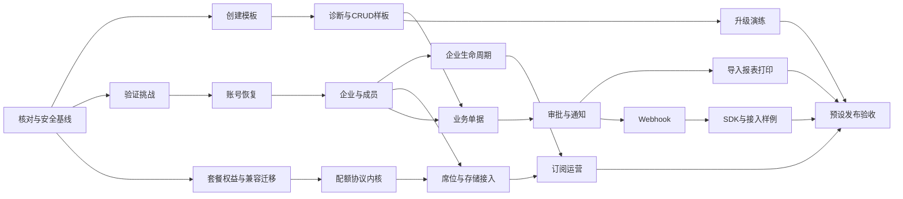

# Full.NET 企业应用与 SaaS 底座完善开发计划

> 执行方式：按仓库 AGENTS.md 逐切片推进，不自动创建工作树、派发代理、提交或推送。本文件负责新增能力和跨专项依赖；已有专项的实现步骤与进度继续在原计划维护。

**Goal：** 将现有模块组合为可创建项目、可由企业自主使用、可运营 SaaS、可升级恢复的开发底座。

**Architecture：** 保持强化型模块化单体、API/Worker/Migrator 分离、Dapper 双库和 Host.Api Native AOT。复用 Identity、Tenancy、Organization、Payments 等数据所有者，不复制账号库，不为目录完整度增加业务项目。

**Tech Stack：** .NET 10、Dapper、自有事务/SQL 边界、SQL Server/MySQL、Vue、OpenAPI 客户端生成、Jobs、Files、Notifications、Outbox、Kubernetes/Helm；新增外部依赖必须在对应切片核对许可、维护状态与原生可行性。

## 1. 授权、状态与计划所有权

- 日期：2026-09-16；用户要求将八项补齐能力和已有模块收口重点写入文档并制定详细计划。
- 审查修订：补齐未注册受邀者入驻、存量权益迁移、F05/F08 无环依赖及版本化源码分发；仅完善计划，不改变实施状态。
- 设计依据：[总体规格 §24.1](../specs/2026-07-17-fullnet-architecture-design.md#241-企业应用与-saas-底座完善2026-09-16)、[产品能力队列](../../roadmap/adminnet-feature-parity.md#8-企业应用与-saas-底座完善队列2026-09-16)。
- 文档核对基线：`main` / `ccd12944d0a77d295d062bfccf7f985fcb7b1362`。按用户要求，工作区其他改动不作为本计划实施证据；开工时重新核对实际提交和相关实现。
- 状态（2026-09-22 核对）：F00 已有[基线核对](../../verification/2026-09-17-foundation-productization-f00-baseline.md)；F01—F16 已有部分模板、领域、API、Vue 和测试资产，企业与 SaaS 子集见[企业预设](../../verification/2026-09-17-enterprise-preset-closeout.md)、[业务接入](../../verification/2026-09-17-enterprise-business-integration-closeout.md)、[SaaS 预设](../../verification/2026-09-17-saas-preset-closeout.md)。F08b 席位编排与 `module-local-transaction-debt` 清债见 [F08b 收口](../../verification/2026-09-22-f08b-foundation-closeout.md)（`da77e74e` 及以后提交）。下方未勾选项表示整项验收未关闭，不代表没有实现。不得根据局部收口标题直接升级 Verified 或 SaaS Production-verified。
- 初版交付仅修改文档；2026-09-19 用户已授权按审查顺序继续实施：当前命名门禁 → 当前提交 CI/SSO 验收 → 安全修复清单 → 企业/SaaS 缺口 → 生产认证。生产启用、真实收费、批量通知、不可逆删除仍遵循对应授权与发布流程。
- 本文件是“底座完善”唯一活动总计划。OIDC、AI、现有安全修复等专项不被替代；只在其完成后消费证据。新增切片在本文展开，确需独立专项时先登记任务转移及唯一所有者，不能双处维护勾选状态。

### 2026-09-26 自主检查与首轮验收

- 授权：用户允许按本总计划自主检查、修改、补测试、本地快速验证、开发分支提交/推送及修复 GitHub Actions；合并与发布另行约定。
- 基线：`120d767ca3e70b68f95923fefcb0ad6378bcd0fb`，工作区干净；开发分支 `codex/foundation-acceptance-20260926`。远端 main 的历史结果不作为本基线通过证据。
- 首轮范围：F00 核对既有增量；优先关闭 F01/F15 的应用创建、升级安全与开发分支验收入口；用双库基础生命周期及企业样例验证已有能力。暂不改变产品政策、生产启用和真实支付渠道。
- 执行步骤：先为升级包摘要、路径、预设闭包、预览后修改与失败恢复建立可失败回归；再修复 `scripts/templates/upgrade-framework.mjs` 及必要辅助工具，同步模板打包；补齐 PR 的创建应用真实栈与受影响双库门禁；执行相关 Template/Contract/Governance 快速检查，独立只读复审后提交推送；按精确 SHA 等待 CI 终态并处理失败。
- 首轮远端反馈：`37ca424c` 的 API/Worker Native Actions 成功，主 CI 失败，尚不能关闭里程碑。失败暴露精简应用可选契约识别、并行模板构建初始化、租户履约服务生命周期及 MFA 迁移目录问题；分别补运行回归、串行模板验收、作用域装配检查与双库迁移重入测试。复审另发现 Workflow 三条变更路径在事务内读取租户权益，已移至事务前并用六个先失败的用例验证允许/拒绝路径，未新增事务债务豁免。
- 后续反馈：固定预设的历史共享迁移 203/206/207 在已核对全文摘要下按建表清单适配，未选表已存在时拒绝漂移，所选表缺失仍失败；完整闭包与无清单运行保持历史正文。代表性浏览器 CRUD 又发现首次 Development 播种早于本地租户创建，现补 Development 专属成员贡献者并覆盖首次与重跑。客户端保留数字模型、规范整数字符串转为安全整数，超出安全范围拒绝；申请单创建使用可信组织上下文头。上述修复在当前提交取得远端双库/浏览器证据前不关闭里程碑。
- `f1e23ee6` 的双库迁移 472 项全通过；受影响基础模块 290 项有 8 项失败。核对为精简测试宿主缺 Files 用量端口、MFA 校验错误状态码预期过时、商业重新激活用例漏开启已有策略。已补装配快速回归、稳定错误码断言与场景专属配置；未改变生产商业策略或去掉宿主依赖校验。
- `8894fb73` 的企业样例双库浏览器及客户端门禁通过，独立 Minimal 应用迁移后启动暴露产品装配缺陷：头像、租户 Logo 和文件配额服务强制依赖可选 Files Port。修正为带默认值的可选依赖；无 Files 时，媒体操作及文件用量对账在数据库/文件副作用前返回既有受控错误，席位对账保持可用，不能把缺失用量视为零。新增 16 项无数据库回归先全部因 DI 失败，修复后通过；保留完整 DI 验证。另隔离钉钉回执测试的环境变量，解决 Linux MethodLevel 并行清理造成的偶发失败。当前修复的独立应用真实栈与完整 CI 仍需按精确提交取得证据。
- `f2692b90` 完整迁移恢复在 90 分钟超时（467 通过、1 失败、未完成其余用例），失败指向 093 的同批次补列后回填编译。SQL Server 执行前仅在固定全文摘要下延迟编译两个回填语句，不改写历史 SQL 资源；MySQL 保持原路径，双库旧数据恢复继续必验。四项快速边界测试先 1 失败/3 通过，修复后连同前序兼容用例 22 项全通过。PR 将模块/Smoke 与两个互补双库迁移组并行执行，发现阶段验证迁移 UID 无遗漏/重叠；main 原完整迁移组按实际耗时保留 120 分钟预算。失败、跳过与未发现不能视为通过。
- `122cff25` 企业双库浏览器与客户端再次通过；独立应用越过 Files 装配后，发现当前会话授权缺 `IHttpContextAccessor`。认证入口现自行补齐该单例依赖，保留宿主覆盖与重复注册幂等；两场景先 1 失败/1 通过，修复后通过。PR 的原 `build-test` 检查名保留为汇总门禁，等待模块及两个迁移分组全部成功；失败、取消、跳过或缺失的迁移结果不得被独立模块成功掩盖。
- `93ef282f` 的独立应用 70 项、企业双库浏览器各 2 项、客户端、API/Worker Linux Native 均通过；双库迁移恢复 250/244 两组共 494 项全部通过，无跳过。Unit 3038、Compatibility 12、Architecture 230 项全部通过；受影响 Integration 295 项为 293 通过、2 失败。失败均为 Development 播种精确清单漏了开工基线已有的 `tenancy.entitlement_catalog_baseline`，实际 8 项、期望 7 项；Test Overlay 的旧清单也漏了同项。现共享显式 Baseline 清单，Overlay 仅追加自身条目，保留精确集合与 Succeeded 状态校验，并增加 Production 仅 Baseline 的审计断言。未改变运行时播种策略；修复后双库生命周期及其后置企业 API 验收仍待当前提交 CI。
- `2c10a5d2` 最终验收：主 CI、API Native、Worker Native 均为成功终态；播种双库生命周期、受影响模块、企业 API、四预设构建、Minimal 独立应用双库真实 CRUD、双库浏览器及迁移恢复门禁通过。首轮“创建应用、源码升级安全与代表性样例”切片关闭，证据与未验证项见[本轮交付报告](../../verification/2026-09-26-f01-created-app-real-stack-closeout.md)。后续文档提交仅同步事实，不改变已验收实现；F01/F15/F16 整项及 W1 不因此关闭。下一切片按 F02 核对既有诊断与生成器在新应用的真实业务 CRUD、跨租户拒绝和再生成保护。
- 验收：应用拥有的源码不被覆盖；损坏包、未知路径和本地定制拒绝写入；升级保留既定预设及成对迁移闭包；失败不丢原框架且恢复材料可定位；创建应用双库和受影响基础模块/样例有真实执行证据。
- 停止条件：需要新的业务政策、外部认证或发布决定，或恢复不能保留人工内容。未执行、跳过及生产等价验证继续保留未验证状态，不降低门禁。

### 2026-09-19 首批阻塞收口

- 基线：`main / 4ad8f0393ae0b0064fb55a63a4496cfe9b9141d2`；任务快照 `unfinished-closeout-20260919`。本节记录该基线上的未提交增量，不代表全计划完成。
- 命名：补齐 224/225/228 表列中文说明和目录覆盖，224/225 双库说明对齐；SQL Server 注释移出建表条件，支持表已创建但脚本未记账时补齐。228 索引使用两库一致的确定性压缩名称；223 固定动态 DDL 逐文件登记审查理由。迁移均首次进入本地基线提交，未执行已记账数据库升级；真实双库恢复仍待 CI。
- C01：修复 OIDC 关闭时旧会话切租户、Host 强撤服务无法装配。协议签发依赖保持按开关注册，OIDC 分支在任何数据库访问前检查完整依赖；历史授权撤销服务始终可用。关闭场景两项回归先失败，修复后通过，另补启用但依赖缺失时零数据库访问的失败关闭断言。
- F05/F08：邀请接受与配额预留/确认/释放改用 `ExecuteResultAsync`，修复后续 CAS 或确认失败仍提交前一条写入。五项真实事务协调器回归先复现提交错误，再验证回滚；不把此局部修复等同于跨模块事务拆分。
- 验证：聚焦 Unit 34/34、命名 32/32、SQL safety 5/5、OpenAPI 172/172、provisioner 37/37、AOT Architecture 73/73；API AOT analyzers 与 Integration Release 构建均为 0 警告/0 错误。集成分片按当前源码重新发现并验证无遗漏/重复后更新矩阵；发现数不是数据库执行通过数。
- 治理仍为 53/54：`module-local-transaction-debt.json` 的 RegisterAccount 与 AcceptTenantInvitation 两条债务尚未消除。第二条理由已纠正为实际的“事务内跨模块写入”，保持失败，不降低门禁。
- 远端核对：`a6d3d02e` 的 [Worker Native](https://github.com/yan041108/Full.NET/actions/runs/35164362025) 成功；[主 CI](https://github.com/yan041108/Full.NET/actions/runs/35164362020) 与 [API Native](https://github.com/yan041108/Full.NET/actions/runs/35164362019) 失败。当前基线及本轮增量没有远端通过证据。旧 E2E 编码错误已有修复与发现证据，仍需真实浏览器重跑。

### 2026-09-19 注册事务边界后续收口

- F04：Tenancy 活动租户权威读取移至 Identity 事务之前；事务内重新解析并核对政策版本/模式、注册方式版本/租户与邀请快照，目标变化时在消费挑战前拒绝。挑战消费和账号写入仍由 `ExecuteResultAsync` 统一提交或回滚。注册命令没有外层事务标记。
- 六项回归在旧实现全部失败；修复后连同邀请正常注册、租户变化、撤销共 9/9 通过。该切片只消除跨模块本地事务调用，不承诺租户在账号提交时仍处于活动状态的分布式原子保证。
- `module-local-transaction-debt.json` 已删除 RegisterAccount 条目，保留 AcceptTenantInvitation 席位写入债务；治理仍为 53/54，不降低门禁。
- 本轮验证：聚焦 Unit 43/43（含首批修复）、事务边界 Architecture 4/4、API Native AOT Architecture 73/73、命名 32/32、SQL safety 5/5；API AOT analyzers 0 警告/0 错误。单元发现数门槛随新增九例同步增加，不代表已执行完整单元套件。独立只读复审未发现新增阻断问题。
- 用户授权由代理决定是否提交：本切片与首批修复整理为本地提交；未推送，本提交的双库、浏览器和 Linux 原生执行仍待 GitHub Actions。

### 2026-09-19 配额恢复前置：安全重放

- F08a：先修正配额预留/确认/释放的重放语义，再建设跨模块恢复编排。相同完成终态重放只读返回当前用量，不重复改动计数；操作键绑定首次金额，Released、Expired 及过期 Reserved 不可作为新额度凭证；Confirmed 同金额预留可返回已有结果。
- 回归：首轮 11 例在旧实现 5 失败/6 通过，确认重复确认、重复释放、金额冲突、已释放和过期预留误成功。另补显式 Expired 的三种操作拒绝、Confirmed 金额冲突四例；双库共用 API 验证扩展原有测试，覆盖响应丢失后顺序重放与用量不重复变化。
- 发现恢复前置缺口：预留记录没有保存实际 MetricId/PeriodKey，完成时重新查 default 或当前月份；过期补偿可能指向错误周期，因此本轮仍拒绝过期未完成操作，不把安全重放等同于可恢复编排。
- 后续顺序：先持久化配额记录归属并处理历史预留回填/歧义，统一跨指标 OperationId 的寻址约束；再开放准确的过期释放；随后以 Identity 持久化操作状态及可靠事件/后台重试驱动席位预留、成员写入、确认、补偿和对账。必须覆盖跨月、重复投递、确认响应丢失、进程中断与邀请撤销竞争。
- 本轮验证：聚焦 Unit 22/22（新增重放 15 例及既有回滚/校验 7 例）、API Native AOT Architecture 73/73、SQL safety 5/5、Integration tooling 46/46；更新后的 Integration Release 构建与 API AOT analyzers 均为 0 警告/0 错误。独立只读审查未发现新增阻断问题。
- 本切片不移除 AcceptTenantInvitation 架构债务，治理保持 53/54，不提升 F08 或 SaaS 预设状态；双库实际执行待 CI。影响计划指向 integration-matrix、smoke、Tenancy；按用户授权整理本地提交，未推送。

### 2026-09-19 配额记录绑定与过期释放

- F08a：新增双库 229 前向迁移，为预留增加可空 MetricId；新预留在同一 Tenancy 事务记录实际配额度量标识。确认、释放和同向终态重放只查询 Id + TenantId + MetricCode 对应记录，不再随 default 或当前月份重新选取配额；Native AOT 映射同步增加可空 UUID 列。
- 兼容与历史数据：迁移不猜测回填旧记录、不更改用量，重复运行保留已绑定值。旧 NULL 记录不能复用或完成，保留计数等待权威业务事实对账；没有可靠归属证据时不得自动绑定或直接释放。绑定缺失或指向已不存在的记录时失败关闭。
- 已绑定且仍为 Reserved 的过期预留允许释放回原始配额记录；过期确认继续拒绝，Confirmed/Released 不允许反向转换。取消/并发失败仍使用结果感知事务，保持计数与预留终态一起回滚。
- 回归：旧实现三例全部失败，修复后扩展跨月、default 变化、终态重放和绑定记录缺失。双库共用 API 验证预留后新增 default 仍完成到原月记录；新增两库迁移恢复测试验证缺列重建、历史 NULL 保留、已有绑定保留及再次执行无迁移。
- 部署约束：先暂停配额及成员变更并排空旧 API/Worker，再运行迁移并统一切换新二进制；不能混跑仍按当前周期完成操作的旧版本。回退只保留新列/新数据且维持写入暂停，不能用旧代码继续确认/释放已绑定操作；历史归属修复需另行提供可审计工具和双库证据。
- 验证：聚焦 Unit 32/32（本切片新增 10 例）、API Native AOT Architecture 73/73、命名 32/32、SQL safety 5/5；API AOT analyzers 与 Integration Release 构建均为 0 警告/0 错误。Integration 分片发现 api-sqlserver 153、api-mysql 153、migrations 470、infrastructure 176、messaging-heavy 57，合计 1009，无遗漏/重复；这是发现证据，不是数据库运行证据。独立只读复审未发现新增阻断问题。
- 当前切片未实现后台扫描、跨指标操作键唯一性或 Identity 持久化编排，AcceptTenantInvitation 债务继续保留，治理仍为 53/54；未获得双库运行及 Linux 原生执行证据前不提升 F08/SaaS 状态。已按用户授权准备本地提交，未推送；CI 影响集为 integration-matrix、migrations、smoke、Tenancy。

### 2026-09-19 跨指标操作键精确寻址

- F08a：确认/释放请求新增可选 MetricCode，保持原单参数构造与 Deconstruct；现有 source-generated JSON 上下文自动覆盖新属性。提供指标时按 TenantId + MetricCode + OperationId 唯一查询，不存在时不回退。空白或超长指标在查询前拒绝。
- 旧调用兼容：省略或传 null 时，仅返回同租户操作键唯一的预留；自关联 NOT EXISTS 排除歧义行，返回既有 quota reservation not found 404，避免 QuerySingle 多行异常或任意选取。同操作键的其他租户不构成歧义。席位适配器固定传 identity.seats，减少对旧协议的依赖。
- 数据兼容：不改变数据库唯一键，不重写历史 OperationId，不新增迁移。精确寻址复用现有三列唯一索引，完成仍以已绑定的 MetricId 定位实际用量。旧请求查询时点后的并发新增不构成跨模块原子保证。
- 测试：首轮两条 sourcegen JSON/精确寻址回归在旧实现均失败；另补无效指标、无回退、席位适配器用例，共新增 12 例。双库共用 API 增加两个指标共用操作键、旧调用拒绝、精确确认/释放及同向重放。现有客户端导出 manifest 不含这些 quota 端点，本轮不扩大导出集合。
- 验证：聚焦 Unit 44/44、API Native AOT Architecture 73/73、OpenAPI 172/172、命名 32/32、SQL safety 5/5；AOT analyzers 与更新后 Integration Release 构建均为 0 警告/0 错误。独立只读复审未发现新增阻断问题；真实双库和 Linux 原生执行仍待 CI。
- 工具链补漏：本轮发现上一切片 229 未登记 migrationSelections，导致工具链 45/46；补上双库筛选并将参数化迁移测试拆为具名 SqlServer/MySql 入口后恢复 46/46，测试数量不变。
- 剩余：历史 NULL 绑定仍需有权威证据的对账与修复工具，未建设 Identity 持久化编排及后台补偿；AcceptTenantInvitation 债务继续保留，治理仍为 53/54，不提升 F08/SaaS 状态。按用户授权整理本地提交，未推送。

**下一切片（2026-09-19 记录，已由 2026-09-22 切片部分兑现）：** 完成历史归属对账，再消除 F05/F08 席位跨模块写事务；以持久化操作身份、业务权威状态、补偿和对账覆盖确认丢失/进程中断，不能仅把调用移出事务或删除债务条目。随后按当前提交执行双库恢复、OIDC/legacy 真实栈和 Linux 原生门禁。治理与环境证据未齐时，不提升企业/SaaS 预设状态。

### 2026-09-22 F08b 席位编排与 F08a 对账工具

- 基线：`main` / `da77e74e`（Wave 1 Lane C）；Spec [`2026-09-22-f08b-tenant-invitation-seat-orchestration.md`](../specs/2026-09-22-f08b-tenant-invitation-seat-orchestration.md)。
- F08b：`AcceptTenantInvitationService` 与 `TenantMemberProvisionService` 将 Tenancy 席位预留/确认/释放移出 Identity 本地事务；确认失败执行成员/邀请补偿；`module-local-transaction-debt.json` **entries: []**，治理 `capability-debt-sync` 与债务目录一致。
- F08a：历史 NULL `MetricId` 预留对账 API `POST /api/v1/tenancy/quota/reservations/reconcile-metric-ids`（`dryRun` 默认 true）；权限 `tenancy.tenant_quota.reconcile_metric_ids`。
- 验证：Unit `TenantInvitationRollbackTests`、Architecture 模块边界；双库 Integration 对账端点、邀请接受 real-stack 与 SaaS 预设升档仍属 Wave 2–3 门禁，本切片不单独提升 F08/SaaS 为 Verified。
- **下一切片（2026-09-22）：** F05 企业成员全链路双库/real-stack 验收；F12 SaaS 预设在席位编排与配额对账证据齐全后的门禁；持久化操作身份与 Outbox/Jobs 补偿仍按 §F08 正文未勾选项推进。

## 2. 能力、顺序与范围

### 2026-09-25 认证事件日志专项

新增[认证事件日志开发计划 AE01—AE06](2026-09-25-authentication-event-logs.md)，作为 Identity/安全运维收口项。复用现有 `fn_identity_auth_audit`，顺序为事件覆盖与契约 → 兼容迁移/可靠写入 → 认证及 SSO 采集 → 查询 API → Vue 页面 → 保留/导出与验收。F04 的密码/MFA 恢复事件与 SSO 专项共同提供事件来源；本专项负责统一展示及覆盖闭环。首条纵向切片已落地，状态为 Partial；完整事件矩阵与故障验证仍待完成。

| 能力 | 优先级 | 本计划任务 | 最小交付 | 不纳入首切片 |
| --- | --- | --- | --- | --- |
| B01 项目创建与升级工具链 | P0 | F01、F02、F15 | 空目录创建、模块预设、诊断、示例、版本升级演练 | 云端在线 IDE、插件市场、自动覆盖人工代码 |
| B02 企业开通与成员生命周期 | P0 | F05、F06 | 开通流程、邀请、成员管理、所有者交接、退出与停用 | 跨公司复杂 HR、通用组织主数据平台 |
| B03 套餐权益与统一配额 | P0 | F07、F08 | 套餐绑定、功能权益、席位/存储配额、原子预留和对账 | 全局计费引擎、按任意 SQL 动态定义权益 |
| B04 账号自助与恢复 | P0 | F03、F04 | 可配置注册、邮箱验证、密码/MFA 恢复、会话撤销 | 默认匿名开放企业注册、同时铺开所有短信渠道 |
| B05 SaaS 订阅运营 | P1 | F12 | 试用、续期、取消、到期策略、支付对账驱动权益 | 自动税务、复杂账务总账、任意币种自动换算 |
| B06 开放集成与 Webhook | P1 | F13、F14 | 注册事件、签名、投递重试/重放、接收样例、SDK | ESB、任意脚本集成、运行时扫描插件 |
| B07 业务接入标准样板 | P1 | F09、F10、F11 | 业务单据贯通附件、权限、审批、通知和数据交付 | 完整 ERP/CRM 产品、第二套审批引擎 |
| B08 发布升级恢复交付包 | P1，发布必需 | F15、F16 | 支持矩阵、发布清单、备份恢复、升级回退演练 | 未经证据承诺所有部署拓扑和容量 |

执行按依赖推进，不把 P0/P1 当成可绕过前置条件的排序。建议首次取一条纵向主线：F00 → F01 → F02；其后 F03 → F04 → F05 → F06。配额分为 F07 → F08a 协议内核，以及 F05 + F08a → F08b 业务接入，F08 仅在两部分均通过后关闭。F05 可在明确未启用配额的基础预设验收，限额/SaaS 预设必须等 F08b；不允许运行时故障降级为无限额。已有安全问题在每条受影响链路交付前收口。八项扩展不全部成为核心 1.0 阻塞项；SaaS 预设必须达到其自己的完整验收。


```mermaid
flowchart LR
  F00[核对与安全基线] --> F01[创建模板] --> F02[诊断与CRUD样板]
  F00 --> F03[验证挑战] --> F04[账号恢复]
  F04 --> F05[企业与成员] --> F06[企业生命周期]
  F00 --> F07[套餐权益与兼容迁移] --> F08a[配额协议内核]
  F08a --> F08b[席位与存储接入]
  F05 --> F08b
  F02 --> F09[业务单据]
  F05 --> F09
  F09 --> F10[审批与通知] --> F11[导入报表打印]
  F06 --> F12[订阅运营]
  F08b --> F12
  F10 --> F13[Webhook] --> F14[SDK与接入样例]
  F02 --> F15[升级演练]
  F11 --> F16[预设发布验收]
  F12 --> F16
  F14 --> F16
  F15 --> F16
```

## 3. 数据、契约与跨模块边界

1. Identity 拥有账号、验证挑战、认证会话、企业成员的登录/授权绑定；Organization 拥有部门、职位和组织隶属；Tenancy 拥有租户生命周期、套餐、权益与配额。F00 必须先映射现有表/Port，扩展原关系，不另造平行成员事实源。
2. Tenancy 拥有开通与订阅编排记录；Payments 继续拥有支付、退款和渠道事实。支付成功不直接修改另一模块表；可信业务事件推动订阅状态，按版本去重，失败可重放与对账。
3. 企业所有者表示租户内受保护职责，不是 Host 超级管理员；最后一名可管理成员和所有者交接使用 Identity 内原子校验，不绕过会话、租户和操作权限。
4. 功能权益决定租户可用功能，RBAC 决定当前人可执行操作，配额决定剩余使用量。有效调用须分别通过对应检查。业务权益不存入通用 Settings ConfigEntry；Settings 只承接展示偏好或明确的平台配置。
5. TenantMembership、Entitlement、QuotaReservation 等是本计划的领域概念，不承诺现有类同名。F00 在本文登记实际表、内部类型、消费者及方法签名后才开始相应编码；外部稳定契约先冻结，再生成客户端。
6. 配额预留与业务写入分属不同所有者时，不承诺一个本地事务原子完成。以稳定 OperationId、预留凭据、确认/释放和恢复对账组成协议；未知执行结果保留占用，不能到期直接释放并允许重复消耗。
7. 会话、成员状态、付费权益和硬配额的拒绝判断使用权威状态或已批准的强一致策略，不能依赖可能陈旧的 L1 授权。跨模块读取走最小 Port，写入走可靠事件/幂等工作流，事务内不调用其他模块 Port。
8. Vue 为唯一后台主线。普通业务 API 用 ProblemDetails；OIDC 端点沿用 ADR-0011 的协议例外。后台任务、导出、通知、Webhook 与 AI 均保留租户及数据权限边界。
9. 模块按真实消费者编译期装配，沿用现有 Composition 预设。新增可选模块只创建一个主项目；Contracts 拆分需要真实消费者证据，不为框架完整度预建空层。
10. 首版应用模板使用固定提交、带版本与内容摘要的源码分发包。生成应用在 `framework/fullnet/` 保存受管框架源码，在 `src/`、`ui/` 保存应用拥有的宿主/业务/界面；框架与应用所有权由 manifest 区分。现阶段不以尚未发布的 Full.NET NuGet/npm 包为前提，也不访问开发者原始仓库或任意最新分支。
11. 邀请制允许没有账号和会话的受邀者验证邀请并注册。邀请授权、目标邮箱验证、账号认证和成员激活是不同步骤；原有账号必须完成其原认证/MFA，不能通过邀请重置密码或绕过 MFA。账号/挑战/邀请/成员均由 Identity 原子维护，企业状态等跨模块约束仍走受控协作。
12. 权益强制执行前必须完成存量兼容清单、回填与切换门禁。既有部署默认保持明确的兼容阶段，新 SaaS 预设使用强制阶段并要求有效套餐；无绑定、状态读取失败与未知权益不能在强制阶段回退为兼容。

## 4. 文件与验证地图

以下新路径是实施目标，不表示文件已存在。实现任务按当时库存选择成对迁移编号，禁止预占或改写已应用迁移。测试类可按实际夹具收敛，但必须在本文记录最终入口，不能只有无调用者的断言辅助类。

| 任务 | 主要修改/新增位置 | 测试目标 |
| --- | --- | --- |
| F00 | 本计划；`docs/roadmap/capability-status.md`；既有专项执行记录 | 核对证据与实际入口，不新建形式化空测试 |
| F01–F02 | 新增 `templates/fullnet-app/.template.config/template.json`、模板内容与 `scripts/templates/verify-created-app.mjs`；复用 `src/Tools/Full.NET.CodeGeneration.Cli/`、`src/Composition/` | 新增 `tests/templates/created-app.test.mjs`、`tests/templates/template-options.test.mjs` |
| F01/F15 | 新增 `scripts/templates/build-source-bundle.mjs`、`templates/fullnet-app/framework-manifest.schema.json`；分发包内包含锁定来源、项目/包依赖及迁移清单，生成应用保存 `framework/fullnet/` 和 `framework-manifest.json` | 新增 `tests/templates/source-bundle.test.mjs`、`tests/templates/source-bundle-upgrade.test.mjs`，包含摘要损坏、外部路径、离线来源与人工冲突 |
| F03–F04 | 复用 `src/Modules/Full.NET.Modules.Notifications/Features/VerifyRecipientEndpoints/`；扩展 Identity 的 `Features/ManageRegistrationPolicy/`、新增 `Features/RegisterAccount/`、`Features/RecoverAccount/` | `tests/Full.NET.UnitTests/Identity/AccountRecoveryTests.cs`、`tests/Full.NET.IntegrationTests/Identity/AccountLifecycleAssertions.cs` |
| F03–F05 | Identity 新增 `Features/RegistrationInvitations/`，F04 提供一次性邀请/注册领域能力，F05 接管理与入驻入口；Notifications 新增 `Features/SendIdentityChallenge/` 的内部受控投递适配，复用现有邮件 Provider | `tests/Full.NET.IntegrationTests/Identity/InvitedRegistrationAssertions.cs`；覆盖无账号/无会话、已存在账号、撤销竞争及未入租户的收件人 |
| F05–F06 | Tenancy `Features/ProvisionTenant/`；Identity 新增 `Features/ManageTenantMembers/`、`Features/AcceptTenantInvitation/`；Organization 成员适配；Vue 新增 `TenantMembersView.vue`、`TenantOnboardingView.vue` | `tests/Full.NET.UnitTests/Identity/TenantMembershipTests.cs`、`tests/Full.NET.IntegrationTests/Identity/TenantMembershipAssertions.cs`、`tests/Full.NET.IntegrationTests/Api/TenantLifecycleAssertions.cs` |
| F07–F08 | Tenancy `Features/ManageHostTenantPackages/`；新增 `Features/ManageTenantEntitlements/`、`Features/ReserveTenantQuota/`；首个 Identity/Files 消费者 | `tests/Full.NET.UnitTests/Tenancy/TenantEntitlementTests.cs`、`TenantQuotaTests.cs`；`tests/Full.NET.IntegrationTests/Api/TenantEntitlementAssertions.cs`、`TenantQuotaAssertions.cs` |
| F09–F11 | 新增 `samples/enterprise-request/`；复用 Workflow、Files、Notifications、ImportExport、Reporting、Printing 模块及生成器 | `samples/enterprise-request/tests/`；`tests/e2e/admin-real-stack/tests/enterprise-request.spec.mjs` |
| F12 | Tenancy 新增 `Features/ManageTenantSubscriptions/`；Payments `Features/ManageOrders/`、`ManageRefunds/`、`ReceiveWeChatNotify/`；Vue 新增 `TenantSubscriptionView.vue` | `tests/Full.NET.UnitTests/Tenancy/TenantSubscriptionTests.cs`、`tests/Full.NET.IntegrationTests/Api/TenantSubscriptionAssertions.cs` |
| F13–F14 | 首个消费者出现时新增 `src/Modules/Full.NET.Modules.Webhooks/`；复用 Identity OpenAccess、Auditing、Outbox；新增 `samples/webhook-consumer/`；`packages/client-contracts/` | `tests/Full.NET.UnitTests/Webhooks/WebhookDeliveryTests.cs`、`tests/Full.NET.IntegrationTests/Api/WebhookDeliveryAssertions.cs`、样例契约测试 |
| F15–F16 | `deploy/helm/fullnet/`、`docs/operations/`、`docs/development/onboarding.md`、发布工作流；新增 `docs/operations/application-upgrade.md`、`docs/operations/application-recovery.md` | `tests/deployment/`；模板旧版本升级夹具；现有 Native API 与 Worker 外部进程夹具 |

数据任务共同涉及 `src/BuildingBlocks/Full.NET.Migrations.DbUp/Migrations/SqlServer/` 与 `MySql/`、模块 SQL/JSON/AOT 登记、`contracts/database/object-comments.json`、`contracts/architecture/global-sql-statements.json`。增加测试时同步 `eng/testing/test-matrix.json`；普通管理前端复用 `packages/client-contracts/` 的 OpenAPI 生成，不手写第二套 DTO。

## 5. 新能力实施任务

每项清单均为未执行。任务完成须记录提交、实际验证命令/结果、未验证项；实现与发布状态分开。后续执行单步按“失败场景 → 最小实现 → 聚焦验证 → 消费方接线 → 切片验收”推进。

### F00：冻结现状、已有计划分工和第一条交付基线

**依赖：** 无。**产出：** 可追踪的模块/入口/证据清单和首批实际接口签名。

- [ ] 核对八项能力在当前提交中的 Endpoint、表、Vue、测试和专项；对已实现内容只记录缺口，禁止重建。特别核对 Registration/OAuth/OIDC、通知验证码、ImportExport/Reporting 与 Payments。
- [ ] 将 §6 的 C01—C07 映射到原计划的具体未关闭任务及证据；文档冲突时记录“实现存在、验收待核”，不凭标题直接改为完成。
- [ ] 在本计划追加第一批切片的契约登记：所有者、调用方、请求/结果字段、错误码、精确权限、幂等键、并发版本及数据兼容策略。跨模块先证明现有 Port 不足再扩契约。
- [ ] 选择最小可发布预设及其真实验证范围；带已知安全/隔离问题的链路先修复，未选入的可选模块不使核心预设假通过。

**验收：** 每个新能力可定位到现有资产、增量和任务所有者；每个当前发布阻塞有关闭条件，未产生代码能力通过声明。

### F01：从空目录创建独立应用

**依赖：** F00。**消费：** Naming Profile、Composition 预设。**提供：** 基础管理、企业应用、SaaS 的可选择模板；未满足能力门禁的预设标为实验性且不默认启用。

- [ ] 先实现版本化源码包构建：固定源提交，登记每个受管文件摘要、框架版本、模块闭包、中央包版本、构建 props/targets、源生成器、迁移资源、CLI 与前端 workspace 依赖及锁文件。包不含 bin/obj、秘密、本机缓存、绝对路径或指向原仓库的链接；摘要不符拒绝实例化。
- [ ] 从现有静态注册清单产生所选预设的 Composition 投影及项目引用闭包，不把当前引用所有模块的 Composition 原样复制后仅关闭运行开关。登记哪些迁移/种子属于所选闭包及其历史依赖，禁止按名称过滤后静默跳过必要迁移。
- [ ] 建立模板参数负例：非法/保留 OwnerKey、未知模块、缺硬依赖、输出目录冲突均拒绝且零覆盖。
- [ ] 定义项目名、OwnerKey、SQL Server/MySQL、模块预设、前端和端口选项；冻结输出 manifest，秘密只生成占位配置。
- [ ] 模板包随附受管框架源码，以应用内部相对 ProjectReference 和 workspace 引用完成接线；初始化时复制的宿主/业务/界面骨架之后属于应用，不被框架升级器直接覆盖。NuGet/npm 第三方依赖仅从配置的源按锁定版本还原，Full.NET 自有代码与前端共享包来自分发包。
- [ ] 在不能访问原仓库、没有自有包缓存的干净环境，仅凭版本化模板包与声明的第三方依赖源创建两种数据库应用，执行还原/构建、迁移/引导、登录和一个管理读取；重复创建不覆盖用户文件。原生构建验证包内 analyzers/generators/迁移资源齐全；额外无网络还原只有在依赖预缓存条件明确时才要求。

**验收：** 新应用不依赖原仓库绝对路径；未选择模块没有意外运行依赖；首次运行说明与实际步骤一致。后续计划命令示例：`dotnet new fullnet-app --name Demo --owner-key demo --database mysql`，模板未登记前不可报告该命令可用。

### F02：环境诊断与生成一个真实 CRUD

**依赖：** F01。**提供：** 可复用的应用开发起点及受控诊断结果。

- [ ] 对缺 SDK、错误数据库配置、遗漏模块依赖、未配置密钥建立诊断断言；输出机器码和修复指引，不泄露凭据。
- [ ] 在现有 CLI 内扩展诊断入口，先只读检查，用户显式要求后才执行初始化；区分本地开发和生产配置。
- [ ] 用现有生成器在新应用生成一个租户 CRUD，贯通数据库、后端、OpenAPI、Vue 和精确权限；开发者修改业务实现后再生成，证明人工文件不会丢失。
- [ ] 完成从创建到首个 CRUD 的教程并实走；记录耗时与失败原因，性能目标由实测基线后制定，不虚称固定分钟数。

**验收：** 新应用的真实新增/编辑/查询和跨租户拒绝通过；生成器只更新其持有的产物。

2026-09-26 执行顺序（用户已授权自主检查与升级；基线 `264ea40d`，干净工作区）：

1. 诊断收口：以 `tests/Full.NET.UnitTests/CodeGeneration/DiagnoseCommandTests.cs` 复现未知 Profile、配置类型错误与目标工作区 SDK 选择缺口；修改 `src/Tools/Full.NET.CodeGeneration.Cli/CodeGenerationCli.cs` 与 `DiagnoseCommand.cs`，保持只读、脱敏、稳定机器码及非零失败语义。执行聚焦 Unit 与治理，更新 `docs/development/create-first-crud.md` 的真实入口和限制。
2. 生成接入：复用现有 Schema、工作区所有权与模块接入工具，在 `tests/templates/support/created-app-real-stack.mjs` 中增加独立应用生成路径；先检查宿主、Migrator、OpenAPI 和 Vue 的实际接入点，不复制官方模块或改写受管框架作为业务实现。
3. 真实验收：在双库新应用验证生成业务的新增/编辑/查询、精确权限、跨租户拒绝；保留人工业务文件及人工修改的受管文件冲突拒绝，二次生成不得损坏内容。重型验证由 GitHub Actions 执行，失败先定位再修复。
4. 教程与关闭：修正 `docs/development/create-first-crud.md` 与 `first-crud-from-template.md` 中仓库布局和独立应用布局混用的命令；只依据实际执行证据记录耗时与结果。诊断子集通过不代表整个 F02 关闭；SDK 缺失时不能承诺依靠尚未启动的 .NET CLI 自救。

停止条件：需要新的业务政策或发布决定、再生成不能保留人工内容、跨租户或权限拒绝缺失；不得放宽双库、冻结的 Layui 边界或 Native AOT 门禁。

诊断第一增量：合法 `--profile` 曾因默认值被当作已传参而全部返回 64；修复为解析后再应用默认值，并拒绝未知 Profile。SDK 检查改用目标工作区，类型错误输出脱敏 `DIAG_APPSETTINGS_INVALID`，取消继续传播，环境连接占位符不得视为已配置。回归先 11 项中 10 失败；入口修复后 10 通过、1 失败，精确复现生产环境变量占位符误报。审查追加 6 条回归，其中 inline 空白、ConnectionStrings 非对象及 Redis 秘密 bool/number 4 项先失败，再统一为空白/占位符拒绝与严格字符串类型。最终 CLI 聚焦 66 项、CodeGeneration/Realtime 414 项、治理 55 项通过，无跳过，Release 构建 0 警告/0 错误。Integration 1075 项仅为分片发现证据；独立 Minimal 双库应用现必验应用自带 CLI 的 SDK/工作区/预设/模块闭包及配置只读性，实际执行与远端门禁待此增量推送后验证。完整配置覆盖、SDK 版本兼容矩阵、UserSecrets 内容与独立生成业务链路仍待后续增量，不关闭 F02。

生成接入第一增量（基线 `0702cc54`）：内部模型已支持省略 Layui 路由，但 CLI JSON 读取器仍把路由与控制器字段标为 required，且同命名空间旧实现遮蔽共享路由接入器。读取器回归先 5 项中 4 失败；实际 CLI 回归先 3 项全部因空引用失败。三个字段改为可选并移除旧实现后，实际 CLI 3 项通过，覆盖 Vue 路由写入、重复执行幂等、无 Layui 输出或目录，以及缺少前提或聚合桥所有权时拒绝写盘。CodeGeneration/Realtime 422 项、治理 55 项全部通过，无跳过，Release 构建 0 警告/0 错误。未知字段拒绝及显式 Layui 控制器配对校验保留；未修改冻结客户端。诊断提交 `0702cc54` 的模板真实栈作业已成功，包含独立 Minimal 双库应用自带 CLI 与配置只读性检查；其余门禁与生成接入增量按精确 SHA 继续核对，不替代完整生成 CRUD 验收。

2026-09-26 授权接入修复计划（基线 `ee3461da`）：现有 `AuthorizationContributorIntegrationEditor` 把集合元素追加到类型外，且只凭一个权限标记跳过整条接入。先在 `tests/Full.NET.UnitTests/CodeGeneration/AuthorizationContributorIntegrationEditorTests.cs` 复现三个集合插入、重复幂等、部分标记与人工漂移、注释/字符串伪装及非标准集合拒绝；复用既有轻量 C# 词法分析确认唯一标准集合位置，保持手写元素并逐集合验证完整生成块，任何歧义保持原文返回失败。生成文件以独立小项目做实际编译实验，执行聚焦 Unit、治理及影响集规划后独立审查、提交推送。此增量不新增 CLI 命令、不改变权限作用域政策或数据库结构，不代表完整生成业务验收。

授权结构接入结果：首批 Unit 8 项先 7 失败/1 通过，修复集合内插入后通过；追加边界回归复现非标准重复声明，独立复审又复现“完整块藏入被丢弃的嵌套集合”伪幂等，现已要求生成块开始和结束均处于直属元素边界。新增 15 项回归覆盖标准插入、手写元素保留、两实体依次接入与各自幂等、CRLF、部分/重复/越界/人工漂移、字符串伪标记与不明确形态拒绝。旧追加方式的独立结构编译实验报 11 错误，实际编辑结果编译为 0 警告/0 错误；该实验使用最小类型定义，不替代实际授权目录或应用运行。

本地新鲜证据：`pnpm test:dotnet:unit -- --selection code-generation-realtime` 437 项通过，`pnpm test:aot:analyzers` 0 警告/0 错误，`pnpm test:dotnet:architecture -- --selection api-native-aot` 73 项通过，`pnpm test:governance` 55 项通过，均无跳过；`pnpm test:integration:partitions` 发现 1075 项，无遗漏或重复，不计为完整 Integration 通过。影响集规划基线为 `ee3461da`，目标 CodeGeneration。首次分析构建曾与测试构建争用 DLL 而失败，串行复验已通过；不将第一次失败计为成功。独立复审无剩余阻断，远端按新提交 SHA 核对。生成片段的权限作用域政策、CLI 授权接入、应用 Migrator、完整生成业务与宿主整条接入的并发/恢复仍未验收，不关闭 F02。

授权作用域增量（基线 `34ab3bcc`）：片段生成器原来对租户 CRUD 固定输出 Host 权限，违背 `TenantRequired` 数据上下文。新增 7 项 Unit；纠正测试样例中显式能力禁止的审计列后，正确 RED 为 3 失败/4 通过，覆盖两种实体能力格式的租户映射及旧 Host 块不允许静默改写。现六条权限共用 `TenantRequired → Tenant` 映射，`HostOnly/Global → Host` 保留现有最小授权范围，未改变精确权限码或官方模块贡献者。租户 CatalogProduct golden 仅两处作用域随实际输出更新；CodeGeneration/Realtime 444 项、治理 55 项通过，无跳过，独立复审无阻断。实际授权运行、CLI 贡献者接入和独立应用 CRUD 仍待 F02 全链验收。

作用域增量补充验证：`pnpm test:aot:analyzers` 0 警告/0 错误，`pnpm test:dotnet:architecture -- --selection api-native-aot` 73 项通过、无跳过；`pnpm test:integration:partitions` 发现 1075 项，无遗漏或重复，不作为完整 Integration 通过。影响集按基线 `34ab3bcc` 规划为 CodeGeneration 与 integration-matrix，重型双库及 Native 运行门禁交由新提交的 GitHub Actions，未取得终态前不升级 Verified。

2026-10-04 诊断环境文件增量（基线 `11941c21`）：数据库连接名、连接字符串和三个常见秘密键加入所选 API 配置目录的 `appsettings.Development.json` / `appsettings.Production.json` 覆盖；优先级为环境变量、Development User Secrets、环境 JSON、基础 JSON。显式空值或空集合叶键阻止基础凭据回退，父级空对象不删除较低优先级的子键；环境文件的 JSON、重复扁平键错误独立失败且不回显内容。首轮诊断 61 项中 11 失败，修复并扩展边界、处理独立复核发现的连接名大小写、空属性路径与连接名误填凭据回显问题后，73 项通过（复核新增 5 项均先失败）；Windows 全量 Unit 3920 通过、1 项 Linux FIFO 回归跳过，无失败。本地受影响 CodeGeneration MySQL Integration 13 项、治理 57 项与测试工具链 54 项通过，Release 构建 0 警告/0 错误；Integration 分片发现 1118 项无遗漏或重复，仅为发现证据。独立生成应用验收补充 API 同目录环境文件、错误根目录文件不误读、占位符拒绝、只读及脱敏断言。冻结预设检查保持基础配置；SDK 兼容矩阵与完整运行时配置诊断仍待收口，F02 不关闭。

2026-10-04 SDK 诊断增量（基线 `cd6dc447`）：实际目标工作区锁定本机 SDK 9.0.307 时，旧诊断输出 `DIAG_SDK_OK` 且退出 0；现增加稳定错误码 `DIAG_SDK_INCOMPATIBLE`，按当前分发包 `10.0.100 + latestFeature` 基线接受更高的 10.0 功能带，其他主/次版本与无效版本格式不自动认证为兼容。SDK 选择及预览版准入仍由目标工作区和父目录的 `global.json` 交给 .NET 解析；成功结果仅回显数字版本和预览状态，不回显任意后缀。首轮诊断矩阵 93 项中 15 失败，扩展到 95 项后全部通过；CodeGeneration/Realtime 781 项通过、无跳过，真实 SDK 9 场景已退出 1；受影响 MySQL Integration 13 项、治理 57 项与测试工具链 54 项通过，Release 构建 0 警告/0 错误，分片发现 1118 项无遗漏或重复，仅计发现证据。正常诊断测试工作区锁定当前 .NET 10 基线，只读断言比较执行前后的全部文件清单与内容。独立生成应用新增缺 SDK、旧 SDK 失败和配置只读断言；旧 SDK 场景仅在本机确已安装旧版时执行，本次本机具备 9.0.307。该检查不替代工作负载、实际构建及 Native AOT 工具链验收；完整运行时配置诊断仍待收口，F02 不关闭。

2026-10-04 数据库 Provider 诊断增量（基线 `359a7bf4`）：以真实 `AddFullNetDapper` 的 Options 绑定和校验对照 CLI，复现无效名称、未定义数字、布尔值与空字符串导致宿主拒绝但诊断退出 0 的缺口。新增 `DIAG_DATABASE_PROVIDER_INVALID`，按环境变量、Development User Secrets、所选环境 JSON、基础 JSON 取最终标量值；名称忽略大小写，数字 `0/1` 与运行时一致，缺省或 `null` 保留 SqlServer 默认值。工具不新增运行时数据依赖，不回显字段值；非空集合结构、Guid 存储模式、超时与完整 Options 启动验证仍保留待办。首轮诊断 114 项中 10 失败，修复后 114 项通过，再补 7 项数字字符串、枚举组合、空集合和数字边界；CodeGeneration/Realtime 最终 807 项通过、无跳过，Release 构建 0 警告/0 错误。本地受影响 MySQL Integration 13 项、治理 57 项、测试工具链 54 项与命名检查 33 项通过；分片发现 1118 项无遗漏或重复，仅为发现证据。独立生成应用新增错误 Provider 名称与未定义数字拒绝、合法数字接受、只读和脱敏断言；F02 不关闭。

2026-10-04 数据库超时与 Guid 模式诊断增量（基线 `a23d194c`）：对照真实 Dapper Options 绑定及启动校验，补齐 `CommandTimeoutSeconds` 正整数门禁、`MySqlGuidStorageMode` 枚举值与 Production 准入，新增 `DIAG_DATABASE_TIMEOUT_INVALID`、`DIAG_DATABASE_GUID_STORAGE_INVALID`。三项数据库标量配置共享环境变量、Development User Secrets、所选环境 JSON、基础 JSON 覆盖；Production 两库均需显式非 null 模式，MySQL 需 Binary16，SQL Server 显式 LegacyChar36 保持既有允许行为。运行时对照确认超时显式 null/空对象绑定为 0，只有缺省保留 30 秒；保留整数转换支持的三种十六进制前缀。校正此预期后新增 47 项中 26 项先失败；实施后新增测试全部通过，原有 5 项正常生产样例补齐显式模式，未放宽断言。最终 CodeGeneration/Realtime 854 项通过、无跳过，Release 构建 0 警告/0 错误；受影响 MySQL Integration 13 项、治理 57 项、工具链 54 项和命名 33 项通过，分片发现 1118 项无遗漏或重复，仅为发现证据。独立生成应用加入零超时、生产 MySQL 旧模式及环境 JSON 空值拒绝、合法十六进制超时与两库模式接受、配置只读断言。数据库运行时、默认值与迁移不变；连接串直配、非空集合结构和完整运行时配置诊断仍待收口，F02 不关闭。

2026-10-04 数据库连接直配诊断增量（基线 `96f4858b`）：对照真实 Dapper Options 的 PostConfigure，修正 CLI 忽略 `Database:ConnectionString` 的取值差异。直配先按环境变量、Development User Secrets、所选环境 JSON、基础 JSON 取最终值；只有 null、空串或空白才回退到命名连接，非空占位直配不能被有效命名连接掩盖。有效直配不再要求未使用的连接名；Production 仍忽略开发秘密，无效秘密文件保持独立错误。新增 34 项回归中 11 项先失败，修复后全部通过；最终 CodeGeneration/Realtime 888 项通过、无跳过，Release 构建 0 警告/0 错误，工具链 54 项、命名 33 项通过。独立生成应用加入 API 环境文件直配、未使用的空连接名、占位直配拒绝、环境直配覆盖及空白/null 回退、只读和脱敏断言。仅修改诊断，不改变数据库运行时或迁移；非空集合结构和完整运行时配置诊断仍待收口，F02 不关闭。

2026-10-04 数据库结构与连接名绑定诊断增量（基线 `1f5a533e`）：以真实 Dapper Options 对照五个数据库字段的非空对象、数组、显式 null 与子键共存，以及覆盖后的标量取值。非空结构只提供子键，不会覆盖同路径标量；未出现连接名标量时保留宿主默认名 fullnet，显式 null、空串或空白不恢复默认名。连接名改用与其他数据库字段一致的展平读取，保留宿主数字/布尔标量的字符串转换。运行时对照确认显式 null 即使存在子键也仍清空超时或连接名，未新增一律拒绝对象/数组的规则。校正测试前提并去除重复扁平键夹具错误后，44 项回归中 13 项先失败；修复后 44 项全部通过，最终 CodeGeneration/Realtime 932 项通过、无跳过，Release 构建 0 警告/0 错误，工具链 54 项、命名 33 项通过。独立应用新增五字段结构覆盖不抹除基础标量、基础连接名只有子键时使用默认名、显式 null 及 null 与子键共存拒绝、合法环境覆盖和数字连接名接受，并核对只读与脱敏。数据库运行时和迁移不变；这项验收限定于上述字段及已支持来源，完整宿主配置诊断和其余 F02 能力仍待收口，F02 不关闭。

2026-10-04 基础配置 JSON 诊断增量（基线 `61bea8f8`，快照 `f02-base-json-20261004`）：复用所选环境配置的 JSON 语法和展平路径校验，基础 appsettings 及独立应用根、API、已声明 Worker/Migrator 配置接受宿主支持的注释与尾逗号，按不区分大小写的展平路径拒绝冲突，包括扁平/嵌套键、数组索引及空属性名。坏基础文件不能由有效环境值掩盖，冻结应用及框架清单保持严格 JSON。新增 36 项回归以真实 .NET JSON 配置提供程序作对照；含既有相关样例的 44 项先有 31 项因诊断误拒绝/误放行失败，修复后 44 项全部通过。最终 CodeGeneration/Realtime 968 项通过、无跳过，Release 构建 0 警告/0 错误，工具链 54 项、命名 33 项通过。独立生成应用新增四处基础配置的语法接受、重复路径拒绝、只读与脱敏断言；冻结源码打包验收按提交运行并在交付报告记录。此增量不证明任意配置形态或完整宿主加载能力，不改变数据库运行时、迁移或冻结清单格式；F02 与 Capacity-not-verified 保持未关闭。

2026-10-04 基础命名连接展平诊断增量（基线 `9c020615`，快照 `f02-base-named-connection-20261004`）：基础命名连接改用数据库选项已有的展平读取，补齐扁平键、大小写路径、嵌套连接名、数组索引及合法空属性名子路径；根空属性名不映射到正常路径。按实际 JSON 配置顺序处理标量后空对象/数组覆盖，非空子键不抹除同路径标量。环境变量、Development User Secrets、所选环境文件优先级不变；JSON null/空白阻止基础凭据回退，移除环境变量恢复基础值，Production 不读取开发秘密。保留已有基础凭据字段类型检查，数字/布尔命名凭据不计为已配置。新增 29 项回归先有 13 项因 CLI 漏读或错误保留基础值失败，真实配置提供程序/Dapper Options 对照均符合预期；修复后 29 项全部通过，最终 CodeGeneration/Realtime 997 项通过、无跳过，Release 构建 0 警告/0 错误，工具链 54 项、命名 33 项通过。独立生成应用新增基础扁平/大小写/嵌套路径读取、空集合清空后环境覆盖、环境 JSON 显式 null 拒绝及只读/脱敏断言；冻结源码包验收按提交执行并在交付报告记录。未改变数据库运行时或迁移；诊断仍限定于已支持字段和配置形态，不认证任意结构、地址可达或连接串语法，F02 与 Capacity-not-verified 保持未关闭。

2026-10-04 基础秘密展平诊断增量（基线 `5c1aedbf`，快照 `f02-base-secret-paths-20261004`）：三个常见 Redis/SM2 秘密键改用既有展平读取，补齐基础扁平键和大小写变体；未声明键不强制存在，显式 null、空白及标量后空集合覆盖按占位处理，非空子键不抹除标量。保留已有嵌套基础秘密字段类型校验，扁平非文本值不能计为有效凭据；高优先级覆盖与 Production 不读开发秘密的边界不变。新增 33 项回归以真实 JSON 配置提供程序的路径存在性、值及覆盖作对照，分别核对三个键与诊断计数；先修正测试变量命名触发的 MSTest 分析器错误，再确认旧 CLI 15 项因漏报失败，修复后 33 项全部通过。最终 CodeGeneration/Realtime 1030 项通过、无跳过，Release 构建 0 警告/0 错误，工具链 54 项、命名 33 项通过。独立生成应用新增基础扁平占位/有效值/null、空集合覆盖、环境修复和只读/脱敏断言；冻结源码包按提交验收并在交付报告记录。此增量不修改缓存、实时或密码学运行时，不验证 Redis 可达性和 SM2 密钥格式，完整宿主配置诊断、其他 F02 能力及 Capacity-not-verified 保持待办。

2026-10-04 独立应用基础档案展平增量（基线 `db4c2713`，快照 `f02-standalone-profile-paths-20261004`）：根、API、已声明 Worker/Migrator 的基础预设与 Provider 检查，以及 Worker 健康端口检查，原来只按固定大小写的嵌套路径读取；合法扁平或大小写别名会被误拒绝，标量后空集合覆盖则可能漏报漂移。复用既有展平读取，保留嵌套字符串类型校验、只读和脱敏；冻结档案仍只核对基础配置，不以环境覆盖修复漂移。新增 54 项回归与真实 JSON 配置提供程序取值对照，旧实现 31 项失败，修复后 54 项全部通过；受影响 CodeGeneration/Realtime 1084 项、工具链 54 项、命名 33 项通过，均无跳过，Release 构建 0 警告/0 错误。独立生成应用新增四处基础文件的扁平/大小写路径与空集合漂移断言，按冻结提交执行，并在交付报告记录实际集成、治理与整包结果。本增量不改变宿主运行时、生成文件所有权或双库迁移，完整配置诊断、F02 其余验收与 Capacity-not-verified 保持待办。

2026-10-04 分段对象配置增量（基线 `b8309522`，快照 `f02-repeated-json-sections-20261004`）：基础配置及独立应用基础档案诊断原来将 JSON 转为 JsonNode，无法表示同名对象声明不同子键的合法配置。改为直接读取 JsonDocument，保留原始片段和声明顺序；按原有精确嵌套路径逐段执行类型约束，最终字段取值仍使用展平读取。冻结清单继续严格解析，真实重复标量路径、扁平/嵌套与数组索引冲突仍拒绝。新增 36 项回归以实际 JSON 配置提供程序及 Dapper Options 对照；先修正新增测试的字符串写法和一处夹具路径冲突，再确认旧实现 29 项行为失败，修复后 36 项全部通过。最终 CodeGeneration/Realtime 1120 项、工具链 54 项、命名 33 项通过，均无跳过，Release 构建 0 警告/0 错误；本轮集成、治理及冻结生成应用结果在交付报告记录。独立应用新增四处基础文件的分段对象、空集合、只读和脱敏断言，不改变宿主加载、模块选择、生成所有权或双库迁移。完整配置诊断、F02 其余验收和 Capacity-not-verified 保持待办。

2026-10-04 模块配置声明提示增量（基线 `02be5ee5`，快照 `f02-module-presence-paths-20261004`）：`CheckModulesSection` 原先只看精确嵌套路径，遗漏合法扁平键和大小写别名，空集合覆盖 Preset 后仍保留旧提示，重复 Enabled 的空父节点则错误掩盖已声明子键。保留原有嵌套字段类型检查，声明提示改按原始配置叶键与最终 Preset 标量判断；不修改宿主模块选择、Options、依赖闭包或环境覆盖。新增 27 项回归使用真实 JSON 配置提供程序对照，旧实现 16 项行为失败；修复后首次 25 项通过、2 项因 SDK 子进程检测失败，原样复跑 27 项全部通过、零跳过。最终 CodeGeneration/Realtime 1147 项、工具链 54 项、命名 33 项均通过且零跳过，Release 构建 0 警告/0 错误；本轮集成、治理及冻结生成应用结果在交付报告记录。独立应用追加 API 扁平/大小写模块提示和空 Preset 覆盖的断言，核对文件只读与输出脱敏。`DIAG_MODULES_OK` 仅表示基础配置有声明，不认证合法模块、完整依赖闭包或宿主启动。F02 其余验收及 Capacity-not-verified 保持待办。

2026-10-04 接入编译退出码诊断增量（基线 `4de32fca`，快照 `f02-build-exit-diagnostics-20261004`）：上一轮独立应用首次人工文件编译失败只留下通用提示，原样复跑通过但具体原因仍未定位。检查发现模块与 Composition 编译把非零构建退出码丢弃，且非编译器输出不能直接公开。保留真实进程执行、取消、候选编译、临时目录清理和已有编译诊断，只在没有编译诊断时附加区域设置无关的数字退出码；不新增重试或把失败视为成功。18 项确定性回归先确认 10 项因缺少退出码失败、8 项控制用例通过，修复后 18 项全部通过、零跳过；最终 CodeGeneration/Realtime 1165 项、相关 Node 门禁 35 项、工具链 54 项、命名 33 项均通过且零跳过，Release 构建 0 警告/0 错误。独立应用在模块入口接线之后用缺失 SDK 对照真实构建退出码，验证模块与 Composition 两条命令的固定诊断、文件保留与 SDK 配置恢复；实际集成、治理及冻结应用验收在交付报告记录。此增量补齐可观测证据，不宣称修复上一轮未重现的进程故障，完整配置诊断、F02 其余验收与 Capacity-not-verified 保持待办。

2026-10-04 SDK 探测取消清理增量（基线 `a662d71c`，快照 `f02-sdk-probe-cancellation-20261004`）：SDK 探测在输出读取或等待退出被取消后直接抛出，释放 Process 对象不会终止其进程。先提取保持原行为的实际探测读取边界，用本测试启动的真实系统进程复现；4 项回归中立即取消和等待中取消两项都因进程仍存活失败，正常退出与非零退出两项通过。修复只在调用方取消时终止本次拥有的进程树、等待退出，保留原始取消异常与令牌；目标工作区 SDK 选择、版本判断、固定脱敏提示和退出码不变。修复后 4 项全部通过，CodeGeneration/Realtime 1169 项、工具链 54 项、命名 33 项均通过且零跳过，Release 构建 0 警告/0 错误。受影响集成、治理及最新冻结生成应用验收结果在交付报告记录；冻结应用验证正常探测与生成链路，取消清理由真实进程 Unit 证明，不把它扩展为终端信号处理、SDK 超时或所有平台的实测证据。F02 其余验收、前轮未定位的构建稳定性及 Capacity-not-verified 保持待办。

### F03：复用通知平台完成账号验证挑战

**依赖：** F00、C04 通知安全收口。**提供：** Identity 账号操作挑战及 Notifications 投递衔接。

- [ ] 核对现有收件端点验证与验证码能力，区分“拥有邮箱地址”和“获准恢复账号”；不得把通用收件端点 verified 直接当作密码重置授权。
- [ ] 建立挑战用途/账号/目标地址绑定、过期、尝试上限、一次消费、并发重放与重发替换测试；未知账号不通过响应差异泄露存在性。
- [ ] Identity 保存其操作挑战的不可逆凭据摘要，通过稳定投递意图请求 Notifications；外部发送事务外进行，失败/未知送达状态可追踪且不消费成功凭据。
- [ ] 提供仅供受信 Identity 调用的挑战投递 Port：绑定用途、ChallengeId/InvitationId、规范化目标邮箱、有效期、发起操作及可选账号/目标租户，不要求接收人已有 UserId、已加入租户或 verified RecipientEndpoint。公开请求不能自行选择模板、渠道配置、任意内容或批量地址；按地址/来源/用途限流，原普通通知用户目录与 verified 校验保持不变。
- [ ] 邀请/注册凭据若需异步投递，原值只能在受限、加密且限期清理的投递载荷中存在，身份校验侧仍只保存摘要；过期/撤销挑战不得继续重发。跨模块交付通过幂等投递身份与状态对账恢复，不让“创建挑战成功”被当成“已送达”。
- [ ] 选择一个邮件测试渠道验证真实投递和消费，日志与界面不回显验证码；测试环境受控收件箱证据与生产渠道认证分别记录。

**验收：** 两个并发消费最多一个成功；未送达不被标记为已验证；不能跨用途复用挑战。未注册且未加入任何租户的邮箱可通过受控挑战渠道收信，但不能借该渠道调用普通通知 API 或发送任意邮件。

### F04：注册、密码恢复与 MFA 恢复

**依赖：** F03；新旧会话撤销消费 C01。**提供：** Identity 的完整账号自助流程。

- [ ] 以现有注册政策为入口，明确 Disabled/InvitationOnly/Open：Disabled 拒绝所有新账号，InvitationOnly 仅接受有效一次性邀请，Open 才允许无邀请注册；默认 InvitationOnly。F04 在 Identity 内实现邀请校验与注册领域原语，由受控测试夹具创建邀请验证闭环，F05 再交付正式签发/撤销管理入口，因此 F04 不依赖 F05。
- [ ] 无会话受邀者先校验邀请，再以独立邮箱挑战证明目标地址控制权，设置密码后建立账号与可重试的入驻状态；不要求先登录不存在的账号。邀请、邮箱挑战、账号创建与幂等注册结果在 Identity 内原子提交；账户可建立时不得提前获得尚未激活的企业权限。既有账号进入其原登录/MFA 流程，不因邮箱文本相同自动绑定、重置或合并。
- [ ] 区分邀请未使用、已绑定账号待入驻、已激活和已撤销状态：注册完成后原凭据不能创建第二个账号，只允许经该账号认证恢复同一入驻记录；待入驻期间仍可被撤销，激活与撤销竞争由 Identity 原子状态转换决定。
- [ ] 实现注册与账号验证，维持统一账号目录和密码/锁定策略；现有管理员重置密码保持独立权限，不挪作公开接口。
- [ ] 实现密码恢复，消费挑战与变更凭据在 Identity 事务内完成；撤销适用旧/新会话和刷新族，旧中心 Cookie 不得重新获取有效授权。
- [ ] 实现 MFA 恢复码生成/摘要保存/一次消费；无恢复码的人工恢复使用独立权限、审核和审计，不以邮箱验证自动清除 TOTP。
- [ ] Vue 完成成功、过期、错误和限流流程，检查 CSRF、Origin、日志去敏及无账号枚举。
- [ ] 建立无账号/无会话的邀请注册测试，覆盖邀请目标替换、过期/撤销与注册竞争、同邮箱并发创建、已存在账号登录绑定、重试返回同一注册结果，以及撤销邀请后待入驻记录不能激活。

**验收：** 双库和浏览器验证正常恢复、重放拒绝与旧会话失效；公开注册仍受部署政策控制。

### F05：企业开通、邀请与租户成员管理

**依赖：** F04。**提供：** 可恢复开通流程、正式邀请入口及不依赖配额的成员基础能力。仅在明确未启用配额的基础预设验收；F08b 再接席位限制，限额/SaaS 预设在 F08b 完成前不得启用。不设置 F05 → F08 的前置依赖。

- [ ] 冻结统一账号与租户成员关系的映射，已有账号接受邀请时仅新增合法成员关系，不复制账号；同账号跨企业的角色/部门独立。
- [ ] 将 ProvisionTenant 扩展为持久化步骤：申请、资源建立、所有者绑定、初始化、激活；跨模块写入用幂等命令/事件，各步骤失败可重试或补偿，未完成不对外宣称可用。
- [ ] 接通 F04 的邀请签发/撤销与注册原语，邀请绑定租户、目标邮箱、可选已有账号、角色范围、有效期及一次消费凭据。新用户经邀请注册后继续入驻，已有用户经原认证/MFA 且身份匹配后接受；不允许邀请发起者授予其无权授予的角色。激活成员前重新检查邀请/待入驻状态、发起者授权和企业状态，撤销后不继续激活。
- [ ] 实现成员分页、启停、角色/组织关系管理与邀请撤销；使用受信 Tenant 上下文和各操作独立权限，提供 Vue 页面。
- [ ] 双库覆盖从未注册邮箱到成员激活的全流程、重复接受、邀请撤销与接受竞争、账号已创建但成员未激活时中断恢复、已存在账号加入、跨企业越权和只剩最后一名管理成员。基础模式无配额与强制模式不允许绕过的验收分别留证；后一组由 F08b 关闭。

**验收：** 企业可由其管理员完成成员入驻；开通失败不会形成可登录但未初始化的企业，跨模块不使用共享本地事务。

### F06：所有者交接、成员退出与企业停用

**依赖：** F05、C01/C05。**提供：** 企业生命周期状态和各消费者的撤销行为。

- [ ] 冻结 Active/Suspended/Closing/Closed 状态以及允许的恢复转换；首版停用与逻辑关闭，物理清除需要单独保留政策和执行授权。
- [ ] 所有者交接绑定明确接收人并做强认证、最后一名保护和并发版本校验；验证两个并发交接不会产生零管理者。
- [ ] 成员退出/移除只撤销目标企业授权，不禁用其全局账号或其他企业成员关系；梳理待办改派、后台执行、文件访问、API 凭据和实时连接处理。
- [ ] 企业停用后阻断新业务写入、异步副作用及新授权；定义恢复入口、只读/导出策略和通知，按各模块 Port/事件收敛并提供对账状态。

**验收：** 退出 A 不影响 B；停用后下一次受保护操作拒绝；未完成的跨模块清理可见且不可误报全部完成。

### F07：套餐绑定与功能权益

**依赖：** F00。**提供：** Tenancy 拥有的版本化套餐/租户权益及最小读取 Port。

- [ ] 冻结权益目录、类型、套餐版本与租户绑定生效时间；未知权益一律拒绝，强制模式下缺绑定/无授权默认拒绝。运营人员仅能配置代码登记的权益，不借通用配置创建任意授权表达式。
- [ ] 在 Tenancy 持久化 Compatibility/Shadow/Enforced 阶段及版本：旧部署升级默认 Compatibility，仅已登记的历史功能保持原权限判断；Shadow 比较将来权益决策但不切断原有功能；新 SaaS 预设创建时直接 Enforced，租户在绑定有效套餐前不得激活。阶段由部署/受控管理决定，不能由请求头或数据库异常推导。
- [ ] 在启用前按旧部署实际可用功能生成存量兼容清单，dry-run 展示受影响租户、未绑定项及差异；经运营确认后使用幂等迁移/回填记录建立显式兼容套餐或租户授权，不授予新增功能、不修改用户 RBAC。覆盖回填中断重入及回填期间新增租户，切换前以一致的版本/受控写入门禁确保无遗漏。
- [ ] 只有所有在用租户均有有效绑定、差异已处置且所有 API/Worker 实例支持权益检查后，才能切为 Enforced。混合旧实例期间维持兼容/影子模式；切换后读状态失败拒绝，不能退回 Compatibility。回退默认保留强制策略并前向修复；会绕过权益的旧版本不得直接重新上线。
- [ ] 建立“有 RBAC 无权益”“有权益无 RBAC”“未知权益”“另一实例命中旧值”的失败断言。
- [ ] 实现套餐绑定、升级/降级预览、定时生效和明确租户特例；权限校验独立执行，返回原因可区分未购买、无权限与配额不足。
- [ ] 选择 Workflow 启用作为首个业务消费者，覆盖页面、API、后台启动三个入口；停用权益不删除已有业务数据，存量实例处置按冻结政策执行。
- [ ] 从未绑定套餐的真实旧版本数据升级，验证已有 Workflow/API/后台操作在兼容阶段保持原结果；执行 dry-run、回填、Shadow、Enforced，再验证取消授权、未绑定新租户、状态库故障与旧实例切换拒绝。此双库升级用例在 F07 关闭，F15 复用并扩展为整应用升级。

**验收：** 单改 UI 或角色不能绕过权益；套餐切换有版本和审计，同场景双库及多实例拒绝成立。旧项目升级不意外停用已有功能，强制阶段缺绑定/状态故障不放行，兼容模式不扩张为永久的付费功能旁路。

### F08：席位、存储与调用额度的统一配额协议

**依赖：** 分两部分验收：F08a 只依赖 F07；F08b 依赖 F08a、F05 和 C02。**提供：** 配额协议内核及真实成员/文件消费者；两部分均通过才关闭 F08，协议单测通过不能代替业务接入。

**F08a：协议内核，独立双库验收。** 使用受控消费者夹具，先验证预留/确认/释放/未知结果，不要求成员功能已完成。

- [ ] 用席位和存储定义首批度量：单位、计数范围、周期、上限、预留期限及幂等 OperationId；API/AI 计量作为后续消费者，保留已有 AI 账本所有权，不能双扣。
- [ ] 建立剩余 1 额度的并发竞争、重试重复预留、业务失败释放、成功后确认丢失、超时未知结果、跨周期结算和套餐降级测试。
- [ ] 在 Tenancy 内原子校验并预留；消费者凭据不可跨租户/用途使用。提交业务后确认，失败释放；对未知结果先权威对账，不能简单 TTL 退款。
- [ ] 配额减少到当前用量以下时保留历史数据并拒绝新增；实现用量查询、差异对账、精确权限的修复与审计。

**F08b：真实消费者接入，独立入口验收。** F05 的基础行为保持，限额模式在本切片接通后才能上线。

- [ ] 成员激活前预留席位，成功激活后确认，失败释放；邀请待接受阶段不计活动席位。以同一入驻 OperationId 重试，避免账号创建成功后反复扣席位。企业首次所有者按冻结套餐规则计数，试用/SaaS 开通同样经过该入口。
- [ ] 将文件上传/发布/删除接入存储额度凭据，冻结临时文件与活动文件占用口径；Worker 中断后按文件权威状态对账，不因租约到期直接释放已使用空间。
- [ ] 在切换为限额模式前建立既有活动成员/文件用量基线并处理并发增量，证明无漏计/双计；Mode 与版本由服务端固定，错误/超时不能切到无限额。
- [ ] 用真实邀请接受/成员激活和文件入口执行“余量 1、两个并发操作”、消费后确认失败、重试、移除/删除及套餐降级；分别验证基础预设无配额与 SaaS 强制配额，未知模式拒绝。

**验收：** F08a 证明协议并发不超卖、重复不双扣；F08b 证明真实业务没有遗漏入口，宕机后能够解释每份占用且两个数据库结果一致。限额/SaaS 预设只有 F08b 通过后才可启用，F05 无须等待本任务才能关闭其基础切片。

### F09：业务单据基础样板

**依赖：** F02、F05、C05；先完成样板基础，不等待全量 SaaS 运营。**提供：** 示例所有者 `demo` 的企业申请单。

- [ ] 在新应用样板内定义主表/明细、申请人、组织归属、金额/数量、状态和版本；通过命名内核生成固定 `demo_*` 表，不写进框架 `fn_*` 业务表。
- [ ] 使用生成器建立列表、详情、编辑、附件与权限；样板依赖官方模块稳定 Port，不反向成为框架必选依赖。
- [ ] 建立 A/B 租户、本人/部门/全租户数据范围、敏感字段、越权附件和并发编辑断言。

**验收：** 开发者可从模板运行完整单据 CRUD，权限与附件所有权贯通列表和详情。

### F10：业务审批、状态回写与通知

**依赖：** F09、C03/C04。**提供：** 单据提交到审批结果的端到端样板。

- [ ] 通过 Workflow 稳定接入契约启动实例，固定业务键、定义版本和提交版本；重复提交只创建一个逻辑流程。
- [ ] 审批结果经可靠事件回写单据，按事件身份与版本去重；乱序、撤销竞争、实例失败和重复完成有明确状态转换。
- [ ] 复用 Notifications 内核产生待办/完成提醒；提醒失败不回滚已提交审批，补投与主业务状态分别展示。
- [ ] 执行 Vue 发起、审批、驳回、改派与通知查看；人工完成页面验收前保持对应待验收标记。

**验收：** 一个真实申请从创建到完成可追踪；停止 Worker 后恢复不会重复产生业务副作用。

### F11：导入、报表与打印接入样板

**依赖：** F09、C02/C05。**提供：** 现有三个模块的受控业务接入范例。

- [ ] 复用 ImportExport 的静态 Schema/任务机制，提供模板、预校验、逐行错误与幂等写入策略；禁止导入绕过单据领域校验。
- [ ] 复用 Reporting/Printing 生成有权限的数据报表和打印视图；查询与结果下载分别验证租户、会话、数据范围和字段权限。
- [ ] 测试排队后撤权、取消、租约失效、Worker 崩溃、结果文件上传后提交失败和重试；限制输入文件、解压、结果大小及执行预算。
- [ ] Vue 展示进度、部分失败、错误文件、取消和结果过期；打印内容按现有净化与隔离策略执行，服务端生成文本遵循语言偏好。

**验收：** 导入/导出/打印不会扩大列表权限；任务恢复和文件清理可证明，未跑真实 Worker 不称恢复通过。

### F12：订阅、试用与支付驱动权益

**依赖：** F06、F08、现有 Payments 安全修复/渠道验收。**提供：** Tenancy 订阅生命周期；Payments 仍拥有资金事实。

- [ ] 冻结 Trial/Active/PastDue/Cancelled/Expired 状态、期限与宽限；取消默认期末生效，首版升级/降级使用明确生效日，不引入自动按比例复杂计费。
- [ ] 先实现测试付款或人工登记的受审计订阅闭环，再接已有支付 Provider；真实自动扣款只在选定渠道能力、用户授权和回调验收完成后启用。
- [ ] 订阅消费已验证支付结果，绑定租户、订单、金额/币种和套餐版本；建立重复/乱序回调、跨商户回调、退款、超时未知结果与对账测试。
- [ ] 支付成功但权益更新失败时保持待履约、可靠重试和对账；不把租户全局禁用作为所有欠费情况的默认处理，按冻结政策限制新增并保留必要恢复入口。
- [ ] Vue 提供试用期限、当前套餐、变更预览、续期/取消及失败解释；到期任务多实例只产生一次逻辑状态转换。

**验收：** 订阅、资金事实和权益可逐笔对应；本地成功不能替代真实渠道认证，不自动承诺发票/税务能力。

### F13：首个可靠 Webhook 事件

**依赖：** F00、F10、C05；选择申请完成事件作为首个消费者。**提供：** 可选 Webhooks 模块及可审计投递。

- [ ] 登记固定事件类型、版本和最小载荷，业务所有者发布集成事件；Webhooks 拥有订阅、投递/尝试/回执，不读取业务模块表。
- [ ] 注册精确目标地址与签名密钥引用，执行 DNS/重定向/目标网络限制、出站超时和响应大小限制；密钥不回显，轮换有受控过渡。
- [ ] 以稳定 EventId/DeliveryId、时间戳、KeyId 对原始请求体签名；接收样例验证签名、时间窗及重复投递，兼容重试/重放时的稳定业务身份。
- [ ] Worker 使用租约、退避、最大尝试和人工重放，网络调用位于事务外；“已接收”与“业务已处理”不混称，超时未知结果允许重复投递但要求消费者幂等。

**验收：** 双库/双实例并发、SSRF、签名篡改、撤销订阅和重复消费场景通过；不得用生产客户地址进行测试发送。

### F14：开放 API 与 SDK 接入包

**依赖：** F13、C01/C05。**提供：** 外部应用可复现的认证、调用和事件接入样例。

- [ ] 复用 API Key/OpenAccess/OIDC，按交互用户与机器调用选择明确认证方式；限制客户端允许的 API 范围、租户与操作，不能把 Host 全权限默认授给外部应用。
- [ ] 用 OpenAPI 生成 TypeScript 接入包，冻结版本、分页、ProblemDetails、文件/流和重试语义；仅幂等或有业务幂等键的操作允许自动重试。
- [ ] 提供凭据配置/轮换、限流响应、错误定位、Webhook 验签和幂等接收教程；样例使用环境秘密引用。
- [ ] 在干净消费项目安装本地打包产物，验证合法请求、凭据撤销、跨租户拒绝与一条事件；公共包发布只在单独授权后执行。

**验收：** 样例无需读取 Full.NET 内部实现即可接入，已发布契约变更可检测。

### F15：应用版本升级与恢复演练

**依赖：** F02、C07；先覆盖基础预设，再覆盖企业/SaaS 增量。**提供：** 应用开发者可执行的升级路径。

- [ ] 定义支持的起始/目标框架版本、数据库版本、模块组合与兼容窗口；以真实已发布或带固定提交的候选基线创建升级夹具，不虚构历史发行版。
- [ ] 沿用 F01 的版本化源码包，以旧 manifest 为共同基线比较本地内容与新分发包：未改的受管文件可计划更新，框架本地定制或应用拥有文件只生成合并建议与冲突报告；先预览/校验再提交受管更新，失败不留下半更新状态。同步框架依赖锁文件、迁移/资源和工具兼容矩阵，不静默升级到最新版本。
- [ ] 夹具包含人工定制代码、旧数据、活动会话、排队任务与文件；升级只改受管资产，冲突生成报告，禁止自动覆盖人工实现。
- [ ] 演练 Expand/Migrate/Contract、混合版本运行、迁移中断重入；破坏性收缩前满足旧消费者退役门禁。数据库不可逆变化使用前向修复或备份恢复，不宣称简单降版本可回滚。
- [ ] 复用 F07 的存量权益回填/强制切换用例及 F08b 的用量基线演练；恢复必须保留或重建正确的权益阶段/版本，不能把 Enforced 租户恢复成兼容模式绕过订阅。
- [ ] 写明数据库、对象文件、Data Protection/签名密钥、运行状态的备份恢复顺序和秘密保护；在隔离环境实际恢复，测量数据丢失与恢复时间并对照冻结 RPO/RTO。

**验收：** 双库升级与恢复证据可定位到版本/产物；回退后权限、会话与任务不被意外复活。

### F16：按预设完成发布验收

**依赖：** 基础预设需 F01/F02/F15 和所含模块 C 门禁；企业预设追加 F03—F06/F09—F11/C01；SaaS 预设追加 F07/F08/F12；开放集成作为选装需 F13/F14。AI 选装另需 C06。

- [ ] 固定预设及依赖闭包，生成发布清单、版本、许可、配置说明与已知限制；默认关闭未验收外部渠道和高风险运维入口。
- [ ] 在 GitHub Actions 对对应提交运行双库、Linux Native、真实栈和受影响治理门禁；人工验收企业核心流程、可访问性和错误恢复。
- [ ] 按现有 Helm 基线验证 API/Worker/Migrator 顺序、多实例、密钥共享、排空、升级、故障接管和恢复；容量按独立容量计划验证。
- [ ] 只有全部适用门禁具备证据才提升该预设状态；文档、构建、运行、生产认证分别报告，不把一个预设的成功外推到所有模块组合。

**验收：** 发布候选可以从干净环境复现，未验证容量继续标 `Capacity-not-verified`；不存在以精简预设名义隐藏必选模块的失败。

## 6. 已有模块的收口队列

本节只管理交付依赖和验收，不复制原计划的实现勾选。F00 将实际未关闭项补入对应原计划；原任务已完成时直接引用证据。

| 编号 | 所有者与既有执行入口 | 必须收口的重点 | 对本计划的门禁 |
| --- | --- | --- | --- |
| C01 OIDC/SSO | [OIDC 唯一计划](2026-09-13-identity-oidc-sso-evolution.md) | 两客户端、新旧会话、管理入口强制下线、切租户保留授权、工具/后台消费者、双库 Native 与 Vue；逐项执行 V01—V24 | F04/F06/F14 消费适用会话能力；企业 SSO 发布必须全链路通过 |
| C02 导入/报表/打印/文件 | [全项目修复计划](2026-09-07-full-project-review-fixes.md) R02/R03/R07/R16/R17 | SQL 租户谓词、结果文件所有权、输出预算、打印净化、取消/租约与崩溃恢复；真实 Worker 与下载再授权 | F11 与含数据交付的预设不得仅凭 Unit 通过关闭 |
| C03 Workflow | [首切片](2026-08-20-workflow-first-vertical-slice.md)、[提醒投影](2026-09-05-workflow-notifications-event-projection.md)、[设计器/跨端计划](2026-08-30-workflow-designer-form-runtime.md) | 业务键/版本关联、结果幂等回写、待办权限、Recovery Worker、通知投影、并发与恢复、Vue 人工验收 | F10 消费稳定业务接入契约；不新增第二套流程引擎 |
| C04 Notifications | [平台扩展](2026-08-30-notifications-platform-extension.md)、[SMTP](2026-08-31-notifications-smtp-provider.md)、[收件端点](2026-09-01-notifications-recipient-endpoint-management.md)、全项目修复 R08 | 收件端点验证、验证码用途/并发消费、渠道认证、租约、重试和回执；逐渠道真实投递与多语言 | F03/F05/F10 的通知不可用时不伪报发送；先收口一个邮件渠道 |
| C05 权限全链路 | [全项目修复](2026-09-07-full-project-review-fixes.md)、[字段投影计划](2026-08-01-field-projection-authorization.md)、OIDC T02/T03 | 同一身份跨列表/详情/导出/报表/附件/后台/AI 的数据与字段权限；排队后撤权、切租户、停用及未知绑定拒绝 | 所有新能力共同门禁；F00 登记真实入口矩阵，各切片补回归 |
| C06 AI/Agent | [AI 唯一计划](2026-09-08-ai-agentic-web-alignment.md) | 当前会话授权、预算/未知费用、审批意图绑定、Checkpoint/副作用幂等、取消/恢复、协议互操作和 Native | AI 为选装；先交付一个已授权业务助手，不阻塞无 AI 核心预设，不重复建设全局配额账本 |
| C07 生产运行 | [多实例实施计划](2026-08-01-fullnet-high-concurrency-multi-instance-implementation.md)、[Worker 原生计划](2026-08-29-worker-native-aot-phase0.md)及后续 Phase、现有运维文档 | 双库运行、所选模块原生闭包、滚动升级、密钥/对象存储共享、备份恢复、告警和故障接管；容量独立认证 | F15/F16；先冻结故障/RPO/RTO 目标再测量，未达标不反向放宽 |

## 7. 验证执行、阶段出口与记录格式

执行位置和风险分层唯一依据是[开发质量 §11](../../../rules/development-quality.md#11-测试与验证)。每次实施先读取相关规则/Skill；中高风险行为建立真正可失败的测试，数据库场景双库成对，公共契约和源生成路径覆盖 Native AOT。

```powershell
git branch --show-current
git status --short
git rev-parse HEAD
pnpm test:task:start -- foundation-f01
pnpm test:integration:affected:plan -- --snapshot foundation-f01 --phase inner
```

上例 `foundation-f01` 是 F01 的建议任务 ID，其余任务使用自己的稳定 ID；文档任务不创建代码快照。先审查影响集，再运行该集的实际命令。新增选择器要先登记矩阵并证明非零发现，不能把本计划里的测试目标当成已经存在的命令。

可用入口按变更选择：`pnpm test:naming`、`pnpm test:sql-safety`、`pnpm test:governance`、`pnpm test:openapi`、`pnpm test:clients`、`pnpm test:integration:partitions`、`pnpm test:aot:analyzers`。双库、真实浏览器和 Linux 发布/原生运行默认在获准推送后的 Actions 执行；未授权推送时完成本地可用验证并记录待 CI，不擅自提交或推送。

| 阶段 | 完成出口 | 不允许替代的证据 |
| --- | --- | --- |
| W0 基线 | F00，受影响已有安全修复无未解释阻塞 | 目录存在、文档状态、历史测试 |
| W1 快速建项目 | F01/F02，空目录到真实 CRUD | 仅原仓库 build |
| W2 企业使用 | F03—F06，注册/恢复/邀请/交接/退出，C01 所需会话链路 | 仅管理员后台维护数据 |
| W3 权益与业务 | F07—F11，配额并发、单据审批通知及数据交付 | 仅按钮隐藏、模拟付款、Mock UI |
| W4 SaaS/集成 | F12—F14，支付履约对账和外部接入 | 仅收到 HTTP 200 或模拟渠道成功 |
| W5 发布 | F15/F16，按选定预设升级恢复与运行验收 | Unit/JIT 替代原生、工具替代生产容量 |

每个任务记录：`任务 ID / 实际提交 / 产物与契约 / 测试入口及结果 / 双库与原生证据 / 页面验收 / 未验证项 / 下一消费者`。不预估虚假的统一人天；F00 核对增量后按纵向切片给出估算，每个切片遵循仓库 slice 节奏，失败则先缩小范围或修复，不降低安全门禁。

停止当前切片的条件：数据所有权冲突、发现权限/租户绕过、双库行为不一致、原生闭包不可支持、依赖许可不满足、恢复路径无法保留数据。保持原入口可用，记录决策与修复，不通过扩大全局豁免继续。无此阻塞时按已批准范围推进，不为例行实现选择重复请求确认。

Vue 再生成所有权保护增量（基线 `4fc046e7`）：Host 原先直接覆盖页面、页面模型和客户端，绕过生成清单。执行顺序为三类人工文件失败回归→复用 GenerationWorkspaceStore 捕获/规划/写入→验证受管升级与其他产物保留→本地聚焦验证与独立复审。新增 12 项回归；修改前 9 项为 8 失败/1 通过，修复后纠正测试夹具必须存在工作区根目录，最终 CodeGeneration/Realtime 456 项通过、无跳过。现在人工未受管文件或已拥有文件的漂移会拒绝写入，保持其他实体和生成器的清单条目及其摘要，不允许意外删除或重新接管漂移。Host 将受控冲突返回失败，取消继续传播。

独立复审发现工作区通用写盘器逐文件提交后的 Create/Update 尚无完整中途失败恢复；本增量仅收口所有权及写入前冲突保护，不声称 Vue 批次或整条 Host 接入原子。后续必须使用 ApplyForTestingAsync 的 afterArtifactCommit 注入建立失败回归，覆盖第一文件提交后 I/O 故障、后续目标并发修改和清单提交失败，再补齐恢复证据。完整 F02 不关闭。

本地新鲜验证：`pnpm test:dotnet:unit -- --selection code-generation-realtime` 456/456，`pnpm test:aot:analyzers` 0 警告/0 错误，`pnpm test:dotnet:architecture -- --selection api-native-aot` 73/73，`pnpm test:governance` 55/55，均无跳过。`pnpm test:integration:partitions` 仅发现并校验 1075 项，无遗漏/重复，不能算完整 Integration 通过；影响集规划目标为 CodeGeneration、integration-matrix。独立复审在所有权/前置冲突范围无其他阻断，明确保留上述恢复缺口。远端双库与 Native 状态须绑定此增量提交 SHA。

写盘恢复增量执行计划（基线 `b0501004`）：复用现有故障注入入口，先覆盖 Create/Update 在首个提交后、清单前失败，以及后续目标/已提交目标人工并发修改。实现范围为 GenerationWorkspaceStore 的写入提交与恢复边界，使用同卷无覆盖声明、旧内容备份和落盘阶段证据；失败逆序恢复，已变更目标不覆盖，无法恢复保留证据并阻断 Capture/Apply。清单一旦提交不回退；未完成或进程中断只失败关闭等待审查，不自动恢复或宣称全 Host 原子。补充成功清理、重试、取消和既有删除/清单回归，随后串行聚焦 Unit、AOT、架构、治理、分片与独立审查；双库/Native 重验证进入绑定提交的 Actions。

恢复实现与证据：Create/Update 先落盘 pending（动作、路径、旧/新摘要），Update 同卷无覆盖声明旧文件并复验摘要；新文件只进入空目录项。清单提交前故障逆序恢复写入，并继续恢复其他写入及删除；人工并发改动、活跃写句柄或非法 UTF-8 无覆盖移回原位，旧备份/阶段证据保留，Capture/CapturePaths/ReadManifestOrEmpty/Apply 拒绝未完成恢复。备份清理通过无覆盖声明与持有拒绝写入的读取句柄校验，清单提交后只清理，不回退已提交状态。

新增 23 项恢复回归；首次根目录文件夹具触发已有 EnsureParentDirectory 根路径拒绝，修正为 backend 目录后正确 RED 为 10 项中 9 失败/1 通过。审查追加的备份清理/清单入口三项先失败；活跃句柄及非法编码原位恢复四项先全部失败。最终 CodeGeneration/Realtime 479/479、0 跳过。此前根目录产物路径误拒绝另列 F02 后续缺陷，本增量不扩张修复。进程终止仅留下证据并失败关闭，尚无自动恢复或杀进程验收；整条 Host 仍分阶段，完整 F02 不关闭。

最终本地命令：`pnpm test:dotnet:unit -- --selection code-generation-realtime` 479/479，`pnpm test:aot:analyzers` 0 警告/0 错误，`pnpm test:dotnet:architecture -- --selection api-native-aot` 73/73，`pnpm test:governance` 55/55，无跳过；`pnpm test:integration:partitions` 校验 1075 项无遗漏/重复，仅为发现和分片证据。独立复审三项问题经失败回归与修复后无剩余阻断，工作区/提交门禁按当前 SHA 校验，远端双库与 Native 尚待推送后验收。

根目录产物修复增量（基线 `732a719f`）：此前测试夹具揭示 EnsureParentDirectory 对根目录文件误把合法父目录 fullRoot 判为逃逸。新增 9 项回归，正确 RED 为 3 失败/6 通过；现只在合法单段产物的父目录检查允许 fullRoot，并再次拒绝根 reparse，实际文件 Resolve/EnsureContained 与嵌套目录规则未放宽。真实 Store 验证根文件创建、更新、重复幂等、清单前故障恢复与重试，同时覆盖未受管人工文件、四种非法路径及真实根链接拒绝。CodeGeneration/Realtime 488/488、0 跳过；独立复审无阻断。该根路径缺陷子项已修复，完整 F02 仍需独立生成业务全链与进程中断验收。

本地新鲜验证：`pnpm test:dotnet:unit -- --selection code-generation-realtime` 488/488，`pnpm test:aot:analyzers` 0 警告/0 错误，`pnpm test:dotnet:architecture -- --selection api-native-aot` 73/73，`pnpm test:governance` 55/55，无跳过；`pnpm test:integration:partitions` 发现并校验 1075 项无遗漏/重复，不算完整 Integration 通过。影响集为 CodeGeneration 与 integration-matrix；远端验收须绑定此增量新 SHA。

CLI 接入实现收口计划（基线 `ec00c868`）：CLI 仍存在九份共享后端/模块入口/Composition 编辑、编译与投影副本，现有 Unit 直接引用 CLI 副本。对比确认七份除命名空间、可见性与注释外主体一致；模块投影另有共享编译探针可见性/说明属性差异，入口编辑器共享词法器另供授权标记复用。先运行既有 CLI/生成基线，再移除九份内部副本，让 CLI 命令绑定现有共享公共实现；迁移四个既有编辑/投影测试文件引用，测试数和公共命令不扩张。通过既有聚焦 Unit、编译、治理、分片及独立复审核对实际消费者，不把纯合并伪装为新行为修复。完整独立应用与真实编译 Integration 仍交由绑定提交的 Actions 验收。

CLI 收口结果：九份内部副本已移除（约 2,900 行），四组既有测试改为验证共享实现，CLI 保持原命令解析与结果输出。`pnpm test:dotnet:unit -- --selection code-generation-realtime --no-build` 基线 488/488；收口后 `pnpm test:dotnet:unit -- --selection code-generation-realtime` 488/488，Release 构建 0 警告/0 错误，`pnpm test:dotnet:architecture -- --selection api-native-aot` 73/73，`pnpm test:governance` 55/55，均无跳过。`pnpm test:integration:partitions` 1075 项仅为发现与分片校验，无遗漏/重复；影响集目标 CodeGeneration。未改变共享 API/Worker 可达实现，本轮未重跑本地 AOT 分析；真实候选编译、双库独立应用、代表性样例和 Native 验收等待新提交 Actions，不关闭 F02。

独立复审无阻断：删除后 CLI 绑定共享公共类型，未发现遗漏消费者；七份主体相同，另两份的共享差异不会改变默认命令语义；四份测试只迁移引用、未削弱断言。需在新 SHA 的 CodeGeneration affected Integration 验证 ModuleIntegrationBackendApplyTests 三种 CLI apply 的候选编译、幂等与冲突，以及 ModuleIntegrationCompilationTests 和独立应用模板门禁。未用本地聚焦通过替代这些运行证据。

CLI 只读规划路径边界增量（基线 `97ae07ee`）：检查授权接入前置链时发现 ModuleIntegrationPlanCommand 用 Path.Combine/File.Exists 直接读取目标，未复用工作区的路径保护。新增六项真实 CLI 回归（仓库根/父目录/文件/悬空链接、大小写别名、目录占用）及一项所有目标缺失时的直接命令取消回归；RED 7 项全部失败。现使用既有友元可访问的 GenerationWorkspacePath.NormalizeRoot/Resolve，目录占用返回受控冲突，开始及逐路径检查取消；未增加公共 API，UTF-8/BOM、合法缺失目标的 Blocked 规划语义与只读性保留。CodeGeneration/Realtime 495/495、无跳过；授权 CLI 提交、应用 Migrator 与真实独立生成业务链仍未验收，不关闭 F02。

本增量交付核验：Release 构建 0 警告/错误；API Native AOT 架构选择 73/73、治理 55/55，均无跳过；Integration 分片发现 1075 项无遗漏/重复（不是完整集成测试通过），影响计划命中 CodeGeneration 与 integration-matrix。独立复审无阻断，git diff --check 通过。另确认后端 Apply 与模块入口/Composition 的部分路径解析仍使用 Path.Combine，需要下一增量按真实写入链建立失败验证并收口；本次只读规划修复不代表整条接入链路径安全或原子性。

接入命令静态路径边界增量（基线 2ed32ff5）：沿后端 Apply、模块入口、Composition 与模块编译调用链确认 Path.Combine/GetFullPath 只保证字符串路径，不能拒绝原仓库根/父目录/文件链接、悬空链接、大小写别名或目录占用。计划为同一切片先建立真实 CLI 失败回归，再复用 GenerationWorkspacePath.NormalizeRoot/Resolve 的现有边界，并以内部 ResolveFile 保留普通缺失目标的原有前置失败、拒绝目录占用；最后执行相关 Unit、AOT 分析、Architecture、治理、分片及独立复审，提交推送交由 Actions 执行重型验收。四个入口新增 24 项目标项目回归，模块入口/Composition 项目/Catalog 新增 12 项手写目标回归；RED 42 项中新增 36 项全部失败、已有规划 6 项通过，无跳过（其中后端旧实现进入临时项目 MSBuild）。修复后相关 Unit 531/531，Release 0 警告/错误，治理 55/55，Integration 分片发现 1075 项无遗漏/重复，影响计划命中 CodeGeneration 与 integration-matrix。此增量只保护静态入口目标，不证明编译后路径替换、锁文件链接、MSBuild 传递引用或整链原子性；这些边界及完整 F02 验收仍需后续收口。

本增量最终核验：pnpm test:aot:analyzers 退出 0、0 警告/错误；API Native AOT 架构选择 73/73、无跳过。独立复审确认静态目标在读取/编译前受控拒绝、普通缺失前置语义保留，内部辅助方法未扩大公共 API，无阻断。git diff --check 通过；Linux Native 与真实独立应用/代表性样例重型验收仍交由新提交的 Actions，不使用本地选择器结果代替远端通过。

候选编译后提交检查点增量（基线 1022120c）：确认模块入口与 Composition 提交沿用缓存绝对路径并直接打开锁文件，内容相同的链接替换可越过旧内容复核。按缺陷定位、测试驱动和计划技能组织为单一切片：直接测试真实提交阶段（通过既有友元访问 internal 方法，无反射、不启动 MSBuild、不增加公共 API），复用原仓库路径保护，再执行 Unit/AOT/Architecture/治理及独立复审、提交推送触发远端验收。新增 37 项：16 项候选编译后的目标文件/父目录链接、别名、目录替换，12 项三个锁位置的文件链接/悬空链接/别名/目录占用，3 项持锁冲突、4 项手写内容漂移、2 项正常提交及暂存清理。有效 RED 为 28 失败/9 通过，无跳过；首轮正常用例对未使用的 Composition 锁删除断言错误，修正后重新确认 RED，不将该测试错误计作缺陷。修复后相关 Unit 568/568，Release 0 警告/错误。两个提交函数改为 internal，模块入口保留原 repositoryRoot；RevalidateFile 将缓存绝对路径重新约束到原根，提交开始/锁内读取/提交 Move 前复核目标，锁先安全解析再创建父目录并重新解析；Composition 回滚 Move 也先复核项目路径。仅证明这些检查点，不宣称所有 await 间 TOCTOU 已消除、操作系统原子读写、MSBuild 传递引用或整条 Host 原子性，完整 F02 与突然进程终止恢复仍未关闭。

本增量最终核验：pnpm test:aot:analyzers 退出 0、0 警告/错误；API Native AOT 架构选择 73/73、治理 55/55，均无跳过；Integration 分片发现 1075 项无遗漏/重复（不是完整集成通过），影响计划命中 CodeGeneration 与 integration-matrix。独立复审无阻断；新增回滚复核仍进入既有 IOException 恢复处理并保留恢复副本，但本轮仅通过源码审查确认该分支，37 项测试未注入首次项目 Move 后的 Catalog 失败/回滚路径替换，因此不能作为整链故障恢复证据。git diff --check 通过，远端重型验收等待新 SHA 的 Actions。

Composition 首次写入后故障恢复增量（基线 4ea8a1aa）：上一提交主 CI 36249084881、API Native 36249084779、Worker Native 36249084804 均成功，仅作为前置实现证据。根据上轮复审的动态验收边界，给 internal CommitAsync 增加默认空的首次项目 Move 后故障注入；公共 Apply 不传递该回调，无新增公共 API/反射。新增 9 项真实提交阶段测试：普通故障与 Catalog 目录占用能恢复原项目；人工项目内容/删除/非法 UTF-8/链接、恢复副本漂移/链接须保留材料；项目首次写入后的人工 Catalog 内容不得覆盖。有效 RED 6 失败/3 通过，无跳过，确认旧回滚虽复核路径却无内容所有权检查，且漂移恢复副本仍会被 Move 覆盖使用。现 Catalog Move 前再核对原内容；回滚先核对目标仍为本次 desired、恢复副本仍为 original，非法编码纳入恢复冲突处理并保留材料。相关 Unit 577/577、无跳过，Release 0 警告/错误。仅关闭这些确定性故障注入场景；检查与 Move 之间 TOCTOU、恢复材料自动登记/阻断重试、恢复副本删除/父目录置换、进程中断与整条 Host 原子性仍未验收，不关闭完整 F02。

本增量最终核验：pnpm test:aot:analyzers 退出 0、0 警告/错误；API Native AOT 架构选择 73/73、治理 55/55，均无跳过；Integration 分片发现 1075 项无遗漏/重复（不是完整集成通过），影响计划命中 CodeGeneration 与 integration-matrix。独立复审无阻断，确认首次项目 Move 后真实执行恢复分支、CancellationToken.None 防止取消打断提交补偿，恢复材料不进入 finally 删除；检查点以外仍未认证。git diff --check 通过；上一基线的三条 Actions 成功不替代新 SHA 的远端验收。

Composition 恢复登记与重试阻断增量（基线 `915d08e0b5b7aa19ea90ca3daaa1fff66765d0fe`）：先建立恢复登记及遗留材料的失败回归，再补内部登记/入口保护和登记失败组合验证，最后串行 Unit、AOT、Architecture 与独立复审。恢复失败写入工作区根 `.fullnet/codegeneration-composition-recovery.pending`，内部 v1 文本记录项目、Catalog、恢复副本的根内相对路径与可信原内容摘要；不读取或信任已漂移的恢复副本，不增加公共 DTO/API。公共 Apply 在前置读取前、内部提交开始及持锁后拒绝待审查登记；未知、残缺或非法编码登记同样阻断。项目/Catalog 两个目标目录的旧 `.fullnet-composition-*.tmp` 条目也阻断重试，涵盖大小写别名、目录、链接及悬空链接，不读取其内容。旧副本被删除或变为悬空链接仍进入恢复失败登记；登记 I/O 失败时同时保留尚存 Catalog 候选作为阻断材料，不自动恢复或删除。

新增 23 项测试，涵盖六种登记占用、两个独立目标目录的十二种遗留材料、真实 CLI 在缺少前置条件时优先阻断、旧副本删除/悬空及登记失败组合。有效 RED 28 项全部失败（包含六项既有恢复场景的新登记断言）；追加的“旧副本删除且登记创建前失败”回归 1 项先失败，修复后确认恢复正常 Catalog 目标仍被遗留候选阻断，避免目录占用造成假通过。曾纠正 Windows 悬空链接 File.Exists 断言；临时还原源码验证 RED 后，复制保留旧时间戳导致 MSBuild 复用旧 DLL，核对恢复源码并更新时间戳后重新构建，未把缓存结果计作通过。最终相关 Unit 600/600、0 失败/跳过，Release 0 警告/错误；AOT 分析退出 0、0 警告/错误；治理 55/55；分片发现校验 1075 项，无遗漏/重复，影响集 CodeGeneration 与 integration-matrix。独立复审无阻断。没有 Catalog 候选、材料被外部全部删除、恢复父目录置换、检查与 Move 间 TOCTOU、进程终止及自动恢复仍未验收，完整 F02 不关闭；新 SHA 双库/独立应用/Native 仍需 Actions 证据。

本增量架构最终检查：pnpm test:dotnet:architecture -- --selection api-native-aot 73/73、0 失败/跳过，构建 0 警告/错误；git diff --check 通过。

Host 整链恢复前置门禁增量（基线 `e2ff03256f83807e31b742ed7c6b6e097152a0a2`）：沿调用顺序确认 Composition 的待审查检查位于 Backend/Entry 之后，已有恢复现场仍可能先进入前两阶段。执行计划为建立失败回归→复用已有检查提前阻断→相关 Unit/AOT/Architecture/治理与独立复审。新增三项真实公共 Host Apply 回归，覆盖根登记、项目目录及独立 Catalog 目录遗留材料；故意缺失模块项目，使旧实现返回后端前置错误，RED 3 项全部失败，无跳过。现官方模块拒绝规则后、Backend 前 NormalizeRoot 并调用 RejectPending，受控路径/恢复冲突转换为 Host Failure；公共参数、DTO 与后续 Composition 锁内复核不变。回归确认返回待审查且文件集合/内容不变，不触发 MSBuild。相关 Unit 603/603、0 失败/跳过，Release 0 警告/错误；治理 55/55；分片发现校验 1075 项无遗漏/重复，影响集 CodeGeneration 与 integration-matrix。此增量只证明调用时已有现场会先阻断，不证明整链原子性或前置检查后并发产生现场，也不收口授权贡献者写盘、Migrator 或完整 F02。

本增量最终核验：pnpm test:aot:analyzers 退出 0、0 警告/错误；pnpm test:dotnet:architecture -- --selection api-native-aot 73/73、0 失败/跳过，构建 0 警告/错误；独立复审无阻断，git diff --check 通过。远端真实应用/双库样例/Native 仍须绑定新 SHA，前置提交运行结果不替代当前验收。

Host 授权目标静态路径增量执行计划（基线 `43772a39353303fb851f3f4d38cce35e56f7b3a5`）：基线主 CI 36253597612、API Native 36253597672、Worker Native 36253597721 全部成功，独立生成应用真实栈与双库代表性样例成功；未运行的条件作业不计为通过，不替代新提交。授权贡献者阶段仍使用普通 Path.Combine/File.ReadAllText/File.WriteAllText，且直到后端/入口/Composition/Vue 之后才发现显式目标不存在。先用真实 Host 的六种不安全或缺失目标建立失败证据，再复用工作区路径保护，于首步前验证、授权读写检查点再次解析；最后相关 Unit/AOT/Architecture/治理及独立复审。此切片不开放 CLI 尚未支持的授权目标字段，不证明授权写盘锁、内容并发保护、失败恢复、检查点之间 TOCTOU 或完整 F02。

本增量失败/通过证据：六项真实 Host 回归 RED 全部因旧实现优先返回“模块项目不存在”失败，0 通过/跳过；修复后相关 Unit 609/609、0 失败/跳过，Release 0 警告/错误。授权目标静态错误在 Backend 前转换为既有 Host Failure，读取前与写入前复用 ResolveFile/存在性检查；不新增公共 API/DTO，不吞掉取消或一般 I/O 异常。测试直接验证首步静态目标拒绝、外部文件摘要与手写 Entry/Project/Catalog 保持不变；最终授权阶段检查点目前为源码审查，不当作首次读写后并发替换或失败恢复的动态证据。治理 55/55；分片发现校验 1075 项无遗漏/重复，影响集 CodeGeneration 与 integration-matrix。

本增量最终核验：pnpm test:aot:analyzers 退出 0、0 警告/错误；pnpm test:dotnet:architecture -- --selection api-native-aot 73/73、0 失败/跳过，构建 0 警告/错误；独立复审无阻断，git diff --check 通过。当前新增行为的远端双库/独立应用/Native 验收等待新 SHA。

授权贡献者单文件提交增量计划（基线 `e70db66ab952a1ca04a1f5e37c08c45ccc0e1025`，任务快照 `f02-authorization-commit`）：开工发现两份 Markdown 治理脚本/测试无关改动，保留且不纳入本提交。将原授权写入机械提取为 internal 提交阶段（公共 Host 默认不传故障回调），用真实提交测试覆盖读取后人工漂移、暂存后漂移、四种锁占用/链接、持锁、暂存失败及成功清理；建立失败证据后加入独立授权排他锁、原内容字节复核、同目录 CreateNew/Flush 暂存与 Move 前复核，避免直接截断写入。只处理单文件提交，不扩大为全 Host 事务、自动进程恢复或新 CLI 授权契约。串行相关 Unit/AOT/Architecture，治理/分片/快照影响集与独立复审，完成后仅提交本任务文件，远端绑定新 SHA。

本增量实现与证据：新增 12 项真实单文件提交测试。机械提取后的原直接写入基线 RED 9 项为 7 失败/2 通过；审查追加暂存漂移的提交/故障清理两项 RED 全部失败，写句柄清理回归 RED 1 项失败。修复后最终相关 Unit 621/621、0 失败/跳过，Release 0 警告/错误。授权锁保持排他生命周期；原内容在锁内和暂存后按 UTF-8 字节复核，暂存 CreateNew/Flush 完成后经路径/内容复核再 Move。清理仅删除仍匹配本次内容的材料；漂移或清理 I/O 失败保留材料，受控冲突保留原提交与清理异常。未完成暂存保留且传播原 I/O/取消，不将半成品误报人工漂移；部分写入取消尚无动态故障注入，不能报告为通过。暂存副本/清理的检查与 Move/Delete 间 TOCTOU、读取租约、残留材料自动登记/重试门禁和进程终止恢复仍未关闭，完整 F02 不关闭。治理 55/55；分片发现校验 1075 项无遗漏/重复，快照影响集命中 CodeGeneration 与 integration-matrix。

执行期间，其他窗口将 Markdown 治理改动提交为 `88bb482b2f8d7ae4fa6f65ddd784da710a06c850`，本任务保留该提交，仅修改和提交本任务四文件。首次清理回归误与 AOT 重叠启动后已中止，不计为验证证据；最终 RED 与后续验证串行完成。

本增量最终核验：最终源码 pnpm test:aot:analyzers 退出 0、0 警告/错误；pnpm test:dotnet:architecture -- --selection api-native-aot 73/73、0 失败/跳过，构建 0 警告/错误。独立复审确认已知两项 P2 收口，无新增阻断；git diff --check 通过。只将新 SHA 的远端证据计为本轮真实应用/双库样例/Native 验收。

授权暂存残留重试门禁计划（基线 `b3d532b34e8c9a836ec3a6dd37546f0f0d07288b`）：先新增真实 Host/直接提交入口的六类残留条目失败回归，以及实际暂存漂移后的重试；随后只在授权目标父目录枚举 `.fullnet-authorization-*.tmp` 条目，大小写不敏感、不读取或跟随残留链接，存在即待人工审查。Host 首步、直接提交开始与持锁后检查，避免扫描自身本次暂存；现有成功与干净故障清理语义保留。相关 Unit/AOT/Architecture、治理/分片/影响集及独立复审后提交推送。本轮不新增登记协议或自动恢复，不证明材料全部被外部删除、检查之后并发现场、OS TOCTOU 或进程终止恢复，完整 F02 保持未关闭。

本增量实现与证据：新增 13 项回归 RED 全部失败，0 通过/跳过；修复后相关 Unit 634/634、0 失败/跳过，Release 0 警告/错误。授权目标父目录六类 plain/文件链接/悬空链接/大小写别名/目录/非法 UTF-8 残留分别在真实 Host 与直接 Commit 入口受控拒绝；Host 故意缺失模块项目，确认待审查优先于后端错误。真实暂存漂移失败后再次 Commit 同样待审查，原 Contributor 与人工暂存内容保留。目录只枚举名称，大小写不敏感，不读取或跟随残留；检查位于本次暂存创建之前，不误扫自己。治理 55/55；分片发现校验 1075 项无遗漏/重复，影响集 CodeGeneration 与 integration-matrix；独立复审无阻断。只证明检查时指定父目录仍存在材料，不能推及材料全部被外部删除、其他目录、检查后并发现场、自动恢复或实际杀进程验收；完整 F02 不关闭。

本增量最终核验：pnpm test:aot:analyzers 退出 0、0 警告/错误；pnpm test:dotnet:architecture -- --selection api-native-aot 73/73、0 失败/跳过，构建 0 警告/错误；独立复审无阻断，git diff --check 通过。远端独立应用/双库样例/Native 待绑定新 SHA，不以先前提交或本地选择器代替。

完整 Host CLI 接入计划（基线 `2a7d0eb2f85720e01e7bf74bc6f738c2009d6e31`，开工干净）：CLI 目前只暴露逐阶段命令，已有共享 Host 编排与授权写入保护缺少实际 CLI 消费者。先建立新命令要求显式授权目标、共享前置门禁及旧命令拒绝授权字段的失败/兼容回归；随后新增 `apply-host-integration` 模式，复用共享编排，不复制阶段实现，目标 JSON 只在该模式允许且要求非空 authorizationContributorPath，其他六命令拒绝该字段。补现有真实候选编译夹具中的完整 CLI 编排、Vue-only、授权片段及幂等验收，重型测试进入 Actions；本地只跑相关快速 Unit、构建、治理/分片/影响集与独立复审。更新教程，明确共享编排分阶段、授权候选独立编译门禁/实际权限注册/应用 Migrator/双库运行链仍须后续验收，不据此关闭 F02 或宣称完整原子接入。

本增量快速证据：新增 19 项 CLI Unit（初始 13 项 RED 为 7 失败/6 旧命令兼容通过，随后追加六项显式 null 拒绝），相关选择 653/653、0 失败/跳过，Release 0 警告/错误。新完整编排模式只调用已有 Host；授权字段按 JSON 属性存在性拒绝旧模式，Host 非空且沿既有相对路径模型验证。新增 1 项真实编译 Integration，准备独立临时模块/Composition、手写 Contributor 接口与 DI 注册，使用新 Vue-only 视图，不修改已有人工视图或冻结 Layui，重复执行比对全部仓库文件，最后实际编译已接入授权的模块。生成 Tenant 权限断言仅检查生成块（两条 Tenant、无 Host），避免手写 Tenant 权限造成假通过。该重型场景本地未运行，编译/发现不能报告为运行通过。

首次分片发现读取旧测试程序集为 1075，与 canonical 1076 不符，未计作通过；相关 Unit 结束后串行 dotnet build Integration Release 0 警告/错误，再发现并校验 1076 项无遗漏/重复。治理 55/55；API Native 架构选择 73/73、无跳过；影响集 CodeGeneration 与 integration-matrix。随后独立复审发现共享 Host 的 Entry/Composition 失败诊断可能为空，进入追加回归与修复；前述架构结果不替代修复后的最终验证。新 CLI 不改变 Native 发布状态，仍等待新 SHA 三条 Actions。本轮已补实际 CLI 入口，不认证授权预写候选编译、Vue 类型/浏览器、运行时权限与跨租户拒绝、应用 Migrator、整链原子性或完整 F02。

审查追加诊断修复：新增两项 Failure 工厂空/空白诊断回归，RED 2/2 全部失败；Entry/Composition 在自身诊断为空时转发 Compilation.Diagnostics，Failure 工厂滤掉空白并提供非空兜底。新增两项真实 CLI 后续阶段失败 Integration，断言错误原因可见及先前 Backend 清单已提交，明确不是全链零写入。首次手写 Unit 过滤运行 644 项均通过，但未达最低 655 而退出 9，不计为通过；改用 canonical code-generation-realtime 后 655/655、0 失败/跳过，Release 0 警告/错误。最终 Integration Release 构建 0 警告/错误，分片发现 1078 项无遗漏/重复，其中 Infrastructure 181；三个新增重型场景只编译/发现，实际运行待 Actions。治理 55/55；影响计划命中 CodeGeneration 与 integration-matrix。

最终源码 pnpm test:aot:analyzers 退出 0、0 警告/错误；pnpm test:dotnet:architecture -- --selection api-native-aot 73/73、0 失败/跳过，Release 0 警告/错误。新增 Host CLI 与共享诊断修复的远端独立应用、代表样例双库及 Native 验收仅绑定新 SHA，不使用之前提交的成功代替。

独立复审确认 Entry/Composition 空诊断 P2 已关闭，无剩余阻断；具体阶段错误与前序清单断言避免前置失败造成假通过。git diff --check 通过。仅提交本任务十文件，保持 Draft，不合并或发布。

授权候选编译增量计划（基线 6b27e89ea10e69c339680563bd45dd87eb25fb68，开工干净）：现有 Host 授权阶段只编辑并提交，没有与模块入口一致的候选编译门禁。先机械提取 internal 授权阶段，保持公共 Apply 契约与成功/失败语义；用内部编译委托建立失败、取消、成功及编译期间人工漂移回归。随后复用现有 Compile Remove/Include 与隔离构建，候选只替换显式 Contributor，失败不提交授权文件，前序阶段保持已提交；不新增公共测试缝、不引入 Roslyn 或扫描注册。真实不可编译候选及现有成功整链场景在 Actions 执行，Unit 不启动 MSBuild。串行快速 Unit、Integration 构建/发现、AOT/Architecture、治理及复审后提交推送，不关闭完整 F02。

失败证据与追加定位：五项授权门禁 Unit 在机械提取旧阶段后 RED 5/5 全部失败；初次接线出现方法插入位置错误造成编译失败（7 个错误），修正后相关 Unit 657 通过/3 失败，不能计作通过。两例为 Windows 测试路径未规范化；修正后聚焦 4 通过/1 失败，成功重试用例再次 RED 1/1，输出证明手写末项紧贴 ] 时逗号与块插入点相同、原稳定排序把逗号推到生成块之后。编辑器改为同位置按编辑序号倒序插入，精确断言手写末项逗号，避免依赖生成末项尾逗号。真实 CLI 缺少 Generated using 场景要求 CS0103 且 Contributor 原文不变，前序 Vue 已提交；Unit 只证明门禁顺序与提交边界，真正候选编译待远端。

最终相关 Unit 660/660、0 失败/跳过，Release 0 警告/错误；随后仅将手写逗号断言去除换行依赖以兼容 CRLF/LF，待最终验证核对。Integration Release 编译 0 警告/错误，分片发现 1079 项无遗漏/重复（Infrastructure 182）；治理 55/55。影响计划命中 CodeGeneration 与 integration-matrix，独立复审确认同位置排序修复、默认真实编译路径和固定候选名称无剩余阻断，不放宽生成块边界。真实编译场景仅编译/发现，尚未本地运行，不计作通过。

最终验证：新增默认真实编译器缺少模块项目拒绝用例（不注入委托、不启动 MSBuild），本轮合计六项快速回归；最终 pnpm test:dotnet:unit -- --selection code-generation-realtime 661/661、0 失败/跳过，Release 0 警告/错误。pnpm test:aot:analyzers 退出 0、0 警告/错误；pnpm test:dotnet:architecture -- --selection api-native-aot 73/73、0 失败/跳过，Release 0 警告/错误；最终治理 55/55。提交前 diff --check 通过，基线 Worker Native 36275971995 已成功，主 CI 36275972000/API Native 36275972004 仍执行中，仅作前置证据。本增量只提交八个任务文件，授权候选实际编译和新 SHA 真实栈/双库/Native 等待远端，不关闭完整 F02。

应用自有组合根增量计划（基线 a4c76d3ee64eaf6b279e0257775de99db428ad0c，开工干净）：模板 API 仅引用受管官方 Composition，无法向实际模块注册表与目录快照声明应用业务模块；现有 CLI 编辑器需要应用自有标准 CreateModules 清单。先为显式模块列表重载建立角色分离、依赖拓扑、目录来源及重复/缺失依赖/循环/官方键冲突的失败回归。保持三参数入口，新增四参数静态模块实例列表；先校验组合依赖图，再按 Api/Worker/Migrator 调用相应入口，API 在全部注册完成后一次物化目录，应用来源显式区分。模板新增应用自有 Composition 项目与标准 CreateModules() => []，Host 改为消费此组合根，不改变受管框架清单，不新增业务模块项目。Unit/模板结构 RED 后实现，串行快速 Unit/AOT/Architecture，模板结构/投影/治理与独立复审；独立应用实际构建与双库真实栈由 Actions 验证。应用自有 Migrator/生成业务数据库/OpenAPI/Vue/实际权限和跨租户拒绝仍后续，不关闭完整 F02。

本增量证据：新增 15 项模块组合回归 RED 全部失败；模板入口回归 RED 1 失败/5 通过。实现后最终 `pnpm test:dotnet:unit -- --filter 'FullyQualifiedName~Full.NET.UnitTests.Modularity' --minimum-expected-tests 15` 58/58、0 失败/跳过，Release 0 警告/错误。复审发现预设投影裁剪可用官方名称后，不能用它保护未安装的官方名称；新增实际 minimal 源码投影回归 RED 1 失败/3 通过，再以完整 ContractModuleNames 提供 internal 保留键判断，保持实现闭包裁剪。最终 created-app/project-preset-composition/template-options 三组 Node 结构检查 11/11、0 跳过；此处只验证投影源码、列表和接线，未执行投影后的 .NET 注册。packaged-app 新增生成应用自有 Composition 存在与命名断言，仅本地语法检查，真实创建/编译仍待新 SHA 的 Actions。

最终串行快速验证：`pnpm test:aot:analyzers` 退出 0、0 警告/错误；`pnpm test:dotnet:architecture -- --filter 'FullyQualifiedName~NativeAot|FullyQualifiedName~MemoryPackControlledProtocol|FullyQualifiedName~HostModuleProfile|FullyQualifiedName~ModuleDependency' --minimum-expected-tests 73` 76/76、0 失败/跳过，Release 0 警告/错误。Integration Release --no-restore 构建 0 警告/错误；治理 55/55。独立复审确认名称保留 P2 已收口、无新增阻断；影响计划命中 integration-matrix 与 smoke。应用模板此次只交付 API 消费自有清单，Worker/Migrator 仍需应用自行建设宿主；完整 F02 与 Capacity-not-verified 状态不变，不将结构、发现、旧提交远端成功当作新提交真实栈/双库/Native 验收。

分片核对：pnpm test:integration:partitions 退出 0，发现 1079 项无遗漏/重复（Infrastructure 182）；本地未执行数据库集成测试。

应用组合根运行时验收增量计划（基线 aecc278dc848049bf2b02ac0e2c846aa0068ff78，开工干净）：扩展已有 packaged-app 真实创建路径，在独立 Minimal 应用中新建一个验收专用业务模块项目，经应用自有 Composition 的项目引用和标准清单接入；使用独立控制台验收项目实际调用应用入口，检查三个 Profile 的唯一对应注册、API 依赖顺序与 Application/Official 目录来源。对每种角色执行未安装 Workflow/Payments 保留键拒绝及重复/缺依赖/循环的无服务污染断言。快速 Node 测试先证明编排器缺失会失败，再验证构建失败停止、运行失败停止、结果不完整拒绝及成功接线；实际临时 .NET 构建/运行仅交给现有 Actions，不将模拟子进程结果作运行时证据。日志放入已有 template-real-stack 上传目录；不新增生产模块、迁移、数据库行为或业务完整验收结论。

本增量快速证据：四项 Node 编排回归在空实现上 RED 0 通过/4 失败；实现后单独 4/4、与 created-app/project-preset-composition/template-options 联合最终 15/15，均 0 失败/跳过。构建失败不进入执行，执行失败和不完整报告拒绝，成功只证明注入 runner 的编排接线。node --check 覆盖 packaged-app 与新 helper；治理 55/55，影响计划不命中 Integration，不重复无受影响的 .NET/AOT 验证。独立复审确认 C# 夹具、项目路径与失败关闭无阻断；真实新 SHA 的编译/exec 尚待现有 template-created-app-real-stack Actions。接入前后均按真实生成清单逐文件复核受管框架摘要；日志保存 build/run 退出码、参数和输出，由已有 always artifact 上传。运行时设计 3 项角色、6 项保留键、9 项非法图，不将这些计划执行数计作已通过测试。未认证 Endpoint、整体 DI ValidateOnBuild、业务数据库、权限、应用迁移或 Native 发布，完整 F02 不关闭。

应用模块 HTTP 映射验收计划（基线 24959e80e7c848c1b0e4f5bcff19b57040495cd2，开工干净）：复用已有隔离 Demo 验收模块，拆出准备阶段供双库 created-app-real-stack 接入，再由真实生成的 API Host 经 MapFullNetModules 映射匿名、无业务数据与副作用的文本标记端点。新增 HTTP 验收 helper 的快速失败关闭回归，覆盖路由缺失、响应伪标记和成功；实际启动后、登录前请求该端点，provider 独立保存状态与响应日志。只修改测试夹具与验收编排，不新增正式业务 Endpoint，不以公开标记端点证明业务精确权限或租户隔离。Node 快速测试、语法/治理/影响集和复审完成后提交；临时应用 .NET、双库与宿主实际响应由新 SHA Actions 验证，完整 F02 不关闭。

本增量证据：HTTP 验收 helper 空实现上三项 RED 全失败；实现后追加请求故障原异常传播与日志检查，HTTP 4 项与原编排/结构/投影/选项联合 19/19、0 失败/跳过。governance 55/55，三个 helper 语法检查与 diff --check 通过；影响计划无 Integration 目标，不重复无受影响的 .NET/AOT 验证。复审确认诊断位于 probe 接入之前、Host 随后重新编译再启动且真实 MapFullNetModules 分派，官方 Migrator 不含 probe schema/seed，无新增阻断。响应或网络错误写 provider 独立日志后再拒绝，重定向禁止跟随且请求 15 秒超时。上述 Node 请求采用注入 Response，不是实际 HTTP/双库证据；真实新 SHA 的模板双库任务尚待 Actions，公开文本 marker 不能证明业务权限、租户、数据或应用 Migrator。完整 F02 与 Capacity-not-verified 不变。

应用可选契约依赖校验计划（基线 bef9b89bd4b3de66b985ef21941a34e6185baaba，开工干净）：官方 FullNetModuleSelection 会拒绝未知可选来源及必需/可选重叠，应用 ResolveHostModules 仅用 registry 校验必需图而漏过该边界。新增 Api/Worker/Migrator 六项失败回归后，在调用模块注册之前校验可选来源属于完整官方契约键或显式应用清单、且不与必需依赖重叠。补已裁剪官方来源允许和应用间可选来源允许的正向回归；可选契约不引入必需依赖闭包或顺序。更新独立生成应用控制台探针以覆盖相同拒绝及未安装官方可选契约允许；串行快速 Unit/AOT/Architecture、结构/治理/Integration 构建发现与复审，实际模板编译/双库/Native 待新 SHA Actions，不扩大为动态模块发现或新应用 Migrator。

本增量已获快速证据：六项未知/必需重叠可选契约回归 RED 全失败，Release 构建 0 警告/错误；加三项正向后，pnpm test:dotnet:unit -- --filter 'FullyQualifiedName~Full.NET.UnitTests.Modularity' --minimum-expected-tests 24 最终 67/67、0 失败/跳过，Release 0 警告/错误。Node 编排/HTTP/结构/投影/选项联合 19/19，治理 55/55；影响集命中 integration-matrix 和 smoke。复审无阻断，确认检查在全部服务回调之前，可选契约不进入拓扑；模板 runtime invalidGraphs 15 是待执行场景计数，不是已通过数，真实投影 .NET/HTTP/双库仍待新 SHA Actions。README 同步应用可选来源约束。

最终串行核验：pnpm test:aot:analyzers 退出 0、0 警告/错误；pnpm test:dotnet:architecture -- --filter 'FullyQualifiedName~NativeAot|FullyQualifiedName~MemoryPackControlledProtocol|FullyQualifiedName~HostModuleProfile|FullyQualifiedName~ModuleDependency' --minimum-expected-tests 73 为 76/76、0 失败/跳过，Release 0 警告/错误。Integration Release --no-restore 构建 0 警告/错误，pnpm test:integration:partitions 发现 1079 项无遗漏/重复，Infrastructure 182，仅发现未执行数据库测试。最终 Node 19/19；提交前治理/diff --check、分支与状态再次核对。本轮新增 Unit 9 项，canonical minimum 3330；不以原提交或模板结构成功代替新 SHA 的真实应用/双库/Native 结论，完整 F02 保持未关闭。

模块键注册前规范性门禁计划（基线 56ebb7c5bb7e1975e0f549e8ae841e005b9249c4，开工干净）：Descriptor 会拒绝路径分隔符/空字符并裁剪键空白，Registry.Add 只拒绝空白键，导致 API 在模块服务注册后才因快照非法/键不一致失败，Worker/Migrator 则可能接受非法键。新增三角色四类键共 12 项 RED，证明回调和原服务集合不能被污染；注册表复用现有 descriptor token 规范化规则，但严格拒绝规范化后发生变化的原始键，保持 Ordinal 稳定键语义。补注册表四项直接拒绝且不残留登记回归，保留 Descriptor.Create 原有裁剪行为，不新增命名正则或静默重命名。串行 Unit/AOT/Architecture/Integration 构建与分片、Node结构/治理/影响集、复审后提交，新 SHA 真实应用/双库/Native 仍待 Actions，完整 F02 不关闭。

本增量快速证据：三角色四类键 12 项 RED 全失败，注册表四项直接状态保护 RED 全失败，均 Release 0 警告/错误。修复后相关 Unit 首次 83/83；追加 Descriptor.Create 首尾空白裁剪兼容断言，最终 pnpm test:dotnet:unit -- --filter 'FullyQualifiedName~Full.NET.UnitTests.Modularity' --minimum-expected-tests 40 为 84/84、0 失败/跳过，Release 0 警告/错误。本轮新增 Unit 17 项，canonical minimum 3347。Node 编排/HTTP/结构/投影/选项 19/19，治理 55/55；影响集 integration-matrix、smoke。复审无阻断，确认 public 签名、原 Descriptor.Trim 和 Snapshot 语义保留；拒绝位于 Dependencies 读取前由源码顺序确认，未报告依赖 getter 无调用已动态验证。README 同步 exact Name 门禁。runtime invalidGraphs 27 是待执行场景计数，实际投影编译/HTTP/双库仍待新 SHA Actions，完整 F02 不关闭。

最终串行核验：pnpm test:aot:analyzers 退出 0、0 警告/错误；pnpm test:dotnet:architecture -- --filter 'FullyQualifiedName~NativeAot|FullyQualifiedName~MemoryPackControlledProtocol|FullyQualifiedName~HostModuleProfile|FullyQualifiedName~ModuleDependency' --minimum-expected-tests 73 为 76/76、0 失败/跳过，Release 0 警告/错误。Integration Release --no-restore 构建 0 警告/错误，pnpm test:integration:partitions 发现 1079 项无遗漏/重复（Infrastructure 182），仅发现未执行数据库测试。最终 Node 19/19、治理 55/55、语法检查/diff --check 与分支/status 核对通过。只提交本任务文件，新 SHA 真实应用/双库/Native 以远端终态为准，完整 F02 和 Capacity-not-verified 不变。

应用结构校验增量（基线 a42071057572b066e4c883b6c16820b9732eaff5，开工干净）：verifyCreatedApp 原先未要求 API 宿主同名的应用自有 Composition，且 existsSync 允许目录占据必需文件路径。七项结构夹具 RED 为六失败、一通过；修复后要求匹配 Composition 项目和 ApplicationModuleCatalog.cs，普通必需文件及 Host 文件也必须为文件。statSync 保留跟随链接的既有行为，本门禁仅验证结构，不声明签名、路径安全或编译成功。README 同步创建器发布前门禁；createApp 的暂存校验调用点已确认。

本增量快速验证：node --test 执行 verify-created-app、application-composition-probe、application-module-http、created-app、project-preset-composition、create-app 六组共 36/36、零失败/跳过；其中包创建与代理端口正例实际调用创建器，不含应用 .NET 构建。治理 55/55；受影响计划首次误用 --base-ref 失败，改用 --base 后退出 0，Integration 影响为 none，未重跑无关 .NET 构建/AOT。Node 语法检查与 diff --check 通过。真实应用编译、双库 HTTP 和 Native 验收仍绑定新 SHA Actions，完整 F02 和 Capacity-not-verified 不变。

应用预设一致性增量（基线 68f20311a186bbfc85d18de6633b699df64e5ca0）：开工 status 显示 eng/testing/test-matrix.json 修改、diff 无正文差异；建立 f02-created-app-preset-consistency-20260927 任务快照，未修改或纳入该文件。根配置此前只检查 FullNet:Modules 存在，API 配置只检查路径存在，二者均可能与冻结应用预设不一致而通过创建发布前校验。新增根/API 的不一致和缺失预设、API JSON 损坏五项 RED，均失败；实现同时解析两份配置并与 fullnet-app.json.preset 精确匹配，null/数组配置不能通过。补四个规范预设匹配正例及 null/数组负例；错误保留路径并返回原 ok/errors 契约，不检测或改写环境覆盖。

本增量快速证据：六组 Node 联合 47/47、零失败/跳过；最终仅测试缩进调整后再次执行 verify-created-app 18/18。任务快照的 inner 影响规划为 none，不重跑无关 .NET/AOT/双库本地构建。README 同步生成文件预设检查和运行期诊断边界。基线 a420710 的 CI 36280035991、API Native 36280035898、Worker Native 36280036490 已全部成功，其中 template-created-app-real-stack 与 build-test 明确成功；68f20311 的 API/Worker Native 36280475210/36280475224 成功，主 CI 36280475243 仍运行。基线终态不替代本轮新 SHA，F02 完整业务生成链和 Capacity-not-verified 保持未关闭。
应用数据库提供程序一致性增量（基线 02ee8c315ef0db502c34347d0e52089d61d3f893）：开工保留测试矩阵状态修改，建立 f02-created-app-provider-consistency-20260927 快照。verifyCreatedApp 只校验应用档案的 provider 合法，没有核对根/API 配置的 Database:Provider。两配置分别使用错误正式提供程序、缺失字段和未知 provider 的六项 RED 均失败；实现与冻结档案精确比较，错误包含对应配置路径，沿用 ok/errors 返回契约。新增 SQL Server/MySQL 匹配且不改写文件的两个正例；已有四预设夹具同时供给合法数据库配置，避免其他错误造成负例假通过。README 同步文件配置边界，不检测或改写环境覆盖。

本增量 Node 六组联合 55/55、零失败/跳过，包含实际创建器/代理端口正例但不含生成应用 .NET 构建。快照 inner 影响计划为 none，Node 语法检查和 diff --check 通过；未重跑无关 .NET/AOT 或本地双库。开工时 02ee8c31 三条 Actions 仍运行、无失败作业；真实应用编译、连接、迁移与 HTTP 仍以本轮新 SHA 终态为准。完整 F02 和 Capacity-not-verified 保持未关闭。
应用源码目录诊断增量（基线 041b6cdf825c510416cfb624dc0b5c93c65d420f）：保留开工测试矩阵状态，建立 f02-created-app-directory-diagnostics-20260927 快照。存在 src 路径时直接 readdirSync，普通文件占位触发 ENOTDIR，导出函数不能返回 ok/errors，CLI 输出未处理堆栈。先补函数不抛出且保留原文件、CLI 返回 1 且无未处理堆栈两项 RED，均失败；将源码目录读取失败纳入结构诊断，保留单一 API 宿主门禁，不自动修复或覆盖。另补缺失、空目录、多宿主三项回归，保留原结构错误。

本增量 Node 六组联合 60/60、治理 55/55，均零失败/跳过，包含实际创建器正例。快照 inner 影响计划为 none，Node 语法检查及 diff --check 通过；本轮仅校验脚本和测试/文档，不重跑无关 .NET/AOT 或本地双库。实际回归证明普通文件占位，未模拟 ACL 拒绝或目录读取竞态；未将异常转换声明为权限/路径安全保障。F02 完整业务生成链和 Capacity-not-verified 保持未关闭，新 SHA 真实应用编译及双库运行以 Actions 终态为准。

独立应用 CRUD CLI 再生成验收计划（基线 c4753ed2e90450ad8aa66af6179239fb48689880）：保留开工测试矩阵状态并建立 f02-created-app-crud-regeneration-20260927 快照。新增 tests/templates/support/application-crud-generation.mjs 与应用自有 tenant.required 产品 Schema 夹具；构建并执行应用包内部的 CLI，从应用根目录依次预览、生成、相同输入再生成、人工修改受管 SQL 后拒绝再生成。检查后端/双库迁移模板/OpenAPI/Vue 共十四个产物、生成清单及人工文件字节，保存每阶段命令/退出码/输出，精确冲突路径与退出 2，失败关闭。tests/templates/application-crud-generation.test.mjs 用注入 runner 先建立失败回归，只证明编排。接入 packaged-app.test.mjs 的已创建 Minimal 应用，在受管框架摘要复核前执行真实 CLI 验收；不创建第二业务模块实现、不改受管框架，不启动业务数据库。同步首个 CRUD 入口说明，快速 Node/治理/影响计划和独立只读复审后提交推送；实际 CLI 构建执行只在 Actions。模块/宿主接入、业务迁移运行、OpenAPI 运行、Vue 页面、精确权限和跨租户拒绝仍属后续 F02，本轮不关闭完整项。
本增量失败与快速证据：初始六项编排 RED 全失败；实现后五通过/一失败，定位为 Windows 路径分隔符断言，改为 join 构造精确项目路径后六通过。追加预览意外写盘、重复生成损坏人工文件、冲突后覆盖及错误冲突路径四项失败关闭回归，最终新套件 10/10；七组 Node 联合 70/70、治理 55/55，均零失败/跳过。随后补预览立即核对人工文件原文，受影响新套件再验 10/10。Node 语法检查/diff --check 与快照 inner 影响规划 none。仅为验证新 Schema 与产物路径，串行构建仓库 CLI Release --no-restore（零警告/错误）并在隔离临时工作区实际生成十四个产物；首调用因工作区不存在返回 64，建立目录后退出 0，不能把首调用计为成功。这是仓库 CLI 的夹具校验，未本地构建或运行新应用内部 CLI，也未执行业务模块或迁移模板。

独立只读复审无阻断：确认当前 Schema/CLI 参数与十四路径一致、应用根 backend 不被 src 宿主自动编译、产物/清单/人工文件字节保护与前后受管框架摘要复核保留，既有 always artifact 包含新日志。本轮仅新增生成与保护门禁，不认证业务接入；真实独立应用 CLI 阶段等待新 SHA Actions。

独立应用生成模块编译增量计划（基线 69c9c1d77ac757f4fccc3cb0b7a1331831b19a4f）：保留测试矩阵状态，建立 f02-created-app-crud-module-20260927 快照。新增 application-crud-module.mjs 与应用拥有的 CatalogModule 夹具，复用前增量 schema 和应用内部 CLI，显式目标指向 src/Demo.Modules.Catalog；项目仅相对引用应用包中已有 Abstractions/Data.Abstractions/Hosting/Modularity/Identity.Contracts。依次 apply-module-integration（候选编译）、实际模块 Release 构建、相同输入再接入、人工修改 Generated SQL 后冲突退出 2。检查六项后端产物、模块清单、项目/入口/人工文件字节；应用 API/Composition/Vue 和根生成清单保持原文。Node 注入 runner 先建立失败回归，仅证明编排；接到 packaged-app 在 CRUD 生成验收之后、受管框架摘要复核之前。真正独立应用内候选及模块编译只在 Actions，不在本地重跑重型临时应用构建；本轮不接入 API/授权/Vue、不启用业务迁移、不关闭完整 F02。快速验证、独立只读复审后提交推送并按新 SHA 核对。
本增量快速证据：初始六项 Node 编排 RED 全失败，实现后六通过；追加项目改写、模块入口漂移、冲突覆盖、应用 Composition 改写、错误冲突路径和缺失编译标记六项拒绝回归，最终新套件 12 项、八组联合 82/82，治理 55/55，均零失败/跳过。语法/diff 检查和快照 inner 影响规划 none。未在本地运行应用候选/模块 .NET 编译；injected runner 成功不作为实际编译或业务运行证据。原根生成 SQL 人工修改继续保留，与模块自己的 Generated SQL 冲突分别验收。

独立只读复审无阻断，新套件12/12无跳过；确认五个相对ProjectReference与现有真实Integration编译夹具一致，当前Schema不需要额外Organization或Dapper运行实现引用，根生成清单/人工SQL与模块产物保持分别保护。CatalogModule尚未消费生成注册桥，候选/实际模块编译也不证明Host/DI/权限/迁移运行。真实编译继续待新SHA Actions。

独立应用生成模块宿主接线计划（基线 32482b150148c838bd9535a3be925773e72fee88）：保留开工测试矩阵状态，建立 f02-created-app-crud-host-wiring-20260927 快照。新增 application-crud-host-wiring.mjs，复用前增量应用CLI/schema/目标；apply-module-entry-integration 注入生成Add/Map桥、apply-composition-integration 引用应用模块并加入已有Probe的应用清单，随后实际Release构建API，再重复两阶段要求Unchanged和所有相关源码字节不变。严格CLI候选编译标记及目标路径，保护生成产物/模块清单/人工文件、API入口、Vue、根生成清单与根人工SQL。模块冲突负例结束后，仅可显式撤销本验收自己追加在新建模块Generated SQL上的测试注释，以继续接线；先验证冲突完整保护，不恢复未知人工内容，不改根人工SQL或框架。Node先建立失败回归；真实临时应用编译交Actions，独立复审后提交推送。本轮不接入授权贡献者、业务迁移或Vue，不验证HTTP/DI/精确权限，不关闭完整F02。
本增量快速证据：宿主编排六项 RED 全失败；显式夹具清理一项 RED 失败。实现后十九项聚焦全部通过；追加报告成功未接线、丢失Probe、保护文件改写、API构建改写源码、两个重复阶段漂移及缺失候选编译标记共七项拒绝回归。九组Node联合96/96、治理55/55，均零失败/跳过；语法/diff检查与快照inner影响计划none。只运行注入runner，不声明独立应用候选/API编译通过；Native工作流针对框架宿主，亦不能替代生成应用Native发布。原模块冲突保护默认不清理，只有packaged验收显式选择撤销其新建模块SQL测试注释。

独立只读复审无阻断，实际运行宿主与模块Node两组26/26、零失败/跳过；确认真实CLI重复接线只有Unchanged、没有候选编译标记，原Probe/项目引用保留，夹具清理仅撤销本次新建模块SQL测试注释且先完成冲突字节保护。另核对69c9c1d7的template-created-app-real-stack作业108519592619日志：application template package includes framework sources and root manifest实际成功，作业121/121、零失败/跳过，确认该基线包内CLI生成/再生成已在远端执行。该证据只绑定69c9c1d7，不替代后续模块候选编译或本轮API接线验收，也不代表整个主CI已成功；完整F02仍未关闭。

独立应用生成模块运行装配计划（基线04ae98269812ffcef7870b6486a7253c6c40dc22，快照f02-created-app-crud-runtime-20260927）：新增application-crud-runtime.mjs、Node门禁测试和运行检查C#夹具。只在隔离应用verification/CrudRuntimeProbe新建验收宿主，引用实际应用API项目，复制当前应用Program启动装配与映射代码；要求唯一标准builder和app.Run锚点，插入ValidateOnBuild/ValidateScopes，替换Run为检查并异步释放，不改应用入口或受管框架。使用Development与不连接的测试数据库配置，验证Catalog与原Probe的目录来源/依赖顺序、两个生成服务Scoped注册及跨作用域实例隔离、五条生成路由的准确方法/路径/权限元数据和非匿名约束、公开DTO经实际HttpJsonOptions的长整数字符串往返。先为执行失败、报告缺失/重复/不完整、源码漂移及前置条件建立可失败Node验证；packaged验收在接线完成后运行，保留命令/退出码与结果报告。实际编译/执行只交Actions，不启动监听、后台服务、健康检查或数据库，不将路由元数据当作实际权限执行，不认证HTTP、业务双库/迁移、Vue或Native；本地快速检查、独立复审后提交推送。

本轮发现04ae9826独立应用作业108522536168失败：Composition CLI报“必须且只能存在一个可验证的ProjectReference ItemGroup”，退出2。根因是此前Composition探针额外创建第二引用组，与实际CLI结构门禁冲突，模拟执行器未暴露这个真实组合问题。追加三项结构回归RED全部失败（原四项通过），修正夹具将探针引用插入原标准组，缺失/多个引用组在写盘之前拒绝；不放宽生产编辑器。修正后Composition探针7/7。运行探针门禁初始13项RED全失败，实现后13/13；十组Node联合112/112、治理55/55，零失败/跳过，语法/diff与inner影响计划none。生成JSON上下文要求实际注册且提供ProductResponse元数据，不能依靠反射兜底通过。只运行注入执行器，新的真实探针编译/运行尚待Actions。

另核对32482b15的template-created-app-real-stack作业108520747604日志：packaged应用测试实际执行成功，作业133/133、零失败/跳过，确认生成模块候选与实际模块编译已在该基线远端通过。该证据不覆盖04ae9826新增宿主接线，不代表整个主CI终态；已知接线失败须由本轮新SHA重新验收，完整F02保持未关闭。

独立只读复审无阻断，实际运行Runtime与Composition两组20/20、零失败/跳过；确认原ItemGroup与引用保留、派生宿主保留实际模块装配/映射、DI检查在作用域内解析真实生成服务、DbSession构造不打开连接、五路由与当前硬删除生成器一致，生成JSON上下文检查避免反射兜底假绿。未进行本地临时应用.NET编译或容器，真实编译/ValidateOnBuild及运行结果仍待新SHA Actions；API/生成产物/人工文件保持字节保护，不认证监听、权限执行或数据层。

上一基线f96f0aa1远端证据：template-created-app-real-stack作业108524529860实际成功，日志163/163、零失败/跳过；上传报告确认注册桥/Composition/API编译和重复Unchanged通过，运行探针Release构建退出0、零警告/错误，实际执行退出0且完整输出两个Scoped服务、五受保护路由和JSON往返结果。只绑定该SHA，主CI与Native仍未整体结束，不据此认证实际权限执行或业务双库。

独立应用生成授权目录计划（基线f96f0aa19ae245f7d95ed54ff358491a3c028765，快照f02-created-app-crud-authorization-20260927）：新增application-crud-authorization.mjs、Node门禁与应用拥有的CatalogAuthorizationContributor夹具。接线完成后显式注册无状态Singleton贡献者（实际授权目录为Singleton工厂），新增不带clientRoute的授权目标，复用包内apply-host-integration的授权候选编译与提交；Vue阶段保持跳过。检查三个生成区块、四Tenant精确权限、原人工权限、所有其他产物/清单/宿主/路由字节，并追加本验收的人工注释后重复整链要求完整不变。运行探针在授权后执行，检查公开Contributor中的四权限/一页面/三操作准确绑定，解析实际IAuthorizationPolicyProvider以触发权威目录物化与一致性验证，要求四策略存在且必须认证、原人工策略保留、未知策略返回null。新增计数必须进入运行报告，旧报告拒绝；不扩大生产公共契约或读取内部目录，不通过反射绕过模块边界。Node先RED，快速联合/治理/影响检查与独立复审；真实CLI授权候选/API/运行探针仅由Actions。实际授权执行、监听、数据库/迁移、Vue页面与Native保持后续，不关闭F02。

本增量快速证据：授权编排15项RED全部失败；运行报告变更与旧报告拒绝RED为2失败/12既有通过。实现后授权15与Runtime14合计29/29；十一组Node联合128/128、治理55/55，零失败/跳过，语法/diff与快照inner影响计划none。来源配置和全部既有根/模块生成产物、两个清单、应用宿主/Composition、人工文件与Vue路由分别按字节保护；仅新增本验收贡献者/授权目标和显式模块注册。运行探针要求原官方Identity贡献者与identity.navigation.read策略保留，并对授权检查插入锚点要求唯一，防止漏插检查却输出静态成功计数。未本地执行临时应用.NET或容器，Node注入成功只证明门禁，实际候选编译及策略Provider解析仍待新SHA Actions。f96基线Worker Native已成功，主CI/API仍运行中，不替代本增量证据。

独立只读复审无阻断，实际运行授权与Runtime两组29/29、零失败/跳过；确认五个相对项目引用满足当前候选源码、标准贡献者集合符合Editor边界、Singleton符合权威目录根工厂、完整Host跳过客户端阶段、实际Provider两要求/未知null语义与探针一致，未见明显C#依赖或假绿问题。模拟片段写在类型之外仅供Node门禁，不作为真实编译证据；真实候选、API与目录物化继续待新SHA Actions。最终相关29/29、治理55/55再次通过。

授权范围负例隔离增量（基线b0c16d236a46a037e97bb5de3114b8c4ce428cda，快照f02-authorization-scope-negative-20260927）：复核发现Node的host-scope注入同时改写人工权限，先触发人工权限保护，未独立验证生成权限范围门禁。先给该用例加入失败原因断言，RED为1失败/14通过，实际错误为manual permission lost；再仅替换生成片段中的Tenant范围，保留人工权限，要求命中生成范围计数0而预期4。授权与Runtime29/29、治理55/55、零失败/跳过；语法/diff检查通过，inner影响计划none。只修正测试注入，不改生产实现或真实C#运行探针；独立应用编译及权威策略解析仍须远端证据。

基线b0c16d23远端授权验收证据：主CI 36286321758的template-created-app-real-stack作业108527673293成功，日志179/179、零失败/跳过，packaged应用用例实际执行。上传报告确认授权apply/repeat均退出0、精确HostIntegration标记和两个保护结果为true；运行探针Release构建退出0、零警告/错误，执行退出0，完整报告包含四权限、一页面、三操作、四策略，以及既有模块注册、两个Scoped服务、五路由和JSON往返。该证据证明此SHA独立应用的候选编译与权威策略解析，不能视为生成业务权限请求/数据库运行，也不替代范围负例修正后的新SHA验收。主CI、API与Worker Native当前仍在运行，未报告整体成功；F02和Capacity-not-verified保持原状态。

独立应用授权执行增量计划（基线d2ef1c29a81b66125b4ce140a5a89f2acf5f7231，快照f02-created-app-authorization-execution-20260927）：在已有非监听运行探针内，经公开IAuthorizationService执行实际应用策略和Handler，不替换生产授权服务、不调用内部实现。为每个生成权限检查租户精确权限允许、缺权限拒绝、携带权限及超级管理员标记的匿名主体拒绝、Host精确权限拒绝、Host超级管理员拒绝、缺失/非法作用域拒绝、租户超级管理员允许；另以四权限互相交叉执行16次，只允许相同权限。合计48次，预期12允许/36拒绝，由真实执行结果累计并写入完整报告；旧目录解析报告与缺失执行计数拒绝。仅构造测试Claims主体模拟认证后的输入，不认证JWT签名、会话、安全戳、HTTP或跨租户数据隔离；不启动监听、数据库、后台服务，不改公共契约。先建立Node门禁RED，再扩展C#夹具/报告，快速联合与治理、影响检查和独立只读复审后提交推送，实际独立应用编译和执行只交Actions。

本增量快速证据：运行门禁RED为2失败/14既有通过（新成功报告尚不匹配、旧policy-only报告被误接收），零跳过；扩展后Runtime16与授权15合计31/31、十一组Node130/130、治理55/55，零失败/跳过。源码语法/diff检查与inner影响计划none。实际执行计数在授权调用与结果断言通过后累计，不将静态报告或注入runner当作48次C#执行证据；真实独立应用的编译和运行待新SHA Actions。

独立只读复审无阻断，实际运行授权/Runtime31/31、零跳过，语法/diff通过。确认新增using/顶层异步local函数与公开接口匹配，作用域解析实际授权服务，Provider和Handler沿既有纯内存权限路径执行；匿名即使携带权限与管理员标记仍需认证，Host管理员也没有Tenant权限旁路。计数在每次真实结果断言后累计，报告使用实际变量；没有替换Handler或数据访问服务。未本地进行.NET/容器，实际生成应用48次执行继续待新SHA Actions。

基线1443cf82独立应用作业108530142733（主CI36287219999）成功181/181、零跳过。上传报告确认Release零警告/错误、实际48次授权执行为12允许/36拒绝，授权接入与重复保护成功；只认证模拟认证后Claims的规则，不认证JWT/会话/HTTP/业务双库。主CI和Native目前仍运行，未报告整体成功。

应用自有Migrator增量计划（基线1443cf822fca75a75cda28debddb52a87c978d75，快照f02-application-migrator-20260927）：新增迁移专用Full.NET.Hosting.Migrator BuildingBlock，将既有internal工作流与启动/退出处理集中复用，公开FullNetMigratorHost.CreateBuilder/RunAsync；只有框架Migrator和新模板Migrator两个实际消费者，依赖向BuildingBlocks收敛，无Composition/业务模块反向引用，API/Worker不得获得迁移或Seed执行依赖。保留稳定错误码、先迁移后显式播种、Host上下文和资源释放，新增公共入口的参数/取消/失败回归。模板增加应用拥有的Migrator项目、入口与配置，显式调用应用Composition的Migrator Profile；创建发布前强制检查同名Migrator的文件和冻结配置，独立结构校验默认兼容旧应用但对已存在Migrator进行检查。四预设构建与双库真实栈改用应用Migrator，继续跑框架迁移和Settings CRUD；业务SQL草案仍不自动注册，不声明生成业务迁移通过。先建立Node/公共入口失败证据，串行聚焦Unit/Architecture、治理、分片发现与影响计划，独立复审后提交推送，真正临时应用构建/双库交Actions。新BuildingBlock的精确消费者及API/Worker闭包由Architecture锁定，不改变1.0架构基线或Native发布承诺。

本增量失败证据：模板宿主缺失RED为1失败/6既有通过，结构校验RED为11失败/32通过；公共入口取消回归有效RED为4失败/14通过。早期夹具缺租户注册的失败、编译修正不计行为RED。独立复审发现旧失败路径只Dispose而不StopAsync，强化失败/取消断言及停机异常回归RED为7失败/13通过；部分Startup失败清理回归RED为1失败。最终入口统一finally停机，预取消在启动前拒绝，部分启动失败也尝试停机；停机使用独立令牌及宿主ShutdownTimeout，保留既有工作流错误码，单独停机失败退出1。复审终检无新增阻断，未由复审代理执行.NET/容器。

最终快速验证：`pnpm test:dotnet:unit -- --filter "FullyQualifiedName~FullNetMigratorHostTests|FullyQualifiedName~MigratorWorkflowTests" --minimum-expected-tests 21` 21/21；`pnpm test:dotnet:compatibility` 12/12，Release均零警告/错误。聚焦HostModuleProfile及两个迁移依赖规则7/7；`pnpm test:dotnet:architecture -- --no-build --selection api-native-aot` 73/73。模板/结构Node50/50、治理55/55、命名33/33，均零失败/跳过；十一组快速Node143发现/142通过/1跳过（源包输入尚未提交，完整创建用例待提交后重跑，不计通过）。`pnpm test:integration:partitions` 发现1079项，无遗漏/重复；这不是实际数据库测试。影响计划命中integration-matrix与smoke；新Unit下限按14项实际新增用例3347→3361，Architecture按两项230→232，无降低门禁。独立应用四预设真实构建、应用Migrator双库执行和Settings CRUD均待本次新SHA Actions；未在本地构建临时生成应用、运行Docker或Native发布。应用Worker、业务SQL注册/迁移和完整F02仍未交付，Capacity-not-verified不变。

fdca383fbff6ad4dd514242d13a9e8226920324e提交后快速Node143/143、源码包8/8，零失败/跳过。该SHA主CI36289242695的独立应用作业108535992634成功194/194、零跳过，SQL Server/MySQL真实栈和四预设API/Migrator构建实际执行；不将单项成功视为整体CI成功。主构建作业108535992606编译零警告/错误，但全Unit3361项中5失败/3356通过/0跳过：新宿主测试缺少显式Identity开发签名配置，在干净Linux输出目录启动时被现有Validator拒绝；本机残留Development JSON掩盖该夹具缺口。

夹具修正计划及证据（基线fdca383f，快照f02-migrator-fixture-20260927）：在真实CreateBuilder后清除配置源以隔离后续模块绑定，显式提供Development临时签名开关，保留真实Minimal Migrator Profile、启动校验和不可连接数据库。清空后的有效RED21项为5失败/16通过，与远端签名失败一致；修正后聚焦Unit21/21、零跳过，Release零警告/错误，独立复审无阻断。未改变生产Validator、宿主装配、测试计数或跳过门禁；已有CreateBuilder缓存注册发生在清空之前，不声明整个基础设施完全配置隔离。远端全量Unit仍待修正后的新SHA，不把fdca的主构建失败报告为通过。

053ec11fb7ff1733c2bce16acf242f7c75064b22主CI36289683027的主构建作业108537247288确认全Unit3361/3361、Compatibility12/12、零失败/跳过，签名夹具失败已收口。随后全Architecture232项出现1失败/231通过：TenantContextMutationBoundary精确清单仍保留旧Migrator Program路径，实际固定Host上下文写入已移至共享入口。修正快照f02-migrator-tenant-boundary-20260927，仅将旧文件一对一替换为FullNetMigratorHost.cs并保持Ordinal排序；仍全src扫描、精确路径完整相等，不增加通配或额外消费者。有效聚焦RED2项为1失败/1通过；修正后租户边界及迁移角色/依赖9/9、零跳过，Release零警告/错误。第一次最低预期3与实际2不符，不作为门禁计数证据。生产上下文行为未改，新SHA全Architecture及其他CI终态仍待重验；053独立应用作业108537247334已成功，不据此关闭整体F02。

基线5df8895a6a2f5171b978dc3ff516f65ae8752ec2远端独立应用作业108538438662成功194/194、零失败/跳过；四预设API/Migrator构建、两库应用Migrator各99项框架迁移/Development播种与Settings CRUD实际通过，既有探针48次授权仍为12允许/36拒绝。该SHA的两个企业样例和客户端作业成功，主构建Unit/Compatibility/Architecture步骤成功；本地完整Architecture232/232、零跳过。主CI36290109797的受影响Integration/Smoke、两个迁移恢复分组及API/Worker Native仍运行，不据此关闭完整F02。

独立应用诊断配置一致性修正计划（基线5df8895a，快照f02-standalone-diagnose-config-20260927）：沿生成业务迁移准备链检查发现DiagnoseCommand只对所选API JSON执行冻结档案比较，忽略根配置和新增应用Migrator，缺少API JSON时又可能回退根文件并报告一致。先在真实CLI建立根/API/同名Migrator提供程序和预设漂移、缺失/目录占位/无效JSON/字段类型的失败回归及旧应用无Migrator正向回归，要求输出不泄露凭据且全输入文件字节不变。然后在既有CheckStandaloneAppProfile集中读取根/API及已声明同名Migrator的基础JSON，保持现有错误码和大小写比较；只在全部配置匹配后输出DIAG_APP_PROFILE_OK。旧应用不强制新增Migrator，不解析或改写环境/UserSecrets运行期覆盖，不启动宿主/数据库，不扩大为完整SDK版本或迁移可执行性认证。模板真实栈增加Migrator配置字节保护，沿现有包内CLI诊断路径验收。文件范围为DiagnoseCommand.cs、新Unit夹具、模板真实栈helper、矩阵/教程与本总计划；先RED后最小实现，串行聚焦Unit、治理/命名/影响计划，复审及开发分支推送，新SHA真实包内诊断由Actions证明。业务SQL注册及应用Worker仍后续。

本增量有效RED：初始独立诊断21项为17失败/4通过。复审发现API JSON可发现但读锁占用时，第二次读取抛出IOException使已有机器诊断丢失；真实FileShare.None回归RED为1失败。重复JSON属性的延迟解析抛出ArgumentException并由通用CLI回显属性名，新增及既有字段形状联合RED为7失败/8通过，零跳过。最小修正仅在诊断JSON读取和字段解析边界捕获这些异常，保留现有DIAG_INVALID脱敏契约，不改CLI通用异常处理。最终 `pnpm test:dotnet:unit -- --filter "FullyQualifiedName~StandaloneDiagnoseConfigurationTests|FullyQualifiedName~DiagnoseCommandTests" --minimum-expected-tests 50` 为50/50、零失败/跳过，Release零警告/错误；独立夹具27项及原诊断23项，本轮实际新增29项，Unit最低门槛3361→3390。真实CLI测试逐文件核对输入字节；未执行临时应用.NET构建或数据库测试。

快速结构检查：模板/校验Node50/50、治理55/55、命名33/33，零失败/跳过；helper语法检查通过。`pnpm test:integration:partitions` 发现1079项，无遗漏/重复，仅发现不是数据库执行；快照影响计划命中CodeGeneration及integration-matrix。基线5df8895a的API Native36290109857、Worker Native36290109839已成功，迁移恢复current作业108538438675成功；主CI仍运行。这些基线证据不能替代本轮新SHA的包内诊断、Linux读锁回归和受影响双库验收，完整F02与Capacity-not-verified不变。

独立复审终检确认两项P2均收口、无新增阻断，核对读取/字段/profile/closure的脱敏异常边界、双诊断保留、文件字节保护、旧应用兼容及29项计数；复审未执行.NET/容器。最终治理重跑55/55、零跳过。仅提交本任务八个文件，保留开工object-comments状态，不合并或发布。

340e3a7c41c0e57d0f366b74d88dd41412da5ab4提交后Node143/143、源码包8/8，零失败/跳过。远端独立应用作业108542657219成功194/194、零跳过，实际执行包内CLI诊断、Migrator配置字节保护、四预设API/Migrator构建及双库真实栈；两个企业样例成功。主构建108542657170编译及分片发现成功，全Unit3390为3388通过/2失败/0跳过：新27项含真实文件锁全部通过，两条旧CodeGenerationCliTests仍使用根配置漂移正例及缺根配置的API漂移负例，不符合已加强的基础JSON契约。

旧夹具同步（基线340e3a7c，快照f02-diagnose-existing-fixtures-20260927）：本地原两项有效RED为2失败/0通过/0跳过，与Linux失败一致。正例根/API均匹配冻结清单并增强exit0断言；API漂移负例补匹配根，保留MISMATCH及凭据脱敏，并拒绝INVALID；缺模块引用负例也补匹配根并要求PROFILE_OK以隔离错误源。只修改测试与本记录，不改生产行为、计数、门禁或跳过策略。`pnpm test:dotnet:unit -- --selection code-generation-realtime` 扩大回归690/690、零失败/跳过，Release零警告/错误。独立复审无阻断；新SHA全量Unit仍需Actions确认，340e3a7c主构建失败不得报告为通过，F02仍未关闭。

生成迁移草案索引恢复增量计划（基线a98e49b9，快照f02-crud-migration-index-recovery-20260927）：显式业务迁移注册前检查发现SQL Server租户索引嵌于CREATE TABLE条件，表已创建但索引未完成时会被重跑跳过。先以生成产物的独立索引守卫Unit建立有效RED，再将CREATE CLUSTERED INDEX移到建表块之后并按sys.indexes的表ID/索引名精确探测。新增双Provider Integration：SQL Server执行精确建表前缀模拟未记账半完成，随后执行完整生成SQL及再次重跑，确认索引、原行与表结构；MySQL仍为单条原子建表含索引，验证首次/重复及原行保护，不声称其能修复外部删除索引。保持草案后缀、人工编号/恢复评审、所有权和现有MySQL SQL不变，不自动执行或注册业务迁移。同步相关生成fixture，聚焦Unit/生成器回归、Integration编译及分片发现、命名/治理/影响计划与独立复审，双库实际执行交新SHA Actions，完整F02不关闭。

基线a98e49b9远端主构建108543807573的Unit/Compatibility/Architecture步骤均成功，两个企业样例成功；独立应用108543807478实际194/194、零跳过，两库上传diagnose.log确认根/API/Migrator冻结档案一致，字节保护通过。其主CI36292021696与API/Worker Native尚在运行，不计整体通过。本轮索引守卫Unit有效RED为1失败/0通过；最小修正及fixture同步后 `pnpm test:dotnet:unit -- --selection code-generation-realtime` 691/691、零失败/跳过，Release零警告/错误。治理55/55、命名33/33、SQL安全5/5，零跳过；影响计划命中CodeGeneration及integration-matrix。新增Unit1、Integration2，矩阵Unit3390→3391、Infrastructure182→184、Full1079→1081，不降低门禁。真实双库草案DDL尚待新SHA Actions，不能用结构Unit或Integration发现代替执行证据。

最终串行快速验证：Integration Release --no-restore构建零警告/错误，首次夹具缺MySqlGuidStorageMode命名空间的编译失败已补using修正，不计行为RED；`pnpm test:integration:partitions` 实际发现1081=173+173+494+184+57，无遗漏/重复。`pnpm test:aot:analyzers` 退出0、零警告/错误，仅分析不是Native发布；最终治理55/55。独立复审终检无新增阻断，核对SQLServer守卫精确范围、MySQL未改变、完整生成SQL/半完成前缀/旧行及索引列保护、矩阵与文档边界，复审未执行.NET/容器。只提交本任务七个文件，保留object-comments开工状态；不自动采用草案，不新增公共迁移契约，应用业务注册、真实HTTP权限/租户CRUD及完整F02仍后续，Capacity-not-verified不变。

应用迁移清单失败关闭增量计划（基线dd178a0a，快照f02-migration-manifest-failclosed-20260927）：FrameworkManifestMigrationScope在清单/迁移库存/状态缺失时返回null，Runner随后选择全量嵌入脚本，可能扩大固定预设执行范围。先用内部只读解析Unit及双Provider公共Runner建立失败回归，要求独立应用的缺失/目录占位/空状态/unscoped/空预设/残缺脚本条目明确失败，原输入字节不变；通过Unit friend验证现有internal边界，不扩大public API。保持无应用标记的框架与旧工作区既有未限定兼容、显式恢复Through上界清单。再在读取器以应用fullnet-app.json标记区分严格模式，并把范围读取移至连接配置解析之前。无数据库Unit证明失败前序，现有新应用双库实际迁移及恢复分组交新SHA Actions；不新增业务脚本来源、公开迁移契约或全量F02结论。

同轮Actions缺陷：dd178a0a的MySQL企业样例作业108546674198在两个浏览器用例之后抛ERR_STREAM_WRITE_AFTER_END，bootstrap teardown发送kill后立即end日志流，未等进程close，可能让停机尾部输出写入已结束流。先提取既有顺序并建立五项纯Node回归，有效RED五项全失败；改为等待close及stdio关闭，随后unpipe和finished排空日志，已经killed仍等待，超时分两阶段强制停机并失败传播，两个宿主通过allSettled均清理后再处理依赖资源。补真实Node子进程验证；Windows不执行SIGTERM处理器但不跳过用例。现有provisioner脚本加入该回归，并作为client CI轻量步骤执行，不加重型本地栈或降低浏览器门禁。根本计划、公开业务迁移入口与生产角色不改变；数据清单缺陷和测试基础设施竞态可在同轮分别验收。

本轮快速证据：清单20项有效RED为13失败/7通过，首次原始字符串编译错误修正后才计RED；修正后 `pnpm test:dotnet:unit -- --filter "FullyQualifiedName~FrameworkManifestMigrationScopeTests|FullyQualifiedName~FullNetMigratorHostTests|FullyQualifiedName~MigratorWorkflowTests" --minimum-expected-tests 41` 为41/41、零失败/跳过，Release零警告/错误。`pnpm test:e2e:provisioner` 最终43/43、零失败/跳过（含真实Node子进程）；中间旧源码契约断言仍要求kill/end导致1失败，改为检查两个角色调用新的清理入口，未删除角色边界断言。三个Node脚本语法检查退出0。Integration Release --no-restore构建零警告/错误；分片发现1081=173+173+494+184+57，无遗漏/重复，仅发现不是数据库执行。HostModuleProfile及迁移宿主所有权/引用扫描Architecture7/7，治理55/55、命名33/33。Unit矩阵3391→3411仅对应实际20项新增，Integration数量不变。受影响计划首次缺边界参数退出1，补 `--snapshot f02-migration-manifest-failclosed-20260927` 后退出0，命中migrations和integration-matrix，实际双库执行交新SHA Actions。

dd178a0a独立应用作业108546674259日志确认194/194、零失败/跳过，SQL Server企业样例108546674244和current迁移恢复108546674270成功；MySQL样例失败与主构建/legacy迁移仍未结束，不能报告整体CI成功。当前未提交源码包检查为5通过/3因脏输入跳过，待提交后重新运行；不计8/8通过。应用严格清单保护依赖内容根声明fullnet-app.json，不声称所有发布模式或声明被移除后的保护；业务迁移显式注册、完整F02及生产容量仍未验收。

独立复审无阻断，检查清单兼容模式及连接解析前序、双Provider公共Runner与字节保护、close/stdio/log排空、已发信号/强杀/超时和双宿主allSettled。复审独立执行provisioner43/43及helper6/6、零跳过，未执行.NET/容器/浏览器；真实MySQL样例退出缺陷仍需新SHA Actions终态，不能以辅助测试代替。

f52ffc35终态核对及夹具修复切片（快照f02-generated-recovery-fixture-20260927）：独立应用194/194、双库企业浏览器各2/2、客户端及两个迁移恢复分组均成功；API/Worker Native成功。主构建108549646634的Unit3411、Compatibility12、Architecture232全通过，但受影响Integration301为299通过/2失败，主CI与汇总门禁失败，不计整体通过。两个失败都是GeneratedMigrationDraftRecoveryTests调用旧CreateProject入口时漏了必需IsActive，生成SQL前即抛异常，故此前新增索引恢复尚无实际双库通过证据。此次只修测试输入，不改变生产生成器或降低必需字段校验。把实际Schema提取为Unit/Integration显式Compile链接的同一测试夹具，以双Provider无数据库预检先复现同异常（2失败/0通过/0跳过）；补非空Boolean IsActive，真实INSERT显式true并验证重跑后仍true，列数由3调整为4，保留半完成建表、索引类型/列顺序、原行与重复执行断言。预检初次GREEN中MySQL预期误写tinyint(1)，实际生成器为boolean，修正测试断言，不改变SQL。Unit新增2项，矩阵3411→3413；Integration不增删。快速预检/Integration编译、分片发现/治理、只读复审后提交，实际DB执行交新SHA Actions；业务注册与完整F02仍不关闭。

本切片最终快速证据：`pnpm test:dotnet:unit -- --filter "FullyQualifiedName~GeneratedMigrationRecoveryFixtureTests|FullyQualifiedName~CrudArtifactGeneratorTests|FullyQualifiedName~FullNetCrudSchemaTests" --minimum-expected-tests 54` 为54/54，零失败/跳过，Release零警告/错误；Integration Release --no-restore构建零警告/错误，`pnpm test:integration:partitions` 为1081项无漏/重。治理55/55；快照slice影响计划命中CodeGeneration、integration-matrix及smoke。独立只读复审确认两测试项目精确链接同一内部夹具、未新增生产API、原恢复断言保留，未执行.NET/容器/浏览器。当前本地未执行实际DDL；双库断言待新提交Actions，不以预检/编译替代。仅提交本任务七个文件，保留object-comments既有状态。

独立应用真实栈清理收口（基线01c1a5a0，快照f02-created-app-shutdown-20260927）：该SHA双库CI尚在执行时继续检查共性问题，发现created-app-real-stack.mjs仍在kill(SIGTERM)后立即end日志，保留与此前企业MySQL失败相同的时序缺陷。只提取真实入口finally到cleanupCreatedApp，先保留旧逻辑建立无数据库回归：2失败/0通过/0跳过，停机末尾日志丢失与错误未等待均复现，并出现未等待error的异步活动。改为复用既有stopLoggedProcess，等待close及日志排空；try/finally确保停机失败仍按既有尽力清理语义停止DB/Redis并删除本次自建临时目录，停机错误继续传播。两个入口未复制新的停机算法，不改变应用或框架运行时。新2个Node用例经test:templates glob自动进入CI；.NET测试及矩阵不变。本地 `node --test tests/templates/created-app-cleanup.test.mjs tests/e2e/admin-real-stack/scripts/stop-logged-process.test.mjs` 8/8、零失败/跳过，两个脚本语法检查退出0；治理55/55，快照slice影响计划为none，不要求.NET构建或Integration重测。真实独立应用双库停机及日志仍须新SHA模板作业验收，业务SQL显式注册、真实业务HTTP CRUD与完整F02不关闭。

局部独立复审无阻断，并独立复跑Node8/8、零跳过；确认删除仅作用于调用方本次mkdtempSync目录，共享停机工具与相对导入正确，正常先日志finished、失败仍清两项依赖和目录，测试顺序断言不被容器尽力清理catch吞掉。复审未运行.NET/DB/browser。提交前核对本任务diff/check和分支，只提交四个文件，保留既有object-comments状态。

限定迁移清单与实际资源对应收口计划（基线2d03ab5a，快照f02-migration-resource-inventory-20260927）：当前长作业仍在执行，先沿显式业务迁移接入前序检查共性边界。Runner仅按资源后缀匹配allowed名称，未知项会静默忽略，截短名称也可能后缀匹配；读取器HashSet.Add会默默去重。先以双Provider公共Runner的坏连接配置建立无数据库RED，要求未知、截短、大小写漂移及带路径名称在连接解析前拒绝；显式清单重复名同样拒绝，输入字节保持不变。实现时限定清单每个名称必须精确匹配当前程序集SqlServer/MySql成对资源，保持无清单框架兼容和恢复Through子集；资源选择改为Provider片段后完整文件名相等，不扩大Public API或业务SQL自动来源。补实际资源正例与单库缺配对的纯校验，聚焦Migrator Unit、角色Architecture、Integration编译/发现、治理和只读复审；实际预设应用与迁移恢复仍交新SHA Actions。仅证明资源名称存在与配对，不证明SQL摘要、预设归属、数据库状态或任意业务迁移的正确性；完整F02仍不关闭。

本切片有效RED10/10失败、零跳过，SQLServer先落入数据库错误、MySQL先落入连接格式错误，重复项没有拒绝，与预期缺失一致。修正后 `pnpm test:dotnet:unit -- --filter "FullyQualifiedName~FrameworkManifestMigrationScopeTests|FullyQualifiedName~FullNetMigratorHostTests|FullyQualifiedName~MigratorWorkflowTests" --minimum-expected-tests 55` 为55/55、零失败/跳过、Release零警告/错误；实际新增14项（公共Runner8、重复名2、真实资源子集1、无清单1、缺单库配对2），Unit3413→3427，Integration不增删。Integration Release --no-restore构建零警告/错误，分片发现1081项无漏/重，宿主/迁移归属Architecture7/7、治理55/55。影响计划命中migrations与integration-matrix；本地未连接数据库或启动容器。独立复审无阻断，确认名称提取与Through237夹具一致、子集与无清单兼容、240对源文件精确配对；复审未运行.NET/DB/browser。提交前只暂存本任务六个文件，保留object-comments既有状态；真实预设迁移和历史恢复待新SHA Actions，不以资源存在或发现报告代替执行。

应用拥有的业务迁移验收计划（基线49e63750，快照f02-application-business-migrations-20260927）：框架接口IDatabaseMigrationRunner已允许应用替换运行入口，本轮不新增公共API或默认模板自动来源。只在独立Demo验收应用的Host.Migrator显式装配应用自有包装Runner，注入既有具体DbUpMigrationRunner，先完成冻结预设框架迁移，再执行人工编号的acme.catalog双库草案，成功后返回总脚本数以复用现有先迁移后播种工作流。业务SQL通过应用Migrator项目的两个精确EmbeddedResource登记，并使用与框架资源不碰撞的稳定记账身份；不改受管框架、API/Composition或框架清单。真实栈先运行本应用CLI的既有生成/再生成保护验收，再显式采用两个SQL草案；首跑带Development播种要求业务执行1项，第二次不播种要求框架/业务均执行0项。Node预检验证双库输入、重复接入、人工SQL保护及宿主结构冲突；链接同一C#Runner夹具到Unit，先验证取消/框架失败不得进入业务阶段，普通Unit编译证明夹具语法。真实临时应用编译/双库DbUp执行由Actions完成，保持API/Worker不依赖迁移执行。该切片只验收应用拥有的显式迁移与记账，不声明业务HTTP CRUD、租户隔离、Vue或完整F02通过。涉及tests/templates/support/application-business-migrations.mjs及其Node回归、Runner夹具与Unit链接/回归、created-app-real-stack串接、矩阵及本计划/开发指引；先RED再实现，快速验证和独立复审后推送，等待真实模板作业。

本轮快速验证与边界：Node 文件采纳/执行证据校验先7/7有效RED，实现后与既有应用CLI编排回归合计20/20、零失败/跳过，包含首次双库原文采纳、重复字节稳定、缺单库/所有权/重复资源登记拒绝、人工SQL/Program漂移与源草稿变更保护。C#包装器先6/6有效RED，修正后 `pnpm test:dotnet:unit -- --filter "FullyQualifiedName~ApplicationMigrationRunnerTests|FullyQualifiedName~FullNetMigratorHostTests|FullyQualifiedName~MigratorWorkflowTests" --minimum-expected-tests 27` 为27/27、零失败/跳过，Release零警告/错误。第一次GREEN编译因DbUp Scripts是IEnumerable而非集合属性失败，按现有Runner改为Count()后重新编译通过。新增实际6Unit并更新矩阵；Integration未增删。slice影响计划为integration-matrix；分片1081项无漏/重、治理55/55。Architecture最初宽子串仅发现6项、最低7策略拒绝；检查测试定义后追加完整HostModuleProfileTests，保留原选择，改用最低8，最终8/8、零失败/跳过。语法检查退出0。本地未构建临时生成应用、未连接数据库或启动容器；应用自有Program/资源DI及双库首次/重复DbUp结果仍待新SHA Actions，不能从Unit或摘要推断实际业务CRUD。

前序远端证据更新：01c1a5a0核心作业108559727547成功；下载其fullnet-quality-reports实际TRX确认SqlServer_generated_tenant_index_recovers_after_table_creation_and_preserves_rows与MySql_generated_atomic_table_and_index_repeat_preserves_rows均Passed，受影响Integration301/301、零跳过，企业Integration6/6、Linux Unit3413/3413、Compatibility12/12、Architecture232/232通过。此前夹具失败已有实际双库DDL修复证据，但这不证明本轮新增应用Migrator采纳路径。49e63750独立应用、MySQL/SQLServer企业样例及客户端作业已成功，核心及恢复组仍需对应SHA终态。完整F02仍不关闭，PR保持Draft，不合并或发布，Capacity-not-verified不变。

本切片独立只读复审范围内无阻断：核对框架/业务journal身份不重叠，接口最后注册且具体Runner独立注入避免递归，五参数框架构造保留既有scope/Contract配置；失败/取消禁止后续播种，人工入口/SQL/源草稿漂移拒绝覆盖。复审独立Node10/10、零跳过，两脚本语法与diff检查退出0；未运行.NET、DB或容器。只暂存本任务九个文件，原object-comments.json状态保留。双库实际应用执行与重复记账仍待提交后Actions。

生成业务 HTTP 拒绝验收计划（基线a27ecd05，快照f02-generated-http-denial-20260927）：上一业务迁移切片已推送且等待独立应用双库终态，本轮复用现有生成模块/模块入口/Composition/授权贡献者CLI验收，在真实栈应用中完成接线后再运行已登记业务迁移和API。增加固定catalog/products五路由（列表、详情、新增、更新、硬删除）的真实请求矩阵，匿名必须401，真实Host引导管理员必须403；保持先登录与既有Settings实际CRUD，拒绝用错路由404、500或重定向替代授权。HTTP工具只记录主体类别、方法、URL、响应及结果，不写入Bearer令牌；失败保留已执行请求证据，不把未执行项计入成功。无数据库Node替身先验证正确请求矩阵、失败/重定向/请求异常与脱敏证据，再接入真实栈。复用现有模块与授权编译及人工再生成保护，不新增产品API、默认模板或迁移；不把这10次拒绝请求称为允许租户CRUD或跨租户数据隔离验收。涉及新application-crud-http-denial.mjs及Node回归、created-app-real-stack串接、总计划与first-crud指引；本地只运行聚焦Node、治理、影响规划和语法检查，真实生成应用编译/双库HTTP由Actions证明，复审后提交推送，保持Draft且不合并发布。

本轮快速证据：HTTP工具6项有效RED均因能力缺失失败（0通过/跳过），实现后补重定向、Host认证失效及非ProblemDetails拒绝，新增9项；`node --test tests/templates/application-crud-http-denial.test.mjs tests/templates/application-crud-module.test.mjs tests/templates/application-crud-host-wiring.test.mjs tests/templates/application-crud-authorization.test.mjs` 为50/50、零失败/跳过。检查五路由实际生成器使用GET列表/详情、POST新增、PUT更新、POST硬删除，身份错误映射为identity.session_not_active及authorization.permission_denied。继承原框架Profile注册，Catalog默认AddMigrationServices为空，不能将API AddServices装入Migrator。两脚本语法、diff检查退出0，治理55/55；slice影响计划none（仅模板验收脚本，不修改生产.NET或Integration矩阵），未运行本地.NET/容器/浏览器。真实生成应用的新增模块装配、API请求、授权目录与双库拒绝结果仍由新SHA Actions验证。

上一切片已取得真实双库证据：a27ecd05独立应用作业108565751963成功，实际日志206/206、零失败/跳过，SQLServer/MySQL真实栈均执行。下载fullnet-created-app-real-stack-reports的两个application-migration-results.json，均为first.frameworkScripts=99、first.applicationScripts=1，repeat两项均0；显式采用业务SQL、应用自有Program/EmbeddedResource/DI编译及DbUp首次/重复记账切片可据此通过，不延伸为业务HTTP或完整F02。双库企业样例作业亦成功；主CI核心及恢复组仍需终态。原object-comments状态保持，PR不合并发布，Capacity-not-verified不变。

独立只读复审范围内无阻断，并独立复跑新HTTP9及模块/HostWiring/Authorization合计50/50、零跳过，两脚本语法及diff检查退出0。源码确认Login Handler查询HostScope且JWT保留host，既有Settings真实CRUD验证有效认证；五路由和标准授权机码一致。Migrator仅调用AddMigrationServices，Catalog空默认不会注册生成服务或授权贡献者。复审未运行.NET/容器，未修改文件。CLI/build的300s、真实栈用例15min及job90min门槛保持原值，不能无证据放宽，新增冷编译耗时交Actions观察。只提交本切片五文件，保护object-comments原状态；双库HTTP仍待新SHA，整体F02未关闭。

生成业务租户CRUD与乐观锁验收计划（基线d113f9e1，快照f02-generated-tenant-crud-20260927）：沿用fullnet-module-delivery、writing-plans与TDD，在现有生成模块/授权/迁移/匿名Host拒绝之后推进允许写入。只使用已认证Host引导管理员的真实/api/v1/tenancy/available目录，精确选择Development local租户，再PUT /tenancy/context取得新有效令牌及服务端context，拒绝无local、错租户或缺令牌；不直接写DB、不构造Claims、不在业务请求传入TenantId。生成catalog/products执行新增201、按ID/列表读取200、版本1更新200为2、旧版本更新409并再次读取保持新值、旧版本删除409并再次读取保持记录、现版本硬删除200、后续按ID404及列表不含该ID。验证UUIDv7、TenantId、Version字符串和固定机器码，报告只包含响应及结果，省略上下文签发响应正文并脱敏所有已知令牌。无DB Node替身先验证链路、错误状态、错误目录/上下文、租户/版本不匹配、冲突后数据漂移与异常证据；真实SQL/HTTP同场景双库交新SHA Actions。此切片是Host管理员经授权切入租户上下文的CRUD，不证明普通租户账号精确权限、无权限租户、跨租户隔离或完整F02。仅新增application-crud-tenant-http.mjs及Node回归、真实栈调用、first-crud说明及本计划；无产品.NET/API/Schema/迁移变化，无矩阵计数变化，本地聚焦Node/治理/语法/影响规划，复审后提交推送，不合并发布。

本轮快速证据：新工具首11项有效RED全部失败、零跳过；契约对照发现TenantContextDescriptor使用tenantId/scope，先修正Node响应替身并增加各负例预期请求数，旧实现出现8失败/3通过后再修正文读取，避免负例因前置失败而误通过。增加签发JSON异常固定消息和业务断言反射令牌脱敏两项，`node --test tests/templates/application-crud-tenant-http.test.mjs tests/templates/application-crud-http-denial.test.mjs` 为22/22（新增13、既有9）、零失败/跳过；治理55/55，两脚本语法及diff检查退出0。slice影响计划none；本轮只改验收脚本与文档，生产.NET/Schema/迁移和测试矩阵不变，本地未.NET/容器/浏览器。真实租户API切换、生成UUIDv7/Version/TenantId、双库Dapper CRUD及冲突后保持仍待新SHA Actions，不从Node替身升级为通过。上下文签发正文整体省略，所有已知Host/新租户令牌同时从持久化报告和抛出异常脱敏；签发JSON不合法时不能让JSON解析器摘录未知凭据。业务步骤只提供Name/Version及服务端返回Id。

前序d113f9e1独立应用作业108566951367成功，实际日志215/215、零失败/跳过，双库真实栈实际运行。下载fullnet-created-app-real-stack-reports，mysql/sqlserver的application-crud-http-denial.json均completed=true且responses=10，匿名5条401、Host5条403；对应脚本已逐项校验标准ProblemDetails机码。生成模块、Composition、授权Contributor及业务迁移进入真实API后的拒绝切片可据此通过，不能替代本轮正向CRUD或普通租户/跨租户隔离。

本切片只读复审范围内无阻断：源码核对TenantContextSummary.id、TokenResponse.accessToken/context.tenantId/identifier/scope及tenant:{Id:N}一致；切换要求Host Actor、活动会话、switch权限并重读权威快照，超级管理员在有效租户上下文获得Tenant权限，符合限定主体。生成Int64 WriteAsString/AllowReadingFromString、初始1/更新+1、stale写409机码、硬删除返回原existing记录均吻合。独立Node22/22、零跳过，两脚本syntax及diff退出0；复审未运行.NET/容器。只提交本任务五文件，object-comments原状态保护；真实双库正向链路待提交后Actions，完整F02未关闭，不合并发布。

生成业务双租户隔离验收计划（基线5e309f9d，快照f02-generated-tenant-isolation-20260927）：沿用模块交付/计划/TDD，从已完成正向CRUD的有效local上下文继续，不复用已因切换失效的旧Host令牌。正向工具只在内存返回最后令牌与local租户ID，持久化报告仍不含凭据；隔离工具先经context API返回Host，真实POST tenancy/tenants创建本次独立DB内的第二租户，再使用每次签发的新令牌依序进入local/第二租户。每个租户创建一条版本1产品；第二租户GET/PUT/DELETE第一租户ID均404且列表不含，第一租户GET/PUT/DELETE第二租户ID均404且列表不含。切回后按ID验证双方Name/TenantId/Version未变，只删除各自记录并验证404/空列表，不删除或修改他方表/DB。上下文签发正文全省略，全部已知轮换令牌脱敏，报告按已执行请求保存；负例检查准确请求步骤，拒绝跨租户读泄露、列表泄露、跨更新/删被接受、尝试后内容改变、错误上下文/租户及传输失败。双库实际API/Dapper行为交新SHA Actions，本地仅Node/治理/语法/影响规划；不把Host Actor真实切上下文等价为普通租户账号精确权限。新增隔离helper/Node及既有CRUD内存返回/测试、真实栈串接、first-crud指引和本计划；不改产品.NET/Schema/迁移/默认模板或矩阵，复审后推送，不合并发布，F02仍待其余权限/客户端/Worker验收。

本轮快速证据：新增隔离13项与既有CRUD内存续接1项有效RED共14失败，原CRUD12个负例仍通过，零跳过；实现后 `node --test tests/templates/application-crud-tenant-isolation.test.mjs tests/templates/application-crud-tenant-http.test.mjs` 为26/26、零失败/跳过。核对27个实际计划步骤的轮换Token使用，20次业务请求、双向6次404、双方列表过滤与Name/TenantId/Version保持，以及分别删除后双边404/空列表；负例固定预期请求数，防止前置错误掩盖跨读/写/删泄漏。治理55/55，隔离/CRUD/真实栈三脚本syntax及diff检查退出0；slice影响none，本轮不改产品.NET、SQL、Schema、迁移或测试矩阵，未本地.NET/容器/浏览器。新Tenant使用受控isolation-probe及isolation-probe.invalid，位于本次真实栈隔离DB，结束由既有清理销毁；业务验收只删除自己的两个产品。已有正向CRUD5e309f9d仍待CI终态，不提前据此计隔离通过。

前序正向CRUD切片真实验收更新：5e309f9d独立应用作业108568230606成功，实际日志228/228、零失败/跳过，SqlServer/MySql真实栈均执行。下载fullnet-created-app-real-stack-reports，双库application-crud-tenant-http.json均completed=true，responses=13（2上下文+11业务）、2次409、read-deleted为404；脚本逐项检查Create/Read/List/Update版本1→2、冲突后保持、硬删除、列表移除、UUIDv7及服务端TenantId。Host管理员授权进入local的CRUD/乐观锁切片据此通过，不延伸为普通租户精确权限或本轮双租户隔离。

本切片独立只读复审范围内无阻断：新租户允许不绑定套餐开通且有效，isolation-probe/.invalid输入合法，模块内Quota初始化无需新增业务journal或Files依赖；6次context切换使用最新Token，服务端ActiveTenantId/effectiveScope校验令旧上下文失效。生成读/列表/更新/删均有TenantId过滤，跨更新零行后的FindById也按租户过滤，跨删除先读不到即404，匹配双向6项及双方后续保持核验。调用方仅拆内存返回，不序列化凭据。复审独立Node26/26、零跳过，syntax/diff通过；未修改文件或运行.NET/容器。只提交本任务七文件，object-comments原状态保留；真实27请求/20业务/6跨拒绝待新SHA Actions，结论仍限获授权Host Actor有效租户上下文，F02未关闭，不合并发布。

普通账号只读权限增量计划（基线72f60d8844076c9078bcc83f333c1323c08a8e4a，快照f02-created-app-read-permission-20260927）：在独立应用真实栈中通过公开API创建非系统、非超级管理员自定义角色与普通Host账号，角色仅包含tenancy.tenants.switch和catalog.products.read。真实登录、携带服务端CSRF Cookie完成强制首次改密，再切入local租户，使用/api/v1/me核对有效租户、非超级管理员和精确权限集合。管理员创建一条产品，普通账号列表/读取成功，创建/更新/删除均为403 authorization.permission_denied；管理员再读确认Id/TenantId/Name/Version不变并删除自己的夹具。管理员切回Host后仅内存移交最新令牌给既有验收，不写入报告。新helper与Node负例检验请求顺序、凭据隐藏、失败即停和数据保持，真实账号/会话/双库行为只由Actions认定。不会绕过首次改密、直接SQL播种或伪造Claims，不改变生产接口、公共契约或权限规则。本切片只证明只读精确权限，完全无产品权限及各写权限独立正向仍后续。按RED→实现→聚焦Node/治理/影响检查→独立只读复审→开发分支提交推送执行。

本增量快速证据与复审修正：最小占位实现的15项RED全部失败，完整链实现后15/15。独立复审沿真实HostRoleManagementService和TenancyAuthorizationContributor定位父页面闭包缺失：switch必须同时具备tenancy.tenants.read，否则角色赋权返回identity.roles.action_requires_page。先修改预期权限建立有效RED（15失败/2通过），再补租户导航读取权限，保持catalog仅read；Host me精确read/switch两项，Tenant me精确三项。Node替身在赋权步骤直接校验该闭包，新增管理员列表确认403创建未新增行及回Host错误上下文负例，最终新17项/四组联合52项均通过、零跳过。治理55/55，语法/diff和inner影响none；无本地.NET/容器。真实账号与双库新切片仍待新SHA Actions。

72f60d88远端独立应用作业108569632291（主CI36301418990）成功，日志241/241、零失败/跳过。下载sqlserver/mysql application-crud-tenant-isolation.json均completed=true，27响应、20业务请求、双向跨租户404共6、原行保持2及自有删除2；隔离真实证据已取得。两个企业样例和客户端作业成功，主构建、两组恢复及API/Worker Native仍运行，不报告整体通过。F02仍未关闭：普通账号只读新切片待新SHA，完全无产品权限账号、各写权限独立正向、应用Worker/OpenAPI/Vue及完整人工再生成仍后续；Capacity-not-verified保持。

终检：独立只读复审确认父页面闭包已收口且无新增阻断，复跑四组Node52/52、零跳过；最终本地四组52/52、治理55/55、三脚本语法、任务diff均通过，inner影响none。仅验收脚本和直接相关文档共5文件，未改产品.NET/SQL/Schema/迁移或测试矩阵，未碰既有object-comments.json。普通只读真实22HTTP/9业务继续待新SHA Actions，未据此升级Verified。

无产品权限普通账号增量计划（基线a6d2d1a83ce2b4a560228078e58d3356a06f12d5，快照f02-created-app-no-product-permission-20260927）：复用既有真实账号/自定义角色/CSRF首次改密链，新增固定无产品权限入口，仅分配tenancy.tenants.read/switch导航闭包，使用独立账号与角色避免污染只读正例。Host及Tenant me精确集合均只有这两项，非超级管理员且改密已完成；管理员预建产品后，该账号列表/按ID读取/创建/更新/删除全部403 authorization.permission_denied。管理员再读及唯一行列表确认原数据与版本保持且没有新增，再删夹具并返回Host，最新令牌仅内存续接。共享内部验收实现不允许调用者自定义权限，两个固定入口各生成独立报告；Node先RED，再覆盖五入口误允许、错误机码/响应类型、意外产品授权、行漂移和凭据隐藏。真实两库账号/会话/业务行为由新SHA Actions证明，当前a6d2只读链远端运行中。仅调整验收脚本与直接文档，不更改生产授权/API/SQL/迁移或发现数；独立复审、快速验证后推送指定开发分支。各写权限独立正向、应用Worker等仍后续。

本增量验证：新无权限入口有效RED为1失败/17既有通过，失败原因是能力尚未实现；复用后18/18，再补12个负例（五路误放行、意外角色/有效权限、标准错误、凭据JSON、原行漂移及新增行）至本组30/30，四组联合65/65、零跳过。无权限正例同时核对五个真实路径/方法和同一普通账号Tenant令牌，负例以准确请求数防止提前失败假绿。治理55/55、三脚本语法/diff、inner影响none。独立只读复审无阻断，复跑65/65；原只读成功要求完整保留，两套账号/角色不同，两个固定入口禁止通过options扩大权限。仅5个验收/文档文件；未改生产.NET/SQL/迁移/矩阵，不执行本地.NET/容器/浏览器。当前a6d2d1a8双库作业仍运行，不将本地结果算作真实账号证明。无权限真实22HTTP/9业务/5次403仍待新SHA Actions，F02与Capacity-not-verified保持原状态。

普通账号创建权限增量计划（基线87b2eaa1e567ba832a12756d3d8a2cdbfea90b71，快照f02-created-app-create-permission-20260927）：复用固定账号权限验收内核，增加第三个固定Create入口，独立账号/角色只授予租户read/switch与产品read/create页面闭包。首次改密与Host/Tenant me精确集合仍不可跳过。普通账号列表/读取管理员预建行后，创建自己的产品201，核对不同UUIDv7、可信TenantId、Name及字符串Version1；对管理员原行更新/删除必须403。管理员原行读取及列表核对两行身份/内容/版本完整，再清理两行并确认普通创建行读取404，返回Host仅内存续接。新增固定结果与独立application-crud-create-permission.json，不能通过options增加其他权限。先成功门禁RED再实现与负例，保留Read与None现有30项，实际创建/拒绝/清理由新SHA双库Actions证明。当前a6d2只读及87b2无权限远端尚未终态；优先修复出现的真实失败。仅测试脚本/直接文档，独立复审与快速验证后推送指定分支，不改变生产权限层级、SQL、契约、迁移或计数。Update/Disable独立正向及Worker等仍后续。

创建权限增量快速证据：新入口RED1失败/30既有通过，原因是创建验收尚未实现；实现后31/31，再补16个负例（权限缺失/意外Update、创建被拒、错Tenant/版本/UUID或覆写原ID、Update/Delete误放行、原行漂移、创建未持久化/被改写、清理错行/仍可读/错误机码/错误Host上下文），最终本组47/47、四组82/82，零失败/跳过。治理55/55、三脚本语法/diff、inner影响none。独立只读复审无阻断且复跑82/82；确认Create的Read父页面闭包、三个账号/角色隔离、精确Host/Tenant权限、两行持久化/清理与旧Read/None要求保持。真实新切片24HTTP/11业务/2读允许/1创建允许/2写拒绝仍待新SHA双库报告，不将Node替身算作实际账号/数据库证据。仅验收/直接文档5文件，无本地.NET/容器/浏览器，不修改生产SQL/契约/迁移或计数。

a6d2d1a8远端独立应用作业108571405296（主CI36302058290）成功258/258、零失败/跳过。下载两库application-crud-read-permission.json均completed=true、22响应，result为businessRequests9/readAllowed2/writeDenied3/rowPreserved=true，真实普通账号登录、CSRF首次改密、me精确权限与只读HTTP链已经取得证据。87b2无权限独立应用作业108572101510已开始运行，仍未报告成功。完整主CI与Native未终态核对，不报告整体通过；F02还需无权限/创建当前远端、Update/Delete独立正向、应用Worker/OpenAPI/Vue及完整人工再生成，Capacity-not-verified不变。

普通更新权限增量计划（基线7cdcb6bfd238a5ac53356d822133285c69dfa95f，快照f02-created-app-update-permission-20260927）：新增固定Update入口，独立账号/角色仅产品read/update与租户read/switch；保留真实账号/角色赋权、CSRF首次改密、me精确权限及非超级管理员。普通账号创建403，更新管理员预建行200从字符串Version1到2、Name改变且Id/TenantId保持；旧Version1再次更新409，立即读取确认Version2及内容保持，随后删除403。管理员再读和唯一行列表确认更新真正持久化且无新增，再按Version2清理并返回Host，仅内存续接。独立application-crud-update-permission.json，24HTTP/11业务，2初始读允许、1更新允许、1冲突、2写拒绝。先RED再实现/负例/快速验证/独立复审，双库真实链交Actions。既有Read/None/Create验收必须保持，不改生产API/SQL/迁移/授权或矩阵，不本地.NET/容器。Delete独立正向及Worker等后续。已取得87b2无权限271/271与7cd创建288/288双库证据，7cd API/Worker Native工作流成功，核心作业仍运行，不计整体CI通过。

本增量快速证据：新增Update成功门禁RED1失败/47既有通过，原因是验收能力尚未实现；实现后48/48，补10项负例至本组58/58，四组93/93，零失败/跳过。负例准确请求数覆盖缺Update权限、更新版本/租户错误、陈旧更新误允许/错误机器码、冲突改写、删除越权、更新未持久化/列表旧版本及清理旧版本。治理55/55、三脚本语法/diff、inner影响none；独立只读复审复跑93/93无阻断，核对版本2删除/清理、精确权限及旧Read/None/Create要求保持。仅5文件验收与直接文档，未改生产.NET/SQL/契约/迁移/矩阵，不本地.NET/容器/浏览器；Update24HTTP/11业务真实证据继续待新SHA双库Actions。

远端收口：87b2eaa1独立应用作业108572101510（CI36302305370）271/271，7cdcb6bf作业108572915075（CI36302588033）288/288，均零失败/跳过。两库无权限报告均completed=true、22请求/9业务/readAllowed0/readDenied2/writeDenied3/rowPreserved=true；两库Create报告均completed=true、24请求/11业务/readAllowed2/createAllowed1/writeDenied2/rowPreserved=true/createdRowDeleted=true。7cd主CI及API Native36302588071/Worker Native36302588035终态均success；核心作业108572915256日志确认Unit3433、Compatibility12、Architecture232、受影响Integration301及企业Integration6全通过零跳过。两个迁移恢复分组、双企业样例和客户端成功；按分支选择跳过的全量Integration/其他E2E不计通过，不替代main完整Integration或生成应用Native认证。F02仍需Update当前真实、Delete独立正向、应用Worker/OpenAPI/Vue与完整人工再生成，Capacity-not-verified保持。

普通删除权限增量计划（基线96510a221a7185f465c68bb4a2cf1585f7b91bf8，快照f02-created-app-delete-permission-20260927）：新增固定Delete入口，独立账号/角色仅catalog.products.disable/read与tenancy.read/switch页面闭包，沿现有公开账号角色API、真实登录、CSRF首次改密和me精确权限核验。Schema hard.delete路由仍使用既有Disable权限，不重命名公共机器码。管理员预建Version1产品后，普通列表/读取成功，创建和更新403，不匹配Version2删除409且再次读取原Version1/Name保持；正确Version1删除200返回原行，然后普通GET404/空列表与管理员GET404/空列表分别核对，回Host仅内存续接。新application-crud-delete-permission.json，25HTTP/12业务/1删除成功/1冲突/2写拒绝；不再重复管理员删除已消失行。先RED再实现/负例/快速验证/独立只读复审，真实两库交新SHA Actions。旧Read/None/Create/Update行为不能降低，不改生产.NET/SQL/迁移/契约/矩阵，不本地.NET/容器/浏览器。更新当前真实证据和本轮删除双库完成前不收口权限HTTP验收；F02其余Worker/OpenAPI/Vue与完整人工再生成继续后续。

本增量快速证据：Delete成功门禁有效RED1失败/58既有通过，原因是删除验收尚未实现；实现59/59，再补12负例至本组71/71，四组106/106、零失败/跳过。负例准确请求数覆盖缺Disable/意外Update、创建更新误放行、不匹配删除误允许、冲突改变、正确删除拒绝/错行、普通及管理员读/列表仍存在。治理55/55、三脚本语法/diff、inner影响none。独立只读复审无阻断且复跑106/106，确认hard.delete实际仍用Disable及页面Read，Version2合法但不匹配，正确1删除返回原行，两主体分别读404/空列表；旧四分支精确权限和清理要求保持。五个固定权限入口皆已接入，真实Delete25HTTP/12业务与当前Update远端仍待对应SHA报告，不将Node替身作为实际数据库证明。仅5验收/直接文档文件，未改生产.NET/SQL/契约/迁移/矩阵，不本地.NET/容器/浏览器。F02还需当前权限双库证据、应用Worker/OpenAPI/Vue及完整人工再生成，Capacity-not-verified保持；未合并/发布。

独立应用OpenAPI接入增量计划（基线e0ed263e9677a5a6261a76534d5c5990999833f6，快照f02-created-app-openapi-20260927）：真实API就绪后匿名读取/openapi/v1.json，将生成的products.generated.openapi.json作为只读预期，与实际文档五个业务操作逐项比较规范化路径（只兼容尾斜杠）、operationId、成功状态、三种写请求字段以及五种成功响应字段（列表比较items）。要求真实文档每个产品操作声明Bearer安全方案，三个写请求不能出现TenantId/Id/审计字段；只比较字段集合，不虚称数字/字符串schema全部一致或HTTP错误状态全面接入。引用仅允许文档内components/schemas且拒绝外部、缺失/循环；保存逐项实际比较和失败部分证据，预期生成文件字节不变。Node先RED后实现并补遗漏路由/错误ID/无保护/成功状态或请求响应字段漂移/坏引用等负例，快速验证/独立只读复审后推送。真实文档服务由新SHA两库Actions证明，不本地临时应用构建或容器，不修改产品.NET/生成器/SQL/契约/迁移/矩阵。本轮Generated API文档接入子集完成后仍不关闭F02，完整错误契约、Vue、应用Worker与人工再生成后续。965更新作业108581146789已成功299/299，双库更新报告completed/24HTTP/11业务/1更新/1冲突/2拒绝；e0删除作业仍运行。

本增量快速证据：18项门禁中初始14项有效RED全部失败（验收尚未实现或未执行请求）；实现14/14，再补HTTP503/错误ContentType/坏JSON/期间输入字节变更4负例至18/18，五组联合124/124，零失败/跳过。治理55/55、三脚本语法/diff和inner影响none；成功和失败都证明实际请求已执行，生成输入字节保护用期间变更复现。仅验收/直接文档5文件，无产品.NET/生成器/SQL/迁移/矩阵变化，无本地.NET/容器/浏览器。真实五操作文档比较仍待新SHA双库报告，不把本地替身或字段子集视为全面OpenAPI认证。

96510a22独立应用作业108581146789（主CI36305477068）成功299/299、零失败/跳过。下载两库application-crud-update-permission.json均completed=true、24请求、businessRequests11/readAllowed2/updateAllowed1/versionConflicts1/writeDenied2/rowPreserved=true；真实普通账号更新、乐观锁与持久化已取得证据。e0ed删除独立应用作业108582017814仍运行；965主CI及两个Native工作流仍运行，不计整体通过。五固定权限场景的全部真实收口仍需Delete新SHA，F02其他OpenAPI完整错误/类型、Vue、应用Worker及人工再生成未关闭，Capacity-not-verified保持。

终检：独立只读复审无阻断，复跑五组124/124、零跳过，syntax/diff通过；核对生成器实际路由参数名由生成契约作为预期（不硬编码id）、五WithName/Produces、封闭DTO/PagedResult.Items、模板MapFullNetOpenApi与Host安全转换。appRoot预期路径、匿名文档读取时点、部分失败报告与字节保护正确。反射文档最终引用/数组形态继续由新SHA实际双库证明，不由Node合成文档推定通过。F02及容量状态保持，未合并/发布。

生成Endpoint认证错误元数据修正计划（基线5fd28f21205073173dcc9a66de4c931cc2dd7b93，快照f02-generated-auth-openapi-20260927）：定位到CrudOpenApiContractGenerator已为每操作声明401/403 ProblemDetails，而CrudBackendFeatureGenerator两种Endpoint模板仅Produces成功响应，真实文档缺少对应元数据。先为旧能力/现代生命周期/组织归属三种生成路径逐操作建立401/403失败断言，再在全部生成受保护Endpoint上增加ProducesProblem401/403，不改变运行授权、HTTP响应、DTO或SQL；同步编译链接参考夹具只限受影响生成内容。真实OpenAPI门禁检查静态预期401/403皆在运行文档以application/problem+json暴露，仍不扩展为404/409完整错误契约或类型认证。Node补缺401/403/错媒体类型负例，串行聚焦.NET Unit与相关Node/治理/命名/分片发现/影响规划，Unit下限增加实际3项而不降门禁，独立复审后提交推送。实际应用编译与两库文档服务由新SHA Actions证明；不本地生成应用或容器，F02其余范围未关闭。

认证错误修正证据：三个生成路径有效RED3/3失败，实际失败都是缺401/403元数据；Node追加4负例RED为4失败/18通过。修正生成器后完整类第一次35项34通过/1失败，精确字节golden发现旧编译夹具未同步；只补其5操作共10声明，不放宽比较。最终`pnpm test:dotnet:unit -- --filter FullyQualifiedName~CrudArtifactGeneratorTests --minimum-expected-tests 35` 35/35、零跳过，Release0警告/0错误，包含3新增行与编译夹具漂移回归。Node五组128/128、治理55/55、命名33/33、syntax/diff通过；Integration分片发现1081无遗漏/重复，仅为发现证据。影响CodeGeneration/integration-matrix实际双库验证交Actions。Unit最低3433→3436按3实际用例，Integration不变。独立只读复审无阻断，复跑128/128，确认扩展来自现有Microsoft.AspNetCore.App、仅IProducesResponseTypeMetadata不改变handler/权限/DTO/SQL，golden同步已收口。生成应用编译和实际401/403文档仍待新SHA。

5fd28f21独立应用作业108583582583（CI36306320934）成功330/330、零失败/跳过。下载两库application-crud-openapi.json均completed=true、5实际比较，operations5/bearerProtected5/requestShapes3/responseShapes5/generatedUnchanged=true，实际反射文档路由/安全/字段子集已有证据；该SHA未检查本轮新增authenticationProblems10，不能代替新SHA。e0ed263e作业108582017814已成功312/312，两库五权限共十报告均完成，Delete25HTTP/12业务/正确删除1/不匹配冲突1/写拒绝2/双方404与空列表，其他Read/None/Create/Update要求在同SHA复验通过。主CI/Native本轮未全部核对终态，不报告当前整体通过。F02仍需当前认证错误文档新证据、完整错误/类型、Vue、应用Worker及完整人工再生成，Capacity-not-verified保持。

OpenAPI参数子集增量计划与证据（基线2b6237c5feff309516ac3a52d35cefcf4eebdb72，快照f02-created-app-openapi-parameters-20260927）：在既有真实文档门禁逐操作对照生成契约的参数name/in/required/基础scalar type/format，固定五操作范围。路径UUID必填不可空，分页page/pageSize可选int32，不允许额外TenantId、参数缺失或重复；可选查询参数仅兼容nullable表示和顺序差异。保持只读生成输入、部分失败证据和旧字段/安全/401403门禁。暂不比较默认值/范围、字段类型、全错误契约，不改生产.NET/生成器/SQL/迁移/矩阵。计划为先参数漂移负例RED，再实现、联合快速验证、只读复审，真实两库由新SHA Actions执行。

新10负例实际RED为10失败/22既有通过，全部Missing expected rejection，证明旧门禁漏检参数。实现后补可空查询顺序正例及可空路径/非法required负例，本组35/35，五组Node联合141/141、治理55/55、零跳过，syntax及任务diff检查通过。inner影响none，仅验收脚本与直接文档；无本地.NET/容器/浏览器。报告增加parameterShapes5与每操作实际参数数组；参数比较仅支持当前生成器的operation内联参数，不声称覆盖任意OpenAPI参数引用/继承。2b6237c5主CI36306870608与API Native36306870584/Worker Native36306870647仍运行，独立应用作业108585134867未终态，新增authenticationProblems10尚不能计通过。当前参数子集也等待新SHA真实报告，F02及Capacity-not-verified保持，未合并/发布。

独立只读复审发现并复现路径级parameters继承导致额外TenantId漏检；新增inherited-tenant-parameter负例有效RED失败，再按当前生成器操作内联范围保守拒绝非空或非法路径级parameters，不静默忽略。最终本组36/36、五组142/142，零跳过；前述35/141为修正前证据，不作为最终验收。该边界仍不实现任意OpenAPI继承/覆盖合并。

OpenAPI认证错误基础字段增量计划与证据（基线be77b684c1eb0f1ae4502c75415fb6d96c8efc57，快照f02-created-app-openapi-problem-fields-20260927）：沿已接入401/403门禁，对五操作各两状态检查ProblemDetails标准type/title/status/detail/instance的基础类型/format，status为integer/int32，其余string；容忍nullable及非必填，允许业务扩展。逐状态保存authenticationProblemFields实际数组，生成预期仍只读，文档内字段引用复用原解析，外部/缺失/循环拒绝。不扩展机器码或404/409契约，不改变产品.NET/生成器/SQL/迁移/矩阵。先7负例RED再实现/补正负例，联合快速验证/独立只读复审后推送，实际字段形态由新SHA双库Actions验证。

快速证据：7新增负例有效RED为7失败/36既有通过，全部Missing expected rejection，证明原门禁漏检缺title、status字符串/宽整数、detail对象、instance仅null及字段外部/缺失引用。实现后补nullable/扩展/本地ref正例、循环ref负例，本组45/45、五组Node151/151、治理55/55，零失败/跳过；inner影响none，无本地.NET/容器/浏览器，仅验收和直接文档。真实schema仍待新SHA，不将合成Node文档算作ASP.NET服务证明。

远端收口：2b6237c5独立应用作业108585134867（主CI36306870608）成功334/334、零失败/跳过。下载SQL Server/MySQL application-crud-openapi.json均completed=true，五操作/三请求/五响应/十认证错误声明，authenticationProblems10、generatedUnchanged=true。该SHA证明实际401/403元数据接入，未覆盖本轮字段类型或be77参数；be77b684独立应用作业108586383839（CI36307317678）仍运行。当前整体CI与两Native未全部终态核对，不称整体通过。F02其他全错误/类型、Vue、应用Worker和完整人工再生成仍未关闭，Capacity-not-verified保持；未合并/发布。

本轮独立只读复审无阻断，复跑45/45、syntax/diff通过，确认静态生成ProblemDetails的integer/int32及四string与门禁一致、nullable/可省略/业务扩展不会误拒，旧门禁保持；实际ASP.NET字段类型仍需新SHA。任务最终联合151/151通过。

OpenAPI数字兼容CI故障修正（基线0cc374722137be43383621cad8c6b652a083fca1，快照f02-openapi-numeric-query-20260927）：be77b684主CI36307317678/作业108586383839与0cc37472主CI36307533962/作业108586990208均失败，实际两库均在列表参数检查报parameter must have one scalar type、2!=1；不能计参数或ProblemDetails类型双库通过。下载0cc日志和两库失败报告，定位第一操作catalogListProducts，文档读取200/3.1.1。对照仓库真实canonical OpenAPI发现page/pageSize与ProblemDetails.status采用integer|string、int32及整数pattern（status另含null），合成样例此前未覆盖该ASP.NET数字读取兼容，非业务数据库故障。

按systematic-debugging/TDD先从canonical直接取查询及ProblemDetails schema建立2回归，有效RED2失败/旧45通过；最小兼容只在非空类型精确integer|string、format int32、pattern ^-?(?:0|[1-9]\\d*)$ 时归一integer，查询参数/ProblemDetails.status使用，路径不可使用。新增8负例分别覆盖两位置缺pattern/任意pattern/int64/extra object，最终本组55/55、五组161/161，零失败/跳过。报告先保存原始parameterDeclarations及authenticationProblemDeclarations后再比较，保留失败证据。只改验收和直接文档，不改生产.NET/生成器/SQL/迁移/矩阵，无本地.NET/容器/浏览器，真实修正必须由新SHA双库Actions证明。

远端其他结果：2b6237c5主CI36306870608及API Native36306870584/Worker Native36306870647已终态success；其双库独立应用334/334和authenticationProblems10证据保持。be77的API Native36307317700/Worker Native36307317680，0cc的API Native36307533918/Worker Native36307533926均success，但不能抵消对应主CI失败；分支筛选跳过项不计通过。F02及Capacity-not-verified保持，未合并/发布。

终检：独立只读复审无阻断，复跑55/55、syntax/diff通过，核对数字兼容仅查询和ProblemDetails.status、路径混合类型仍拒绝；治理55/55，inner规划none。真实双库修复等待新SHA，不因本地回归通过标记故障关闭。

模块全部产物再生成冲突增量计划与证据（基线e056a683a3559f52205b546924ee52485e802ab7，快照f02-module-conflict-all-artifacts-20260927）：现有独立应用只对生成SQL做人工修改冲突。扩展MODULE_ARTIFACTS六产物逐个修改，从相同应用原始内容开始，每轮实际apply-module-integration退出2，完整6行动作仅当前Conflict、其他Unchanged；核对全部生成、manifest、模块project/entry/manual和宿主基线保持，逐轮只撤销测试注释。SQL最后，默认不清理时保留旧SQL注释行为；真实栈显式清理，最终恢复全部原始字节。记录六轮CLI及conflictArtifacts，真实CLI六产物行为等待新SHA双库，不改生产生成器或扩大为任意人工业务/Vue完整再生成认证。

有效RED新增成功断言为1失败/13旧通过，证明原门禁只执行1而非6冲突；实现后14/14，补末轮误允许/修改manual负例，最终本组16/16、四组54/54零跳过。另对照已下载真实2b6 mysql module/conflict.json发现CLI输出是其他5 Unchanged与目标Conflict，最初合成runner仅一行；将runner改真实形态后RED5失败/11通过，再修正为精确6行计划比较，最终四组54/54。无本地.NET/容器/浏览器，inner影响none；仅验收与直接文档，不改.NET/SQL/迁移/矩阵。数字兼容e056 CI36310169977/独立应用108594450730仍运行，不计通过；F02与Capacity-not-verified保持，未合并/发布。

复审修正：聚合注册桥与五实体文件并非同一CLI冲突输出。桥漂移由ModuleIntegrationBackendWorkspace.EnsureUnchangedOwnedArtifact在规划前抛错，CLI stderr为确切“工作区冲突：模块聚合注册桥缺失或被修改。 路径：Generated/FullNetGeneratedModuleFeatures.g.cs”、stdout空、退出2；实体文件才返回5 Unchanged+目标Conflict。按真实桥空stdout建立RED5失败/11通过，分别校验桥诊断与实体完整计划后四组54/54。上述初版“每轮6行计划”仅适用于五实体，最终门禁不改变生产CLI。治理/语法/diff与复审后提交，六产物真实保护仍待新SHA。

终检独立复审无阻断，四组54/54零跳过；治理55/55、syntax/diff通过，六轮字节保护与SQL默认保留行为保持。实际六轮CLI双库等待新SHA，未关闭F02。

OpenAPI数字兼容双库实测收口（核对基线1b5dab0476317a56a68a460bca9aa7341d3450b7，快照f02-openapi-real-closeout-20260927）：e056a683独立应用作业108594450730（CI36310169977）已成功367/367、零失败/跳过。下载两库application-crud-openapi.json均completed=true，operations5/parameterShapes5/bearerProtected5/authenticationProblems10/requestShapes3/responseShapes5/generatedUnchanged=true。实际原始分页schema为integer|string/int32及受限整数pattern，ProblemDetails.status为null|integer|string/int32及同pattern，确认前两提交CI失败的诊断与修正均有真实证据；十个401/403标准字段比较已执行，不能再描述为等待数字兼容修正。

此证据只关闭参数/认证错误基础字段与数字兼容故障子集，不覆盖业务404/409机器码完整schema、请求响应全类型/Vue、应用Worker及完整人工业务再生成。e056整体主CI及API/Worker Native仍运行，不称整体通过；1b5dab04六产物再生成作业108595520455（CI36310555699）尚未终态，不将367项旧验收作为六产物保护通过证据。F02与Capacity-not-verified保持未关闭；未合并/发布。

六产物再生成保护双库实测收口（基线898d1c0959ac711cfcb4e24dadbfb6dd959543de，快照f02-module-real-closeout-20260927）：1b5dab04独立应用作业108595520455（CI36310555699）成功370/370、零失败/跳过。下载SQL Server/MySQL application-crud-module/result.json均artifacts6/moduleCompiled=true/conflictRejected=true，conflictArtifacts含全部六个文件；两库共12轮CLI报告均退出2。桥轮stdout为空且stderr确切原因/路径匹配，五实体轮各一Conflict和五Unchanged；实际验收完整执行了逐轮生成/manifest/人工/宿主字节保持及仅测试注释撤销，随后迁移、API与OpenAPI/CRUD/五权限/隔离继续通过。此SHA已有同一应用两库模块保护和现有OpenAPI子集联合证据，仍不等于真实人工业务扩展或Vue的完整再生成。

当前整体CI、API Native36310555740、Worker Native36310555769仍运行，不能报告该SHA整体通过。F02剩余包括独立应用Vue实际接入/编译/使用、应用Worker宿主、完整业务错误/字段类型及教程全链路/人工业务扩展；已核对当前host-wiring只构建API，Vue文件尚停留生成目录，不将仓库客户端E2E冒充新应用Vue验收。F02与Capacity-not-verified保持，未合并/发布。

Vue接入前置客户端工具增量（基线4c171501b3d5ab9ff6d13a57bc8a149cb046160a，快照f02-client-generator-manifest-20260927）：核对发现当前真实应用仅生成Vue文件，未接入/编译；低层OpenAPI客户端生成器固定读取原仓库公开操作清单，独立应用无法指定自己的匿名操作边界。本轮仅为generateFullNetClient增加manifestPath与CLI --manifest，默认沿旧清单，指定时不隐式回退。清单省略publicOperationIds等价[]，显式非法null/非数组/非字符串/空或空白/重复名称失败，匿名操作必须逐项声明，所有验证在写盘前完成。后续仍需分发应用自有工具、生成业务客户端、Vue适配/路由/编译及真实页面验收；本轮不声称Vue接入或工具分发已完成。

首5有效RED全失败（自有清单被忽略或非法清单未拒绝），修正后补非法空白/null、未列匿名及CLI无值负例至10新项。客户端generator/evaluation/readiness联合28/28零失败/跳过；默认node scripts/openapi/generate-fullnet-client.mjs --check零漂移，syntax/diff通过，inner影响none，无本地.NET/容器/浏览器。仅生成工具、回归和直接文档，不改变服务端授权/公共schema/生成产物或矩阵。4c171501主CI36311051617/API Native36311051620/Worker Native36311051632均终态success；898d1c09三工作流也终态success。当前SHA后续Actions仍需单独核对，不把历史成功算作本轮。F02及Capacity-not-verified保持，未合并/发布。

终检独立只读复审新10/10零跳过、默认check零漂移、syntax/diff通过，无阻断；确认清单验证在写盘前、默认兼容、未声明匿名操作仍拒绝。联合28/28、治理55/55为本轮快速证据；应用工具分发及Vue实际接入未完成。

独立应用客户端工具分发计划与快速证据（基线81882184885c46d9f270d6b2cb5efed328954de2，快照f02-packaged-client-tools-20260927）：将生成脚本、唯一依赖readiness校验器、默认canonical OpenAPI和公开操作manifest四文件纳入固定源码包摘要；buildAppTemplate仅从冻结bundle复制至应用.fullnet-tools/openapi与contracts/openapi，不从当前仓库工作区补工具。脚本相对根落在应用目录，默认输入/清单/输出均应用拥有；初始化后显式工具升级，不由框架升级器自动覆盖应用副本。加入独立目录真实Node生成/check、缺源及占用目标/父目录零覆盖；在完整packaged-app及每库real-stack中执行应用自带工具默认check、记录application-client-tools.json及包摘要，实际模板创建的完整闭包由新SHA Actions证明。

前三测试先RED3/3失败（分发未实现），实现后3/3。占用contracts父目录新增RED1失败/3通过，修正预检全部目标父链后本组4/4；相关application-client-tools/client-generator-manifest/created-app联合21/21、治理55/55零跳过。隔离fixture使用真实脚本且cwd系统临时目录，不访问原仓库运行依赖；这是工具闭包实测，不是完整模板/SDK或Vue构建。syntax/diff及独立复审后提交。任务快照期间其他AI任务持续修改src/tests/matrix，inner全快照报告Ai/integration-matrix属于外部增量，未执行或作为本工具验证；本轮不改变.NET/SQL/迁移/矩阵，不本地.NET/容器/浏览器。818当前CI/Native仍运行，不报告通过。

本轮仅交付冻结包到应用的客户端工具闭包；业务OpenAPI合并或独立DTO/Operation接线、Vue适配/路由/页面编译与实际使用仍后续，F02未关闭，Capacity-not-verified保持，未合并/发布。

复审修正模板分发接线：原.template.config排除全部.fullnet-tools会丢失新工具，旧packaged-app断言也要求整个目录不存在。已仅排除直属mjs引导/升级工具，放行openapi子目录，且openapi工具/契约设copyOnly；实际模板验收逐字节比较应用四副本与冻结框架源，并确认只出现openapi、不带create/upgrade工具。最终三组21/21；完整dotnet new分发与每库报告待新SHA，不将隔离copy helper测试算作完整模板引擎通过。

终检独立复审配置阻断关闭，相关Node8/8零跳过、diff通过，无剩余阻断；本任务联合21/21、治理55/55、syntax/diff通过。实际模板引擎及每库工具检查仍待新SHA，未升级Vue或F02状态。

客户端工具分发远端收口（证据提交43bf0718cc97ecb16c22cbe82bb919ec2c15bf0a；记录基线0f9ffda9bb808ca86b83560e2a5abfbd3c0081d0，快照f02-client-tools-ci-evidence-20260927）：主CI36315494268、API Native36315494256、Worker Native36315494218均终态success。独立应用双库作业108609299088成功374/374、零失败/跳过，实际完整模板创建的四份工具/契约副本字节与冻结源码一致；下载两库application-client-tools.json均status0、stdout为客户端OpenAPI生成产物零漂移、stderr为空。默认应用工具分发与运行闭包已有真实证据，分支筛选跳过项仍不算通过，不替代main完整Integration或生成应用Native认证。

本轮仅同步上述证据及教程中过时的未分发说明；并行AI任务提交0f9ffda9保持，不纳入本切片验证结论。Vue业务契约接线/编译/页面使用、应用Worker和其他既有F02缺口仍待完成，F02及Capacity-not-verified保持，未合并/发布。

应用业务客户端独立引用增量（基线f33219b2b5c62a965c15d0cd48b49cc336d73667，快照f02-client-http-module-20260927）：生成器固定../http.js使业务独立目录无法直接复用共享HTTP契约。增加httpModuleSpecifier及CLI --http-module，默认字节保持；自定义引用按JSON字符串输出，非字符串/空/前后空白/控制字符在创建输出目录前拒绝，CLI缺值拒绝。应用可显式使用@fullnet/client-contracts，把业务产物保留在应用目录，不覆盖共享官方操作。此切片只改变类型引用，不新增运行时适配、路由、权限或页面行为。

新增8项有效RED全部失败、10旧项通过；实现后18/18，包含实际TypeScript编译四份业务生成文件并通过paths映射消费真实共享src/index.ts，及相同参数CLI --check。编译验证不等于安装应用包或Vue生产构建；仍需真实业务OpenAPI、应用适配器和页面接线验收。inner影响none，不执行本地.NET/容器/浏览器，F02与Capacity-not-verified保持。

终检相关四组Node40/40、治理55/55零跳过，默认客户端check零漂移、语法及任务diff通过。独立只读复审18/18无阻断，确认默认引用字节保持、引用字符串隔离及写盘前校验；应用包解析与Vue构建不在本轮证明范围。新提交Actions仍需独立核对，未合并/发布。

业务客户端生成验收增量（基线bcdb22735fb624fc2d9f4c70207427f8622e1db1，快照f02-business-client-generation-20260927）：bcdb主CI36322214981/API Native36322215016/Worker Native36322214980均终态success。下一步在独立应用真实双库的服务端OpenAPI比较之后，使用应用工具消费商品生成契约，专用verification/ClientGeneration输出四份TS，声明无公开操作及共享HTTP类型引用，核对五固定业务操作；实际tsc strict/noEmit通过paths映射应用拥有的http.ts，再执行相同参数check，核对业务契约/共享HTTP/四份官方基线不变。每库保存generate/compile/check/result，未通过不能写完成结果；占用验证目录拒绝，不覆盖人工内容。

初始三项有效RED3/3，实施后3/3，补编译失败、check失败及共享基线被改拒绝。本地fixture消费真实商品黄金契约、真实复制Node工具和真实共享源码并执行TypeScript编译；这不是新应用真实包解析或Vue构建，不证明业务操作运行时请求。新SHA双库实际调用仍待Actions，不本地.NET/容器/浏览器，F02及Capacity-not-verified保持，未合并/发布。

复审纠正硬删除模式：旧黄金契约为catalogDisableProduct，独立应用schema明确hard.delete，实际应为catalogDeleteProduct。测试显式转换操作名与/disable至/delete路由，先RED operation set changed后修正固定集合；不把转换fixture称为真实现代生成证明。首次并行本地验证遇到进程资源错误，未计通过；停止本轮精确测试进程后串行相关三组28/28、零失败/跳过，含六项业务客户端验证，实际编译及漂移负例通过。共享字节比较使用Buffer.equals，避免失败诊断扩展整个大型基线。新SHA仍须双库验收实际契约。

业务客户端远端验收收口（证据提交badfad6477c36e66eba256771979312af473bdbc，快照f02-business-client-ci-evidence-20260927）：主CI36325119133、API Native36325119115、Worker Native36325119184均终态success。独立应用双库作业108636301949成功380/380、零失败/跳过。下载SQL Server/MySQL application-crud-client目录，两库result均operations5/generatedFiles4、compiled/zeroDrift/inputsUnchanged为true，generate/compile/check均status0；compile stdout/stderr为空，check报告产物零漂移。该SHA证明真实应用生成的hard.delete契约由应用自带工具生成并兼容自身共享HTTP类型，不再只依赖本地转换fixture。

本轮仅同步该精确SHA的证据及教程，不新增生产行为。业务客户端运行时请求、应用包解析、Vue适配/路由/页面构建与使用、应用Worker及其他F02缺口仍待完成；分支跳过项不计通过，不能替代main完整Integration或生成应用Native认证。F02与Capacity-not-verified保持，未合并/发布。

业务客户端匿名运行增量（基线8549e1746d83f7c5b8741cb16f4e104f2d5c122f，快照f02-business-client-runtime-20260927）：编译由noEmit改为专用emitted目录并保留应用路径，局部ESM声明；加载真实应用共享http.js和五个业务生成操作，使用createHttpClient，不注入凭据或刷新，以15秒信号及不重试参数调用实际API。每操作须抛出401及identity.session_not_active，报告仅操作名/状态/机器码，finally保存未完成失败证据；接在双库生成/编译后、登录前。仅扩展验收，不改生产HTTP实现、授权、业务/数据库行为。

两项新运行测试有效RED2/2，实施后8/8；补403/200误允许负例后相关三组串行32/32、零失败/跳过。真实本地HTTP测试服务器确认五请求方法、删除路由及无Authorization，错机器码/错状态均拒绝。该fixture不是ASP.NET双库运行；新SHA实际API匿名拒绝链路仍待Actions。允许租户CRUD的生成客户端请求、应用包解析、Vue页面等仍未认证，F02及Capacity-not-verified保持，未合并/发布。

复审修正transport假绿：共享ProblemDetails读取接受正文status，HTTP403/500搭配正文401可被旧验收误通过。新增HTTP500/body401混配回归先RED（Missing expected rejection）；运行迁入隔离Worker，只在Worker观测fetch响应，不污染宿主或其他请求。逐操作严格一响应且httpStatus与解码status都为401，finally恢复Worker fetch并保留失败报告；生产解码器未修改。

终检相关三组串行33/33、治理55/55零跳过，syntax/diff通过、inner影响none。独立复审本组11/11，transport阻断关闭、Worker生命周期无新增阻断；实际API双库结果仍待新SHA。8549文档提交主CI36328023996/API Native36328024033/Worker Native36328023985均终态success，不作为本轮代码证明。

生成客户端匿名运行远端收口与Host拒绝增量（基线006ca78f1fff66a6bfe37627264ee527e3d9c673，快照f02-business-client-host-denial-20260928）：006ca主CI36331246301/API Native36331246405/Worker Native36331246267均终态success；双库独立应用108653465437成功385/385、零失败/跳过。下载两库runtime.json均completed=true，五生成操作httpStatus/status401及identity.session_not_active，真实共享HTTP拒绝链路已验证。分支跳过项不计通过。

本轮将显式Host凭据从内存传入隔离Worker，共享HTTP注入Bearer；固定期待HTTP/body403与authorization.permission_denied，每操作仅一次请求，不刷新/重试。接在现有Host登录后、租户切换前，保存host-runtime.json；失败报告和Worker错误消息均脱敏，不保存凭据/请求配置。非法空/null/非字符串凭据拒绝。只扩展验收，不改生产授权、共享HTTP、数据库或页面。

Host新增三场景先RED2失败/1通过，实现后含原场景14/14；测试服务器验证正确Bearer与五方法/删除路由、500/body403混配拒绝、错误code回显token时错误与报告脱敏，另补三非法凭据负例。新SHA真实Host授权双库结果仍待Actions，不把fixture当真实API；允许CRUD、包解析、Vue接线等F02缺口与Capacity-not-verified保持，未合并/发布。

终检相关三组串行39/39、治理55/55零跳过，语法及任务diff通过、inner影响none。独立复审14/14及新增非法凭据3/3无阻断，确认Host调用在租户切换前、凭据只在Worker内存及报告/错误脱敏；外部新增日志ADR/操作文档不纳入本任务。真实双库Host拒绝待新SHA，未本地.NET/容器/浏览器。

生成客户端Host拒绝收口与成功列表增量（基线44ad78833a80cdd4823d2863a999e18d7c94fff7，快照f02-business-client-tenant-read-20260928）：44ad主CI36335535861/API Native36335535823/Worker Native36335535907均终态success；双库独立应用108665550676成功391/391、零失败/跳过。两库host-runtime.json completed=true、subject host-admin，五操作真实HTTP/body403与authorization.permission_denied，无凭据。此精确SHA关闭Host拒绝待验收项，不证明允许业务CRUD。

下一增量复用已有tenantCRUD移交的可信token，在隔离切换前调用generated catalogListProducts，经应用共享HTTP及生成响应解析器验证单次HTTP200、page1/pageSize5及items数组。固定成功读取入口，不让调用者配置期望状态；凭据必需且仅内存，报告只操作/httpStatus/条数，失败保留。Worker启动逻辑与拒绝入口共用，不新增生产模块、数据库写入/权限或页面。

初始两测试RED2/2，实施后2/2，再补HTTP201正常结构拒绝。fixture为真实本地HTTP服务器，确认Bearer/GET与分页参数、坏响应结构拒绝及报告无凭据；不等于ASP.NET双库证明。真实成功列表仍待新SHA；完整生成客户端CRUD、非空数据隔离、包解析及Vue接线等F02缺口保持，Capacity-not-verified保持，未合并/发布。

终检相关三组串行42/42、治理55/55零跳过，补列表准确路由及pageSize断言后新三项3/3；syntax/任务diff通过、inner影响none。独立复审本组20/20无阻断，确认实际生成解析器、单fetch、可信会话接入及Worker隔离/脱敏；真实分页total等形态仍待新SHA，空列表通过不认证非空数据/隔离或普通账号权限。外部日志文档增量保留，不纳入本提交。

非空商品生成客户端读取增量（基线79da3f96b21cb50b1370d1a4e551df12c066c88a，分支codex/foundation-acceptance-20261003，快照f02-generated-client-nonempty-read-20261003）：32fc独立应用双库作业108675258575成功394/394，SQL Server/MySQL tenant-read.json均completed=true、HTTP200/items0；但主CI36338997482的build-and-module-test作业108675258857在无关Workflow Todo SQL Server测试中遭1205 deadlock，整条CI失败，不能把模板成功称整体成功。该提交已由其他任务合并main，本轮从main另开开发分支，保留并行AI及日志模块工作区改动。

针对空列表只验证结构的缺口，在已有tenantCRUD创建商品并校验Id/TenantId/Name/Version后增加可选回调，将可信租户token和最小商品身份只在内存中传给生成客户端Worker。Worker实际调用catalogGetProduct，要求单次HTTP200、生成响应解析成功、四字段完全一致；失败即停止原CRUD的后续更新/删除，product-read.json只记录操作、HTTP状态及completed。未改生产服务端、SQL、授权或Vue。四项新增可失败验证初始RED，实施后4/4；相关Node59/59、治理57/57均零跳过。新规则R-20260930允许本地验收，本轮Node夹具证明辅助验收逻辑；真实独立应用双库运行仍未验证，故不将此项标为完整应用通过。F02和Capacity-not-verified保持，未合并/发布。

独立只读复审相关两组Node37/37、任务diff通过，无阻断。复审指出本地测试成功响应同时包含旧CatalogProduct黄金契约的displayName/description/isActive与当前应用name；它证明旧夹具的生成读取器路径和明确name比对，不证明新应用真实ProductResponse schema。新SHA本地双库真实栈尚未执行，不能把该夹具通过称作真实DTO兼容认证。并行AI/日志工作区改动继续保留，不纳入本提交。
