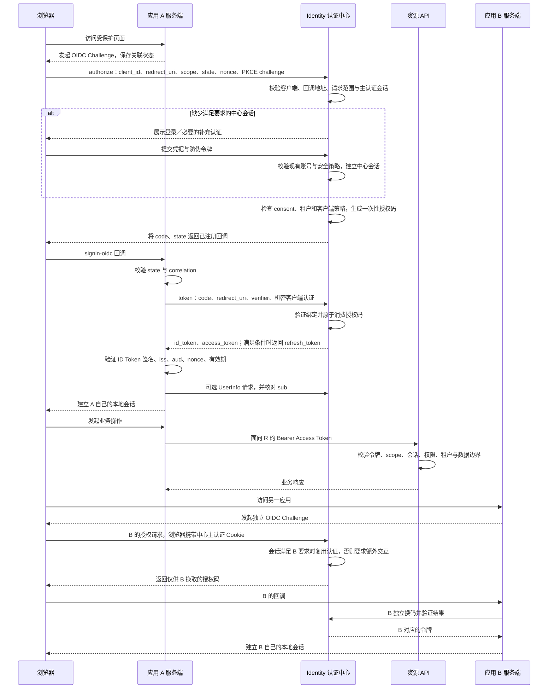

# Full.NET 认证中心与 SSO：eShop 对照研究及验证方案

## 1. 状态、范围与基线

- 日期：2026-09-13。
- 初次研究状态：源码与官方资料核对完成；PoC、集成、浏览器、多实例与 Native AOT 验证均未执行。
- 后续确认：项目所有者于 2026-09-13 要求按建议推进并同步项目文档和执行计划。演进方向已接受，见 [ADR-0011](../architecture/adr/ADR-0011-identity-oidc-sso-evolution.md)、[Identity 规格 §14](../superpowers/specs/2026-07-17-identity-session-foundation-design.md#14-oidc-认证中心与-sso-演进2026-09-13-已确认)及[唯一活动计划](../superpowers/plans/2026-09-13-identity-oidc-sso-evolution.md)；P0 尚未开始。
- 初次研究授权：合并两轮讨论与用户提供的补充分析，形成验证 Markdown；当时不实施认证中心、不新增依赖、迁移或运行服务。后续按已确认计划与阶段门禁推进。
- Full.NET 基线：分支 `main`，HEAD `f74515d1b9e4544e4c75eeb623892970790b4d0c`。工作区已有大量未提交变更，包括 Identity 注册文件；本报告观察的是当前工作区，不能将所有本地事实归于该提交。
- eShop 固定基线：`b4a40872005d4bb29e5b1fa1ff7e244143d39215`。其中央包文件实际指定 Duende IdentityServer 相关包 `7.3.2`；不能用当前 Duende 最新版文档推定示例已经具有新版能力。[包配置](https://github.com/dotnet/eShop/blob/b4a40872005d4bb29e5b1fa1ff7e244143d39215/Directory.Packages.props)
- 方法：阅读相关源码、仓库规则和官方协议／组件资料；未抓取真实登录流量，未测试 eShop 的实际登录、刷新或退出。
- 本文件保留原始评估与待执行验证清单；批准边界以更新后的 Identity 规格、ADR-0011 和执行计划为准，不以报告自身替代设计或提升任何能力为 `Verified`。

## 2. 研究结论

建议优先验证“OpenIddict 协议服务端 + Full.NET 现有 Identity 账号、安全策略与权限体系”。认证中心先作为 Identity 模块内的逻辑能力，通过现有 Composition 装配；不因参考 eShop 就拆分微服务或另建用户数据库。

Full.NET 已有第一方登录、RSA JWT、刷新轮换、会话撤销与外部 OIDC 客户端代码。缺口主要是标准 OIDC 服务端、客户端注册与授权管理、中心登录会话、各应用会话关联以及退出传播。替换 `IAccessTokenIssuer` 不能独自完成这些能力。

优先完成 P0 可行性验证，再考虑管理后台与现有 Vue 登录迁移。若实际需求仅是接入企业已有统一登录，应另选“Full.NET 作为外部 IdP 客户端”路线，而无需自建完整认证平台。

## 3. 对补充分析逐条核对

### 3.1 授权码 + PKCE 不等于浏览器永远拿不到令牌

**结论：方向正确，但混淆了协议流程与客户端部署方式。**

授权码流避免在授权响应中直接返回 Access Token。谁向 token endpoint 换码，取决于客户端：服务端 WebApp／BFF 在服务器换码；纯 SPA 可以由浏览器 JavaScript 换码并持有 Access Token。PKCE 将授权码绑定到发起者持有的 `code_verifier`，不承担隐藏令牌、消除 XSS 或完成客户端身份认证的职责。

eShop WebApp 设置 `ResponseType = code`，使用 ASP.NET Core 服务端 OIDC Handler。IdentityServer 的 `webapp` 注册却设置 `RequirePkce = false`，MAUI 为 `true`。这表示服务端没有强制 WebApp 使用 PKCE，并不等于 WebApp 实际没有发送 PKCE：所用 ASP.NET Core OIDC Handler 的 `UsePkce` 默认是 `true`。实际请求中的 `code_challenge`、`S256` 和换码时的 verifier 仍需要运行时验证。[eShop 客户端注册][eshop-clients]、[WebApp 配置][eshop-webapp]、[UsePkce 官方说明](https://learn.microsoft.com/en-us/dotnet/api/microsoft.aspnetcore.authentication.openidconnect.openidconnectoptions.usepkce?view=aspnetcore-10.0)

Full.NET 建议对交互式客户端显式要求授权码 + PKCE S256，并分别验证公开客户端和机密客户端。禁止把浏览器／移动应用中的固定 client secret 当作可靠秘密。[OAuth 安全最佳实践][oauth-bcp]

### 3.2 SSO 依赖中心主认证会话，不能只看 idsrv.session

**结论：中心会话与应用会话分离是正确的；Cookie 名称与职责需要修正。**

`idsrv.session` 是辅助会话检测 Cookie，从主认证 Cookie 派生，服务于 check-session 场景；它本身不是完整登录凭据。eShop 使用 `AddAspNetIdentity<ApplicationUser>()` 和 `SignInManager`，主认证 Scheme 为 ASP.NET Identity 的 `Identity.Application`。Scheme 名称与浏览器 Cookie 名称也不能混为一谈，实际名称和属性以最终配置及响应为准。[Duende 认证会话说明][duende-session]、[ASP.NET Identity 集成说明][duende-schemes]、[eShop 启动][eshop-program]

至少区分以下状态：

| 状态 | 作用 | 验证重点 |
| --- | --- | --- |
| IdP 主认证会话 | 中心确认当前浏览器已经完成认证 | 过期、撤销、认证强度、账号状态、正确 Scheme |
| 客户端本地会话 | A、B 分别维持自己的登录态 | 各自过期与退出，不能靠共享跨站 Cookie 冒充 SSO |
| 辅助会话检测状态 | 帮助客户端发现中心登录态变化 | 不是认证凭据；浏览器限制下不得作为唯一退出保障 |
| 协议临时状态 | correlation、nonce、PKCE 等 | 防请求混淆、重放和回调替换，按流程清理 |

因此“有两类主要会话”可以成立，“只有两个 Cookie”不成立。只有辅助 Cookie 而没有有效主认证会话时，不应获得免密授权。

### 3.3 SaveTokens 保存已收到的令牌，不自动获取或刷新令牌

**结论：认证票据与后续 API 调用有关，但原文高估了此选项的职责。**

`SaveTokens = true` 将成功认证返回的令牌保存到 `AuthenticationProperties`。eShop 的 `.AddAuthToken()` 实现从当前 `HttpContext.GetTokenAsync("access_token")` 取值并附加 Bearer Header；该 Handler 没有刷新逻辑。[SaveTokens 官方说明](https://learn.microsoft.com/en-us/dotnet/api/microsoft.aspnetcore.authentication.remoteauthenticationoptions.savetokens?view=aspnetcore-10.0)、[eShop HTTP Handler][eshop-http]

eShop 服务端允许 WebApp 请求离线访问，但 WebApp 配置中没有添加 `offline_access`。不能仅凭服务端的 `AllowOfflineAccess` 或 `SaveTokens` 断言正常登录会返回 Refresh Token，更不能断言会自动续期。[客户端注册][eshop-clients]、[实际请求配置][eshop-webapp]

保存到认证票据也不等于存进服务端数据库：Cookie 认证默认可以将受保护的票据放在浏览器 Cookie 中，采用服务端 ticket store 才是另一种存储方式。HttpOnly 意味着 JavaScript 不能直接读取，不意味着浏览器完全不承载票据。Full.NET 应单独决定令牌存储、Cookie 大小、服务端续期和 Blazor 长连接上下文下的取令牌方式。

### 3.4 scope 与 aud 共同限制访问，但不等于完整业务权限

**结论：应保留资源边界思想，修正“API 校验 aud 就足够”的说法。**

- `aud` 回答令牌面向哪个资源服务；`scope` 表示授予的访问范围，两者不等价。
- JwtBearer 校验签名、Issuer、Audience、有效期，并不会自动替每个业务 Endpoint 检查所需 scope、数据归属或用户权限。
- eShop 的共享 API 认证配置虽然设置 `Audience`，同时却设置了 `ValidateAudience = false`。不能将“示例通过 aud 拒绝跨 API 越权”作为已验证事实。[API 认证配置][eshop-api-auth]
- Full.NET 应将客户端可获 scope、用户精确权限、账号／会话状态、租户与数据归属组合判断。公开应用不能得到完整管理权限或超管声明。

现有 `fullnet_scope` 是 Host/Tenant 上下文；新增标准 `scope` 时保留两者独立语义，禁止覆盖旧 Claim。[Full.NET Claim 契约](../../src/Modules/Full.NET.Modules.Identity.Contracts/FullNetIdentityClaimTypes.cs)

### 3.5 API 不回调 IdP 仅描述离线 JWT 验证模式

**结论：不是所有 API 的必然行为，也不适用于 Full.NET 当前会话约束。**

JWT 的密码学校验可使用缓存的公钥离线完成；首次拉取元数据、密钥刷新仍可能访问 IdP。业务授权还可能访问数据库。Introspection 是在线状态查询，不是离线验签自动附带的即时撤销机制；其缓存会影响撤销延迟。

Full.NET 在 JwtBearer 验签后执行 `AccessSessionValidator`，查询权威会话、账号与租户状态。认证中心接入不能为了复用“API 不查库”的说法而删除该保护。[JwtBearer 事件](../../src/Modules/Full.NET.Modules.Identity/Security/FullNetJwtBearerEvents.cs)、[会话校验](../../src/Modules/Full.NET.Modules.Identity/Security/AccessSessionValidator.cs)

令牌记录标记撤销、阻止刷新、清除浏览器会话、让资源 API 拒绝既有令牌是不同动作。现有受保护管理路径应继续在后续请求中查询权威状态；将来外部 API 若采用短期离线 JWT，必须单独约定最大撤销延迟，不能宣称即时下线。[OpenIddict 令牌存储][openiddict-storage]

### 3.6 第二个客户端免密登录有条件，全局退出也需另行实现

**结论：第二客户端复用中心认证是 SSO 的关键，但不能保证永远直接发 code。**

中心会话必须仍有效，且满足目标客户端要求。`prompt=login`、`max_age`、更高认证强度、账号停用、租户选择或 consent 都可能要求额外交互。`prompt=none` 在无法静默完成时应返回协议错误，而不是绕过这些要求。[OIDC Core][oidc-core]

eShop 的 `LogOutService` 调用本地 Cookie 与 OIDC 两个 Scheme 的 `SignOutAsync`；中心侧通过 `SignInManager.SignOutAsync` 清理其认证会话。这是可参考的退出衔接，但不能据此断言其他客户端的本地 Cookie、离线 JWT 和 Refresh Token 都已撤销。[WebApp 退出][eshop-logout]、[中心登录／退出][eshop-account]

Full.NET 需要分别定义“退出当前应用”“退出中心及所有已接入应用”“管理员强制下线”，以及通知重试和客户端不可达时的失效上界。

## 4. 登录与 SSO 时序

以下是建议验证的服务端 WebApp／BFF 授权码 + PKCE 模型，不是本轮运行 eShop 后采集的实际轨迹。采用纯 SPA 时，换码方和令牌存储位置不同。

`state`、`nonce`、PKCE 和客户端认证承担不同职责，不能互相替代。前通道使用 query、form_post 或其他标准传输方式不改变授权码绑定与结果验证要求。UserInfo 只应在配置需要且已取得适用 Access Token 时调用。[OIDC Core][oidc-core]、[OAuth 安全最佳实践][oauth-bcp]

## 5. eShop 的可吸收点与排除项

| 主题 | 可吸收 | 不直接照搬 |
| --- | --- | --- |
| 职责分工 | 用户规则、协议引擎、登录 UI 分开 | 重建平行用户库或复制 EF Core／PostgreSQL 数据层 |
| 客户端管理 | 独立 client_id、精确回调和 scope 白名单 | 固定 secret、Implicit、生产客户端全免 consent |
| 用户信息 | 通过 Profile 边界向客户端提供身份 | 示例 ProfileService 收集卡号与安全码等敏感声明 |
| 密钥 | 集中签发、资源服务验证 | DeveloperSigningCredential、临时 key 文件与关闭密钥管理 |
| 持久化 | 区分用户数据、客户端配置与授权状态 | 将内存客户端配置误当成完整生产管理能力 |
| 运维 | 可独立观察认证入口 | API 启动即迁移与播种、关闭 HTTPS 元数据检查 |

eShop 的 `identitydb` 承载其用户 EF 存储，Client／Scope／Resource 在启动时以内存配置注册；仅引用 Duende EF 包不能证明配置和授权状态均已持久化。上述判断来自[启动代码][eshop-program]、[项目文件][eshop-project]与[ProfileService][eshop-profile]。注册页面、密码找回等完整生命周期本轮未做端到端核对，不因存在模型或依赖而标记为完整功能。

## 6. Full.NET 现有基础与设计接缝

| 代码入口 | 源码观察 | 后续验证要求 |
| --- | --- | --- |
| [Login Handler](../../src/Modules/Full.NET.Modules.Identity/Features/Login/Handler.cs) | 密码、安全戳、账号状态、锁定、登录会话与审计 | 中心登录复用这些规则，不能另写简化认证旁路 |
| [JWT Issuer](../../src/Modules/Full.NET.Modules.Identity/Security/JwtAccessTokenIssuer.cs) | 自有 JWT 与租户／权限声明 | 按 client／resource 分配声明，ID Token 与 Access Token 用途分开 |
| [认证注册](../../src/Modules/Full.NET.Modules.Identity/DependencyInjection/IdentityAuthenticationServiceCollectionExtensions.cs) | 固定配置的 Issuer／Audience／密钥环及 JWT 事件 | 新旧 Scheme 明确路由，未知 Issuer 默认拒绝 |
| [Refresh Handler](../../src/Modules/Full.NET.Modules.Identity/Features/RefreshSession/Handler.cs) | 刷新产生新记录，继承会话族，旧记录消费后失效 | 中心会话、客户端会话和令牌族分离，不能把轮换记录 ID 直接作为稳定 SSO sid |
| [OAuthFlow](../../src/Modules/Full.NET.Modules.Identity/Features/OAuthFlow/OAuthFlowService.cs) | 接入外部 IdP 并关联本地用户 | 保留客户端与服务端角色区别；外部身份不能按未验证邮箱自动合并 |
| [Claim 契约](../../src/Modules/Full.NET.Modules.Identity.Contracts/FullNetIdentityClaimTypes.cs) | `fullnet_scope`、租户、权限与安全戳是现有契约 | 新增 OAuth scope 不覆盖旧值，迁移需要兼容测试 |

建议首期使用现有 Host 账号和两个受控第一方应用验证，避免同时重构跨租户账号体系。租户阶段必须明确稳定用户身份、应用授权、租户成员关系与各应用活动租户；客户端提交的 tenant 只能作为请求，不能作为可信上下文。

建议边界如下，均为待验证设计：

1. Identity 保持账号与认证状态所有权；业务模块继续自行执行精确权限与数据边界，跨模块不得直查 Identity 表。
2. 协议层由 OpenIddict 承担；不自制授权码、Discovery、JWT 协议栈来替代成熟组件。
3. 自定义 Application／Authorization／Scope／Token Store 经 Full.NET 自有 Dapper 执行与事务边界访问双库。需要验证组件查询接口、并发、撤销、清理和缓存语义，不能只实现简单 CRUD。
4. 中心登录 Cookie 与客户端 Cookie 不共用域级万能登录凭据；正常 SSO 使用顶层浏览器跳转，不依赖第三方 Cookie iframe 静默登录必然成功。
5. 新旧会话并行期不允许“只要 JWT 签名通过就接受”；接入适配必须重新获得可信账号、客户端、会话、权限和租户上下文。
6. OAuth／OIDC 协议端点使用标准协议响应及错误格式；业务管理 API 继续遵守 ProblemDetails。该边界需在后续批准设计中明确，防止被统一包络或异常中间件改写。
7. Discovery 中的 Issuer 使用稳定 HTTPS 地址；JWKS 只公开公钥。签名密钥、加密密钥与 Data Protection key ring 分清职责，同一服务的多实例共享必要材料，不要求无关应用共享解密密钥。
8. 多实例客户端禁用、授权撤销不能仅依靠库内进程缓存。强一致状态按既有缓存规则处理；缓存通知不进入 Outbox，可靠跨应用退出通知若需持久化投递则另定义事务、幂等与重试边界。

相关项目约束：[模块与安全规则](../../rules/development-quality.md)、[Native AOT 规则](../../rules/native-aot.md)、[Vue 客户端规则](../../rules/client-frontend.md)。

## 7. 选型建议与 P0 验证范围

| 候选 | 本项目适配判断 | 尚需证明 |
| --- | --- | --- |
| OpenIddict + 现有 Identity | 优先验证；协议与账号实现可分离，支持自定义 Store | Dapper 双库完整语义、Linux Native AOT、会话衔接、后续维护成本 |
| Duende + 现有 Identity | 有商业支持需求时的备选 | 生产与再分发授权、实际所选版本功能与运行闭包 |
| 外部 IdP | 企业统一登录接入路线的候选 | 账号权威源、用户绑定、租户映射、现有本地会话与上游撤销联动 |

OpenIddict 使用 Apache 2.0，用户认证由应用提供；官方支持自定义 Store。7.0 发布说明声明 .NET 9 及以上的组件裁剪／Native AOT 支持，但完整 Full.NET 依赖闭包必须另外验证。[许可](https://openiddict.com/)、[组件边界](https://documentation.openiddict.com/introduction)、[AOT 发布说明](https://kevinchalet.com/2025/07/07/openiddict-7-0-is-out/)

Duende 的生产使用和产品再分发分别受其授权约束，eShop 的 MIT 不能自动覆盖这些条件。[Duende 授权](https://docs.duendesoftware.com/general/licensing/)

P0 应锁定组件版本、目标 RID 与运行配置，并用最小探针回答：

- 现有密码认证如何建立中心会话；客户端会话如何与旧验证器兼容。
- 两个客户端能否真实完成授权码交换，授权码是否只能消费一次。
- 四类 Store 是否能通过自有执行器运行；不支持的查询表达式如何在适配边界明确处理。
- OpenIddict 默认 Access Token 加密如何与现有 JwtBearer 衔接。需明确选择签名 JWT、JWE 支持或其他验证方式，不靠共享中心私钥给资源 API 解决。[令牌格式](https://documentation.openiddict.com/configuration/token-formats.html)
- 禁用账号、撤销会话和刷新重用后，资源 API 是否继续满足现有拒绝语义。
- 同一最小流程能否在 SQL Server、MySQL 及 Linux Native AOT 实际执行。

P0 不建设通用管理后台，不开放动态客户端注册，不引入 SAML、CAS、设备流、令牌交换或机器身份流。MFA／认证强度保持现有保护要求，不把现有 TOTP 强重认证能力直接宣称为已实现 OIDC MFA 登录。

## 8. 待执行验收矩阵

下表所有项目状态均为“未执行”。证据须记录代码 SHA、工作区状态／后续任务快照、组件版本、数据库、RID、客户端模式、实际断言、执行结果与 CI／日志链接；日志与 HAR 不保存可重放令牌、Cookie 或密码。

| 编号 | 场景／操作 | 必须观察到的结果 |
| --- | --- | --- |
| V01 | A 首次登录，检查授权和换码请求 | code 流、PKCE S256、关联 state／nonce；BFF 模式下令牌不暴露给页面 JS |
| V02 | 缺失／错误 verifier，授权码用于另一 client 或回调 | 标准协议错误，不返回令牌 |
| V03 | 同一授权码顺序重放及跨实例并发换码 | 两种数据库中最多一次成功，不产生多份有效授权 |
| V04 | 替换 state、correlation、nonce，使用错误 Issuer 的 ID Token | 客户端拒绝建立本地会话 |
| V05 | A 登录后访问独立 Origin 的 B | B 通过中心授权获得自己的会话，无需再次输密码；不复制 A 的令牌或 Cookie |
| V06 | 仅保留辅助 Cookie；或使用 prompt=login、过期 max_age | 辅助 Cookie 不能认证；需要重新认证时不得静默放行 |
| V07 | 无可用中心会话时 prompt=none；需要 consent／更高强度 | 返回适当协议错误或正常交互，不绕过要求 |
| V08 | 对比未请求／获准请求 offline_access | 明确是否获得 Refresh Token；SaveTokens 不自行增加授权范围 |
| V09 | Access Token 到期，检查续期与并发刷新 | 仅由明确的刷新实现续期；重用按策略拒绝和撤销，Cookie 票据同步正确 |
| V10 | 向 API 发送错误 aud／iss／过期令牌／ID Token | 验证失败；不能用 ID Token 调业务 API |
| V11 | 缺 scope、有 scope 无业务权限、无数据归属 | 均按对应边界拒绝；前端隐藏不是唯一授权 |
| V12 | 伪造 tenant、跨租户读取、单应用切换租户 | 不越权；其他应用的租户上下文不被隐式改变 |
| V13 | 停用账号、改密、安全戳变化、管理员强制下线 | 后续受保护 Full.NET 请求和刷新被拒绝；中心不能凭旧会话重新发有效授权 |
| V14 | 退出当前应用、退出全部应用、客户端离线 | 按各操作定义清理；记录未通知客户端的失效上界和重试结果 |
| V15 | 客户端／授权禁用后命中另一实例旧缓存 | 不继续发新授权或刷新；既有 API 令牌按已声明撤销策略失效 |
| V16 | 双实例交错登录、换码、刷新、重启 | 状态可恢复，无进程内独占依赖；回调与票据不因落到另一实例失败 |
| V17 | 签名和加密密钥轮换，资源 API 刷新 JWKS | 新旧合法令牌按窗口验证；未知／退役密钥拒绝，JWKS 不泄露私钥 |
| V18 | 非法 redirect_uri、退出回跳、伪造代理头、恶意 Origin | 精确回调与代理信任生效；浏览器会话写操作保留 CSRF 与限流 |
| V19 | 双库过期清理、撤销事务失败、迁移中断恢复 | 无半完成有效授权、可重试恢复；API／Worker 不迁移或播种 |
| V20 | Linux 原生产物实际启动并执行 V01／V03／V10／V13 | 无运行时闭包缺失；不能用 JIT 通过或测试发现替代 |
| V21 | 新旧认证 Scheme 并行、切回旧登录入口 | 既有用户、权限、租户、改密和会话约束不退化；未知令牌不兜底接受 |
| V22 | 无痕浏览器、不同站点、第三方 Cookie 受限 | 正常顶层跳转可用；不将未实现的 iframe 静默登录当作阻塞条件 |
| V23 | 模拟状态库不可用、退出通知失败 | 受保护状态检查失败关闭；通知有界重试，不能误报全部退出成功 |
| V24 | 检查票据体积、Claim、日志及错误内容 | 不包含卡数据、安全戳等不必要对外信息；不泄露秘密或内部异常 |

V14／V15 的跨应用传播时限、外部 API 离线令牌存活窗口，应在实施前明确数值和测量方法；目前未决定，因此不能据此给出“全局即时下线”的能力承诺。

## 9. 阶段建议与停止条件

| 阶段 | 交付范围 | 退出条件 |
| --- | --- | --- |
| P0 可行性 | 固定客户端探针、Dapper Store、会话与令牌适配、AOT | 最小真实登录闭环、双库一次性消费、旧会话保护与 Linux 原生运行有证据 |
| P1 最小 SSO | 中心登录 UI、两个受控应用、Discovery／JWKS、授权／令牌／UserInfo、基础退出 | 真实浏览器完成跨应用免密登录和负向协议验证 |
| P2 接入治理 | 客户端／scope 管理、授权撤销、刷新、全局退出、多实例、密钥轮换 | 撤销策略和传播上界实测成立，双库状态并发与恢复通过 |
| P3 Vue 迁移 | 服务端回调或 BFF 决策、旧入口并行、契约兼容、监控回退 | 原有权限、租户和会话保护回归通过，旧入口退役条件明确 |

如果需要以关闭 Host.Api AOT、引入未批准 EF Core、跨模块直查表、放松会话撤销或扩大客户端信任来换取 PoC 成功，应停止该路径并记录原因，重新比较架构候选。新增独立宿主、改变长期契约或数据所有权应按现有规则确认设计，不由本报告自动批准。

未来实施的测试位置、影响集和 GitHub Actions 门禁统一遵循[测试与验证](../../rules/development-quality.md#11-测试与验证)与[Native AOT 规则](../../rules/native-aot.md)。本报告不建立另一套测试流程，不复制测试数量门槛，不因计划列出项目就认定运行通过。

## 10. 初次研究证据与未验证项

已核对：两份用户分析、本文列出的 eShop 源码、Full.NET 认证接缝及官方资料。补充分析不能原样作为实施依据，主要修正为 PKCE 的适用边界、中心主 Cookie 与辅助 Cookie、SaveTokens／offline_access、scope／aud／业务权限分工，以及离线 JWT 与即时撤销的区别。

本轮只新增本文件；文档结构、UTF-8、仓库内相对链接与空白检查属于文档验证，不证明 SSO 可运行。未执行 eShop／Full.NET 服务启动、网络抓包、双库集成、真实浏览器、多实例、故障注入、组件漏洞审计、OIDC 一致性认证或 Native AOT 发布。V01—V24 保持未执行；OpenIddict 保持首选候选而非最终选型。

| 本轮文档检查 | 实际结果 |
| --- | --- |
| `node --input-type=module -` 执行聚焦检查，调用现有 `validateMarkdownBuffer` 并验证链接／围栏／编号 | 通过：UTF-8 有效，15 个本地链接存在，14 个参考链接定义完整，Mermaid 围栏闭合，24 个验收编号唯一且保持未执行；未验证 Mermaid 渲染效果 |
| `git diff --no-index --check -- /dev/null docs/verification/2026-09-13-identity-oidc-sso-research-validation.md` | 无空白错误诊断；退出码 1 表示新增文件与空文件有差异。初次检查脚本把该退出码误判为失败，随后修正为检查诊断内容并独立检查行尾空白。Git 的 LF／CRLF 提示不是空白错误 |
| 本文件范围的 `git diff --check`、`git status --short` 与 `git branch --show-current` | 无空白错误；新文件未跟踪；分支仍为 `main`，未提交或推送 |

## 11. P0 执行记录

### T00（2026-09-15）：冻结最小实验输入，验证依赖和静态注册

| 项 | 证据 |
| --- | --- |
| 基线 | 分支 `main`；任务快照 `identity-oidc-sso-p0`（复用已有快照）；代码工作 HEAD 以实施时工作区为准 |
| 组件版本 | OpenIddict **7.7.0**（`OpenIddict.Abstractions` / `OpenIddict.Core` / `OpenIddict.Server` / `OpenIddict.Server.AspNetCore`）；许可证 Apache-2.0；未引入 EF/Mongo 持久化包 |
| 传递依赖调整 | 中央包将 `Microsoft.Extensions.Options`、`Microsoft.Extensions.DependencyInjection` 升至 **10.0.11** 以满足 OpenIddict 7.7.0 下限 |
| 静态注册 | `AddIdentityOidc` 默认 `Identity:Oidc:Enable=false`；启用时静态注册 `AddOpenIddict().AddCore().AddServer()` 与 PKCE S256；未映射协议端点 |
| 负向配置 | `IdentityOidcOptionsTests`：默认未启用；Production 启用缺 Issuer/持久化密钥失败；通配/任意回调拒绝（6 发现，0 失败） |
| 架构边界 | `IdentityOidcBoundaryTests`：无 EF/持久化包、无跨模块实现引用、无通配协议授权例外（5 发现，0 失败） |
| AOT analyzer | `pnpm test:aot:analyzers` 退出码 0（Windows 本地，2026-09-15） |
| 未验证 | V01—V24 运行场景、双库 Store、Linux 原生发布、SSO 浏览器、T02 消费方适配（§6 三组入口） |

**T00 结论：** 静态闭包与负向配置门禁通过；仅证明依赖可编译装配与配置边界，不证明协议可运行或 P0 Go。

### T01（2026-09-15）：协议持久化与一次性状态

| 项 | 证据 |
| --- | --- |
| 迁移 | **216** `IdentityOidcProtocolState`：四表 `fn_identity_oidc_application` / `_authorization` / `_scope` / `_token`；双库 expand-only；`object-comments.json` 已登记 |
| Store | OpenIddict 7.7.0 四类 Dapper Store（`IQueryExecutor` / `ICommandExecutor`）；`Replace*Store` 静态注册；LINQ 重载显式 `NotSupportedException` |
| V03 | `IdentityOidcStoreAssertions`：8 路并发授权码兑换仅 1 次成功（CAS `RedeemAuthorizationCode`） |
| V15 | 撤销授权后换新 Store 实例仍无法兑换；`RedemptionDateUtc` 保持为空 |
| V19 | `Migration216IdentityOidcRecoveryTests`：全量与 token 表中断恢复（SQL Server + MySQL，4/4） |
| 双库入口 | `IdentityApiSqlServerTests` / `IdentityApiMySqlTests` 挂接 `IdentityOidcStoreAssertions` |
| 聚焦验证 | `pnpm test:dotnet:unit -- --selection identity-oidc` 6/6；`pnpm test:dotnet:architecture -- --selection identity-oidc` 5/5；集成 `Oidc_stores_enforce_redemption\|recovers_oidc_protocol\|recovers_partial_token_schema` 6/6（Windows 本地，2026-09-15） |
| 未验证 | 协议 HTTP 端点（T03/T04）、中心会话衔接（T02）、Linux Native AOT 运行时、V01—V24 其余场景 |

**T01 结论：** Store 层 V03/V15/V19 在双库成立；不证明 OIDC 协议端点可运行或 P0 Go。

### T02（2026-09-15）：中心会话、应用会话与旧会话衔接

| 项 | 证据 |
| --- | --- |
| 迁移 | **217** `IdentityOidcSession`：`fn_identity_oidc_center_session` / `fn_identity_oidc_application_session`；双库 expand-only；`object-comments.json` 已登记 |
| 服务 | `IdentityOidcSessionService`、`IdentityOidcPrincipalFactory`、`IdentityOidcAccessSessionValidator`；`AccessSessionValidator` 按 Issuer 路由 |
| 消费方 | `CurrentSessionAuthorization`、`BackgroundSessionBindingValidator`、`IdentitySessionContextService`、`HostOnlineSessionManagementService` / `HostOnlineSessionQueryService` |
| V10/V12/V13/V21/V23 | `IdentityOidcPrincipalTests`、`IdentityOidcSessionTests`、`IdentityOidcSessionAssertions` |
| 迁移恢复 | `Migration217IdentityOidcSessionTests`（SQL Server + MySQL，4/4） |
| 聚焦验证 | 单元 `IdentityOidcSession\|IdentityOidcPrincipal` 7/7；集成 `Oidc_session\|Migration217IdentityOidc` 6/6（Windows 本地，2026-09-15） |
| 双库入口 | `IdentityApiSqlServerTests` / `IdentityApiMySqlTests` 挂接 `IdentityOidcSessionAssertions` |
| 未验证 | 旧登录全量回归、协议 HTTP 端点（T03）、Linux Native AOT 运行时 |

**T02 结论：** 中心／应用会话权威与消费方适配在单元与双库服务层成立；完整协议入口与旧体系回归由 T03 与专项回归补齐。

### T03（2026-09-15）：最小标准授权闭环与两个客户端夹具

| 项 | 证据 |
| --- | --- |
| 协议端点 | `/.well-known/openid-configuration`、`/.well-known/jwks`、`/connect/authorize`、`/connect/token`、`/connect/userinfo`；OpenIddict 7.7.0 passthrough + 中心登录 HTML |
| 签名 | `IdentityOidcSigningKeyRing`；`DisableAccessTokenEncryption()`；Access Token 为签名 JWT（`token_use=access`） |
| 宿主上下文 | `IdentityOidcHostContextMiddleware`（`InvokeAsync` 注入 Scoped 租户写入器，认证前建立 Host 上下文） |
| 客户端 | `IdentityOidcClientRegistrar` 同步 A/B 夹具；`AllowRefreshTokenFlow()` + `offline_access` scope |
| V01/V02/V08/V10/V18 | `IdentityOidcProtocolAssertions` + `IdentityOidcRelyingPartyFixture`（PKCE S256、双库） |
| 聚焦验证 | 单元 `IdentityOidc` 15/15；集成 `Oidc_protocol_authorization_flow` SQL Server + MySQL 2/2（Windows 本地，2026-09-15） |
| 未验证 | §6 三组入口全量验收、V04 nonce 客户端校验专项、V09 票据保存、Linux Native AOT（T04）、旧登录全量回归、`pnpm test:aot:analyzers` 对 `IdentityOidcStoreSupport` 既有 IL 告警 |

**T03 结论：** 双客户端 PKCE 授权码闭环、UserInfo、协议/业务错误边界在双库 HTTP 入口成立；§6 消费方入口与 AOT 运行时证据仍待 T04 与专项回归。

### T04（2026-09-15）：Linux Native AOT 与双实例可行性

| 项 | 证据 |
| --- | --- |
| 原生夹具 | `NativeApiOidcE2EAssertions`、`NativeApiOidcSqlServerE2ETests`、`NativeApiOidcMySqlE2ETests`；复用 `IdentityOidcProtocolAssertions` HttpClient 重载 |
| CI 入口 | `pnpm test:aot:native:oidc:e2e` → `scripts/testing/run-native-aot-oidc-e2e.mjs`；`eng/testing/test-matrix.json` `nativeAotOidcIntegration`（6 项，45m）；`.github/workflows/api-native-aot-linux.yml` |
| V01/V02/V08/V10/V18 | 原生进程复跑 `IdentityOidcProtocolAssertions`（双库各 1 项） |
| V13/V21 | §6 最小路径：OIDC 在线会话强制下线后 `/api/v1/me` 拒绝；OIDC 令牌拒绝租户切换（`identity.oidc_context_switch_not_supported`）；旧 Host 令牌切租户仍可用 |
| V12/V21 | 工具入口：`/api/v1/ai/agent-tools` 接受 OIDC Access Token |
| V16/V17 | 双实例共享持久化签名环：实例 A 授权、实例 B 换码成功；JWKS 返回至少 1 个公钥 |
| Windows 本地 | `pnpm test:aot:native:oidc:e2e` 发现门禁 6/6 Inconclusive；不冒充 Linux 原生执行 |
| 未验证 | Linux 原生产物实测、V03 原生并发换码、V17 密钥轮换窗口、中心重启探针、§6 全量新旧混合场景、P0 Go/No-go 最终结论 |

**T04 结论：** 原生门禁与 §6 最小消费方路径已挂接并可由 Linux CI 执行；P0 Go 仍依赖 fresh Linux 双库 TRX 与计划复核，Windows 发现不能单独作依据。

## 12. 2026-09-16 接手审查与安全修复

接手基线 `main` / `0ccfbe1cecae2a4f30698df8a279cb91c3e8cc8d`，任务快照 `identity-oidc-takeover-20260916`。范围为审查 Cursor 已实现的 OIDC 并修复确认缺口，不代表完成全部认证中心、SSO 或 Vue 迁移。既有文档勾选不代替实际运行证据。

| 确认问题 | 本轮修复与验证边界 |
| --- | --- |
| OIDC 权威查询覆盖调用者租户上下文，取消／异常路径也不恢复；未知 token_use 可被接受 | HostOnly 查询使用临时 Host 上下文，finally 恢复原状态；仅接受精确 access。新增 8 个回归，其中 7 个在修复前失败 |
| 中心登录表单可被跨站构造，无防伪校验 | GET 签发防伪 Cookie／表单令牌，凭据 POST 先验证再执行；无效请求不写中心 Cookie。共享 HTTP 夹具增加裸表单拒绝与正确表单提交，浏览器与双库运行待 CI |
| max_age 仅回传、不执行；未维护原始认证时间 | Cookie 和授权主体记录中心会话创建时间；过期、缺失、未来时间以及 max_age=0 不复用 Cookie，prompt=none 返回 login_required；auth_time 仅向 ID Token 投影 |
| profile 字段无条件外发，签发暂存标记被删除，多项权限 ToString 后丢失语义 | 依 profile scope 设置公开 destinations；暂存分类／权限仅留在加密协议令牌中；未知客户端分类不提升为第一方；权限使用重复 Claim。两次签发处理回归与实际 JWT 双库断言分别保留 |
| OIDC 错误／登录响应使用匿名 JSON，Store／元数据使用反射序列化 | 具名响应契约、显式源生成元数据；持久化单独使用默认 JSON 格式闭包，不改变数据库已有扩展属性键名。AOT 分析初次发现 24 个 IL2026/IL3050 错误，修复后 0 警告、0 错误 |
| 既有注册、权限快照及 Integration 总门槛未随 OIDC 同步 | 补齐明确服务及 9 项治理权限；主分片合计为 863，全量门槛由旧 855 上调至 863；未降低任何门禁 |

协议新增回归在修复前为 12 项中 8 失败；扩至 Identity 全部测试后发现的 3 个旧断言失败已修正。独立只读审查未发现本轮协议修复的明确阻断回归；该审查不替代双库或真实浏览器执行。

本次新增 27 个 Unit 测试用例，登记到唯一测试矩阵；只扩展既有 Integration 断言，未新增 Integration 顶层用例。精确验证结果如下（全部是本地证据）：

| 命令／门禁 | 结果 |
| --- | --- |
| `pnpm test:dotnet:unit -- --filter 'FullyQualifiedName~Full.NET.UnitTests.Identity.' --minimum-expected-tests 357` | 357 通过，0 失败、0 跳过；新增回归及全部 Identity 单元测试 |
| `pnpm test:dotnet:architecture -- --filter 'FullyQualifiedName~IdentityOidcBoundaryTests\|FullyQualifiedName~NativeAot\|FullyQualifiedName~MemoryPackControlledProtocol' --minimum-expected-tests 41` | 78 通过，0 失败、0 跳过；包含原有匿名对象失败检查 |
| `pnpm test:governance` | 53 通过，0 失败；含 UTF-8 文档检查与测试矩阵一致性 |
| `pnpm test:aot:analyzers` | 通过，0 警告、0 错误；这是分析构建，不是 Linux 原生发布或运行 |
| `pnpm test:integration:tooling` | 46 通过，0 失败 |
| `dotnet build tests/Full.NET.IntegrationTests/Full.NET.IntegrationTests.csproj --configuration Release --nologo -clp:ErrorsOnly` | 编译通过，0 警告、0 错误；未运行双库集成 |
| 本任务 `git diff --check`、新增文件 UTF-8／空白及文档本地链接检查 | 通过；分支仍为 main，HEAD 未改变 |
| `pnpm test:integration:affected:plan -- --snapshot identity-oidc-takeover-20260916 --phase inner` | 成功生成 Identity 影响集；仅计划，未运行数据库 |

**未关闭事项：** OIDC 切租户仍返回 `identity.oidc_context_switch_not_supported`；UserInfo／换码／刷新与权威撤销的完整矩阵还需继续审查和回归；双库实际 JWT、真实防伪交互、浏览器 SSO、多实例和 Linux 原生门禁需在后续授权提交对应的 CI 验证。未提交、推送或部署，不把本轮 Unit／分析构建升级为 P0 Go 或 Verified。继续按[唯一执行计划](../superpowers/plans/2026-09-13-identity-oidc-sso-evolution.md)推进。

## 13. T08 Vue 消费与并行入口（2026-09-16）

| 项 | 证据 |
| --- | --- |
| 基线 | 分支 `main`；记录 HEAD `2ce7294d`；默认 `legacy` 用户名密码登录不变 |
| 启用方式 | `VITE_IDENTITY_AUTH_MODE=oidc-center`；`VITE_IDENTITY_OIDC_CLIENT_ID` 默认 `admin-spa`；样例见 [`ui/admin/.env.example`](../../ui/admin/.env.example) 与 [getting-started §3.1](../development/getting-started.md#31-vue-管理端) |
| 登录／回调 | `oidc-center-login`（PKCE、`#/identity/oidc/callback`）；`OidcCallbackView`；`App.vue` 匿名回调路由走 `router-view` 而非 `LoginView` |
| 会话 | `session.ts`：`externalRefreshAccessToken`、应用＋中心 logout、`handleRemoteSessionRevoke`；refresh token 仅存 `sessionStorage`（`fullnet.admin.oidc.refresh`），access token 仍仅内存 |
| 路由守卫 | `selfServicePaths` 含 `/identity/oidc/callback`；已认证用户无需导航下发即可进入回调页 |
| 切租户 | `session-oidc-center-switch-tenant.test.ts`：OIDC 会话成功切换后替换内存 token 并重载授权快照；API 返回 `identity.oidc_context_switch_not_supported` 时保留 Host 上下文与 refresh 凭据 |
| 并发刷新 | `session-oidc-center-restore.test.ts`：并行 `restore` 时 token 交换经 `sessionRefreshCoordinator` 串行化，不出现重叠 `/connect/token` 请求（V09/V18 回归） |
| 真实栈 E2E | Playwright `vue-admin-oidc-center`（25175，`admin-oidc-center.spec.mjs`：登录、刷新、Host／租户工作台 `/api/v1/me` 探针、工作流待办页与 `/api/v1/workflow/todos/mine` 正／负 API 探针、同意／驳回操作（§6 审批探针）、Agent 工具页与 `/api/v1/ai/agent-tools` 正／负 API 探针（§6 V12/V21）、后台任务定义页与触发操作、退出／强制下线后 access token 无法再次触发任务（§6 后台任务探针）、切租户并返回 Host、租户内受保护页面与切租户后工作流待办／Agent 工具 API 探针（§6 上下文切换）、退出后受保护路由回登录／access token 与 refresh 拒绝、强制下线后 access token／refresh 拒绝且无法用已撤销 refresh 恢复（§6 在线会话探针））；`vue-admin`（25173）`auth-smoke` 断言 legacy 不展示身份中心入口 |
| 并行回退 | [getting-started §3.1](../development/getting-started.md#31-vue-管理端) 记录移除 `VITE_IDENTITY_AUTH_MODE` 后回到 legacy 表单的本地验证步骤；`vue-admin` `auth-smoke` 断言遗留 `fullnet.admin.oidc.refresh` 不阻断 legacy 密码登录、登录后不写入新 OIDC 凭据，且刷新后仍通过 Refresh Cookie 恢复 legacy 会话 |
| 聚焦验证（Windows 本地，2026-09-16） | `ui/admin` OIDC 相关 Vitest **35/35**；`@fullnet/client-contracts` `identity-auth-config` + `oidc-interactive-auth` **11/11**；`admin-real-stack` `spec-contracts` 治理测试登记 oidc-center 项目与 §6 探针契约；E2E 聚焦入口 `pnpm test:e2e:real:oidc-center`（23 用例，待 CI／本机真实栈执行） |
| 未验证 | 真实栈 E2E 未在本机执行（API `5149` 未就绪）；`main` push 时 CI `real-stack-e2e` 通过 `pnpm test:e2e:real` 执行 legacy 与 oidc-center 全量 Playwright 项目（治理测试已登记，fresh TRX 证据待 push 后采集）；§6 三组入口全量验收、能力状态 `Verified` 升级 |

**T08 结论：** Vue 可选 `oidc-center` 消费路径与 legacy 并行入口在单元层成立；生产启用与 P3 退出条件仍依赖真实栈 E2E、§6 回归与能力状态独立门禁，不得由单元测试单独升级为 `Verified`。

[eshop-program]: https://github.com/dotnet/eShop/blob/b4a40872005d4bb29e5b1fa1ff7e244143d39215/src/Identity.API/Program.cs
[eshop-clients]: https://github.com/dotnet/eShop/blob/b4a40872005d4bb29e5b1fa1ff7e244143d39215/src/Identity.API/Configuration/Config.cs
[eshop-webapp]: https://github.com/dotnet/eShop/blob/b4a40872005d4bb29e5b1fa1ff7e244143d39215/src/WebApp/Extensions/Extensions.cs
[eshop-http]: https://github.com/dotnet/eShop/blob/b4a40872005d4bb29e5b1fa1ff7e244143d39215/src/eShop.ServiceDefaults/HttpClientExtensions.cs
[eshop-api-auth]: https://github.com/dotnet/eShop/blob/b4a40872005d4bb29e5b1fa1ff7e244143d39215/src/eShop.ServiceDefaults/AuthenticationExtensions.cs
[eshop-account]: https://github.com/dotnet/eShop/blob/b4a40872005d4bb29e5b1fa1ff7e244143d39215/src/Identity.API/Quickstart/Account/AccountController.cs
[eshop-logout]: https://github.com/dotnet/eShop/blob/b4a40872005d4bb29e5b1fa1ff7e244143d39215/src/WebApp/Services/LogOutService.cs
[eshop-project]: https://github.com/dotnet/eShop/blob/b4a40872005d4bb29e5b1fa1ff7e244143d39215/src/Identity.API/Identity.API.csproj
[eshop-profile]: https://github.com/dotnet/eShop/blob/b4a40872005d4bb29e5b1fa1ff7e244143d39215/src/Identity.API/Services/ProfileService.cs
[duende-session]: https://docs.duendesoftware.com/identityserver/ui/login/session/
[duende-schemes]: https://docs.duendesoftware.com/identityserver/identity/aspnet-identity/schemes/
[oidc-core]: https://openid.net/specs/openid-connect-core-1_0.html
[oauth-bcp]: https://www.rfc-editor.org/rfc/rfc9700.html
[openiddict-storage]: https://documentation.openiddict.com/configuration/token-storage.html
