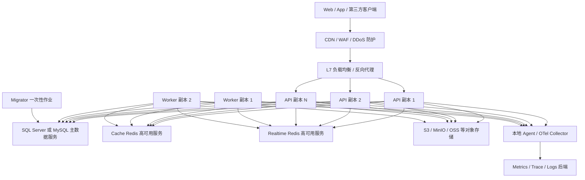

# 高并发模块化单体多实例改造评估与路线建议

- 日期：2026-08-01
- 状态：封板评估证据（架构决策已上收总体 Spec 与 ADR-0005；唯一活动实施计划已生成，运行时实现与容量认证待执行）
- 原始代码评估基线：`6e156f59c5ff314610c07d46472172a7a89d6e49`
- 本轮文档补充复核基线：`e2ee63c8a925592339b16953867b6da5a504a339`
- 原始任务快照：`high-concurrency-multi-instance-assessment-20260801`
- 本轮补写任务快照：`high-concurrency-doc-gap-fix-20260801`、`http-operation-log-definition-20260801`、`high-concurrency-test-stage-boundary-20260801`、`formal-high-concurrency-design-closure-20260801`、`fullnet-high-performance-official-guidance-20260801`、`high-concurrency-doc-plan-final-review-20260801`
- 用户确认方向：成熟生产部署采用“强化型模块化单体 + 多实例运行”
- 范围：API、Worker、Migrator、数据库、Redis、缓存、Outbox、Jobs、Audit、日志、文件、Realtime、限流、健康检查和发布拓扑
- 上游依据：[`ADR-0002`](../architecture/adr/ADR-0002-modular-monolith-evolution.md)、[`ADR-0005`](../architecture/adr/ADR-0005-high-concurrency-modular-monolith-multi-instance-production-baseline.md)、[Full.NET 总体架构规格](../superpowers/specs/2026-07-17-fullnet-architecture-design.md)、用户提供的 `2026-08-01-fullnet-high-concurrency-risk-analysis.md` 与本轮讨论
- 决策边界：本文保留静态评估、差距与验证证据；正式架构以 Spec 和 ADR-0005 为准，本文不是可直接执行的实施计划，也不证明 `1 万在途请求` 已通过生产等价压测
- 开发测试边界：日常开发没有目标测试硬件，不把 2K/5K/10K 在途或固定 QPS 作为功能交付门禁；开发必须以高并发为设计目标并完成正确性、资源边界和轻量回归验证，正式容量只在后续专用硬件和生产等价拓扑中认证

## 1. 文档目的

Full.NET 已经选择强化型模块化单体，并将 API、Worker、Migrator 作为运行角色分离。高并发改造不应把这一架构推翻为全面微服务，而应先把同一模块化单体发布物建设成可安全横向扩展、可滚动发布、可故障恢复、可容量证明的多实例系统。

本文把“单体 1 万个同时在途动态请求”的目标转换为成熟生产拓扑、框架不变量、当前缺口、分阶段改造建议和验证门禁。日常开发负责按该目标设计，不负责在缺少目标硬件时证明容量达标；所有吞吐、实例数量、连接池和硬件结论仍须由后续目标环境压测校准。

## 2. 总体判断

### 2.1 推荐方向

推荐保持：

```text
一个模块化单体代码库
+ 一个 API 发布角色，可部署多个副本
+ 一个 Worker 发布角色，可部署多个副本
+ 一个 Migrator 一次性发布作业
+ 共享数据库、Redis、对象存储和可观测平台
```

这里的“单体”表示业务模块默认同进程、同发布边界运行，不表示只能有一个进程或一台服务器。成熟部署应使用同一 API 制品的多个无状态副本，通过负载均衡共同服务；Worker 使用数据库租约和幂等语义安全运行多个副本。

本次进一步冻结三条目标边界：**缓存同步不使用 Outbox，普通日志写入不使用 Outbox，重要 HTTP Operation Audit/Exception Audit/Outbound Audit 不使用 Outbox**。缓存采用“直接 L1/L2 失效 + Redis Backplane 快速通知 + TTL/版本与权威源兜底”；Outbox 只用于必须与业务事务原子提交、允许至少一次投递并要求可靠重试的重要业务事件。普通 HTTP Operation Log 每个进入 Web 应用的请求最多生成一条结构化完成事件，可通过配置关闭、采样或只记录摘要，默认进入 Loki/OpenSearch/对象存储等日志平台，不写业务主库；日志或 Audit 确需入库时不得默认逐条建立数据库执行，应按 B0 业务事务内批量、B1 等待式跨请求微批、B2 非等待异步批量分层。总体架构 Spec、ADR-0005 和项目规则已经完成同步，但运行时代码与部署资产仍待后续实施。

### 2.2 不推荐方向

当前不建议：

- 为了名义并发提前把每个业务模块拆成微服务；
- 每个模块复制一套数据库、消息、部署和运维体系；
- 将 API、Migration、Seed、Outbox、Jobs 全部塞回一个进程；
- 依赖粘性会话掩盖普通 HTTP API 的节点本地状态；
- 只增加 API 副本而不计算数据库连接池、Worker 并发和 Redis/文件共享边界；
- 用无限重试、无限队列或无限连接池掩盖下游饱和；
- 在没有真实瓶颈证据前引入 Kafka、CDC、服务网格或分布式事务。

## 3. 推荐生产拓扑



### 3.1 基础拓扑原则

1. API 至少两个副本才具备节点故障下的服务连续性；目标容量按 N+1 预留，而不是让所有副本长期跑满。
2. Worker 与 API 使用独立进程和资源预算。Worker 副本数由 backlog、最老消息年龄、Handler 时延和数据库容量决定，不跟随 API 副本机械扩容。
3. Migrator 是发布前或发布流程中的一次性作业，任何 API/Worker 副本都不得启动时自动迁移。
4. 数据库、Redis、对象存储和可观测后端是独立生产依赖，不与任一应用实例的生命周期绑定。
5. AppHost 继续用于本地 Aspire 编排和开发体验，生产副本、滚动发布、密钥和存储由正式部署平台管理。

## 4. 运行角色与职责

| 角色 | 副本策略 | 允许职责 | 禁止职责 |
| --- | --- | --- | --- |
| API | 多副本，无状态，N+1 容量 | HTTP、认证授权、查询、命令、SignalR Hub | Migration、Seed、可靠后台消费、节点本地会话事实 |
| Worker | 一个或多个副本，数据库租约竞争 | Outbox、Jobs、通知、文件修复与受控后台处理 | HTTP API、Migration、无界并发 |
| Migrator | 每次发布一个受控作业 | DbUp、生产安全 Baseline、显式环境 Overlay | 长期运行、承载业务流量 |
| AppHost | 开发/测试编排 | 本地依赖与启动顺序 | 生产业务能力和隐式生产控制面 |

业务模块仍默认由 API 同进程装配。Worker 只通过 Host Profile 装配后台所需能力，不因为多实例而为每个模块机械创建独立服务或项目。

## 5. 当前能力与多实例缺口

| 领域 | 当前事实 | 多实例判断 |
| --- | --- | --- |
| 模块边界 | ADR-0002、Composition、Host Profile 和架构测试已建立 | 正确基础，继续保持 |
| API/Worker/Migrator | 已有独立宿主和职责边界 | 正确基础，缺生产副本编排和滚动发布验证 |
| Outbox | 数据库租约、主动续租、至少一次、Handler 幂等门禁、死信和 backlog 指标已实现 | 具备多 Worker 正确性骨架，默认并发仍保持 1，缺生产等价多副本容量闭环 |
| Jobs | SQL Server/MySQL 非阻塞领取、租约、重试和 backlog 治理已建立 | 具备多 Worker 骨架，副本和并发仍须服从数据库预算 |
| FusionCache | L1/L2、Redis、Backplane、可靠性指标，以及 Tenancy“本地即时失效 + Outbox 分布式确认”样板已建立 | 可作为多实例缓存基础；但现有 Tenancy 样板与本次目标边界不一致，须改为直接失效/通知并建立 C0、S0-L2、S1、S2、N0 分类，不能继续推广缓存 Outbox |
| SignalR | Redis Backplane、健康探针和跨 Host 发布边界已建立 | 可横向扩展，但生产需明确会话亲和或 WebSockets-only/SkipNegotiation 条件 |
| 健康检查 | `/health/live`、`/health/ready`、`/health/startup` 已分离并禁止空检查假绿 | 正确基础，需要按必需/可降级依赖复核驱逐语义 |
| Trusted Proxy | 已有受信代理和 Forwarded Headers 边界 | 正确基础，生产必须配置精确代理 IP/CIDR 和层数 |
| 日志/Audit | 普通日志已有有界非阻塞双通道、低基数指标和结构化 stdout；当前 HTTP Access Audit/Operation Audit/Exception Audit 已按单请求固定三槽合并为一次命令/事务直接写库 | 日志骨架正确，HTTP Audit 不经过 Outbox；但当前只消除了同一请求内的 1～3 次串行写，尚未实现跨请求微批处理；普通 HTTP Operation Log 的统一完成事件、配置策略、采样、持久 Spool 和中央存储闭环仍待实现 |
| Data Protection | Identity 当前只调用 `AddDataProtection()` | P0 缺口：没有显式共享 Key Ring 和稳定应用标识，多节点间受保护数据可能无法互解 |
| 全局限流 | 当前 ASP.NET Core 固定窗口计数位于 API 进程内 | P0 缺口：副本增加后总额度随副本数放大，不能替代边缘全局限流和 DDoS 防护 |
| Files | 当前正式 Provider 是节点本地目录 | P0 缺口：上传节点和下载节点可能不同，本地盘不能作为多 API 副本共享事实源 |
| 生产部署资产 | 基线未发现 Dockerfile、Compose、Kubernetes/Helm 或等价生产编排清单 | P0/P1 缺口：多实例拓扑仍主要停留在规格和代码能力层 |

## 6. 多实例必须保持的不变量

### 6.1 API 无状态化

普通 HTTP 请求在任一健康 API 副本上都必须得到等价结果：

- 认证会话、Refresh Session、安全戳和租户状态来自可靠共享存储；
- 不把业务状态、幂等记录、用户会话或上传结果只保存在进程内字典；
- L1 Cache 只是加速层，不能独立作出安全关键的陈旧决策；
- 节点重启或请求切换到另一副本不得造成登录失效、权限漂移、文件不可见或重复业务副作用；
- 普通 HTTP 不依赖 Sticky Session；SignalR 是单独的长连接例外。

### 6.2 共享 Data Protection Key Ring

多 API 副本必须共享 ASP.NET Core Data Protection Key Ring，并设置稳定 `ApplicationName`/Application Discriminator。Key Ring 必须：

- 存放在所有 API 副本都可访问的持久存储；
- 静态加密并限制读写权限；
- 支持密钥轮换、历史密钥读取、备份和恢复；
- 在蓝绿/滚动发布时保持新旧版本兼容；
- 不依赖单节点用户目录、容器临时盘或易丢失的无持久 Redis。

ADR-0005 已替代此前的候选评估：本阶段生产基线固定为共享 RWX Key Ring + X.509 静态加密，禁止把 Redis 作为 Key Ring。数据库或对象存储 Provider 仅可在新的 ADR、安全/恢复/许可证据齐全后替代该基线，不能由实施者临时切换。

### 6.3 数据与事务

- 每个模块继续拥有自己的表，多个 API 副本共享同一业务事实源，不共享模块内部模型。
- 业务数据和 Outbox 保持同一本地数据库事务，不引入跨节点分布式事务。
- 所有并发写入依赖数据库约束、条件更新、版本/幂等键等可靠机制，不能依赖单进程锁。
- 应用端 UUID v7 继续保证多副本主键生成无需中心序列。
- 发布第二个事件或 API 版本时保持兼容窗口，滚动发布期间新旧副本可以并存。

### 6.4 时间与租约

Outbox、Jobs、Session、Token、缓存和清理任务均依赖时间边界。生产节点必须统一 UTC、可靠时间同步和时钟漂移告警。租约仍需通过数据库持久状态和所有权条件验证，不能只相信本机内存计时器。

## 7. 入口流量、限流与负载保护

### 7.1 两层保护

成熟部署建议同时具备：

1. 边缘/负载均衡层：WAF、DDoS 防护、全局速率限制、连接和请求体上限、恶意流量过滤。
2. 应用实例层：按 Endpoint 成本设置并发限制、局部速率限制、超时、取消和无排队或短有界排队。

当前进程内固定窗口可以保留为单实例保护和纵深防御，但不能被描述为跨副本全局额度。用户/IP 等动态分区还必须防止攻击者制造无限高基数分区。

### 7.2 反向代理与连接管理

- 只信任精确的代理地址和转发层数，限流、审计和安全跳转只读取规范化后的连接信息。
- 为请求头、请求体、上传大小、Header 超时、Keep-Alive 和 WebSocket 设置场景化边界。
- 反向代理与 API 同时支持连接排空。实例进入终止阶段后先停止接收新流量，再等待有界在途请求完成。
- 不用粗暴提高线程池最小线程数掩盖同步 I/O、数据库等待或下游超时。
- 对外 HTTP 依赖使用统一连接池、DNS 更新、超时、取消和有限重试；只有幂等且明确瞬时失败的操作允许自动重试。

### 7.3 容量与负载卸载

API 扩容不能只看 CPU。至少同时观察：

- 当前在途请求、RPS、错误率和 P95/P99；
- ThreadPool queue、GC pause、分配率和进程内存；
- 数据库连接等待、命令超时、锁等待与日志刷盘；
- Redis 延迟、重连和 Backplane 状态；
- 下游 HTTP/文件/实时依赖延迟；
- 日志队列和 Audit 写入延迟。

当数据库、Redis或下游已饱和时，继续增加 API 副本会放大故障。此时应限流、负载卸载和降低 Best Effort 遥测，而不是继续横向增加连接生产者。

## 8. 数据库与连接池预算

### 8.1 数据库仍是首要容量中心

多实例模块化单体通常首先受共享数据库约束。生产数据库应与应用分离部署，使用企业级低延迟存储、备份、恢复演练和适合 Provider 的高可用方案。高写入场景应保护事务日志路径；SQL Server 关注数据/日志/TempDB，MySQL 关注表空间、Redo/Undo/Binlog。

当前阶段不默认引入读写分离。只有读热点、复制延迟容忍度、事务后读一致性和故障切换都得到真实证据后，才评估只读副本。

### 8.2 总连接预算

连接池必须按整个部署而不是单进程计算：

```text
总潜在连接
≈ API副本数 × API单副本池上限
 + Worker副本数 × Worker单副本池上限
 + Worker Handler/续租/观测额外连接
 + Migrator、运维与故障切换保留
```

该总量必须低于数据库可稳定承载连接数，并保留故障恢复与管理通道余量。禁止每增加一个副本都沿用过大的默认池上限。

### 8.3 SQL 与查询形状

- 新的高流量列表默认使用稳定游标/Seek 分页，兼容接口才保留受限 OFFSET。
- `contains`、审计和历史查询必须有时间窗、数据上限和索引证据。
- Dapper 指标以稳定 StatementName、Provider、操作和结果聚合，禁止原始 SQL、用户、租户和异常消息标签。
- SQL Server/MySQL 分别建立容量基线、执行计划、锁等待和连接等待看板，不能把一库结果外推到另一库。
- 请求链优先减少数据库往返、缩小事务范围和消除 N+1，不先追求纳秒级对象映射优化。

## 9. Redis、缓存与一致性

### 9.1 目标模型与事实源

Full.NET 的多实例缓存基线冻结为 **Cache-Aside + FusionCache 统一边界 + 可选 L1 + Redis L2 + Redis Backplane 快速通知 + TTL/版本/权威源兜底**。缓存同步不写 Outbox：

```text
业务数据库（唯一业务事实源）
    ↑ 回源 / 事务写入
API/Worker ── FusionCache/HybridCache 边界
    ├─ L1：按缓存类别启用的进程内热点副本
    ├─ L2：共享 Redis，承载跨实例共享缓存值/标签版本
    ├─ Backplane：通知其他进程尽快清理 L1
    └─ TTL / Jitter / 版本复核 / 权威源：限定失败后的陈旧窗口

写请求：提交数据库 → 直接删除或更新 L1/L2 → 发布 Backplane
重要业务事件：数据库事务 → Outbox → 可靠业务 Handler
普通日志：ILogger → 有界异步日志管线 → 本地 Agent/Collector
```

这里“同步缓存”不应理解为把一份业务数据复制到所有实例内存，也不应把 Redis 定义为“唯一可信数据源”。正确语义是：

- 数据库/领域状态始终是业务事实源，Redis 和所有 L1 都可被清空、重建和淘汰；
- L2 共享缓存减少各实例重复回源，Backplane 提供低延迟失效通知；
- TTL/Jitter、数据版本和必要的权威源复核共同限定直接失效失败后的风险；
- Redis Pub/Sub 是 at-most-once 快速通知，不承诺持久重放；因此普通缓存只能承诺经测量的传播延迟和最大陈旧窗口，不能宣称数据库与缓存原子强一致；
- “不增加数据库 Outbox 写入”“毫秒级跨实例通知”“数据库提交与缓存失效原子且可持久重放”三者不能同时获得。本方案明确选择前两者，并按缓存类别用短 TTL、版本或直接权威读处理第三项；
- Full.NET 业务模块只通过现有 FusionCache/`HybridCache` 边界访问缓存，禁止各模块自行拼装 `IMemoryCache`、`IDistributedCache`、原始 Redis Pub/Sub 和另一套缓存语义。

### 9.2 读取路径

启用 L1 的普通可缓存查询按以下顺序执行：

1. 先查当前实例 L1；命中且未过期时直接返回。
2. L1 未命中时由 FusionCache 查共享 L2；命中后按策略回填当前实例 L1。
3. L2 未命中时，使用同一缓存键的请求合并/防击穿能力只允许一个有效回源工厂查询数据库，其余请求等待同一结果。
4. 回源成功后写入 L2 和当前 L1；TTL 加随机 Jitter，避免大量 Key 同时过期。
5. 数据不存在时可按类别使用短 TTL 的空值/不存在标记，防止不存在 Key 持续穿透数据库；不得把权限拒绝、上游故障或超时误缓存成“数据不存在”。

S0-L2 类别关闭 L1，所有实例直接读取同一个 Redis L2；L2 未命中时仍按上述回源预算和防击穿策略查询数据库并回填 L2。C0/N0 按各自策略绕过缓存或只把缓存当提示，不能因为缓存命中就跳过权威校验。

读取一致性必须按业务定义，而不是笼统承诺“强一致”：

- 普通读采用有界最终一致，最大陈旧窗口由直接失效延迟、TTL、版本和故障策略共同约束；
- 写入后的同节点读通过提交后立即清理当前 L1/L2 尽快看到新值；
- 对余额扣减、库存占用、权限判定等要求当前事实的决策，必须在数据库事务/权威数据源中完成，必要时绕过缓存或进行版本复核；仅关闭 L1 并不能让 Redis L2 相对数据库变成强一致；
- 缓存可以加速查询和展示，但不得承担余额、库存、授权或幂等性的最终正确性。

### 9.3 写入与跨实例失效路径

默认采用“**先成功提交数据库，再直接失效缓存**”，不把缓存写入伪装成数据库事务的一部分。推荐链路为：

1. 对缓存同步而言，数据库事务只提交业务状态，不附加缓存失效 Outbox 记录；若同一事务确实产生了符合第 10.1 节准入条件的重要业务事件，仍可独立写入该业务事件的 Outbox。
2. 数据库提交成功后，请求路径通过 FusionCache 一次直接删除或更新当前 L1、共享 L2，并发布 Backplane；事务回滚时不得发布成功失效。
3. 当前实例的 L1 与 L2 可以在同一失效调用中一起处理，但这不是与数据库提交的原子操作；必须为 Redis 超时、进程在提交后退出和发布失败定义明确结果。
4. 其他实例收到 Backplane 通知后立即删除对应 L1。正常网络下目标是毫秒到低百毫秒级传播，最终数字由生产等价多副本压测冻结，不能把“调用已返回”直接等同于所有实例已经失效。
5. 未收到 Pub/Sub 的实例由短 L1 TTL/标签版本到期收敛；L2 删除失败由短 L2 TTL、版本复核或权威源读取限制风险。C0 场景不能等待缓存自然收敛，必须直接权威校验或 fail-closed。

删除优先于主动更新，避免并发写入时旧值覆盖新值。只有投影具有单调版本/CAS、顺序和幂等证明时才允许主动更新 L2。重复删除 L1/L2 或重复广播必须无副作用；批量失效优先使用有边界的 Tag/版本代际，禁止在线扫描 Redis 全库或一次广播无界 Key 集合。

当前 Tenancy 已存在“本地即时失效 + Outbox 分布式确认”实现。这是当前事实，不是新的目标模式；后续实施须删除缓存专用 Outbox 写入和 Handler，改为上述直接失效路径，并以失败注入证明 TTL/版本/权威源边界。完成代码、双库测试、总体架构 Spec 和规则同步前，不得宣称迁移完成。

FusionCache Auto-Recovery 可缓解当前进程内的瞬时 Redis/Backplane 失败，但它不是跨进程持久队列：进程退出后不能承担可靠重放。因此它只能作为有限优化，不能改变各缓存类别的最大陈旧窗口或 C0 的 fail-closed 语义。

### 9.4 缓存分类策略

所有缓存注册或调用点必须先归类。具体 TTL 数字由数据变化频率、陈旧容忍度、回源成本和压测结果冻结，不在框架里用同一组固定值覆盖全部业务。

| 类别 | 典型数据 | 缓存形态 | 一致性与失败语义 |
|---|---|---|---|
| C0 权威强一致决策 | 余额扣减、库存占用、关键状态迁移、必须立即生效的精确授权 | L1 禁用；L2 只能作提示或带版本复核，必要时完全绕过 | 数据库/权威源完成决策；Fail-Safe 禁用；权威源不可用时 fail-closed，不能用缓存旧值继续写业务 |
| S0-L2 共享即时缓存 | 希望所有实例读取同一共享值、不能接受节点间 L1 漂移的安全/配置读 | 关闭 L1，只用 Redis L2；直接删除/更新 L2 | 消除多实例 L1 传播窗口，但不等于数据库与 Redis 强一致；Redis 失败时回权威源或 fail-closed，TTL/版本限定提交后删除失败窗口 |
| S1 重要业务缓存 | 订单读模型、权限目录、租户/配置/字典等影响业务行为的查询投影 | L1 + L2 + Backplane | 提交后直接删 L1/L2 并广播；短 L1 TTL、有界 L2 TTL/Jitter；默认禁用 Fail-Safe；必要时版本复核 |
| S2 可降级展示 | 非关键统计、推荐、展示型聚合 | L1 + L2，可选 Backplane/后台刷新 | 允许明确上限内的有界陈旧和 Fail-Safe；失败告警但不阻断主交易链 |
| N0 不缓存 | 低频、高敏感、变化快且缓存收益低的数据 | 不建立 L1/L2 | 直接读取权威源；用查询、索引、限流和连接预算解决性能问题 |

S0-L2 是“多实例共享视图更一致”类别，不应命名为绝对强一致。它不需要通过 Backplane 同步 L1，因为没有 L1；在同一基础设施中可保留统一管线，但纯 S0-L2 Key 的正确性不依赖 Backplane。若业务要求数据库提交后任何读都绝不能看到旧值，应进入 C0/N0，而不是继续提高缓存宣传口径。

每个缓存条目必须声明：Owner 模块、类别、Key/Tag 结构、租户边界、L1 是否启用、L1/L2 TTL、Jitter、空值 TTL、序列化大小预算、回源超时、Fail-Safe、写后直接失效方式、最大陈旧/传播 SLA、Redis/数据库故障行为和是否需要版本复核。没有这些信息的缓存不进入生产默认配置。

### 9.5 Key、版本、标签与数据形状

缓存 Key 至少包含环境、模块、用途、租户/作用域、业务标识和结构版本，例如：

```text
{environment}:{module}:{purpose}:v{schemaVersion}:{tenantId}:{businessId}
```

- `schemaVersion` 用于滚动发布期间隔离不兼容序列化结构，不能靠反序列化异常碰运气；
- 租户标识不得缺省或由未经验证的客户端输入直接拼接，Host 与租户作用域必须明确；
- Tag/版本代际用于“某租户权限”“某字典分组”等有界集合失效，不使用 `KEYS`/全库扫描；
- 默认选择失效而不是双写更新缓存，避免旧写覆盖新值。只有权威投影、单调版本/CAS、幂等更新和并发顺序都被证明时，才评估 Write-Through/主动更新；
- 大对象应限制序列化后 P95/P99 大小、网络字节和回源放大。不能机械拆成许多小 Key，因为这可能制造 N+1 和局部版本不一致；应按访问原子性、变更粒度和实际测量决定整体缓存、分片或不缓存。

### 9.6 击穿、穿透、雪崩和热点保护

- **击穿**：优先使用 FusionCache 已有的同 Key 请求合并/Stampede Protection；业务代码不得放置一个全局 `SemaphoreSlim`，因为它会串行化无关 Key，且只能保护单进程，无法协调其他实例。
- **跨实例同时回源**：先用 L1、L2、TTL Jitter、软/硬超时、有限数据库回源并发和负载卸载控制。只有压测证明单个昂贵热点仍会跨节点压垮数据源时，才为该 Key 增加有租约、等待上限和所有权校验的分布式锁；锁只保护回填放大，不承担业务正确性，也不能作为全部缓存的默认税。
- **穿透**：使用输入校验、短时空值缓存、必要的存在性过滤和按 Endpoint 的限流；不得无限缓存任意攻击 Key。
- **雪崩**：TTL 加 Jitter，预热按批次和速率执行，批量版本切换设置回源预算；Redis 重启后禁止所有实例无界并发重建。
- **热点 Key**：监控单 Key/Tag 的命中、回源、序列化字节和失效速率；需要时采用副本内 L1、分片读取或预计算投影，但仍保持一个业务事实源。

### 9.7 Redis 故障、共享与恢复边界

Redis 在多实例模式承担分布式缓存、FusionCache Backplane 和 SignalR Backplane 等共享能力。生产默认物理分离为 Cache Redis 与 Realtime Redis 两个故障域，并分别配置复制、故障切换、容量告警和必要的持久化。缓存本身可重建，不代表 Redis 故障可以完全忽略：Cache Backplane 中断会扩大实例间陈旧窗口，L2 中断会把流量放大到数据库，Realtime Redis 中断则影响跨节点实时转发。

必须明确以下行为：

- Redis 读失败时，C0/S0-L2/S1 不得无条件返回陈旧值；S2 只能在已配置的最大陈旧窗口内降级；
- Redis 恢复后执行有速率限制的缓存重建，验证 FusionCache Auto-Recovery 队列和数据库回源压力；
- 应用 Readiness 不能因一个共享 Redis 瞬时抖动同时驱逐所有副本，但安全关键 Endpoint 必须按 fail-closed 或明确降级返回；
- Redis 内存达到高水位、发生驱逐、复制延迟或重连风暴时，先保护数据库和主交易链，而不是无限重试或扩大本地队列；
- Redis Streams/Kafka/CDC 不是本阶段缓存同步默认依赖。它们不能自动消除数据库提交与消息发布之间的原子缺口；只有统一事件平台、跨系统订阅或经证明的吞吐/保留需求达到架构门槛时才另行评估。

共享同一 Redis 只允许 Development/Test 显式兼容。生产若要同机部署，必须以新 ADR 和容量/故障演练证明不会相互挤占，同时仍使用独立实例、连接、Key/Channel 前缀、资源配额和指标边界；它不是默认降配项。

### 9.8 可观测性与验收指标

缓存面板和告警至少覆盖：

- L1/L2 命中率、未命中率、回源次数/延迟/失败、请求合并等待者和负缓存命中；
- 本地失效、分布式失效和 Backplane 广播的吞吐、P95/P99、失败与最大收敛时间；
- 按 C0/S0-L2/S1/S2/N0 分类的命中、绕过、版本不符、fail-closed 和最大陈旧窗口违规；
- Redis 命令延迟、连接/重连、内存、驱逐、复制延迟、网络字节和热点 Key；
- FusionCache Fail-Safe 命中、Auto-Recovery 队列/熔断转换，以及 C0/S0-L2/S1 违反类别策略的告警；
- Redis 中断时数据库连接池、查询 P99 和回源并发的放大量。

指标标签只能使用模块、缓存类别、操作和结果等低基数维度，不得把完整 Key、TenantId、UserId 或业务主键作为 Metrics 标签；具体对象通过结构化日志和 TraceId 定位。

### 9.9 对附件方案的取舍结论

附件中“L1 + Redis L2、Cache-Aside、结构化失效通知、短 TTL/Jitter、防击穿和监控”方向可以保留，但需要以下修正：

- “Redis 是唯一可信数据源”改为“数据库是业务事实源，Redis 是共享缓存和协调依赖”；
- 不手写 `IMemoryCache + IDistributedCache + Pub/Sub` 两套管线，统一复用 Full.NET 现有 FusionCache/HybridCache、Backplane 和可靠性遥测；
- 缓存同步不写 Outbox；提交后直接删除 L1/L2 并发布 Backplane，Pub/Sub 漏通知由短 L1 TTL/版本收敛，L2 删除失败由 L2 TTL/版本/权威源约束；
- 不使用全局进程内 `SemaphoreSlim` 解决多实例击穿，优先使用 FusionCache 同 Key 请求合并和有界回源；
- “关闭本地缓存就是强一致”“所有业务使用固定 TTL”等绝对规则均不成立，应按 C0/S0-L2/S1/S2/N0、版本和 SLA 决策；
- Redis Streams/Kafka/CDC 可以是未来事件平台候选，但不应为单纯缓存失效提前引入。

## 10. Outbox、Jobs 与后台资源池

### 10.1 Outbox 准入边界

Outbox 只保留给“必须与业务数据在同一个本地事务中落地，提交后必须可靠重试，且消费者可以按至少一次语义幂等处理”的重要业务事件。典型候选包括：

- 支付、订单、资金、库存等关键状态变化产生的跨模块可靠业务事件；
- 重要外部副作用，例如业务 SLA 明确要求最终送达的通知、结算或对账触发；
- 必须在进程退出、下游故障和 Worker 切换后继续处理的领域集成事件。

以下内容不得写入 Outbox：

- L1/L2 缓存删除、更新、标签失效和 Backplane 通知；
- Access、Diagnostic、Framework、普通 Information/Warning/Error/Critical 日志；
- 重要 HTTP Operation Audit、Exception Audit、Outbound Audit，以及领域 Audit 的持久化动作；
- Metrics、Trace/Span 和仅用于可观测性的遥测；
- 可以明确接受 best-effort 的普通通知或派生动作。

同一个重要业务事实需要多个可靠消费者时，优先复用一条稳定业务事件并让各 Handler 幂等处理，不能为“删缓存、写日志、发指标”等派生动作各写一条 Outbox。Outbox 继续采用至少一次投递，不承诺“全局只执行一次”；多 Worker 通过租约避免正常情况下并行领取同一行，崩溃恢复窗口仍可能重复，最终正确性依赖 Handler 幂等或持久去重。

### 10.2 多 Worker 正确性

当前优先保持数据库租约方案，不默认增加 Redis Leader Election：

- 多 Worker 通过 SQL Server `UPDLOCK/READPAST` 或 MySQL `FOR UPDATE SKIP LOCKED` 竞争领取；
- 批次租约主动续期，进程崩溃后由其他副本回收；
- Handler 必须声明自然幂等或 MessageId 持久去重；
- 至少一次语义、重复窗口、死信和人工重放边界保持明确；
- 默认 `MaxConcurrency=1`，只有双库容量证据证明正确性和收益后逐级上调。

### 10.3 扩缩容指标

Worker 扩缩容优先使用：

- backlog 数量；
- 最老消息/任务年龄；
- 领取、处理和失败吞吐；
- Handler P95/P99；
- 租约续期失败、重复、死信和恢复时间；
- 数据库连接、锁和下游容量。

不能按 API CPU 或请求数机械扩 Worker。增加 Worker 会同步增加领取 SQL、续租连接和下游并发，必须纳入数据库总预算。

### 10.4 后续资源隔离候选

如果证据表明 Outbox、Jobs、Notifications、Files Maintenance 之间持续争抢资源，可在同一代码库和模块边界下增加受控 Worker Capability Profile，使不同后台工作负载使用不同副本池和资源限制。这是运行角色细分，不自动构成业务微服务拆分；实现前仍需 Spec、依赖图和架构测试。

## 11. Audit、日志和可观测性

日志专项结论以 [`logging-foundation-high-concurrency-assessment-2026-08-01.md`](logging-foundation-high-concurrency-assessment-2026-08-01.md) 为当前讨论基线。

整体方案保持：

- Access 遥测、Diagnostic、Operational Priority、Security 和 Durable Audit 分离；
- 普通日志明确不使用 Outbox：应用通过 `ILogger`/Serilog 写入有界异步队列，再输出结构化 stdout 或本地持久 Spool，由 Agent/Collector 转发；远端不可用时按类别限流、降级或落本地，不能阻塞业务线程；
- 合规/领域 Audit 不是普通日志。为遵守“日志不使用 Outbox”的边界，需要强可靠性的 Audit 应直接进入业务数据库事务或专用审计事务存储，不能混入 best-effort 日志管线，也不再默认通过 Outbox 保存；
- HTTP Audit 当前仍在请求退出前完成一次批量数据库提交尝试，后续必须纳入专用容量环境的 2K/5K/10K 请求链 P99 对比；日常开发只验证语义和轻量回归；
- Metrics 使用低基数标签，Trace 受控采样，日志使用结构化字段和有界非阻塞队列；
- 每个副本携带稳定 `service.name`、`service.version`、`deployment.environment` 和 `service.instance.id`；
- 日志、Trace 和 Metrics 经本地 Agent/Collector 汇聚，不能让远端可观测平台故障阻塞业务线程；
- Readiness 只反映真正阻止该实例安全接流量的依赖，普通日志后端故障应告警和降级，避免所有副本同时被驱逐。

必须建立按实例、按角色和全局聚合的看板，避免把每个 Worker 对同一共享 backlog 的 Gauge 相加。

### 11.1 三套存储职责必须分离

普通日志、Audit 和 Outbox 即使都包含时间、TraceId 和错误信息，也不能共用可靠性语义或互相充当存储：

| 体系 | 主要目的 | 推荐写入路径 | 事务/投递语义 | 是否允许采样或丢弃 | 保留与查询 |
|---|---|---|---|---|---|
| 普通日志 | 诊断、运行观测、故障定位 | `ILogger`/Serilog → 有界队列 → stdout/本地 Spool → Agent/Collector | 不参与业务事务；不阻塞请求；不使用 Outbox | Debug/Information/成功 Access 可受控采样；Error/Critical 独立容量 | Loki/OpenSearch/对象存储等日志平台，按用途保留 |
| 普通 HTTP Operation Log | 每个进入 Web 应用的请求最多一条完成事件，记录 URL/Route、Method、脱敏入参/响应摘要、HTTP/业务结果、耗时、来源 URL、客户端地址和 TraceId | 请求完成中间件/Filter → `http-operation` 专用有界队列 → stdout/本地 Spool → Agent/Collector | 不参与业务事务；不阻塞请求；不使用 Outbox；默认不写业务数据库 | 可关闭、按路由采样或只记录 Summary；错误、慢请求和安全信号优先保留 | Loki/OpenSearch 等热查询平台，可按保留策略进入对象存储冷归档 |
| 重要 HTTP Operation Audit/Exception Audit | 记录支付、权限、租户、配置等重要请求操作和未处理异常的安全摘要 | 请求内捕获 → Audit 专用批处理器 → 直接写 Audit 表 | 不使用 Outbox；被纳入 Audit 的请求必须等待数据库批次提交尝试完成 | B1 默认 fail-open + 告警；要求 fail-closed 的动作必须重建模为 B0 Domain Audit | 按时间、Actor、Tenant、Action/Exception 查询和分批保留 |
| 领域 Audit | 权限、租户、配置、订单、资金、库存等权威变更证据 | 业务 Handler 在同一数据库事务直接写模块所属 Audit 表 | 与业务状态原子提交；写失败时业务事务回滚；不使用 Outbox | 不采样、不 fire-and-forget | 按领域合规策略保留；应用层只追加，清理由受控治理任务执行 |
| Outbox | 可靠触发重要业务事件的后续处理 | 业务事务写 `fn_outbox_message` → Worker 租约消费 | 与业务数据原子提交；至少一次、幂等、重试/死信 | 不允许静默丢失 | 处理成功后短期保留并小批清理；不能当审计历史表 |

当前业务数据库中名字带 `log` 的 `fn_auditing_access_log`、`fn_auditing_operation_log` 和 `fn_auditing_exception_log` 是 Audit 模块的结构化汇总表，不是 Serilog 普通日志表，也不是普通 HTTP Operation Log 的默认存储；`fn_auditing_outbound_call` 是显式出站调用审计，`fn_identity_auth_audit` 是认证/会话/超级管理员等领域安全审计。普通 Trace/Debug/Information/Warning/Error/Critical 和普通 HTTP Operation Log 不应新增 `fn_application_log`、`fn_error_log` 或逐请求业务主库写入。

Jobs 执行记录、Seed Run、CodeGeneration Run 和 Outbox 消费状态属于各自的运行状态/历史，不应因为带有时间和错误字段就统一塞进 Audit 表。反过来，Outbox 会被领取、续租、重试、标记成功或死信并最终清理，也不能作为永久 Audit 事实源。

### 11.2 重要 HTTP Operation Audit 明确不经过 Outbox

重要 HTTP Operation Audit 的目标路径固定为：

```text
OperationLogMiddleware
→ 请求作用域 Audit 捕获槽
→ Audit 批处理器
→ 直接 INSERT fn_auditing_operation_log
```

禁止为重要 HTTP Operation Audit、Access Audit、Exception Audit 或出站调用审计创建 `AuditCreated` Outbox 消息。重要业务命令可以在同一个业务事务里同时写“领域 Audit”和一条准入的重要业务 Outbox 事件，例如订单状态、订单领域 Audit 与 `OrderPaid`；该 Outbox 传递的是业务事实，不是为了稍后补写 HTTP Operation Audit。

重要 HTTP Operation Audit 只能证明请求入口、Actor、权限、路径和请求结果，不能替代订单金额、权限差异、余额变化等领域事实。关键命令必须在业务事务内写领域 Audit。若同一命令已有权威领域 Audit，框架应允许按策略抑制重复的通用 Operation Audit 行，或只保留指向领域 Audit 的轻量摘要，避免一项业务变化机械产生多份数据库写入。普通 HTTP Operation Log 则是可配置的运行观测事件，不能被当作不可丢的审计证据。

### 11.3 当前批量能力与剩余问题

当前 Access、Operation、Exception 已使用请求作用域固定三槽：一个请求最多捕获每类一条，在请求退出时用一次 Dapper 命令、一个独立事务提交实际存在的 1～3 条记录。这已经避免同一异常写请求分别打开三次连接/执行三次串行往返。

但是它仍是“**单请求内批量**”，不是“跨请求批量”。高并发下每个被审计请求通常仍会：

1. 从连接池租用一次逻辑连接；连接池通常复用物理连接，并非每条记录都重新建立 TCP 连接；
2. 打开一个短事务；
3. 执行一次网络往返并提交；
4. 归还连接池。

因此即使每次只写一条 Operation，也仍接近“每个写请求一次数据库命令/事务”。全量 Access 更接近“每个请求一次数据库写”，在 1 万在途目标下会显著增加连接池等待、事务日志、索引维护和复制压力。

### 11.4 推荐的三级批量写入模型

| 层级 | 适用数据 | 推荐模式 | 请求是否等待 | 崩溃边界 |
|---|---|---|---|---|
| B0 业务事务内批量 | 领域 Audit，以及同一命令产生的多个审计明细 | 与业务 SQL 共用现有连接/事务，用一条或少量参数化批量命令写入 | 必须等待事务提交 | 与业务状态共同提交或回滚；禁止跨请求异步化 |
| B1 等待式跨请求微批 | 重要 HTTP Operation Audit、Exception Audit，以及要求提交确认的出站审计摘要 | 每个 API 实例使用 Audit 专用有界 Channel；后台单写者按行数、字节数或极短等待窗口组批；一个批次租用一次连接并在一个事务内写入；提交后逐个完成请求的回执 | 纳入 Audit 的 Operation/Exception 必须等待提交尝试；出站审计由调用契约决定 | 请求只有在批次提交或明确失败后才完成回执；进程退出前有界排空；不使用 Outbox |
| B2 非等待异步批量 | 普通日志、普通 HTTP Operation Log，以及被批准可采样/有丢失预算的 Access | 有界 Channel → 按行数/字节/时间批量写专用日志库，或优先交给 stdout/Spool/Collector | 不等待 | 队列满按类别采样/丢弃并计数；需要跨崩溃保存时先写本地持久 Spool，不得伪装成 Durable Audit |

B1 的“等待式微批”是避免一条记录一次数据库执行的推荐核心：每个请求把不可变 Audit Envelope 放入有界队列并取得一个完成回执；专用写者聚合多个请求后，只打开/租用一次连接、开始一次事务、按表执行批量 INSERT，提交成功后再完成这一批全部回执。它不是 fire-and-forget，也不需要 Outbox。

专用容量环境的第一轮压测只把以下参数当作候选矩阵，不能直接冻结为生产默认值；日常开发可用小批次验证边界，但不承担定档：

- `MaxBatchRows`：例如 `64 / 128 / 256`；
- `MaxBatchBytes`：限制单批序列化与参数内存，避免只按行数接受超大记录；
- `MaxBatchDelay`：B1 例如 `5 / 10 / 20ms`，B2 可使用更长窗口；
- `QueueCapacity`：必须从峰值事件速率 × 可容忍排队时间推导，并设置硬上限；
- `WriterConcurrency`：每个表组默认单写者，只有双库锁、顺序和 P99 证据支持后才增加。

任一触发条件满足即刷批：达到行数、达到字节数、达到最大等待时间、宿主开始停止或高优先级安全事件要求立即刷新。禁止只按时间等待，避免低流量事件长时间不落库；也禁止无限追求大批次，让尾延迟突破预算。

### 11.5 SQL Server/MySQL 的批写边界

共享上层只定义批次、可靠性和回执语义，底层允许 Provider 专用实现，但必须保持 SQL Server/MySQL 等价：

1. 第一阶段优先使用有界的参数化多行 `INSERT`，一次连接、一次事务、每张表一条批量命令；按 SQL Server 参数上限、MySQL `max_allowed_packet` 和单批字节预算切块。
2. 专用容量环境证明参数化多行仍是瓶颈后，才在 Full.NET 数据基础设施边界评估 SQL Server TVP/`SqlBulkCopy` 与 MySQL 批量协议；业务模块不得直接调用 Provider API。
3. 普通 HTTP Operation/Access 流与重要 Operation/Exception Audit 使用不同队列和资源配额，禁止普通请求日志洪峰占满安全 Audit 的队列、连接和事务预算。
4. 批次事务必须整批提交或回滚；批次失败不能逐行无界重试。可按有界二分隔离毒数据，但每条记录必须有稳定失败指标和处置策略。
5. Audit 表继续按 `(OccurredAtUtc, Id)` 提供时间路径，并只为真实查询增加 Actor/Tenant/Action 等索引；禁止给高容量表的每个字段建索引或存放大请求/响应正文。

普通日志原则上不进入业务主数据库。如果部署方确实要求日志入库，应使用独立日志数据库、独立连接池和 B2 批写，不得与领域事务、Audit 或 Outbox 争抢业务主库连接；远端日志库故障不能影响 API Readiness 或阻塞业务线程。

### 11.6 队列满载、数据库故障与停机语义

- **领域 Audit**：没有队列；与业务事务一起失败并回滚，这是关键审计的最终可靠性边界。
- **重要 HTTP Operation/Exception Audit**：B1 队列有界。当前兼容语义可以在数据库失败时保留业务响应，但必须记录批次失败、影响条数、最老等待时间并告警；它们不能作为关键领域操作的唯一审计。若某类管理操作要求“无审计不得成功”，必须在进入业务事务前声明并改用领域 Audit/fail-closed，不能在业务已提交后再靠中间件回滚。
- **普通 HTTP Operation/Access/普通日志**：队列满按采样、限速和丢弃优先级自我保护，Error/Critical 使用独立容量；所有丢弃必须有低基数指标。
- **停机**：先停止接收新流量，再按有界时间刷新 B1/B2；B1 未完成回执必须明确失败，B2 超出排空预算的丢失计入指标。只有经过批准的本地持久 Spool 才能宣称跨进程重启重放。
- **重试**：Audit 批写只允许有界、短次数且带退避的瞬时重试；不能用无限重试占满连接池，也不能把失败批次偷偷转成 Outbox。

### 11.7 表目录与保留建议

| 表/存储 | 角色 | 目标写入方式 | 当前候选保留 |
|---|---|---|---:|
| 日志平台/可选专用日志库 | 普通结构化日志 | stdout/Spool/Collector；确需入库时使用 B2 | 按级别与用途决定 |
| `fn_auditing_access_log` | 高容量 Access 遥测/访问摘要 | 优先迁出业务主库；保留入库子集时使用 B2 | 30 天 |
| `fn_auditing_operation_log` | 重要 HTTP Operation Audit 安全摘要，不是普通 Operation Log 默认存储 | B1 等待式微批，直接写库，不经 Outbox | 365 天 |
| `fn_auditing_exception_log` | 未处理异常安全摘要 | B1 等待式微批，直接写库，不经 Outbox | 90 天 |
| `fn_auditing_outbound_call` | 安全化出站调用摘要 | 按可靠性使用 B0 或 B1，不经 Outbox | 90 天 |
| `fn_identity_auth_audit` 及模块领域 Audit | 权威安全/业务变更证据 | B0，与业务事务直接提交 | 按安全/合规制度 |
| `fn_outbox_message` | 重要业务事件投递队列 | 与业务状态同事务写一行，Worker 批量领取 | 已处理记录候选 30 天；死信单独治理 |

上述天数是现有配置候选，生产自动清理当前默认关闭；必须在数据保留制度、法务/安全要求、冷热归档和恢复演练确认后启用。清理使用小批量时间游标，禁止高峰期大事务删除。

### 11.8 日志四维分类与逻辑分组

日志级别、用途、可靠性和数据敏感度是四个互相独立的维度，禁止只用 `LogLevel` 决定保存位置、是否允许丢弃或保留时间：

| 维度 | 稳定候选值 | 作用 |
|---|---|---|
| 严重级别 | Trace、Debug、Information、Warning、Error、Critical | 表达事件严重程度；生产默认关闭 Trace/Debug，Information 按用途和容量治理 |
| 用途 | Access、Diagnostic、Framework/System、Business Telemetry、Operational、Security、Compliance/Domain Audit、Trace/Span | 决定查询、路由、保留和告警；Business Telemetry 不能代替权威业务事实 |
| 可靠性 | Best Effort、Priority、Durable | Best Effort 可有指标地采样/限速/丢弃，Priority 使用独立容量，Durable 只能进入批准的可靠持久化边界 |
| 数据敏感度 | Public、Internal、Confidential、Restricted | 决定脱敏、索引、访问权限、加密和保留策略 |

用途到默认管道的候选映射为：

| 用途 | 默认可靠性/通道 | 生产候选策略 |
|---|---|---|
| Access | Best Effort / Access | 成功请求按 Profile 采样，错误与慢请求优先保留；与代理层避免重复 |
| Diagnostic | Best Effort / Diagnostic | Trace/Debug 默认关闭，只允许受控、限时、限速开启 |
| Framework/System | Best Effort 或 Priority | ASP.NET Core、EF/Dapper、HttpClient 等高频框架 Category 默认抬高门槛；重试、依赖故障和未处理异常进入 Operational Priority |
| Business Telemetry | Best Effort 或 Priority | 只记录可观测摘要；不能替代领域状态、Audit 或重要业务 Outbox 事件 |
| Operational | Priority | Warning/Error/Critical 使用独立容量、告警和错误风暴聚合 |
| Security | Priority 或 Durable | 攻击检测等高频信号可进入 Priority；登录、授权和高风险变更证据进入批准的 Audit 表 |
| Compliance/Domain Audit | Durable / B0 或 B1 | 不进入普通日志队列，不采样，不使用 Outbox |
| Trace/Span | OTLP 采样管道 | 与日志使用相同 TraceId 决策；错误和慢请求优先保留 |
| Metrics | 精确低基数聚合 | 不按请求采样，禁止用户、租户、原始路径、异常消息等高基数标签 |

程序员在代码行增加内部变量摘要、分支原因和步骤信息时，属于 `Diagnostic`。关键分支通常使用 `Debug`，逐条循环和极细步骤使用 `Trace`；已发生重试或降级使用 `Warning`，当前操作失败使用 `Error`。不得为了生产可见而把 Diagnostic 伪装成 `Information`，也不得把业务事实或安全审计降级为 Debug/Trace。

业务代码继续只依赖 `ILogger<T>`，以稳定结构化字段声明逻辑分组，禁止直接指定物理文件名或 Sink：

- `EventId` 和 `EventName` 标识稳定事件类型；
- `SourceContext` 默认来自 `ILogger<T>`，用于命名空间/类型过滤；
- `LogClass` 标识 Access、Diagnostic、Operational 等用途；
- 可选的低基数 `DiagnosticGroup` 标识跨类型的诊断主题，例如 `order_pricing`、`payment_callback`；
- `log.stream` 标识由框架治理的固定逻辑流，例如 `access`、`diagnostic`、`operational-priority`；
- `TraceId`、`SpanId`、`RequestId` 用于请求关联，不得作为 Metrics 标签或动态分组名。

`DiagnosticGroup`、`EventName` 和 `log.stream` 必须来自集中治理的稳定清单或常量，禁止使用订单号、租户号、用户号、TraceId、任意路径、异常消息或其他动态值。高频固定模板应使用源生成 `LoggerMessage` 或等价编译期模板，降低禁用和启用时的模板解析、装箱与分配。

同类日志默认通过中央平台按结构化条件统一查看，例如：

```text
LogClass = "Diagnostic"
AND DiagnosticGroup = "payment_callback"
AND EventName = "PaymentCallbackSignatureRejected"
```

如部署方确有分文件需求，只允许中心配置将有限的 `TargetKey` 映射到固定文件或固定流，例如 `diagnostic -> logs/diagnostic/diagnostic-.ndjson`。业务调用不得传入任意文件名或路径，运行期不得按租户、用户、请求或业务主键创建文件、Sink 或索引。

### 11.9 普通 HTTP Operation Log

普通 HTTP Operation Log 是应用入口层的结构化操作完成日志：每个进入 Web 应用的请求在结束时最多生成一条 `HttpOperationCompleted` 事件。它覆盖应用侧 Access 摘要，因此同一请求不得再机械生成一条内容重复的应用 Access Log；CDN/WAF/L7 代理仍可保留各自职责范围内的边缘访问日志。

推荐稳定分类为：

```text
EventName=HttpOperationCompleted
LogClass=HttpOperation
OperationCode=<稳定低基数操作代码>
log.stream=http-operation
ReliabilityClass=BestEffort 或 Priority
DataClassification=Internal/Confidential/Restricted
```

成功请求通常为 Information，业务拒绝可按稳定错误分类使用 Information/Warning，未处理异常或服务端失败进入 Error。`OperationCode` 例如 `payment.order.query`，必须来自受治理清单；禁止把 URL、订单号、用户号或异常消息当作 OperationCode。

一条完成事件的候选字段包括：

- 脱敏后的请求 URL、稳定 `http.route`、Method、HTTP 协议和状态码；
- Controller/Action 或 Endpoint 标识、稳定 OperationCode、HTTP 耗时和业务处理结果码；
- 经可信代理规范化后的客户端 IP，以及经过裁剪的 Origin/Referer 来源；
- TraceId、SpanId、RequestId、TenantId、Actor/AppId 和服务实例字段；
- 按 Endpoint 策略生成的脱敏请求/响应摘要，而不是默认保存原始 Body 或任意对象序列化结果。

URL 必须移除密码、Token、签名和敏感 QueryString，并同时保存不含实体 ID 的稳定 Route。Referer/Origin 可能为空或被伪造，只用于观测，不能作为认证或授权依据；Referer 应限制长度并默认移除 QueryString。请求/响应摘要必须使用字段级投影和脱敏策略，禁止保存 Cookie、Authorization、密码、密钥、Token、支付签名和完整 SQL 参数。

以支付订单查询为例，可保留 MerchantOrderNo、PlatformOrderNo、AppId、金额、币种、状态和业务结果码等受控业务字段；Nonce 只在确有排障需求时保存 HMAC 指纹，Sign 始终保存为 `[REDACTED]`。这些业务标识可用于受权日志检索，但不得进入 Metrics 标签，日志平台也必须限制动态索引和访问权限。

普通 HTTP Operation Log 应支持中心配置控制，以下只冻结能力边界，不冻结正式配置键：

```text
Observability
  HttpOperation
    Enabled
    CaptureMode = Disabled | Summary | SanitizedPayload
    SuccessSampleRate
    AlwaysRecordErrors
    SlowRequestThreshold
    IncludeRoutes / ExcludeRoutes
    PayloadPoliciesByRoute
    MaxRequestPayloadBytes / MaxResponsePayloadBytes
```

三种捕获模式的语义为：

| CaptureMode | 记录内容 | 生产用途 |
|---|---|---|
| Disabled | 不生成普通 `HttpOperationCompleted` 事件 | 健康检查、Metrics、静态资源或部署方明确关闭普通请求日志 |
| Summary | URL/Route、Method、HTTP/业务结果、耗时、来源、客户端地址和 TraceId | 生产默认候选；成功请求仍可按 Profile 采样 |
| SanitizedPayload | Summary 加按 Route 白名单投影的脱敏入参与响应摘要 | 支付、订单等选定 Endpoint；必须配置字节上限和字段策略 |

`Enabled=false` 或 `CaptureMode=Disabled` 只能关闭普通 HTTP Operation Log，不能关闭精确 Metrics、未处理异常、Error/Critical、安全信号、重要 HTTP Operation Audit、领域 Audit 或重要业务 Outbox。错误、慢请求和安全信号应由独立 Priority 规则优先保留，不能因成功请求采样一起消失。

默认保存链路固定为：

```text
请求完成中间件/Filter
→ 脱敏、字段裁剪和单请求聚合
→ http-operation 专用有界异步队列
→ Compact JSON/NDJSON stdout 或本地 Spool
→ Agent/Collector
→ Loki/OpenSearch 等热查询平台
→ 可选对象存储冷归档
```

该路径不使用 Outbox、不阻塞请求线程、默认不写业务主库。若部署方确需普通 Operation Log 入库，只能使用独立日志数据库、独立连接池和 B2 批量写入。配置为 `SuccessSampleRate=100%` 只表示尽力接受全部普通事件，不构成不可丢承诺；若某类支付、安全或管理请求要求每条形成持久证据，必须单独纳入重要 HTTP Operation Audit，按 B1 写 `fn_auditing_operation_log`，不能靠提高普通日志采样率伪装可靠性。

### 11.10 六档容量 Profile、压力状态与动态诊断开关

日志模式分为部署时选定的 `CapacityProfile` 和运行期自动收缩的 `PressureState`。以下百分比只是后续压测的初始候选，不是生产默认值或容量承诺：

| Profile | 粗略在途范围 | 成功 Access 候选 | Trace 起始采样候选 | Debug/Trace |
|---|---:|---:|---:|---|
| S | `[0, 1K)` | `25%~100%`，仍受事件/秒和成本上限约束 | `5%~10%` | 默认关闭，受控开启 |
| M | `[1K, 5K)` | `10%~25%` | `2%~5%` | 默认关闭，受控开启 |
| L | `[5K, 10K)` | `1%~5%` | `0.5%~2%` | 默认关闭，受控开启 |
| XL | `[10K, 50K)` | `0.1%~1%` | `0.1%~0.5%` | 默认关闭，受控开启 |
| XXL | `[50K, 100K)` | `0.01%~0.1%` | `0.01%~0.1%` | 默认关闭，受控开启 |
| Ultra | `>=100K` | 默认不逐请求记录，仅保留少量代表样本 | 自适应采样 | 默认关闭，受控开启 |

Profile 只是部署起始策略，正式定档必须同时依据接受前/采样后事件每秒、平均与 P95 字节数、每秒写入字节、队列最老积压年龄、Sink/Collector 导出延迟、Spool 磁盘高水位和中央后端成本。禁止根据瞬时在途请求数自动来回切档；切档需要变更审批、压测依据和回滚条件。

所有 Profile 保持以下不变量：Metrics 使用准确低基数聚合；Durable Audit 和关键业务事实不采样；错误、慢请求和安全信号优先保留；采样优先使用 TraceId 等稳定输入作确定性决策，使日志和 Trace 可关联；是否引入 Broker 由重放、多消费者和可靠性需求决定，不能由某个并发阈值自动触发。

运行期压力状态只允许收缩 Best Effort，不得改变 Priority、Security、Durable Audit 或业务一致性语义：

| PressureState | 候选触发 | 允许动作 |
|---|---|---|
| Normal | 队列、导出延迟和磁盘处于预算内 | 执行当前 Profile 的正常策略 |
| Degraded | 队列持续高位、Sink/Collector 持续变慢 | 关闭临时 Trace，降低成功 Access 和 Diagnostic 采样 |
| Critical | 队列接近满载、已经丢弃或磁盘到达高水位 | 停止成功 Access/Diagnostic 原始事件，保留 Priority 与 Durable 语义并立即告警 |
| Recovering | 下游恢复但仍有持久积压 | 限速重放，避免恢复流量冲击业务和中央后端 |

状态切换必须配置持续时间、迟滞区间和最短驻留时间，防止策略抖动。压力状态、采样和丢弃必须暴露按角色、实例、逻辑流和结果聚合的低基数指标。

生产临时诊断开关必须同时限定：精确 Category/`DiagnosticGroup`、Debug 或 Trace 最低等级、自动过期时间、采样率、每秒事件与字节上限、允许的 Endpoint/Trace 范围、操作人、原因和配置变更 Audit。进入 Degraded/Critical 后自动收缩；禁止全局、无期限开启 Debug/Trace，禁止通过诊断开关关闭合规、安全和重要业务事件。

### 11.11 保存、脱敏、Access 边界和故障自保

普通结构化日志建议使用 Compact JSON/NDJSON，一条事件一行。统一 Envelope 至少包含 UTC 时间、Level、MessageTemplate、EventId、EventName、SourceContext、LogClass、ReliabilityClass、DataClassification、DiagnosticGroup、`log.stream`、TraceId、SpanId、RequestId、稳定路由模板、状态/耗时/结果，以及 `service.name`、`service.version`、`deployment.environment` 和 `service.instance.id`。业务标识只有在明确用途下才允许进入受控字段和索引。

保存和查看边界为：

- 本地开发使用 Console、Aspire Dashboard、本地 Seq 或可选固定 `diagnostic-.ndjson`；
- 容器生产优先结构化 stdout 加节点 Agent，虚拟机/裸机可使用固定滚动文件或 journald 加 Agent；
- Agent/Collector 负责有界磁盘 Spool、批量、压缩、重试、限速和导出，应用内内存队列只吸收短时突发；
- 中央平台按 `log.stream`、Category、Group、EventName、TraceId 和实例字段查询，不依赖 grep 多个任意文件；
- 确需入库的普通日志继续使用独立日志数据库、独立连接池和 B2，禁止与业务主库、Audit、Outbox 争抢资源。

密码、Token、Cookie、密钥、连接串、请求/响应正文、完整 SQL 参数、支付凭据和个人敏感信息不得进入普通日志。TenantId、UserId、IP、User-Agent 等字段只能在明确安全/审计用途下保存并受控索引；必须建立字段白名单/黑名单、长度和嵌套深度上限、异常栈策略、CR/LF 日志注入防护以及保存前脱敏。任何诊断开关都不能绕过这些限制。

Access 必须进一步区分：

1. CDN/WAF/L7 代理的边缘 Access Log 是高容量遥测，应指定一个主要事实来源，避免同一请求在每一层重复保存完整记录；
2. 应用级 Access 摘要合并到普通 `HttpOperationCompleted` 事件，每个请求最多一条；Summary 补充代理层无法提供的 Actor、Tenant、授权结果、稳定路由模板、业务结果和执行时间，SanitizedPayload 只对选定 Route 增加脱敏载荷；
3. `fn_auditing_access_log` 只保存经安全/合规策略选中的访问摘要子集，不等于所有 Access Log；
4. 重要 HTTP Operation/Exception Audit 和领域 Audit 继续服从 B1/B0，不因普通 Operation/Access 的关闭或采样而丢失。

Warning/Error/Critical 也可能发生风暴。框架必须使用稳定的异常/事件签名保留准确计数、第一批代表样本、最后样本和周期汇总；Priority 保持独立容量，禁止与 Best Effort 共用唯一过载命运。日志管道自身故障不得递归写回同一故障 Sink，应使用独立 SelfLog、低基数指标、宿主探针和告警兜底。

持久 Spool 在声称可跨重启恢复前必须明确：最大磁盘容量与保留窗口、目录权限和静态加密、段文件滚动与原子关闭、磁盘高水位/磁盘满行为、重复投递识别、重启扫描、损坏隔离、恢复限速和中央后端再次过载时的停止条件。应用日志、Crash Dump、宿主日志和外部探针相互补充；OOM、磁盘满或进程崩溃时不能假设应用日志一定可用。

### 11.12 已同步事实源与剩余实现差距

本轮已把确认目标上收权威文档，但文档封板不等于运行时已经完成改造：

| 事实源/实现 | 封板状态 | 后续动作 |
|---|---|---|
| 总体架构 Spec 与 ADR-0005 | 已同步 | 作为后续唯一架构事实源；变更必须先修订 ADR/Spec |
| `AGENTS.md`、`rules/development-quality.md`、`rules/performance-engineering.md` | 已同步 | 以规则和自动化门禁阻止缓存/Audit/日志误用 Outbox |
| `fullnet-performance-hardening` Skill 与契约 | 已测试先行同步 | 后续性能任务按 B0/B1/B2、直接缓存失效和容量认证边界执行 |
| `fullnet-module-delivery` Skill | 尚待独立测试先行修订 | 仍有“缓存失效由 Outbox 触发”的旧实施提示；因项目一次只允许实质修改一个 Skill，本轮不与性能 Skill 混改，后续实施前必须先纠正 |
| 日志专项评估 | 保留历史评估证据 | 若存在旧口径，以 ADR-0005 与总体 Spec 为准，不把 Verification 当权威源 |
| Tenancy 缓存实现与相关 Handler | 尚未改造 | 在实施计划中移除缓存失效 Outbox，落地直接 L1/L2 + Backplane + TTL/版本/权威源兜底 |
| HTTP Operation、Audit 批写、Kubernetes 与生产可观测性 | 尚未完整实现 | 按正式实施计划分阶段交付和验证，不得因文档已批准标记为 `Verified` |

后续实现必须明确迁移步骤、兼容窗口和验证门禁；在代码、配置、部署资产和测试完成前，只能表述为“设计已批准、实现待交付”。

## 12. Files 与对象存储

当前 `LocalHostFileBlobStorage` 适合开发、测试或明确单节点部署，不适合作为多 API 副本的生产默认事实源。成熟多实例生产应使用所有副本共享的对象存储 Provider，例如 S3、MinIO 或云对象存储。

对象存储改造必须保持：

- 数据库元数据与对象写入之间的提交、补偿和对账状态机；
- 上传大小、Content-Type、哈希、病毒/内容检查和权限边界；
- 对象 Key 由服务端生成，禁止客户端指定物理路径；
- 下载可通过 API 授权后流式返回或生成短期签名地址；
- 删除、失败重试、孤立对象清理和 Pending 对账幂等；
- API 节点终止不丢失已经确认成功的文件；
- 文件大流量不占满普通 API 的线程、连接、内存和出口带宽预算。

如果短期继续使用本地 Provider，多 API 副本只能挂载经过验证的共享存储，并接受其锁、性能和故障域；不能让每个副本使用各自独立目录。

## 13. Realtime 与 Notifications

Realtime 保持“即时投递通道，不是可靠业务事实源”：

- 可靠通知先写业务状态/Outbox，再由 Worker 发布 SignalR；
- Redis Backplane 负责跨 API 副本转发，不提供离线消息可靠存储；
- 客户端断线后通过业务查询、未读状态或补发机制恢复，而不是要求 Backplane 重放；
- Hub 连接、组名和消息保持租户边界、大小限制和频率限制；
- 连接数、消息速率、重连、发送失败、Redis 延迟和每实例内存独立容量化。

使用 Redis Backplane 且允许 Long Polling/SSE/协商时，负载均衡通常需要 SignalR Session Affinity。只有全部客户端固定 WebSockets 且启用 SkipNegotiation，或改用托管 SignalR 服务，才可按相应条件取消应用层亲和。普通 HTTP API 仍不依赖亲和。

Realtime 连接规模显著大于动态请求规模时，应单独建立连接容量与消息容量，不把“1 万 SignalR 空闲连接”与“1 万在途动态请求”混为同一指标。

## 14. 发布、滚动升级与故障恢复

### 14.1 发布顺序

候选的零停机发布顺序：

```text
构建一次不可变制品
-> 备份与发布前检查
-> 执行 Expand 迁移
-> 先部署兼容新旧事件/契约的 Worker 消费者
-> 滚动部署 API 生产者
-> 等待旧 API/Worker 排空并停止
-> 观察错误率、P99、backlog、缓存和实时链路
-> 在后续独立窗口执行 Contract 迁移或退役旧版本
```

数据库变更遵循 Expand -> Backfill/Migrate -> Contract，不能在新旧副本并存期间直接删除旧列、旧事件 Handler 或旧 API 字段。

### 14.2 健康与排空

- `live` 只判断进程是否需要重启，不探测所有外部依赖。
- `startup` 判断必要初始化和模式检查是否完成。
- `ready` 判断实例是否能安全接收新流量，并以短超时、无副作用方式检查必要依赖。
- 实例终止时先从负载均衡摘除，再进行有界请求、日志和后台批次排空。
- SignalR、上传和长请求需要独立的连接排空预算；超时后客户端必须能重连或重试。
- Redis/日志/通知等可降级依赖的失败是否影响 ready，必须按业务正确性逐项决定，禁止一个共享依赖抖动同时驱逐全部 API 副本。

### 14.3 高可用与灾备

多 API 副本只解决应用节点故障，不自动解决数据库、Redis、对象存储、负载均衡和机房故障。生产方案还需分别定义：

- 数据库复制/集群、自动或人工切换、RPO/RTO、备份与恢复演练；
- Redis 复制、持久化、故障切换和缓存重建；
- 对象存储冗余、版本、生命周期和恢复；
- 配置与 Secret 备份、轮换和最小权限；
- 日志/Trace/Metrics 平台不可用时的有界降级；
- 单可用区、多可用区或双机房的真实故障域。

## 15. 容量模型与实例数量

### 15.1 API 副本计算

不要直接写死“1 万并发必须 N 台”。候选计算为：

```text
所需工作副本
= ceil(目标 RPS / 单副本认证稳定 RPS)

生产副本
= 所需工作副本 + 节点故障/滚动发布保留
```

单副本认证稳定 RPS 必须同时满足错误率、P95/P99、CPU、内存、GC、线程池、连接池和数据库/Redis预算，不能取短时峰值。副本长期目标利用率应保留故障和流量突发空间，具体比例由压测冻结。

### 15.2 并发与 RPS

```text
RPS ≈ 在途请求数 / 平均响应时间（秒）
```

`10000` 在途请求在 `500ms` 平均响应时间下约为 `20000 RPS`，在 `200ms` 下约为 `50000 RPS`。因此压测必须声明请求类型、读写比、响应时间、Payload、认证方式、缓存冷热和后台负载，不能只写“并发 10000”。

### 15.3 专用容量环境的建议验证台阶

以下台阶只在具备专用测试硬件、生产等价部署拓扑和独立容量窗口时执行，不属于日常功能开发或普通 PR 的完成门禁：

| 阶段 | 目标 | 主要结论 |
| --- | --- | --- |
| 单副本基线 | 找出单 API/单 Worker 的稳定容量和首个瓶颈 | 建立扩容分母，不代表生产高可用 |
| 双副本正确性 | 验证跨节点会话、缓存、文件、Realtime、限流和滚动发布 | 证明多实例语义正确 |
| 2K 在途 | 验证 Audit、数据库、连接池和 P99 | 冻结第一组默认值 |
| 5K 在途 | 验证数据库/Redis/Worker 复合压力和恢复 | 判断是否需要资源隔离 |
| 10K 在途 | 目标拓扑、N+1、副本故障和长时稳定性 | 才能形成目标容量声明 |

每一级都必须同时运行 SQL Server 与 MySQL 的代表场景，但两个 Provider 可以得到不同的认证容量和默认建议。

### 15.4 开发验证与容量认证分层

日常开发没有目标硬件，不能要求开发人员在本机或共享 CI 上证明已经达到 1 万在途，也不能通过降低请求复杂度、使用内存替身或只测空接口制造表面 QPS。开发阶段的责任是让设计和实现具备进入专用容量认证的条件，并防止明显不适合高并发的实现进入主干。

| 阶段 | 必须完成 | 不要求/禁止宣称 | 可使用的状态 |
|---|---|---|---|
| 日常开发/PR | 模块边界、无状态、多实例正确性设计；有界队列/并发/连接预算；超时、取消、背压、降级和关闭排空；Unit/Architecture/受影响 Integration；必要的轻量性能回归 | 不要求 2K/5K/10K 在途、生产硬件吞吐、长时间 Soak 或固定实例数；本地短测禁止作为容量证明 | Design-ready、Build-verified、Correctness-verified |
| 集成/预发布正确性 | API/Worker 多副本语义、Redis/数据库/对象存储真实依赖、故障恢复和滚动兼容；仍可使用小规模代表流量 | 没有目标硬件和生产等价依赖时不得发布容量结论 | Multi-instance-correctness-verified |
| 专用容量认证 | 固定硬件、Release 制品、生产等价网络与依赖、代表业务组合，执行单副本/双副本、2K/5K/10K、Soak、N+1 和故障注入 | 不得用开发机结果外推；任一 Provider、场景或故障门禁缺失时不得形成通用承诺 | Capacity-verified（必须带硬件、Provider、场景和日期） |
| 生产观测与再认证 | 对比真实 RPS、在途、P95/P99、资源、backlog 和恢复；硬件、版本、流量模型变化后重新评估 | 不得把历史认证永久套用到新硬件、新版本或新业务组合 | Production-observed / Recertification-required |

开发阶段允许运行小规模、可重复的 Benchmark、单机并发 Smoke 或性能预算测试，用于发现数据库往返增加、无界分配、队列阻塞、锁竞争和相对回归；这些测试的验收条件应是“不出现明显回归或违反设计预算”，而不是“达到 1 万并发”。没有专用容量环境时，功能可以按正确性和设计门禁完成，但 Verification 必须保留 `Capacity-not-verified`，禁止写成“性能已通过”或“稳定承载 1 万在途”。

正式容量认证环境至少需要记录：CPU/内存/磁盘/网络、操作系统与 .NET 版本、API/Worker 副本数、负载均衡、SQL Server/MySQL 版本与拓扑、Redis/对象存储/日志平台部署、连接池与线程池配置、数据规模、读写比、Payload、认证方式、缓存冷热、后台积压、预热、持续时间和故障注入步骤。缺少这些信息的数字只能作为临时观察，不能成为硬件采购或生产承诺。

### 15.5 官方标准与 Full.NET 性能工程口径

不存在一份 Microsoft、ISO 或 Kubernetes 官方文档能够脱离业务负载，直接保证“.NET 单体在某档硬件上稳定承载 1 万在途动态请求”。ISO/IEC 25010:2023 提供软件产品质量模型，ISO/IEC 25023:2016 提供量化评价方法；后者明确不为度量结果指定通用合格区间，因为阈值取决于系统类别、完整性等级和用户需要。因此 Full.NET 采用“统一质量维度 + 工作负载专属预算 + 可重复证据”，而不是抄用一组通用线程数、连接数或延迟数字。

下表把官方指南转换为 Full.NET 的正式开发口径；具体数值继续由 Task 14 的专用容量认证冻结。

| 主题 | 官方依据所支持的原则 | Full.NET 开发与评审门禁 |
|---|---|---|
| 请求热路径与 ThreadPool | ASP.NET Core 建议热点 I/O 全链异步，禁止用 `.Result`、`.Wait()` 或立即等待的 `Task.Run` 包装同步阻塞；ThreadPool 饥饿应结合线程数、队列和 CPU 诊断 | 每个请求链不得 sync-over-async；锁、同步文件/网络/数据库 I/O、无限等待和长任务不得进入通用 Middleware、Filter、授权或日志热路径；必须传播 `CancellationToken` |
| 入口保护 | Kestrel 与 Rate Limiting 提供连接、正文、速率、并发、队列和超时边界；限流配置必须先验证并防止不可信输入制造无限分区 | Ingress 与应用两层都设置有界预算；拒绝、排队、超时和降级必须可观测；不能用无限队列把过载伪装成成功接收 |
| 下游 HTTP | `IHttpClientFactory`/长生命周期 `HttpClient` 用于连接复用和 DNS 更新；HTTP/1.1 高并发需要按下游容量约束连接，HTTP/2 可减少连接但仍须验证兼容性 | 禁止按请求创建/销毁 Client 或捕获短生命周期 Typed Client 到 Singleton；为每个下游声明总超时、连接预算、协议策略、幂等重试和熔断边界；总连接数按所有 Pod 汇总 |
| 数据库 | SQL Server/MySQL 连接池都有最大容量和等待语义；Query Store、`EXPLAIN`/`EXPLAIN ANALYZE` 用于定位计划与回归 | 每条请求先审数据库往返数、投影、分页、索引和事务范围；连接立即释放；API/Worker/故障保留的全局连接预算不得超过数据库能力；SQL Server/MySQL 分别取证 |
| 内存、GC 与序列化 | ASP.NET Core 建议避免热路径大对象和整段缓冲；大于等于 85,000 字节的对象进入 LOH；GC 默认值通常优先，生产代码不应以 `GC.Collect` 治理压力 | 大请求/响应/上传使用限长和流式处理；先测分配率、LOH、Gen2 和 pause，再选择 `ArrayPool<T>`、`Span<T>`、Pipelines 或 System.Text.Json 源生成；池化缓冲必须遵守单一所有权，敏感数据按需清零，归还后禁止继续使用 |
| 缓存与防击穿 | 缓存只在允许陈旧且能定义失效边界时降低远端 I/O | 继续服从 C0/S0-L2/S1/S2/N0 与 FusionCache 唯一边界；不得因为“响应缓存更快”绕过租户、授权、Cookie、个性化响应或已封板的一致性语义；防击穿只在有证据的热点回填启用 |
| 日志与可观测性 | OpenTelemetry 语义约定统一 Trace/Metrics/Logs 字段；高基数属性会扩大 Metrics 内存和后端成本 | 统一采用稳定路由模板、服务和结果类低基数属性；TenantId/UserId/TraceId/原始 URL 不进入 Metrics 标签；普通 HTTP Operation Log 继续由六档 Profile、采样、脱敏和 PressureState 控制，不能全局粗暴降为 Warning/Error |
| Kubernetes 资源与扩缩容 | requests/limits 影响调度和运行；HPA 需要稳定窗口；PDB 只限制自愿中断；Topology Spread 控制故障域分布 | 每个运行角色独立资源、连接和排空预算；HPA 达上限、PDB 不可满足和拓扑失衡必须告警；不能把 PDB 当成滚动发布或节点故障的完整保证 |
| 性能测试 | k6 区分 VU 驱动的闭环模型和 arrival-rate 开环模型；Threshold 是测试的显式通过/失败条件 | “目标在途”必须读取应用实际 active requests，不得把 VU 数直接当在途数；容量套件同时包含闭环并发和开环到达率场景，记录未达调度速率、负载机饱和、错误、拒绝与尾延迟，防止闭环负载随系统变慢而自动降速形成 coordinated omission，禁止只看平均值或短时峰值 |

所有优化都必须服从正确性、安全、租户隔离、Audit 可靠性、双数据库和多实例不变量。低级优化只有在 Profile/Trace/Benchmark 证明对应代码是热点、收益能重复且复杂度可测试时才准入；“可能更快”不能作为引入自定义内存管理、私有协议或绕开框架边界的理由。

### 15.6 开发阶段高并发检查清单

每个影响 API、Worker、数据库、Redis、下游 HTTP、日志或序列化的实现任务，在代码评审和 Verification 中至少回答以下问题：

1. **负载形状**：这是每请求一次、每实体一次、每批一次还是后台周期任务；最坏 Payload、扇出、数据规模和租户基数是什么。
2. **等待与往返**：数据库、Redis、HTTP、文件和日志分别发生几次往返；是否存在串行 N+1、同步阻塞、重复解析或重复序列化。
3. **资源边界**：并发、队列、批大小、正文、响应、连接、重试、超时和关闭排空是否全部有上限；队列满时采用拒绝、降级、丢弃还是等待。
4. **内存所有权**：是否整段缓冲大正文、制造 LOH 或每请求大分配；使用 Pool/Span/Pipelines 时是否有生命周期、清零、异常路径和并发安全测试。
5. **数据正确性**：缓存类别、事务边界、幂等、至少一次语义、双库 SQL 和租户隔离是否保持；性能优化是否改变公开契约或安全检查顺序。
6. **可观测性**：是否能看到 active requests、RPS、P95/P99、错误/拒绝、ThreadPool queue、分配/GC、连接池等待、数据库计划、Redis/下游时延和 backlog；标签是否低基数。
7. **证据等级**：开发机只提供结构、正确性和相对回归证据；专用环境才提供实例数、硬件、2K/5K/10K、Soak 和 N+1 容量结论。

### 15.7 《高吞吐网关项目，.NET 极限性能优化实录》吸收结论

本轮依据用户提供的文章正文审阅。文章描述的是 YARP 反向代理网关、8 核 16GB、.NET 8 的代理型负载；Full.NET 的目标是包含认证、Dapper、数据库、缓存、Audit/日志等动态请求的模块化单体，两者工作负载不可直接换算。文中 `15.6 万 QPS / P99 12ms`、`4.8 倍` 等结果缺少本文可复现的完整脚本、请求组合、响应大小、并发模型、错误阈值、负载机资源和原始数据，不能作为 Full.NET 的容量或硬件证据。

| 文章建议 | 本项目结论 | 落地方式或限制 |
|---|---|---|
| 选择 YARP 而不是 Ocelot | 暂不采纳为架构改造 | Full.NET 已采用 Ingress + 模块化单体；不能为了理论吞吐增加无业务必要的网关跳数。未来只有出现独立网关需求并用同一负载对比后再决策 |
| 调整 Kestrel 连接数、正文和超时 | 吸收原则，不抄参数 | 连接、队列、正文和超时纳入入口预算与故障测试；默认配置并非“严重浪费”，每个数值必须与 Ingress、Pod、下游和 DoS 防护共同校准 |
| 调整 `somaxconn`、`tcp_tw_reuse` 等 Linux 参数 | 有条件采用 | 只允许平台/运维在明确内核版本、宿主权限、基线对比和回滚方案下实施；容器应用代码和通用 Helm values 不硬编码主机 sysctl |
| 复用 `HttpClient` 连接、设置每下游连接预算 | 吸收并纠正 | 现代 .NET 的 `HttpClientHandler.MaxConnectionsPerServer` 默认值是 `int.MaxValue`，不是文章所称默认 100；值也不能简单设为“预期并发/节点数”，必须同时受协议、下游容量、所有 Pod 总预算和超时约束 |
| 精简 Middleware、对不需要的路径短路 | 吸收 | 审查每请求执行的 Middleware/Filter/授权/日志成本；健康检查、静态资源可以早返回，但不得绕过必需的转发头校验、租户隔离、安全头、限流、Trace、异常处理和应有 Audit |
| `ArrayPool<T>`、`Span<T>`、`Utf8JsonReader`、Pipelines 降低分配 | 有条件采用 | 先用分配、GC 和 Trace 证明热点；常规 DTO 优先保持 System.Text.Json 与可维护性。Pool 必须处理敏感数据清零、精确归还和归还后不可再用，不能用复杂度换取未经证明的微秒收益 |
| 响应缓存减少下游调用 | 仅在现有缓存边界内采用 | 先使用已经封板的 FusionCache 类别和失效语义；认证/授权、租户、Cookie、个性化或写请求不得套用公共响应缓存。若未来引入 ASP.NET Core Output Cache，须单独设计并证明不会形成第二套失效事实源 |
| 令牌桶限流 | 已吸收 | 继续使用 Ingress + 应用两层限流、并发限制和有界 QueueLimit；按 Endpoint 成本与身份维度设计，防止不可信高基数分区 |
| 网关入口和后端“强制 HTTP/2” | 改为协商并验证 | HTTP/2 在适配的链路可减少连接，但必须验证 Ingress/TLS/后端支持、连接级故障域、流量均衡和降级；不支持时允许明确回退，不能全局强制 |
| 生产日志只保留 Warning/Error | 不作为 Full.NET 全局策略 | Framework/System 高频 Category 可提高到 Warning；Information 级普通 HTTP Operation、业务遥测和必要运行事件仍按六档 Profile、采样及逻辑分组治理，Audit/Security/Error/Critical 不受普通日志开关误伤 |
| 先压测定位，再做热点优化 | 完全吸收 | 开发阶段用 Benchmark/Trace 做相对回归，专用环境用完整工作负载做容量认证；每个优化保留变更前后数据、正确性测试和回退条件 |

## 16. 正式分阶段改造路线

### P0：权威文档与治理同步

1. 更新现有总体架构 Spec，不创建竞争规格。
2. 新增 ADR-0005，冻结 Kubernetes、99.9% SLO、缓存/Audit/Outbox、共享状态、发布、灾备与容量声明边界。
3. 同步 `AGENTS.md`、开发/性能规则和性能 Skill 契约，消除缓存与 Audit 使用 Outbox 的旧口径。
4. 保留本文作为评估与差距证据；唯一活动实施计划已经生成并获批准，后续执行以该计划的依赖和验证门禁为准。

### P1：完成多实例正确性

1. 共享并保护 Data Protection Key Ring，验证跨 API 副本登录、TOTP/受保护数据和滚动密钥。
2. 将生产 Files 默认迁移到共享对象存储，完成跨节点上传/下载/删除/补偿验证。
3. 将“全局额度”放到边缘层，保留应用内并发保护，验证副本数变化不放大安全额度。
4. 建立 C0/S0-L2/S1/S2/N0 缓存目录，禁止模块绕开 FusionCache/HybridCache；实现“提交后直接失效 L1/L2 + Backplane 快速通知 + TTL/版本/权威源兜底”，移除 Tenancy 等缓存专用 Outbox 写入与 Handler。
5. 明确 SignalR Session Affinity 或 WebSockets-only/SkipNegotiation/托管服务策略。
6. 冻结 API、Worker、Migrator 和 AppHost 的生产职责，不允许 API 自动迁移或消费可靠后台任务。

### P2：缓存、Audit、日志与资源治理

1. 建立整个拓扑的数据库连接池公式、角色配额和故障保留。
2. 建立 Outbox 准入清单，只保留重要业务事件；冻结 Outbox/Jobs Batch、Poll、Lease、Retry 和默认并发，保持默认并发 1 并按证据升级。
3. 完成 Audit 直接事务写入和分层批处理：领域 Audit 使用 B0 业务事务内批量，重要 HTTP Operation/Exception Audit 使用 B1 等待式跨请求微批，普通 HTTP Operation Log 默认进入日志平台、确需入库时与普通日志/批准的 Access 一起使用 B2 异步批量；同步完成稳定分页、热点 Statement 和双库执行计划治理，验证普通日志与 Audit 均不产生 Outbox 记录。
4. 按缓存目录冻结 Key/Tag/结构版本、L1/L2 TTL、Jitter、空值、回源预算、最大陈旧窗口、Fail-Safe 和失效 SLA。
5. 建立 Redis、缓存命中/回源/直接失效/最大陈旧窗口、SignalR 重连、文件传输和下游 HTTP 的容量与故障指标。
6. 按第 11.8～11.11 节和日志专项建议完成四维分类、受治理的 DiagnosticGroup/EventName/log.stream、普通 HTTP Operation Log 的 Disabled/Summary/SanitizedPayload 策略、六档 CapacityProfile、限时动态诊断开关、确定性采样、有界异步管线、持久 Spool、脱敏、错误风暴聚合和 PressureState；日志链路不接入 Outbox，业务代码不得指定物理日志文件或 Sink。
7. 为应用、数据库、Redis、对象存储设置超时、重试、熔断/降级和负载卸载边界。

### P3：Kubernetes 生产交付工程化

1. 提供 Kubernetes + Helm 正式生产部署资产；AppHost/Compose 继续服务开发，不作为成熟生产参考。
2. 固化非 root、只读文件系统、资源 requests/limits、Secret 注入、探针、排空和滚动策略。
3. 建立 Expand/Contract 数据库发布、消费者先行、旧版本排空和回滚门禁。
4. 建立数据库、Redis、对象存储和可观测平台的备份、故障切换与恢复演练。
5. 建立容量档位配置和不可随意上调的变更审批/验证规则。

### P4：在专用硬件上分台阶容量认证

P4 不属于日常开发完成门禁，只在用户准备的专用测试硬件和生产等价环境就绪后执行：

1. 完成单副本与双副本 A/B 基线。
2. 完成 2K、5K、10K 在途请求的逐级压测和长时间 Soak。
3. 每级注入一个 API 副本退出、一个 Worker 副本退出、Redis 抖动、日志平台中断和数据库慢化。
4. 分别记录 SQL Server/MySQL 的吞吐、错误率、P50/P95/P99、锁、连接池、CPU/IO 和恢复时间。
5. 只有通过同环境重复验证后，才能发布容量、实例数量和硬件建议。

### 后续演进门禁：按证据隔离，而非提前微服务化

只有证据显示某个工作负载持续具有独立伸缩或故障隔离需求时，优先依次评估：

1. 调整 Endpoint/查询/事务和缓存形状；
2. 独立 Worker Capability Pool；
3. Files/Realtime/静态资源的基础设施卸载；
4. 数据库资源治理、归档或只读副本；
5. 针对已达到架构门槛的重要业务事件评估 Outbox + CDC/Kafka；
6. 最后才按 ADR-0002 门禁评估局部业务服务拆分。

## 17. 验证矩阵

### 17.0 执行阶段边界

- 17.1 的多实例正确性应在开发/集成阶段用可承受的小规模场景验证，不以达到目标并发为前提；
- 17.2 中的结构、边界、计数和相对回归可在开发阶段验证，完整 2K/5K/10K、Soak 和硬件资源结论只在专用容量环境执行；
- 17.3 的基本失败语义可在 Integration 中故障注入，N+1、真实依赖切换、磁盘满和长时间恢复只能在隔离的预发布/容量环境执行；
- 开发阶段缺少目标硬件不阻塞正确实现交付，但必须保留 `Capacity-not-verified`，不得把跳过容量测试表述为通过。

### 17.1 多实例正确性

- 同一登录/受保护数据在不同 API 副本间往返成功；
- Refresh、Logout、撤销、安全戳和租户切换跨节点保持一致；
- 缓存变更在多个 API/Worker 副本间按 SLA 收敛；
- 验证正常直接失效路径同时清理当前 L1 和共享 L2，其他实例通过 Backplane 在目标传播时间内清理 L1；
- 人工漏掉一次 Backplane/Pub/Sub 通知后，S1 的陈旧 L1 必须在声明的 L1 TTL/版本边界内收敛；让 L2 删除失败或在数据库提交后立即终止实例，必须验证 L2 TTL/版本/权威源边界，且不会生成缓存 Outbox 记录；
- C0 决策绕过缓存或执行权威版本校验，源故障时 fail-closed；S0-L2 不创建/回填 L1，所有副本读取共享 L2，并明确验证数据库与 L2 双写失败窗口；
- 同一热点 L2 回填在启用分布式锁时不会产生无界跨实例回源；锁超时或持有者退出后能够恢复，且锁不改变业务一致性语义；
- 文件在副本 A 上传后可由副本 B 下载、删除和对账；
- SignalR 客户端跨节点连接、发布、断线重连和 Redis 恢复正确；
- 全局限流不因 API 副本数增加而倍增；
- Outbox/Jobs 多 Worker 不丢失，重复符合至少一次和幂等边界；
- 缓存失效、普通日志和可观测遥测不写 Outbox；只有准入清单内的重要业务事件产生 Outbox 记录；
- 普通 HTTP Operation Log 关闭、采样或记录脱敏 Payload 时不产生业务主库或 Outbox 写入；重要 HTTP Operation/Exception/Outbound Audit 直接写 Audit 表且不产生 Outbox；关键领域 Audit 与业务状态同事务提交或回滚；
- 一个副本退出不会让其他副本接受到无法处理的本地状态引用。

### 17.2 性能与稳定性

本节是容量认证场景全集，不要求普通开发机全部执行。开发阶段只运行与本次变化直接相关、可重复且不会争抢共享环境的轻量回归；完整矩阵留给 P4 专用环境。

- 热/冷缓存、读多写少、混合写、上传、通知、Outbox/Jobs 积压等代表场景；
- 单热点 Key、高基数不存在 Key、批量 Tag 失效、Redis 冷启动和多实例同时回源等缓存压力场景；
- 预热、稳定采样、峰值、突发和长时间 Soak；
- 吞吐、错误率、P50/P95/P99、分配、GC、ThreadPool、Socket 和内存；
- 数据库 CPU/IO、锁、事务日志、连接池等待、命令超时；
- Redis 延迟、重连、命中、失效广播和 SignalR 消息；
- backlog 数量/年龄、租约、续租、重试、死信、重复和恢复时间；
- 普通 HTTP Operation Log 的接受前/采样后事件数、CaptureMode、Payload 字节、脱敏结果，以及全局日志事件/秒、字节/秒、队列、丢弃、Spool 和 Audit P99。
- 分别验证 S/M/L/XL/XXL/Ultra Profile 的候选采样、事件/秒、字节/秒和成本上限；瞬时并发波动不得造成策略抖动或改变 Priority/Durable 语义。
- 验证 DiagnosticGroup/EventName/log.stream 只能来自受治理清单，动态值不会创建新文件、Sink、索引或 Metrics 标签；同组日志可在中央平台按结构化字段完整检索。
- 验证普通 HTTP Operation Log 每请求最多一条且不与应用 Access 重复；Disabled/Summary/SanitizedPayload、Route 白名单、成功采样、错误/慢请求优先保留和最大 Payload 字节边界均符合配置。
- 验证关闭普通 HTTP Operation Log 不会关闭 Metrics、未处理异常、Error/Critical、安全信号、重要 HTTP Operation Audit、领域 Audit 或重要业务 Outbox。
- 验证生产诊断只能按 Category/Group/Endpoint/Trace 受控开启，具备 TTL、速率与字节上限、操作审计和自动恢复；进入 Degraded/Critical 后只收缩 Best Effort。
- 验证密码、Token、Cookie、密钥、连接串、正文、SQL 参数和个人敏感数据脱敏，覆盖 CR/LF 注入、字段长度、嵌套深度、异常栈和高基数保护。
- 注入相同 Error/Critical 风暴，验证准确计数、稳定签名、代表样本、周期汇总、Priority 独立容量和告警；日志管道故障不得递归写回同一 Sink。
- 对比当前“每请求一次 Audit 命令”和 B1 微批在 SQL Server/MySQL 下的连接池租用、命令/事务次数、批大小、排队时间、吞吐、错误率及 P95/P99；同时验证 `MaxBatchRows`、`MaxBatchBytes`、`MaxBatchDelay` 和参数/包大小切块边界。

### 17.3 故障与发布

- API/Worker 优雅退出和强制终止；
- 新旧版本并存、滚动发布、失败回滚和数据库 Expand/Contract；
- 数据库慢查询、连接耗尽、主节点切换和恢复；
- Redis 中断、重连、受控缓存重建和 Backplane 恢复；在 Auto-Recovery 完成前终止实例后，按缓存类别验证 TTL/版本/权威源或 fail-closed 边界，不依赖 Outbox 修复缓存；
- 对象存储超时、部分上传、删除失败和孤立对象对账；
- Collector/日志后端中断、磁盘高水位和跨重启重放；
- 验证 Spool 容量、权限/加密、段关闭、磁盘满、损坏隔离、重复投递、重启扫描和恢复限速；任何跨重启可靠性声明必须由故障注入证据支持。
- Audit B1 队列满、批次整批回滚、毒记录隔离、数据库超时、请求取消和实例强制终止；请求回执不得在数据库提交前完成，失败批次不得转写 Outbox；
- 宿主优雅退出时有界排空 B1/B2；领域 Audit 继续由业务事务保证，普通日志/Access 超出丢失预算时必须产生指标和告警；
- 负载均衡摘除、Readiness 抖动和连接排空。

## 18. 停止条件

本节只约束 P4 专用容量认证和生产再认证，不作为日常开发机必须启动并发压测的要求。容量环境出现以下任一情况时停止扩大并发或副本数：

- 错误率、P99、恢复时间或重复副作用超过预算；
- 数据库连接、锁、事务日志或 IO 已饱和；
- 安全撤销、租户隔离、Audit 直接持久化或重要业务 Outbox 可靠性出现退化；
- 仅 SQL Server 或仅 MySQL 取得结果，却试图声明双库通用容量；
- 多实例依赖节点本地 Data Protection、文件、会话或内存锁；
- Worker 扩容使 backlog 短时下降，但数据库/下游进入更严重抖动；
- Readiness 配置导致共享依赖抖动时所有副本同时被驱逐；
- 需要引入 Broker、CDC、读写分离或服务拆分但尚无独立 ADR/Spec 和恢复设计。

## 19. 封板结论与实施期参数

架构级选择已全部确认，不再存在阻塞实施计划编写的待选方案：

- 正式生产基线是 Kubernetes + Helm，月度 SLO 为 99.9%；
- Data Protection 使用稳定 ApplicationName + 专用共享 RWX Key Ring + X.509，并纳入历史证书/备份恢复；
- 生产文件使用外部 S3 兼容对象存储；Cache/Backplane Redis 与 Realtime Redis 默认物理隔离；
- SignalR 默认支持亲和，只有 WebSockets-only + SkipNegotiation 时可取消；
- 缓存采用按类别启用 L1 + Redis L2 + Backplane + TTL/版本/权威源，强一致类别禁用 L1，失效不使用 Outbox；
- Outbox 只保留给重要业务 Integration Event；Audit、日志和普通 HTTP 操作不使用 Outbox；
- B0/B1/B2、日志逻辑分组、动态诊断、压力状态、参考可观测平台、保留期、发布顺序和 RPO/RTO 以总体 Spec 与 ADR-0005 为准；
- 开发阶段不承担 10K 认证，专用容量环境完成前保持 `Capacity-not-verified`。

下列内容是后续实现任务必须以配置、目录或容量证据确定的参数，不是重新选择架构：Endpoint Audit/Operation 分级清单、缓存条目分类与 TTL、B1 批量/等待/队列上限、HTTP Payload 白名单和采样率、具体 S3/Ingress/Secret 产品、每 Pod CPU/内存/连接池、HPA 上限、六档 Profile 数值、压力状态迟滞，以及正式 10K 负载模型和硬件。任何默认值都必须保守、有界、可观测并允许部署覆盖；涉及可靠性语义的改变仍须修订 ADR/Spec。

下一步按唯一活动实施计划 [`2026-08-01-fullnet-high-concurrency-multi-instance-implementation.md`](../superpowers/plans/2026-08-01-fullnet-high-concurrency-multi-instance-implementation.md) 的 Cursor 优先顺序逐任务实施；本文继续只保存评估与差距证据，不混写可执行任务状态。

## 20. 官方参考

### 20.1 国际标准与性能质量模型

- ISO： [ISO/IEC 25010:2023 Product quality model](https://www.iso.org/standard/78176.html)
- ISO： [ISO/IEC 25023:2016 Measurement of system and software product quality](https://www.iso.org/standard/35747.html)

### 20.2 .NET、ASP.NET Core 与 HTTP

- Microsoft： [ASP.NET Core best practices](https://learn.microsoft.com/aspnet/core/fundamentals/best-practices?view=aspnetcore-10.0)
- Microsoft： [Detect and diagnose ASP.NET Core ThreadPool starvation](https://learn.microsoft.com/dotnet/core/diagnostics/debug-threadpool-starvation)
- Microsoft： [.NET diagnostics overview](https://learn.microsoft.com/dotnet/core/diagnostics/)
- Microsoft： [Memory management and GC in ASP.NET Core](https://learn.microsoft.com/aspnet/core/performance/memory?view=aspnetcore-10.0)
- Microsoft： [Kestrel web server](https://learn.microsoft.com/aspnet/core/fundamentals/servers/kestrel?view=aspnetcore-10.0)
- Microsoft： [Kestrel security considerations](https://learn.microsoft.com/aspnet/core/fundamentals/servers/kestrel/security-considerations?view=aspnetcore-10.0)
- Microsoft： [ASP.NET Core rate limiting middleware](https://learn.microsoft.com/aspnet/core/performance/rate-limit?view=aspnetcore-10.0)
- Microsoft： [Guidelines for using HttpClient](https://learn.microsoft.com/dotnet/fundamentals/networking/http/httpclient-guidelines)
- Microsoft： [Troubleshoot IHttpClientFactory](https://learn.microsoft.com/dotnet/core/extensions/httpclient-factory-troubleshooting)
- Microsoft： [HttpClientHandler.MaxConnectionsPerServer](https://learn.microsoft.com/dotnet/api/system.net.http.httpclienthandler.maxconnectionsperserver?view=net-10.0)
- Microsoft： [System.Text.Json source-generation modes](https://learn.microsoft.com/dotnet/standard/serialization/system-text-json/source-generation-modes)
- Microsoft： [`ArrayPool<T>.Return` ownership and clearing](https://learn.microsoft.com/dotnet/api/system.buffers.arraypool-1.return?view=net-10.0)
- Microsoft： [ASP.NET Core metrics](https://learn.microsoft.com/aspnet/core/log-mon/metrics/metrics?view=aspnetcore-10.0)

### 20.3 数据库、Redis 与缓存

- Microsoft： [Host ASP.NET Core in a web farm](https://learn.microsoft.com/aspnet/core/host-and-deploy/web-farm?view=aspnetcore-10.0)
- Microsoft： [Configure ASP.NET Core Data Protection](https://learn.microsoft.com/aspnet/core/security/data-protection/configuration/overview?view=aspnetcore-10.0)
- Microsoft： [ASP.NET Core Data Protection key storage providers](https://learn.microsoft.com/aspnet/core/security/data-protection/implementation/key-storage-providers?view=aspnetcore-10.0)
- Microsoft： [Cache-Aside pattern](https://learn.microsoft.com/azure/architecture/patterns/cache-aside)
- Microsoft： [HybridCache library in ASP.NET Core](https://learn.microsoft.com/aspnet/core/performance/caching/hybrid?view=aspnetcore-10.0)
- Microsoft： [Output caching middleware in ASP.NET Core](https://learn.microsoft.com/aspnet/core/performance/caching/output?view=aspnetcore-10.0)
- Microsoft： [ASP.NET Core SignalR production hosting and scaling](https://learn.microsoft.com/aspnet/core/signalr/scale?view=aspnetcore-10.0)
- Microsoft： [Health checks in ASP.NET Core](https://learn.microsoft.com/aspnet/core/host-and-deploy/health-checks?view=aspnetcore-10.0)
- Microsoft： [SQL Server connection pooling](https://learn.microsoft.com/dotnet/framework/data/adonet/sql-server-connection-pooling)
- Microsoft： [SQL Server Query Store performance tuning](https://learn.microsoft.com/sql/relational-databases/performance/tune-performance-with-the-query-store?view=sql-server-ver17)
- Oracle： [MySQL 8.4 EXPLAIN and EXPLAIN ANALYZE](https://dev.mysql.com/doc/refman/8.4/en/explain.html)
- MySqlConnector： [Connection options and pooling](https://mysqlconnector.net/connection-options/)
- MySqlConnector： [Metrics](https://mysqlconnector.net/diagnostics/metrics/)
- FusionCache： [Official repository and documentation](https://github.com/ZiggyCreatures/FusionCache)
- Redis： [Pub/Sub delivery semantics](https://redis.io/docs/latest/develop/pubsub/)
- Redis： [Connection pools and multiplexing](https://redis.io/docs/latest/develop/clients/pools-and-muxing/)

### 20.4 Kubernetes、可观测性与容量测试

- Kubernetes： [Resource management for Pods and containers](https://kubernetes.io/docs/concepts/configuration/manage-resources-containers/)
- Kubernetes： [Horizontal Pod Autoscaling](https://kubernetes.io/docs/concepts/workloads/autoscaling/horizontal-pod-autoscale/)
- Kubernetes： [Disruptions and PodDisruptionBudget](https://kubernetes.io/docs/concepts/workloads/pods/disruptions/)
- Kubernetes： [Pod topology spread constraints](https://kubernetes.io/docs/concepts/scheduling-eviction/topology-spread-constraints/)
- OpenTelemetry： [Semantic conventions](https://opentelemetry.io/docs/concepts/semantic-conventions/)
- OpenTelemetry： [Metrics semantic conventions](https://opentelemetry.io/docs/specs/semconv/general/metrics/)
- OpenTelemetry： [Collector Resiliency](https://opentelemetry.io/docs/collector/resiliency/)
- Microsoft： [.NET 和 ASP.NET Core 日志](https://learn.microsoft.com/aspnet/core/fundamentals/logging/?view=aspnetcore-10.0)
- Microsoft： [.NET 高性能日志](https://learn.microsoft.com/dotnet/core/extensions/high-performance-logging)
- OpenTelemetry： [Sampling](https://opentelemetry.io/docs/concepts/sampling/)
- Fluent Bit： [Buffering and Storage](https://docs.fluentbit.io/manual/administration/buffering-and-storage)
- Grafana k6： [Scenario executors and open/closed load models](https://grafana.com/docs/k6/latest/using-k6/scenarios/)
- Grafana k6： [Constant arrival rate](https://grafana.com/docs/k6/latest/using-k6/scenarios/executors/constant-arrival-rate/)
- Grafana k6： [Thresholds](https://grafana.com/docs/k6/latest/using-k6/thresholds/)
- OWASP： [Logging Cheat Sheet](https://cheatsheetseries.owasp.org/cheatsheets/Logging_Cheat_Sheet.html)

### 20.5 本轮外部经验材料

- 微信文章： [《高吞吐网关项目，.NET 极限性能优化实录》](https://mp.weixin.qq.com/s/FZd1k8kMktiqT6bSfyOJoQ)（经验材料，不作为官方标准或 Full.NET 容量证据；吸收结论见 15.7）

## 21. 当前验证状态

- 本文交叉核对了批准的模块化单体 ADR、总体架构规格、现有 Host、Data Protection、限流、Files、Outbox、Jobs、FusionCache、Realtime、健康检查、日志与运维资料。
- 本次同时审阅了用户提供的多实例缓存方案，并确认目标架构为 FusionCache 统一边界、数据库事实源、按类别启用 L1、Redis L2、Backplane 快速通知以及 TTL/版本/权威源兜底；缓存同步不使用 Outbox。
- 本次确认 Outbox 只保留给需要与业务事务原子提交和可靠重试的重要业务事件；普通日志、缓存失效、Metrics 和 Trace 不使用 Outbox，强可靠 Audit 改走直接事务持久化边界。
- 本次进一步确认重要 HTTP Operation/Exception/Outbound Audit 不经过 Outbox，并提出 B0 业务事务内批量、B1 等待式跨请求微批、B2 非等待异步批量三级模型。当前代码只实现了单请求内 Access Audit/Operation Audit/Exception Audit 一次命令/事务，尚未实现跨请求微批、普通 HTTP Operation Log 统一完成事件、日志数据库 Sink 或生产批量参数。
- 本轮明确普通 HTTP Operation Log 每请求最多一条并合并应用 Access 摘要，支持 Disabled/Summary/SanitizedPayload、Route 策略、采样、错误/慢请求例外和 Payload 上限；默认保存到 Loki/OpenSearch 等日志平台并可进入对象存储冷归档，不写业务主库、不使用 Outbox。要求每条不可丢的 Endpoint 必须单独升级为重要 HTTP Operation Audit。
- 本轮同时确认日常开发没有目标测试硬件，不以 2K/5K/10K 在途或固定 QPS 作为开发完成门禁；开发只需按高并发目标完成架构、正确性、资源边界和轻量回归验证，完整容量与硬件结论留给 P4 专用环境。专用环境完成前统一标记 `Capacity-not-verified`。
- 本轮新增 ISO/IEC 25010、ISO/IEC 25023、Microsoft .NET/ASP.NET Core、SQL Server/MySQL、Redis、Kubernetes、OpenTelemetry 与 Grafana k6 官方依据，并将其转换为请求热路径、资源边界、内存/GC、连接池、低基数遥测和开环/闭环容量测试门禁；官方资料不提供脱离工作负载的“1 万并发通用参数”。
- 本轮依据用户提供的《高吞吐网关项目，.NET 极限性能优化实录》正文完成审阅：吸收热路径精简、连接/缓冲复用、流式处理、限流和数据驱动优化；纠正 `MaxConnectionsPerServer` 默认 100、全局 Warning/Error、强制 HTTP/2、通用 Linux sysctl 和代理 QPS 可直接外推等不适用于 Full.NET 的口径。
- 最终计划巡检已修复 Cursor 交付与架构一致性问题：改为单 Task 独立快照和禁止默认自动提交；冻结 B1 只能 fail-open + 告警、fail-closed 必须升级 B0；领域 Audit 改为模块拥有表；动态诊断改用 S1 本地快照 + L2/Backplane；历史 Data Protection 证书显式加入解密链；自定义 HPA 指标必须声明 Metrics Adapter；B0/B1 不进入日志采集管道。
- 独立执行审查又补齐了四项上线阻断门禁：旧缓存 Outbox 消息采用 Expand/Cutover、兼容 Handler 排空、独立 Contract 收缩；生产 Edge 全局速率/连接额度不得随 API 或 Ingress 副本放大；每个 Integration phase 必须先计划再执行；API/Worker/Migrator 三个镜像 target 必须实际构建和 smoke。同步补入双管理端生产构建/包体门禁、缓存策略架构扫描和 AWSSDK.S3 依赖/许可审计。
- 本轮补充冻结了日志四维分类、DiagnosticGroup/EventName/log.stream 逻辑分组、六档 CapacityProfile、PressureState、限时动态诊断、结构化保存/脱敏、Access 来源边界、错误风暴和持久 Spool 语义；总体 Spec、ADR-0005、规则和性能 Skill 已同步，当前运行时实现与生产配置尚未完成对应改造和验证。
- 当前 Tenancy 缓存代码仍存在缓存失效 Outbox，属于后续实施必须迁移的代码差距；权威文档已改为直接 L1/L2 失效 + Backplane + TTL/版本/权威源兜底，不能再以旧实现反向解释架构。
- 总体架构 Spec、ADR-0005、`AGENTS.md`、开发/性能规则和性能 Skill 已统一为“Audit 不使用 Outbox、缓存失效不使用 Outbox”；`fullnet-module-delivery` 仍有一条待独立测试先行修订的旧缓存提示，规则与 ADR 优先；历史 Verification 如保留旧分析口径，以本轮权威事实源为准。
- 当前基线已经具备模块化单体、角色分离和多个多实例正确性组件，但不等于完整生产多实例拓扑已经部署或验证。
- 本次没有修改业务代码、SQL、迁移或运行时行为；只修改架构/治理文档、项目 Skill 与其契约。
- 本次没有执行 Release 构建、SQL Server/MySQL Integration、性能压测、故障注入或真实滚动发布；文中的拓扑、阶段和实例模型是已批准但尚未实现/验证的设计基线，不能表述为当前生产能力。
- 当前没有证据支持承诺固定实例数量、固定硬件即可稳定承载 1 万在途请求。
- 本次命中“用户明确长期架构决策”和“现有规则/Skill 给出错误 Outbox 路径”触发条件，已同步演进规则与 `fullnet-performance-hardening` Skill；唯一活动实施计划已生成，运行时改造仍待按计划执行。
