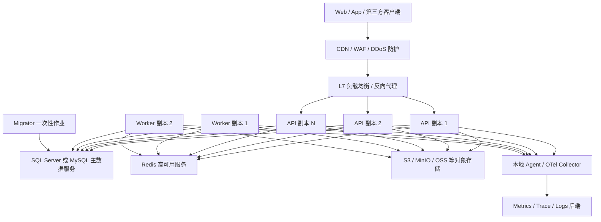

# 高并发模块化单体多实例改造评估与路线建议

- 日期：2026-08-01
- 状态：建议稿（静态评估，待后续讨论）
- 代码基线：`6e156f59c5ff314610c07d46472172a7a89d6e49`
- 任务快照：`high-concurrency-multi-instance-assessment-20260801`
- 用户确认方向：成熟生产部署采用“强化型模块化单体 + 多实例运行”
- 范围：API、Worker、Migrator、数据库、Redis、缓存、Outbox、Jobs、Audit、日志、文件、Realtime、限流、健康检查和发布拓扑
- 上游依据：[`ADR-0002`](../architecture/adr/ADR-0002-modular-monolith-evolution.md)、[Full.NET 总体架构规格](../superpowers/specs/2026-07-17-fullnet-architecture-design.md)、用户提供的 `2026-08-01-fullnet-high-concurrency-risk-analysis.md` 与本轮讨论
- 决策边界：本文扩展已批准的模块化单体方向，但不是替代 Spec、ADR 或可直接执行的实施计划，也不证明 `1 万在途请求` 已通过生产等价压测

## 1. 文档目的

Full.NET 已经选择强化型模块化单体，并将 API、Worker、Migrator 作为运行角色分离。高并发改造不应把这一架构推翻为全面微服务，而应先把同一模块化单体发布物建设成可安全横向扩展、可滚动发布、可故障恢复、可容量证明的多实例系统。

本文把“单体 1 万个同时在途动态请求”的目标转换为成熟生产拓扑、框架不变量、当前缺口、分阶段改造建议和验证门禁。所有吞吐、实例数量、连接池和硬件结论仍须由目标环境压测校准。

## 2. 总体判断

### 2.1 推荐方向

推荐保持：

```text
一个模块化单体代码库
+ 一个 API 发布角色，可部署多个副本
+ 一个 Worker 发布角色，可部署多个副本
+ 一个 Migrator 一次性发布作业
+ 共享数据库、Redis、对象存储和可观测平台
```

这里的“单体”表示业务模块默认同进程、同发布边界运行，不表示只能有一个进程或一台服务器。成熟部署应使用同一 API 制品的多个无状态副本，通过负载均衡共同服务；Worker 使用数据库租约和幂等语义安全运行多个副本。

### 2.2 不推荐方向

当前不建议：

- 为了名义并发提前把每个业务模块拆成微服务；
- 每个模块复制一套数据库、消息、部署和运维体系；
- 将 API、Migration、Seed、Outbox、Jobs 全部塞回一个进程；
- 依赖粘性会话掩盖普通 HTTP API 的节点本地状态；
- 只增加 API 副本而不计算数据库连接池、Worker 并发和 Redis/文件共享边界；
- 用无限重试、无限队列或无限连接池掩盖下游饱和；
- 在没有真实瓶颈证据前引入 Kafka、CDC、服务网格或分布式事务。

## 3. 推荐生产拓扑



### 3.1 基础拓扑原则

1. API 至少两个副本才具备节点故障下的服务连续性；目标容量按 N+1 预留，而不是让所有副本长期跑满。
2. Worker 与 API 使用独立进程和资源预算。Worker 副本数由 backlog、最老消息年龄、Handler 时延和数据库容量决定，不跟随 API 副本机械扩容。
3. Migrator 是发布前或发布流程中的一次性作业，任何 API/Worker 副本都不得启动时自动迁移。
4. 数据库、Redis、对象存储和可观测后端是独立生产依赖，不与任一应用实例的生命周期绑定。
5. AppHost 继续用于本地 Aspire 编排和开发体验，生产副本、滚动发布、密钥和存储由正式部署平台管理。

## 4. 运行角色与职责

| 角色 | 副本策略 | 允许职责 | 禁止职责 |
| --- | --- | --- | --- |
| API | 多副本，无状态，N+1 容量 | HTTP、认证授权、查询、命令、SignalR Hub | Migration、Seed、可靠后台消费、节点本地会话事实 |
| Worker | 一个或多个副本，数据库租约竞争 | Outbox、Jobs、通知、文件修复与受控后台处理 | HTTP API、Migration、无界并发 |
| Migrator | 每次发布一个受控作业 | DbUp、生产安全 Baseline、显式环境 Overlay | 长期运行、承载业务流量 |
| AppHost | 开发/测试编排 | 本地依赖与启动顺序 | 生产业务能力和隐式生产控制面 |

业务模块仍默认由 API 同进程装配。Worker 只通过 Host Profile 装配后台所需能力，不因为多实例而为每个模块机械创建独立服务或项目。

## 5. 当前能力与多实例缺口

| 领域 | 当前事实 | 多实例判断 |
| --- | --- | --- |
| 模块边界 | ADR-0002、Composition、Host Profile 和架构测试已建立 | 正确基础，继续保持 |
| API/Worker/Migrator | 已有独立宿主和职责边界 | 正确基础，缺生产副本编排和滚动发布验证 |
| Outbox | 数据库租约、主动续租、至少一次、Handler 幂等门禁、死信和 backlog 指标已实现 | 具备多 Worker 正确性骨架，默认并发仍保持 1，缺生产等价多副本容量闭环 |
| Jobs | SQL Server/MySQL 非阻塞领取、租约、重试和 backlog 治理已建立 | 具备多 Worker 骨架，副本和并发仍须服从数据库预算 |
| FusionCache | L1/L2、Redis、Backplane 和可靠性指标已建立 | 可作为多实例缓存基础，安全关键缓存仍须验证撤销和源故障 fail-closed |
| SignalR | Redis Backplane、健康探针和跨 Host 发布边界已建立 | 可横向扩展，但生产需明确会话亲和或 WebSockets-only/SkipNegotiation 条件 |
| 健康检查 | `/health/live`、`/health/ready`、`/health/startup` 已分离并禁止空检查假绿 | 正确基础，需要按必需/可降级依赖复核驱逐语义 |
| Trusted Proxy | 已有受信代理和 Forwarded Headers 边界 | 正确基础，生产必须配置精确代理 IP/CIDR 和层数 |
| 日志 | 有界非阻塞双通道、低基数指标和结构化 stdout | 正确骨架，缺完整分类、采样、持久 Spool 和中央存储闭环 |
| Data Protection | Identity 当前只调用 `AddDataProtection()` | P0 缺口：没有显式共享 Key Ring 和稳定应用标识，多节点间受保护数据可能无法互解 |
| 全局限流 | 当前 ASP.NET Core 固定窗口计数位于 API 进程内 | P0 缺口：副本增加后总额度随副本数放大，不能替代边缘全局限流和 DDoS 防护 |
| Files | 当前正式 Provider 是节点本地目录 | P0 缺口：上传节点和下载节点可能不同，本地盘不能作为多 API 副本共享事实源 |
| 生产部署资产 | 基线未发现 Dockerfile、Compose、Kubernetes/Helm 或等价生产编排清单 | P0/P1 缺口：多实例拓扑仍主要停留在规格和代码能力层 |

## 6. 多实例必须保持的不变量

### 6.1 API 无状态化

普通 HTTP 请求在任一健康 API 副本上都必须得到等价结果：

- 认证会话、Refresh Session、安全戳和租户状态来自可靠共享存储；
- 不把业务状态、幂等记录、用户会话或上传结果只保存在进程内字典；
- L1 Cache 只是加速层，不能独立作出安全关键的陈旧决策；
- 节点重启或请求切换到另一副本不得造成登录失效、权限漂移、文件不可见或重复业务副作用；
- 普通 HTTP 不依赖 Sticky Session；SignalR 是单独的长连接例外。

### 6.2 共享 Data Protection Key Ring

多 API 副本必须共享 ASP.NET Core Data Protection Key Ring，并设置稳定 `ApplicationName`/Application Discriminator。Key Ring 必须：

- 存放在所有 API 副本都可访问的持久存储；
- 静态加密并限制读写权限；
- 支持密钥轮换、历史密钥读取、备份和恢复；
- 在蓝绿/滚动发布时保持新旧版本兼容；
- 不依赖单节点用户目录、容器临时盘或易丢失的无持久 Redis。

最终存储可评估数据库、对象存储、加密文件共享或具备可靠持久化的 Redis Provider，但选择前必须完成安全、恢复和许可评审。

### 6.3 数据与事务

- 每个模块继续拥有自己的表，多个 API 副本共享同一业务事实源，不共享模块内部模型。
- 业务数据和 Outbox 保持同一本地数据库事务，不引入跨节点分布式事务。
- 所有并发写入依赖数据库约束、条件更新、版本/幂等键等可靠机制，不能依赖单进程锁。
- 应用端 UUID v7 继续保证多副本主键生成无需中心序列。
- 发布第二个事件或 API 版本时保持兼容窗口，滚动发布期间新旧副本可以并存。

### 6.4 时间与租约

Outbox、Jobs、Session、Token、缓存和清理任务均依赖时间边界。生产节点必须统一 UTC、可靠时间同步和时钟漂移告警。租约仍需通过数据库持久状态和所有权条件验证，不能只相信本机内存计时器。

## 7. 入口流量、限流与负载保护

### 7.1 两层保护

成熟部署建议同时具备：

1. 边缘/负载均衡层：WAF、DDoS 防护、全局速率限制、连接和请求体上限、恶意流量过滤。
2. 应用实例层：按 Endpoint 成本设置并发限制、局部速率限制、超时、取消和无排队或短有界排队。

当前进程内固定窗口可以保留为单实例保护和纵深防御，但不能被描述为跨副本全局额度。用户/IP 等动态分区还必须防止攻击者制造无限高基数分区。

### 7.2 反向代理与连接管理

- 只信任精确的代理地址和转发层数，限流、审计和安全跳转只读取规范化后的连接信息。
- 为请求头、请求体、上传大小、Header 超时、Keep-Alive 和 WebSocket 设置场景化边界。
- 反向代理与 API 同时支持连接排空。实例进入终止阶段后先停止接收新流量，再等待有界在途请求完成。
- 不用粗暴提高线程池最小线程数掩盖同步 I/O、数据库等待或下游超时。
- 对外 HTTP 依赖使用统一连接池、DNS 更新、超时、取消和有限重试；只有幂等且明确瞬时失败的操作允许自动重试。

### 7.3 容量与负载卸载

API 扩容不能只看 CPU。至少同时观察：

- 当前在途请求、RPS、错误率和 P95/P99；
- ThreadPool queue、GC pause、分配率和进程内存；
- 数据库连接等待、命令超时、锁等待与日志刷盘；
- Redis 延迟、重连和 Backplane 状态；
- 下游 HTTP/文件/实时依赖延迟；
- 日志队列和 Audit 写入延迟。

当数据库、Redis或下游已饱和时，继续增加 API 副本会放大故障。此时应限流、负载卸载和降低 Best Effort 遥测，而不是继续横向增加连接生产者。

## 8. 数据库与连接池预算

### 8.1 数据库仍是首要容量中心

多实例模块化单体通常首先受共享数据库约束。生产数据库应与应用分离部署，使用企业级低延迟存储、备份、恢复演练和适合 Provider 的高可用方案。高写入场景应保护事务日志路径；SQL Server 关注数据/日志/TempDB，MySQL 关注表空间、Redo/Undo/Binlog。

当前阶段不默认引入读写分离。只有读热点、复制延迟容忍度、事务后读一致性和故障切换都得到真实证据后，才评估只读副本。

### 8.2 总连接预算

连接池必须按整个部署而不是单进程计算：

```text
总潜在连接
≈ API副本数 × API单副本池上限
 + Worker副本数 × Worker单副本池上限
 + Worker Handler/续租/观测额外连接
 + Migrator、运维与故障切换保留
```

该总量必须低于数据库可稳定承载连接数，并保留故障恢复与管理通道余量。禁止每增加一个副本都沿用过大的默认池上限。

### 8.3 SQL 与查询形状

- 新的高流量列表默认使用稳定游标/Seek 分页，兼容接口才保留受限 OFFSET。
- `contains`、审计和历史查询必须有时间窗、数据上限和索引证据。
- Dapper 指标以稳定 StatementName、Provider、操作和结果聚合，禁止原始 SQL、用户、租户和异常消息标签。
- SQL Server/MySQL 分别建立容量基线、执行计划、锁等待和连接等待看板，不能把一库结果外推到另一库。
- 请求链优先减少数据库往返、缩小事务范围和消除 N+1，不先追求纳秒级对象映射优化。

## 9. Redis、缓存与一致性

Redis 在多实例模式承担分布式缓存、FusionCache Backplane 和 SignalR Backplane 等共享能力，应独立部署并根据环境配置持久性、复制、故障切换和容量告警。

必须保持：

- L1 为节点本地热点加速，L2/Backplane 负责跨节点收敛；
- 缓存键包含环境、模块、作用域和租户边界；
- 安全关键数据源故障时保持 fail-closed，不让陈旧 L1 独立授权；
- TTL、Jitter、Fail-Safe、空值缓存和分布式失效都有明确类别策略；
- 热点 Key、缓存击穿、批量失效、Redis 重连和广播风暴有低基数指标；
- Redis 不作为业务事实源，清空缓存后系统仍能从数据库正确恢复。

如果缓存与 SignalR 共享同一 Redis，必须分别设置键/Channel 前缀并验证二者峰值不会相互挤占；达到独立容量或故障隔离门槛后再物理拆分 Redis 资源。

## 10. Outbox、Jobs 与后台资源池

### 10.1 多 Worker 正确性

当前优先保持数据库租约方案，不默认增加 Redis Leader Election：

- 多 Worker 通过 SQL Server `UPDLOCK/READPAST` 或 MySQL `FOR UPDATE SKIP LOCKED` 竞争领取；
- 批次租约主动续期，进程崩溃后由其他副本回收；
- Handler 必须声明自然幂等或 MessageId 持久去重；
- 至少一次语义、重复窗口、死信和人工重放边界保持明确；
- 默认 `MaxConcurrency=1`，只有双库容量证据证明正确性和收益后逐级上调。

### 10.2 扩缩容指标

Worker 扩缩容优先使用：

- backlog 数量；
- 最老消息/任务年龄；
- 领取、处理和失败吞吐；
- Handler P95/P99；
- 租约续期失败、重复、死信和恢复时间；
- 数据库连接、锁和下游容量。

不能按 API CPU 或请求数机械扩 Worker。增加 Worker 会同步增加领取 SQL、续租连接和下游并发，必须纳入数据库总预算。

### 10.3 后续资源隔离候选

如果证据表明 Outbox、Jobs、Notifications、Files Maintenance 之间持续争抢资源，可在同一代码库和模块边界下增加受控 Worker Capability Profile，使不同后台工作负载使用不同副本池和资源限制。这是运行角色细分，不自动构成业务微服务拆分；实现前仍需 Spec、依赖图和架构测试。

## 11. Audit、日志和可观测性

日志专项结论以 [`logging-foundation-high-concurrency-assessment-2026-08-01.md`](logging-foundation-high-concurrency-assessment-2026-08-01.md) 为当前讨论基线。

整体方案保持：

- Access 遥测、Diagnostic、Operational Priority、Security 和 Durable Audit 分离；
- 合规与领域 Audit 继续进入数据库事务或 Outbox，不能以普通异步日志替代；
- HTTP Audit 当前仍在请求退出前完成一次批量数据库提交尝试，必须纳入 2K/5K/10K 请求链 P99 对比；
- Metrics 使用低基数标签，Trace 受控采样，日志使用结构化字段和有界非阻塞队列；
- 每个副本携带稳定 `service.name`、`service.version`、`deployment.environment` 和 `service.instance.id`；
- 日志、Trace 和 Metrics 经本地 Agent/Collector 汇聚，不能让远端可观测平台故障阻塞业务线程；
- Readiness 只反映真正阻止该实例安全接流量的依赖，普通日志后端故障应告警和降级，避免所有副本同时被驱逐。

必须建立按实例、按角色和全局聚合的看板，避免把每个 Worker 对同一共享 backlog 的 Gauge 相加。

## 12. Files 与对象存储

当前 `LocalHostFileBlobStorage` 适合开发、测试或明确单节点部署，不适合作为多 API 副本的生产默认事实源。成熟多实例生产应使用所有副本共享的对象存储 Provider，例如 S3、MinIO 或云对象存储。

对象存储改造必须保持：

- 数据库元数据与对象写入之间的提交、补偿和对账状态机；
- 上传大小、Content-Type、哈希、病毒/内容检查和权限边界；
- 对象 Key 由服务端生成，禁止客户端指定物理路径；
- 下载可通过 API 授权后流式返回或生成短期签名地址；
- 删除、失败重试、孤立对象清理和 Pending 对账幂等；
- API 节点终止不丢失已经确认成功的文件；
- 文件大流量不占满普通 API 的线程、连接、内存和出口带宽预算。

如果短期继续使用本地 Provider，多 API 副本只能挂载经过验证的共享存储，并接受其锁、性能和故障域；不能让每个副本使用各自独立目录。

## 13. Realtime 与 Notifications

Realtime 保持“即时投递通道，不是可靠业务事实源”：

- 可靠通知先写业务状态/Outbox，再由 Worker 发布 SignalR；
- Redis Backplane 负责跨 API 副本转发，不提供离线消息可靠存储；
- 客户端断线后通过业务查询、未读状态或补发机制恢复，而不是要求 Backplane 重放；
- Hub 连接、组名和消息保持租户边界、大小限制和频率限制；
- 连接数、消息速率、重连、发送失败、Redis 延迟和每实例内存独立容量化。

使用 Redis Backplane 且允许 Long Polling/SSE/协商时，负载均衡通常需要 SignalR Session Affinity。只有全部客户端固定 WebSockets 且启用 SkipNegotiation，或改用托管 SignalR 服务，才可按相应条件取消应用层亲和。普通 HTTP API 仍不依赖亲和。

Realtime 连接规模显著大于动态请求规模时，应单独建立连接容量与消息容量，不把“1 万 SignalR 空闲连接”与“1 万在途动态请求”混为同一指标。

## 14. 发布、滚动升级与故障恢复

### 14.1 发布顺序

候选的零停机发布顺序：

```text
构建一次不可变制品
-> 备份与发布前检查
-> 执行 Expand 迁移
-> 先部署兼容新旧事件/契约的 Worker 消费者
-> 滚动部署 API 生产者
-> 等待旧 API/Worker 排空并停止
-> 观察错误率、P99、backlog、缓存和实时链路
-> 在后续独立窗口执行 Contract 迁移或退役旧版本
```

数据库变更遵循 Expand -> Backfill/Migrate -> Contract，不能在新旧副本并存期间直接删除旧列、旧事件 Handler 或旧 API 字段。

### 14.2 健康与排空

- `live` 只判断进程是否需要重启，不探测所有外部依赖。
- `startup` 判断必要初始化和模式检查是否完成。
- `ready` 判断实例是否能安全接收新流量，并以短超时、无副作用方式检查必要依赖。
- 实例终止时先从负载均衡摘除，再进行有界请求、日志和后台批次排空。
- SignalR、上传和长请求需要独立的连接排空预算；超时后客户端必须能重连或重试。
- Redis/日志/通知等可降级依赖的失败是否影响 ready，必须按业务正确性逐项决定，禁止一个共享依赖抖动同时驱逐全部 API 副本。

### 14.3 高可用与灾备

多 API 副本只解决应用节点故障，不自动解决数据库、Redis、对象存储、负载均衡和机房故障。生产方案还需分别定义：

- 数据库复制/集群、自动或人工切换、RPO/RTO、备份与恢复演练；
- Redis 复制、持久化、故障切换和缓存重建；
- 对象存储冗余、版本、生命周期和恢复；
- 配置与 Secret 备份、轮换和最小权限；
- 日志/Trace/Metrics 平台不可用时的有界降级；
- 单可用区、多可用区或双机房的真实故障域。

## 15. 容量模型与实例数量

### 15.1 API 副本计算

不要直接写死“1 万并发必须 N 台”。候选计算为：

```text
所需工作副本
= ceil(目标 RPS / 单副本认证稳定 RPS)

生产副本
= 所需工作副本 + 节点故障/滚动发布保留
```

单副本认证稳定 RPS 必须同时满足错误率、P95/P99、CPU、内存、GC、线程池、连接池和数据库/Redis预算，不能取短时峰值。副本长期目标利用率应保留故障和流量突发空间，具体比例由压测冻结。

### 15.2 并发与 RPS

```text
RPS ≈ 在途请求数 / 平均响应时间（秒）
```

`10000` 在途请求在 `500ms` 平均响应时间下约为 `20000 RPS`，在 `200ms` 下约为 `50000 RPS`。因此压测必须声明请求类型、读写比、响应时间、Payload、认证方式、缓存冷热和后台负载，不能只写“并发 10000”。

### 15.3 建议验证台阶

| 阶段 | 目标 | 主要结论 |
| --- | --- | --- |
| 单副本基线 | 找出单 API/单 Worker 的稳定容量和首个瓶颈 | 建立扩容分母，不代表生产高可用 |
| 双副本正确性 | 验证跨节点会话、缓存、文件、Realtime、限流和滚动发布 | 证明多实例语义正确 |
| 2K 在途 | 验证 Audit、数据库、连接池和 P99 | 冻结第一组默认值 |
| 5K 在途 | 验证数据库/Redis/Worker 复合压力和恢复 | 判断是否需要资源隔离 |
| 10K 在途 | 目标拓扑、N+1、副本故障和长时稳定性 | 才能形成目标容量声明 |

每一级都必须同时运行 SQL Server 与 MySQL 的代表场景，但两个 Provider 可以得到不同的认证容量和默认建议。

## 16. 分阶段改造路线候选

### P0：先完成多实例正确性

1. 共享并保护 Data Protection Key Ring，验证跨 API 副本登录、TOTP/受保护数据和滚动密钥。
2. 将生产 Files 默认迁移到共享对象存储，完成跨节点上传/下载/删除/补偿验证。
3. 将“全局额度”放到边缘层，保留应用内并发保护，验证副本数变化不放大安全额度。
4. 明确 SignalR Session Affinity 或 WebSockets-only/SkipNegotiation/托管服务策略。
5. 冻结 API、Worker、Migrator 和 AppHost 的生产职责，不允许 API 自动迁移或消费可靠后台任务。

### P1：封板资源预算与降级

1. 建立整个拓扑的数据库连接池公式、角色配额和故障保留。
2. 冻结 Outbox/Jobs Batch、Poll、Lease、Retry 和默认并发；保持默认并发 1，按证据升级。
3. 完成 Audit 请求链、稳定分页、热点 Statement 和双库执行计划治理。
4. 建立 Redis、缓存失效、SignalR 重连、文件传输和下游 HTTP 的容量与故障指标。
5. 按日志专项建议完成分类、采样、持久 Spool 和压力状态。
6. 为应用、数据库、Redis、对象存储设置超时、重试、熔断/降级和负载卸载边界。

### P2：生产交付工程化

1. 提供至少一种正式生产部署资产，例如 Kubernetes/Helm 或受支持的 Linux 容器/进程编排方案。
2. 固化非 root、只读文件系统、资源 requests/limits、Secret 注入、探针、排空和滚动策略。
3. 建立 Expand/Contract 数据库发布、消费者先行、旧版本排空和回滚门禁。
4. 建立数据库、Redis、对象存储和可观测平台的备份、故障切换与恢复演练。
5. 建立容量档位配置和不可随意上调的变更审批/验证规则。

### P3：分台阶容量认证

1. 完成单副本与双副本 A/B 基线。
2. 完成 2K、5K、10K 在途请求的逐级压测和长时间 Soak。
3. 每级注入一个 API 副本退出、一个 Worker 副本退出、Redis 抖动、日志平台中断和数据库慢化。
4. 分别记录 SQL Server/MySQL 的吞吐、错误率、P50/P95/P99、锁、连接池、CPU/IO 和恢复时间。
5. 只有通过同环境重复验证后，才能发布容量、实例数量和硬件建议。

### P4：按证据隔离，而非提前微服务化

只有证据显示某个工作负载持续具有独立伸缩或故障隔离需求时，优先依次评估：

1. 调整 Endpoint/查询/事务和缓存形状；
2. 独立 Worker Capability Pool；
3. Files/Realtime/静态资源的基础设施卸载；
4. 数据库资源治理、归档或只读副本；
5. 事务 Outbox + CDC/Kafka；
6. 最后才按 ADR-0002 门禁评估局部业务服务拆分。

## 17. 验证矩阵

### 17.1 多实例正确性

- 同一登录/受保护数据在不同 API 副本间往返成功；
- Refresh、Logout、撤销、安全戳和租户切换跨节点保持一致；
- 缓存变更在多个 API/Worker 副本间按 SLA 收敛；
- 文件在副本 A 上传后可由副本 B 下载、删除和对账；
- SignalR 客户端跨节点连接、发布、断线重连和 Redis 恢复正确；
- 全局限流不因 API 副本数增加而倍增；
- Outbox/Jobs 多 Worker 不丢失，重复符合至少一次和幂等边界；
- 一个副本退出不会让其他副本接受到无法处理的本地状态引用。

### 17.2 性能与稳定性

- 热/冷缓存、读多写少、混合写、上传、通知、Outbox/Jobs 积压等代表场景；
- 预热、稳定采样、峰值、突发和长时间 Soak；
- 吞吐、错误率、P50/P95/P99、分配、GC、ThreadPool、Socket 和内存；
- 数据库 CPU/IO、锁、事务日志、连接池等待、命令超时；
- Redis 延迟、重连、命中、失效广播和 SignalR 消息；
- backlog 数量/年龄、租约、续租、重试、死信、重复和恢复时间；
- 日志事件/秒、字节/秒、队列、丢弃、Spool 和 Audit P99。

### 17.3 故障与发布

- API/Worker 优雅退出和强制终止；
- 新旧版本并存、滚动发布、失败回滚和数据库 Expand/Contract；
- 数据库慢查询、连接耗尽、主节点切换和恢复；
- Redis 中断、重连、缓存重建和 Backplane 恢复；
- 对象存储超时、部分上传、删除失败和孤立对象对账；
- Collector/日志后端中断、磁盘高水位和跨重启重放；
- 负载均衡摘除、Readiness 抖动和连接排空。

## 18. 停止条件

出现以下任一情况时停止扩大并发或副本数：

- 错误率、P99、恢复时间或重复副作用超过预算；
- 数据库连接、锁、事务日志或 IO 已饱和；
- 安全撤销、租户隔离、Audit/Outbox 可靠性出现退化；
- 仅 SQL Server 或仅 MySQL 取得结果，却试图声明双库通用容量；
- 多实例依赖节点本地 Data Protection、文件、会话或内存锁；
- Worker 扩容使 backlog 短时下降，但数据库/下游进入更严重抖动；
- Readiness 配置导致共享依赖抖动时所有副本同时被驱逐；
- 需要引入 Broker、CDC、读写分离或服务拆分但尚无独立 ADR/Spec 和恢复设计。

## 19. 待继续讨论的决策

1. 首个正式生产基线选择 Kubernetes、Docker + systemd/Compose，还是其他编排平台。
2. API 目标 SLO：错误率、P95/P99、单请求超时和最大在途时间。
3. 代表性 10K 场景的平均响应时间、目标 RPS、读写比、Payload 和功能组合。
4. Data Protection Key Ring 最终使用何种持久存储、静态加密和恢复方式。
5. Files 首个生产对象存储 Provider 选择 MinIO/S3、云 OSS 或其他实现。
6. 全局限流由云 WAF、Nginx/HAProxy、API Gateway 还是独立分布式 Provider 承担。
7. SignalR 使用 Session Affinity、WebSockets-only + SkipNegotiation，还是托管 SignalR 服务。
8. SQL Server/MySQL 各自的高可用拓扑、连接上限、RPO/RTO 和备份恢复目标。
9. Redis 是否先共享 Cache/Realtime，还是从首版就物理隔离，并选择何种高可用方式。
10. API/Worker 最小副本、每副本 CPU/内存和 N+1 故障保留如何定义。
11. Access/Operation/Exception Audit 的最终可靠性与 P99 预算。
12. 日志中央后端、持久 Spool、Trace/Metrics 后端与数据保留周期。
13. 是否需要 Worker Capability Profile，以及首个需要隔离的工作负载。
14. 发布平台如何执行 Migrator 单例、消费者先行、连接排空和自动回滚。

这些决策确认后，应优先更新现有总体架构 Spec 的部署与高并发章节，避免创建竞争事实源。Data Protection、对象存储、全局限流、生产编排和灾备等高迁移成本决策如存在多个可行方案，应分别评估是否需要 ADR；随后再生成唯一活动实施计划。

## 20. 官方参考

- Microsoft： [Host ASP.NET Core in a web farm](https://learn.microsoft.com/aspnet/core/host-and-deploy/web-farm?view=aspnetcore-10.0)
- Microsoft： [Configure ASP.NET Core Data Protection](https://learn.microsoft.com/aspnet/core/security/data-protection/configuration/overview?view=aspnetcore-10.0)
- Microsoft： [ASP.NET Core Data Protection key storage providers](https://learn.microsoft.com/aspnet/core/security/data-protection/implementation/key-storage-providers?view=aspnetcore-10.0)
- Microsoft： [ASP.NET Core rate limiting middleware](https://learn.microsoft.com/aspnet/core/performance/rate-limit?view=aspnetcore-10.0)
- Microsoft： [ASP.NET Core SignalR production hosting and scaling](https://learn.microsoft.com/aspnet/core/signalr/scale?view=aspnetcore-10.0)
- Microsoft： [Health checks in ASP.NET Core](https://learn.microsoft.com/aspnet/core/host-and-deploy/health-checks?view=aspnetcore-10.0)
- OpenTelemetry： [Collector Resiliency](https://opentelemetry.io/docs/collector/resiliency/)

## 21. 当前验证状态

- 本文交叉核对了批准的模块化单体 ADR、总体架构规格、现有 Host、Data Protection、限流、Files、Outbox、Jobs、FusionCache、Realtime、健康检查、日志与运维资料。
- 当前基线已经具备模块化单体、角色分离和多个多实例正确性组件，但不等于完整生产多实例拓扑已经部署或验证。
- 本次没有修改代码、SQL、配置、迁移或运行时行为。
- 本次没有执行 Release 构建、SQL Server/MySQL Integration、性能压测、故障注入或真实滚动发布；文中的拓扑、阶段和实例模型均为候选建议。
- 当前没有证据支持承诺固定实例数量、固定硬件即可稳定承载 1 万在途请求。
- 本次未发现需要升级 `rules/` 或项目 Skill 的新缺口。
