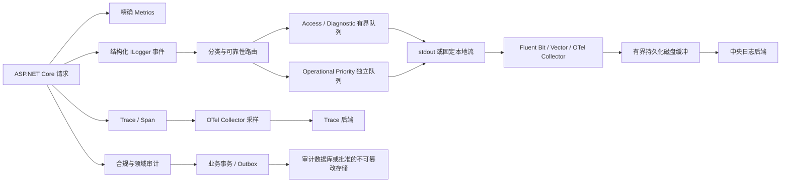

# 日志基础设施高并发评估与讨论基线

- 日期：2026-08-01
- 状态：建议稿（静态评估，待后续讨论）
- 代码基线：`6e156f59c5ff314610c07d46472172a7a89d6e49`
- 任务快照：`logging-foundation-analysis-20260801`
- 范围：Full.NET 日志分类、诊断日志、容量档位、过载降级、存储与采集边界
- 上游输入：用户提供的 `2026-08-01-fullnet-high-concurrency-risk-analysis.md`、当前仓库实现、既有日志验证记录和本轮讨论
- 决策边界：本文不是最终架构 Spec、ADR 或实施计划，不代表相关能力已经批准、实现或通过生产等价压测

## 1. 文档目的

Full.NET 的目标是以强化型模块化单体承载约 `1 万个同时在途动态请求`。日志是请求链、故障定位、安全审计和容量治理的基础设施，如果分类、背压或保存策略设计错误，日志 I/O、序列化分配、队列积压和审计数据库写入会放大 P95/P99，甚至在故障期间反向拖垮业务线程。

本文先固化本轮已经形成的分析共识，作为后续继续讨论和形成最终框架改造方案的输入。本文只登记当前事实、候选方向、风险和待决策项，不把建议写成已实现能力。

## 2. 本轮需求与讨论范围

当前讨论覆盖：

1. 日志按严重级别和用途分类，并明确不同类别的可靠性与保存策略。
2. 支持 `<1K`、`1K~5K`、`5K~10K`、`10K~50K`、`50K~100K`、`>100K` 在途请求的部署容量档位。
3. 日志模块不得阻塞 ASP.NET Core 请求线程，不得用无界内存换吞吐。
4. 程序员可在代码中增加 `Debug`/`Trace` 诊断埋点，并按稳定逻辑分组统一查看。
5. 代码只声明日志语义和逻辑分组，不直接指定任意物理文件路径。
6. 生产环境默认关闭诊断日志；线上排障只能按类别、限时、限速、可审计地开启。
7. 普通日志、访问遥测、安全审计和可靠业务事实必须保持不同的可靠性语义。

## 3. 当前 Full.NET 已有基础

### 3.1 Serilog 双通道

当前三个官方宿主通过 `AddFullNetServiceDefaults()` 使用统一日志管道：

| 通道 | 当前等级 | 默认容量 | 满载行为 |
| --- | --- | ---: | --- |
| `general` | `Information`、`Warning` | 10000 | 非阻塞丢弃新增事件并累计指标 |
| `high_priority` | `Error`、`Critical` | 1000 | 非阻塞丢弃新增事件并累计指标 |

已有能力包括：

- Error/Critical 与普通日志具有独立容量和后台 Worker。
- 队列写入固定使用非阻塞 `TryAdd`，配置为阻塞时启动失败。
- 两条通道共享有界退出排空预算。
- 单条 Sink 异常会计入 dropped，并且不会永久终止消费 Worker。
- 已暴露队列深度、容量和丢弃数量等低基数指标。
- Compact JSON 当前写入标准输出，由部署平台负责后续采集。

既有事实源：

- [`../operations/logging-degraded-mode.md`](../operations/logging-degraded-mode.md)
- [`high-priority-logging-channel-2026-07-26.md`](high-priority-logging-channel-2026-07-26.md)
- [`bounded-logging-shutdown-2026-07-26.md`](bounded-logging-shutdown-2026-07-26.md)
- [`logging-sink-failure-isolation-2026-07-27.md`](logging-sink-failure-isolation-2026-07-27.md)

### 3.2 请求日志与 OpenTelemetry

当前请求日志使用 Serilog Request Logging，将 ASP.NET Core 多条请求过程日志收敛为一条请求完成事件，并携带请求方法、路径、状态码、耗时、TraceId、Host 和存在时的 TenantId。

当前宿主同时启用了 OpenTelemetry Metrics 和 Traces，并在配置 OTLP Endpoint 后导出；当前没有把应用日志作为 OTLP Logs 导出。

### 3.3 Audit 当前边界

Audit 已有批准规格 [`../superpowers/specs/2026-07-29-auditing-write-reliability-classification.md`](../superpowers/specs/2026-07-29-auditing-write-reliability-classification.md)：

- Access 是请求访问遥测，允许未来通过独立规格实施有界采样或过载丢弃。
- Operation 是安全审计摘要，禁止采样和不受控丢弃。
- Exception 是安全相关异常审计摘要，禁止采样和不受控丢弃。
- Identity、租户、配置、资金等领域审计继续与对应安全或业务状态共享事务。

当前 HTTP Audit 在请求退出前执行一次请求内批量数据库提交尝试。它消除了同一请求内三次独立写入，但仍位于请求生命周期，是高并发下需要专项测量的尾延迟和数据库竞争风险。

## 4. 容量口径

### 4.1 在途请求不等于日志事件速率

近似关系为：

```text
RPS ≈ 在途请求数 / 平均响应时间（秒）
```

假设 `10000` 个在途请求、平均响应时间 `500ms`，则约为 `20000 RPS`。如果每个请求只产生一条平均 `1KB` 的访问日志，则约为：

```text
20000 条/秒
约 20MB/秒
约 1.73TB/天原始日志
```

该估算尚未包含索引、复制、异常栈、Trace、审计和保存副本。因此不能把“1 万在途请求”直接解释为“1 万条日志/秒”，也不能只按在途并发自动选择日志模式。

### 4.2 正式定档指标

容量档位最终必须由以下指标共同决定：

- 接受前和采样后的日志事件/秒；
- 序列化后的平均与 P95 事件字节数；
- 每秒写入字节数和每天原始数据量；
- 应用内队列积压时间，而不只是事件数量；
- Sink/Agent/Collector 消费速率与导出延迟；
- 本地持久缓冲容量、最老事件年龄和磁盘高水位；
- 中央存储的写入、索引、查询和保留成本。

## 5. 日志分类模型

成熟分类至少需要四个互相独立的维度。

### 5.1 严重级别

| 级别 | 语义 | 生产默认 |
| --- | --- | --- |
| `Trace` | 循环内部、逐步骤、最细粒度状态 | 关闭 |
| `Debug` | 分支选择、关键中间值、诊断上下文 | 关闭 |
| `Information` | 正常流程中的观测事件 | 按类别和容量治理，禁止无条件全量 |
| `Warning` | 非预期但当前操作仍可继续 | 开启，但重复风暴需要聚合或限速 |
| `Error` | 当前操作失败 | 高优先级，错误风暴时保留准确计数和代表样本 |
| `Critical` | 进程、数据或系统级严重故障 | 高优先级并告警，但仍需外部探针兜底 |

严重级别只能表达事件严重程度，不能单独决定是否允许丢弃、保存多久或是否属于合规审计。

### 5.2 用途分类

| 用途 | 示例 | 默认通道 |
| --- | --- | --- |
| Access | Route、状态码、耗时、TraceId | 高容量可采样遥测 |
| Diagnostic | 分支、内部状态、临时排障 | 低优先级可丢弃 |
| Operational | 重试、降级、依赖故障、未处理异常 | 高优先级运行日志 |
| Business Telemetry | 订单创建、任务完成等观测事件 | 运行日志；不能代替业务事实 |
| Security | 登录失败、越权、攻击检测 | 高优先级或可靠安全流 |
| Compliance Audit | 权限、资金、删除、配置变更 | 数据库事务或 Outbox |
| Trace/Span | 请求与依赖调用链 | OTLP 采样管道 |
| Metrics | RPS、错误率、延迟和队列深度 | 聚合准确、低基数 |

### 5.3 可靠性分类

| 可靠性 | 适用内容 | 过载语义 |
| --- | --- | --- |
| Best Effort | Access 成功样本、Debug、Trace、普通诊断 | 可采样、限速或有指标地丢弃，永不阻塞请求 |
| Priority | Warning、Error、Critical、重要安全信号 | 独立容量；优先保留；故障风暴允许按稳定签名聚合 |
| Durable | 合规 Audit、可靠安全/业务事实 | 数据库事务、Outbox 或经批准的持久方案；禁止用普通日志队列替代 |

### 5.4 数据敏感度

日志还必须标记或治理公开、内部、机密和受限数据。密码、Token、Cookie、密钥、连接串、请求正文、完整 SQL 参数和个人敏感信息不得进入普通日志。TenantId、UserId、IP、User-Agent 等字段只能在明确用途下保存和受控索引，禁止作为 Metrics 高基数标签。

## 6. 候选目标管道



候选原则：

1. 业务代码继续只依赖 `ILogger<T>`，Serilog 作为 Provider 和管道路由实现。
2. 应用进程不在请求线程同步写远端日志、中央数据库或网络 Sink。
3. 容器优先输出结构化 stdout，由节点 Agent 采集；虚拟机或裸机可使用固定滚动文件或 journald 后再采集。
4. 应用内内存队列只吸收短时突发；连续平台不可用由有界磁盘 Spool 承担。
5. Audit 不经过 Best Effort 或 Priority 日志队列。
6. 引入磁盘 Spool、Broker 或新日志后端前，仍需 ADR/Spec 明确容量、加密、磁盘满、重复投递和恢复语义。

## 7. 容量档位候选值

以下百分比只是下一阶段压测的初始候选，不是已批准默认值或容量承诺。

| 档位 | 粗略在途范围 | 成功 Access 日志候选 | Trace 起始采样候选 | Debug/Trace |
| --- | ---: | ---: | ---: | --- |
| S | `<1K` | `25%~100%`，仍受事件/秒和成本上限约束 | `5%~10%` | 默认关闭，受控开启 |
| M | `1K~5K` | `10%~25%` | `2%~5%` | 默认关闭，受控开启 |
| L | `5K~10K` | `1%~5%` | `0.5%~2%` | 默认关闭，受控开启 |
| XL | `10K~50K` | `0.1%~1%` | `0.1%~0.5%` | 默认关闭，受控开启 |
| XXL | `50K~100K` | `0.01%~0.1%` | `0.01%~0.1%` | 默认关闭，受控开启 |
| Ultra | `>100K` | 默认不逐请求记录，仅保留少量代表样本 | 自适应采样 | 默认关闭，受控开启 |

所有档位保持以下不变量：

- Metrics 保持准确聚合，不按请求采样。
- Durable Audit 和关键领域事实不采样。
- 错误、慢请求和安全信号优先保留；发生错误风暴时以准确计数、第一批样本、最后样本和周期汇总控制原始事件量。
- 采样应优先使用 TraceId 等稳定输入做确定性决策，使日志与 Trace 可关联。
- Kafka/Broker 是否引入由重放、多消费者、跨系统解耦和可靠性要求决定，不以单一并发阈值决定。

## 8. 容量档位与运行压力状态分离

不建议根据瞬时在途请求数直接自动切换容量档，否则会产生策略抖动并静默改变日志语义。候选控制面分为：

1. `CapacityProfile`：部署时选择的 S/M/L/XL/XXL/Ultra 基线。
2. `PressureState`：运行期根据队列、Sink、Collector 和磁盘状态进入 Normal/Degraded/Critical。

候选状态逻辑：

| 状态 | 候选触发 | 允许动作 |
| --- | --- | --- |
| Normal | 队列与导出延迟处于预算内 | 执行容量档默认采样策略 |
| Degraded | 队列持续高位或导出持续变慢 | 关闭临时 Trace，降低成功 Access 和 Debug 采样 |
| Critical | 队列接近满载、发生丢弃或磁盘高水位 | 停止成功 Access/Diagnostic 原始事件，保留 Priority 和 Durable 语义并立即告警 |
| Recovering | 下游恢复但仍有持久积压 | 限速重放，避免恢复流量冲击业务和中央后端 |

状态切换必须设置持续时间、迟滞区间和最短驻留时间。压力状态只能收缩 Best Effort 类别，禁止改变 Durable Audit、安全和业务一致性语义。

## 9. 程序员诊断日志模型

### 9.1 分类

程序员在某行代码增加的内部状态、分支原因、变量摘要或逐步骤记录属于 Diagnostic：

- 关键分支和中间状态使用 `Debug`。
- 循环内部、逐条处理和极细步骤使用 `Trace`。
- 已发生重试、降级或非预期条件使用 `Warning`。
- 当前操作失败使用 `Error`。
- 业务事实、安全审计不能为了方便查询而降级为 Debug/Trace。

当前 Full.NET 全局最小等级为 `Information`，所以生产管道会在事件创建前过滤 `Debug`/`Trace`。程序员不得为了临时观察而把诊断事件伪装为 `Information`。

### 9.2 逻辑分组

代码不直接指定物理文件名，而是声明稳定语义：

- `EventId`
- `EventName`
- `SourceContext`，默认来自 `ILogger<T>`
- `LogClass=Diagnostic`
- 可选的低基数 `DiagnosticGroup`，例如 `order_pricing`、`payment_callback`
- `TraceId`/`SpanId`

`DiagnosticGroup` 必须来自受治理的稳定清单，禁止使用订单号、租户号、用户号、TraceId、任意路径或其他动态值作为分组名。

同类事件通过结构化查询统一查看，例如：

```text
LogClass = "Diagnostic"
AND DiagnosticGroup = "order_pricing"
AND EventName = "OrderAmountCalculating"
```

### 9.3 保存形式与位置

建议使用 Compact JSON/NDJSON，一条事件一行。候选字段包括 UTC 时间、Level、EventId、EventName、SourceContext、LogClass、DiagnosticGroup、TraceId、SpanId、稳定路由模板和受控业务标识。

| 环境 | 保存和查看方式 | 保留候选 |
| --- | --- | --- |
| 本地开发 | Console、Aspire Dashboard 或本地 Seq；可选固定 `diagnostic-.ndjson` | 1~3 天 |
| 测试/预发 | stdout/固定文件经 Agent 进入中央诊断流 | 3~7 天，待成本评估 |
| 生产 | 默认不产生 Debug/Trace；临时开启后进入独立低优先级 Diagnostic 流 | 1~3 天，自动到期 |

如确有本地物理文件需求，应由部署配置把有限的 `TargetKey` 映射到固定文件，例如 `logs/diagnostic/diagnostic-.ndjson`。禁止业务调用传入任意文件名或路径，避免文件句柄、锁竞争、滚动策略、路径注入和容器生命周期失控。

### 9.4 生产临时开启

候选控制必须同时包含：

- 精确 Category/DiagnosticGroup；
- `Debug` 或 `Trace` 最低等级；
- 自动过期时间；
- 采样率和每秒事件上限；
- 允许的 Endpoint、Trace 或其他受控范围；
- 操作人、原因和配置变更审计；
- 压力状态进入 Degraded/Critical 后的自动收缩。

禁止全局、无期限开启生产 Debug/Trace，禁止通过诊断开关停用合规和安全必需事件。

## 10. 对初始方案的校正

本轮确认以下方向正确：

- 结构化 JSON、TraceId 关联和每请求一条完成事件；
- 有界、异步、非阻塞生产者/消费者管道；
- 本地 Agent/Collector 与中央存储解耦；
- 框架噪声按 Category 提升级别；
- Trace 采样、Metrics 聚合和日志自监控。

需要校正：

1. `Information` 不能在高并发生产环境无条件全量开启。
2. Trace/Debug 是生产默认关闭，不是删除代码埋点；应允许受控、限时启用。
3. Error/Critical 也可能发生风暴，需要独立容量、准确计数和稳定签名聚合，不能假设永远低量。
4. 业务代码应依赖 `ILogger<T>`，不能直接绑定 Serilog 静态 API 或具体文件。
5. Async Sink 与内部 `buffered` 文件写入叠加可能形成双缓冲，扩大崩溃丢失窗口；必须按明确语义选择。
6. 本地文件加 Agent 适合虚拟机；容器更适合 stdout 加节点 Agent。应用文件不是可靠投递证明。
7. Audit 需要定义保留期、不可篡改、访问控制和到期清理，不应表述为永不轮转、永不删除。
8. OOM、磁盘满和进程崩溃时应用日志可能不可用，必须由宿主、系统指标、外部探针和 Crash Dump 兜底。

## 11. 当前差距与优先级候选

### P0：进入最终设计前必须决策

1. 将当前按严重级别路由升级为按用途和可靠性路由，避免 Access Information 挤占 Warning。
2. 明确 Access、Operation、Exception 和领域 Audit 的最终边界，保持已批准 Audit 规格不被静默削弱。
3. 决定生产主要部署形态：容器 stdout 还是虚拟机固定滚动文件，以及本地 Agent/Collector 责任。
4. 决定是否引入磁盘 Spool，并明确容量、加密、磁盘满、跨重启、重复投递和恢复限速语义。
5. 定义 EventId/EventName、LogClass、ReliabilityClass、DataClassification 和 DiagnosticGroup 的治理规则。
6. 定义成功 Access、Trace 和诊断日志的采样、慢请求保留、错误风暴聚合策略。

### P1：实现阶段候选

1. 为高频固定模板使用源生成 `LoggerMessage`，降低禁用与启用时的模板解析、装箱和分配。
2. 增加事件接受/拒绝/采样/丢弃、序列化字节数、最老积压年龄、Sink 延迟、磁盘积压和重放指标。
3. 请求聚合优先使用稳定路由模板 `http.route`，避免以含实体 ID 的原始路径做索引或指标标签。
4. 将不同逻辑流输出为可路由的固定 `log.stream` 或等价属性，而不是动态文件名。
5. 复核当前 `high_priority_logging` 对 ready 的影响。单纯日志平台故障不应轻易驱逐 API 实例并造成流量雪崩；只有资源安全或明确合规 fail-closed 策略才应影响 Readiness。
6. 建立诊断分组的权限、TTL、速率限制、审计和自动恢复机制。

## 12. 候选配置面

以下只表示能力边界，不冻结正式配置键或默认值：

```text
Logging
  CapacityProfile
  Streams
    Access
    Diagnostic
    OperationalPriority
  PressurePolicy
  Sampling
  DiagnosticGroups
  Redaction
  Retention
  Exporter
  Spool
```

后续正式设计必须避免：

- 代码直接选择物理文件；
- 运行时创建无界日志分组或 Sink；
- 任意配置把 Web 请求切换到同步网络/磁盘写入；
- 用容量档位关闭 Durable Audit；
- 把用户、租户、路径、异常消息放入 Metrics 标签；
- 把配置存在或日志文件存在误报为投递可靠。

## 13. 后续验证矩阵

最终框架方案落地前至少需要定义并执行：

1. 在目标硬件和 Release 配置下测量禁用日志、正常日志和故障日志三组基线。
2. 覆盖目标 RPS、事件/秒、平均/P95 事件大小、P50/P95/P99、CPU、分配、GC 和线程池等待。
3. 注入慢 Sink、Sink 异常、Collector 中断、网络中断、磁盘高水位、磁盘满、进程正常退出、强制终止和节点重启。
4. 验证队列永不阻塞请求线程，丢弃与采样指标准确，Priority 不被 Best Effort 挤占。
5. 验证 Spool 跨重启恢复、重复投递识别、恢复限速和中央后端过载。
6. 验证生产临时诊断按 Category/Group 精确开启、自动过期、权限审计和压力收缩。
7. 验证日志脱敏、CR/LF 等日志注入、字段长度、索引基数、访问控制和保留期清理。
8. 对 Access/Operation/Exception 的任何写链路变化执行 SQL Server/MySQL 成对验证，并确认领域 Audit 事务语义不退化。

正式性能门槛需要在下一阶段根据目标硬件和基线共同冻结。本文不预先承诺固定 QPS、固定缓冲容量或固定 P99 收益。

## 14. 待继续讨论的决策

1. 首个正式目标是否只覆盖单机/虚拟机，还是同时覆盖容器/Kubernetes。
2. 10K 在途目标的代表性平均响应时间、RPS、请求类型比例和每请求预期事件数。
3. 是否要求全量 Access 持久留痕；若要求，其合规依据、保存时间和独立存储预算是什么。
4. Operation/Exception 请求内数据库提交的 P99 预算，以及是否需要新的可靠异步设计。
5. 中央后端选择 Loki、Elasticsearch/OpenSearch、Seq 或其他平台的主要查询与保留需求。
6. 本地持久 Spool 的最长下游故障窗口、磁盘预算、加密和磁盘满策略。
7. Priority 事件在错误风暴中的去重签名、样本数量、周期汇总和告警规则。
8. DiagnosticGroup 采用集中清单、稳定常量还是专用日志类别类型，以及允许的最大分组数量。
9. 动态诊断开关由配置中心、管理 API 还是运维平台控制，以及权限和审计边界。
10. 日志、Metrics、Trace、Audit 的热/冷存储周期和访问权限矩阵。

这些决策确认后，再更新或创建正式 Spec；若磁盘 Spool、Broker、不可篡改存储或 Readiness 语义构成长期高迁移成本决策，还需同步评估 ADR。只有批准后的 Spec/ADR 才生成实施计划。

## 15. 官方与成熟生态参考

- Microsoft： [.NET 和 ASP.NET Core 日志](https://learn.microsoft.com/aspnet/core/fundamentals/logging/?view=aspnetcore-10.0)
- Microsoft： [.NET 高性能日志](https://learn.microsoft.com/dotnet/core/extensions/high-performance-logging)
- Microsoft： [ASP.NET Core HTTP Logging](https://learn.microsoft.com/aspnet/core/fundamentals/http-logging/?view=aspnetcore-10.0)
- Microsoft： [.NET Metrics Instrumentation](https://learn.microsoft.com/dotnet/core/diagnostics/metrics-instrumentation)
- Serilog： [Serilog.AspNetCore Request Logging](https://github.com/serilog/serilog-aspnetcore)
- Serilog： [Serilog.Sinks.Async](https://github.com/serilog/serilog-sinks-async)
- OpenTelemetry： [Sampling](https://opentelemetry.io/docs/concepts/sampling/)
- OpenTelemetry： [Collector Resiliency](https://opentelemetry.io/docs/collector/resiliency/)
- Fluent Bit： [Buffering and Storage](https://docs.fluentbit.io/manual/administration/buffering-and-storage)
- OWASP： [Logging Cheat Sheet](https://cheatsheetseries.owasp.org/cheatsheets/Logging_Cheat_Sheet.html)

## 16. 当前验证状态

- 本文完成了仓库静态实现、现有日志运维文档、日志 Verification、已批准 Audit 规格和本轮讨论的交叉核对。
- 本次没有修改代码、SQL、配置、迁移或运行时行为。
- 本次没有执行性能基准、负载测试、SQL Server/MySQL Integration 或故障注入；本文中的容量档位、采样率和目标管道均为候选建议，不是验证结论。
- 现有日志管道的 Build-verified 事实继续以既有 Verification 为准；磁盘 Spool、跨重启重放和外部投递确认仍未完成。
- 本次未发现需要升级 `rules/` 或项目 Skill 的新缺口。
